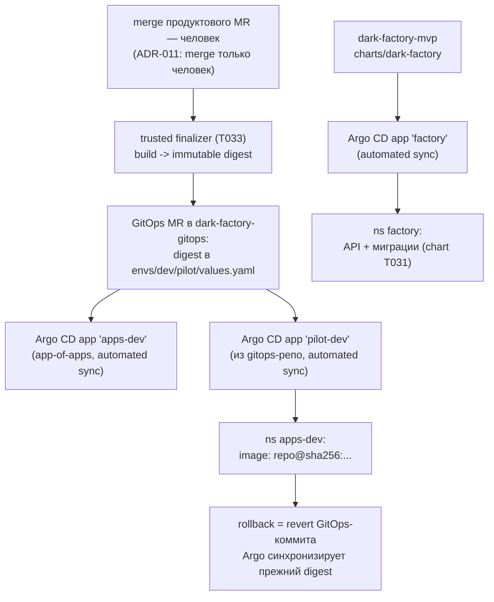

# Argo CD + GitOps (T032, ADR-010/ADR-011/ADR-015)

Argo CD в namespace `argocd` (установлен Helm-ом) и два root-приложения:
платформа `factory` из этого репозитория и app-of-apps `apps-dev` из
GitOps-репозитория `dark-factory-gitops` (read-only, желаемое состояние
окружений — ADR-015 п.1). Реализует docs T-043 поверх bootstrap T029
(namespaces, квоты, NetworkPolicy deny-by-default) и чарта T031
(`charts/dark-factory`).

## Архитектура потока релиза



| Компонент | Где | Файл |
|---|---|---|
| Values установки Argo CD (квота-aware, dex/notifications off) | `argocd` | `values-argocd.yaml` |
| Root-приложения `factory` и `apps-dev` (локальный chart) | `argocd` | `chart/` |
| Seed GitOps-репозитория (envs/dev + platform + правила) | — | `gitops-seed/` |
| Fixture GitOps-MR со сменой digest | — | `gitops-seed/examples/` |

Уровни: **этот репозиторий** владеет платформой (chart + Application `factory`);
**`dark-factory-gitops`** владеет окружениями (дочерние Applications + values с
digest). Границы зафиксированы ADR-015 п.1/п.6: runtime не импортирует gitops;
gitops ссылается только на immutable versions.

## Ключевые решения (и почему)

- **app-of-apps для `apps-dev`** (прямые Application в `argocd` рендерит
  локальный chart `chart/`): GitOps-репозиторий по ADR-015 — источник желаемого
  состояния окружений, включая сами Applications. Добавление продукта = MR в
  gitops-репозиторий, без изменений в платформенном репозитории; платформа и
  окружения развёртываются независимо. ApplicationSet-контроллер не
  используется (в MVP один пилотный продукт — YAGNI; контроллер всё равно
  развёрнут, т.к. в chart 10.x безусловный, но остаётся без объектов).
- **Источник Application `factory`** — этот репозиторий (`charts/dark-factory`,
  values `values-local.yaml`), а не OCI: OCI-публикация чарта в репозитории ещё
  не существует (образы — T033, чарт-OCI — пост-MVP/T-091). `targetRevision:
  main` у обоих root-приложений: оба trunk'а защищены (MR-only, squash, без
  force-push — ADR-011/ADR-015), поэтому `main` — append-only указатель, и
  деплой после merge идёт автоматически. Иммутабельность обеспечивается на
  уровне **image digests** в values, а не пиннингом ревизий чарта; пиннинг SHA
  добавил бы ручную перепинтовку после каждого merge — скрытый ручной гейт.
- **syncPolicy: automated, prune=false, selfHeal=false** (root и дочерние):
  automated реализует ADR-011 («после merge деплой в dev — автоматически»).
  prune=false — случайное удаление в git не каскадно удаляет workloads;
  selfHeal=false — ручные отладочные изменения не затираются молча, дрейф
  виден как OutOfSync. Ужесточение (prune/selfHeal=true) — отдельное решение
  при T-085, когда revert-путь автоматизирован и проверен.
- **Ресурсы под квоту ns `argocd`** (T029: requests 400m/800Mi, limits
  750m/1500Mi, pods 20): dex и notifications выключены (локальная admin-авторизация
  достаточна, потребители нотификаций отсутствуют — YAGNI); applicationset-контроллер
  минимален; суммы ресурсов (включая transient redis-secret-init job) — requests
  250m/584Mi, limits 650m/1280Mi — проверяются тестом
  (`tests/test_deploy_argocd.py::test_argocd_values_fit_argocd_quota`).
- **automountServiceAccountToken=false** — для redis (ему K8s API не нужен);
  server/repo-server/applicationSet/application-controller сохраняют токены —
  это их штатная функция (informer'ы конфигурации argocd-cm/secret, sync,
  создание Application CR). RBAC чарта оставлен дефолтным (cluster-role `*` у
  controller/server — доверенная граница Argo CD); сужение (`controller.clusterRoleRules`,
  отключение automount у server/repo-server) — hardening после первого живого
  прогона, не раньше подтверждения, что informer'ы не потребуют API.
- **NetworkPolicy не добавляется**: policies в ns `argocd` уже есть из bootstrap
  (T029) и выражают ровно нужное: `allow-dns` (CoreDNS), `allow-intra-ns`
  (server↔repo-server↔controller↔redis↔applicationset), `allow-egress-https`
  (git/Helm/OCI по 443; apiserver — через ClusterIP `kubernetes.default.svc:443`,
  ipBlock 0.0.0.0/0 его матчит). UI — только `kubectl port-forward` (трафик идёт
  через туннель apiserver, NetworkPolicy не затрагивает), поэтому ingress-политика
  к argocd-server не нужна. Чарт-политики выключены (`global.networkPolicy.create:
  false`) — единственный владелец политик ns — bootstrap. Внимание: docker-desktop
  не исполняет NetworkPolicy (TD-001, погасить в T-091) — матчинг ClusterIP pre-NAT
  проверить первым живым прогоном.
- **Секреты вне git** (паттерн T030): admin-пароль генерирует chart при
  установке (helm-ресурс `argocd-secret` заполняет transient redis-secret-init
  job, начальный пароль дублируется в `argocd-initial-admin-secret`); доступ к
  приватному gitops-репо — secret `dark-factory-gitops-repo-creds` (read-only
  PAT `contents:read`, не merge/deploy credentials). install.sh печатает точную
  команду remediation, если секрета нет, и продолжает установку. При
  переустановке пароль admin генерируется заново.

## Установка

```bash
# 0. Bootstrap платформы (T029) — namespaces, квоты, политики
./deploy/bootstrap/bootstrap.sh

# 1. Установить Argo CD + root-приложения (идемпотентно)
./deploy/argocd/install.sh --context docker-desktop
#    Если gitops-репо называется иначе: --gitops-repo-url https://...git

# 2. Bootstrap GitOps-репозитория (человек; команды — в gitops-seed/README.md,
#    создание репозитория из агентов запрещено)

# 3. Если репозиторий приватный — создать repo-creds secret ВНЕ git:
kubectl -n argocd create secret generic dark-factory-gitops-repo-creds \
  --from-literal=type=git \
  --from-literal=url=https://github.com/vadagama/dark-factory-gitops.git \
  --from-literal=username=<github-username> \
  --from-literal=password=<read-only PAT (contents:read)>
kubectl -n argocd label secret dark-factory-gitops-repo-creds \
  argocd.argoproj.io/secret-type=repository

# 4. Верификация
./deploy/argocd/verify.sh --context docker-desktop
```

Доступ к UI (только port-forward, без ingress):

```bash
kubectl -n argocd port-forward svc/argocd-server 8080:8080
# http://localhost:8080 — admin / $(kubectl -n argocd get secret \
#   argocd-initial-admin-secret -o jsonpath='{.data.password}' | base64 -d)
```

## Первый живой прогон (процедура)

1. Включить Kubernetes в Docker Desktop (не делалось при реализации: кластер
   был выключен; вся валидация — статическая, см. «Ограничения»).
2. `./deploy/bootstrap/bootstrap.sh` → `./deploy/argocd/install.sh` →
   `./deploy/argocd/verify.sh`.
3. Bootstrap gitops-репозитория (gitops-seed/README.md) → Application
   `apps-dev` должен стать Synced, дочерний `pilot-dev` — развернуться в
   `apps-dev` (после замены digest-плейсхолдера первым GitOps-MR).
4. Дождаться образа платформы (T033) и обновить
   `charts/dark-factory/values.yaml` обычным MR — Application `factory`
   применит его автоматически.

## Верификация (что проверяется)

- Компоненты Argo CD (label `app.kubernetes.io/part-of=argocd`) присутствуют и
  Available; обязательный набор: `argocd-server`, `argocd-repo-server`,
  `argocd-application-controller` (StatefulSet), `argocd-redis` — состав
  чарта 10.9.1 с values (dex/notifications/commitServer выключены).
- Applications `factory` и `apps-dev` зарегистрированы, имеют automated
  syncPolicy; их Health/Sync печатаются. Ожидаемые незрелые состояния
  (gitops-репо ещё не создан, образ платформы — placeholder до T033) —
  **WARN с remediation**, а не FAIL: их устранение — задачи T033/T070 и
  решение человека, не дефект установки.
- Наличие `dark-factory-gitops-repo-creds` (нужен только для приватного репо).

## Teardown

```bash
./deploy/argocd/teardown.sh --context docker-desktop
```

Удаляет все Applications из ns `argocd` (каскадно — управляемые workload'ы в
`factory` и `apps-dev`, т.е. возврат к baseline T029) и uninstall'ит оба helm
release. **Сохраняются**: namespace `argocd`, CRDs (`crds.keep=true`),
`dark-factory-gitops-repo-creds`, PostgreSQL и секреты ns `factory`.
`argocd-secret` удаляется вместе с release (переустановка = новый пароль
admin; устаревший `argocd-initial-admin-secret` teardown удаляет).

## Границы с T033/T034 (не входит в T032)

- **T033** — публикация образа с immutable digest и создание GitOps-MR
  trusted finalizer'ом (формат MR уже зафиксирован fixture'ом
  `gitops-seed/examples/gitops-mr-digest-change.md`); digest-плейсхолдер
  `pilot-dev` ждёт первый реальный digest.
- **T034** — проверка ожидаемого digest перед деплоем (FR-011), smoke после
  sync, release evidence (digest, Argo status, smoke) в run record.

## Ограничения

- **Живой прогон при создании не выполнялся**: Kubernetes в Docker Desktop был
  выключен (`kubectl cluster-info` — connection refused). Валидация статическая:
  `bash -n`, `shellcheck` (docker), `helm lint`/`helm template` + kubeconform
  (docker), pytest-тесты рендера и структурных проверок. Первый прогон — по
  процедуре выше.
- Образы Argo CD закреплены версией чарта (appVersion v3.5.3), не digest'ом;
  digest-пиннинг upstream-образов — post-MVP hardening (переопределение
  `global.image.*`).
- digest-плейсхолдер `sha256:__PILOT_IMAGE_DIGEST__` в seed — валидный seed-
  контент: первый GitOps-MR заменяет его (до T033 — вручную).
- NetworkPolicy не исполняется локально (TD-001) — проверка сетевой модели
  (в т.ч. достижимость apiserver по ClusterIP:443 для контроллера) — первый
  живой прогон.
- Само-обслуживание UI/dashboard-обновлений Argo CD отключено не было
  (дефолты чарта); для MVP-контура допустимо.
