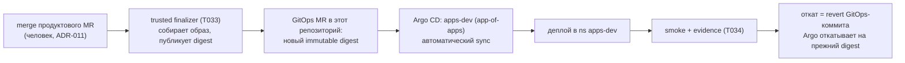

# dark-factory-gitops

Желаемое состояние окружений Software Dark Factory (ADR-015 п.1): Argo CD
Applications, values и **неизменяемые** image digests. Read-only для всех
людей и агентов: изменение — только через MR.

> Этот файл — часть seed-контента (T032): репозиторий ещё не создан, его
> создание — решение человека. Процедура bootstrap — в конце файла.

## Правила репозитория

1. **Только через MR.** Прямой push в `main` запрещён (branch protection:
   required PR, squash, запрет force-push). Каждый коммит в `main` — принятый
   MR; Argo CD отслеживает `main` (protected append-only trunk) и автоматически
   применяет состояние (ADR-011: деплой в dev после merge — автоматический).
2. **Никаких секретов.** В репозитории нет и не будет паролей, токенов,
   ключей (ADR-015 п.1). Секреты создаются вне git (kubectl/хранилище) и
   ссылаются из манифестов по имени (`existingSecret`-паттерн, как в
   charts/dark-factory и deploy/events). CI репозитория обязан отклонять
   коммиты с признаками секретов.
3. **Только immutable digests.** Никаких `latest`, никаких плавающих тегов —
   только `image: <repository>@sha256:<hex>` (ADR-015 п.5: gitops ссылается на
   immutable image/chart versions). Плавающий тег делает rollback по revert
   коммита бессмысленным и воспроизведение run'а невозможным.
4. **Протокол межрепозиторного версионирования** (ADR-015 п.5): изменения,
   затрагивающие релиз, фиксируют связи `factory_version` / `factory_commit` /
   `product_commit` / `gitops_commit` в описании MR; MR с digest ссылается на
   итоговый SHA продуктового репозитория и run, собравший образ.

## Структура

```text
envs/
  dev/                  # желаемое состояние dev-окружения (ns apps-dev)
    apps.yaml           # дочерние Argo CD Applications (app-of-apps)
    pilot/              # desired state пилотной рабочей нагрузки (chart + values)
platform/               # желаемое состояние платформы (ns factory) — см. README
examples/               # fixture-файлы: как выглядит GitOps-MR с digest
```

Поток релиза (ADR-010 п.1, ADR-011 п.2, DoD T-043):



До T033 изменение digest вносится вручную через MR (это тот же формат, который
потом автоматизирует trusted finalizer) — см. `examples/gitops-mr-digest-change.md`.

## Bootstrap репозитория (выполняет человек; команды НЕ исполняются из T032)

```bash
# 1. Создать репозиторий (решение человека; по умолчанию private):
gh repo create vadagama/dark-factory-gitops --private \
  --description "Desired state of dark factory environments (Argo CD)" \
  --disable-wiki --disable-issues

# 2. Развернуть seed и запушить:
git init -b main dark-factory-gitops
cp -R deploy/argocd/gitops-seed/. dark-factory-gitops/
cd dark-factory-gitops
git add -A
git commit -m "chore: seed gitops repository (T-043)"
git remote add origin git@github.com:vadagama/dark-factory-gitops.git
git push -u origin main

# 3. Защитить main (MR-only, без force-push):
gh api repos/vadagama/dark-factory-gitops/branches/main/protection \
  -X PUT --input - <<'JSON'
{"required_status_checks": null, "enforce_admins": true,
 "required_pull_request_reviews": {"required_approving_review_count": 1},
 "restrictions": null, "allow_force_pushes": false, "allow_deletions": false}
JSON

# 4. Если репозиторий private — создать repo-creds secret ВНЕ git
#    (точная команда печатается deploy/argocd/install.sh и есть в
#    deploy/argocd/README.md).

# 5. Проверить: Application 'apps-dev' в Argo CD становится Synced,
#    дочернее приложение pilot-dev разворачивается в ns apps-dev.
```

Репозиторий `dark-factory-mvp` и этот репозиторий независимы: платформа
развёртывается из `dark-factory-mvp` (charts/dark-factory), окружения — отсюда.
