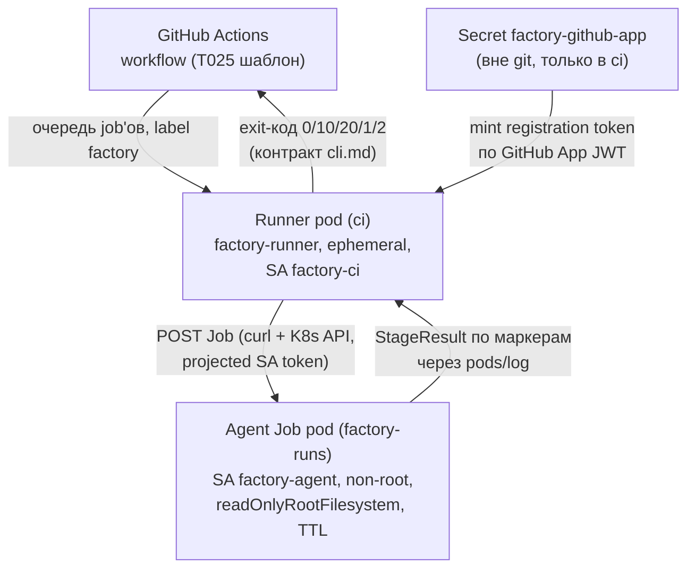

# CI-раннеры и безопасность job-подов (T030, ADR-006/ADR-010/ADR-019)

Self-hosted GitHub Actions раннеры в namespace `ci` (ephemeral: один под = один job) и эфемерные agent-поды стадий Flow **только** в namespace `factory-runs` с жёстким securityContext. Реализует docs T-041 (ADR-019 п.3: «Actions — запуск агентных стадий в self-hosted раннерах») поверх bootstrap-платформы T029 и шаблона stage-job T025.

## Архитектура

Двухуровневая схема, mandated планом (T-041): уровень управления CI — в `ci`, исполнение агентов — в `factory-runs`.



| Компонент | Где | Файл |
|---|---|---|
| Deployment `factory-runner` (1 реплика, Recreate) | `ci` | `manifests/runner-deployment.yaml` |
| ConfigMap `factory-runner-scripts` (entrypoint + run-agent-job + шаблон Job) | `ci` | собирается `install.sh` из `scripts/` |
| Role `factory-agent-jobs` (jobs CRUD, pods read, pods/log) в `factory-runs` + RoleBinding на SA `factory-ci` из `ci` | `factory-runs` | `manifests/rbac.yaml` |
| Шаблон agent-Job (non-root 65532, ro-rootfs, TTL, deadline) | — | `manifests/agent-job-template.yaml` |
| Probe-Job для верификации (busybox, TTL 60 c) | — | `manifests/agent-job-probe.yaml` |
| NetworkPolicy `allow-egress-https` в `factory-runs` — **замена** широкого правила bootstrap на «только публичный 443» | `factory-runs` | `manifests/networkpolicies.yaml` |

Модель исполнения (ADR-006): pod стадией. Workflow-job берёт раннер из очереди Actions; шаги workflow на раннере минимальны — `run-agent-job.sh` создаёт K8s Job в `factory-runs`, ждёт, возвращает StageResult; вся агентная работа (checkout, uv, `factory stage run`) выполняется в agent-поде. После job'а ephemeral-раннер самодерегистрируется, контейнер завершается, Deployment (Recreate, concurrency=1 по ADR-010) поднимает новый под с новым токеном регистрации.

## Безопасность

**Инвентарь учётных данных — кто что имеет:**

| Субъект | Учётные данные | Что не имеет |
|---|---|---|
| Runner pod (`ci`, SA `factory-ci`) | GitHub App creds (Secret, envFrom) + projected SA-токен (только Role ниже) | merge/deploy: App имеет **только** permission `Administration (write)` — регистрация раннеров; ни `contents:write` (merge/commit), ни `deployments`, ни repo `secrets` |
| Agent Job pod (`factory-runs`, SA `factory-agent`) | **никаких**: `automountServiceAccountToken: false` (pod-level и на SA из T029), никаких envFrom/Secret, клон публичного репозитория анонимно по HTTPS | K8s API (нет токена + сеть), GitHub credentials вообще, доступ к control-plane namespaces |
| Workflow job (Actions runtime token на раннере) | только `permissions: contents: read` (FR-023, зафиксировано в T025) | merge/deploy |
| Trusted image job (`factory-image.yml`, GitHub-hosted runner) | `permissions: contents: read, packages: write` — `GITHUB_TOKEN` только на публикацию образа в ghcr.io (единственный job с `packages: write`); fork-PR собирают образ, но никогда не публикуют (`CAN_PUSH`) | merge/deploy; чтение repo secrets |

- **RBAC** (`manifests/rbac.yaml`): Role в `factory-runs` — `batch/jobs` create/get/list/watch/delete, `pods` get/list/watch, `pods/log` get. **Нет** `pods/exec`, **нет** `secrets`, **нет** доступа к `factory`/`argocd`/`apps-dev`/`ci`. RoleBinding cross-namespace (легальный в RBAC для ServiceAccount-субъектов) привязывает SA `factory-ci` из `ci` — runner-уровень управляет только job-подами в `factory-runs`. SA `factory-agent` (T029) не имеет RBAC вообще.
- **securityContext agent-подов** (`agent-job-template.yaml`): `runAsNonRoot` + uid/gid 65532, `readOnlyRootFilesystem`, `privileged: false`, `allowPrivilegeEscalation: false`, capabilities `drop: [ALL]`, seccomp `RuntimeDefault`, без docker socket/hostPath; writable — только `emptyDir` (`/tmp`, `/workspace` 2Gi); лимиты 250m/512Mi → 1 CPU/1Gi (в квоте factory-runs из T029).
- **TTL и дедлайны**: `ttlSecondsAfterFinished: 3600` (под удаляется контроллером TTL — DoD «создаётся/удаляется по TTL»), `activeDeadlineSeconds: 3600`, `backoffLimit: 0` (retry — ответственность flow, ADR-006 п.7/12).
- **NetworkPolicy** (`manifests/networkpolicies.yaml`): в `factory-runs` широкое правило bootstrap (0.0.0.0/0:443) **заменяется** на «публичный 443» — ipBlock 0.0.0.0/0 с except `10.0.0.0/8` (pod/service CIDR: K8s API, все namespaces), `172.16.0.0/12`, `192.168.0.0/16` (включая host-сеть Docker Desktop, где слушает apiserver:6443), `169.254.0.0/16` (metadata). DNS и intra-ns остаются из bootstrap (политики аддитивны). Agent-под не может достучаться ни до K8s API, ни до подов/сервисов control-plane namespaces — ни по имени, ни по ClusterIP, ни по host-IP. Проверяется probe-подом (`api_blocked`, `api_ip_blocked`). Правило сознательно использует **то же имя** объекта, что и bootstrap: новая отдельная политика не могла бы «вычесть» широкий allow (аддитивность), объект заменяется по имени; `install.sh` пере-применяет после bootstrap, `teardown.sh` возвращает baseline T029.
- **Регистрация**: registration token живёт 1 час и **никогда не хранится**: entrypoint раннера каждый старт минтует свежий через GitHub App (RS256 JWT → installation token → `POST /repos/{owner}/{repo}/actions/runners/registration-token`) — пайплайн тот же, что в `deploy/bootstrap/scripts/check-github-app.sh` (T029). Secret `factory-github-app` создаётся вне git:
  ```bash
  kubectl -n ci create secret generic factory-github-app \
    --from-literal=DARK_FACTORY_GITHUB_APP_ID=<numeric app id> \
    --from-literal=DARK_FACTORY_GITHUB_INSTALLATION_ID=<numeric installation id> \
    --from-literal=DARK_FACTORY_GITHUB_APP_PRIVATE_KEY="$(cat app-private-key.pem)"
  ```
  GitHub App: permission **Administration (write)** — единственное необходимое; недостаточно для merge (contents:write), deploy (deployments) или чтения repo secrets. Имена env-ключей совпадают с `check-github-app.sh` (DARK_FACTORY_GITHUB_*).
- **«Agent job не имеет merge/deploy credentials» — проверяемо**: ① App permissions ограничены Administration (перечень выше); ② workflow `permissions: contents: read`, секретов не декларирует (T025); ③ agent-под не получает ни одного секрета/env-токена — verify.sh проверяет изнутри пода (`env_clean`, `no_sa_token`); ④ RBAC-матрица verify.sh через impersonation: `create jobs` только в `factory-runs`, `secrets`/`deployments`/namespaces — запрещено.

**Pinned digests** (теги не используются):

| Образ | Digest | Источник |
|---|---|---|
| `ghcr.io/actions/actions-runner` | `sha256:551dc313e6b6ef1ca7b9594d8090a7a6cc7aeb663f1079ba2fec07e9158f3259` | v2.327.1, мульти-арх index (amd64+arm64), проверен `docker buildx imagetools inspect` |
| `busybox` (probe) | `sha256:9db7b59979c38555a39def84a31fb98b5296952f9e3afd4f6f11f05b07adfab0` | busybox:1.37, мульти-арх index |
| `ghcr.io/astral-sh/uv` (в образе, `COPY --from`) | `sha256:b46b03ddfcfbf8f547af7e9eaefdf8a39c8cebcba7c98858d3162bd28cf536f6` | 0.11.19, мульти-арх index |
| `zricethezav/gitleaks` (trusted build job) | `sha256:c00b6bd0aeb3071cbcb79009cb16a60dd9e0a7c60e2be9ab65d25e6bc8abbb7f` | v8.30.1 |
| `ghcr.io/aquasecurity/trivy` (trusted build job) | `sha256:a93fd67162843c0f749002af9245fe9a2e5edc41445bd71d3949c803e95ef05b` | 0.68.1 |
| `ghcr.io/anchore/syft` (trusted build job) | `sha256:95fe0835e5bebc6f8b1f8acef68d47d63d594ef4c0f25c097ff853b23cbac74c` | v1.51.1 |
| `ghcr.io/vadagama/dark-factory` (agent + API) | digest каждого SHA публикуется trusted build job'ом (T033) и возвращается в output `digest`/артефакте `factory-image-evidence-*` (`image-digest.json`); подставляется в `run-agent-job.sh --image`/env `FACTORY_AGENT_IMAGE` и в GitOps-promotion (T032/T034) | `python:3.12-slim-bookworm` pinned по digest в обеих стадиях; после первого publish владелец делает пакет публичным — agent-поды тянут анонимно |

## Установка

```bash
# 1. Bootstrap платформы (T029) — namespaces, SA, базовые политики
./deploy/bootstrap/bootstrap.sh

# 2. Создать GitHub App (permission Administration: write, установить на репозиторий,
#    получить installation id) и Secret ВНЕ git (см. выше)

# 3. Установить runner-уровень
./deploy/ci/install.sh --context docker-desktop

# 4. Верификация (RBAC-матрица + живой probe-под + TTL)
./deploy/ci/verify.sh --context docker-desktop
```

`verify.sh` перед созданием пробы канарейкой (пара подов в throwaway-namespace, одна под deny-all-egress политикой — перенос детекта из `deploy/bootstrap/scripts/negative-egress-test.sh`, TD-001) определяет, исполняет ли кластер NetworkPolicy. На кластере без enforcement (docker-desktop) сетевые негативные проверки пробы (`api_blocked`, `api_ip_blocked`, `http80_blocked`) деградируют в `SKIPPED` с предупреждением; positive- и credential-проверки (`dns`, `external_https`, `no_sa_token`, `env_clean`, uid/rootfs/tmp) остаются жёсткими в обоих режимах. Канарейный namespace и probe-job убираются при выходе.

`install.sh` идемпотентен (`kubectl apply`), не создаёт секретов и падает с подсказкой, если bootstrap не применён. Без секрета установка продолжается: под раннера стартует, печатает точную команду создания секрета и ретраит (без CreateContainerConfigError благодаря `secretRef.optional: true`).

## Использование

Раннер регистрируется с лейблами `[self-hosted, factory]`. Перевод шаблона T025 (`runs-on: ubuntu-latest` → `[self-hosted, factory]`) — задача T031 (сейчас не переключено, чтобы не ломать CI репозитория: self-hosted раннеров пока нет на GitHub).

Ручной запуск стадии изнутри пода раннера (отладка, без GitHub):

```bash
kubectl -n ci exec deploy/factory-runner -- \
  bash /mnt/scripts/run-agent-job.sh \
    --stage construction --change ./fixtures/chg_smoke.yaml \
    --sha <commit-sha> [--image <digest>] [--delete]
```

`run-agent-job.sh` рендерит `agent-job-template.yaml`, создаёт Job через K8s REST API (curl + projected-токен; kubectl в образе раннера отсутствует сознательно), ждёт, тянет логи, извлекает StageResult между маркерами `__FACTORY_STAGE_RESULT_BEGIN__/__END__` в `./stage_result.json` и маппит exit-коды: 0/10 → 0 (waiting — не ошибка), 20/1/2 → исходный код (контракт cli.md, зеркально `factory-stage.yml`).

## Teardown

```bash
./deploy/ci/teardown.sh --context docker-desktop
```

Удаляет Deployment, ConfigMap и RBAC и **восстанавливает** bootstrap-состояние NetworkPolicy в `factory-runs` (иначе после удаления сужённой политики namespace останется вовсе без 443 egress). Секрет `factory-github-app` не трогается.

## OCI-образ фабрики (T033, docs T-044)

Третий уровень конвейера доставки (после раннеров T030 и chart'а T031): доверенная сборка и публикация immutable-образа фабрики — `ghcr.io/vadagama/dark-factory`. Один образ, две роли: agent-под стадии (git + `factory` CLI) и API/миграции chart'а (`factory api serve`, `alembic upgrade head`). Workflow — `.github/workflows/factory-image.yml` (reusable: `workflow_call` + `dispatch`), вызывается из `ci.yml` job'ом `factory-image` только после того, как все детерминированные гейты зелёные (`needs: [lint, typecheck, test, build, security, factory-us1-parity, factory-stage-smoke]`) и всегда на **итоговом SHA** изменения (FR-009/SC-004), не на merge-preview.

### Доверенный уровень (trusted tier)

Job выполняется на GitHub-hosted runner'е (один job = одноразовая VM) — это единственный job конвейера с `packages: write` и единственный, где разрешён Docker. Privileged DinD не нужен: buildx/QEMU работают на раннере штатно. Agent-стадии (T025/T030/T031) сохраняют `contents: read`/без credentials — граница доверия не пересекается (FR-023, ADR-019).

Состав job'а: secrets-скан (gitleaks, pinned digest, `--no-git`, fail до сборки) → SAST (bandit 1.9.4 через `uvx --python 3.12`) → SCA (pip-audit 2.10.1 по `uv export --frozen` — проверяется заблокированный набор, не resolve на лету) → multi-arch build+push (`linux/amd64,linux/arm64` — пилотный кластер arm64, ADR-010 п.4) → опциональный rebuild-check → trivy-скан опубликованного digest'а обеих платформ (`--ignore-unfixed`, fail на HIGH/CRITICAL — fail-closed) → SBOM (syft, SPDX JSON, обе платформы). Evidence — артефакты `factory-image-evidence-*` (image-digest.json + trivy-отчёты) и `factory-image-sbom-*` с retention 30 дней; outputs `digest`/`image_ref`/`tag` — контракт для promotion (T034).

Порядок публикации осознанный: образ пушится **до** trivy-скана; упавший скан оставляет digest в registry, но ран красный — гейт релиза (зелёный run-рекорд/GitOps-promotion, T034) никогда не потребляет evidence красного прогона. Fork-PR'ы собирают образ (валидация Dockerfile), но никогда не публикуют: `CAN_PUSH` проверяет `head.repo.full_name == github.repository` — у токена форк-прогона нет `packages:write` на этот репозиторий.

### Публикация: только immutable digest

Публикуется ровно один тег — `sha-<sha>`; `latest` и любые плавающие теги запрещены (тесты проверяют). Promotion между окружениями — **по digest** через GitOps-MR (T032/T034):`revert` коммита = откат. Digest возвращается в output `digest` и пишется в `image-digest.json` (schema v1: repository, tag, digest, git_sha, platforms, source_date_epoch, rebuild_check, workflow_url).

### Детерминизм сборки (rebuild-check)

DoD T033: повторная сборка того же SHA даёт тот же digest. В workflow — `workflow_dispatch`/`workflow_call` input `rebuild-check=true`: второй холодный билд (`--no-cache`, тот же SHA) и сравнение digest'ов; расхождение валит ран. Локально: `./deploy/ci/scripts/build-image.sh --rebuild-check` — два холодных билда и сравнение image ID.

Контракт детерминизма (проверен фактически: два холодных локальных билда дают байт-в-байт совпадающие слои; полный digest — после первого CI-прогона):

- **SOURCE_DATE_EPOCH = timestamp коммита**: BuildKit нормализует `created`/`history` в конфиге образа. Нормализация **не** покрывает: mtime файлов, созданных RUN; mtime родительских каталогов, дописанных в COPY-слой; содержимое файлов.
- **mtime**: каждый пишущий RUN заканчивается `find … -exec touch -h -d @$SOURCE_DATE_EPOCH {} +` (с prune RO-bind-mount'ов buildkit: `/sys`, `/proc`, `/dev`, `/etc/hosts`, `/etc/resolv.conf`, `/etc/hostname`); mtime build-контекста нормализуется до сборки (workflow-шаг GNU `touch`; локально — python3 `os.utime`, потому что BSD touch на macOS не понимает `-d @epoch`).
- **одна COPY для runtime-дерева**: несколько COPY в существующий `/app` перештамповывают запись родительского каталога wall-clock временем каждой копии (проверено экспериментально) — поэтому runtime-дерево собирается в builder'е (`/out`) и уходит одной `COPY --from=builder /out /app` в несуществующий `/app`: корневая запись наследует SDE-нормализованный mtime источника. Заодно в образ не попадают pyproject.toml/uv.lock/README.md/build-constraints.txt.
- **содержимое файлов**: uv пишет `uv_cache.json` в свежесобранный dist-info с wall-clock timestamp в содержимом, а запись в `RECORD` — с тем же плавающим хэшем → файл удаляется и строка вычёркивается из `RECORD` в каждом sync-слое; apt/dpkg пишут Start-Date/End-Date внутрь `/var/log` (dpkg.log, history/term.log) → каталог чистится; ldconfig пишет в `/var/cache/ldconfig/aux-cache` адреса загрузки библиотек (ASLR) → файл удаляется (регенерируется по требованию; `/etc/ld.so.cache` детерминирован).
- **входы зафиксированы**: зависимости только из `uv.lock` (`uv sync --frozen`), `.pyc` не создаются (`UV_COMPILE_BYTECODE=0`, `PYTHONDONTWRITEBYTECODE=1` — .pyc шьёт исходный mtime), builder wheel — hatchling==1.32.0 через `UV_BUILD_CONSTRAINT` (build-constraints.txt), uv 0.11.19 pinned digest'ом, `git`, `libpq5` и OS-пакеты — с фиксированной даты snapshot.debian.org `20260906T000000Z` (не дата сборки базового образа: она сознательно сдвинута вперёд ради security-обновлений `libpcre2-8-0`/`libssh2-1` — см. ниже), базовый образ pinned digest'ом в обеих стадиях, provenance/SBOM-attestations выключены (`provenance: false`, `sbom: false` — они шьют параметры вызова и ломают стабильность digest'а; SBOM выпускается как CI-артефакт).

Сознательные отклонения (документированные): любой бамп пинов (базовый образ, uv, hatchling, snapshot-дата, версии сканеров) и любое изменение состава зависимостей (`psycopg[binary]` → чистый `psycopg` с системной `libpq5`, см. ниже) при том же SHA даёт **новый digest** — это не регрессия, а сознательное обновление входов; фиксируется коммитом с пином и при необходимости — перегенерацией evidence. Тесты (`tests/test_deploy_ci_image.py`) защищают контракт: пины, snapshot-дату, per-RUN mtime-нормализацию, удаление волатильного содержимого, одно-копийную доставку runtime-дерева и политику тегов.

**Бамп snapshot-даты `20260824T000000Z` → `20260906T000000Z` (fixable HIGH в trivy) и `apt-get upgrade` в том же слое.** Причина: fail-closed trivy-гейт (`--ignore-unfixed --severity HIGH,CRITICAL`) находил в этой стадии пакеты базового образа с доступными исправлениями — `libpcre2-8-0` `10.42-1` → `10.42-1+deb12u1` (CVE-2026-86145, CVE-2026-89161) и `libssh2-1` `1.10.0-3+b1` → `1.10.0-3+deb12u1` (CVE-2026-58050, CVE-2026-7598). Оба исправления лежат в `debian-security` и отсутствуют на прежней дате. Дата сдвинута на снапшот, где есть оба: `libpcre2-8-0 10.42-1+deb12u1` впервые появился в `debian-security` 2026-09-04 09:43:38, `libssh2-1 1.10.0-3+deb12u1` — 2026-09-05 (arm64 13:22:46, amd64 18:34:20), поэтому выбрана дата `20260906T000000Z`, а не предыдущая полночь. Проверено `HEAD`-запросами: на этой дате отдаются `libpcre2-8-0_10.42-1+deb12u1_arm64.deb` (`040677fc7cb10354b374765ca54d1c6ee30022d4`), `..._amd64.deb` (`651c8c2e466a1ad5e8b83d73add41dc5d3b9af05`) и `libssh2-1_1.10.0-3+deb12u1_{arm64,amd64}.deb`, а также `Release` обоих архивов. В слое теперь `apt-get upgrade -y` (не список пакетов): снапшот заморожен, поэтому апгрейд всего OS-слоя детерминирован, а именованный список отстаёт от advisories — первая попытка пропатчить только `libpcre2-8-0` оставила `libssh2-1` незакрытым. Оба архивных корня (`debian` и `debian-security`) берутся с одной и той же даты — свойство «один снапшот» сохранено, второго источника пакетов не появилось. Следствие: `git`, `libpq5` и остальные OS-пакеты тоже становятся версиями на новую дату, digest того же SHA меняется (ожидаемое поведение deviation).

**Вендоренные библиотеки колеса `psycopg[binary]` устранены: чистый `psycopg` + OS-пакет `libpq5`.** После бампа снимка trivy продолжал показывать 5 записей `pcre2` (PURL `pkg:rpm/almalinux/pcre2@10.32-3.el8_6`, 2 CRITICAL + 3 HIGH). Источник — не OS-пакеты, а колесо `psycopg[binary]`: в образе лежат упакованные внутри колеса `psycopg_binary.libs/libpcre2-8-*.so` (pcre2 10.32 со сборочного хоста AlmaLinux 8.6) и рядом — EOL `libcrypto…so.1.1.1k`; часть находок trivy поднимает из встроенного CycloneDX-SBOM auditwheel (`psycopg_binary-<ver>.dist-info/sboms/auditwheel.cdx.json`). `apt` эти файлы не патчит, скрывать их от сканера — отклонено. Решение: зависимость в `pyproject.toml` переведена на чистый Python `psycopg` (без extra `binary`; `uv.lock` теряет только пакет `psycopg-binary`), а `libpq5` ставится из того же зафиксированного снимка в тот же apt-слой runtime-стадии (`deploy/ci/image/Dockerfile`). Вендоренных библиотек в образе больше нет, поэтому единственная поверхность скана — OS-пакеты (базовый образ + apt-слой). SQLAlchemy-диалект не меняется: `postgresql+psycopg://` работает с любой из двух реализаций.

### Как пересобрать/проверить локально

```bash
# Сборка локальной архитектуры + загрузка в docker как sha-<sha>
./deploy/ci/scripts/build-image.sh

# Полная проверка воспроизводимости: два холодных билда, сравнение image ID
./deploy/ci/scripts/build-image.sh --rebuild-check

# Проверка под securityContext agent-подов (non-root 65532, read-only rootfs)
docker run --rm --read-only --user 65532:65532 --tmpfs /tmp --cap-drop ALL \
  ghcr.io/vadagama/dark-factory:sha-<sha> factory --help
```

Ограничение локальной проверки: она одно-арх (нативная платформа хоста) и сравнивает docker image ID, а не registry manifest digest. Полная проверка — multi-arch manifest digest по `rebuild-check=true` в CI (`workflow_dispatch` на `factory-image.yml`).

## Почему не нужен новый ADR

Решение покрыто принятыми ADR: **ADR-006** п.1/11 (ephemeral job pods — pod на стадию; retry/deadline/TTL-конфигурация п.12) и **ADR-019** п.3/7 (self-hosted Actions-раннеры для агентных стадий, GitHub App с минимальными permissions, без долгоживущих PAT). Выбор Docker Desktop K8s + квоты — ADR-010 п.2/3. Двухуровневое разделение `ci` / `factory-runs` зафиксировано текстом исторического T-041. Реализационные детали ниже (выбор Deployment вместо ARC и пр.) не меняют архитектуру.

OCI-образ (T033) тем более не требует нового ADR: **deployment.md §8 / T-044** фиксируют требования (trusted build без privileged DinD, SBOM/сканы, immutable digest, запрет `latest`), а исполнение — прямая комбинация принятых решений: **ADR-006** (агентные стадии в pod'ах; образ — их runtime-носитель), **ADR-010 п.4** (multi-arch amd64+arm64 под пилотный arm64-кластер), **ADR-019** (граница доверия CI: trusted-tier job с `packages: write` против credential-free agent-стадий). Публикация по digest — уже выбранный контракт GitOps-promotion (T032: pilot-chart потребляет `sha256:__PILOT_IMAGE_DIGEST__`; T034 проверяет digest перед деплоем). Рецепты детерминизма (SOURCE_DATE_EPOCH, snapshot-пины, удаление волатильного содержимого) — реализационные детали внутри зафиксированного требования «повторная сборка того же SHA даёт тот же digest», а не архитектурные развилки.

**Почему не actions-runner-controller (ARC gha-runner-scale-set)**: ARC ставит listener и work-поды в **один** namespace (namespace AutoscalingRunnerSet'а) — требуемое разделение «раннеры в `ci`, agent-поды только в `factory-runs`» не выражается без разрушения изоляции. Deployment + `--ephemeral` — минимальный набор движущихся частей (без CRD и контроллера), который это разделение даёт.

## Ограничения

- **Живой прогон при создании не выполнялся**: Kubernetes в Docker Desktop был выключен (проверено: `kubectl cluster-info` — connection refused). Валидация статическая: `bash -n`, `shellcheck` (docker), `kubeconform -strict` (docker, включая рендер шаблонов с тестовыми значениями). Первый живой прогон: включить K8s → `./deploy/bootstrap/bootstrap.sh` → `./deploy/ci/install.sh` → `./deploy/ci/verify.sh`.
- **readOnlyRootFilesystem не установлен для пода раннера** (осознанно): upstream-образ пишет состояние регистрации и workspace в собственный установочный каталог (`/home/runner`) без поддерживаемого способа разделить install- и state-каталоги. Файловая система всё равно эфемерна (жизнь пода), а чувствительный уровень — agent-поды — read-only. Всё остальное ужесточение к раннеру применено (non-root 1001, caps drop ALL, no privilege escalation, seccomp).
- Runner-под обновляет себя автоматически при старте job'а (поведение upstream); базовый образ закреплён digest'ом, автообновления касаются только содержимого `_work`/бинарей внутри эфемерного пода.
- Клон репозитория в agent-поде — анонимный HTTPS: MVP-пилот предполагает публичный репозиторий. Для приватных нужен короткоживущий токен с `contents: read` (T031); ни в каком виде не передаётся merge/deploy credentials.
- **Пока репозиторий приватный**, образ T033 фактически тянуть из agent-поды нечем: анонимный clone падает, а токен отложен в T031 (в самом образе git есть — контракт клона проверен локально; блокер — в выдаче credentials, не в образе). После первого живого прогона T031+T033: создать токен либо сделать репозиторий публичным.
- Полный digest-манифест появляется только после первого CI-прогона workflow (пуш в ghcr.io требует прав владельца; локально пуш не выполнялся). После первого прогона: владелец делает пакет публичным (agent-поды тянут анонимно), digest фиксируется в артефакте `factory-image-evidence-*` и подставляется в promotion (T032/T034).
- Multi-arch (amd64+arm64), trivy-скан, SBOM и rebuild-check в CI-конфигурации подтверждается первым прогоном на PR: локально проверены одно-арх сборка, rebuild-check (совпадение image ID двух холодных билдов) и smoke под securityContext agent-подов.
- Полный возврат evidence (каталог `factory-evidence/`) из agent-поды сейчас только StageResult через `pods/log`; транспорт остального evidence — T031 (options: ArtifactStorePort).
- Сетевые политики зависят от CNI-семантики (pre-/post-NAT): except-лист закрывает и ClusterIP (10/8), и host-сеть Docker Desktop (192.168.65.0/24), так что блокировка K8s API не зависит от точки матчинга; если CNI не матчит DNS по pod-IP kube-dns (pre-NAT), потребуется уточнение allow-dns из T029 — проверяется первым живым прогоном негативных тестов.
- IPv6: кластер IPv4-only; dual-stack hardening (ipBlock ::/0 + except) — пост-MVP.
- Self-hosted раннеры для форк-PR требуют настройки «Require approval for all external contributors» в настройках Actions репозитория.
