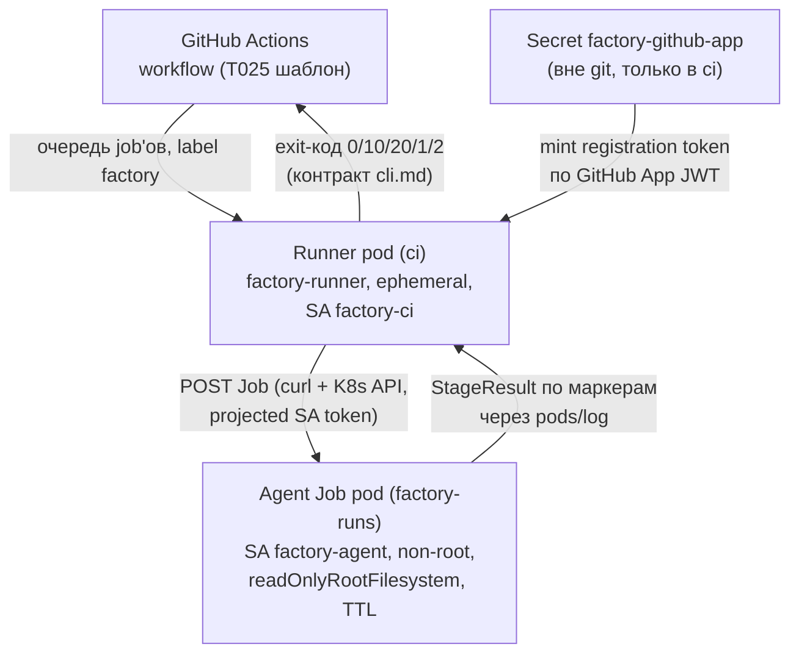

# CI-раннеры и безопасность job-подов (T030, ADR-006/ADR-010/ADR-019)

Self-hosted GitHub Actions раннеры в namespace `ci` (ephemeral: один под = один job) и эфемерные agent-поды стадий Flow **только** в namespace `factory-runs` с жёстким securityContext. Реализует docs T-041 (ADR-019 п.3: «Actions — запуск агентных стадий в self-hosted раннерах») поверх bootstrap-платформы T029 и шаблона stage-job T025.

## Архитектура

Двухуровневая схема, mandated планом (T-041): уровень управления CI — в `ci`, исполнение агентов — в `factory-runs`.



| Компонент | Где | Файл |
|---|---|---|
| Deployment `factory-runner` (1 реплика, Recreate) | `ci` | `manifests/runner-deployment.yaml` |
| ConfigMap `factory-runner-scripts` (entrypoint + run-agent-job + шаблон Job) | `ci` | собирается `install.sh` из `scripts/` |
| Role `factory-agent-jobs` (jobs CRUD, pods read, pods/log) в `factory-runs` + RoleBinding на SA `factory-ci` из `ci` | `factory-runs` | `manifests/rbac.yaml` |
| Шаблон agent-Job (non-root 65532, ro-rootfs, TTL, deadline) | — | `manifests/agent-job-template.yaml` |
| Probe-Job для верификации (busybox, TTL 60 c) | — | `manifests/agent-job-probe.yaml` |
| NetworkPolicy `allow-egress-https` в `factory-runs` — **замена** широкого правила bootstrap на «только публичный 443» | `factory-runs` | `manifests/networkpolicies.yaml` |

Модель исполнения (ADR-006): pod стадией. Workflow-job берёт раннер из очереди Actions; шаги workflow на раннере минимальны — `run-agent-job.sh` создаёт K8s Job в `factory-runs`, ждёт, возвращает StageResult; вся агентная работа (checkout, uv, `factory stage run`) выполняется в agent-поде. После job'а ephemeral-раннер самодерегистрируется, контейнер завершается, Deployment (Recreate, concurrency=1 по ADR-010) поднимает новый под с новым токеном регистрации.

## Безопасность

**Инвентарь учётных данных — кто что имеет:**

| Субъект | Учётные данные | Что не имеет |
|---|---|---|
| Runner pod (`ci`, SA `factory-ci`) | GitHub App creds (Secret, envFrom) + projected SA-токен (только Role ниже) | merge/deploy: App имеет **только** permission `Administration (write)` — регистрация раннеров; ни `contents:write` (merge/commit), ни `deployments`, ни repo `secrets` |
| Agent Job pod (`factory-runs`, SA `factory-agent`) | **никаких**: `automountServiceAccountToken: false` (pod-level и на SA из T029), никаких envFrom/Secret, клон публичного репозитория анонимно по HTTPS | K8s API (нет токена + сеть), GitHub credentials вообще, доступ к control-plane namespaces |
| Workflow job (Actions runtime token на раннере) | только `permissions: contents: read` (FR-023, зафиксировано в T025) | merge/deploy |

- **RBAC** (`manifests/rbac.yaml`): Role в `factory-runs` — `batch/jobs` create/get/list/watch/delete, `pods` get/list/watch, `pods/log` get. **Нет** `pods/exec`, **нет** `secrets`, **нет** доступа к `factory`/`argocd`/`apps-dev`/`ci`. RoleBinding cross-namespace (легальный в RBAC для ServiceAccount-субъектов) привязывает SA `factory-ci` из `ci` — runner-уровень управляет только job-подами в `factory-runs`. SA `factory-agent` (T029) не имеет RBAC вообще.
- **securityContext agent-подов** (`agent-job-template.yaml`): `runAsNonRoot` + uid/gid 65532, `readOnlyRootFilesystem`, `privileged: false`, `allowPrivilegeEscalation: false`, capabilities `drop: [ALL]`, seccomp `RuntimeDefault`, без docker socket/hostPath; writable — только `emptyDir` (`/tmp`, `/workspace` 2Gi); лимиты 250m/512Mi → 1 CPU/1Gi (в квоте factory-runs из T029).
- **TTL и дедлайны**: `ttlSecondsAfterFinished: 3600` (под удаляется контроллером TTL — DoD «создаётся/удаляется по TTL»), `activeDeadlineSeconds: 3600`, `backoffLimit: 0` (retry — ответственность flow, ADR-006 п.7/12).
- **NetworkPolicy** (`manifests/networkpolicies.yaml`): в `factory-runs` широкое правило bootstrap (0.0.0.0/0:443) **заменяется** на «публичный 443» — ipBlock 0.0.0.0/0 с except `10.0.0.0/8` (pod/service CIDR: K8s API, все namespaces), `172.16.0.0/12`, `192.168.0.0/16` (включая host-сеть Docker Desktop, где слушает apiserver:6443), `169.254.0.0/16` (metadata). DNS и intra-ns остаются из bootstrap (политики аддитивны). Agent-под не может достучаться ни до K8s API, ни до подов/сервисов control-plane namespaces — ни по имени, ни по ClusterIP, ни по host-IP. Проверяется probe-подом (`api_blocked`, `api_ip_blocked`). Правило сознательно использует **то же имя** объекта, что и bootstrap: новая отдельная политика не могла бы «вычесть» широкий allow (аддитивность), объект заменяется по имени; `install.sh` пере-применяет после bootstrap, `teardown.sh` возвращает baseline T029.
- **Регистрация**: registration token живёт 1 час и **никогда не хранится**: entrypoint раннера каждый старт минтует свежий через GitHub App (RS256 JWT → installation token → `POST /repos/{owner}/{repo}/actions/runners/registration-token`) — пайплайн тот же, что в `deploy/bootstrap/scripts/check-github-app.sh` (T029). Secret `factory-github-app` создаётся вне git:
  ```bash
  kubectl -n ci create secret generic factory-github-app \
    --from-literal=DARK_FACTORY_GITHUB_APP_ID=<numeric app id> \
    --from-literal=DARK_FACTORY_GITHUB_INSTALLATION_ID=<numeric installation id> \
    --from-literal=DARK_FACTORY_GITHUB_APP_PRIVATE_KEY="$(cat app-private-key.pem)"
  ```
  GitHub App: permission **Administration (write)** — единственное необходимое; недостаточно для merge (contents:write), deploy (deployments) или чтения repo secrets. Имена env-ключей совпадают с `check-github-app.sh` (DARK_FACTORY_GITHUB_*).
- **«Agent job не имеет merge/deploy credentials» — проверяемо**: ① App permissions ограничены Administration (перечень выше); ② workflow `permissions: contents: read`, секретов не декларирует (T025); ③ agent-под не получает ни одного секрета/env-токена — verify.sh проверяет изнутри пода (`env_clean`, `no_sa_token`); ④ RBAC-матрица verify.sh через impersonation: `create jobs` только в `factory-runs`, `secrets`/`deployments`/namespaces — запрещено.

**Pinned digests** (теги не используются):

| Образ | Digest | Источник |
|---|---|---|
| `ghcr.io/actions/actions-runner` | `sha256:551dc313e6b6ef1ca7b9594d8090a7a6cc7aeb663f1079ba2fec07e9158f3259` | v2.327.1, мульти-арх index (amd64+arm64), проверен `docker buildx imagetools inspect` |
| `busybox` (probe) | `sha256:9db7b59979c38555a39def84a31fb98b5296952f9e3afd4f6f11f05b07adfab0` | busybox:1.37, мульти-арх index |
| `ghcr.io/vadagama/dark-factory` (agent) | плейсхолдер до T033 | процедура: `docker buildx build --push` → `docker buildx imagetools inspect <image> | grep '^Digest'` → подставить в `--image`/env `FACTORY_AGENT_IMAGE` |

## Установка

```bash
# 1. Bootstrap платформы (T029) — namespaces, SA, базовые политики
./deploy/bootstrap/bootstrap.sh

# 2. Создать GitHub App (permission Administration: write, установить на репозиторий,
#    получить installation id) и Secret ВНЕ git (см. выше)

# 3. Установить runner-уровень
./deploy/ci/install.sh --context docker-desktop

# 4. Верификация (RBAC-матрица + живой probe-под + TTL)
./deploy/ci/verify.sh --context docker-desktop
```

`install.sh` идемпотентен (`kubectl apply`), не создаёт секретов и падает с подсказкой, если bootstrap не применён. Без секрета установка продолжается: под раннера стартует, печатает точную команду создания секрета и ретраит (без CreateContainerConfigError благодаря `secretRef.optional: true`).

## Использование

Раннер регистрируется с лейблами `[self-hosted, factory]`. Перевод шаблона T025 (`runs-on: ubuntu-latest` → `[self-hosted, factory]`) — задача T031 (сейчас не переключено, чтобы не ломать CI репозитория: self-hosted раннеров пока нет на GitHub).

Ручной запуск стадии изнутри пода раннера (отладка, без GitHub):

```bash
kubectl -n ci exec deploy/factory-runner -- \
  bash /mnt/scripts/run-agent-job.sh \
    --stage construction --change ./fixtures/chg_smoke.yaml \
    --sha <commit-sha> [--image <digest>] [--delete]
```

`run-agent-job.sh` рендерит `agent-job-template.yaml`, создаёт Job через K8s REST API (curl + projected-токен; kubectl в образе раннера отсутствует сознательно), ждёт, тянет логи, извлекает StageResult между маркерами `__FACTORY_STAGE_RESULT_BEGIN__/__END__` в `./stage_result.json` и маппит exit-коды: 0/10 → 0 (waiting — не ошибка), 20/1/2 → исходный код (контракт cli.md, зеркально `factory-stage.yml`).

## Teardown

```bash
./deploy/ci/teardown.sh --context docker-desktop
```

Удаляет Deployment, ConfigMap и RBAC и **восстанавливает** bootstrap-состояние NetworkPolicy в `factory-runs` (иначе после удаления сужённой политики namespace останется вовсе без 443 egress). Секрет `factory-github-app` не трогается.

## Почему не нужен новый ADR

Решение покрыто принятыми ADR: **ADR-006** п.1/11 (ephemeral job pods — pod на стадию; retry/deadline/TTL-конфигурация п.12) и **ADR-019** п.3/7 (self-hosted Actions-раннеры для агентных стадий, GitHub App с минимальными permissions, без долгоживущих PAT). Выбор Docker Desktop K8s + квоты — ADR-010 п.2/3. Двухуровневое разделение `ci` / `factory-runs` зафиксировано текстом T-041 в plan.md. Реализационные детали ниже (выбор Deployment вместо ARC и пр.) не меняют архитектуру.

**Почему не actions-runner-controller (ARC gha-runner-scale-set)**: ARC ставит listener и work-поды в **один** namespace (namespace AutoscalingRunnerSet'а) — требуемое разделение «раннеры в `ci`, agent-поды только в `factory-runs`» не выражается без разрушения изоляции. Deployment + `--ephemeral` — минимальный набор движущихся частей (без CRD и контроллера), который это разделение даёт.

## Ограничения

- **Живой прогон при создании не выполнялся**: Kubernetes в Docker Desktop был выключен (проверено: `kubectl cluster-info` — connection refused). Валидация статическая: `bash -n`, `shellcheck` (docker), `kubeconform -strict` (docker, включая рендер шаблонов с тестовыми значениями). Первый живой прогон: включить K8s → `./deploy/bootstrap/bootstrap.sh` → `./deploy/ci/install.sh` → `./deploy/ci/verify.sh`.
- **readOnlyRootFilesystem не установлен для пода раннера** (осознанно): upstream-образ пишет состояние регистрации и workspace в собственный установочный каталог (`/home/runner`) без поддерживаемого способа разделить install- и state-каталоги. Файловая система всё равно эфемерна (жизнь пода), а чувствительный уровень — agent-поды — read-only. Всё остальное ужесточение к раннеру применено (non-root 1001, caps drop ALL, no privilege escalation, seccomp).
- Runner-под обновляет себя автоматически при старте job'а (поведение upstream); базовый образ закреплён digest'ом, автообновления касаются только содержимого `_work`/бинарей внутри эфемерного пода.
- Клон репозитория в agent-поде — анонимный HTTPS: MVP-пилот предполагает публичный репозиторий. Для приватных нужен короткоживущий токен с `contents: read` (T031); ни в каком виде не передаётся merge/deploy credentials.
- Полный возврат evidence (каталог `factory-evidence/`) из agent-поды сейчас только StageResult через `pods/log`; транспорт остального evidence — T031 (options: ArtifactStorePort).
- Сетевые политики зависят от CNI-семантики (pre-/post-NAT): except-лист закрывает и ClusterIP (10/8), и host-сеть Docker Desktop (192.168.65.0/24), так что блокировка K8s API не зависит от точки матчинга; если CNI не матчит DNS по pod-IP kube-dns (pre-NAT), потребуется уточнение allow-dns из T029 — проверяется первым живым прогоном негативных тестов.
- IPv6: кластер IPv4-only; dual-stack hardening (ipBlock ::/0 + except) — пост-MVP.
- Self-hosted раннеры для форк-PR требуют настройки «Require approval for all external contributors» в настройках Actions репозитория.
