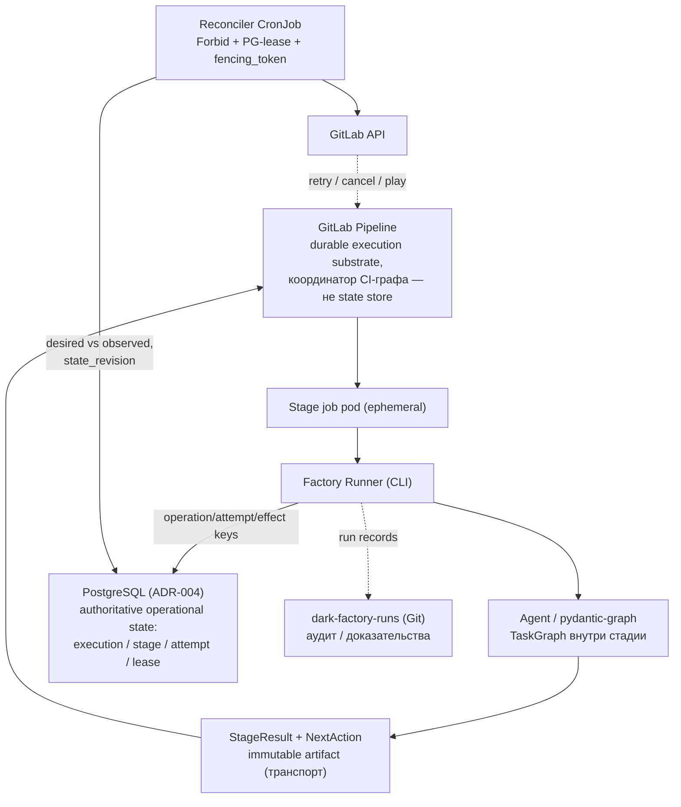

# ADR-006: Ephemeral Job Pods and Reconciler CronJob

- **Статус**: принято (ревизия 3, accepted with amendments)
- **Дата**: 2026-09-13
- **Автор**: software-architect
- Решение согласовано пользователем (ответы на вопросы раздела 5 исторического реестра задач, 2026-09-13)
- **Ревизия 2** (2026-09-13): по итогам внешнего ревью внесены поправки — единственный authoritative state (п.2), разделение ключей идемпотентности (п.3), lease/fencing reconciler (п.6), retry-автомат (п.7), протокол внешнего ожидания (п.8), разделение `WorkflowEnginePort` и `ReconciliationService` (п.9), триггеры hard/soft/capacity (п.10), конфигурация CronJob (п.12)
- **Ревизия 3** (2026-09-13, архитектурное ревью ADR-пакета): durable effect ledger (п.3) и AuthN callback-протокола внешнего ожидания (п.8)

## Контекст

- Q-5 plan §5: постоянно живущий worker/execution controller (controller/reconciler как компонент контура) против отсутствия постоянных процессов — Runner создаёт pod на стадию, reconcile по расписанию («Factory Runner — CLI/entrypoint, а не отдельный постоянно работающий сервис»).
- Влияние: ресурсы MacBook 24GB, идемпотентность, recovery-семантика (Q-3, ADR-004).
- Ревизия 2: внешнее ревью подтвердило направление решения и выявило главный риск не в отсутствии постоянно работающего worker, а в недоопределённости модели состояния и повторного выполнения (кто принимает окончательное решение о состоянии execution; семантика retry при увеличении attempt).

## Решение

1. **Factory Runner — не постоянно живущий сервис.** Модель исполнения: ephemeral CI job pods (pod на стадию) + идемпотентный Kubernetes CronJob reconciler (каждые 2–5 мин). GitLab CI переиспользуется как готовая система запуска, retry, timeout и визуализации pipeline.

2. **Единственный authoritative state — PostgreSQL.** Разделение ответственности:

| Компонент | Ответственность |
|---|---|
| PostgreSQL (ADR-004) | Authoritative operational state: execution, stage, attempt, lease, reconcile action |
| GitLab Pipeline | Durable execution substrate и координатор CI-графа; наблюдаемое состояние CI jobs; **не** state store фабрики |
| `dark-factory-runs` (ADR-015, T-061) | Долговременный аудит: компактный immutable **индекс** доказательств — `RunManifest`, итоговый `StageResult`, approvals/decisions, ссылки, digest и provenance. Сами тяжёлые evidence в репозиторий не помещаются (ADR-015 п.4) |
| GitLab artifacts | Передача данных между jobs и хранение evidence в MVP (ADR-009): логи, отчёты, скриншоты, SBOM. Ограниченный retention; не журнал фабрики — журналом является PostgreSQL, индексом — `dark-factory-runs` |
| Product repository | Исходный код и продуктовые изменения — commit/MR |

GitLab Pipeline является durable execution substrate и координатором CI-графа, но не authoritative state store фабрики: авторитетное операционное состояние execution хранится в PostgreSQL. pydantic-graph управляет работой только внутри стадии (ADR-005); между стадиями — типизированные StageResult/NextAction. Рассинхрон GitLab↔PostgreSQL разрешается в пользу PostgreSQL после сверки observed-состояния.

3. **Идемпотентность: операция ≠ попытка ≠ внешний эффект.** Ключи:

```text
operation_key = execution_id + stage_id + input_revision
attempt_id    = operation_key + attempt_number
effect_key    = operation_key + effect_type + effect_target
```

- `operation_key` одинаков для всех повторов стадии; успешный повтор с тем же ключом возвращает уже зафиксированный StageResult; новая входная ревизия создаёт новую логическую операцию;
- `attempt_id` различает физические попытки и не входит в ключ операции — иначе retry получал бы новый ключ и переставал быть идемпотентным повтором той же логической операции;
- `effect_key` защищает конкретные внешние эффекты: создание branch, commit, MR, deployment, comment. Каждый внешний эффект сопровождается **durable effect ledger**: уникальный `effect_key` (инвариант схемы, T-006), статус `planned / in_progress / succeeded / unknown`, `external_ref` после выполнения; где провайдер поддерживает idempotency key — он передаётся. При `unknown` (crash между внешним вызовом и фиксацией результата) повтору предшествует lookup по детерминированному маркеру эффекта; второй идентичный эффект не создаётся.

Гарантии: **at-least-once запуск стадии и effectively-once фиксация контролируемых side effects (через durable effect ledger); exactly-once execution не гарантируется.**

4. **Обязательные контракты восстановления:**
- `execution_id` у каждого запуска;
- вход этапа — immutable commit SHA + manifest;
- результат — StageResult как immutable artifact; продуктовые изменения — commit/MR, а не изменяемый CI artifact;
- защита от старого результата — сравнение expected commit/`state_revision`.

5. **Reconciler не исполняет агентные задачи.** Он: находит зависшие/потерянные jobs, проверяет timeout/deadline, ведёт retry по автомату (п.7), закрывает superseded execution, продолжает pipeline после внешнего ожидания (п.8), обнаруживает pipeline без следующего действия, пишет результат reconcile в журнал. Идемпотентен: повторный проход при тех же observed-данных не меняет состояние.

6. **Двойная защита от параллелизма reconcile:**
- Kubernetes `concurrencyPolicy: Forbid` — только оптимизация: CronJob в отдельных ситуациях может создать две Jobs либо не создать ни одной, и защищает лишь запуски одного CronJob (не покрывает второй deployment, другой кластер, ручной запуск);
- PostgreSQL lease — корректность: lease `global-reconciler`, `owner_id` = pod UID, монотонно возрастающий `fencing_token`, `expires_at = now + lease_ttl`.

Все изменения execution выполняются с проверкой `state_revision` и `fencing_token`; попытка с устаревшим токеном отклоняется.

7. **Retry — детерминированный конечный автомат** (а не «перезапуск retryable-этапов»):
- явный перечень retryable `failure_reason`;
- `max_attempts` на стадию, exponential backoff, retry budget (на execution и глобальный);
- терминальное состояние `failed_requires_intervention`;
- неизвестный исход (job потерян, результат недоступен) не трактуется как провал безвозвратно: попытка помечается `unknown_outcome` и разрешается сверкой observed-состояния GitLab до запуска новой попытки;
- retry запрещён для superseded/canceled execution;
- различаются retry того же job и создание новой pipeline: retry возможен только в живом pipeline; истёкший pipeline — новая операция;
- reconciler запрашивает jobs с `include_retried=true` — GitLab Jobs API по умолчанию не возвращает старые retried jobs, без этого история попыток восстанавливается неверно.

8. **Внешнее ожидание — явный протокол:**
1. стадия возвращает `NextAction.WAIT`;
2. StageResult сохраняется долговременно до начала ожидания;
3. в GitLab создаётся blocking manual job;
4. callback или reconciler валидирует подлинность источника (HMAC или подписанный токен, timestamp в допустимом окне, replay-защита по event ID/nonce) — неаутентифицированный callback не меняет состояние и не вызывает GitLab API; затем — бизнес-поля: `execution_id`, `operation_key`, `expected_state_revision`, commit SHA, результат внешнего события;
5. при валидном переходе reconciler вызывает GitLab `play` API;
6. повторный callback не порождает второй переход (проверка `operation_key` + `expected_state_revision`).

9. **Порт движка отделён от reconciliation.** `reconcile()` — не естественная обязанность workflow engine: Temporal, GitLab CI и будущий controller восстанавливаются по-разному.

```python
class WorkflowEnginePort(Protocol):
    async def start(
        self,
        command: StartExecution,
        idempotency_key: str,
    ) -> ExecutionRef: ...

    async def resume(
        self,
        command: ResumeExecution,
        expected_revision: int,
    ) -> ExecutionRef: ...

    async def cancel(
        self,
        execution_id: str,
        expected_revision: int,
    ) -> ExecutionRef: ...

    async def get_status(
        self,
        execution_id: str,
    ) -> ExecutionStatus: ...


class ReconciliationService(Protocol):
    async def reconcile(
        self,
        scope: ReconcileScope,
    ) -> ReconcileReport: ...
```

Reconciler сравнивает desired state из `ExecutionRepository` (PostgreSQL) с observed state из `WorkflowEnginePort`; reconciliation — отдельный сервис, а не метод движка. workflow-core реализует порт (ADR-005).

10. **Постоянный execution controller — целевая эволюция, не MVP.** Обоснование архитектурное: для MVP отдельный controller создаёт второй orchestration control plane рядом с GitLab CI, хотя требуемые сценарии пока выражаются pipeline/job-моделью (ресурсный профиль — вторичный аргумент). Триггеры перехода:
- **hard** (достаточно одного): выполнение независимо от GitLab pipeline; несколько источников задач с приоритетами; длительные ожидания, не укладывающиеся в жизненный цикл pipeline; cross-repository execution с единым состоянием; требуемая реакция быстрее интервала CronJob;
- **soft** (переход по совокупности): DAG не выражается child pipelines; задачи из нескольких источников (GitLab, Plane, Console) без приоритетов; нужны leases/очереди/приоритеты/fairness; автономный learning loop; реакция за секунды на регулярной основе;
- **capacity** (по нагрузочному тесту, а не по умозрительным «сотням параллельных execution»); метрики: `reconcile_duration / schedule_interval`; число активных execution; GitLab API calls на один проход; доля пропущенных reconcile; p95 recovery latency; утилизация rate-limit GitLab API; число конфликтов `state_revision`.

Контрольная точка переоценки — T-091.

11. **Целевая схема**: stateless/restartable controller + PostgreSQL (ADR-004) + ephemeral worker pods. Эволюции подлежит координатор (GitLab CI + CronJob → controller), а не модель исполнения: **агентные workers остаются временными даже в цели**.

12. **Конфигурация reconciler CronJob.** Помимо `concurrencyPolicy` и лимитов истории:

```yaml
spec:
  concurrencyPolicy: Forbid        # оптимизация; корректность — PG-lease (п.6)
  startingDeadlineSeconds: ...     # не запускать «догоняющие» проходы после простоя
  successfulJobsHistoryLimit: 1
  failedJobsHistoryLimit: 3
  jobTemplate:
    spec:
      backoffLimit: 0              # retry — ответственность автомата (п.7), не K8s
      activeDeadlineSeconds: ...   # проход обязан укладываться в интервал расписания
      ttlSecondsAfterFinished: ...
```

Требования безопасности и наблюдаемости:
- service account с минимальными Kubernetes permissions;
- отдельный GitLab project/group access token с минимальными scopes;
- секрет через Kubernetes Secret — никогда в коде (Vault вне MVP, ADR-009 п.4; в DC-контуре — T-091);
- NetworkPolicy: доступ только к GitLab API и PostgreSQL;
- alert при отсутствии успешного reconcile дольше заданного интервала;
- при `Forbid` долгий проход пропускает следующие запуски — длительность прохода контролируется метрикой `reconcile_duration / schedule_interval` и должна быть заметно меньше интервала расписания.



Связанные задачи: **T-006** (схема `execution`/`stage`/`attempt`/`execution_leases`, ключи идемпотентности, effect ledger), T-031, T-041, T-063, T-091.

## Альтернативы

| Вариант | Плюсы | Минусы | Почему не выбран |
|---|---|---|---|
| Постоянный worker/execution controller | Реакция за секунды, полноценные leases/очереди/приоритеты, единый control plane | Второй orchestration control plane рядом с GitLab CI при сценариях, пока выражаемых pipeline/job-моделью; постоянный процесс в профиле 24GB; сложнее bootstrap | Не выбран для MVP — архитектурная причина (дублирование control plane), ресурсный профиль вторичен; зафиксирован как целевая эволюция с триггерами hard/soft/capacity (п.10) |
| Ephemeral CI job pods + идемпотентный reconciler CronJob | Нет постоянного воркера; pod уже временная среда исполнения; предсказуемый профиль ресурсов; retry/timeout/визуализация — из GitLab CI | Latency recovery до интервала CronJob; идемпотентность — обязанность каждого обработчика; корректность параллелизма требует PG-lease поверх `Forbid` | Выбрано (ревизия 2, accepted with amendments) |

## Последствия

**Позитивные**
- Ресурсный профиль локального контура стабилен; смена движка изолирована портом `WorkflowEnginePort`, reconciliation вынесен в отдельный сервис.
- Единственный authoritative state устраняет неоднозначность «кто принимает окончательное решение о состоянии execution».
- Модель operation/attempt/effect делает повтор этапов безопасным по умолчанию: at-least-once запуск + effectively-once side effects.

**Негативные / риски**
- Webhook остаётся только ускорителем: без него окно recovery — до 2–5 мин.
- Рассинхронизация GitLab и PostgreSQL — разрешается в пользу PostgreSQL после сверки expected commit/`state_revision`.
- `Forbid` может пропускать запуски при долгом проходе — митигируется `activeDeadlineSeconds` и метрикой (п.12).
- Lease/fencing и retry-автомат — дополнительная обязанность каждого обработчика изменений; покрывается тестами T-063.

**Дальше**
- T-031: шаблоны «один job = одна стадия»; T-041: безопасность job pods (token, NetworkPolicy, secret); T-063: retry-автомат, lease/fencing, WAIT-протокол с AuthN, журнал reconcile; T-091: триггеры перехода hard/soft/capacity и capacity-метрики.

## Итог ревизии 2

> **Решение принято для MVP (accepted with amendments)**: authoritative state зафиксирован (PostgreSQL), idempotency key исправлен (operation/attempt/effect), lease/fencing добавлены. Ephemeral workers сохраняются и в target architecture; эволюции подлежит координатор — GitLab CI + CronJob сначала, stateless execution controller позже.

> **Ревизия 3**: добавлены durable effect ledger (п.3) и AuthN callback-протокола внешнего ожидания (п.8).
