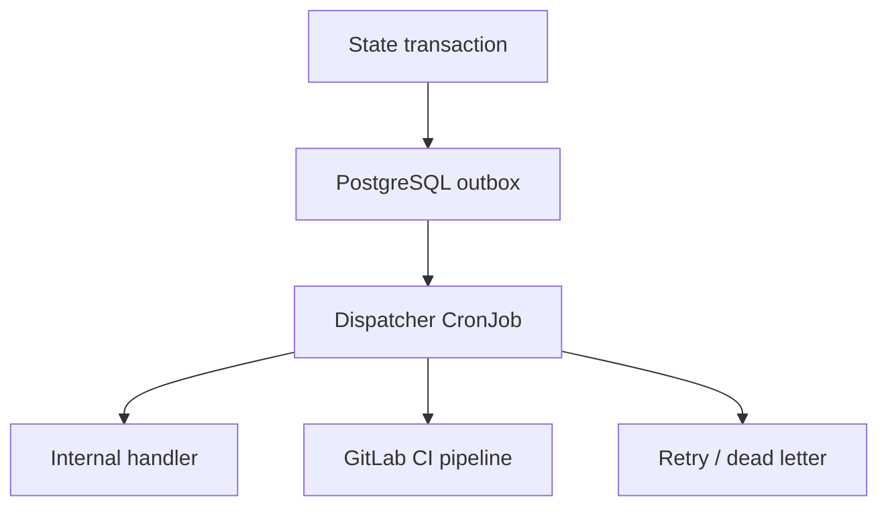

# ADR-016: PostgreSQL Outbox Event Model

- **Статус**: принято (ревизия 3, accepted with amendments)
- **Дата**: 2026-09-13
- **Автор**: software-architect
- Решение согласовано пользователем (ответы на вопросы раздела 5 plan.md, 2026-09-13)
- **Ревизия 2** (2026-09-13): по итогам внешнего ревью внесены обязательные уточнения — гарантия доставки at-least-once (п.2), Outbox Dispatcher CronJob как механизм доставки (п.4), per-consumer состояние доставки `event_delivery` (п.5), ordering (п.6), retry/dead-letter policy (п.4–5), retention по доставке, а не по возрасту (п.9), измеримые триггеры пересмотра (п.10)
- **Ревизия 3** (2026-09-13, архитектурное ревью ADR-пакета): immutable snapshot обязательных потребителей (п.5), eligibility-правило ordering (п.6), cleanup только для delivered/waived (п.9)

## Контекст

- Q-15 plan §5: Kafka как внутренний транспорт против PostgreSQL outbox и событий как CI-триггеров без шины (webhook + scheduled reconcile). Связан с Q-3 (ADR-004).
- Влияние: инфраструктура, гарантии доставки, сложность fast-jobs (T-090).
- Ревизия 2: внешнее ревью подтвердило выбор PostgreSQL outbox для MVP, но выявило главный пробел — outbox был определён как хранилище событий, без механизма доставки и модели нескольких потребителей: не задано, кто опрашивает outbox, резервирует события, вызывает обработчик или GitLab pipeline, фиксирует доставку и выполняет retry. PostgreSQL самостоятельно CI job не запустит. Эти аспекты обязательны до реализации T-063/T-090 и включены в решение.

## Решение

1. Внутренняя событийная модель фабрики реализуется как transactional PostgreSQL outbox в БД состояния фабрики (ADR-004). Изменение состояния и добавление события в outbox выполняются в одной транзакции.

2. Модель доставки — **at-least-once**; exactly-once не заявляется. Потребители обязаны обеспечивать дедупликацию и идемпотентную обработку по `eventId`/`commandId`: повторная обработка одного `eventId` допустима, каждый обработчик хранит результат дедупликации, бизнес-операции идемпотентны по `eventId` либо `commandId`.

3. Событие использует версионированный envelope: `eventId`, `eventType`, `eventVersion`, `occurredAt`, `changeId`, `runId`, `stage`, `aggregateId`, `aggregateVersion`, `correlationId`, `causationId`, `artifactRefs`, `payload`.

4. Доставку выполняет короткоживущий **Outbox Dispatcher CronJob** (в духе reconciler-модели ADR-006; постоянно работающий worker не требуется). Он резервирует доступные доставки, запускает внутренние обработчики или GitLab CI pipelines, фиксирует успешную доставку и выполняет retry. Резервирование — короткий lease / `FOR UPDATE SKIP LOCKED`; внешний вызов (например, запуск GitLab CI) не держится внутри долгой транзакции.

5. Состояние доставки хранится отдельно для каждого логического потребителя: dispatcher атомарно создаёт адресные задания в таблице `event_delivery` (`event_id`, `consumer_id`, `status`, `attempts`, `next_attempt_at`, `last_error`, …) либо используется эквивалентный consumer checkpoint. Один `processed_at` в outbox корректен только при одном логическом потребителе. Ошибочные доставки получают exponential backoff (`attempts`, `next_attempt_at`, `last_error`); при исчерпании попыток — статус `dead` (dead-letter) с ручным или автоматическим replay. Набор обязательных потребителей фиксируется в момент создания события: `event_delivery` создаётся в той же транзакции, что state + outbox, либо в записи события сохраняется immutable snapshot обязательных `consumer_id` + `routing_version`; cleanup и replay проверяют именно этот snapshot — изменение состава потребителей не действует задним числом на уже созданные события.

6. Доставка может повторяться; **глобальный порядок событий не гарантируется**. Порядок обеспечивается только в рамках aggregate/`changeId`/`runId` — через монотонный `sequence`/`aggregateVersion`, и потребитель обязан его проверять; полагаться только на `occurredAt`/`createdAt` нельзя, иначе параллельные проходы dispatcher обработают события одного `runId` не по порядку. `FOR UPDATE SKIP LOCKED` обеспечивает параллелизм, но не порядок: dispatcher резервирует для пары (`consumer_id`, stream) только событие с минимальным недоставленным `sequence`; при gap — defer без side effect; следующая `sequence` разблокируется после успешной доставки предыдущей либо явного административного skip с записью в журнал.

7. Kafka в MVP не разворачивается. Производители зависят от `EventPublisherPort`, а не от структуры таблиц PostgreSQL, чтобы последующая миграция транспорта не потребовала изменения доменной логики.

8. Webhooks GitLab и Plane — low-latency сигналы, не источник истины: перед выполнением действия обработчик перечитывает authoritative state (ADR-006). Пропущенный webhook компенсируется outbox dispatcher и reconciliation.

9. Очистка события из outbox разрешена только если все его обязательные доставки в статусе `delivered` либо явно `waived`/`skipped` оператором, и истёк установленный срок audit/replay retention, либо событие архивировано. События с `dead`-доставками не удаляются до успешного replay или зафиксированного решения оператора — `dead` не основание для удаления недоставленного события. Удаление только по возрасту недостаточно — медленный потребитель потеряет событие.

10. Переход на Kafka или другую шину оформляется отдельным ADR при измеримых триггерах:
    - устойчивый рост event rate выше границы, проверенной нагрузочным тестом;
    - `outbox_lag_p95` превышает SLO доставки;
    - число независимых consumer groups делает `event_delivery` слишком дорогим;
    - требуется длительный независимый replay;
    - нагрузка outbox начинает влиять на state transactions;
    - разные команды требуют независимого масштабирования и retention.

Поток доставки:

Связанные задачи: **T-006** (схема `outbox` и `event_delivery`, envelope, транзакционность), **T-064** (Outbox Dispatcher CronJob, retry/dead-letter, retention — единственный владелец механизма доставки); T-063 и T-090 — потребители событий, а не владельцы доставки.

## Альтернативы

| Вариант | Плюсы | Минусы | Почему не выбран |
|---|---|---|---|
| Kafka как внутренний транспорт | Зрелая шина: retention, replay, fan-out | Ещё один сервис и эксплуатация в профиле 24GB | Отклонено для MVP |
| События как CI-триггеры без шины | Нулевая инфраструктура | Нет надёжной доставки и истории событий между компонентами | Отклонено как единственный механизм |
| Outbox + постоянный dispatcher-сервис | Простой жизненный цикл, низкая латентность | Ещё один всегда работающий процесс в профиле 24GB | Заменён короткоживущим Dispatcher CronJob (п.4, ADR-006) |
| PostgreSQL outbox | Транзакционность с состоянием; ноль новых сервисов; история в БД | Throughput-потолок PostgreSQL | Выбрано (ревизия 2, accepted with amendments) |

## Последствия

**Позитивные**
- Атомарность «state + event»; reconcile и fast-jobs читают одну и ту же историю событий.
- Измеримая надёжность доставки (at-least-once, per-consumer delivery state, retry/dead-letter) без новой инфраструктуры.
- `EventPublisherPort` изолирует доменную логику от транспорта: миграция на шину не меняет производителей.

**Негативные / риски**
- Retention/cleanup outbox: удаление только после доставки всем обязательным потребителям и истечения retention (либо архивации) — входит в эксплуатацию БД (ADR-004).
- Дополнительная таблица `event_delivery` и дедупликация в каждом потребителе — цена at-least-once.
- Dispatcher допускает ограниченное горизонтальное масштабирование (leases / `FOR UPDATE SKIP LOCKED`), однако PostgreSQL остаётся общей точкой конкуренции, хранения и fan-out — контролировать измеримые триггеры пересмотра (п.10).

**Дальше**
- T-006: схема таблиц `outbox`/`event_delivery`, версионированный envelope и транзакционность «состояние + событие» — до любого потребителя.
- T-064: Outbox Dispatcher CronJob, per-consumer состояние доставки, retry/dead-letter, retention по факту доставки.
- T-063: reconcile как потребитель событий (дедупликация по `eventId`, retry-автомат — ADR-006); T-090: fast-jobs по событиям как второй потребитель.

## Итог ревизии 2

> **Решение принято (accepted with amendments)**: PostgreSQL outbox остаётся событийной моделью MVP. До реализации T-063/T-090 обязательны: delivery semantics (at-least-once + идемпотентность потребителей), Outbox Dispatcher CronJob как механизм доставки, per-consumer состояние `event_delivery`, ordering по `sequence`/`aggregateVersion`, retry/dead-letter policy и retention «доставка всем + retention», а не по возрасту. После внесения этих уточнений ADR архитектурно завершён; переход на Kafka — отдельным ADR по измеримым триггерам п.10.

> **Ревизия 3**: уточнены фиксация обязательных потребителей (п.5), eligibility-правило ordering (п.6) и cleanup-правило для `dead` (п.9).
