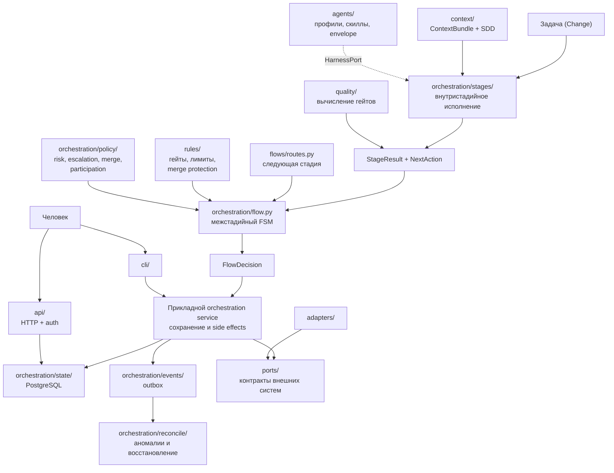

# Описания модулей Factory Core

Этот каталог объясняет устройство ключевых модулей Factory Core на уровне, достаточном для чтения кода, сопровождения и проектирования следующих задач.

## Карта документов

| Документ | Что объясняет |
|---|---|
| [routes.md](routes.md) | Топологию маршрутов `quick` и `standard`, порядок стадий, связь маршрута с гейтами и человеческими гейтами |
| [rules.md](rules.md) | Политики обязательных гейтов, rework-, token-, cost-, deadline-лимитов и branch protection для merge |
| [orchestration-flow-and-state.md](orchestration-flow-and-state.md) | Межстадийный автомат `flow.py`, PostgreSQL state store, идемпотентность, merge policy и эскалации в Flow |
| [orchestration-execution.md](orchestration-execution.md) | Внутристадийное исполнение: snapshot, контекст, taskgraph, детерминированный executor, bounded rework |
| [orchestration-operations.md](orchestration-operations.md) | Эксплуатационные подсистемы: outbox events, reconciler, policy (decision class, escalation, merge, participation, risk) |
| [ports.md](ports.md) | Порты гексагональной архитектуры, DTO, ошибки и правила реализации адаптеров |
| [agents.md](agents.md) | Контракт агента (envelope), профили ролей, скиллы и подключение к HarnessPort |
| [context.md](context.md) | ContextBundle и SDD-слой: модели ChangeSet, frontmatter, baseline, адаптеры native/Spec Kit/OpenSpec |
| [quality.md](quality.md) | Независимую приёмку, specification gate и GateDecision — вычисление результатов гейтов |
| [execution.md](execution.md) | Слой Execution: публикацию run-записей в `dark-factory-runs` — разметка, идемпотентность, immutability, screening, индекс evidence |
| [cli.md](cli.md) | Команды CLI: stage, doctor, ci_job, outbox, reconcile, run records, api serve, release verify |
| [api.md](api.md) | HTTP API: аутентификация, эндпоинты, агрегаты, аудит |
| [crm-end-to-end-flow.md](crm-end-to-end-flow.md) | Сквозной сценарий работы фабрики на примере создания CRM: фазы, роли, гейты, точки участия человека, автономная реализация, доставка |

## Как читать вместе

Главное разделение ответственности:

- `flows/routes.py` отвечает на вопрос **«какая стадия следующая?»**;
- `rules/` — **«можно ли продолжать?»** (гейты, лимиты, branch protection);
- `quality/` — **«какой результат у проверок?»** (вычисление, не решение);
- `orchestration/flow.py` — **«допустимо ли действие и как меняются доменные статусы?»**;
- `orchestration/stages/` + `taskgraph` + `rework` — **«как исполнить одну стадию и когда вернуться на доработку?»**;
- `orchestration/policy/` — **«какие решения требуют человека и какова цена риска?»**;
- `orchestration/events/` + `reconcile/` — **«как доставить эффекты наружу и восстановиться после аномалий?»**;
- `orchestration/state/` — **«как надёжно сохранить operational state?»**;
- `context/` — **«что агент получает на вход и где живёт SDD-слой?»**;
- `agents/` — **«каков контракт агента и его профилей?»**;
- `ports/` — **«через какие provider-neutral контракты ядро взаимодействует с внешним миром?»**;
- `execution/` — **«как запись о run попадает в Git так, чтобы её нельзя было незаметно переписать?»**;
- `cli/` и `api/` — **«как запустить и наблюдать фабрику снаружи?»**.

> В текущем коде доменный Flow, PostgreSQL state store, outbox и reconciler — отдельные подсистемы. Production-сервис, который загружает состояние, вызывает `apply_result()`, сохраняет результат и выполняет внешние эффекты через порты, ещё не реализован; сегодня подсистемы соединяют CLI-команды (`stage`, `outbox`, `reconcile`) и HTTP API.

## Канонические источники

- [HLD](../hld.md), особенно разделы 6–9;
- [ADR-004](../adr/ADR-004-postgresql-factory-state.md) — authoritative state в PostgreSQL;
- [ADR-005](../adr/ADR-005-stage-scoped-graphs-light-workflow-core.md) — два уровня оркестрации;
- [ADR-006](../adr/ADR-006-ephemeral-job-pods-reconciler-cronjob.md) — retries, idempotency, reconcile и fencing;
- [ADR-009](../adr/ADR-009-minimal-bootstrap-otel.md) — минимальный bootstrap, модель доступа и version-bound approvals;
- [ADR-011](../adr/ADR-011-risk-based-merge-release-policy.md) — merge/release policy;
- [ADR-015](../adr/ADR-015-repository-boundaries.md) — границы репозиториев и портов;
- [ADR-016](../adr/ADR-016-postgresql-outbox.md) — transactional outbox;
- [ADR-018](../adr/ADR-018-human-participation-autonomous-execution.md) — участие человека и автономное исполнение;
- [ADR-019](../adr/ADR-019-multi-provider-sc-ci-github-first.md) — provider-neutral SC/CI;
- [ADR-020](../adr/ADR-020-native-sdd-core.md) — каноническая модель SDD (Native SDD Core).
