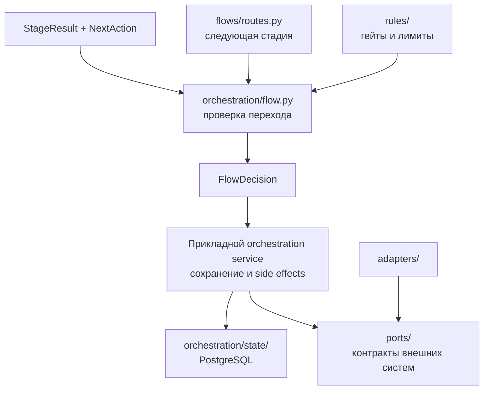

# Описания модулей Factory Core

Этот каталог объясняет устройство ключевых модулей Factory Core на уровне, достаточном для чтения кода, сопровождения и проектирования следующих задач.

## Карта документов

| Документ | Что объясняет |
|---|---|
| [routes.md](routes.md) | Топологию маршрутов `quick` и `standard`, порядок стадий и связь маршрута с гейтами |
| [orchestration-flow-and-state.md](orchestration-flow-and-state.md) | Межстадийный автомат `flow.py`, PostgreSQL state store, идемпотентность, lease/fencing и outbox |
| [ports.md](ports.md) | Порты гексагональной архитектуры, DTO, ошибки и правила реализации адаптеров |
| [rules.md](rules.md) | Политики обязательных гейтов, rework-, token-, cost- и deadline-лимитов |

## Как читать вместе

Главное разделение ответственности:

- `flows/routes.py` отвечает на вопрос **«какая стадия следующая?»**;
- `rules/` — **«можно ли продолжать?»**;
- `orchestration/flow.py` — **«допустимо ли действие и как меняются доменные статусы?»**;
- `orchestration/state/` — **«как надёжно сохранить operational state?»**;
- `ports/` — **«через какие provider-neutral контракты ядро взаимодействует с внешним миром?»**.

> В текущем коде доменный Flow и PostgreSQL state store являются отдельными подсистемами. Production-сервис, который загружает состояние, вызывает `apply_result()`, сохраняет результат и выполняет внешние эффекты через порты, ещё не реализован.

## Канонические источники

- [HLD](../hld.md), особенно разделы 6–9;
- [ADR-004](../adr/ADR-004-postgresql-factory-state.md) — authoritative state в PostgreSQL;
- [ADR-005](../adr/ADR-005-stage-scoped-graphs-light-workflow-core.md) — два уровня оркестрации;
- [ADR-006](../adr/ADR-006-ephemeral-job-pods-reconciler-cronjob.md) — retries, idempotency, reconcile и fencing;
- [ADR-015](../adr/ADR-015-repository-boundaries.md) — границы репозиториев и портов;
- [ADR-016](../adr/ADR-016-postgresql-outbox.md) — transactional outbox;
- [ADR-019](../adr/ADR-019-multi-provider-sc-ci-github-first.md) — provider-neutral SC/CI.
