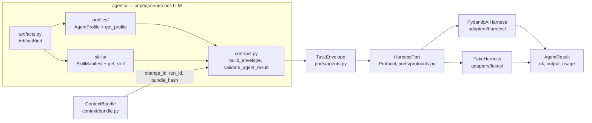
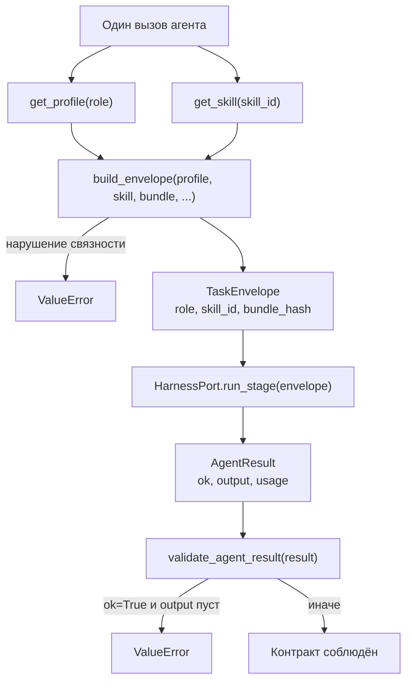
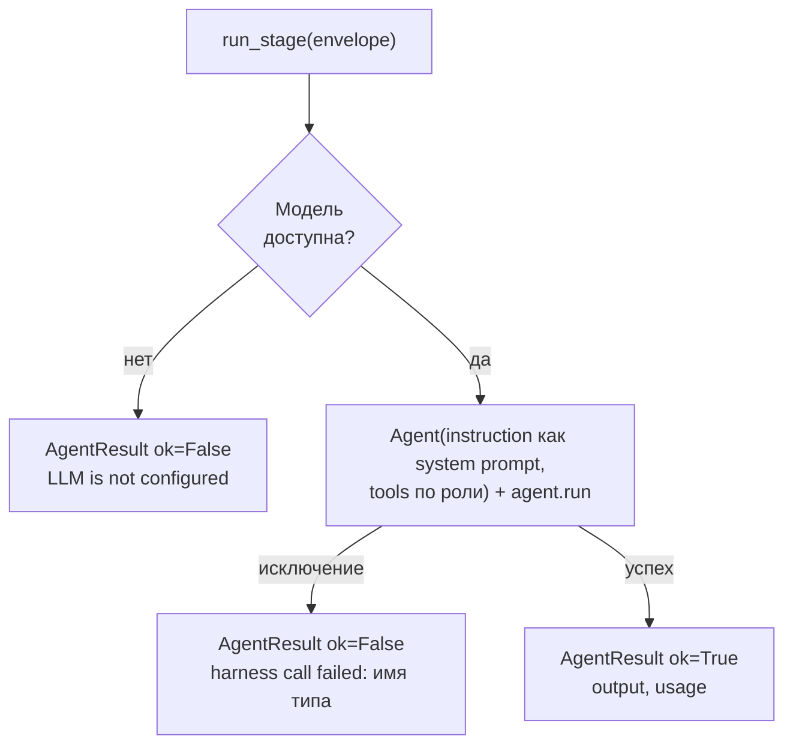

# Агенты — `agents/`

**Исходники:** [`src/dark_factory/agents/`](../../src/dark_factory/agents/)

**Главный потребитель:** production-обвязка пока не подключена. Сегодня модуль потребляют только тесты: [`test_agents_contract.py`](../../tests/test_agents_contract.py), [`test_agents_profiles.py`](../../tests/test_agents_profiles.py), [`test_agents_skills.py`](../../tests/test_agents_skills.py). Порт `HarnessPort` реализуют адаптеры — [`PydanticAIHarness`](../../src/dark_factory/adapters/harness/adapter.py) и [`FakeHarness`](../../src/dark_factory/adapters/fakes/harness.py), контракт порта гоняется на фейке в [`tests/contract/test_harness_port.py`](../../tests/contract/test_harness_port.py). Детерминированный путь стадии — [`orchestration/stages/executor.py`](../../src/dark_factory/orchestration/stages/executor.py) — harness **не вызывает** («the path never invokes the harness», ADR-003); точка подключения агентных вызовов — будущие agent-стадии.

## 1. Назначение

`agents/` определяет роли фабрики как подключаемых change workers (ADR-007) и контракт одного агентного вызова `AgentProfile → TaskEnvelope → AgentResult`:

- `profiles/` — версионированные манифесты ролей: `AgentProfile` (декларация входов/выходов, allowlist инструментов, ограничения, stop-conditions) и реестр `get_profile()`;
- `skills/` — версионированные манифесты единиц работы: `SkillManifest` и реестр `get_skill()`;
- `contract.py` — сборка конверта вызова `build_envelope()` и проверка результата `validate_agent_result()`;
- `artifacts.py` — `ArtifactKind`: стабильные wire-строки деклараций входов/выходов;
- `errors.py` — `AgentDefinitionError` и наследники.

Чего подсистема не делает:

- не выполняет LLM-вызовы — исполнение за `HarnessPort` (`ports/protocols.py`) и адаптером PydanticAI (`adapters/harness/`);
- не управляет Flow и не решает, когда какого агента запускать;
- не интерпретирует `stop_conditions` машинно — это свободный текст до машины эскалаций (T-016);
- не хранит состояние вызовов: профили и скиллы — иммутабельные типизированные константы.

## 2. Архитектура



Контракт делит ответственности так: `agents/` знает, **кто** и **над чем** работает (профиль + скилл + снимок контекста); `ports/agents.py` держит DTO конверта и результата; адаптер решает, **чем** именно выполнить вызов. Реестры профилей и скиллов не связаны между собой: проверки привязки «скилл ↔ профиль» живут в `build_envelope` и в тестах.

## 3. Порт: конверт и результат (`ports/agents.py`)

`HarnessPort` — единственная граница выполнения агентной работы (`@runtime_checkable` Protocol):

```python
async def run_stage(self, envelope: TaskEnvelope, /) -> AgentResult: ...
async def health(self, /) -> HealthStatus: ...
```

Обе DTO — frozen pydantic-модели с `AGENTS_SCHEMA_VERSION = 1` (`type AgentSchemaVersion = Literal[1]`): добавление optional-полей не меняет версию, breaking change — меняет (ADR-015 п.3). `TaskEnvelope.skill_id` и `TaskEnvelope.bundle_hash` добавлены именно так (T-011).

| Поле `TaskEnvelope` | Тип | Default | Смысл |
|---|---|---|---|
| `schema_version` | `Literal[1]` | `1` | версионированный контракт |
| `change_id` | `str`, min_length=1 | — | change |
| `run_id` | `str`, min_length=1 | — | run |
| `stage` | `Stage` | — | стадия |
| `role` | `Role` | — | роль агента |
| `instruction` | `str`, min_length=1 | — | задание агенту |
| `skill_id` | `str \| None`, min_length=1 | `None` | id скилла (T-011) |
| `bundle_hash` | `str \| None`, min_length=1 | `None` | sha256 снимка `ContextBundle` (T-011) |

| Поле `AgentResult` | Тип | Default |
|---|---|---|
| `schema_version` | `Literal[1]` | `1` |
| `ok` | `bool` | — |
| `output` | `str` | `""` |
| `usage` | `Usage \| None` | `None` |

`Usage` (из `changes/usage.py`): `prompt_tokens=0`, `completion_tokens=0`, `total_tokens=None`, `cost=None` (`Decimal`). `HealthStatus` — frozen dataclass: `healthy: bool`, `detail: str \| None = None`.

## 4. Контракт вызова (`contract.py`)

```python
def build_envelope(
    *,
    profile: AgentProfile,
    skill: SkillManifest,
    bundle: ContextBundle,
    change_id: str,
    run_id: str,
    stage: Stage,
    instruction: str,
) -> TaskEnvelope: ...
```

Только keyword-аргументы. Четыре проверки связности, каждая — `ValueError` (не `AgentDefinitionError`):

| Проверка | Текст ошибки |
|---|---|
| `skill.role == profile.role` | `skill '<id>' belongs to role '<role>', not '<role>'` |
| `skill.id in profile.skills` | `skill '<id>' is not bound to profile '<role>'` |
| `bundle.change_id == change_id` | `bundle belongs to change '<id>', not '<id>'` |
| `bundle.run_id == run_id` | `bundle belongs to run '<id>', not '<id>'` |

При успехе конверт фиксирует `role=profile.role`, `skill_id=skill.id`, `bundle_hash=bundle.bundle_hash` — агент обязан работать от зафиксированного снимка контекста (FR-001). Обратная сторона — `validate_agent_result(result: AgentResult) -> None`: успешный вызов обязан нести непустой output (проверка после `strip()`), иначе `ValueError` `successful AgentResult must carry non-empty output`; неуспешный может нести любой output, `usage` опционален в обоих случаях.



## 5. Профили (`profiles/`)

`AgentProfile` — frozen pydantic-модель, `AGENT_PROFILE_SCHEMA_VERSION = 1` (`ProfileSchemaVersion = Literal[1]`). Роль — идентичность профиля: ровно один профиль на роль. Поля: `role: Role`, `name`, `version`, `description` (все min_length=1), `inputs`/`outputs: tuple[ArtifactKind, ...]`, `tools`, `constraints`, `stop_conditions`, `skills` — кортежи строк. Имена инструментов — только имена: привязка к callables выполняется в обвязке harness (T-092 S2) — `WorkspaceTools` (`orchestration/stages/tools.py`) разрешает имена профиля в async-callables над изолированным workspace громко падая на неизвестное имя, а `Runtime.harness_of` (`dark_factory.runtime`) отдаёт их harness'у стадии.

| Константа | `name` | `version` | inputs | outputs | tools | skills |
|---|---|---|---|---|---|---|
| `PRODUCT_PROFILE` | `Product` | `1.0.0` | task, context | requirements, spec, change_request | `read_file`, `search_repo` | intake, requirements-refinement, spec-authoring, change-request |
| `DESIGN_PROFILE` | `Design` | `1.0.0` | spec, context | ux_spec | `read_file`, `search_repo` | ux-flow, accessibility-review |
| `ARCHITECT_PROFILE` | `Architect` | `1.0.0` | requirements, spec, context | architecture_review, adr_proposal | `read_file`, `search_repo` | impact-analysis, adr-proposal |
| `DEVELOP_PROFILE` | `Develop` | `1.0.0` | spec, review_report, context | code | `read_file`, `write_file`, `apply_patch`, `run_command` | implementation, implementation-rework |
| `QUALITY_PROFILE` | `Quality` | `1.0.0` | spec, code, context | review_report, acceptance_verdict | `read_file`, `run_tests`, `run_command` | code-review, acceptance-verification |

У каждого профиля 3 ограничения (`constraints`) и по 3 stop-conditions, кроме develop — у него 4. `CORE_ROLES = (Role.PRODUCT, Role.DESIGN, Role.ARCHITECT, Role.DEVELOP, Role.QUALITY)` — роли с профилями, порядок каталога ADR-007 (ADR-007 п.4: ядро MVP product/develop/quality, design и architect подключены в T-046 к гейтам ui/planning ADR-023); остальные четыре (`infrastructure`, `security`, `ci_cd`, `operation`) — явная ошибка до T-047 (T-082; так в докстринге модуля). `get_profile(role)` при промахе бросает `ProfileNotFoundError(f"no agent profile for role {role.value!r}")` — например `'infrastructure'`.

Манифесты читаются не из файлов: профили — `Final`-константы Python в `registry.py`, инфраструктуры манифест-файлов в кодовой базе нет.

## 6. Скиллы (`skills/`)

`SkillManifest` — frozen, `AGENT_SKILL_SCHEMA_VERSION = 1`. `id` валидируется паттерном `^[a-z0-9]+(-[a-z0-9]+)*$` (kebab-case wire-id, его ссылают профили); `instruction` (min_length=1) — по замыслу текст, который уходит агенту как промпт, `stop_conditions` — свободный текст до T-016. Зарегистрировано 12 скиллов, все `version="1.0.0"`:

| id | Роль | inputs | outputs |
|---|---|---|---|
| `intake` | product | task, context | requirements |
| `requirements-refinement` | product | requirements, context | requirements |
| `spec-authoring` | product | requirements, context | spec |
| `change-request` | product | requirements, context | change_request |
| `ux-flow` | design | spec, context | ux_spec |
| `accessibility-review` | design | ux_spec, context | ux_spec |
| `impact-analysis` | architect | requirements, spec, context | architecture_review |
| `adr-proposal` | architect | architecture_review, context | adr_proposal |
| `implementation` | develop | spec, context | code |
| `implementation-rework` | develop | review_report, context | code |
| `code-review` | quality | code, context | review_report |
| `acceptance-verification` | quality | spec, code, context | acceptance_verdict |

`get_skill(skill_id)` бросает `SkillNotFoundError(f"unknown skill id {skill_id!r}")` — опечатка в id обязана падать громко. `ArtifactKind` (`artifacts.py`, StrEnum): `task`, `requirements`, `spec`, `change_request`, `code`, `review_report`, `acceptance_verdict`, `context`, `ux_spec`, `architecture_review`, `adr_proposal` — значения сериализуются в манифестах, переименование считается breaking change (ADR-015 п.3). Ошибки определения (`errors.py`): `AgentDefinitionError(RuntimeError)` → `ProfileNotFoundError`, `SkillNotFoundError`.

> `build_envelope` принимает `instruction` параметром и не извлекает промпт из `skill.instruction` — связку «скилл → промпт конверта» реализует пока только вызывающая сторона (в коде — тесты).

## 7. Адаптер PydanticAI и fake (кратко)

`PydanticAIHarness(HarnessPort)` строит PydanticAI `Agent` на каждый вызов — import и конструкция не зависят от конфигурации. `instruction` конверта уходит и системным, и пользовательским промптом; инструменты берутся из `role_tools: Mapping[Role, Sequence[ToolFunction]]` по `envelope.role` (по умолчанию пусто — агент без инструментов). `run_stage(envelope, /, *, output_type=None)`: `output_type` — pydantic-модель структурного ответа, сериализуется в `output` через `model_dump_json`; параметр расширяет протокол, не меняя его. Параметр `model` — подмена эндпоинта для тестов (`TestModel`/`FunctionModel`), не для production.

Структурный ответ запрашивается в **prompted-режиме** (`PromptedOutput(output_type)`): модель отвечает JSON в тексте ответа (`response_format: json_object`), а не вызывает output tool. Дефолтный `ToolOutput` заставляет `tool_choice: "required"`, который эндпоинт с активным thinking mode отвергает (`400 Thinking mode does not support this tool_choice`), а у DeepSeek thinking включён по умолчанию; prompted-режим оставляет thinking включённым, не требует вендорских профилей и дешевле по промпту (без схемы инструмента). Ограничения и альтернативы (в т.ч. `NativeOutput` — недоступен, `json_schema` эндпоинт не принимает) — TD-015.

Политика ошибок — `run_stage` **не бросает исключений**:

| Ситуация | Результат |
|---|---|
| Модель недоступна (нет конфигурации) | `ok=False`, `output="LLM is not configured; set the DARK_FACTORY_LLM_* variables (see harness health for the missing ones)"` |
| Любое исключение вызова | `ok=False`, `output="harness call failed: <type(exc).__name__>"` — только имя типа, тексты с URL/credentials не утекают (ADR-009) |
| Успех | `ok=True`, output, `usage`: `prompt=input_tokens`, `completion=output_tokens`, `total=input+output`, `cost` наилучшим образом от PydanticAI или `None` |

Учёт usage (`_map_usage`): PydanticAI `RunUsage` отображается на ядро `Usage`. `health()` — офлайн-проба без сети: без конфигурации перечисляет отсутствующие переменные, blank `model`/`api_key` и невалидный `base_url` сообщает именем переменной без значения; здоровый detail показывает модель и маскированный URL (`scheme://host:port`, путь/userinfo/query отброшены), api key никогда не выводится. Конфигурация — `HarnessConfig` (frozen dataclass): `base_url`, `api_key`, `model` из переменных `DARK_FACTORY_LLM_BASE_URL`, `DARK_FACTORY_LLM_API_KEY`, `DARK_FACTORY_LLM_MODEL`; `from_env()` возвращает `None` при любой отсутствующей/blank переменной, значения strip-ятся, `missing_env_vars()` отдаёт имена в стабильном порядке.

`FakeHarness` — детерминированный in-memory фейк для тестов: `output=f"fake:{role.value}:{stage.value}:{instruction}"`, `usage=None`, `health()` всегда healthy с detail `in-memory fake harness`.



## 8. Граничные случаи

| Случай | Поведение |
|---|---|
| `get_profile` для не-core роли (4 из 9) | `ProfileNotFoundError` с именем роли |
| `get_skill` с неизвестным id | `SkillNotFoundError` |
| Скилл чужой роли в `build_envelope` | `ValueError` `belongs to role` |
| Скилл той же роли, но не в `profile.skills` | `ValueError` `not bound` |
| `bundle` чужого change/run | `ValueError` `belongs to change` / `belongs to run` |
| `ok=True`, output пустой или из пробелов | `ValueError` от `validate_agent_result` |
| `ok=False` без output | валидно: failure detail |
| Конверт без `skill_id`/`bundle_hash` | валиден: поля optional, расширение additive (ADR-015 п.3) |
| id скилла не kebab-case | pydantic `ValidationError` по pattern ещё при построении манифеста |
| Дубликат skill id или рассинхрон `profile.skills` ↔ реестр | в рантайме не проверяется; связность гарантируют тесты |
| Harness без конфигурации | `ok=False`, не exception; import/конструкция не падают |
| Исключение внутри вызова модели | в output только имя типа исключения (ADR-009) |
| Credentials в `base_url` при `health()` | маскируются до `scheme://host:port` |

## 9. Где искать проверки

- [`test_agents_contract.py`](../../tests/test_agents_contract.py) — `build_envelope`: фиксация роли/скилла/контекста и четыре отказа связности; `validate_agent_result`: пустой output, `ok=False`, optional `usage`; минимальный конверт без новых полей остаётся валидным;
- [`test_agents_profiles.py`](../../tests/test_agents_profiles.py) — `CORE_ROLES` ровно пять (каталог ADR-007); у каждой core-роли профиль, у остальных четырёх — ошибка с именем роли; полнота манифеста; каждый skill профиля существует и принадлежит роли;
- [`test_agents_skills.py`](../../tests/test_agents_skills.py) — 12 скиллов зарегистрированы и уникальны; id в kebab-case; полнота манифестов; каждый скилл привязан к профилю своей роли; неизвестный id — ошибка;
- [`test_harness_adapter.py`](../../tests/test_harness_adapter.py) — protocol-совместимость; `instruction` как system и user prompt; mapping usage/cost; structured output; инструменты по роли и изоляция ролей; политика ошибок без текстов исключений; маскирование в `health()`; `HarnessConfig.from_env`/`missing_env_vars`;
- [`contract/test_harness_port.py`](../../tests/contract/test_harness_port.py) — контракт порта на `FakeHarness` (фикстура `harness_port` в `contract/conftest.py`): версионированный результат, детерминизм, health.

## 10. Связанные решения

- [ADR-002](../adr/ADR-002-python-core-stack.md) — Python-стек ядра: PydanticAI за `HarnessPort` (п.2), LLM — существующий LiteLLM-прокси (§6);
- [ADR-007](../adr/ADR-007-nine-role-catalog.md) — каталог 9 ролей; контракт `AgentProfile → TaskEnvelope → AgentResult` (п.3); ядро MVP — Product/Develop/Quality (п.4);
- [ADR-008](../adr/ADR-008-plugin-architecture-core-sdk.md) — расширение каталога ролей плагинами типа `agent` с манифестом (п.2, п.5);
- [ADR-015](../adr/ADR-015-repository-boundaries.md) — версионированные контракты и additive-правило (п.3); значения `ArtifactKind` — стабильные wire-строки.

## 11. Связь с другими модулями

- [ports.md](ports.md) — `HarnessPort`, `TaskEnvelope`/`AgentResult` среди портов и DTO ядра;
- [orchestration-execution.md](orchestration-execution.md) — исполнение стадий и будущая точка подключения harness.
