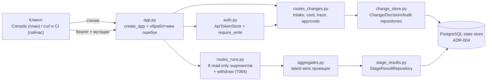
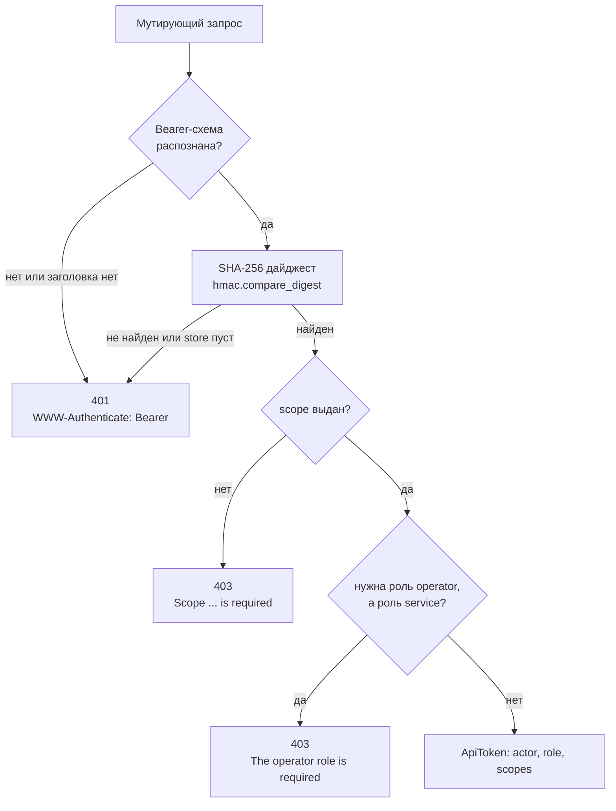
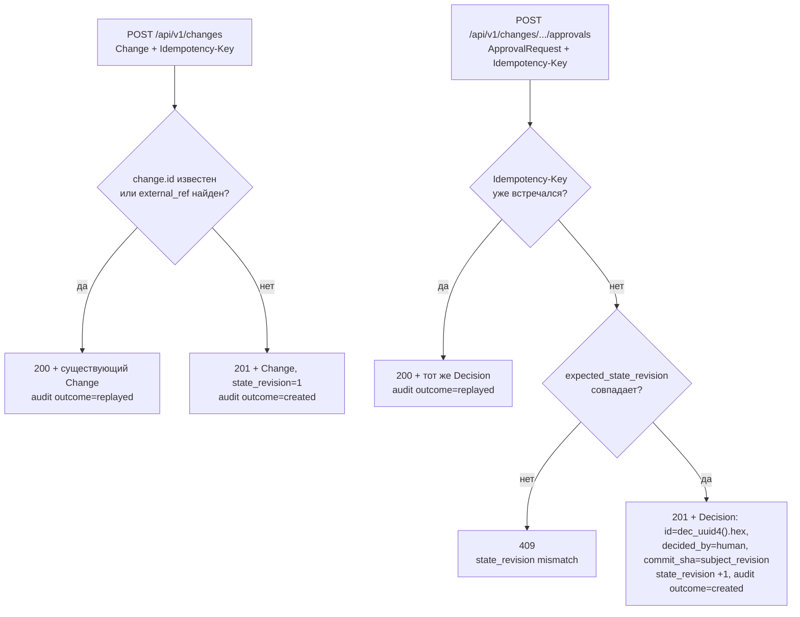

# HTTP API — `api/`

**Исходники:** [`src/dark_factory/api/`](../../src/dark_factory/api/)

**Главный потребитель:** React Console (T036, [ADR-014](../adr/ADR-014-react-uikit-storybook.md)) — планируется; фактически процесс поднимает CLI [`cli/api.py`](../../src/dark_factory/cli/api.py), команда `factory api serve`.

## 1. Назначение

`api/` — операторская control-панель фабрики поверх PostgreSQL state store: FastAPI-приложение (title `Dark Factory API`, version `0.1.0`, префикс `/api/v1`) по контракту [api.md](../../specs/001-dark-factory-mvp/contracts/api.md).

Что API даёт прямо сейчас:

- чтение состояния конвейера: runs, логические стадии, usage, гейты, findings, evidence и trace-цепочки;
- intake change (`POST /changes`) с дедупликацией, запись решений оператора (`POST .../approvals`) и снятие/отзыв запуска (`POST /runs/{run_id}/withdraw`, T064, TD-030);
- bearer-аутентификацию мутаций, аудит каждой мутации в одной транзакции и идемпотентность по `Idempotency-Key` (ADR-009 п.7);
- единый RFC 7807-подобный формат тела любой ошибки (`type`, `title`, `status`, `detail`).

Чего нет:

- эндпоинтов retry/pause — из операторских команд ADR-009 п.7 реализованы intake, approvals и withdraw;
- аутентификации на чтении: все GET открыты (локальный контур, ADR-009 п.7);
- запуска стадий: API не вызывает доменный Flow; единственные мутации — intake, approval и withdraw;
- production-контура: приложение stateless, поднимается локально через `factory api serve` (uvicorn, дефолты `--host 127.0.0.1 --port 8000`) и деплоится Helm-чартом [`charts/dark-factory`](../../charts/dark-factory/) (Deployment 1 реплика, Service ClusterIP, Console — T036); prod-контур отсутствует.

## 2. Путь запроса

`create_app(session_factory, tokens=None)` собирает приложение: сессия — одна на запрос (commit при успехе, rollback при любой ошибке), `tokens=None` означает чтение `DARK_FACTORY_API_TOKENS`. Оба мутирующих роутера получают сессию и token store: changes — для intake/approvals, runs — для единственной мутации `withdraw` (T064).

Любая ошибка уходит через три обработчика приложения: `StarletteHTTPException` — статус и detail исключения (с сохранением заголовков, например `WWW-Authenticate`), `RequestValidationError` — 422, прочие исключения — 500. Тело всегда строит `ErrorBody(type="about:blank", title=<HTTP-фраза статуса>, status, detail)`; catch-all 500 никогда не отдаёт текст исключения — он может содержать credentials (ADR-009).

## 3. Эндпоинты

Все пути ниже с префиксом `/api/v1`. Ответы `Change`, `StageResult`, `Decision`, `Finding`, `GateResult`, `Evidence` — доменные pydantic-модели из `changes/` без обёрток: wire format API равен версионируемым run-record контрактам (ADR-015).

| Метод | Путь | Назначение | Ответ | Доступ |
|---|---|---|---|---|
| GET | `/runs` | Список runs; фильтры `change_id`, `status`, `stage`; пагинация | `RunSummary[]` | открыто |
| GET | `/runs/{run_id}` | Карточка run: статус, стадии, usage, гейты, открытые blocker-фединги | `RunCard` | открыто |
| GET | `/runs/{run_id}/stage-results` | Сырые неизменяемые результаты попыток | `StageResult[]` | открыто |
| GET | `/runs/{run_id}/trace` | Цепочка SC-007 в каноническом порядке стадий | `RunTrace` | открыто |
| GET | `/runs/{run_id}/evidence` | Evidence прогона после dedup по id, сортировка по id | `Evidence[]` | открыто |
| GET | `/runs/{run_id}/evidence/{evidence_id}` | Один evidence | `Evidence` | открыто |
| GET | `/runs/{run_id}/gates` | Последний `GateResult` на каждый гейт | `GateResult[]` | открыто |
| GET | `/runs/{run_id}/findings` | Findings после dedup; фильтры `severity`, `status`; сортировка по id | `Finding[]` | открыто |
| POST | `/runs/{run_id}/withdraw` | Снятие/отзыв паркованного run (T064, TD-030): run и non-terminal стадии → `canceled`, коммитнутая история не переписывается | `RunSummary`; 200 снят/replay, 409 терминальный run | Bearer + `runs:write` + роль `operator` |
| POST | `/changes` | Intake change (FR-001) с дедупом по `id` и `external_ref` | `Change`; 201 created, 200 replay | Bearer + `changes:write` |
| GET | `/changes` | Список change-документов; фильтр `product_id` (T071) | `Change[]` | открыто |
| GET | `/changes/{change_id}` | Карточка: Change + runs + счётчик решений | `ChangeCard` | открыто |
| GET | `/changes/{change_id}/trace` | Полная SC-007-цепочка по всем run change | `ChangeTrace` | открыто |
| PUT | `/changes/{change_id}/brief` | Замена брифа задачи (T071/T072); `status` брифа выводится из полей | `Change`; 404 | Bearer + `changes:write` |
| GET | `/changes/{change_id}/guidance` | «Следующий шаг» задачи — серверная проекция `Guidance` (T074, ADR-033) | `Guidance`; 404 | открыто |
| POST | `/briefs/formulate` | «Помоги сформулировать»: свободный текст → `IntakeBrief` через harness (T072); stateless | `IntakeBrief`; всегда 200 — без harness/при отказе `status=draft` с `error` | Bearer + `changes:write` |
| GET | `/changes/{change_id}/approvals` | Решения по change | `Decision[]` | открыто |
| POST | `/changes/{change_id}/approvals` | Запись version-bound решения оператора | `Decision`; 201, 200 replay, 409 | Bearer + `approvals:write` + роль `operator` |
| GET | `/products` | Реестр продуктов; пагинация `limit`/`offset` (T066, ADR-030) | `Product[]` | открыто |
| POST | `/products` | Регистрация продукта с дедупом по `id` | `Product`; 201 created, 200 replay | Bearer + `products:write` + роль `operator` |
| GET | `/products/{product_id}` | Один продукт | `Product`; 404 неизвестный | открыто |
| POST | `/products/{product_id}/validate` | Наблюдение репозитория через `RepositoryProvisioningPort` и запись готовности `validating → ready/error` (T066, ADR-030/ADR-031) | `ProductValidationView`; 200, 404, 409 устаревшая ревизия, 503 провижининг не сконфигурирован | Bearer + `products:write` + роль `operator` |
| POST | `/products/{product_id}/bootstrap` | Применить baseline-паки к репозиторию продукта через `RepositoryProvisioningPort.bootstrap_baseline` (T069/M2, ADR-031 p.3); по умолчанию `product-baseline` | `ProductBootstrapView`; 200, 404, 409 адаптер не умеет bootstrap, 503 не сконфигурировано | Bearer + `products:write` + роль `operator` |
| GET | `/products/{product_id}/guidance` | «Следующий шаг» продукта — `Guidance` (T074, ADR-033) | `Guidance`; 404 | открыто |
| GET | `/changes/{change_id}/questions` | Вопросы агента; фильтры `status`, `phase` (T078/T086, ADR-034) | `Question[]` | открыто |
| POST | `/changes/{change_id}/questions` | Заявить вопрос (агент через service-токен или оператор); id детерминирован от `Idempotency-Key` | `Question`; 201, 200 replay | Bearer + `changes:write` |
| POST | `/changes/{change_id}/questions/{question_id}/answer` | Ответ оператора — человеческое решение, проверяется по типу вопроса | `Question`; 404, 409 не open, 422 ответ не подходит | Bearer + `changes:write` + роль `operator` |
| GET | `/changes/{change_id}/comments` | Замечания с состоянием якоря (`anchor_state`); фильтры `status`, `phase`, `artifact` | `CommentView[]` | открыто |
| POST | `/changes/{change_id}/comments` | Замечание к фрагменту, привязанное к голове ветки изменения; доработку не запускает | `CommentView`; 201, 200 replay | Bearer + `changes:write` + роль `operator` |
| POST | `/changes/{change_id}/comments/{comment_id}/addressed` | Отметка агента «исправлено» → `addressed` (не закрыто) | `CommentView`; 404, 409 | Bearer + `changes:write` |
| POST | `/changes/{change_id}/comments/{comment_id}/close` · `/reopen` | Закрытие/переоткрытие замечания оператором | `CommentView`; 404, 409 | Bearer + `changes:write` + роль `operator` |
| GET | `/changes/{change_id}/rework-orders` | Поручения на доработку; фильтры `phase`, `status` | `ReworkOrder[]` | открыто |
| POST | `/changes/{change_id}/rework-orders` | «На доработку»: явное поручение, одно на фазу одновременно; пишет version-bound `rejected` по гейту фазы в той же транзакции (T081, ADR-034 p.3) | `ReworkOrder`; 201, 200 replay, 404 неизвестный комментарий/вопрос, 409 уже есть / ревизия устарела, 422 пустое | Bearer + `changes:write` + роль `operator` |
| GET | `/changes/{change_id}/phase-gate` | Прекондиции гейта фазы (T087): доступность, причины с действием, ревизия, состояние согласований (`current`/`stale`/`unbound`), счётчики, доработка | `PhaseGate`; 404 | открыто |
| GET | `/changes/{change_id}/artifacts` | Дерево артефактов ChangeSet на голове ветки изменения (`.factory/changes/**`) + пути черновиков (T082, ADR-035) | `ArtifactTreeView`; 404, 503 без репозитория | открыто |
| GET | `/changes/{change_id}/artifacts/{path}` | Документ на ревизии (`?revision=`): содержимое, свойства frontmatter, якоря, черновик, «просмотрено», счётчики (T082/T083) | `ArtifactDocumentView`; 404, 503 | открыто |
| PUT | `/changes/{change_id}/artifacts/{path}` | Write-through: правка → один коммит в ветку изменения через `RepositoryPort.publish_commit` (T084); удаляет черновик, применяет staleness обсуждения | `ArtifactWriteView`; 200, 409 конфликт с `base_revision`, 422 защищённое свойство, 503 | Bearer + `changes:write` + роль `operator` |
| GET | `/changes/{change_id}/artifact-versions/{path}` | Ревизии документа (коммиты пути), новые первыми (T083) | `ArtifactRevision[]`; 503 | открыто |
| GET | `/changes/{change_id}/artifact-diff/{path}` | Unified diff между `from_revision` и `to_revision` (T083) | `ArtifactDiff`; 404, 503 | открыто |
| GET · PUT · DELETE | `/changes/{change_id}/artifact-drafts/{path}` | Черновик автосейва вне git (T085, ADR-035 p.4): `stale` — голова ушла от `base_revision` | `ArtifactDraftView`; 404 без черновика; DELETE 204 | GET открыто; PUT/DELETE Bearer + `changes:write` + роль `operator` |
| POST | `/changes/{change_id}/artifact-views/{path}` | «Просмотрено» для ревизии — отдельная запись, не согласование (T080, ADR-034 p.2) | `ArtifactDocumentView` | Bearer + `changes:write` + роль `operator` |
| GET | `/ci/stages` | Каталог этапов CI фабрики и текущее состояние их переключателей (T059, ADR-027) | `CiStagesView`; `available=false` + `reason`, когда контур не сконфигурирован | открыто |
| PUT | `/ci/stages/{job}` | Включение/выключение одного этапа CI (идемпотентное целевое состояние) | `CiStageView`; 404 неизвестный этап, 502 ошибка GitHub, 503 не сконфигурировано | Bearer + `ci:write` + роль `operator` |

`/ci/*` — единственные эндпоинты, которые ходят во внешнего провайдера (repository variables GitHub), а не в state store: каталог этапов берётся из кода (`dark_factory.orchestration.ci`), состояние — из переменных `CI_SKIP_<JOB>` репозитория фабрики. Неизвестный `job` — всегда 404: имя переменной выводит каталог, запрос не может назвать произвольную переменную. Без GitHub App (`DARK_FACTORY_GITHUB_*` + `DARK_FACTORY_GITHUB_REPOSITORY_SLUG`) чтение отдаёт каталог с `available=false`, а запись отвечает 503 — фиктивный выключатель не показывается.

Продукты (`/products`, T066) — реестр продуктов (ADR-030): верхний уровень навигации, из которого начинается любое изменение. Регистрация идемпотентна по клиентскому `id` (повтор → 200 и audit `replayed`), требует роли `operator` и скоупа `products:write`. Валидация — **единственный** эндпоинт продуктов, который ходит не только в state store: она наблюдает репозиторий через `RepositoryProvisioningPort` (ADR-031) и записывает исход в статус продукта; без сконфигурированного порта отвечает 503 и **не меняет** статус — фиктивная готовность не показывается (ADR-031 p.6). Правило готовности и переход через `validating` живут в `orchestration/products.py` и разделяются с CLI `factory product validate` (T070), поэтому API и CLI не расходятся в статусе. Отказом считается только `UNAVAILABLE`: пустой репозиторий и отсутствующий baseline — штатные состояния, в которых baseline создаётся позже (ADR-031 p.4), поэтому продукт становится `ready`; детальный `state` наблюдения (`empty`/`baseline_absent`/`baseline_current`/`baseline_stale`) возвращается в поле `validation`. Повторная валидация разрешена — она ничего не мутирует (ADR-031 p.5).

Intake задачи (T071–T074, план ChangeSet §6). `Change` несёт `product_id` (ADR-030 p.2), структурированный бриф `IntakeBrief` (`problem`, `goal`, `constraints[]`, `out_of_scope[]`, исходный текст `source_text`, `formulated_by: operator|agent`, `error`), сценарий `scenario` (`specs_only | full`, по умолчанию `full`) и жёсткий лимит расхода `spend_limit` (`cost_budget_usd` — Decimal в USD, опц. `token_budget`); лимит копируется в `BudgetSnapshot` run при его создании (`factory run advance --change-id`). Статус брифа **выводится** сервером: `complete` только при непустых `problem` и `goal`, иначе `draft` — заявленный клиентом статус игнорируется. `POST /briefs/formulate` — единственный эндпоинт, который ходит в агентный harness: без `DARK_FACTORY_LLM_*` (шов `brief_formulator` не связан) или при отказе/сбое агента он отвечает 200 с черновиком, исходным текстом и человекочитаемой `error` — форма не ломается, а фабрика не выдумывает бриф (T072 DoD). `GET …/guidance` — read-model «следующего шага» (ADR-033): `headline`, `why`, ровно одно `primary`-действие (`label`, `cli`, `api`, `enabled`, `reason`), `secondary[]`, `blockers[]` (`what`, `who: operator|agent|ci|factory|external`, `how`), `after`, `phase` (ADR-032: `initiative … delivery | done`); вычисляется в `orchestration/guidance.py` из продукта, брифа, последнего run и его `NextAction` (`orchestration/state/guidance.py` собирает факты) — CLI `factory change status` печатает тот же объект.

Обсуждение и артефакты (T078–T087, ADR-034/ADR-035, план ChangeSet §6, M2). Домен обсуждения — `changes/conversations.py`: `Question` (`open → answered → resolved | stale`, тип ответа `choice|text|number`, привязка к фазе и якорю `artifact + anchor_id + revision`), `Comment` (`open → addressed → closed`; «исправлено» агента — `addressed`, закрывает только оператор; потерянный якорь показывается как `anchor_state=detached` и никуда не переносится), `ReworkOrder` (`pending → in_progress → done | escalated`; счётчик раундов — бюджет run, не число замечаний). Операции общие с CLI (`orchestration/state/conversation_ops.py`): API только мапит их типизированные отказы на 404/409/422. Артефакты (`orchestration/artifacts.py` над `RepositoryPort`): git — источник истины, ветка изменения `factory/<slug>`, поддерево `.factory/changes/**`; «артефакта нет» (`404`) и «ветки ещё нет» (`revision: null` в дереве) различимы; правка становится одним коммитом с идемпотентностью по `Idempotency-Key` (или дайджесту содержимого), конфликт — только когда файл менялся после `base_revision`; свойства frontmatter отдаются как данные, `schema/id/type/product/change` защищены (422). Новая ревизия делает прежние согласования `stale` (read-model `GET …/phase-gate`), открытые вопросы к исчезнувшему фрагменту — `stale`, замечания — `detached`. Без сконфигурированного репозитория `/artifacts*` отвечают 503, а гейт считает ревизию *неизвестной*, не отсутствующей. Прекондиции гейта (`orchestration/phase_gate.py`, T087): гейт закрыт при блокирующих открытых вопросах, ожидающем или идущем раунде доработки и отсутствии ревизии; каждая причина несёт действие; `POST …/approvals` применяет те же прекондиции, а `Guidance` их рендерит — CLI, API и Console называют одну причину.

Тела и параметры:

| Элемент | Где | Значения и ограничения |
|---|---|---|
| `Change` (тело) | `POST /changes` | доменный документ: `id`, `title`, `source` (tracker/console/cli/api), `product`, `risk_class` (R0–R4), опц. `external_ref`, `change_request`, `product_id`, `brief` (`IntakeBrief`), `scenario` (`specs_only`/`full`, default `full`), `spend_limit` (`cost_budget_usd` > 0, ≤ 4 знака; опц. `token_budget` ≥ 1) |
| `IntakeBrief` (тело) | `PUT /changes/{id}/brief` | `problem`, `goal`, `constraints[]`, `out_of_scope[]`, `source_text`, `formulated_by`; `status` и пустые строки нормализуются сервером |
| `BriefFormulateRequest` (тело) | `POST /briefs/formulate` | `source_text` (min_length=1) |
| `product_id` | `GET /changes` | фильтр по владеющему продукту (min_length=1) |
| `ApprovalRequest` (тело) | `POST .../approvals` | `gate` (7 значений Gate), `outcome` (approved/rejected/waived), `subject_revision` — обязателен (min_length=1), опц. `comment`, `expected_state_revision` |
| `Idempotency-Key` (заголовок) | все POST/PUT | опционален; повтор возвращает прежний результат (у вопросов/замечаний/поручений id выводится из ключа) |
| `QuestionCreateRequest` (тело) | `POST …/questions` | `text`, `kind` (`choice|text|number`, default `text`), `options[]` (только `choice`, ≥ 2), `anchor{artifact, anchor_id?, revision?}`, `blocking` (default `true`), `phase?`, `run_id?` |
| `AnswerRequest` (тело) | `POST …/questions/{id}/answer` | `value` (min_length=1; для `choice` — один из `options`, для `number` — число), `comment?` |
| `CommentCreateRequest` (тело) | `POST …/comments` | `artifact`, `anchor_id?`, `revision?` (default — голова ветки), `body`, `phase?` |
| `ReworkOrderRequest` (тело) | `POST …/rework-orders` | `phase?`, `comment_ids[]`, `question_ids[]`, `instruction?` (хотя бы одно из трёх), `expected_revision?` |
| `ArtifactEditRequest` (тело) | `PUT …/artifacts/{path}` | `content`, `base_revision?`, `message?`, `properties?` (значения frontmatter поверх `content`; защищённые ключи — 422) |
| `ArtifactDraftRequest` / `ArtifactViewRequest` (тело) | `PUT …/artifact-drafts/{path}` / `POST …/artifact-views/{path}` | `{content, base_revision?}` / `{revision}` |
| `ProductBootstrapRequest` (тело) | `POST /products/{id}/bootstrap` | `packs[]` (default `["product-baseline"]`) |
| `phase` | обсуждение, `phase-gate` | `Phase` (ADR-032): `initiative … delivery | done`; по умолчанию — фаза последнего run, до первого run — `requirements` |
| `CiStageToggleRequest` (тело) | `PUT /ci/stages/{job}` | `enabled` — строгий bool (`strict=True`): `"yes"`/`1` не коэрцятся, ответ 422 |
| `ProductCreateRequest` (тело) | `POST /products` | `id` (min_length=1, клиентский — по нему дедуп), `name`, `repository` (`RepositoryRef`), опц. `description`, `repository_url`, `baseline_ref`, `dev_env_ref`; `status`/`state_revision`/`created_at` — серверные |
| `ProductValidateRequest` (тело) | `POST /products/{id}/validate` | тело опционально; опц. `expected_state_revision` — оптимистическая проверка (409 при расхождении) |
| `limit` / `offset` | `GET /runs`, `GET /changes`, `GET /products` | 1–200 (default 50) / ≥ 0 (default 0); сортировка `(created_at, id)` |
| `status`, `stage` | `GET /runs` | значения `RunStatus` (8) и `Stage` (5); stage-фильтр — подзапрос по таблице `stage` |
| `severity`, `status` | `GET /runs/{run_id}/findings` | `FindingSeverity` (4 значения), `FindingStatus` (4 значения) |

Ключевые DTO: `RunSummary` — `run_id, change_id, route, provider, status, state_revision, created_at, updated_at, finished_at`; `RunCard` добавляет `stages` (`StageSummary`: stage, status, input_revision, attempt_count — из таблицы `stage`, сортировка `(stage, input_revision)`), `usage`, `gates`, `open_blockers`; `ChangeCard` — документ `Change` плюс `runs` (run_id, status) и `decisions_count`.

## 4. Аутентификация

| Элемент | Значение из кода |
|---|---|
| Переменная среды | `DARK_FACTORY_API_TOKENS` |
| Формат | JSON-массив записей `{token, actor, role, scopes}` |
| Роли | только `operator` и `service` (иное значение — ошибка разбора конфига) |
| Скоупы | `changes:write`, `approvals:write`, `ci:write`, `runs:write`, `products:write` |
| Заголовок | `Authorization: Bearer <token>`, схема без учёта регистра |
| Хранение | только SHA-256-дайджесты; сравнение `hmac.compare_digest`; сырые токены не хранятся и не логируются |
| Пустая/отсутствующая переменная | пустой store — любая мутация отвечает 401 (fail closed) |
| Невалидный конфиг | `ValueError` на старте (не JSON, не массив, плохая запись); текст ошибки не раскрывает токен |

`require_write(store, scope, require_operator_role=...)` строит зависимость для одного эндпоинта:

| Ситуация | Поведение |
|---|---|
| Заголовка нет, схема не Bearer, значение пустое или токен неизвестен | 401 + `WWW-Authenticate: Bearer`, detail «A valid bearer token is required» |
| Токен валиден, скоуп не выдан | 403, detail «Scope 'changes:write' is required» (или 'approvals:write') |
| Approval от роли `service` | 403, detail «The operator role is required» — агенты никогда не аппрувят |
| Withdraw от роли `service` | 403, detail «The operator role is required» — агенты исполняют конвейер и не снимают работу, которая их гейтит (T064) |
| Запись переключателя этапа CI от роли `service` | 403, detail «The operator role is required» — агенты не перенастраивают пайплайн, который их гейтит (ADR-027) |
| Регистрация/валидация продукта от роли `service` | 403, detail «The operator role is required» — продукт регистрирует человек, агент его не выдумывает (ADR-030 p.6) |

`ApiToken(actor, role, scopes)` возвращается зависимостью и попадает в аудит. Нюансы разбора заголовка: `Bearer` без значения — 401, схема сравнивается в нижнем регистре.

## 5. Откуда данные: state store

API читает и пишет только PostgreSQL (ADR-004) через SQLAlchemy-репозитории `orchestration/state/`:

| Таблица | Что API делает |
|---|---|
| `execution` | читает статус (`RunStatus`), `state_revision`, timestamps для карточек и списков |
| `stage` | читает логические операции: stage, status, input_revision, attempt_count (`RunCard.stages`) |
| `usage` | SQL `SUM` по попыткам: prompt_tokens, completion_tokens, cost (Decimal, может быть NULL), manual_interventions → `UsageAggregate` |
| `stage_result` | источник гейтов, findings, evidence, trace; PK — attempt_id, попытки никогда не перезаписываются (FR-014) |
| `change` | intake: payload — полный документ `Change` (JSONB), дедуп по `id` и частичному unique-индексу `external_ref` |
| `product` | реестр продуктов: payload — полный документ `Product` (JSONB), статус готовности — колонка `status` (CHECK из `ProductStatus`), дедуп по `id`; `change.product_id` — продукт-владелец (nullable, без FK) |
| `question`, `comment`, `rework_order` | обсуждение ChangeSet (T078/T079, миграция `0006_conversations`): payload — полный документ, денормализованы `phase`, `status`, `artifact`/`anchor_id`, `blocking`, `round`; FK на `change` с каскадом |
| `artifact_draft`, `artifact_view` | черновик автосейва (PK `change_id + artifact`, вне git — ADR-035 p.4) и отметки «просмотрено» (PK `change_id + artifact + revision`) — отдельная таблица, чтобы ничто не прочитало просмотр как согласование |
| `decision` | решения; колонка `role` — API-роль (operator/service), не агентная; частичный unique-индекс на `idempotency_key` |
| `audit_log` | append-only аудит мутаций (см. §7) |

Персистентные статусы `EffectStatus`/`DeliveryStatus` (`orchestration/state/enums.py`) — внутренности outbox и effect ledger; через API не отдаются. Наружу идут доменные wire-значения `changes/enums.py`: `RunStatus` (pending, running, waiting, blocked, succeeded, failed, canceled, superseded), `Stage` (specification, planning, construction, review_verification, release), `FindingSeverity`, `FindingStatus`, `Gate`, `DecisionOutcome` (approved, rejected, waived).

## 6. Агрегаты: read models

Результаты попыток неизменяемы, поэтому `aggregates.py` строит проекции правилом **«последний выигрывает»**: результаты потребляются в порядке `StageResultRepository.list_for_run` — `(produced_at, stage, attempt_number)`, более поздняя попытка замещает гейты, findings и evidence с тем же id. Это зеркалит семантику последних гейтов в `rules.gates` (ADR-009 п.7).

| Функция | Проекция | Зачем |
|---|---|---|
| `latest_gate_results(results)` | последний `GateResult` на каждый `Gate`, сортировка по `gate.value` | текущее состояние гейтов run (`/gates`, `RunCard.gates`) |
| `findings_by_id(results)` | dedup по id, порядок вставки | вход фильтра `/findings` и подсчёта blocker'ов |
| `evidence_by_id(results)` | dedup по id | `/evidence` без дублей между попытками |
| `open_blocker_count(results)` | число уникальных findings с `severity=blocker` и `status=open` | `RunCard.open_blockers` (инвариант завершения, ADR-009 п.9) |
| `trace_chain(results)` | по одной (последней) попытке на стадию в `CANONICAL_STAGE_ORDER` | SC-007-цепочка: specification → planning → construction → review_verification → release |
| `build_run_trace(session, execution)` | `RunTrace(change_id, run_id, status, chain)` | сборка trace одного run |

## 7. Аудит и подписи решений

- Каждая мутация пишет одну строку в `audit_log` **в той же транзакции**, что и изменение состояния (`AuditRepository.append`): actor и role берутся из токена, фиксируются `action`, `resource_type`, `resource_id`, `idempotency_key` и `outcome` (`created`/`replayed`); `details` не содержит секретов.
- Действия: `change.intake` (`CHANGE_INTAKE_ACTION`), `approval.record` (`APPROVAL_RECORD_ACTION`), `run.withdraw` (`WITHDRAW_ACTION`, T064) с `resource_type="run"`, `product.add` / `product.validate` / `product.bootstrap` (`PRODUCT_*_ACTION`, T066/M2) с `resource_type="product"`, и с M2 — `question.ask` / `question.answer` (`resource_type="question"`), `comment.add` / `comment.update` (`comment`), `rework_order.issue` (`rework_order`), `artifact.edit` / `artifact.draft` / `artifact.view` (`artifact`, `resource_id = <change_id>:<path>`).
- Решение оператора хранится version-bound (ADR-009 п.7, FR-003): `Decision.decided_by` всегда `human` (`DecisionSource.HUMAN`), `commit_sha = subject_revision` — решение привязано к конкретной версии, новая версия требует нового решения; `comment` и `idempotency_key` сохраняются рядом.
- Оптимистическая конкуренция (ADR-006 п.4): `expected_state_revision` из тела сравнивается с `change.state_revision`; при совпадении решение записывается и `state_revision` инкрементируется.

## 8. Граничные случаи

| Случай | Реализованное поведение |
|---|---|
| Мутация без токена / неизвестный токен / мальформед `Authorization` («», пробелы, `Basic …`, `Bearer` без значения) | 401 + `WWW-Authenticate: Bearer`, RFC 7807-тело, title Unauthorized |
| `DARK_FACTORY_API_TOKENS` не задан | пустой store: любая мутация — 401; чтение работает |
| Валидный токен без нужного scope | 403, detail с именем scope |
| Approval от `service`-роли | 403 «The operator role is required» |
| Run / change / evidence не существует | 404 с detail вида «Run 'x' does not exist», «Change 'x' does not exist», «Evidence 'e' does not exist in run 'r'» |
| `POST /runs/{id}/withdraw`: run уже `canceled` | 200 с тем же `RunSummary`, `state_revision` не двигается, audit outcome=replayed (T064) |
| `POST /runs/{id}/withdraw`: run терминальный и не `canceled` (`succeeded`/`failed`/`superseded`) | 409, detail «run 'x' is terminal (…)»; ни состояние, ни audit не записаны — завершённый run не переписывается |
| `POST /runs/{id}/withdraw`: lease запуска держит конкурентный advance | 409 — store отказал (conflict/lost lease), снятие не выполнено |
| `expected_state_revision` не равен текущему `state_revision` | 409 «state_revision mismatch» |
| Тело не прошло валидацию (например, нет `subject_revision`) | 422, detail = описания ошибок «loc: msg» через «; » |
| `limit` вне 1–200 или `offset` < 0 | 422 (ограничения `Query`) |
| Неизвестный путь | 404 RFC 7807 (title Not Found) |
| Необработанное исключение | 500 «An unexpected error occurred.» без деталей |
| Повторный `POST /changes` с тем же `id` или `external_ref` | 200 (не 201) с существующим Change, audit outcome=replayed |
| Повторный approval с тем же `Idempotency-Key` | 200 с тем же Decision, второй записи нет |
| Повторный `POST /products` с тем же `id` | 200 (не 201) с существующим Product, audit outcome=replayed |
| `POST /products/{id}/validate` без сконфигурированного провижининга | 503 (title Service Unavailable), статус продукта не меняется, audit не пишется |
| `POST /products/{id}/validate`: `expected_state_revision` не совпал или продукт изменился конкурентно | 409 «state_revision mismatch», статус не меняется |
| Продукт не существует (`GET`/`validate`) | 404 с detail «Product 'x' does not exist» |
| БД недоступна | сессия откатывается, необработанная ошибка → 500; на «GET /api/v1/runs отвечает 500» построена readiness-проба чарта |

## 9. Где искать проверки

- [`tests/test_api_auth.py`](../../tests/test_api_auth.py) — AuthN/AuthZ и форма контракта без БД: 401/403, fail-closed пустого store, malformed-заголовки, RFC 7807-тела, состав путей OpenAPI (включая 401/403 скоупа `runs:write` и роли `operator` для withdraw, T064);
- [`tests/integration/test_api.py`](../../tests/integration/test_api.py) — сквозные сценарии против PostgreSQL (требует `DARK_FACTORY_TEST_DATABASE_URL`, без него пропускаются): intake/replay/external_ref-дедуп, идемпотентность и 409 approvals, агрегаты `RunCard`, канонический порядок trace, фильтры `/runs`, идемпотентность `stage_result` по attempt_id, снятие run через `POST /runs/{id}/withdraw` (200/200-replay/404/409);
- [`tests/integration/test_run_withdraw.py`](../../tests/integration/test_run_withdraw.py) — row-level поведение перехода `withdraw` над PostgreSQL: `waiting`/`blocked`/`running` → `canceled`, non-terminal стадии → `canceled`, терминальные не переписываются, коммитнутая `StageResult`-история неприкосновенна, повтор идемпотентен, терминальный не-`canceled` run отвергается, неизвестный run — `UnknownRunError`, решение — в append-only `audit_log`;
- [`tests/test_api_products_auth.py`](../../tests/test_api_products_auth.py) — эндпоинты продуктов без БД: 401/403 (скоуп `products:write`, роль `operator`), fail-closed, состав путей OpenAPI;
- [`tests/integration/test_api_intake.py`](../../tests/integration/test_api_intake.py) — intake с брифом/сценарием/лимитом, фильтр `product_id`, `PUT …/brief`, `GET …/guidance` продукта и задачи, `POST /briefs/formulate` на скриптованном harness; [`tests/test_orchestration_guidance.py`](../../tests/test_orchestration_guidance.py) — проекция `Guidance` исчерпывающе по статусам продукта, состояниям брифа и `RunStatus` × причина ожидания; [`tests/test_orchestration_intake.py`](../../tests/test_orchestration_intake.py) — формулировщик брифа (JSON-ответ, черновик при отказе/сбое без эха исключения);
- [`tests/integration/test_products_api.py`](../../tests/integration/test_products_api.py) — реестр продуктов против PostgreSQL: создание и replay по `id`, list/get/404, валидация `created → validating → ready/error` через `FakeRepositoryProvisioning`, повторная валидация, 503 без порта, 409 устаревшей ревизии, audit `product.add`/`product.validate`;
- [`tests/test_chart_dark_factory.py`](../../tests/test_chart_dark_factory.py) — контракт деплоя API: пробы (`/openapi.json` liveness, `/api/v1/runs` readiness), `DATABASE_URL` из секрета, отсутствие токен-секрета по умолчанию, команда `factory api serve --host 0.0.0.0 --port 8000`, опциональная обвязка `ciToggles` (slug + `envFrom` секрета App);
- [`tests/test_api_ci_stages.py`](../../tests/test_api_ci_stages.py) — эндпоинты переключателей этапов CI: каталог и состояние, `available=false` без конфигурации, 401/403 (scope `ci:write` и роль `operator`), 404 неизвестного этапа, 502 провайдера, строгий bool в теле;
- [`tests/test_adapters_github_variables.py`](../../tests/test_adapters_github_variables.py) — адаптер repository variables: пагинация, PATCH→POST при 404, идемпотентный DELETE, маппинг ошибок без эха токена.

## 10. Связанные решения

- [ADR-004](../adr/ADR-004-postgresql-factory-state.md) — PostgreSQL как authoritative state: единственный источник и приёмник данных API;
- [ADR-009](../adr/ADR-009-minimal-bootstrap-otel.md) — п.7: bearer-токены с минимальными scopes, version-bound approvals, аудит всех мутаций; п.9: обязательная evidence;
- [ADR-011](../adr/ADR-011-risk-based-merge-release-policy.md) — merge в MVP — только человек; approvals API — точка фиксации решений оператора перед release;
- [ADR-014](../adr/ADR-014-react-uikit-storybook.md) — Console на React + Radix/shadcn — планируемый потребитель API;
- [ADR-015](../adr/ADR-015-repository-boundaries.md) — wire format API = версионируемые run-record контракты;
- [ADR-018](../adr/ADR-018-human-participation-autonomous-execution.md) — участие человека: решение approvals всегда `human`, автономным агентам approval недоступен;
- [ADR-026](../adr/ADR-026-parameterizable-ci-stages.md) — переключатели этапов CI как repository variables: opt-out семантика и fail-safe;
- [ADR-027](../adr/ADR-027-console-ci-stage-toggles.md) — `/ci/*`: каталог этапов в коде, `ci:write` + роль operator, fail-closed без конфигурации.

## 11. Связь с другими модулями

- [orchestration-flow-and-state.md](orchestration-flow-and-state.md) — устройство PostgreSQL state store и репозиториев, из которых API читает и в которые пишет;
- [cli.md](cli.md) — команда `factory api serve` (хост/порт, коды выхода 0/2); формат контракта CLI — [specs/001-dark-factory-mvp/contracts/cli.md](../../specs/001-dark-factory-mvp/contracts/cli.md);
- [rules.md](rules.md) — семантика гейтов, которую агрегаты повторяют правилом «последний выигрывает»;
- [api.md — контракт API](../../specs/001-dark-factory-mvp/contracts/api.md) — первоисточник формата эндпоинтов и прав доступа.
