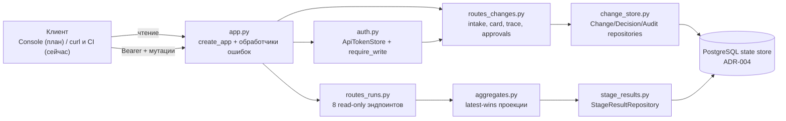
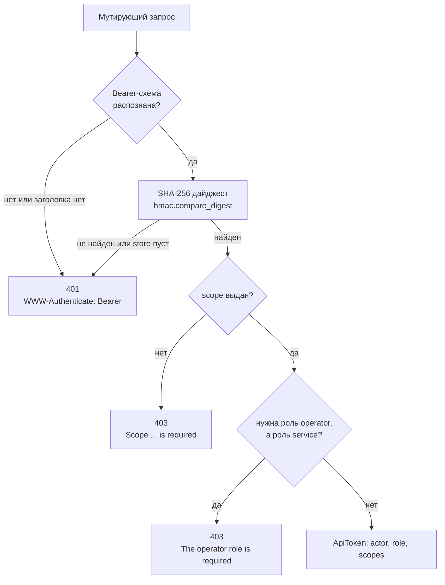
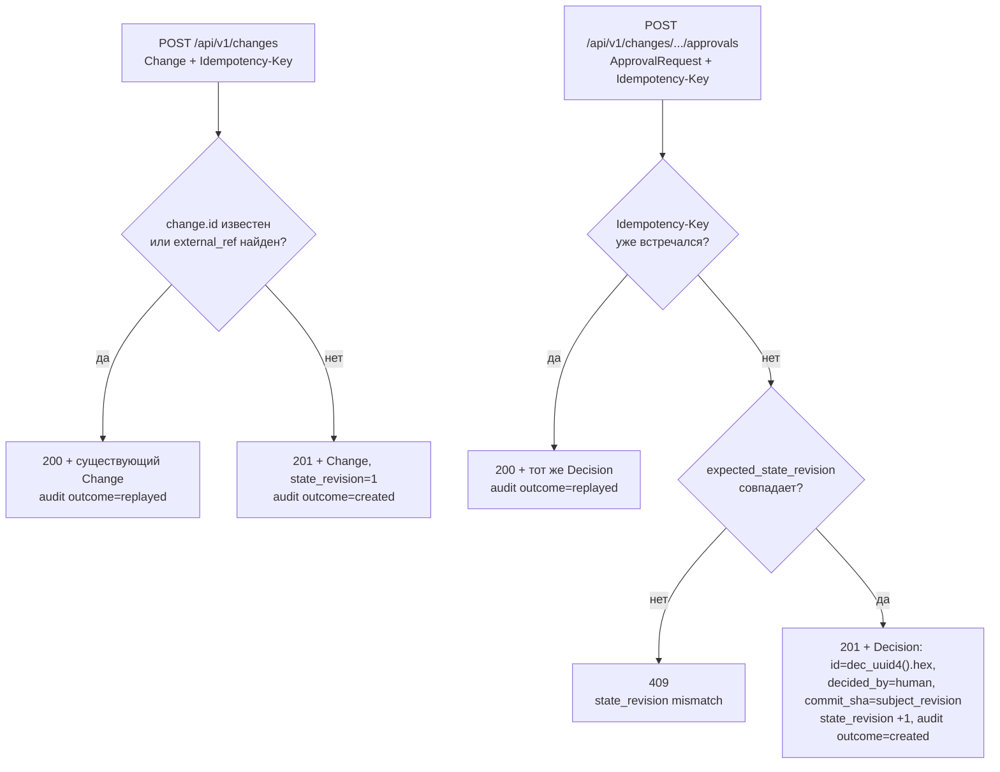

# HTTP API — `api/`

**Исходники:** [`src/dark_factory/api/`](../../src/dark_factory/api/)

**Главный потребитель:** React Console (T036, [ADR-014](../adr/ADR-014-react-uikit-storybook.md)) — планируется; фактически процесс поднимает CLI [`cli/api.py`](../../src/dark_factory/cli/api.py), команда `factory api serve`.

## 1. Назначение

`api/` — операторская control-панель фабрики поверх PostgreSQL state store: FastAPI-приложение (title `Dark Factory API`, version `0.1.0`, префикс `/api/v1`) по контракту [api.md](../../specs/001-dark-factory-mvp/contracts/api.md).

Что API даёт прямо сейчас:

- чтение состояния конвейера: runs, логические стадии, usage, гейты, findings, evidence и trace-цепочки;
- intake change (`POST /changes`) с дедупликацией и запись решений оператора (`POST .../approvals`);
- bearer-аутентификацию мутаций, аудит каждой мутации в одной транзакции и идемпотентность по `Idempotency-Key` (ADR-009 п.7);
- единый RFC 7807-подобный формат тела любой ошибки (`type`, `title`, `status`, `detail`).

Чего нет:

- эндпоинтов retry/pause/cancel — из mutating-операций ADR-009 п.7 реализованы только intake и approvals;
- аутентификации на чтении: все GET открыты (локальный контур, ADR-009 п.7);
- запуска стадий: API не вызывает доменный Flow, единственные мутации — intake и approval;
- production-контура: приложение stateless, поднимается локально через `factory api serve` (uvicorn, дефолты `--host 127.0.0.1 --port 8000`) и деплоится Helm-чартом [`charts/dark-factory`](../../charts/dark-factory/) (Deployment 1 реплика, Service ClusterIP, Console — T036); prod-контур отсутствует.

## 2. Путь запроса

`create_app(session_factory, tokens=None)` собирает приложение: сессия — одна на запрос (commit при успехе, rollback при любой ошибке), `tokens=None` означает чтение `DARK_FACTORY_API_TOKENS`. Роутер runs получает только сессию; роутер changes — сессию и token store.

Любая ошибка уходит через три обработчика приложения: `StarletteHTTPException` — статус и detail исключения (с сохранением заголовков, например `WWW-Authenticate`), `RequestValidationError` — 422, прочие исключения — 500. Тело всегда строит `ErrorBody(type="about:blank", title=<HTTP-фраза статуса>, status, detail)`; catch-all 500 никогда не отдаёт текст исключения — он может содержать credentials (ADR-009).

## 3. Эндпоинты

Все пути ниже с префиксом `/api/v1`. Ответы `Change`, `StageResult`, `Decision`, `Finding`, `GateResult`, `Evidence` — доменные pydantic-модели из `changes/` без обёрток: wire format API равен версионируемым run-record контрактам (ADR-015).

| Метод | Путь | Назначение | Ответ | Доступ |
|---|---|---|---|---|
| GET | `/runs` | Список runs; фильтры `change_id`, `status`, `stage`; пагинация | `RunSummary[]` | открыто |
| GET | `/runs/{run_id}` | Карточка run: статус, стадии, usage, гейты, открытые blocker-фединги | `RunCard` | открыто |
| GET | `/runs/{run_id}/stage-results` | Сырые неизменяемые результаты попыток | `StageResult[]` | открыто |
| GET | `/runs/{run_id}/trace` | Цепочка SC-007 в каноническом порядке стадий | `RunTrace` | открыто |
| GET | `/runs/{run_id}/evidence` | Evidence прогона после dedup по id, сортировка по id | `Evidence[]` | открыто |
| GET | `/runs/{run_id}/evidence/{evidence_id}` | Один evidence | `Evidence` | открыто |
| GET | `/runs/{run_id}/gates` | Последний `GateResult` на каждый гейт | `GateResult[]` | открыто |
| GET | `/runs/{run_id}/findings` | Findings после dedup; фильтры `severity`, `status`; сортировка по id | `Finding[]` | открыто |
| POST | `/changes` | Intake change (FR-001) с дедупом по `id` и `external_ref` | `Change`; 201 created, 200 replay | Bearer + `changes:write` |
| GET | `/changes` | Список change-документов | `Change[]` | открыто |
| GET | `/changes/{change_id}` | Карточка: Change + runs + счётчик решений | `ChangeCard` | открыто |
| GET | `/changes/{change_id}/trace` | Полная SC-007-цепочка по всем run change | `ChangeTrace` | открыто |
| GET | `/changes/{change_id}/approvals` | Решения по change | `Decision[]` | открыто |
| POST | `/changes/{change_id}/approvals` | Запись version-bound решения оператора | `Decision`; 201, 200 replay, 409 | Bearer + `approvals:write` + роль `operator` |

Тела и параметры:

| Элемент | Где | Значения и ограничения |
|---|---|---|
| `Change` (тело) | `POST /changes` | доменный документ: `id`, `title`, `source` (tracker/console/cli/api), `product`, `risk_class` (R0–R4), опц. `external_ref`, `change_request` |
| `ApprovalRequest` (тело) | `POST .../approvals` | `gate` (7 значений Gate), `outcome` (approved/rejected/waived), `subject_revision` — обязателен (min_length=1), опц. `comment`, `expected_state_revision` |
| `Idempotency-Key` (заголовок) | оба POST | опционален; повтор возвращает прежний результат |
| `limit` / `offset` | `GET /runs`, `GET /changes` | 1–200 (default 50) / ≥ 0 (default 0); сортировка `(created_at, id)` |
| `status`, `stage` | `GET /runs` | значения `RunStatus` (8) и `Stage` (5); stage-фильтр — подзапрос по таблице `stage` |
| `severity`, `status` | `GET /runs/{run_id}/findings` | `FindingSeverity` (4 значения), `FindingStatus` (4 значения) |

Ключевые DTO: `RunSummary` — `run_id, change_id, route, provider, status, state_revision, created_at, updated_at, finished_at`; `RunCard` добавляет `stages` (`StageSummary`: stage, status, input_revision, attempt_count — из таблицы `stage`, сортировка `(stage, input_revision)`), `usage`, `gates`, `open_blockers`; `ChangeCard` — документ `Change` плюс `runs` (run_id, status) и `decisions_count`.

## 4. Аутентификация

| Элемент | Значение из кода |
|---|---|
| Переменная среды | `DARK_FACTORY_API_TOKENS` |
| Формат | JSON-массив записей `{token, actor, role, scopes}` |
| Роли | только `operator` и `service` (иное значение — ошибка разбора конфига) |
| Скоупы | `changes:write`, `approvals:write` |
| Заголовок | `Authorization: Bearer <token>`, схема без учёта регистра |
| Хранение | только SHA-256-дайджесты; сравнение `hmac.compare_digest`; сырые токены не хранятся и не логируются |
| Пустая/отсутствующая переменная | пустой store — любая мутация отвечает 401 (fail closed) |
| Невалидный конфиг | `ValueError` на старте (не JSON, не массив, плохая запись); текст ошибки не раскрывает токен |

`require_write(store, scope, require_operator_role=...)` строит зависимость для одного эндпоинта:

| Ситуация | Поведение |
|---|---|
| Заголовка нет, схема не Bearer, значение пустое или токен неизвестен | 401 + `WWW-Authenticate: Bearer`, detail «A valid bearer token is required» |
| Токен валиден, скоуп не выдан | 403, detail «Scope 'changes:write' is required» (или 'approvals:write') |
| Approval от роли `service` | 403, detail «The operator role is required» — агенты никогда не аппрувят |

`ApiToken(actor, role, scopes)` возвращается зависимостью и попадает в аудит. Нюансы разбора заголовка: `Bearer` без значения — 401, схема сравнивается в нижнем регистре.

## 5. Откуда данные: state store

API читает и пишет только PostgreSQL (ADR-004) через SQLAlchemy-репозитории `orchestration/state/`:

| Таблица | Что API делает |
|---|---|
| `execution` | читает статус (`RunStatus`), `state_revision`, timestamps для карточек и списков |
| `stage` | читает логические операции: stage, status, input_revision, attempt_count (`RunCard.stages`) |
| `usage` | SQL `SUM` по попыткам: prompt_tokens, completion_tokens, cost (Decimal, может быть NULL), manual_interventions → `UsageAggregate` |
| `stage_result` | источник гейтов, findings, evidence, trace; PK — attempt_id, попытки никогда не перезаписываются (FR-014) |
| `change` | intake: payload — полный документ `Change` (JSONB), дедуп по `id` и частичному unique-индексу `external_ref` |
| `decision` | решения; колонка `role` — API-роль (operator/service), не агентная; частичный unique-индекс на `idempotency_key` |
| `audit_log` | append-only аудит мутаций (см. §7) |

Персистентные статусы `EffectStatus`/`DeliveryStatus` (`orchestration/state/enums.py`) — внутренности outbox и effect ledger; через API не отдаются. Наружу идут доменные wire-значения `changes/enums.py`: `RunStatus` (pending, running, waiting, blocked, succeeded, failed, canceled, superseded), `Stage` (specification, planning, construction, review_verification, release), `FindingSeverity`, `FindingStatus`, `Gate`, `DecisionOutcome` (approved, rejected, waived).

## 6. Агрегаты: read models

Результаты попыток неизменяемы, поэтому `aggregates.py` строит проекции правилом **«последний выигрывает»**: результаты потребляются в порядке `StageResultRepository.list_for_run` — `(produced_at, stage, attempt_number)`, более поздняя попытка замещает гейты, findings и evidence с тем же id. Это зеркалит семантику последних гейтов в `rules.gates` (ADR-009 п.7).

| Функция | Проекция | Зачем |
|---|---|---|
| `latest_gate_results(results)` | последний `GateResult` на каждый `Gate`, сортировка по `gate.value` | текущее состояние гейтов run (`/gates`, `RunCard.gates`) |
| `findings_by_id(results)` | dedup по id, порядок вставки | вход фильтра `/findings` и подсчёта blocker'ов |
| `evidence_by_id(results)` | dedup по id | `/evidence` без дублей между попытками |
| `open_blocker_count(results)` | число уникальных findings с `severity=blocker` и `status=open` | `RunCard.open_blockers` (инвариант завершения, ADR-009 п.9) |
| `trace_chain(results)` | по одной (последней) попытке на стадию в `CANONICAL_STAGE_ORDER` | SC-007-цепочка: specification → planning → construction → review_verification → release |
| `build_run_trace(session, execution)` | `RunTrace(change_id, run_id, status, chain)` | сборка trace одного run |

## 7. Аудит и подписи решений

- Каждая мутация пишет одну строку в `audit_log` **в той же транзакции**, что и изменение состояния (`AuditRepository.append`): actor и role берутся из токена, фиксируются `action`, `resource_type="change"`, `resource_id`, `idempotency_key` и `outcome` (`created`/`replayed`); `details` не содержит секретов.
- Действия: `change.intake` (`CHANGE_INTAKE_ACTION`) и `approval.record` (`APPROVAL_RECORD_ACTION`).
- Решение оператора хранится version-bound (ADR-009 п.7, FR-003): `Decision.decided_by` всегда `human` (`DecisionSource.HUMAN`), `commit_sha = subject_revision` — решение привязано к конкретной версии, новая версия требует нового решения; `comment` и `idempotency_key` сохраняются рядом.
- Оптимистическая конкуренция (ADR-006 п.4): `expected_state_revision` из тела сравнивается с `change.state_revision`; при совпадении решение записывается и `state_revision` инкрементируется.

## 8. Граничные случаи

| Случай | Реализованное поведение |
|---|---|
| Мутация без токена / неизвестный токен / мальформед `Authorization` («», пробелы, `Basic …`, `Bearer` без значения) | 401 + `WWW-Authenticate: Bearer`, RFC 7807-тело, title Unauthorized |
| `DARK_FACTORY_API_TOKENS` не задан | пустой store: любая мутация — 401; чтение работает |
| Валидный токен без нужного scope | 403, detail с именем scope |
| Approval от `service`-роли | 403 «The operator role is required» |
| Run / change / evidence не существует | 404 с detail вида «Run 'x' does not exist», «Change 'x' does not exist», «Evidence 'e' does not exist in run 'r'» |
| `expected_state_revision` не равен текущему `state_revision` | 409 «state_revision mismatch» |
| Тело не прошло валидацию (например, нет `subject_revision`) | 422, detail = описания ошибок «loc: msg» через «; » |
| `limit` вне 1–200 или `offset` < 0 | 422 (ограничения `Query`) |
| Неизвестный путь | 404 RFC 7807 (title Not Found) |
| Необработанное исключение | 500 «An unexpected error occurred.» без деталей |
| Повторный `POST /changes` с тем же `id` или `external_ref` | 200 (не 201) с существующим Change, audit outcome=replayed |
| Повторный approval с тем же `Idempotency-Key` | 200 с тем же Decision, второй записи нет |
| БД недоступна | сессия откатывается, необработанная ошибка → 500; на «GET /api/v1/runs отвечает 500» построена readiness-проба чарта |

## 9. Где искать проверки

- [`tests/test_api_auth.py`](../../tests/test_api_auth.py) — AuthN/AuthZ и форма контракта без БД: 401/403, fail-closed пустого store, malformed-заголовки, RFC 7807-тела, состав путей OpenAPI;
- [`tests/integration/test_api.py`](../../tests/integration/test_api.py) — сквозные сценарии против PostgreSQL (требует `DARK_FACTORY_TEST_DATABASE_URL`, без него пропускаются): intake/replay/external_ref-дедуп, идемпотентность и 409 approvals, агрегаты `RunCard`, канонический порядок trace, фильтры `/runs`, идемпотентность `stage_result` по attempt_id;
- [`tests/test_chart_dark_factory.py`](../../tests/test_chart_dark_factory.py) — контракт деплоя API: пробы (`/openapi.json` liveness, `/api/v1/runs` readiness), `DATABASE_URL` из секрета, отсутствие токен-секрета по умолчанию, команда `factory api serve --host 0.0.0.0 --port 8000`.

## 10. Связанные решения

- [ADR-004](../adr/ADR-004-postgresql-factory-state.md) — PostgreSQL как authoritative state: единственный источник и приёмник данных API;
- [ADR-009](../adr/ADR-009-minimal-bootstrap-otel.md) — п.7: bearer-токены с минимальными scopes, version-bound approvals, аудит всех мутаций; п.9: обязательная evidence;
- [ADR-011](../adr/ADR-011-risk-based-merge-release-policy.md) — merge в MVP — только человек; approvals API — точка фиксации решений оператора перед release;
- [ADR-014](../adr/ADR-014-react-uikit-storybook.md) — Console на React + Radix/shadcn — планируемый потребитель API;
- [ADR-015](../adr/ADR-015-repository-boundaries.md) — wire format API = версионируемые run-record контракты;
- [ADR-018](../adr/ADR-018-human-participation-autonomous-execution.md) — участие человека: решение approvals всегда `human`, автономным агентам approval недоступен.

## 11. Связь с другими модулями

- [orchestration-flow-and-state.md](orchestration-flow-and-state.md) — устройство PostgreSQL state store и репозиториев, из которых API читает и в которые пишет;
- [cli.md](cli.md) — команда `factory api serve` (хост/порт, коды выхода 0/2); формат контракта CLI — [specs/001-dark-factory-mvp/contracts/cli.md](../../specs/001-dark-factory-mvp/contracts/cli.md);
- [rules.md](rules.md) — семантика гейтов, которую агрегаты повторяют правилом «последний выигрывает»;
- [api.md — контракт API](../../specs/001-dark-factory-mvp/contracts/api.md) — первоисточник формата эндпоинтов и прав доступа.
