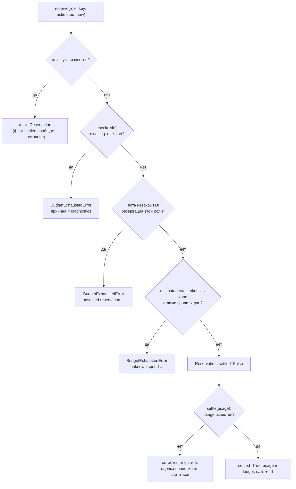

# Бюджет-координатор — `orchestration/budget/` [T-062]

**Исходники:** [`policy.py`](../../src/dark_factory/orchestration/budget/policy.py), [`coordinator.py`](../../src/dark_factory/orchestration/budget/coordinator.py), [`__init__.py`](../../src/dark_factory/orchestration/budget/__init__.py); контракты `Usage`/`BudgetSnapshot`/`RoleUsage` — [`changes/usage.py`](../../src/dark_factory/changes/usage.py).

**Главный потребитель:** [`orchestration/stages/executor.py`](../../src/dark_factory/orchestration/stages/executor.py) — необязательный параметр `budget_check: BudgetCheck | None` у `run_deterministic_stage()`; вердикт превращают в stop и blocker findings [`orchestration/stages/checks.py`](../../src/dark_factory/orchestration/stages/checks.py) (`budget_stop_reason`, `budget_findings`). Совокупный бюджет уезжает в `RunUsageSummary.roles` ([`execution/runs/store.py`](../../src/dark_factory/execution/runs/store.py), `build_usage_summary(..., roles=...)`). В production ни один вызывающий его пока не передаёт — см. §10.

## 1. Назначение

Координатор — **единственный журнал (ledger)** того, сколько прогон потратил и сколько обязался потратить. Он отвечает на три вопроса детерминированно:

- `check` — прогон и роль ещё в пределах лимитов?
- `reserve` — можно ли начать этот вызов агента и сколько ему разрешено сжечь?
- `settle` — сколько зарезервированный вызов стоил на самом деле?

Границы ответственности:

| Подсистема | Роль |
|---|---|
| `changes/usage.py::BudgetSnapshot` | run-level snapshot, переносимый между CI-джобами; флаги `*_exhausted` — **советующий** вход Flow (T-004) и координатора |
| `rules/limits.py` | сами пороги и тексты причин (`continuation_violations`) |
| `orchestration/budget/` | run/role-лимиты и allowance, резервации, вердикт — **авторитетный** учёт расхода попытки |
| `orchestration/stages/` | превращает вердикт в `StageResult` (stop + findings), не храня состояние журнала |

Зарезервированный, но не закрытый расход считается потраченным: именно поэтому общий бюджет попытки покрывает вызовы всех агентов, ревью и rework-раундов (FR-018), а не только уже учтённые траты.

## 2. Состав пакета

| Модуль | Содержимое |
|---|---|
| `policy.py` | `BudgetLimits`, `RoleAllowance`, `BudgetPolicy`, `DEFAULT_BUDGET_POLICY` |
| `coordinator.py` | `BudgetCoordinator`, `BudgetScope`, `BudgetState`, `BudgetViolation`, `BudgetCheck`, `Reservation`, `BudgetAggregate`, `BudgetExhaustedError`, `UnknownReservationError` |
| `__init__.py` | публичная поверхность пакета; реэкспортирует `RoleUsage` |

`RoleUsage` живёт в `changes/usage.py` рядом с `Usage`/`BudgetSnapshot`, потому что это сериализуемый контракт (`RunUsageSummary.roles`), но реэкспортируется пакетом как часть бюджета.

## 3. Политика и приоритет allowance

Лимиты — чистые данные: политика фиксирует, **какие** лимиты есть, а исчерпание определяет координатор. Имена и семантика полей повторяют `BudgetSnapshot`, чтобы они не разъехались.

`BudgetLimits` (frozen):

| Поле | Тип | `None` означает |
|---|---|---|
| `token_budget` | `int \| None`, `ge=1` | измерение не ограничено |
| `cost_budget` | `Decimal \| None` | измерение не ограничено |
| `deadline` | `datetime \| None` | измерение не ограничено |

`configured` — `True`, если задано хотя бы одно измерение. `token_budget=0` отвергается, как и в `BudgetSnapshot` (`ge=1`): нулевой лимит бессмыслен.

`BudgetPolicy`: `run_limits: BudgetLimits = BudgetLimits()` + `role_allowances: tuple[RoleAllowance, ...] = ()`. Инварианты конфигурации:

- **дубликат роли — ошибка**: валидатор бросает `ValueError` (`duplicate role allowances: develop`), а не выбирает одно из двух молча;
- allowance нормализуются в порядок `Role.value`;
- `DEFAULT_BUDGET_POLICY = BudgetPolicy()` не задаёт ни одного лимита — прогон, не выбравший политику, сохраняет прежнее поведение.

**Allowance может только ужесточать run-бюджет** (FR-018). `limits_for(role)` возвращает эффективные лимиты по каждому измерению:

| Run | Allowance | Эффективно |
|---|---|---|
| `None` | `X` | `X` |
| `X` | `None` | `X` |
| `X` | `Y` | `min(X, Y)` |
| `None` | `None` | `None` |

`None` — «не задано», а не «безлимит», поэтому грант выше run-бюджета **не поднимает** run-лимит. Для роли без allowance эффективные лимиты равны `run_limits`.

## 4. Три операции и жизненный цикл резервации

| Операция | Вход | Выход | Отказ |
|---|---|---|---|
| `check(role, *, now)` | роль, явное время | `BudgetCheck(state, violations)` | — |
| `reserve(role, *, key, estimated, now)` | роль, ключ, оценка, время | `Reservation` (или уже выданная) | `BudgetExhaustedError` |
| `settle(reservation_id, *, usage)` | id, фактический расход | `Reservation` (возможно, всё ещё открытая) | `UnknownReservationError` |

`BudgetCheck.diagnostics` — `"; ".join(reason)` по всем нарушениям; на пустом списке нарушений строка пустая.

Идентификатор резервации детерминирован — `rsv_<role.value>_<key>`, то есть одна и та же логическая операция всегда адресует одну и ту же резервацию (ADR-006 п.3).

Порядок проверок в `reserve` — как на схеме: сначала replay по ключу, затем вердикт `check`, затем незакрытая резервация роли, затем неизвестная оценка.

**Одна незакрытая резервация на роль.** Роль не может иметь две разные открытые резервации: `reserve` с новым ключом отказывает, пока предыдущая не закрыта. Повтор того же ключа открытую резервацию не создаёт заново, а возвращает её же (в том числе уже закрытую — тогда `settled=True`).

Причины отказов:

| Условие | Исключение | `reason` |
|---|---|---|
| `check` = `awaiting_decision` | `BudgetExhaustedError` | `check.diagnostics` |
| у роли есть незакрытая резервация | `BudgetExhaustedError` | `role {role} already has an unsettled reservation {id!r}` |
| неизвестная оценка при заданном лимите | `BudgetExhaustedError` | `role {role}: unknown spend cannot be reserved while a limit is configured (FR-018)` |
| `settle` неизвестного id | `UnknownReservationError` | `unknown reservation {id!r}` |

`BudgetExhaustedError` несёт сам `BudgetCheck`; её строка — `check.diagnostics`, а для двух отказов, не являющихся нарушением лимита, — явный `reason`.

Семантика `settle`:

- `usage=None` или `usage.total_tokens is None` → резервация остаётся открытой, в ledger ничего не добавляется, `calls` не растёт (консерватизм сохраняется);
- повторный `settle` уже закрытой резервации идемпотентен: расход считается один раз, возвращается та же закрытая резервация;
- `Usage` с известными частями (`prompt_tokens`/`completion_tokens`), но неизвестным total тоже оставляет резервацию открытой.

`usage_for(role)` и `total_usage()` возвращают **только учтённый** расход (FR-016: рестарты не сбрасывают траты).

## 5. Пороги не дублируются: проекция в `BudgetSnapshot`

`check` не сравнивает числа сам: он складывает журнал в `BudgetSnapshot` и оценивает его `rules.limits.continuation_violations`, поэтому Flow и координатор не могут разойтись в пороге или тексте причины.

| Источник | Поле `BudgetSnapshot` |
|---|---|
| `limits.token_budget` | `token_budget` |
| `_tokens(usage)` | `tokens_used` |
| `limits.cost_budget` | `cost_budget` |
| `_cost(usage)` | `cost_used` |
| `limits.deadline` | `deadline` |

`_tokens`: `usage.total_tokens`, а при `None` — `prompt_tokens + completion_tokens` (то же правило, что у `_accumulate_usage` в Flow). `_cost`: `usage.cost`, а при `None` — `Decimal("0")` (см. §6 и TD-006).

Порядок вердикта:

1. **run scope** — `run_limits` против агрегированного расхода всех ролей;
2. **role scope** — `limits_for(role)` против расхода самой роли.

Внутри каждого scope порядок задаёт `continuation_violations`: token → cost → deadline. Так как эффективные лимиты роли включают run-бюджет, нарушение run-лимита видно **дважды** — в run scope и в role scope роли (пример: проверка роли без allowance при исчерпанном run-бюджете даёт и `token budget exhausted: 100/100`, и `role develop: token budget exhausted: 100/100`). Причины role scope получают префикс `role {role.value}: `. Ровно на token/cost budget продолжение уже запрещено, ровно в момент deadline — ещё разрешено (строгое `now > deadline`).

Rework-лимит координатор не проверяет: он остаётся в `checks.budget_exhaustions`. Из `rules/limits.py` координатор переиспользует только `continuation_violations`.

## 6. Консерватизм при неизвестном расходе (FR-018)

- **Неизвестную оценку нельзя зарезервировать**, если у роли задан хотя бы один лимит (`limits_for(role).configured`): неизвестный расход не берётся на себя.
- **Неизвестный settlement оставляет резервацию открытой**, и её оценка продолжает считаться потраченной — прогон остаётся консервативным, пока расход не сверён.
- **Зарезервированное = потраченное**: `_effective_usage = settled + reserved`, поэтому вердикт учитывает обязательства, ещё не подтверждённые фактическим usage.

Известное ограничение — **TD-006**: неизвестной считается только неизвестность `Usage.total_tokens`. Расход с известными токенами и несообщённой стоимостью (`cost is None`) проецируется в `cost_used = 0`, поэтому `cost_budget` может быть перекоммичен. Координатор здесь не консервативен.

Тонкость агрегата: `aggregate.run` — это **учтённый** расход, а открытые резервации видны только в `roles[*].reserved`, поэтому состояние может быть `awaiting_decision`, пока итоговые `run`-числа ещё не показывают этот расход.

## 7. Awaiting Decision → `BLOCKED` и видимость в Console

`budget_stop_reason(check)` возвращает `None` при `within_limits` и `check.diagnostics` иначе. Порядок решения в executor:

1. `budget_exhaustions(context.budget, now=...)` — переносимый snapshot побеждает и блокирует попытку со своими причинами (findings при этом пустые);
2. иначе `budget_check` — при `awaiting_decision` попытка заканчивается `StageStatus.BLOCKED` с `StopAction(StopOutcome.BLOCKED, reason=diagnostics)` и `findings=budget_findings(check)`;
3. иначе — `StageStatus.WAITING`.

`budget_findings` даёт по одному blocker finding на каждое сработавшее ограничение:

| Поле `Finding` | Значение |
|---|---|
| `id` | `budget:<scope>[:<role>]:<rule>` — детерминированный |
| `origin` | `FindingOrigin.CI` — детерминированная машинная проверка, не агент и не человек |
| `role` | роль нарушения, для run scope — `None` |
| `severity` / `status` | `BLOCKER` / `OPEN` |
| `category` | `budget` |
| `required_action` | диагностика нарушения (у `Finding` нет отдельного поля сообщения — Console рендерит именно `required_action`) |

Благодаря детерминированному id [`api/aggregates.py::open_blocker_count`](../../src/dark_factory/api/aggregates.py) считает blocker'ы по id: run-level нарушение учитывается один раз, сколько бы ролей ни проверялось, и повторная попытка не раздувает счётчик. Так карточка run в Console показывает состояние Awaiting Decision.

**Согласование словаря состояний.** ADR-018 п.5 останавливает автономную реализацию при превышении бюджета (эскалация человеку), а видение (3.8) называет это состояние «Awaiting Decision». `BudgetState.AWAITING_DECISION` — локальный словарь вердикта координатора; наружу он выражается уже существующими `StageStatus.BLOCKED` и `StopOutcome.BLOCKED`. В словаре эскалаций для бюджета автономных итераций контракта уже есть `EscalationRule.AUTONOMY_BUDGET_EXHAUSTED` ([`policy/escalation.py`](../../src/dark_factory/orchestration/policy/escalation.py), `autonomy_budget_violation`), но координатор его **не эмитит**: он отдаёт `BudgetCheck`, а stage-путь превращает вердикт в stop и blocker finding. Новых enum-значений не потребовалось.

## 8. Детерминизм

- `now` — всегда явный параметр `check`/`reserve`/`aggregate`; настенные часы не читаются (как в `rules/limits.py`).
- Идентификатор резервации выводится из ключа вызывающего, не из источника случайности.
- Координатор stateful — один журнал на инстанс; глобального мутабельного состояния нет.
- `BudgetAggregate` frozen и round-trip-сериализуем (`model_dump_json` → `model_validate_json`).

## 9. Граничные случаи

| Случай | Поведение |
|---|---|
| `DEFAULT_BUDGET_POLICY` | `check` всегда `within_limits`, диагностика пустая, `reserve` не отказывает; `StageResult` побайтово равен результату до T-062 |
| Роль без allowance | эффективные лимиты = `run_limits` |
| Грант роли выше run-бюджета | не поднимает run-лимит (tighter of two) |
| Дубликат роли в allowance | `ValidationError` (`duplicate role allowances: ...`) |
| Нарушен run-лимит | отчёт в run scope и в role scope проверяемой роли |
| Одновременно token, cost, deadline | run scope: token → cost → deadline, затем role scope в том же порядке |
| `now == deadline` | не блокируется (строгое `now > deadline`) |
| Ровно исчерпанный token/cost | блокировка (`>=`) |
| Открытая резервация | считается потраченной, но `usage_for`/`total_usage` её не показывают |
| Повтор `reserve` с тем же ключом | та же резервация, вызов не удваивается; для закрытой — `settled=True` |
| Второй `reserve` с новым ключом при открытой резервации | отказ `BudgetExhaustedError` |
| `settle` с `usage=None`/неизвестным total | резервация остаётся открытой |
| Повторный `settle` | расход считается один раз |
| `settle` чужого id | `UnknownReservationError` |
| Неизвестная оценка при заданном лимите | отказ (`unknown spend ...`); без лимита — резервация выдаётся |
| Роль без расхода и без резерваций, но с allowance | попадает в `aggregate.roles` (роль «известна» политике) |
| Переносимый snapshot исчерпан и координатор тоже | побеждает snapshot, findings пустые (seam аддитивен) |
| `check` = `within_limits` при заданной политике | результат стадии не отличается от варианта без `budget_check` |

## 10. Что ещё не подключено

- **Нет источника политики в production**: `cli/stage.py::execute_stage` вызывает `run_deterministic_stage(context)` без `budget_check`; политика не приходит ни из CLI, ни из конфига, поэтому в реальном прогоне координатор не задействован.
- **Журнал не персистится**: резервации и per-role агрегат не переживают рестарт/CI-джоб. `build_usage_summary` вызывается в `store.py::_serialize` без `roles`, поэтому `usage.json` в любом случае содержит `"roles": []`, а между джобами FR-016 по-прежнему держится на переносимом `BudgetSnapshot`.

Оба пункта — **TD-007**: план — персистировать ledger/агрегат вместе с durable state store и подключить источник политики в stage/CI-путь; точка экспорта — `usage.json.roles`. Консерватизм неизвестной стоимости — отдельная запись **TD-006** (§6).

## 11. Где искать проверки

- [`tests/test_budget_policy.py`](../../tests/test_budget_policy.py) — приоритет allowance (tighten-only), слияние измерений, дедлайны, порядок и дубликаты ролей, нижняя граница `token_budget`;
- [`tests/test_budget_coordinator.py`](../../tests/test_budget_coordinator.py) — точные диагностики лимитов, порядок правил и scope, консерватизм неизвестного расхода, жизненный цикл резерваций и идемпотентность, агрегат, интеграция со stage-путём (`test_exhausted_budget_blocks_the_stage_with_an_open_blocker`, `test_a_run_scope_blocker_is_reported_once_per_rule`, `test_carried_snapshot_exhaustion_still_wins_over_the_coordinator`, `test_a_within_limits_check_leaves_the_stage_result_unchanged`, `test_blocked_budget_result_is_accepted_by_the_flow_engine`);
- [`tests/test_execution_runs.py`](../../tests/test_execution_runs.py) — `test_usage_summary_carries_the_per_role_aggregate` (аддитивная секция `roles`);
- [`tests/test_rules_limits.py`](../../tests/test_rules_limits.py) — пороги, которые координатор переиспользует.

## 12. Связанные решения

- [ADR-018](../adr/ADR-018-human-participation-autonomous-execution.md) п.3 (Implementation Contract как источник бюджета: итерации, время, стоимость) и п.5 (остановка автономной реализации при превышении бюджета);
- [ADR-015](../adr/ADR-015-repository-boundaries.md) п.3 — versioned-контракты и migration policy для схем: аддитивное поле `roles` не меняет `schema_version`, он остаётся 1;
- [ADR-006](../adr/ADR-006-ephemeral-job-pods-reconciler-cronjob.md) п.3 — идемпотентный повтор по ключу операции;
- [ADR-005](../adr/ADR-005-stage-scoped-graphs-light-workflow-core.md) — стадия заканчивается детерминированным решением (`blocked`/`waiting`);
- требования FR-016 (расход не сбрасывается) и FR-018 (общий бюджет попытки, консерватизм).

## 13. Связь с другими модулями

| Документ | Связь |
|---|---|
| [rules.md](rules.md) | §3 — run-level правила `BudgetSnapshot`, пороги и тексты, которые координатор переиспользует |
| [orchestration-execution.md](orchestration-execution.md) | `stages/executor.py` — потребитель `budget_check`; `stages/checks.py` — stop и blocker findings |
| [execution.md](execution.md) | `usage.json` и аддитивная секция `roles` в run-записи |
| [orchestration-flow-and-state.md](orchestration-flow-and-state.md) | межстадийный FSM: `BLOCKED` и эскалации, в словарь которых отображается вердикт |
| [orchestration-operations.md](orchestration-operations.md) | `policy/escalation.py` — существующий словарь эскалаций |
