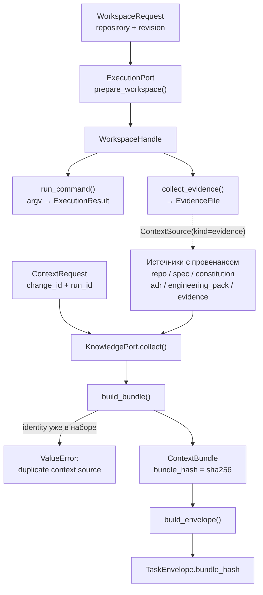
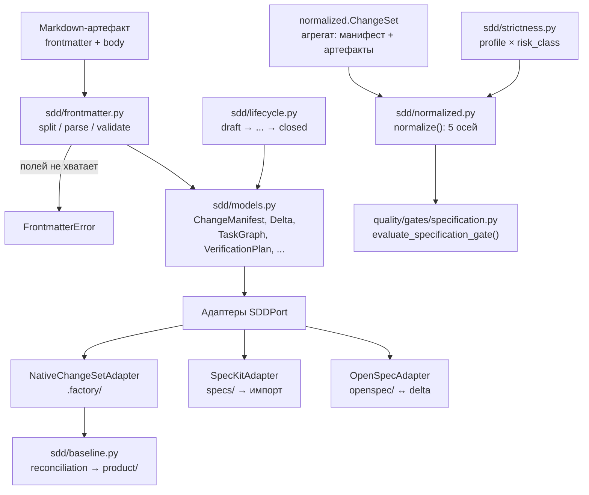
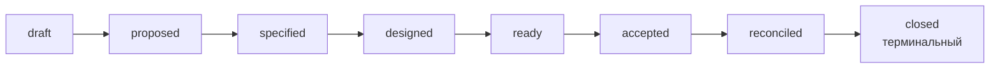

# Контекст и SDD — `context/`

**Исходники:** [`src/dark_factory/context/`](../../src/dark_factory/context/)

**Главные потребители:** [`agents/contract.py`](../../src/dark_factory/agents/contract.py) — `build_envelope()` фиксирует `ContextBundle` в `TaskEnvelope`; [`quality/gates/specification.py`](../../src/dark_factory/quality/gates/specification.py) — `evaluate_specification_gate()` решает по `normalize()` из SDD-слоя.

> Не путать с [`orchestration/stages/context.py`](../../src/dark_factory/orchestration/stages/context.py): там живёт `StageContext` — фиксированные входы одного детерминированного запуска стадии (T-010). К `ContextBundle` и SDD-слою он отношения не имеет — совпадение только в слове «context».

## 1. Назначение

Пакет `context/` отвечает на два вопроса: **что агент видит на входе** и **где лежит каноническая спецификация изменения**.

**Часть 1 — ContextBundle (T-012, FR-001).** `bundle.py` определяет версионированный набор материалов, который агент получает на вход: материалы репозитория, `specs/` (до T-020) или `openspec/` (после), конституция, ADR и engineering pack. Каждый источник несёт провенанс — расположение, закреплённую ревизию и хеш содержимого. Сборка воспроизводима: одинаковые входы дают одинаковый `bundle_hash` независимо от порядка вставки.

**Часть 2 — SDD-слой (подпакет `sdd/`, ADR-020).** Native SDD Core: типизированные схемы артефактов ChangeSet, Product Baseline под `.factory/`, YAML frontmatter OKF-узлов, нормализованный контракт для specification gate и три реализации `SDDPort` — native, Spec Kit (bootstrap-импорт) и OpenSpec (compatibility). Полная спецификация модели — [`docs/sdd-native-core.md`](../sdd-native-core.md).

**Часть 3 — документы ChangeSet как read-model (M2–M3, ADR-035/ADR-039).** `artifacts.py` классифицирует пути ChangeSet по фазам и находит якоря замечаний; `design.py`, `decisions.py`, `ui_spec.py` — чистые разборщики текста узлов `design/**` в то, что показывают фазы «Архитектура» и «Интерфейс». Ничто здесь не ходит в репозиторий или store: тексты приносит `orchestration/artifacts.py`, факты store добавляют `orchestration/decisions.py`, `orchestration/ui_spec.py` и `orchestration/state/phases.py` (см. §11).





## 2. ContextBundle (`bundle.py`)

### 2.1. Поля и дефолты

Обе модели — `frozen=True`; контракт схемы — `CONTEXT_SCHEMA_VERSION = 1` (`type ContextSchemaVersion = Literal[1]`).

| Модель | Поле | Тип / Default |
|---|---|---|
| `ContextSource` | `kind` | `SourceKind` |
| | `location` | `str`, `min_length=1` |
| | `revision` | `str \| None = None` (git sha, версия документа) |
| | `content_hash` | `str`, `min_length=1` (sha256 полученного содержимого) |
| | `retrieved_at` | `datetime`, без дефолта — летучая книга, в hash не входит |
| `ContextBundle` | `schema_version` | `1` |
| | `change_id` | `str`, `min_length=1` |
| | `run_id` | `str`, `min_length=1` |
| | `sources` | `tuple[ContextSource, ...] = ()` |
| | `bundle_hash` | `str`, `min_length=1` |

`SourceKind` (StrEnum): `repo`, `spec`, `constitution`, `adr`, `engineering_pack`, `evidence`. Один `spec` покрывает `specs/` до T-020 и `openspec/` после — их различает `location`; `evidence` — собранное evidence (T-013), хеш считает коллектор.

### 2.2. Сборка и hash

`build_bundle(*, change_id: str, run_id: str, sources: Iterable[ContextSource]) -> ContextBundle`:

1. hash-релевантная идентичность источника — кортеж `(kind.value, location, revision or "", content_hash)`;
2. точный дубликат идентичности (даже с другим `retrieved_at`) → `ValueError`, молчаливого слияния нет;
3. `bundle_hash` — sha256 над `json.dumps` отсортированных идентичностей с `separators=(",", ":")`;
4. валидатор `_canonicalize_sources` сортирует `sources` по идентичности, поэтому порядок вставки не влияет ни на равенство, ни на hash; `retrieved_at` в hash никогда не входит.

## 3. Порты (`ports/context.py`, `ports/protocols.py`)

DTO портов — frozen pydantic-модели; `RepositoryRef` — общий доменный референс (ADR-019). Все меняющие состояние методы принимают `idempotency_key`.

| Порт | Метод (сигнатура) |
|---|---|
| `KnowledgePort` | `async collect(self, request: ContextRequest, /) -> ContextBundle` |
| `ExecutionPort` | `async prepare_workspace(self, request: WorkspaceRequest, /, *, idempotency_key: str) -> WorkspaceHandle` |
| `ExecutionPort` | `async write_file(self, workspace: WorkspaceHandle, path: str, content: bytes, /, *, idempotency_key: str) -> None` |
| `ExecutionPort` | `async run_command(self, workspace: WorkspaceHandle, argv: tuple[str, ...], /, *, idempotency_key: str) -> ExecutionResult` |
| `ExecutionPort` | `async collect_evidence(self, workspace: WorkspaceHandle, path: str, /, *, idempotency_key: str) -> EvidenceFile` |
| `SDDPort` | `async create_change(self, change: ChangeSet, /) -> str` |
| `SDDPort` | `async read_requirements(self, change_id: str, /) -> RequirementsSnapshot` |
| `SDDPort` | `async apply_delta(self, change_id: str, /, *, expected_revision: str) -> str` |

Роль `idempotency_key` различается по методам `ExecutionPort`: replay-дедуп — только у `prepare_workspace` (тот же ключ → тот же handle, второй workspace не создаётся); `write_file` идемпотентен по состоянию (last write wins на пути) и не пропускается по ключу; у `run_command`/`collect_evidence` ключ — только адрес в effect ledger/аудите, они читают текущее состояние и никогда не возвращают закэшированный результат.

DTO (`ports/context.py`): `ContextRequest(change_id, run_id)`; `WorkspaceRequest(repository: RepositoryRef, revision, change_id)`; `WorkspaceHandle(workspace_id, repository, revision)`; `ExecutionResult(ok, exit_code, stdout="", stderr="")`; `EvidenceFile(path, content_hash, content: bytes)`.

Протоколы `runtime_checkable`: адаптеры `SDDPort` реализуют его структурно из `dark_factory.context.sdd` и **не импортируют** `dark_factory.ports` — проверка без импорта, а обратный импорт был бы циклом (порт и так импортирует `context.sdd`). Строгое правило границ — [`test_import_boundaries.py`](../../tests/test_import_boundaries.py): ядро (включая `context.sdd`) не импортирует `dark_factory.adapters` и внешние SDK. `ports/__init__.py` реэкспортирует `ContextBundle`, `build_bundle`, `ChangeSet`, `RequirementsSnapshot` и ошибки `BaselineMismatchError` / `ChangeNotFoundError`.

**Подключение к production:** реализация `KnowledgePort`/`ExecutionPort` одна — in-memory fakes (`adapters/fakes/`); реальные провайдеры источников и worktree-адаптер ещё не написаны. Production-обвязка, вызывающая порты, тоже отсутствует — порты живут в контрактах и тестах.

Адаптеры-фейки:

- `FakeKnowledge` — `seed(kind, location, revision, content)` наполняет store; sha256 по содержимому; `RETRIEVED_AT = datetime(2026, 1, 1, tzinfo=UTC)` фиксирует временной штамп, поэтому равные seed дают байт-в-байт равные bundle. Пустой seed даёт детерминированный пустой bundle (`sources == ()`) — пустой контекст валиден, это не ошибка. Повторный seed того же `(kind, location)` перезаписывает.
- `FakeExecution` — `prepare_workspace` идемпотентен по `idempotency_key` (replay возвращает тот же handle), id — детерминированные `ws-NNNN`; `write_file` идемпотентен по состоянию (тот же путь держит записанные байты, ключ запись не пропускает); результат `run_command` выводится только из `argv` (засеянные через `seed_failure(argv, exit_code=1)` падают детерминированно); evidence выдаётся из `seed_file(handle, path, content)`; неизвестный workspace или путь → `KeyError`. Ключи `run_command`/`collect_evidence` принимаются по контракту, но ledger replay не ведётся и ключ не влияет на результат (per-key cache отсутствует).

## 4. Модели SDD (`sdd/models.py`)

Wire-формы следуют каноническим примерам `docs/sdd-native-core.md` §6–12 и `specs/001-dark-factory-mvp/contracts/changeset.md`. Поле `schema` — зарезервированное слово в Python: поле называется `schema_` с wire-алиасом `schema` (`populate_by_name` + `serialize_by_alias`), YAML round-trip сохраняет канонический ключ. Штампов времени нет: историей владеет Git, ревизии baseline — контентные хеши.

Константы схем: `dark-factory.dev/change/v1`, `…/task-graph/v1`, `…/design/v1`, `…/verification-plan/v1`, `…/evidence-index/v1`, `…/reconciliation-plan/v1`, `…/reconciliation-result/v1` (в `baseline.py` ещё `…/factory/v1`, в `init_baseline` — `…/product/v1`).

`CHANGE_ID_PATTERN = r"^chg:[a-z0-9][a-z0-9-]*:\d{4}:\d{4}$"` — `chg:<product>:<год>:<NNNN>`.

### 4.1. `ChangeManifest` — манифест и точка входа (`change.yaml`, §6)

| Поле | Тип / Default |
|---|---|
| `schema_` | `dark-factory.dev/change/v1` (алиас `schema`) |
| `id` | `str`, pattern `CHANGE_ID_PATTERN` |
| `title` | `str`, `min_length=1` |
| `slug` | `str`, pattern `^[a-z0-9]+(-[a-z0-9]+)*$` |
| `product` | `str`, `min_length=1` |
| `kind` | `str`, `min_length=1` |
| `risk_class` | `RiskClass` (`R0`…`R4` из `changes/enums.py`) |
| `status` | `ChangeSetStatus = draft` |
| `baseline` | `BaselineRef(revision)` — ревизия, против которой создан ChangeSet |
| `workflow` | `WorkflowRef(profile, version="1.0")` — профиль строгости |
| `owners` | `Owners(product=None, technical=None)` |
| `targets` | `list[TargetRef(repository, role)] = []` — multi-repo |
| `artifacts` | `dict[ArtifactSlot, str] = {}` — слот → путь артефакта |

Манифест мутабелен, как сущности run-домена: статус меняется только через `apply_status(target)` — единственную точку валидации (делегирует в `lifecycle.py`, вне таблицы поднимает `InvalidChangeSetStatus`).

### 4.2. Delta, задачи, верификация, evidence, reconciliation

`DeltaOperation` — `Annotated`-объединение с дискриминатором `operation` (`DeltaOperationKind`: `add`, `modify`, `supersede`, `retire`):

| Операция | Поля | Смысл |
|---|---|---|
| `AddOperation` | `target`, `artifact` (относительно `spec/`) | новый OKF-узел |
| `ModifyOperation` | `target`, `artifact` | правка узла на месте |
| `SupersedeOperation` | `target`, `superseded_by` | замена преемником; оба остаются в истории baseline |
| `RetireOperation` | `target` | вывод узла; остаётся со статусом `retired` |

Остальные агрегаты:

- `Delta(baseline_revision, operations=[])` — дельта спецификации (`spec/delta.yaml`), не полная копия спеки;
- `TaskDef(id, title, repository=None, type=None, satisfies=[], depends_on=[])`; `TaskGraph(schema_, tasks=[])` — каноническая декомпозиция (`tasks/graph.yaml`); `tasks.md` — генерируемый view;
- `VerificationPlan(schema_, requirements=[])` из `RequirementVerification(requirement, checks=[])` и `CheckSpec(type)` — проверки, определённые до реализации (`verification/plan.yaml`, §12);
- `EvidenceEntry(id, type, verifies=[], uri, digest=None, result: passed|failed, required=False, available=True)`; `EvidenceIndex(schema_, evidence=[])` (`evidence/index.yaml`) — тяжёлые payload'ы живут в CI-артефактах/Object Storage, Git хранит ссылку;
- `ReconciliationPlan(schema_, baseline_revision, operations=[])` и `ReconciliationResult(schema_, change_id, original_revision, new_revision, applied_operations=0 (ge=0), conflicts=[])` (§14);
- `Document(path, frontmatter=None, body="")` — markdown-артефакт ChangeSet; `path` относительно каталога ChangeSet.

## 5. Frontmatter (`sdd/frontmatter.py`)

Правило: каждый самостоятельно адресуемый SDD-артефакт несёт минимальный frontmatter; генерируемые view и вспомогательные документы могут его опускать.

`MINIMAL_FRONTMATTER_FIELDS = ("schema", "id", "type", "title", "product", "status", "change")` — все обязательны (`min_length=1`), модель `Frontmatter` допускает `extra="allow"`: `owner`, `risk`, `realizes`, `relations` и прочее сохраняются как extras.

| Функция | Поведение |
|---|---|
| `split_frontmatter(text)` | первый блок `--- … ---`; нет его → `(None, text)` (допустимо); незакрытый блок → `FrontmatterError`; пустой YAML → `({}, body)`; не-мэппинг → `FrontmatterError` |
| `validate_frontmatter(data)` | отсутствующие/пустые обязательные поля → `FrontmatterError` со списком |
| `parse_frontmatter(text)` | `Frontmatter | None` — `None`, когда frontmatter нет |
| `render_document(fm, body)` | канонический markdown: frontmatter (YAML, `sort_keys=False`) первым, затем body |
| `with_status(fm, status)` | копия через `model_copy` — extras сохраняются |

`status` следует жизненному циклу содержащего артефакта: документы ChangeSet несут статусы изменения (`proposed`, …), документы baseline — `active` / `superseded` / `retired`.

## 6. Strictness (`sdd/strictness.py`)

Что ChangeSet обязан содержать, решает комбинация профиля workflow и класса риска — не сама модель.

| Профиль | `required_artifacts(profile, risk)` |
|---|---|
| `bugfix-r0` | `frozenset()` — SDD-артефактов не требуется |
| остальные пять (`product-feature`, `ui-research`, `architecture-change`, `repository-rebuild`, `platform-change`) | шесть слотов: `intent`, `spec`, `design`, `tasks`, `verification`, `evidence` |
| любой профиль × `R2`/`R3`/`R4` | плюс `reconciliation` — обязателен независимо от профиля |

`ArtifactSlot` (StrEnum): `intent`, `spec`, `design`, `tasks`, `verification`, `evidence`, `reconciliation`. Артефакты сверх обязательного набора всегда разрешены.

## 7. Lifecycle (`sdd/lifecycle.py`)

Цепочка линейная, живёт в Git (`change.yaml`); runtime-состояние — в PostgreSQL (ADR-004). Таблица переходов — единственная точка валидации, зеркало паттерна `apply_status` run-домена.



`CHANGESET_STATUS_TRANSITIONS` задаёт для каждого статуса `frozenset` целей (у `closed` он пуст, поэтому `CHANGESET_TERMINAL_STATUSES == {closed}`). `validate_change_status_transition(current, target)` поднимает `InvalidChangeSetStatus` (наследник `ValueError`, не из `errors.py`) для пары вне таблицы.

## 8. Нормализованный контракт (`sdd/normalized.py`)

Агрегат `ChangeSet` = `manifest` + структурные артефакты: `delta=None`, `documents=[]`, `tasks=None`, `verification=None`, `evidence=None`, `reconciliation=None` (всё опционально, кроме манифеста). `normalize(changeset) -> NormalizedChangeSet` вычисляет пять осей контракта **как данные**: возвращает находки, а не решения; гейт (T-021) взвешивает их и фиксирует `GateDecision`.

| Ось | Коды находок | Условие |
|---|---|---|
| `completeness` | `missing_required_artifact` | обязательный слот не объявлен в `change.yaml` (по `required_artifacts`) |
| `consistency` | `baseline_revision_mismatch` | `delta.baseline_revision ≠ manifest.baseline.revision` |
| `consistency` | `duplicate_delta_target` | target встречается более чем в одной операции |
| `consistency` | `self_supersede` | `superseded_by == target` |
| `consistency` | `declared_artifact_missing` | слот объявлен, а документ/структурный артефакт отсутствует |
| `policy` | `reconciliation_required_for_high_risk` | риск `R2`+ без reconciliation-плана |
| `coverage` | `requirement_without_task` | requirement (`req:`-target с add/modify) не покрыт ни одним `task.satisfies` |
| `coverage` | `requirement_without_verification` | requirement без проверок в verification-плане |
| `evidence` | `required_evidence_unavailable` | `required && !available` |
| `evidence` | `missing_evidence_for_accepted_change` | нет evidence в статусе `accepted`/`reconciled`/`closed` |

Каждая находка — `AxisFinding(axis, code, message)`. Снимок требований для `SDDPort.read_requirements`: `RequirementEntry(id=op.target, operation, artifact=None, superseded_by=None)` в `RequirementsSnapshot(change_id, baseline_revision, requirements=())`; ревизия берётся из дельты, а без неё — из манифеста. Префикс requirement-id — `REQ_ID_PREFIX = "req:"`.

Production-потребитель вне пакета — модуль `quality` (`quality/gates/`): `evaluate_specification_gate()` вызывает `normalize()` и при передаче implementation contract пересчитывает completeness/policy по эффективному классу риска (манифестные находки `normalize()` считаются только по манифесту); `decision.py` использует `Axis` в записях `GateDecision`.

## 9. Product Baseline (`sdd/baseline.py`)

Раскладка (один продукт — один репозиторий):

```text
.factory/
├── factory.yaml     # product identity: FactoryManifest(schema, product, title=None)
├── product/         # только принятое состояние: active / superseded / retired
└── changes/         # каталоги ChangeSet
```

- `baseline_revision` — детерминированный sha256 над отсортированными парами `(path, content_hash)` всех файлов под `product/` (`compute_revision`); без штампов времени, пересчитывается по требованию. `factory.yaml` лежит вне `product/` и в hash не попадает сознательно: он идентифицирует продукт, иначе ревизия была бы самоссылочной.
- `scan_baseline()` / `current_revision()` — фактическое состояние на диске; `hash_bytes()` — sha256 содержимого; `BaselineFile(path, content_hash)`.
- `init_baseline(factory_root, *, product, title, change)` — минимальный валидный baseline: `factory.yaml` + `product/product.md` (OKF-узел `dark-factory.dev/product/v1`, `id="product:<product>"`, `status="active"` — единственное допустимое состояние нового baseline).
- `apply_delta_operations(factory_root, change_dir, operations, *, change_id, expected_revision) -> ReconciliationResult` — сверка ревизии (параллельные изменения → `BaselineMismatchError`), затем `add`/`modify` копируют артефакт из `change_dir/spec/<artifact>` в `product/` со статусом `active`, `supersede` ставит target'у `superseded`, `retire` — `retired`. Возвращает запись результата; `conflicts` всегда `[]`, персистенцией занимается вызывающий.
- `write_reconciliation_result()` пишет `reconciliation/result.yaml` каталога ChangeSet (§14, шаг 8).

## 10. Адаптеры `SDDPort`

Все три лежат в `sdd/` и реализуют порт структурно, без импорта `dark_factory.ports`; контрактная сюита гоняет их через одну фикстуру `sdd_port` (`native` / `speckit` / `openspec`) над общим корнем `.factory/`.

| Свойство | `NativeChangeSetAdapter` | `SpecKitAdapter` | `OpenSpecAdapter` |
|---|---|---|---|
| Роль (ADR-020 п.8) | основной | bootstrap-импорт legacy (`specs/`) | compatibility import/export |
| Читает | `.factory/` | `specs/<feature>/` (только чтение) | `openspec/changes/<name>/specs/` |
| Пишет | `.factory/` | только в `.factory/` (через native) | `change.yaml` в каталог OpenSpec; `export_change` пишет spec-файлы |
| Собственные методы | `read_change()`, `next_change_id()`, `change_dir_name()` | `import_feature()`, `parse_tasks_markdown()` | `import_change()`, `export_change()` |
| Статус нового манифеста | приходит в `ChangeSet` | `draft` | `proposed` |
| Риск/профиль нового | из входа | `R1`, `product-feature` | `R1`, `product-feature` |
| Дельта-операции | любые | один `add` | `add`/`modify`/`retire` (из секций ADDED/MODIFIED/REMOVED) |
| `create`/`read_requirements`/`apply_delta` | собственная реализация | делегирование native | делегирование native |

Отдельного OpenSpec-baseline нет (ADR-020 п.3): всё сводится к native-дельтам над `.factory/`.

### 10.1. Native (`sdd/native.py`)

- Раскладка: `.factory/changes/<год>/<CHG-NNNN-slug>/`; `change_dir_name()` = `CHG-<NNNN>-<slug>`, номер — последний сегмент id.
- `next_change_id(factory_root, product)` сканирует каталоги `CHG-NNNN-*` за текущий год; первый change года — `0001` → `chg:<product>:<year>:<NNNN>`.
- `create_change()`: каталог уже существует → `SDDError` (ChangeSet создаётся один раз, эволюционирует статусами и reconciliation, никогда — молчаливой перезаписью); пишет `change.yaml`, все `Document` и опциональные `spec/delta.yaml`, `tasks/graph.yaml`, `verification/plan.yaml`, `evidence/index.yaml`, `reconciliation/plan.yaml`; пустые файлы не создаются. Возвращает `manifest.id`.
- `read_requirements()` строит snapshot из операций дельты; `apply_delta()` требует `spec/delta.yaml` (иначе `MissingArtifactError`), применяет операции с защитой ревизии, пишет `reconciliation/result.yaml` и возвращает `new_revision`.
- Поиск каталога — перебор `changes/*/*/change.yaml` по полю `id`; нет такого → `ChangeNotFoundError`. Сериализация — общие `to_yaml`/`from_yaml` из `changes/run_records.py`.

### 10.2. Spec Kit (`sdd/speckit.py`)

`import_feature(feature)` превращает `specs/<feature>/` в draft ChangeSet: требует `spec.md` (иначе `MissingArtifactError`), берёт title из первого заголовка; target — `req:<product>:<feature>:main`, артефакт — `requirements/SPEC-001.md` с frontmatter `dark-factory.dev/requirement/v1` (статус `proposed`); `intent.md` пишется без frontmatter; `plan.md` → `design/overview.md` (+ слот `DESIGN`); чеклист `tasks.md` (`- [ ] T<NNN> <title>`) парсится в `TaskDef` (+ слот `TASKS`, только если задачи есть). Legacy-файлы frontmatter не имеют — OKF-узлы синтезируются; `specs/` никогда не пишется.

### 10.3. OpenSpec (`sdd/openspec.py`)

- Импорт: `import_change(change_name)` требует каталог `specs/` внутри change; парсит секции `## ADDED|MODIFIED|REMOVED Requirements` и блоки `### Requirement: <name>`; id — `req:<product>:<capability>:<kebab>` (`kebab()` — канонический kebab-case); ADDED/MODIFIED дают документы `requirements/<capability>/<kebab>.md` и операции `add`/`modify`, REMOVED — `retire` без артефакта.
- Экспорт: `export_change(change)` рендерит ChangeSet обратно в каталог OpenSpec; `retire` → REMOVED-блок, `supersede` пропускается (секции OpenSpec покрывают только add/modify/retire); требует дельту (иначе `MissingArtifactError`).

## 11. Артефакты ChangeSet как read-model (`artifacts.py`, `design.py`, `decisions.py`, `ui_spec.py`)

Чистые функции над текстом документов; ошибки разбора возвращаются в результате и никогда не поднимаются исключением — Console показывает исходник, а не пустую фазу (ADR-035 п.6).

- **`artifacts.py`** (M2, ADR-035) — `ArtifactKind` (`spec | design | adr | ui | plan | other`) и `classify_path(path)` по раскладке ChangeSet (путь под `.factory/changes/<year>/<CHG-…>/` сводится к относительному): имя `ADR-<n>…` где угодно → `adr`; каталоги `spec/`, `requirements/`, `scenarios/`, `capabilities/` и файлы `intent.md`/`change.yaml` → `spec`; `decisions/` и `design/decisions/` → `adr`; `ui/`, `screens/`, `design/ui/`, `design/screens/` → `ui` (с M3 — фаза `interface`; до того `design/ui/**` читался как `design`); остальное `design/**` → `design`; `tasks/`, `plan/`, `verification/` → `plan`; иное — `other`, в фазу не угадывается. `anchors_of(content)` — все id, к которым может привязаться замечание или вопрос, в порядке документа: frontmatter `id`, стабильные id (`_STABLE_ID`: `REQ-/AC-/SCN-/SCR-/CAP-/ADR-/TASK-/EVD-/FR-/NFR-/US-/Q-<n>`, с M3 — элементы `EL-<slug>` и шаги `S<n>` как целые слова), явные `{#id}`/`<a id>` и slug заголовков (`heading_slug`); fenced-код пропускается. С M3 стабильные id ищутся и в блоке frontmatter — UI-узлы объявляют элементы и шаги именно там. Там же `resolve_anchor`, свойства frontmatter (`document_properties`/`apply_properties` с защищёнными `PROTECTED_PROPERTIES = schema, id, type, product, change` → `ProtectedPropertyError`, ADR-035 п.5) и `unified_diff`.
- **`design.py`** (T097) — `ui_requirement_of(overview_text) -> UiRequirement | None`: читает `ui`/`ui_reason` из frontmatter `design/overview.md`; `not_required|none|no|false` → `required=False`, `required|yes|true` → `required=True`, источник всегда `agent`; отсутствующий документ, отсутствие ключа, битый frontmatter или иное значение → `None`, и вызывающий берёт умолчание «фаза применяется»: сломанный документ никогда молча не пропускает человеческий гейт. `UiRequirement{required, source: route|agent|operator|default, reason}` — тип, который `PhaseGate.ui_requirement` отдаёт наружу; `DESIGN_OVERVIEW_PATH = "design/overview.md"`.
- **`decisions.py`** (T093) — `parse_decision_card(path, content, revision=…) -> DecisionCard`: frontmatter `id` (иначе имя файла без расширения), `title` (иначе первый `#`-заголовок, иначе имя файла), `status` → `document_status`, `impact` (список или строка через запятую; иначе маркеры под `## Влияние`/`## Impact`); секции по заголовкам второго уровня в русском или английском написании — `Решение/Decision` → `proposal`, `Обоснование/Rationale`, `Альтернативы/Alternatives`, `Последствия/Consequences`; альтернативы — из таблицы (первая колонка — название, последняя — почему не выбран, средние — сводка) или из подразделов `###` (строка «Почему не выбран: …» / «Rejected because: …» — причина). `type` не `adr` и битый frontmatter — записи в `errors`, разбор продолжается. Производный `status` карточки парсер оставляет `proposed`; `pending_alternative` и `affected_artifacts` заполняет `orchestration/decisions.py`.
- **`ui_spec.py`** (T094) — `build_ui_spec(documents: {path: text | None}, dev_url=…) -> UiSpec`: тип узла — frontmatter `type` (`ui_scenario`/`ui_screen`), иначе по имени `SCN-*`/`SCR-*` или каталогу `/scenarios/`/`/screens/`; иное — ошибка. `parse_ui_scenario` — `steps[]` (маппинг `{id, text, screen}` или строка; id по умолчанию `S<n>`; шаг без текста — ошибка), `screens` — различные экраны шагов, `summary` — первый абзац тела. `parse_ui_screen` — `route`, `preview_url` (`resolve_preview_url`: `http(s)://` — как есть, относительный — `dev_url` + путь, без `dev_url` — как написан), `states` (маппинг `kind → описание` или список `{kind, description}`; неизвестный kind — ошибка; порядок `loading, empty, error, success, access`; необъявленное состояние отсутствует), `elements[{id, kind, label, component}]` (элемент без id — ошибка), `components` — различные `component`, `purpose` — первый абзац; `transitions[{to, trigger, condition}]` становятся `links` (id `from->to`, при повторе пары — `#n`), а `components` спеки агрегируют экраны по компоненту. `None` вместо текста — «документ отсутствует на этой ревизии» в `errors`.

## 12. Граничные случаи

Иерархия ошибок в `sdd/errors.py` наследует `Exception` напрямую (адаптеры не импортируют `dark_factory.ports`); база — `SDDError`.

| Ошибка | Когда возникает |
|---|---|
| `SDDError` | базовый класс; `create_change()` на существующий каталог ChangeSet |
| `ChangeNotFoundError` | нет ChangeSet с запрошенным id под factory root |
| `BaselineMismatchError(expected, actual)` | ревизия baseline на диске ≠ ожидаемой при reconciliation — детектор параллельных изменений (§14) |
| `MissingArtifactError` | нет `spec/delta.yaml` при `apply_delta`; нет артефакта `spec/<artifact>` или frontmatter в нём при add/modify; нет baseline-документа по `id` для supersede/retire; у legacy-фичи нет `spec.md`; у OpenSpec-change нет `specs/`; экспорт без дельты |
| `FrontmatterError` | незакрытый блок `---`; frontmatter — не YAML-мэппинг; отсутствуют обязательные поля |

Не из `errors.py`: `InvalidChangeSetStatus(ValueError)` — недопустимая пара статусов ChangeSet; `ValueError("duplicate context source …")` — дубликат идентичности в `build_bundle`; `KeyError` — неизвестный workspace/путь в `FakeExecution`.

## 13. Где искать проверки

- [`test_context_bundle.py`](../../tests/test_context_bundle.py) — воспроизводимость сборки, канонический порядок, дубликаты;
- [`test_context_artifacts.py`](../../tests/test_context_artifacts.py) — `classify_path` по раскладке ChangeSet, якоря (frontmatter `id`, заголовки, стабильные id, явные якоря; с M3 — `SCR-/EL-/S<n>` из frontmatter и тела, только целые слова), `resolve_anchor`, свойства и `unified_diff`; [`test_context_decisions.py`](../../tests/test_context_decisions.py) — карточка ADR (шаблон пака, английские заголовки, подразделы альтернатив, fallback на имя файла, битый frontmatter — ошибка, не исключение); [`test_context_ui_spec.py`](../../tests/test_context_ui_spec.py) — UI-узлы (шаблоны пака, правила `preview_url`, отсутствующие состояния, суффиксы связей, тип по имени файла);
- [`test_sdd_models.py`](../../tests/test_sdd_models.py) — схемы артефактов, алиас `schema`, паттерны id/slug;
- [`test_sdd_frontmatter.py`](../../tests/test_sdd_frontmatter.py) — split/parse/validate/render/with_status;
- [`test_sdd_lifecycle.py`](../../tests/test_sdd_lifecycle.py) — таблица переходов и терминальные статусы;
- [`test_sdd_strictness.py`](../../tests/test_sdd_strictness.py) — обязательные артефакты по профилю × риску;
- [`test_sdd_normalized.py`](../../tests/test_sdd_normalized.py) — пять осей и коды находок;
- [`test_sdd_baseline.py`](../../tests/test_sdd_baseline.py) — ревизии, init, reconciliation с защитой ревизии;
- [`test_sdd_native.py`](../../tests/test_sdd_native.py) — create/read/apply над `.factory`;
- [`test_sdd_speckit.py`](../../tests/test_sdd_speckit.py) и [`test_sdd_openspec.py`](../../tests/test_sdd_openspec.py) — импорт/экспорт совместимости;
- вся серия `test_sdd_*` опирается на общие билдеры [`sdd_factories.py`](../../tests/sdd_factories.py) (`SDD_PRODUCT="pilot"`, `SDD_CHANGE_ID="chg:pilot:2026:0002"`, `SDD_REVISION="8f3a2c1"`);
- контрактная сюита портов: [`test_sdd_port.py`](../../tests/contract/test_sdd_port.py) (три адаптера, включая `isinstance(sdd_port, SDDPort)`), [`test_knowledge_port.py`](../../tests/contract/test_knowledge_port.py), [`test_execution_port.py`](../../tests/contract/test_execution_port.py);
- [`test_import_boundaries.py`](../../tests/test_import_boundaries.py) — AST-проверка границ: ядро (включая `context/sdd`) не импортирует `adapters` и внешние SDK.

## 14. Связанные решения

- [ADR-015](../adr/ADR-015-repository-boundaries.md) — границы репозиториев; контракт версии схемы bundle (п.3);
- [ADR-017](../adr/ADR-017-unified-openspec-sdd-factory-profile.md) — унифицированная OpenSpec-модель; заменена ADR-020, осталась как compatibility-профиль;
- [ADR-020](../adr/ADR-020-native-sdd-core.md) — Native SDD Core: ChangeSet, Product Baseline, OKF, порт и три адаптера (п.8);
- [ADR-001](../adr/ADR-001-adopt-spec-kit.md) — Spec Kit как bootstrap-фаза, из которой импортирует `SpecKitAdapter`;
- [`docs/sdd-native-core.md`](../sdd-native-core.md) — полная спецификация модели (§6–12 — wire-формы, §14 — reconciliation).

## 15. Связь с другими модулями

- [ports.md](ports.md) — контракт `SDDPort`, DTO и правило структурной реализации протоколов без импорта `dark_factory.ports`;
- [orchestration-flow-and-state.md](orchestration-flow-and-state.md) — доменный Flow и PostgreSQL state store; production-обвязка, которая будет вызывать `KnowledgePort`/`ExecutionPort`/`SDDPort`, ещё не реализована;
- [api.md](api.md), [cli.md](cli.md) — `GET /changes/{id}/decisions` / `…/ui` и `factory change decisions` / `ui` — потребители read-model'ов части 3 через `orchestration/decisions.py` и `orchestration/ui_spec.py` (§11);
- [agents.md](agents.md) — агентный контракт: `build_envelope()` проверяет, что bundle принадлежит тому же change/run, и переносит в `TaskEnvelope` только `bundle_hash`;
