# Как работает Dark Factory: сквозной сценарий «сделать CRM»

Пошаговое описание работы фабрики на примере реальной задачи: **создание CRM** — от discovery требований вместе с человеком, через утверждение архитектуры и плана фич и проектирование всех экранов, до автономного написания кода без участия человека.

---

## 0. О документе

**Что это.** Описательный документ: как устроен производственный цикл фабрики, какие роли что производят, где обязателен человек, а где работа идёт без него, какими машинными проверками гарантируется «сделано по стандартам».

**На чём основано.** `docs/hld.md`, `docs/adr/ADR-001…ADR-021`, `docs/sdd-native-core.md`, `docs/plan.md`, `docs/descriptions/*`, `AGENTS.md`, `.agents/skills/*`, код `src/dark_factory/`, `console/`, `deploy/`, `charts/`.

**Как читать.** Документ описывает **целевую модель** (как спроектировано) и отдельно помечает **статус реализации** на сегодня. Где что-то ещё не поставлено в код — это указано явно (см. §11). Это важно: спецификация и реализация в репозитории расходятся, и путать их нельзя.

**Пример сквозной задачи.**

| Параметр | Значение |
|---|---|
| Продукт | `small-crm` — CRM для франчайзинговой сети |
| Инициатор | коммерческий директор сети |
| Задача-намерение | «Единая воронка продаж и отчётность для головного офиса и франчайзи» |
| ChangeSet | `chg:small-crm:2026:0001` |
| Профиль строгости | `workflow.profile: product-feature` |
| Риск-класс | `R1` в целом; `R2` для частей, затрагивающих ПДн, IAM и внешние интеграции |
| Целевой уровень автономии | реализация кода — Human-off-the-loop; merge — человек (ADR-011), deploy в dev — автоматически |

---

## 1. Картина целиком

### 1.1. Две половины конвейера

Конвейер естественно делится на две половины. В первой человек обязателен (намерение, требования, UX, архитектура). Во второй — человека нет: агенты реализуют, проверяют и исправляют код сами, а человек остаётся только на точке merge.

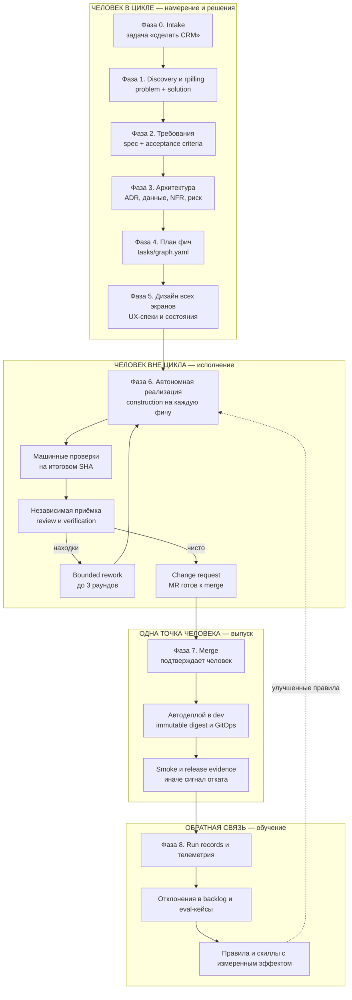

Границы ответственности: **решения и намерение — человек; исполнение и проверки — фабрика; необратимый выпуск — снова человек.** Это формула ADR-018: Human-in-the-loop для намерения и значимых решений, Human-off-the-loop для исполнения, Human-on-the-loop для наблюдения и исключений.

### 1.2. Фазы конвейера на примере CRM

| Фаза | Роль-владелец | Вход | Выход | Режим человека | Гейт |
|---|---|---|---|---|---|
| 0. Intake | `product` | формулировка «нужна CRM» из трекера, Console или CLI | ChangeSet `chg:small-crm:2026:0001` с профилем и риск-классом | in-the-loop (постановка) | — |
| 1. Discovery | `product` | ChangeSet, корпоративный контекст | `intent.md`: цель, scope / out of scope, ограничения + Assumptions | in-the-loop | Problem, Solution, UX, Discovery Gate |
| 2. Требования | `product` | Intent | `spec/delta.yaml` + `spec/requirements/REQ-*.md` с `AC-N` + `spec/scenarios/` | in-the-loop (approval) | `specification` |
| 3. Архитектура | `architect` | согласованная спека | `design/` (architecture, data, ui, deployment), ADR, NFR, риск | in-the-loop | `planning` |
| 4. План фич | `architect` | design + AC | `tasks/graph.yaml` (TASK-*, `satisfies`, `depends_on`) | on-the-loop | `planning` |
| 5. Дизайн экранов | `design` | requirements + design | UX-флоу, спеки экранов со всеми состояниями, маппинг на UIKit, UI-AC | in-the-loop | `ui` (маршрут `standard`) |
| 6. Реализация | `develop` | Implementation Contract, ContextBundle | код + тесты в ветке задачи | **off-the-loop** | `code` |
| 6. Проверка | `quality` | итоговый SHA, закреплённая спека, evidence | вердикт по каждой AC, findings | **off-the-loop** | `review`, `verification` |
| 6. Реворк | `develop` | blocking findings | исправления в том же MR | **off-the-loop** | лимит 3 раунда |
| 7. Merge | `ci-cd` + человек | MR, зелёные гейты, evidence | merge | **in-the-loop** | `review` (гейт авторизации merge) |
| 7. Доставка | `ci-cd` / `operation` | merge | immutable digest → GitOps → dev → smoke | off-the-loop (dev) | `release` |
| 8. Обратная связь | `operation`, `quality` | run records, метрики | eval-кейсы, предложения правил, reconciliation baseline | on-the-loop | — |

### 1.3. Режимы участия человека

Каноническая таблица (ADR-018 п.1), на которую опирается весь конвейер:

| Фаза работы | Роль человека | Режим |
|---|---|---|
| Формирование проблемы и требований | уточняет цели, ограничения, acceptance criteria | **Human-in-the-loop** |
| UX/UI | итеративно оценивает сценарии, прототипы, визуальный результат | **Human-in-the-loop** |
| Архитектура | совместно утверждает значимые решения и исключения | **Human-in-the-loop** |
| Планирование реализации | проверяет границы задачи и уровень риска | Human-on-the-loop |
| Написание кода | агенты автономно реализуют, тестируют и исправляют | **Human-off-the-loop** |
| Проверки качества и безопасности | автоматические гейты; человек по исключениям | Human-on-the-loop |
| Merge в MVP | явное подтверждение человека | **Human-in-the-loop** |
| Deploy в dev | автоматически после merge и успешных гейтов | Human-off-the-loop |
| Prod | ручное разрешение после evidence | Human-in-the-loop (пост-MVP) |

### 1.4. Мини-словарь

| Понятие | Что это |
|---|---|
| **ChangeSet** | Единица изменения со стабильным ID `chg:<product>:<year>:<NNNN>` и цепочкой `Intent → Spec → Design → Tasks → Verification → Evidence → Reconciliation`; содержит дельту относительно канонического Product Baseline |
| **Product Baseline** | Принятое состояние продукта (`.factory/product/`); попадает туда только через ChangeSet и reconciliation |
| **Стадия** | Этап конвейера: `specification → planning → construction → review_verification → release` |
| **Гейт** | Машинная или человеческая проверка: `specification`, `planning`, `code`, `ui`, `review`, `verification`, `release` |
| **GateDecision** | Зафиксированное решение гейта: политика и её версия, ревизия ChangeSet, результат `passed`/`failed`, находки, evidence, объяснение |
| **Implementation Contract** | Утверждённая человеком граница автономии: scope, AC, архитектурные ограничения, UI evidence, риск-класс, бюджет, правила эскалации |
| **Evidence** | Доказательство, а не самоотчёт: результаты проверок, отчёты, диффы, скриншоты, SBOM, ссылки с digest |
| **Риск-класс** | `R0…R4`; агенту разрешено только повышать класс, понижать — лишь формальная политика |
| **Rework** | Ограниченная доработка по findings, максимум 3 раунда; новый SHA аннулирует прежний допуск |

---

## 2. Фаза 0. Intake: задача превращается в ChangeSet

Человек формулирует намерение, фабрика заводит единицу изменения.

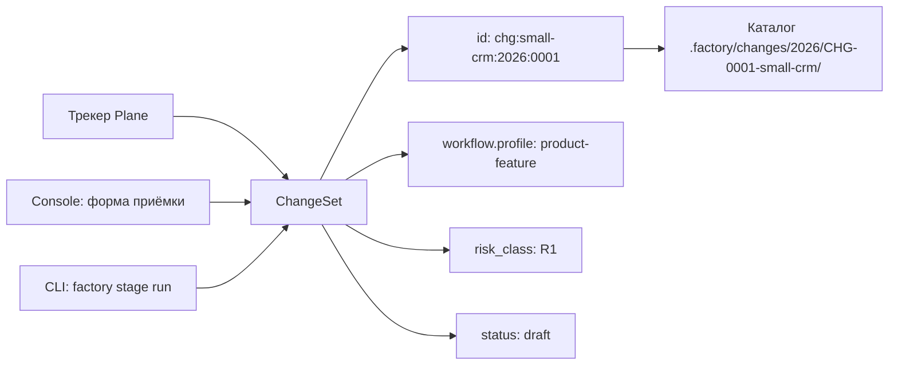

Что фиксируется сразу:

- **ID** по шаблону `chg:<product>:<year>:<NNNN>` — стабильный на всю жизнь изменения; каталог `CHG-NNNN-<slug>` из каталога не переезжает, состояние живёт в `change.yaml`.
- **Профиль строгости** `product-feature` — значит ChangeSet обязан иметь слоты `intent`, `spec`, `design`, `tasks`, `verification`, `evidence`; при `R2+` добавляется `reconciliation`. Для быстрого фикса (`bugfix-r0`) SDD-артефакты не нужны вовсе.
- **Риск-класс** из трекера (label `risk:R1`, дефолт `R1`).
- **Ревизия baseline**, к которой создан ChangeSet — она обязана совпадать с дельтой, иначе гейт блокирует.

Дальше каждая фаза добавляет в этот каталог свои артефакты, а не заводит новый.

---

## 3. Фаза 1. Discovery: человек и агент вместе «грилят» задачу

Это самая человеко-ёмкая фаза. Её результат — не документ ради документа, а **снятая неопределённость**: что делаем, чего не делаем, при каких ограничениях и по каким критериям поймём, что получилось.

### 3.1. Как выглядит сессия

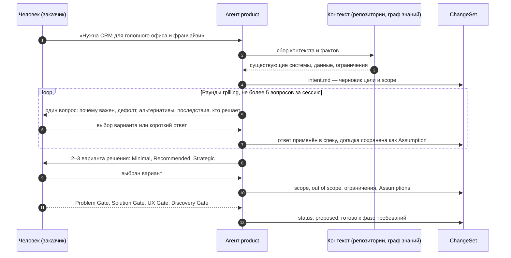

### 3.2. Правила грilling

Грilling не «допрос», а управляемая процедура снятия неопределённости — с ограничениями, чтобы не превращаться в бесконечный диалог:

- **Сканирование по фиксированной таксономии** из 9 категорий: функциональный scope и поведение; домен и модель данных; взаимодействие и UX-флоу; нефункциональные атрибуты (производительность, масштабируемость, надёжность, наблюдаемость, безопасность и приватность, соответствие требованиям); интеграции и внешние зависимости; краевые случаи и обработка отказов; ограничения и компромиссы; терминология и консистентность; сигналы завершённости.
- **Не более 5 вопросов за сессию, по одному за раз.** Вопрос включается, только если ответ материально влияет на архитектуру, модель данных, декомпозицию, тесты, UX, эксплуатацию или compliance.
- **Каждый вопрос — с рекомендацией.** Формат: почему это важно, предлагаемый вариант по умолчанию, альтернативы, последствия выбора, кто должен решать. Ответ — выбор из 2–5 взаимоисключающих опций либо короткий ответ.
- **Приоритет вопросов**: `Blocking` → `Important` → `Optional`. Blocking-вопрос без ответа останавливает продвижение.
- **Любая догадка становится Assumption** — с владельцем и статусом проверки, а не «подразумевается молча». В спеку попадают только явные допущения.
- **Не выдумывать**: если для продолжения не хватает данных, доступа или решения человека — фабрика останавливается и спрашивает, а не предполагает.

### 3.3. Пример раунда для CRM

| # | Категория | Вопрос | Варианты | Рекомендация | Решение человека |
|---|---|---|---|---|---|
| Q1 | Функциональный scope | Один общий процесс воронки для всех франчайзи или у каждого свой набор этапов? | A: единый процесс с локальными доп. этапами; B: полностью настраиваемый у каждого | **A** — проще отчётность и обучение | A |
| Q2 | Домен и данные | Клиент принадлежит конкретному франчайзи или сети? | A: франчайзи-владелец + общий пул сети; B: только франчайзи | **A** — иначе теряются сделки на стыке | A |
| Q3 | Интеграции | Коммуникации в MVP: ручное логирование или интеграция почты/телефонии? | A: только логирование; B: почта; C: почта + телефония | **A** для MVP, B/C — следующей волной | B (почта обязательна) |
| Q4 | Безопасность и приватность | Требуется ли изоляция данных франчайзи на уровне запросов и хранение ПДн по правилам сети? | A: изоляция на уровне запросов, срок хранения 3 года; B: отдельные схемы БД | **A** | A, риск части поднимается до R2 |
| Q5 | Interaction и UX | Обязательны ли мобильные сценарии «менеджер в торговом зале» в MVP? | A: адаптивная версия трёх экранов; B: только десктоп | **A** | A |

### 3.4. Четыре человеческих гейта discovery

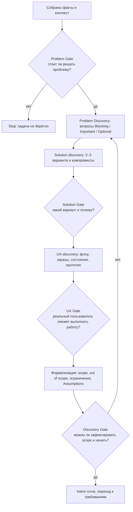

**Discovery Gate — 12 проверок**, без которых нельзя входить в реализацию: ценность, scope, сценарии, UX, правила, архитектура, данные, безопасность, тестируемость (AC автоматизируемы), риски, решения (человеческие approval зафиксированы), трассируемость (требование связано со сценарием, задачей и тестом).

### 3.5. Выход фазы: Intent

`intent.md` — вспомогательный документ, ему YAML frontmatter не требуется. Содержит: зачем (цель), scope, out of scope, ограничения. Для CRM, например: в scope — единая воронка, справочник клиентов, активности, базовая отчётность, импорт; out of scope — биллинг, складской учёт, омниканальный маркетинг, мобильное приложение, интеграция с телефонией.

---

## 4. Фаза 2. Требования: спека и specification gate

### 4.1. Из чего состоит спека

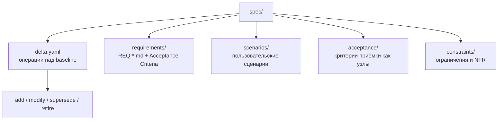

Спека — это **дельта**, а не копия всего продукта. Пример `spec/delta.yaml`:

```yaml
baseline_revision: 8f3a2c1
operations:
  - operation: add
    target: req:small-crm:clients:registry
    artifact: requirements/REQ-001-clients-registry.md
  - operation: add
    target: req:small-crm:pipeline:deal-stages
    artifact: requirements/REQ-002-deal-stages.md
  - operation: add
    target: req:small-crm:comms:email-logging
    artifact: requirements/REQ-003-email-logging.md
  - operation: modify
    target: req:small-crm:reports:consolidated
    artifact: requirements/REQ-004-consolidated-reports.md
```

### 4.2. Требования и критерии приёмки

Требование — самостоятельный узел графа знаний со своим frontmatter и обязательным разделом `## Acceptance Criteria`.

| Требование | Суть | Acceptance Criteria |
|---|---|---|
| `REQ-001` Реестр клиентов | компании и контакты с фильтрами, дедупликацией и историей | `AC-1` менеджер находит клиента по названию, ИНН или телефону не более чем за 2 действия; `AC-2` дубликат по ИНН и телефону не создаётся, показывается существующая карточка; `AC-3` при отсутствии прав запись скрыта и это объяснено пользователю |
| `REQ-002` Воронка и этапы | единый процесс этапов с локальными доп. этапами франчайзи | `AC-1` сделка переводится между этапами с обязательным полем комментария на этапе «Отказ»; `AC-2` история переходов сохраняется и доступна; `AC-3` изменение этапов не ломает уже открытые сделки |
| `REQ-003` Логирование почты | отправленные письма из CRM привязаны к сделке и клиенту | `AC-1` письмо отправлено из карточки и появляется в таймлайне сделки; `AC-2` при недоступности почтового провайдера письмо не теряется и отправляется после восстановления |
| `REQ-004` Консолидированная отчётность | сводка по воронке для головного офиса и по своему периметру для франчайзи | `AC-1` франчайзи видит только свои данные, головной офис — консолидированные; `AC-2` отчёт формируется не дольше 10 секунд на 100 тысячах сделок |
| `REQ-005` Аудит изменений | журнал критичных действий с автором и временем | `AC-1` смена владельца сделки и прав доступа попадает в журнал; `AC-2` журнал доступен только роли администратора |

### 4.3. Specification gate: машинные проверки до реализации

Гейт — чистая детерминированная функция: одинаковые входы дают одинаковый `GateDecision`, никаких LLM и часов. Пять осей, в фиксированном порядке:

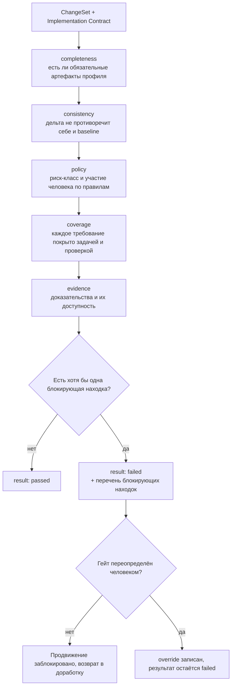

**12 блокирующих кодов** (любой из них валит гейт; остальные коды, включая неизвестные, не блокируют):

| Код | Что означает |
|---|---|
| `missing_required_artifact` | нет обязательного для профиля артефакта |
| `declared_artifact_missing` | дельта объявляет артефакт, которого физически нет |
| `baseline_revision_mismatch` | дельта и манифест ссылаются на разные ревизии baseline |
| `duplicate_delta_target` | один и тот же target в дельте дважды |
| `self_supersede` | требование заменяет само себя |
| `requirement_without_acceptance_scenario` | у требования нет проверки типа `acceptance-scenario` |
| `requirement_without_task` | требование никем не реализуется |
| `requirement_without_verification` | требование никем не проверяется |
| `scope_contradiction` | одно и то же попало и в scope, и в out of scope |
| `risk_class_lowered_without_policy` | риск-класс понижен агентом, а не формальной политикой |
| `reconciliation_required_for_high_risk` | для `R2+` нет плана reconciliation с baseline |
| `required_evidence_unavailable` | обязательное доказательство недоступно |

Наш пример: первый прогон гейта по CRM падает на `requirement_without_acceptance_scenario` (у `REQ-005` нет автоматизируемого сценария) и на `reconciliation_required_for_high_risk` (часть про ПДн и IAM — `R2`). Фаза требований не закрыта, пока это не исправлено.

### 4.4. Человек на гейте требований

- **Approval привязан к ревизии.** Согласование человека фиксируется вместе с ревизией спецификации; изменение ревизии **аннулирует** согласование. Реализация разрешена только для согласованной ревизии.
- **Override — только человек.** Агент не может «переопределить» гейт: попытка от агента отклоняется, а человеческий override **записывается, но не отменяет** результат — решение остаётся `failed`, появляется запись об исключении. Агенты гейты не отменяют.
- Форма согласования проверяема: актор, роль, привязка к ревизии или SHA, время, решение (`approved` / `rejected` / `waived`). Решения, принятые политикой или агентом, человеческий гейт не закрывают.

### 4.5. Жизненный цикл ChangeSet

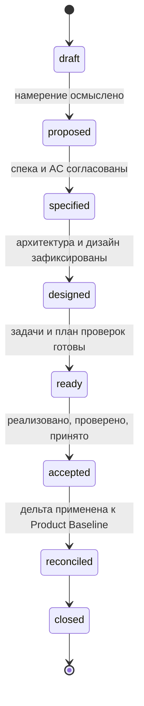

---

## 5. Фаза 3. Архитектура: значимые решения до кода

Правило репозитория: **значимое техническое решение фиксируется ADR до кода**. Изменение стека, зависимостей или структуры репозитория — только через ADR или явное согласование.

### 5.1. Три класса решений

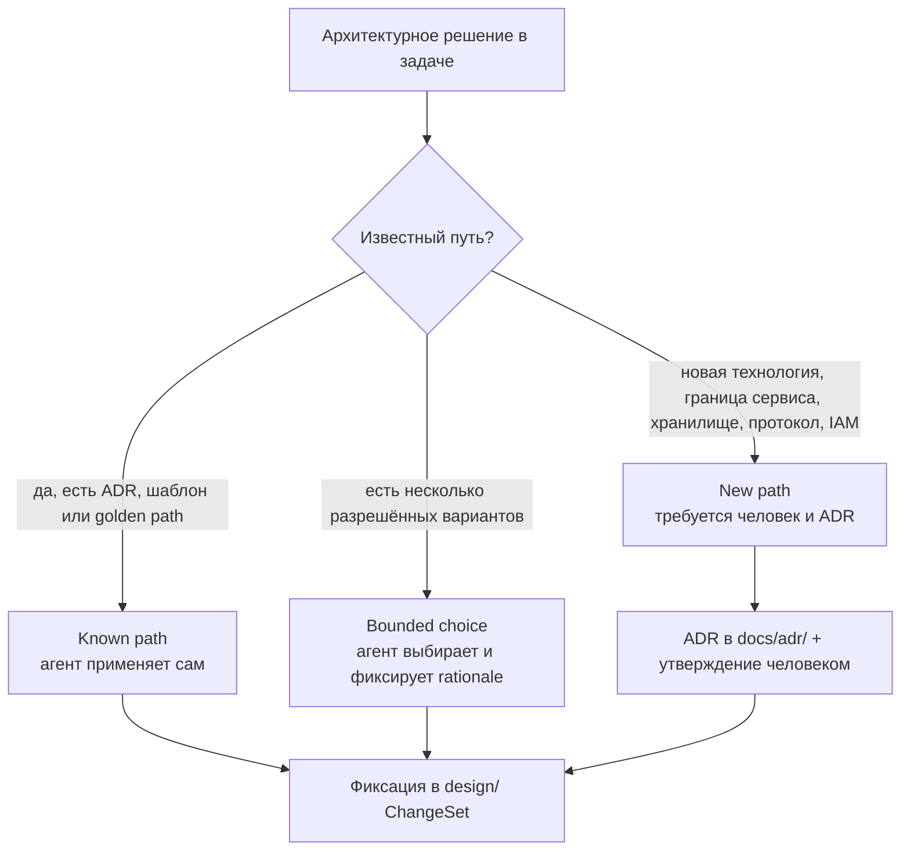

«Человек обязателен только для New path» — это и есть механизм, при котором архитектура в основном идёт автономно, а на человеке остаются только необратимые и ценностные решения.

### 5.2. Что производит роль `architect`

| Артефакт | Содержание |
|---|---|
| `design/overview.md` | как устроено решение: влияние, компоненты, интеграции |
| `design/architecture/` | границы сервисов и слоёв, контракты |
| `design/data/` | модель данных, миграции, стратегия консистентности |
| `design/ui/` | архитектурные ограничения для интерфейса |
| `design/decisions/` | предложения ADR и обоснования |
| `design/deployment/` | раскатка и откат |
| NFR-набор | производительность, надёжность, наблюдаемость, безопасность, сопровождаемость |
| ADR | `docs/adr/ADR-NNN-*.md` для значимых решений |
| Декомпозиция | вертикальные срезы, зависимости, порядок |

### 5.3. Архитектура CRM: пример наполнения

**Доменные границы.** Аккаунты и франшизы; клиенты; сделки и воронка; активности и задачи; коммуникации; отчётность; аудит; уведомления. Один модульный монолит с выделенными границами — никакого преждевременного дробления на сервисы.

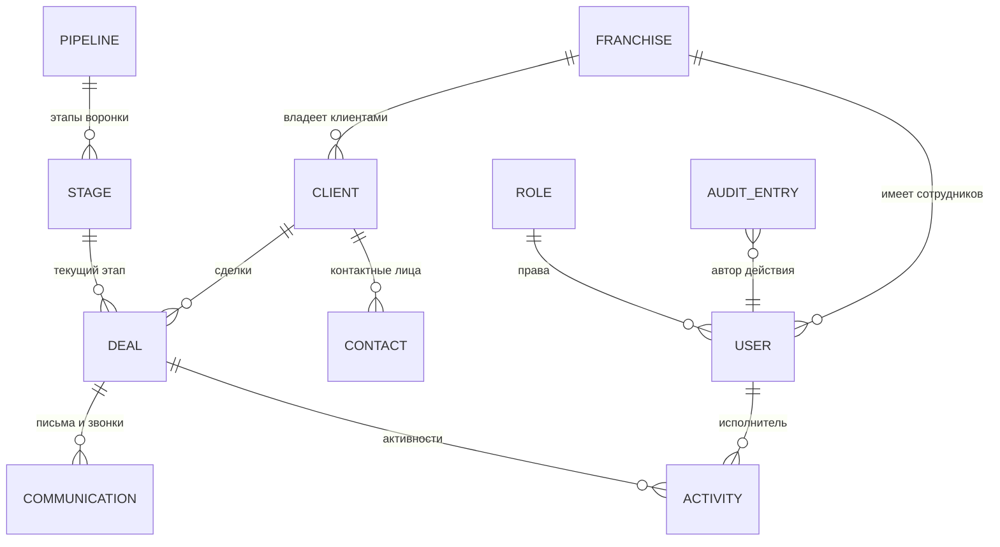

**Значимые решения для CRM, оформляемые ADR:**

| Решение | Класс | Почему важно |
|---|---|---|
| Модель изоляции данных франчайзи: фильтрация на уровне запросов с обязательным tenant-контекстом | New path (граница доверия) | Ошибка изоляции = утечка данных между франчайзи |
| Транзакционный outbox для исходящих коммуникаций и уведомлений | Known path | Гарантия «письмо не теряется» без двойной отправки |
| Модель прав: роли + атрибутный доступ по франшизе и владельцу сделки | New path (IAM) | Влияет на все экраны и отчёты |
| Расширение схемы без разрушения: expand/contract для миграций | Known path | Совместимость во время выкатки |
| Хранение истории переходов сделки как неизменяемый журнал | Bounded choice | Нужно и для отчётности, и для аудита |

**Нефункциональные требования** фиксируются как измеримые: отчёт по воронке не дольше 10 секунд на 100 тысячах сделок; список клиентов — первая страница до 2 секунд; изоляция данных франчайзи — 100 % запросов с tenant-контекстом и негативные тесты на утечку; доступность — по целевым SLO; хранение ПДн — 3 года с журналом доступа.

### 5.4. Риск-класс и его следствия

| Класс | Что это в CRM | Что разрешено |
|---|---|---|
| `R0` | косметика, документация | короткий маршрут, UI-гейт не требуется |
| `R1` | реестр клиентов, отчёты, импорт | автономно до состояния «готово к merge» |
| `R2` | модель изоляции данных, IAM, интеграции с почтой, аудит | обязателен reconciliation-план; эскалация человеку при обнаружении; release-гейт с вердиктом operation |
| `R3`, `R4` | регуляторные и необратимые изменения | только с явным человеческим контролем |

Правило монотонности: агент может **повысить** класс, обнаружив риск, но понизить — только формальная политика. До выполнения задачи T-080 условие «риск повышен до R2+» остаётся ручной оценкой, и это честно помечается в диагносте.

### 5.5. Выход фазы: Implementation Contract — граница автономии

Это ключевой артефакт, после которого начинается работа без человека.

| Поле | Пример для CRM-фичи «воронка и этапы» |
|---|---|
| `scope.in_scope` | этапы воронки, переходы, история, права на изменение этапов |
| `scope.out_of_scope` | автоматизация задач по этапам, интеграция с телефонией |
| `acceptance_criteria` | `AC-1…AC-3` из `REQ-002` |
| `architectural_constraints` | единый процесс этапов, локальные доп. этапы только добавляются, expand/contract для миграций |
| `ui_evidence` | утверждённые экраны воронки и карточки сделки с состояниями |
| `risk_class` | `R1` (для части про права — `R2`) |
| `budget` | лимит автономных итераций, дедлайн, лимит стоимости |
| `allowed_boundaries` | какие изменения публичного API, схемы данных, IAM и границ допустимы контрактом |
| `escalation_rules` | по умолчанию весь каталог условий эскалации |
| `approval` | пусто = **контракт не утверждён, реализация запрещена** |

Без утверждённого контракта вход в стадию реализации даёт блокировку с явной причиной: реализация не может начаться до человеческого одобрения.

---

## 6. Фаза 4. План реализации фич

### 6.1. Как выглядит план

Плана «в виде документа» здесь нет. Каноническая декомпозиция — **граф задач** `tasks/graph.yaml`, где каждая задача знает, какие требования она закрывает и от чего зависит:

```yaml
schema: dark-factory.dev/task-graph/v1
tasks:
  - id: TASK-001
    title: "Аккаунты франшиз, роли и изоляция данных"
    repository: small-crm-backend
    type: implementation
    satisfies: [req:small-crm:iam:tenancy, req:small-crm:iam:roles]
    depends_on: []
  - id: TASK-002
    title: "Реестр клиентов и дедупликация"
    repository: small-crm-backend
    satisfies: [req:small-crm:clients:registry]
    depends_on: [TASK-001]
  - id: TASK-003
    title: "Активности и задачи менеджера"
    repository: small-crm-backend
    type: implementation
    satisfies: [req:small-crm:activities:tasks]
    depends_on: [TASK-002]
  # … TASK-004 … TASK-012
```

`tasks.md` — генерируемое человекочитаемое представление того же графа; трекер (Plane) — рабочее представление. Отдельный «архитектурный план» не создаётся, чтобы не появилось второго источника истины.

### 6.2. Фичи CRM, зависимости и волны

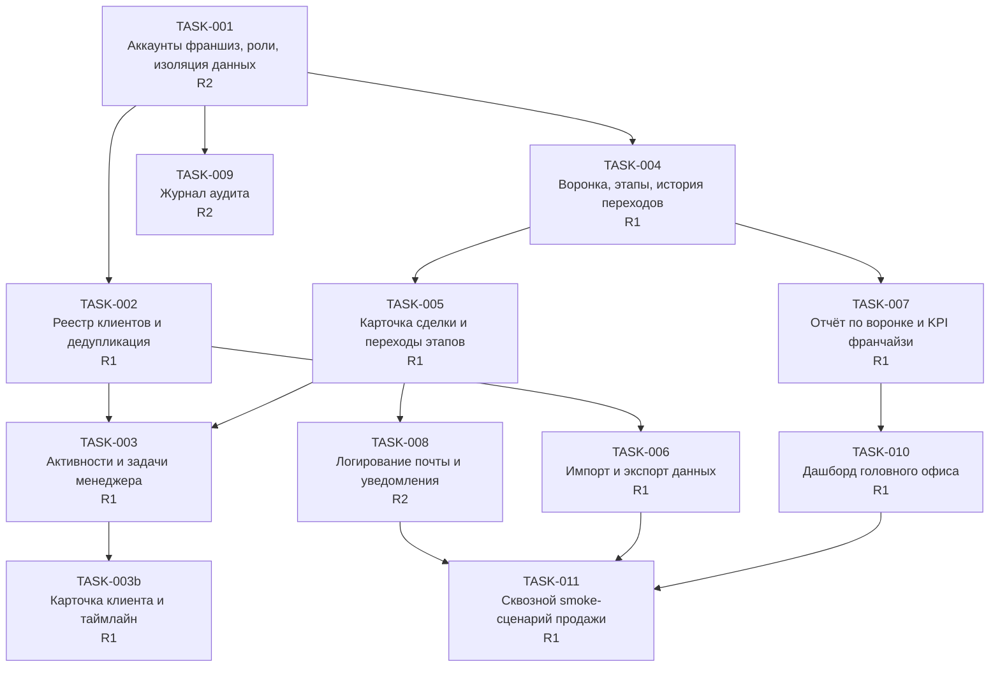

Волны исполнения (каждая волна — ChangeSet-и, идущие через конвейер; внутри волны допустимо параллельное исполнение с последовательной интеграцией патчей):

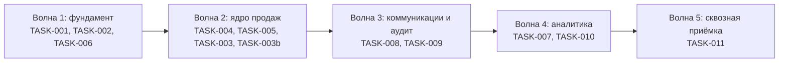

### 6.3. Ограничения параллелизма

- Внутри одной стадии допускается **не более двух параллельных ветвей**; третья отвергается на этапе построения графа. Это осознанный выбор: интеграция патчей идёт последовательно, с повторным прогоном проверок на объединённом SHA.
- Агрегат результата определяется порядком объявленных ветвей, а не порядком их завершения — результат воспроизводим.
- Первая упавшая ветвь прерывает выполнение с исходной ошибкой; соседняя отменяется; частичный результат не сохраняется.

### 6.4. Бюджет автономии

| Лимит | Значение по умолчанию | Что при исчерпании |
|---|---|---|
| Раунды доработки | 3 | эскалация человеку со стадией `blocked` |
| Автономные итерации | из Implementation Contract | эскалация, автономное продвижение запрещено |
| Дедлайн | из контракта | эскалация |
| Стоимость | из контракта | эскалация; расход учитывается до политик, рестарты его не сбрасывают |

Порядок важнее результата: при одновременном нарушении гейтов и бюджета наружу выдаётся причина **по гейтам** — это осознанный приоритет диагностики.

---

## 7. Фаза 5. Дизайн всех экранов

### 7.1. Что значит «проработать дизайн всех экранов»

Спецификация экрана достаточна, когда из неё **без домысливания** выводится и код, и проверки. Обязательный состав:

| Блок спецификации | Содержание |
|---|---|
| Назначение и пользователь | кто и зачем сюда попадает |
| Структура | секции, блоки, иерархия данных |
| Действия | что можно сделать и что доступно при каких правах |
| Состояния | загрузка, пусто, ошибка, частичные данные, нет прав, конфликт изменений, длительная операция, узкий экран |
| Поведение полей | валидация, сохранение введённого при ошибке, деструктивные действия с подтверждением |
| Маппинг на UI-кит | какие компоненты используются; чего нет — добавляется в кит, а не подменяется локальным хаком |
| Доступность | контраст, фокус, клавиатурная навигация, семантика и aria, читаемость |
| UI acceptance criteria | проверяемые формулировки: «ошибки показываются рядом с полями», «введённые данные не теряются после серверной ошибки», «основное действие доступно с клавиатуры», «экран не имеет горизонтальной прокрутки на целевых разрешениях» |

### 7.2. Конвейер проектирования экрана

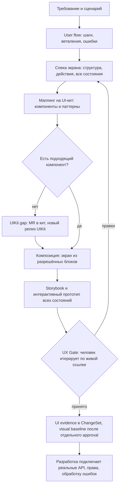

Принципиальные правила этого контура:

- **Storybook — исполняемая UI-спецификация вместо Figma.** Согласуется опубликованный интерактивный прототип на настоящих компонентах кита, а не картинка. Прототип не выбрасывается: его код и stories становятся частью продукта.
- **Агент не рисует с нуля, а компонует** из разрешённых блоков. Прямые импорты сторонних UI-библиотек и локальные копии компонентов кита запрещены машинно.
- **Visual baseline не может обновлять тот же агент, который написал код.** Изменение эталона — отдельное ревью, в MR прикладываются expected / actual / diff.
- **Низкая оценка UX не отвергает интерфейс автоматически**, а переводит его на человеческое ревью: автоматика ловит нарушения правил, вкус и уместность — человек.

### 7.3. Реестр экранов CRM

| # | Экран | Ключевые состояния, которые обязаны быть описаны |
|---|---|---|
| 1 | Вход и выбор франшизы | нет прав на франшизу, истёкшая сессия, несколько доступных франшиз |
| 2 | Реестр клиентов | пусто, загрузка, нет результатов фильтра, частичные данные, нет прав на запись, длинная загрузка с прогрессом |
| 3 | Карточка клиента | отсутствие контактов, конфликт одновременного редактирования, ошибка сохранения с сохранением введённого |
| 4 | Воронка сделок | пустая воронка, больше сделок чем помещается, запрет перехода этапа, ошибка при перетаскивании |
| 5 | Карточка сделки | обязательный комментарий при отказе, история переходов, недоступность внешней интеграции |
| 6 | Активности и задачи | нет задач, просроченные, повторяющиеся, недоступный исполнитель |
| 7 | Календарь | пересечение встреч, часовой пояс, длительная операция переноса |
| 8 | Импорт данных | ошибки валидации построчно, дубликаты, частичный успех, отмена импорта |
| 9 | Экспорт данных | большой объём, асинхронная подготовка, истёкшая ссылка |
| 10 | Отчёт по воронке | нет данных за период, фильтр по франшизе, длинная выгрузка |
| 11 | Дашборд головного офиса | пустой период, частичные данные франшиз, нет прав на консолидацию |
| 12 | Уведомления | пусто, ошибка доставки, отписка |
| 13 | Настройка воронки и прав | конфликт изменений, запрет опасного изменения, подтверждение необратимого действия |
| 14 | Журнал аудита | большой объём, фильтры по автору и объекту, нет прав |

### 7.4. Пример: основной сценарий продажи

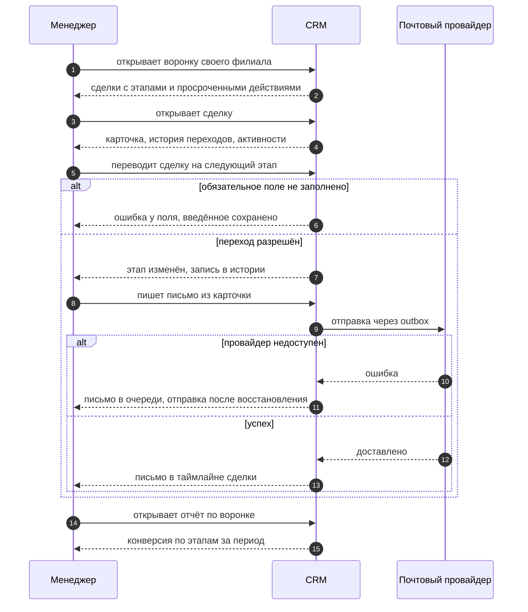

Состояния одного экрана — как их требует описывать роль дизайна:

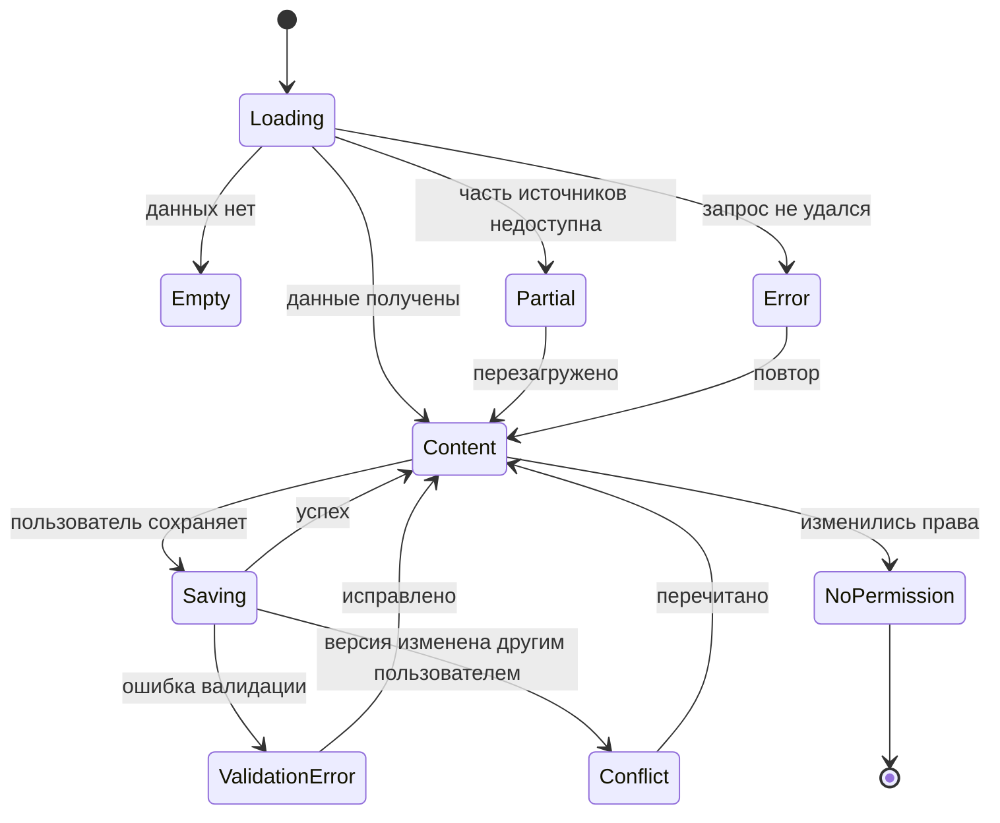

### 7.5. UI-гейты и уровни оценки качества интерфейса

| Уровень | Что проверяется | Чем |
|---|---|---|
| Детерминированный | все состояния из UX-контракта имеют story и тест; доступность действий; правила кита | валидатор покрытия состояний, Testing Library, ESLint UIKit-policy |
| Качество кода UI | типы, запрет обходов токенов и локальных переопределений кита | TypeScript strict, stylelint, UI-policy плагин |
| Доступность | отсутствие новых нарушений WCAG 2.2 A/AA | axe, Storybook, Playwright |
| Визуальная регрессия | необъяснённые изменения пикселей | Playwright screenshots, эталоны обновляются только отдельным ревью |
| Функциональные сценарии | пользовательский сценарий целиком | Playwright E2E |
| Производительность | бюджет бандла и метрики | Lighthouse CI |
| Экспертный | уместность и качество UX по рубрике | AI-ревьюер по скриншотам, DOM и флоу; низкая оценка переводит на человеческое ревью |

UI-гейт обязателен на маршруте `standard` и пропускается на коротком маршруте — но человеческие гейты не пропускаются никогда.

---

## 8. Фаза 6. Автономная реализация: код пишется без человека

### 8.1. Условия входа

Автономная работа начинается не «когда агент готов», а когда выполнены жёсткие предпосылки:

1. Спека согласована человеком и её ревизия зафиксирована.
2. Implementation Contract утверждён (иначе вход в реализацию блокируется).
3. Контекст собран в неизменяемый снапшот входа; любое изменение входа — новая логическая операция.
4. Бюджет итераций, времени и стоимости выделены.

### 8.2. Цикл на каждую фичу

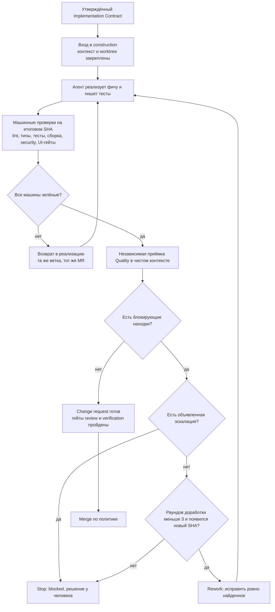

Важные свойства этого цикла:

- **Машинные проверки идут на итоговом SHA**, а не на промежуточных; утверждение агента о готовности ничего не заменяет.
- **Проверяющий не наследует контекст разработчика.** Приёмка строится с нуля от закреплённой спеки, диффа и evidence: тот, кто писал, не оценивает.
- **Новый коммит аннулирует прежний допуск.** Результат гейта действителен только для своего SHA.
- **Реворк возвращается в реализацию**, а не «чинится проверяющим»: проверяющая роль по контракту не исправляет находки в проверяемом изменении.

### 8.3. Как устроен цикл между агентами

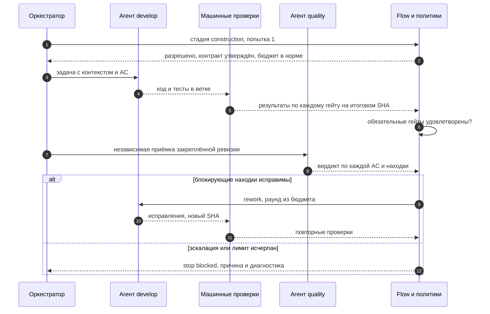

### 8.4. Что означает «без ошибок по стандартам»

Ключевая честная формулировка: фабрика не обещает, что агент не ошибается. Она гарантирует, что **ошибка не доедет до merge**, потому что результат определяется не самоотчётом агента, а контуром проверок. Контур состоит из семи механизмов:

1. **Машинные проверки на итоговом SHA.** Резюме агента не заменяет результаты проверок; детерминированный путь стадии намеренно не вычисляет гейты на рабочей ревизии, а честно возвращает ожидание — «обязательные гейты не вычислены, машинные проверки идут на итоговом SHA в CI».
2. **Независимая приёмка в чистом контексте.** Проверяющий строит контекст заново от закреплённой спеки, диффа и evidence и не наследует контекст разработчика.
3. **Fail-closed по умолчанию.** Отменённая, устаревшая или неизвестная проверка считается провалом, а не «не проверяли — значит хорошо». Отсутствующее обязательное доказательство запрещает успешное завершение.
4. **Привязка к SHA.** Новый коммит аннулирует прежние допуски, согласования и результаты гейтов: вердикт действителен только для своей ревизии.
5. **Ограниченная доработка.** Максимум 3 раунда; дальше — не бесконечный цикл, а остановка и человек.
6. **Evidence вместо самоотчёта.** По каждой AC — вердикт с доказательством: команда, вывод, артефакт. Формулировка «должно работать» доказательством не считается.
7. **Инварианты завершения.** Изменение не может стать успешным, пока вся обязательная evidence доступна и не осталось открытых блокирующих находок.

### 8.5. Стандарты как исполняемые ограничения

«Писать по стандартам» перестаёт быть пожеланием: каждый стандарт превращён в гейт с инструментом и точкой отказа.

| Стандарт | Чем проверяется | Когда блокирует |
|---|---|---|
| Стиль и формат Python | ruff check и ruff format --check | любое нарушение |
| Типы | mypy в strict-режиме | любая ошибка типов |
| Тесты | pytest, включая интеграционные против PostgreSQL | падение любого теста |
| Сборка артефакта | uv build | не собирается |
| Уязвимые зависимости | pip-audit по замороженному набору | найденное уязвимое зависимое |
| Статический анализ безопасности | bandit | значимая находка |
| Секреты | gitleaks, отдельным шагом до сборки образа | любой найденный секрет |
| Образ и цепочка поставки | trivy по опубликованному digest обеих платформ, syft SBOM | HIGH или CRITICAL без исправления |
| Границы слоёв и архитектура | тест импорт-границ: ядро не импортирует адаптеры, адаптеры зависят только от портов | нарушение правила зависимостей |
| Контракты внешних систем | контрактные сюиты, параметризованные реализациями: fake, github, gitlab, otel, plane | расхождение реализации и контракта |
| Схема данных | миграции плюс правило expand/contract | несовместимое изменение без плана миграции |
| Фронтенд | TypeScript strict, eslint, vitest, Playwright | ошибки типов, линта, тестов и E2E |
| Интерфейс | UI-policy ESLint, stylelint, axe, визуальная регрессия, покрытие состояний | обход кита, потерянное состояние, новое нарушение доступности, необъяснённый сдвиг пикселей |
| Инфраструктура как код | рендер-тесты чартов, kubeconform, shellcheck | невалидный или невоспроизводимый манифест |
| Согласованность метаданных | drift-тест снапшота консоли против источников | расхождение UI и логики |

### 8.6. Стоп-условия доработки

Цикл доработки останавливается по детерминированным правилам, в фиксированном порядке, первое сработавшее побеждает:

| # | Условие | Что происходит |
|---|---|---|
| 1 | На последнем проходе объявлена эскалация | Вето немедленно, **раунд не расходуется** (здесь останавливается, например, конфликт требований) |
| 2 | Исчерпан лимит раундов (3) | Остановка со стадией blocked |
| 3 | Нового коммита нет — тот же SHA | Повторное ревью невозможно: прежний допуск для этого SHA продолжает действовать |
| 4 | Повторяется тот же набор блокирующих находок | Остановка: доработка не приближает к результату |
| 5 | Иначе | Новый раунд доработки с перечнем находок, отсортированных и адресных |

Проход ревью без блокирующих находок в цикл доработки не попадает по определению — он уходит дальше по конвейеру.

### 8.7. Где автономность обязана остановиться

Десять машинно проверяемых условий эскалации. Это не аварийные ситуации, а **штатный выход**: стадия становится blocked с диагностикой, и решение принимает человек.

| Условие | Что поймано |
|---|---|
| `implementation_contract_unapproved` | попытка начать реализацию без утверждённого контракта |
| `requirements_deficient` | требования противоречивы или недостаточны для решения |
| `scope_exit` | реализация вышла за утверждённый scope |
| `boundary_change` | меняется публичный API, схема данных, IAM или архитектурная граница вне контракта |
| `new_adr_proposal` | требуется новое архитектурное решение (New path) |
| `risk_raised_to_r2` | обнаружен риск выше разрешённого; до T-080 это ручная оценка |
| `unrecoverable_gate_failure` | гейт не проходит и неисправим в рамках ограниченной доработки |
| `autonomy_budget_exhausted` | исчерпан бюджет итераций, времени или стоимости |
| `ui_unverifiable` | интерфейс нельзя подтвердить автоматическим сравнением и критериями |
| `irreversible_operation` | требуется необратимая операция |
Смена границы, **явно разрешённая контрактом**, остаётся автономной, пока изменение совместимо или несёт утверждённый план миграции.

---

## 9. Фаза 7. Merge и доставка: единственное место, где человек остаётся обязательным

### 9.1. Что проверяет политика merge

Проверки применяются по порядку, первая причина побеждает:

| # | Проверка | Исход |
|---|---|---|
| 1 | автором действия указан агент | blocked — у агентных подов нет полномочий на merge |
| 2 | ревизии неизвестны или ожидаемая не равна фактической вершине ветки | blocked |
| 3 | обязательные гейты не удовлетворены результатами на итоговом SHA | blocked |
| 4 | нет человеческого решения на гейте review, привязанного к итоговому SHA, или последнее решение не approved | manual — требуется ручной merge |
| 5 | решение принято человеком и привязано к итоговому SHA | human_merge_authorized |
| 6 | доверенный финализатор и риск-класс разрешён политикой | finalizer_merge_allowed |
| 7 | иначе | manual |

Если контекст merge отсутствует, режим считается ручным — дефолт всегда безопасный. Автоматический merge низкого риска по умолчанию выключен и включается отдельной политикой после накопления статистики пилота.

Отдельно важное разделение доверия: у агентных подов есть только право администрирования раннера — этого недостаточно ни для merge, ни для деплоя, ни для чтения секретов репозитория. Поэтому «агент сам смержил» невозможно технически, а не только запрещено правилами.

### 9.2. Путь изменения после merge

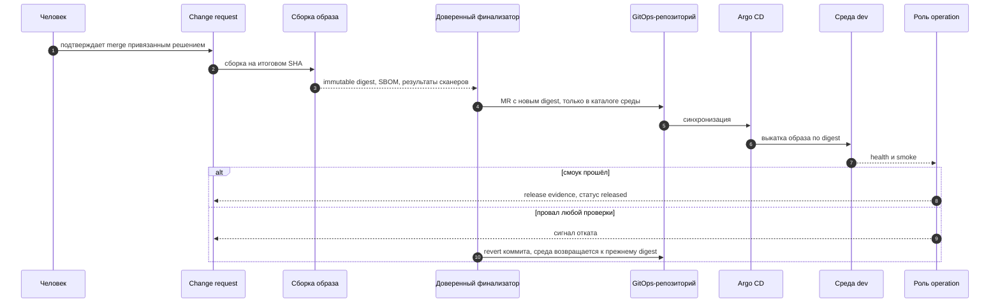

### 9.3. Решение о выпуске — fail-closed

| # | Проверка | Правило |
|---|---|---|
| 1 | digest | ожидаемый и наблюдаемый известны и совпадают |
| 2 | Argo sync | только Synced |
| 3 | Argo health | только Healthy |
| 4 | smoke | пробы выполнены и прошли; пустой набор проб — это NOT_RUN, то есть не released |

При провале проверок digest или Argo пробы вообще не отправляются: чужой деплой не зондируем. Каждая неудача несёт сигнал отката — это осознанный интерфейс к роли эксплуатации, а не просто ошибка.

### 9.4. Откат и миграции

- Откат приложения — revert коммита в GitOps-репозитории: автосинхронизация возвращает прежний digest.
- Миграции БД при этом не откатываются, поэтому изменения схемы делаются обратно совместимыми, по схеме expand и contract; разрушительные шаги выносятся отдельно и выполняются после стабилизации.
- Неуспешный smoke не переводит изменение в состояние released и служит сигналом отката.

### 9.5. Честный уровень автономии выпуска

На сегодняшней модели это **автономная реализация при человеческом гейте выпуска**: код, тесты, проверки и исправления делает фабрика, merge подтверждает человек, выкатка в dev после этого автоматическая. Полный уход человека с merge — отдельный шаг, который делается только по накопленной статистике пилота, с аудитом оснований и лёгким отключением.

---

## 10. Фаза 8. Что остаётся после прогона: evidence, наблюдаемость и обучение

### 10.1. Запись о прогоне

После изменения остаётся неизменяемая запись, которую нельзя незаметно переписать:

```text
runs/2026/09/<change>/<run>/
  manifest.yaml        точные ревизии входов
  snapshot.json        самодостаточная запись о прогоне
  stages/<stage>-<n>.json
  usage.json
  decisions.md         только если были решения
  evidence-index.json
```

Свойства записи: идемпотентность (повтор даёт unchanged, файлы не перезаписываются); immutability (исправление — новая ревизия записи, а не переписывание истории); проверка на секреты fail-closed и лимит размера; ссылки на evidence с контрольными суммами и запретом неиммутабельных ссылок. Публикацию делает доверенный публикатор: стадии идут в песочнице и прав записи в аудит-репозиторий не имеют.

### 10.2. Сквозная трассируемость

Контракт наблюдаемости связывает: change → run → stage → agent call → tool call → CI job → deployment, плюс атрибуты расхода — токены и стоимость. Экспорт по умолчанию — в логи задания; внешний бэкенд опционален. Сбой приёмника телеметрии деградирует телеметрию, но не роняет конвейер.

### 10.3. Метрики инициативы

Для каждой инициативы фиксируются: стоимость принятого изменения с учётом всех попыток; доля изменений, принятых с первого прохода; число раундов доработки; время до принятого change request; число ручных вмешательств. Критерий зрелости пилота: не менее семи из десяти сквозных прогонов без ручных правок артефактов агента.

### 10.4. Возврат знаний в baseline

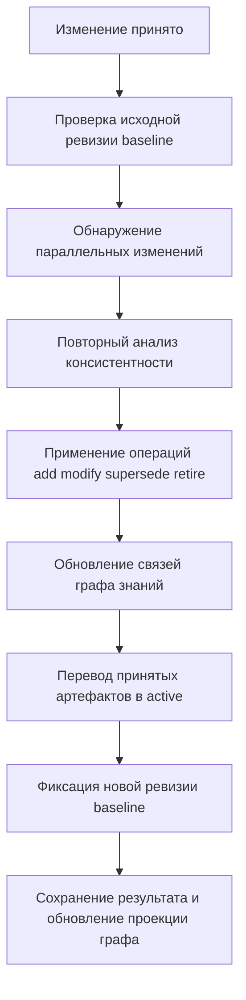

Если ревизия baseline изменилась, пока шла работа, конфликт фиксируется и решается явно, а не затирается. Прямые правки baseline мимо ChangeSet запрещены: любое изменение проходит полный жизненный цикл.

### 10.5. Обучение

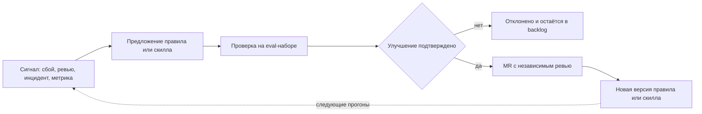

Защита от самообмана: агент не изменяет holdout-набор, которым проверяется его же результат; каждое изменение сравнивается с базовой линией; правила фабрики не меняются бесконтрольно.

Параллельно с конвейером работают служебные механизмы: доставка событий из очереди с дедупликацией и повторными попытками, а также сверка состояния, которая подхватывает зависшие задания, перехватывает истёкшие блокировки и закрывает дубликаты прогонов. Восстановление без участия человека — в пределах часа.

---

## 11. Кто что делает: сводка по всей сквозной задаче

### 11.1. Где человек обязателен

| Точка | Что решает | Почему не отдаётся агенту |
|---|---|---|
| Problem gate | нужна ли эта CRM вообще | ценностное решение о намерении |
| Solution gate | какой вариант и какие компромиссы приняты | необратимый продуктовый выбор |
| UX gate | способен ли реальный пользователь выполнить работу | вкус и уместность, проверка на живом прототипе |
| Discovery gate | можно ли зафиксировать scope и начинать | фиксация обязательств |
| Согласование требований | какая ревизия спеки принята | ответственность за содержание требований |
| Архитектура, класс New path | новая технология, граница сервиса, хранилище, протокол, модель IAM | необратимость и влияние на годы вперёд |
| Приёмка интерфейса | визуальный эталон и спорные UX-решения | эталон не обновляет тот, кто написал код |
| Merge | подтверждение выпуска изменения | политика репозитория: merge — человек |
| Prod | разрешение на промышленный выпуск | цена ошибки выше выгоды автономности |

### 11.2. Где человека нет

| Шаг | Что делает фабрика |
|---|---|
| Написание кода и тестов | агент разработки в отдельной ветке задачи |
| Машинные проверки | линт, типы, тесты, сборка, проверки безопасности, UI-гейты на итоговом SHA |
| Независимая приёмка | агент качества в чистом контексте, вердикт по каждой AC |
| Доработка | до трёх раундов, адресно по находкам, в том же изменении |
| Продвижение по стадиям | по таблице переходов, с обязательными гейтами и бюджетом |
| Сборка образа | immutable digest, SBOM, сканеры, evidence |
| Промоушен | доверенный финализатор создаёт изменение в GitOps |
| Выкатка в dev | автосинхронизация по digest |
| Проверка после выкатки | пробы, запись результата, сигнал отката при неудаче |
| Записи и трассировка | неизменяемая запись прогона, сквозная корреляция |
| Восстановление | перехват зависших прогонов, истёкших блокировок, дубликатов |
| Возврат знаний | применение принятой дельты к Product Baseline |

Итог для нашей задачи: после утверждения Implementation Contract фабрика проходит путь от кода до выкатки в dev без человека. Человек остаётся на четырёх решениях discovery, согласовании ревизии требований, решениях класса New path и на merge.

---

## 12. Что уже реализовано, а что пока цель

Этот раздел — честная инвентаризация, чтобы не выдать план за работающую систему.

| Звено конвейера | Статус | Комментарий |
|---|---|---|
| Стадии, таблица переходов, гейты, маршруты | реализовано | пять стадий, семь гейтов, маршруты quick и standard |
| PostgreSQL state store, outbox, reconciler | реализовано | состояние, блокировки, идемпотентность, сверка |
| Native SDD Core: ChangeSet, baseline, адаптеры, reconciliation | реализовано | включая адаптеры импорта legacy-артефактов |
| Specification gate и решение гейта с override | реализовано | пять осей, двенадцать блокирующих кодов |
| Независимая приёмка и решения о доработке | реализовано как чистые политики | классификация находок, лимит раундов |
| Профили исполняемых ролей | частично | только продукт, разработка и качество; остальные шесть ролей — план |
| Параллельные ветви внутри стадии | реализовано, в production не подключено | есть тесты, нет вызовов из рабочего пути |
| Вычисление гейтов в рабочем пути | частично | вычисление есть; связка со стадиями и состояние пока собираются CLI, сквозной сервис не собран |
| UI-кит, визуальная спецификация, UI-гейты | не реализовано | в плане; пока есть только роль-скилл дизайна и слот в ChangeSet |
| Preview-окружения на change request | не реализовано | в плане; в vision отнесено за скоуп MVP |
| Обучение и eval-набор | не реализовано | в плане |
| Риск-матрица R0–R4 как гейт | не реализовано | риск-классы используются как поле и в политиках, но условие R2+ пока ручная оценка |
| Автоматический merge низкого риска | выключен | включается по накопленной статистике пилота |
| Доставка: bootstrap кластера, Helm, Argo CD, OCI-сборка, smoke | реализовано | часть проверена статически, первый живой сквозной прогон — за человеком |
| Console фабрики | реализовано | пять экранов, наблюдение и точки вмешательства, проверено в кластере |
| Репозитории GitOps и записей прогонов | подготовлены как seed | создание самих репозиториев — решение человека |

Известный технический долг, влияющий на сквозной сценарий: внешний приёмник телеметрии не подключён; межузловая передача трассировки через границу CI-задания не реализована; нет отбора чувствительных атрибутов перед экспортом телеметрии; запись аудита в отдельный репозиторий требует доверенного CI-контура.

Расхождения документации, о которых стоит знать при чтении репозитория: статусы задач в плане отстают от фактического состояния кода; действуют две нумерации задач — номера плана и номера порядка исполнения в спецификации фичи; диаграмма жизненного цикла ChangeSet в описании SDD содержит больше состояний, чем контракт и код; обзорная архитектурная документация в части механики менее точна, чем описания модулей.

---

## 13. О публикации в Notion

Чего я **не смог сделать** в этой сессии: записать документ напрямую на страницу Notion.

- В сессии нет коннектора Notion и нет инструмента терминала, поэтому отправить запрос к API Notion невозможно; сама страница по ссылке требует JavaScript-клиента и через обычное чтение не отдаёт содержимое.

**Что нужно, чтобы довести до страницы:**

1. Перенести markdown-файл `docs/descriptions/crm-end-to-end-flow.md` в Notion (импорт markdown или копирование содержимого).
2. Каждый блок кода с пометкой `mermaid` вставить отдельным блоком-диаграммой: в Notion это делается командой `/mermaid` и вставкой кода — так все одиннадцать диаграмм отрисуются.
3. Если нужна автоматическая публикация без ручного копирования — требуется либо коннектор Notion в настройках редактора, либо токен интеграции и возможность запускать команды; токен при этом не должен попадать в код и в репозиторий, только в хранилище секретов.

**Статус изменений в репозитории:** файл создан в рабочей копии. Ветка задачи, коммит и change request не создавались — в этой сессии нет доступа к терминалу, а по правилам репозитория эти шаги выполняет роль CI/CD в рамках git-цикла задачи.
