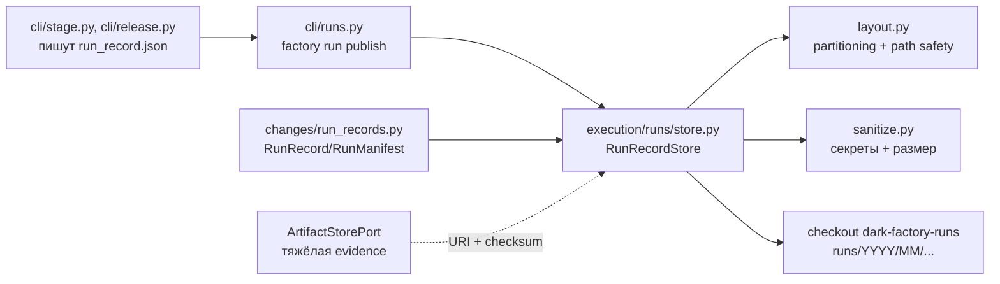

# Слой Execution — `execution/`, индекс run-записей в `dark-factory-runs` [T-061]

## 1. Назначение

Слой Execution — место, где Core взаимодействует с исполнением. Сейчас в нём
живёт одна подсистема: **публикатор run-записей** в репозиторий
`dark-factory-runs` (`execution/runs/`) — компактный immutable индекс
доказательств (ADR-015 п.4, ADR-006 п.2). Он отвечает на один вопрос: **как
запись о завершённом run попадает в Git так, чтобы её можно было найти,
воспроизвести и нельзя было незаметно переписать.** Операционный журнал при этом
остаётся в PostgreSQL (ADR-004), а тяжёлая evidence — в CI artifacts через
`ArtifactStorePort`: в Git едет только индекс.

Вторая подсистема слоя — провайдер `ExecutionPort` (изолированный workspace,
исполнение команд, evidence; T-012). Контракт уже описан в слое портов и
расширен аддитивным `write_file` (T-092 S2) — это write-половина
`collect_evidence`, через которую инструменты роли правят рабочее дерево;
реального адаптера пока нет (TD-022), в P0 живёт in-memory фейк. Роль
`idempotency_key` задана по методам (ADR-015 п.3, `protocols.py`): replay-дедуп —
только у `prepare_workspace`, `write_file` идемпотентен по состоянию (last write
wins), а у `run_command`/`collect_evidence` ключ — только адрес в effect
ledger/аудите: они читают текущее состояние и не кэшируют результат по ключу.

## 2. Состав пакета

| Модуль | Ответственность |
|---|---|
| `runs/store.py` | `RunRecordStore`: запись, чтение, поиск, индекс evidence, проверка цепочки, производные представления (`build_usage_summary`, `render_decisions`) |
| `runs/models.py` | `RunEvidenceIndex`/`RunEvidenceEntry`, `RunUsageSummary`, `RunRecordRef`, `PublishResult` |
| `runs/layout.py` | Partitioning `<root>/runs/<YYYY>/<MM>/<change>/<run>` и безопасность путей |
| `runs/sanitize.py` | Скрин секретов (`find_unsafe_values`) и лимит размера (`check_payload_size`) |
| `runs/errors.py` | Value-free ошибки: `UnsafeRunRecordError`, `RunRecordTooLargeError`, `RunRecordImmutabilityError`, `EvidenceChainError` |

## 3. Разметка записи: partitioning и path safety (`layout.py`)

Адрес записи выводится **только** из данных записи:

```text
<runs-root>/runs/<YYYY>/<MM>/<slug(change_id)>/<slug(run_id)>
```

Год и месяц берутся из `run.created_at`, приведённого к UTC, — не из часов
публикующего процесса: иначе повторная публикация той же записи уехала бы в
другой месяц и идемпотентность сломалась бы (ADR-015 п.4).

`slug()` оставляет только `[A-Za-z0-9._-]`, остальные символы заменяет на `-`:
`chg:product:2026:0001` → `chg-product-2026-0001`. Идентификатор, из которого
безопасный элемент пути не получается (пустой, `.`, `..`, слишком длинный),
отклоняется: запись без безопасного адреса не публикуется.

Отображение слага — сюръекция, но не инъекция: `a:b` и `a-b` дадут один
каталог. Поэтому слаг используется только как **адрес**, а идентичность записи
подтверждается по содержимому `snapshot.json` — поиск сверяет `change_id`
записи, а не имя каталога, и коллизия не может подменить одну запись другой.
`resolve_ref_path()` перепроверяет относительный путь (никаких `..`, абсолютных
путей и пустой строки), потому что ref может вернуться как данные.

## 4. Публикация записи (`store.py`)

`RunRecordStore.publish(record)` — детерминированная последовательность:

1. **Разметка** — вычисляется каталог записи.
2. **Сериализация** — собирается дерево записи (git-structure §8):
   `manifest.yaml` (`RunManifest`, ADR-015 п.5), `snapshot.json` — самодостаточный
   `RunRecord` и первичный артефакт записи, `stages/<stage>-<attempt>.json` по
   файлу на каждый immutable `StageResult`, `usage.json`, `evidence-index.json`
   и `decisions.md`, если у записи есть решения. Пустые секции не создаются.
3. **Screening** — лимит размера (`MAX_RUN_RECORD_BYTES`) и поиск секретов по
   JSON-путям сериализованной записи.
4. **Проверка цепочки evidence** — целостность ссылок (см. §6).
5. **Идемпотентность и immutability** — если каталог уже есть, `snapshot.json`
   сравнивается побайтово: совпал — `PublishOutcome.UNCHANGED`, отличается —
   `RunRecordImmutabilityError`. Перезапись завершённой записи запрещена:
   исправление — новая запись/ревизия (ADR-015 п.4).
6. **Атомарная запись** — дерево пишется во временный staging-каталог рядом и
   переименовывается на место: читатель видит либо целое дерево, либо ничего.
   Проигранная гонка с параллельным писателем означает, что публикованная
   запись побеждает (идентичная — `UNCHANGED`, иная — ошибка immutability).

Поиск и чтение: `find_existing(change_id, run_id=...)` возвращает последнюю
опубликованную запись (кандидаты сортируются по адресу), `list_runs(change_id)`
— все, `read_record(ref)` — саму запись. Это и есть «запись идемпотентно
адресуема по `change_id`» из DoD T-061. Нечитаемая или повреждённая запись —
ошибка, а не молчаливый пропуск: репозиторий append-only, и повреждение файла
само по себе является аномалией.

## 5. Screening: секреты и размер (`sanitize.py`)

Запись встраивает пользовательский текст (заголовки, комментарии, описания
findings), поэтому перед публикацией она проверяется шаблонами: приватные ключи,
GitHub-токены, `Bearer`-заголовки, JWT, AWS access key, присваивания
`token/password/secret=...` и credentials в URI. Скрин **fail-closed**: найденное
значение блокирует публикацию целиком, при этом диагностика называет только
JSON-путь и вид шаблона — никогда само значение (ADR-009).

Размер: суммарный объём дерева записи ограничен `MAX_RUN_RECORD_BYTES`
(512 KiB). Скриншоты, большие логи, build output и SBOM в Git не помещаются —
это evidence для `ArtifactStorePort`, в записи остаются URI и checksum
(ADR-009, ADR-015 п.4).

## 6. Цепочка evidence и её проверка

`build_evidence_index()` делает индекс из immutable `StageResult`: evidence
сохраняет свой `id`, artifact (у которого своего id нет) адресуется как
`artifact:<stage>:<attempt>:<index>`. Класс retention — `audit` для `required`
evidence (срок хранения обязан перекрывать окно approval/retry/аудита,
ADR-009 п.9) и `standard` для остальных.

`evidence_chain_violations()` возвращает список дефектов (пустой — запись
публикуема):

- ссылка на evidence id, которого никто не объявил (в `gate_results`,
  `findings`, `decisions`);
- один и тот же id объявлен дважды с разными `uri`/`checksum`;
- evidence `required` без `checksum` — **только для успешного** терминального
  статуса run: `failed`/`blocked` run записывается честно и не обязан нести
  полный набор доказательств;
- неиммутабельная ссылка (сегмент `latest`) у evidence или artifact;
- инварианты завершения ADR-009 п.9 (`completion_violations()` переиспользуется
  без изменений).

`verify_evidence_checksums()` пересчитывает sha256 evidence, разрешимой
локально; резолвер инъецируется (по умолчанию — `file://`), недостижимая
(remote) evidence нарушением не считается — тяжёлые данные живут вне Git.

## 7. Производные представления

- `build_usage_summary()` — сводка usage/cost: по записи на каждый stage attempt
  плюс итоги. Стадия без записанного usage даёт нули (но не исчезает), а итог,
  которого не сообщил ни один attempt, остаётся `None`, а не `0`.
- `render_decisions()` — человекочитаемая таблица решений для `decisions.md`;
  это представление, а не контракт (машиночитаемые decisions остаются в
  `snapshot.json`), ячейки экранируются, чтобы комментарий не разорвал строку.

## 8. Граничные случаи

- Повторная публикация той же записи — no-op, файлы не переписываются
  (проверяется по `st_mtime_ns` в тестах).
- Два результата одной стадии с одинаковым `attempt_number` в одной записи —
  ошибка: два файла `stages/` не могут претендовать на один путь.
- Slug-коллизия идентификаторов не смешивает записи (сверка по `change_id`).
- Отклонённая запись не оставляет частичного дерева: проверки идут до записи, а
  staging-каталог удаляется в `finally`.
- Не задан runs-root (`--runs-root` и `DARK_FACTORY_RUNS_ROOT` пусты) — exit 2,
  ничего не записано.

## 9. Где искать проверки

`tests/test_execution_runs.py` — разметка и path safety, идемпотентность,
immutability, скрины секретов и размера, цепочка evidence, checksum-проверка,
производные представления, коллизии слагов и повреждённая запись;

`tests/test_cli_runs.py` — коды выхода, форма `--json`, fallback на переменную
окружения, отсутствие эха секрета;

`tests/test_deploy_runs_schema.py` — дрейф схем seed-репозитория относительно
`RunManifest`/`StageResult`.

## 10. Связанные решения

[ADR-015](../../docs/adr/ADR-015-repository-boundaries.md) п.4 (протокол записи
и состав `dark-factory-runs`), п.3 (versioned-контракты), п.5 (immutable связи);
[ADR-006](../adr/ADR-006-ephemeral-job-pods-reconciler-cronjob.md) п.2 (разделение
журнала и индекса); [ADR-009](../adr/ADR-009-minimal-bootstrap-otel.md) п.5/п.8/п.9
(классы хранилищ, гигиена секретов, инварианты завершения); [ADR-004](../adr/ADR-004-postgresql-factory-state.md)
(PostgreSQL — операционный журнал).

## 11. Связь с другими модулями



- `cli/stage.py` (T011) и `cli/release.py` (T034) **производят** запись в
  `--evidence-dir`; публикация вынесена в отдельную команду, потому что стадии
  идут в sandboxed подах (ADR-018), а запись в аудит-репозиторий — действие
  доверенного публикатора (то же разделение, что у merge-политики, T-026);
- `changes/run_records.py` (T-003) — источник контрактов `RunRecord`/
  `RunManifest`; схемы `RunManifest`/`StageResult` экспортируются в seed
  `deploy/runs/schema/`;
- `ArtifactStorePort` (T-005) — там, где живёт тяжёлая evidence; запись ссылается
  на неё URI и checksum.
