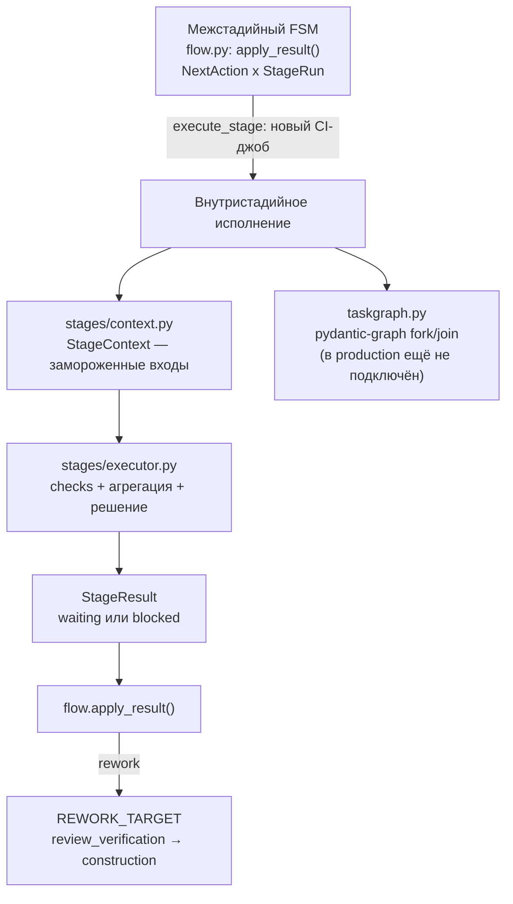
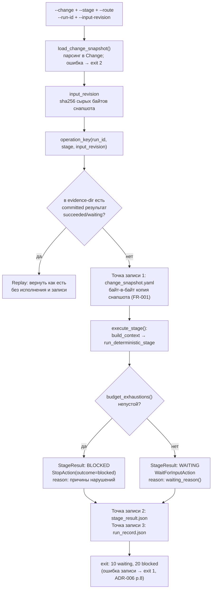
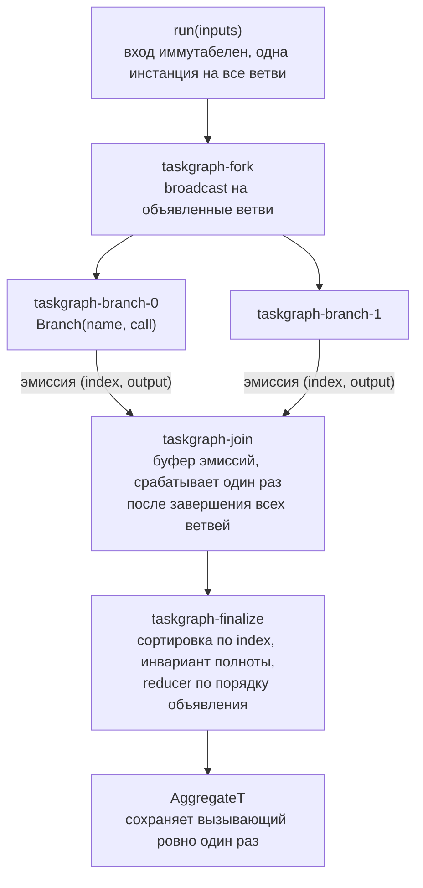
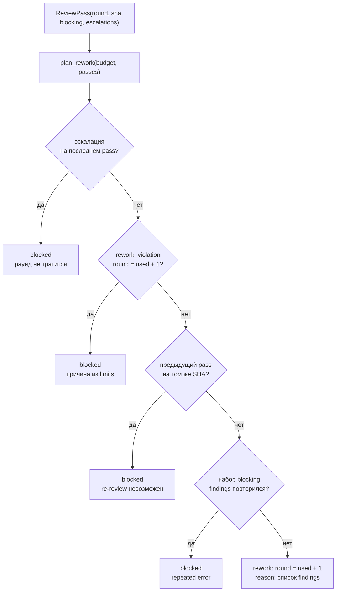

# Внутристадийное исполнение — `orchestration/stages`, taskgraph, rework

**Исходники:** [`orchestration/stages/`](../../src/dark_factory/orchestration/stages/) ([`context.py`](../../src/dark_factory/orchestration/stages/context.py), [`checks.py`](../../src/dark_factory/orchestration/stages/checks.py), [`executor.py`](../../src/dark_factory/orchestration/stages/executor.py)), [`taskgraph.py`](../../src/dark_factory/orchestration/taskgraph.py), [`rework.py`](../../src/dark_factory/orchestration/rework.py)

**Главный потребитель:** [`cli/stage.py`](../../src/dark_factory/cli/stage.py) — команда `factory stage run`: `execute_stage()` вызывает `build_context()` и `run_deterministic_stage()`. [`cli/ci_job.py`](../../src/dark_factory/cli/ci_job.py) модуль `stages/` не вызывает — он только читает сохранённый `StageResult` и рендерит GitHub Actions outputs. Публичный API — `orchestration/stages/__init__.py`: `StageContext`, `build_context`, `run_deterministic_stage`, `waiting_reason`, `budget_exhaustions`, `pending_gate_results`, `change_request_missing`.

## 1. Назначение

Модули этого документа отвечают за **одну стадию**: фиксирование входов, внутристадийное параллельное исполнение и машинные проверки с честным решением на выходе. Межстадийное продвижение — отдельная подсистема (`flow.py`, табличный FSM, см. [orchestration-flow-and-state.md](orchestration-flow-and-state.md)); `taskgraph.py` и `stages/` её не касаются.

Двухуровневая оркестрация (ADR-005):



Статус подключения компонентов — читать до кода:

| Компонент | Статус | Кто вызывает сегодня |
|---|---|---|
| `stages/` — детерминированный путь (T-010) | в production | `cli/stage.py` |
| `taskgraph.py` — TaskGraph (T-015) | реализован, **в production не подключён** | только `tests/test_orchestration_taskgraph.py` |
| `rework.py` — `plan_rework` (T-014) | реализован, **в production не подключён** | только `tests/test_orchestration_rework.py`; flow сам применяет `ReworkAction` |

Жизненный цикл одной попытки стадии в текущем коде: снапшот входа → сборка `StageContext` → машинные проверки → агрегация в `StageResult`. Параллельное исполнение агентов внутри стадии проектируется на `TaskGraph` (раздел 6), rework-цикл между стадиями — на `plan_rework` (раздел 7).

Жёсткие ограничения детерминированного пути (сверено с кодом):

- не вызывает harness/LLM (ADR-003): в `stages/` нет импортов `ports` и `agents`;
- не вычисляет ни один гейт на product SHA (FR-009) — машинные гейты исполняются в CI, поэтому все обязательные гейты записываются как `pending`;
- никогда не возвращает `succeeded` (FR-009, SC-004) — только `waiting` или `blocked`.

## 2. Полный прогон стадии

Точка входа — `run_stage_command(args: StageRunArgs)` в `cli/stage.py`. Входы CLI: `--change` (YAML-файл), `--stage`, `--route` (по умолчанию `Route.STANDARD`), `--run-id` (иначе `run_<uuid4 hex>`), `--input-revision` (иначе SHA-256 сырых байтов снапшота), `--evidence-dir` (опционально включает идемпотентность и evidence), `--json`, `--non-interactive`.



Точки записи результатов (все — при заданном `--evidence-dir`):

| Файл | Когда | Содержимое |
|---|---|---|
| `change_snapshot.yaml` | до исполнения, после валидации | байт-в-байт копия `--change` (FR-001) |
| `stage_result.json` | после исполнения, до выхода | сериализованный `StageResult`; ошибка записи → exit 1, потому что exit 10 «заявлял бы» несуществующий результат (ADR-006 p.8) |
| `run_record.json` | после `stage_result.json` | run record (ADR-015 p.4/p.5): манифест окружения с точными коммитами (никогда `latest`) и индекс evidence |

Exit-коды (константы `cli/main.py`): `EXIT_OK = 0`, `EXIT_ERROR = 1`, `EXIT_INVALID_INPUT = 2`, `EXIT_WAITING = 10`, `EXIT_BLOCKED = 20`. Детерминированный путь порождает только `waiting` (10) и `blocked` (20); коды 0 и 1 существуют для полной таблицы `_EXIT_CODE_BY_STATUS`.

Идемпотентность: `REPLAYABLE_RESULT_STATUSES = {SUCCEEDED, WAITING}` (`orchestration/idempotency.py`) — committed результат с таким статусом возвращается как есть; `failed`/`blocked` или отсутствие результата ведут к новому исполнению той же логической операции.

## 3. `stages/context.py` — заморозка входов попытки

`StageContext` — `@dataclass(frozen=True, slots=True)`, всё, что видят проверки и агрегация. После сборки контекст не расширяется и не мутирует.

| Поле | Тип | Откуда |
|---|---|---|
| `change` | `Change` | валидированный снапшот |
| `stage` | `Stage` | аргумент CLI |
| `route` | `Route` | аргумент CLI |
| `run_id` | `str` | аргумент CLI |
| `input_revision` | `str \| None` | `--input-revision` или sha256 снапшота |
| `required_gates` | `frozenset[Gate]` | `rules.gates.required_gates(route, stage)` |
| `budget` | `BudgetSnapshot` | в CLI — дефолтный `BudgetSnapshot()` |

```python
def build_context(*, change: Change, stage: Stage, route: Route, run_id: str,
                  input_revision: str | None, budget: BudgetSnapshot,
                  attempt_number: int = 1, risk_class: RiskClass | None = None,
                  implementation_contract: ImplementationContract | None = None,
                  enforce_contract_entry: bool = True) -> StageContext
```

`implementation_contract` — контракт запуска, которому принадлежит попытка (T-063); `enforce_contract_entry` говорит, применяется ли к контексту гейт входа в Construction. Драйвер (`advance_run`) собирает run-backed контекст и кладёт в него `run.implementation_contract`, поэтому `None` там — действительно отсутствующий контракт и гейт гейтит (fail-closed); одиночный `factory stage run` передаёт `enforce_contract_entry=False`, потому что у снапшота нет поля контракта и нет запуска.

`required_gates` — route-специфичный срез политики гейтов из `rules.gates` (единственный источник гейт-политики, ADR-005): на `construction` маршрут `standard` добавляет гейт `ui`, `quick` — нет. В CLI `DEFAULT_STAGE_ROUTE = Route.STANDARD` — консервативный полный набор гейтов.

## 4. `stages/checks.py` — машинные проверки

Только проверки, которые честно исполняются на зафиксированном контексте. LLM/harness нет (ADR-003); гейт, который путь исполнить не может, записывается как `pending` и никогда — как `passed`.

| Функция | Возвращает | Семантика |
|---|---|---|
| `budget_exhaustions(budget: BudgetSnapshot, *, now: datetime) -> list[LimitViolation]` | нарушения лимитов в стабильном порядке (FR-008, ADR-018 p.5) | сначала `rework_violation(budget, requested_round=budget.used_rework_rounds + 1)`, затем `continuation_violations` (token → cost → deadline) |
| `budget_stop_reason(check: BudgetCheck) -> str \| None` | `None` при `within_limits`, иначе `check.diagnostics` | исчерпание run/role-бюджета останавливает попытку (T-062, FR-018, ADR-018 p.5) |
| `budget_findings(check: BudgetCheck) -> list[Finding]` | по одному открытому blocker finding на каждое нарушение (`id = budget:<scope>[:<role>]:<rule>`, `origin = ci`) | видимость в Console: их считает `api.aggregates.open_blocker_count` (T-062) |
| `pending_gate_results(required_gates: frozenset[Gate]) -> list[GateResult]` | `GateResult(gate, GateStatus.PENDING)` на каждый обязательный гейт, отсортировано по `gate.value` | документирует, какие гейты стадия требует и что они ещё не вычислены; `pending` не удовлетворяет гейт в политике flow |
| `construction_entry_reason(context: StageContext) -> str \| None` | причина, по которой попытка не может войти в Construction, либо `None` | гейт входа в construction (T-016): только `Stage.CONSTRUCTION` и только гейтящийся контекст (`enforce_contract_entry`); причина берётся из `contract_entry_violation(context.implementation_contract)`; префлайт обоих исполнителей (T-063), до workspace/harness/публикации |
| `change_request_missing(stage: Stage, change: Change) -> bool` | `True`, если стадия завершается через merge, а `change.change_request is None` | применяется только к `REVIEW_VERIFICATION` (`_STAGES_REQUIRING_CHANGE_REQUEST`); на других стадиях `False` |

Делегирование в `orchestration/rules/limits.py` — точные тексты причин:

| Правило | Условие | `LimitViolation.reason` |
|---|---|---|
| `rework_limit` (исчерпан) | `used_rework_rounds >= max_rework_rounds` | `rework limit exhausted: {used}/{max} rounds used` |
| `rework_limit` (перебор) | `requested_round > max_rework_rounds` | `rework round {N} exceeds the limit of {max}` |
| `token_budget` | `tokens_used >= token_budget` (только если бюджет задан) | `token budget exhausted: {used}/{budget}` |
| `cost_budget` | `cost_used >= cost_budget` | `cost budget exhausted: {used}/{budget}` |
| `deadline` | `now > deadline` (строго) | `deadline {deadline.isoformat()} passed` |

Проверки бюджета попытки (T-062) приходят в `checks.py` уже вычисленными: `orchestration.budget.BudgetCoordinator` отдаёт `BudgetCheck`, а здесь он превращается в stop-reason и blocker findings — сам вердикт и его пороги описаны в [budget.md](budget.md).

## 5. `stages/executor.py` — агрегация и решение

```python
def run_deterministic_stage(context: StageContext, *, now: datetime | None = None,
                            budget_check: BudgetCheck | None = None) -> StageResult
def waiting_reason(context: StageContext) -> str
```

Шаги `run_deterministic_stage`:

1. `reference_now = now if now is not None else datetime.now(UTC)` — параметр `now` переопределяет настенные часы для проверки deadline и `produced_at` (детерминизм в тестах, как в `flow.apply_result`);
2. `gate_results = pending_gate_results(context.required_gates)`;
3. `entry_reason = construction_entry_reason(context)`: непустой → `StageStatus.BLOCKED` + `StopAction(outcome=StopOutcome.BLOCKED, reason=entry_reason)` — гейт входа в construction (T-063) относится к самой попытке Construction и проверяется раньше бюджета, а непустой контекст `factory stage run` от него отказался;
4. `violations = budget_exhaustions(context.budget, now=reference_now)`;
5. если `violations` непустой → `StageStatus.BLOCKED` + `StopAction(outcome=StopOutcome.BLOCKED, reason="; ".join(violation.reason ...))` — исчерпание переносимого snapshot выигрывает (SC-006), findings пустые;
6. иначе, если `budget_check is not None` и `budget_stop_reason(budget_check) is not None` → `StageStatus.BLOCKED` + `StopAction(outcome=StopOutcome.BLOCKED, reason=diagnostics)` + `findings=budget_findings(budget_check)` (T-062: Awaiting Decision);
7. иначе → `StageStatus.WAITING` + `WaitForInputAction(reason=waiting_reason(context))`.

`budget_check` — необязательный явный шов (T-062): под `DEFAULT_BUDGET_POLICY` (или без аргумента) результат побайтово совпадает с результатом до T-062, поэтому выбор политики всегда явный. Что означает вердикт `awaiting_decision` и как из него получаются blocker findings — [budget.md](budget.md).

`waiting_reason` называет каждую недостающую часть: `required gates not evaluated: {гейты через ", "} (machine checks run on the final SHA in CI (FR-009))`, а при отсутствии change request на `review_verification` добавляется `change request is not attached to the change (merge, ADR-011)` — части соединяются через `"; "`.

Общий скелет результата строит `_result(...)`: идентичность из контекста (`stage`, `run_id`, `change.id`, `input_revision`), `attempt_number = 1` всегда — персистентность attempt-состояния приходит позже (T011), поэтому CLI передаёт дефолтный `BudgetSnapshot()` и результаты исчерпания достижимы только для вызывающих с персистированным бюджетом. Детерминизм зафиксирован тестом: при фиксированных входах и `now` два вызова дают одинаковый `model_dump(mode="json")`.

`StageResult` — замороженный контракт (версия `schema_version = 1`, ADR-015 p.3): `status` валидируется по множеству `{waiting, succeeded, failed, blocked}`; поля `artifacts`, `evidence`, `gate_results`, `findings`, `escalations` по умолчанию пустые, `usage = None` (детерминированный путь usage не производит).

## 6. `taskgraph.py` — fork/join внутри стадии (T-015)

Фасад над pydantic-graph `GraphBuilder` (`pydantic-graph>=2.43,<3`), строго внутри одной стадии (ADR-005): межстадийный FSM он не трогает. Чистая оркестрация — stdlib и pydantic-graph; зависимости ветвей (порты, клиенты) замыкаются в callables, а не передаются через состояние графа.



API:

| Элемент | Сигнатура | Примечание |
|---|---|---|
| `_MAX_BRANCHES` | `= 2` | FR-005: максимум две параллельные подзадачи на job |
| `BranchCallable[InputT, OutputT]` | `Callable[[InputT], Awaitable[OutputT]]` | ветвь получает только вход, мутировать его нельзя |
| `Reducer[OutputT, AggregateT]` | `Callable[[AggregateT, OutputT], AggregateT]` | свёртка по выходам в порядке объявления |
| `TooManyBranchesError(ValueError)` | — | третья ветвь отклоняется на этапе конструирования |
| `Branch` | `@dataclass(frozen=True)`: `name: str`, `call: BranchCallable` | замороженный выход — frozen pydantic model или frozen dataclass |
| `TaskGraph.__init__` | `(*, name: str, reducer: Reducer[OutputT, AggregateT], initial_factory: Callable[[], AggregateT]) -> None` | `initial_factory` вызывается на каждый `run` — мутабельные агрегаты не протекают между запусками |
| `add_branch` | `(branch: Branch[InputT, OutputT]) -> None` | третья ветвь → `TooManyBranchesError`; дубликат `name` → `ValueError` |
| `TaskGraph.run` | `async (inputs: InputT) -> AggregateT` | без ветвей → `ValueError`; потерянная эмиссия → `RuntimeError` (внутренний инвариант); первая ошибка ветви → исходное исключение |

Гарантии:

- **Детерминизм агрегата**: join буферизует эмиссии в порядке завершения, `finalize` сортирует их по `index` (ключ детерминизма — позиция объявления), проверяет `[e.index ...] == list(range(len(branches)))` и сворачивает reducer. Агрегат — функция порядка объявления, а не порядка завершения.
- **Join не теряет выходы**: pydantic-graph `Join` стреляет один раз после всех ветвей под fork; инвариант полноты в `finalize` страхует контракт.
- **Fail-fast**: первая упавшая ветвь прерывает прогон исходным исключением (pydantic-graph не оборачивает в exception group), соседняя ветвь отменяется teardown'ом графа, агрегат не создаётся и не пишется.
- **Нет общего состояния**: API не имеет state-объекта — единственный канал результата ветви это её return value; пишет агрегат в состояние только вызывающий, ровно один раз.
- Node IDs стабильны: `taskgraph-branch-{index}`, `taskgraph-join`, `taskgraph-finalize`, `fork_id="taskgraph-fork"`; граф строится как `GraphBuilder(name=self._name, auto_instrument=False)`.

## 7. `rework.py` — ограниченный rework-цикл (T-014)

Политика уровня цикла «review → rework → re-review», над переходами flow. Flow (`flow.py`) применяет принятый `ReworkAction`: проверяет эскалации, автономный бюджет и `rework_violation`, тратит раунд (`budget.used_rework_rounds += 1`), помечает `StageRun` как `FAILED` и стартует целевую стадию из `REWORK_TARGET` (для `review_verification` — `construction`, остальные стадии перерабатывают себя). `plan_rework` добавляет решение, которого у flow нет: стоит ли после завершённого review-прохода тратить ещё один раунд.



API:

| Элемент | Определение |
|---|---|
| `FindingSignature` | `@dataclass(frozen=True)`: `origin: FindingOrigin`, `category: str \| None`, `file: str \| None`, `line: int \| None` — хешируемая идентичность блокирующего finding'а; `id` и `reviewed_sha` в неё не входят (перегенерируются каждым проходом; T-020: findings нового SHA — новые findings), `role` тоже не входит |
| `finding_signature(finding: Finding) -> FindingSignature` | строит сигнатуру из `Finding` |
| `ReviewPass` | frozen pydantic: `round: int = Field(ge=1)`, `sha: str = Field(min_length=1)`, `blocking: tuple[FindingSignature, ...] = ()`, `escalations: list[EscalationViolation] = []` — append-only история, `round = 1` для первичного review, `k + 1` для re-review после раунда `k` |
| `ReworkDecision` | `@dataclass(frozen=True)`: `outcome: Literal["rework", "blocked"]`, `round: int \| None`, `max_rounds: int`, `reason: str`, `signatures: tuple[FindingSignature, ...]` |
| `plan_rework` | `(*, budget: BudgetSnapshot, passes: Sequence[ReviewPass]) -> ReworkDecision` |

Условия остановки `plan_rework` — детерминированный порядок, первый матч → `blocked` (подмножество условий эскалации ADR-018 p.5):

1. объявленная эскалация на последнем pass — `escalation_stop_reason(last.escalations)`; эскалация — не rework-итерация, лимит не тратится; конфликт требований (`REQUIREMENTS_DEFICIENT`) останавливается здесь;
2. rework-лимит — `rework_violation(budget, requested_round=budget.used_rework_rounds + 1)`; authority — счётчики `BudgetSnapshot` (FR-016), не поля действия;
3. нет нового коммита — `previous.sha == last.sha`: предыдущее принятие этого SHA в силе, re-review невозможен;
4. повторная ошибка — `frozenset(previous.blocking) == frozenset(signatures)`;
5. иначе `rework`: `round = used + 1`, reason перечисляет findings, отсортированные по `(origin, category, file, line)`, в формате `origin/category file:line` (`-` вместо `None`).

Функция чистая: не мутирует `budget` и `passes`, одинаковый вход — одинаковый вердикт. `ValueError` для структурно неверного входа: пустая история («the rework loop is planned after a failed review») и последний pass без blocking findings. Модуль не импортирует `quality` — цикл потребляет сигнатуры, которые вызывающий вывел из классификации review (направление зависимости `quality → flow` сохраняется; в цикл входят только блокирующие findings: resolved и неблокирующие — нет).

Связь с `orchestration/rules/limits.py` и `BudgetSnapshot` (дефолты: `max_rework_rounds=3`, `used_rework_rounds=0`, `token_budget=None`, `tokens_used=0`, `cost_budget=None`, `cost_used=Decimal("0")`, `deadline=None`): `rework_violation` возвращает `None` или `LimitViolation(rule="rework_limit", reason=...)` с двумя вариантами текста (см. таблицу в разделе 4); токен/стоимость/deadline в rework-решении отдельно не проверяются — у цикла только rework-лимит.

## 8. Входы исполнителя: снапшот, ContextBundle, HarnessPort

Детерминированный путь получает **только** `Change` (из валидированного снапшота) и `BudgetSnapshot` — это и есть замороженные входы; никаких других чтений после сборки контекста.

Для сравнения — входы **агентов**, которые детерминированный путь не использует:

- `ContextBundle` (`context/bundle.py`, `schema_version = 1`) — версионируемый набор источников с провенансом: `ContextSource(kind, location, revision, content_hash, retrieved_at)`; `bundle_hash` — sha256 над канонической сериализацией отсортированных идентичностей `(kind, location, revision, content_hash)`, `retrieved_at` в хеш не входит; `build_bundle` отвергает точный дубликат источника через `ValueError`. Доставляется агентам как `TaskEnvelope.bundle_hash` (коллекция — `KnowledgePort.collect`), в `stages/` не входит.
- `HarnessPort` (`ports/protocols.py`, DTO в `ports/agents.py`): `async run_stage(envelope: TaskEnvelope) -> AgentResult` и `health()`. `TaskEnvelope` (frozen): `schema_version=1`, `change_id`, `run_id`, `stage`, `role`, `instruction`, `skill_id: str | None = None`, `bundle_hash: str | None = None`; `AgentResult` (frozen): `ok: bool`, `output: str = ""`, `usage: Usage | None = None`. По контракту порта «deterministic stage steps bypass it» — `stages/` harness не вызывает.

## 9. Граничные случаи

| Случай | Поведение |
|---|---|
| Третья ветвь в `TaskGraph` | `TooManyBranchesError` при `add_branch` |
| Дубликат имени ветви | `ValueError` при `add_branch` |
| `run()` без объявленных ветвей | `ValueError` |
| Join «потерял» выход завершённой ветви | `RuntimeError` в `finalize` (инвариант полноты) |
| Отказ одной из ветвей | fail-fast: исходное исключение (не exception group), соседняя ветвь отменена, агрегат не пишется |
| Мутабельный агрегат (список) между запусками | `initial_factory` вызывается на каждый `run` — накопления нет |
| Deadline ровно наступил (`now == deadline`) | не блокируется: условие строгое `now > deadline` |
| Ровно исчерпанный token/cost budget | блокировка (`>=`), причина по порядку token → cost → deadline |
| `used_rework_rounds > max_rework_rounds` (перекрут счётчика) | всё равно блокировка через ту же ветку `rework_violation` |
| Несколько нарушений лимитов одновременно | executor соединяет причины через `"; "` (rework первым) |
| `change_request` отсутствует на `review_verification` | в reason добавляется пометка про merge; на других стадиях проверка неприменима |
| `change_request` приложен | пометка исчезает, статус всё равно `WAITING` |
| Фиксированные входы и `now` | побайтово одинаковый `StageResult` (`model_dump(mode="json")`) |
| Вызов `run_deterministic_stage` без `now` | `datetime.now(UTC)` для deadline-проверки и `produced_at` |
| `StageResult` со статусом `pending`/`in_progress` | отклоняется валидатором `_status_is_a_result` |
| Пустая история passes в `plan_rework` | `ValueError` |
| Последний pass без blocking findings | `ValueError` (цикл планируется только для проваленного review) |
| Эскалация + исчерпанный лимит + повтор | побеждает эскалация (первая в порядке проверок) |
| Попытка Construction без approved Implementation Contract (run-backed контекст) | `BLOCKED` + `StopAction(blocked)` с причиной гейта, до workspace/harness/ветки/CR (T-063) |
| Тот же случай в контексте `factory stage run` (`enforce_contract_entry=False`) | гейт не применяется: стадия исполняется обычным путём (`waiting`) |
| `implementation_contract` задан и утверждён | гейт молчит: результат не отличается от стадии без такого поля |
| Частичное исправление (набор findings сократился) | разрешён следующий раунд |
| Pass с тем же SHA, но другим набором findings | `blocked`: re-review невозможен, предыдущее принятие SHA в силе |
| Повреждённый `stage_result.json` в evidence-dir | трактуется как отсутствие committed-результата — новое исполнение |

## 10. Где искать проверки

- [test_orchestration_stages.py](../../tests/test_orchestration_stages.py) — гейты повторяют политику маршрута, честный waiting-reason, change request, блокировки по лимитам, запрет `succeeded`, приём результата flow-движком, детерминизм;
- [test_orchestration_taskgraph.py](../../tests/test_orchestration_taskgraph.py) — лимиты ветвей, агрегация, детерминизм порядка объявления, fail-fast, свежий `initial_factory`;
- [test_orchestration_rework.py](../../tests/test_orchestration_rework.py) — порядок stop-условий, эскалации, чистота `plan_rework`, сигнатуры findings;
- [test_rules_limits.py](../../tests/test_rules_limits.py) — границы `rework_violation`/`continuation_violations`, которые делегируют `checks.py` и `rework.py`;
- [test_cli_stage.py](../../tests/test_cli_stage.py) — exit-коды и контракт `factory stage run`;
- [test_stage_run_idempotency.py](../../tests/integration/test_stage_run_idempotency.py) — replay по `operation_key`, повтор после `failed`, повреждённый результат.

## 11. Связанные решения

- [ADR-002](../adr/ADR-002-python-core-stack.md) — core stack: pydantic-graph как инфраструктура ядра, детерминированные шаги без LLM;
- [ADR-005](../adr/ADR-005-stage-scoped-graphs-light-workflow-core.md) — два уровня оркестрации: pydantic-graph строго внутри стадии, межстадийный FSM;
- [ADR-018](../adr/ADR-018-human-participation-autonomous-execution.md) — ограниченная автономия: rework-лимит, эскалации, остановка в `Blocked` с читаемой диагностикой.

## 12. Связь с другими модулями

| Документ | Связь |
|---|---|
| [orchestration-flow-and-state.md](orchestration-flow-and-state.md) | межстадийный FSM `apply_result()`, применение `ReworkAction`, state store |
| [rules.md](rules.md) | гейт-политика `required_gates` (вход `build_context`), лимиты `rework_violation`/`continuation_violations` |
| [budget.md](budget.md) | бюджет-координатор `orchestration/budget/`: `BudgetCheck` — вход `budget_check`, резервации и вердикт Awaiting Decision |
| [orchestration-operations.md](orchestration-operations.md) | эксплуатационные подсистемы orchestration: events, reconcile, policy (эскалации) |
| [context.md](context.md) | `ContextBundle` и SDD-слой — входы агентов (не детерминированного пути); там же различие `StageContext` vs `ContextBundle` |
| [agents.md](agents.md) | конвейер `AgentProfile → TaskEnvelope → AgentResult` за `HarnessPort`; адаптеры порта |
| [cli.md](cli.md) | команда `factory stage run`, exit-коды, evidence; контракт — `specs/001-dark-factory-mvp/contracts/cli.md` |
