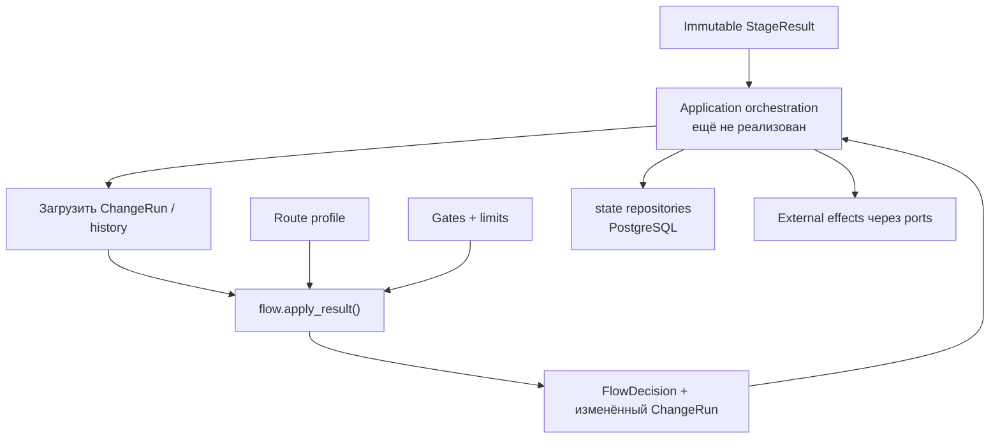
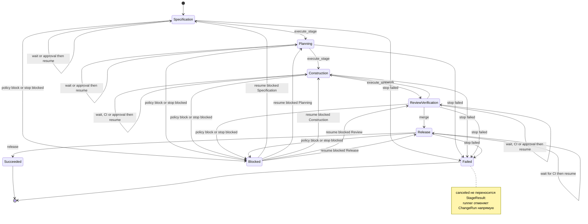
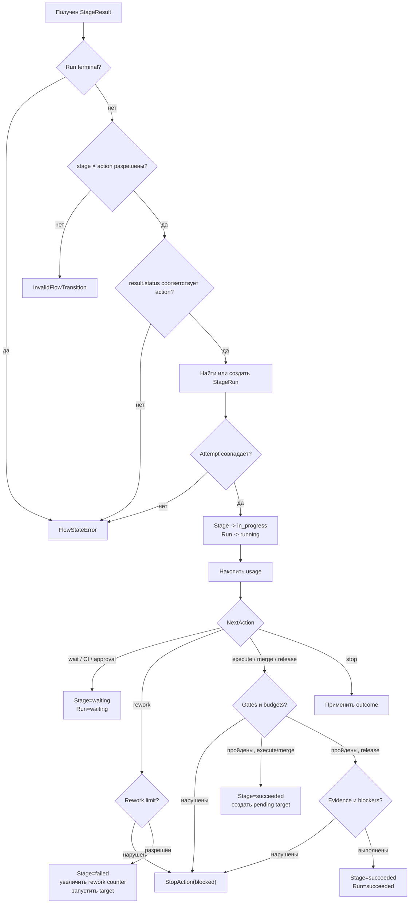
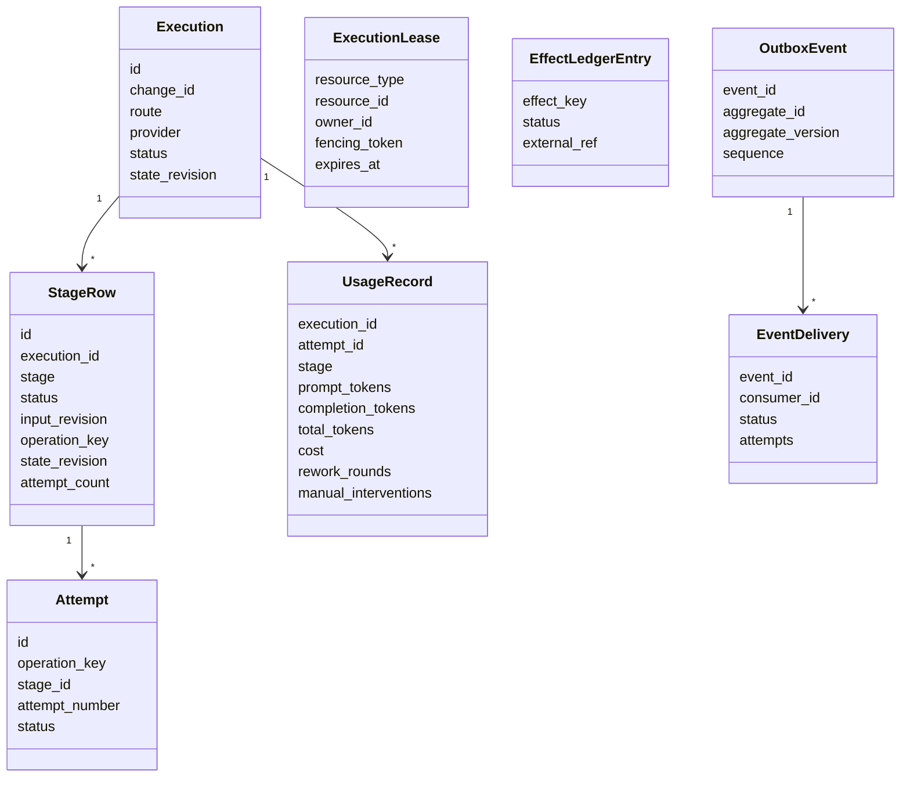
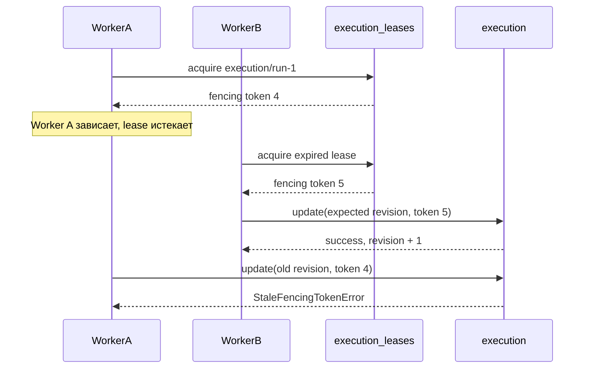
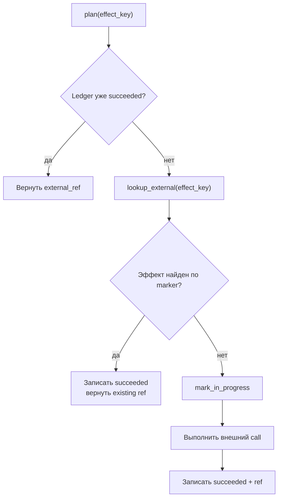
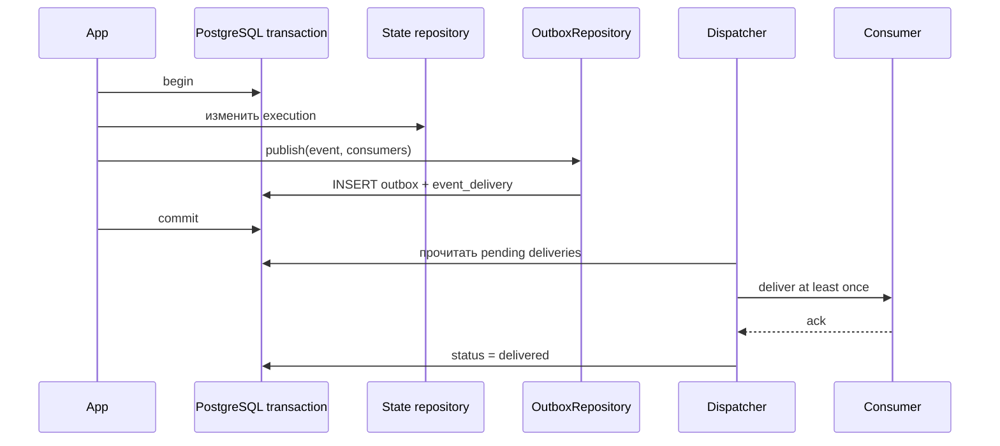

# Оркестрация: доменный Flow и operational state

**Исходники:**

- [`src/dark_factory/orchestration/flow.py`](../../src/dark_factory/orchestration/flow.py);
- [`src/dark_factory/orchestration/state/`](../../src/dark_factory/orchestration/state/).

## 1. Главное разделение

В `orchestration` находятся две разные подсистемы:

| Подсистема | Представление | Главная операция | Ответственность |
|---|---|---|---|
| `flow.py` | Pydantic domain models | `apply_result()` | Проверить действие и изменить доменные статусы |
| `state/` | SQLAlchemy ORM | репозитории в транзакции | Надёжно сохранить operational state в PostgreSQL |

`state/engine.py` — это фабрика **SQLAlchemy Engine и Session**, а не workflow engine и не конечный автомат.



> В текущем `src` нет production-сервиса, который связывает эти части: загружает durable state, строит `ChangeRun`, вызывает `apply_result()`, сохраняет его и выполняет side effects. Поэтому ниже явно разделены реализованное поведение и обязанности будущего caller.

## 2. Два уровня оркестрации

Согласно ADR-005:

- **внутри стадии** предполагается `pydantic-graph` TaskGraph;
- **между стадиями** работает собственный лёгкий табличный FSM из `flow.py`.

`flow.py` не вызывает LLM/harness, не обращается в БД и не запускает CI. Он принимает уже сформированный `StageResult` с одним из восьми `NextAction`.

## 3. Контракт межстадийного Flow

### 3.1. Вход: `StageResult`

Результат содержит как минимум:

- идентификаторы change/run;
- `stage` и номер attempt;
- `status`;
- дискриминированный `next_action`;
- gate results, findings и evidence;
- usage.

Допустимые result statuses: `waiting`, `succeeded`, `failed`, `blocked`.

### 3.2. Действия

| `NextAction` | Смысл | Требуемый result status |
|---|---|---|
| `execute_stage` | Перейти к следующей стадии маршрута | `succeeded` |
| `wait_for_input` | Ждать ввод человека | `waiting` |
| `wait_for_ci` | Ждать CI | `waiting` |
| `rework` | Начать ограниченный rework | `failed` |
| `request_approval` | Ждать human approval | `waiting` |
| `merge` | Выполнить merge-переход Review → Release | `succeeded` |
| `release` | Успешно завершить Release | `succeeded` |
| `stop` | Остановить запуск | зависит от outcome |

`stop(canceled)` имеет полное отображение в status table, но `StageResult` не допускает статус `canceled`. Отмена должна применяться runner-ом непосредственно через `ChangeRun.apply_status()`.

### 3.3. Выход: `FlowDecision`

Результат `apply_result()` содержит:

- обработанную стадию;
- **effective action**;
- итоговый stage status;
- итоговый run status;
- следующую стадию или `None`.

Effective action может отличаться от запрошенного: при нарушении gate, budget или completion invariant Flow создаёт `StopAction(blocked)`.

## 4. Таблица допустимых действий

`FLOW_TRANSITIONS` — единственный источник допустимых пар `Stage × NextAction.type`.

| Stage | Допустимые actions |
|---|---|
| Specification | execute, wait input, rework, approval, stop |
| Planning | execute, wait input, rework, approval, stop |
| Construction | execute, wait input, wait CI, rework, approval, stop |
| Review / Verification | merge, wait input, wait CI, rework, approval, stop |
| Release | release, wait CI, stop |



Review не имеет shortcut `execute_stage`: только `MergeAction` открывает Release.

## 5. Алгоритм `apply_result()`



### 5.1. Поиск активного `StageRun`

`_ensure_stage_run()`:

1. ищет последний non-terminal `StageRun` той же стадии;
2. проверяет совпадение attempt number;
3. если активного occurrence нет, разрешает создать только attempt 1;
4. переводит stage из `pending`, `waiting` или `blocked` в `in_progress`.

Детерминированный ID occurrence:

```text
<run.id>:<stage.value>:<occurrence>
```

### 5.2. Wait и resume

Wait-action переводит stage и run в `waiting`. Следующий результат той же попытки повторно вводит stage в `in_progress`, а run — в `running`.

Caller обязан сохранить `StageResult` и run **до завершения job и внешнего ожидания**.

### 5.3. Rework

- Specification, Planning и Construction возвращаются в себя;
- Review / Verification возвращается в Construction;
- текущий stage occurrence становится `failed`;
- run остаётся `running`;
- счётчик rework увеличивается.

Сам `flow.py` не увеличивает `attempt_number`: управление physical attempts относится к execution/state слою.

### 5.4. Release

После gates и budgets проверяется история `[*history, result]`:

- вся required evidence должна быть доступна;
- не должно остаться открытых blocker findings.

Историю передаёт caller; Flow её самостоятельно не загружает.

## 6. Ошибки Flow

| Ошибка | Когда возникает |
|---|---|
| `InvalidFlowTransition` | Пара stage/action отсутствует в таблице; execute target не совпадает с маршрутом |
| `FlowStateError` | Run терминален; status не соответствует action; attempt устарел; у merge нет следующей стадии |
| `InvalidStatusTransition` | Доменные `apply_status()` получили запрещённый status edge |
| Pydantic `ValidationError` | Некорректен сам versioned DTO |

Нарушение policy — не exception: оно возвращается как blocked decision.

## 7. Что хранит `state/`

PostgreSQL — authoritative operational state. CI показывает observed execution state, но не заменяет state store.

### 7.1. ORM-модель



`ExecutionLease` адресует произвольный ресурс парой `(resource_type, resource_id)`. `EffectLedgerEntry` адресуется детерминированным `effect_key`; прямых FK к execution у них нет.

### 7.2. State-specific enum

- `EffectStatus`: `planned`, `in_progress`, `succeeded`, `unknown`;
- `DeliveryStatus`: `pending`, `delivered`, `failed`, `dead`, `waived`.

Это persistence statuses, а не wire contract.

## 8. Engine и транзакции

`state/engine.py` предоставляет:

- `create_state_engine(url)` с `pool_pre_ping=True`;
- `create_session_factory(engine)` с `expire_on_commit=False`;
- `session_scope(factory)`.

`session_scope` делает commit при успехе, rollback при любом исключении и всегда закрывает Session.

`DEFAULT_DATABASE_URL` предназначен для локального PostgreSQL. Секреты production должны приходить через конфигурацию окружения, а не через этот default.

## 9. Idempotency keys

```text
operation_key = execution_id + stage + input_revision
attempt_id    = operation_key + attempt_number
effect_key    = operation_key + effect_type + effect_target
```

Семантика:

- новая input revision — новая logical stage operation;
- retry той же revision добавляет physical attempt к той же operation;
- внешний эффект имеет стабильный ключ независимо от повтора job.

`ExecutionRepository.create()`, `get_or_create_stage()` и `append_attempt()` используют PostgreSQL `ON CONFLICT DO NOTHING`.

## 10. Optimistic concurrency и fencing

`ExecutionRepository.update_status()` требует одновременно:

- текущую `state_revision`;
- актуальный `fencing_token` lease.



Kubernetes `concurrencyPolicy: Forbid` — оптимизация. Корректность обеспечивается строкой lease и монотонным token.

`LeaseRepository`:

- `acquire()` создаёт lease или забирает истёкшую; token увеличивается;
- `renew()` требует того же owner и token;
- `release()` удаляет lease только для текущего owner/token.

### Важная граница текущей реализации

Fenced optimistic update реализован для `Execution.status`. Отдельного repository-метода для такого же update `Stage.status` пока нет. `append_attempt()` меняет `attempt_count` без expected revision/fencing parameter.

## 11. Effect ledger

`ensure_effect()` обеспечивает effectively-once контролируемый side effect:



Критическое условие: адаптер внешней системы должен уметь найти эффект по детерминированному marker. Иначе crash после внешнего call, но до commit может привести к повтору.

`mark_unknown()` существует для неизвестного исхода, но helper `ensure_effect()` сам его не вызывает — caller должен обрабатывать соответствующий failure path.

## 12. Transactional outbox

`OutboxRepository.publish()` добавляет событие и строки доставки в **текущую транзакцию caller-а**. Это позволяет сохранять state change и event атомарно.



Порядок гарантируется только внутри aggregate по монотонному `sequence`. Глобального порядка событий нет.

`next_sequence()` вычисляет `max(sequence) + 1`, а уникальный constraint `(aggregate_id, sequence)` защищает от дубликата; конкурентный конфликт должен быть обработан caller-ом через retry транзакции.

## 13. Reconciliation

Порт `ReconciliationService` отделён от `WorkflowEnginePort`:

- desired state читается из PostgreSQL;
- observed state — из workflow/CI;
- при drift решение принимается в пользу PostgreSQL.

Текущая production-реализация reconciler-а отсутствует. Fake сравнивает только statuses и всегда возвращает desired status/revision; lease, retries и корректирующие side effects он не выполняет.

## 14. Несовпадающие модели

`ChangeRun`/`StageRun` и ORM `Execution`/`StageRow` похожи по смыслу, но это разные модели. Mapper между ними в текущем коде не реализован.

Не следует считать, что изменение Pydantic-модели автоматически сохранено в PostgreSQL: это обязанность application orchestration layer.

## 15. Граничные случаи и ограничения

- `apply_result()` не дедуплицирует replay; повтор может повторно добавить usage;
- Flow не проверяет, что `result.stage` глобально является текущей стадией run — он проверяет active occurrence и action;
- usage добавляется до action-specific target validation;
- `ExecutionRepository.create()` при повторе ID возвращает существующую строку и не сравнивает новые route/provider/change_id;
- repository `update_status()` защищает concurrency, но сам не вызывает доменную status transition table;
- DB constraint errors не нормализуются в `StateError`, транзакция откатывается и исходная SQLAlchemy/DB ошибка пробрасывается;
- `UsageRecord` есть в схеме, но отдельного usage repository пока нет;
- outbox sequence при конкурентной публикации может потребовать retry транзакции.

## 16. Где искать проверки

- `tests/test_flow_engine.py`, `tests/test_flow_transitions.py` — доменный FSM;
- `tests/integration/` — PostgreSQL schema/repositories, если доступна тестовая БД;
- `tests/contract/test_workflow_engine_port.py` — workflow contract;
- `tests/contract/test_reconciliation_service.py` — reconcile contract.

## 17. Связанные решения

- [ADR-004](../adr/ADR-004-postgresql-factory-state.md) — PostgreSQL как authoritative state;
- [ADR-005](../adr/ADR-005-stage-scoped-graphs-light-workflow-core.md) — межстадийный FSM;
- [ADR-006](../adr/ADR-006-ephemeral-job-pods-reconciler-cronjob.md) — durable execution, retry, lease и reconcile;
- [ADR-016](../adr/ADR-016-postgresql-outbox.md) — transactional outbox.
