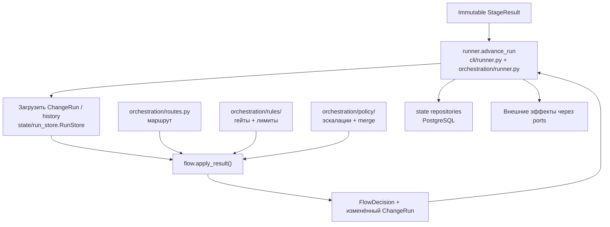
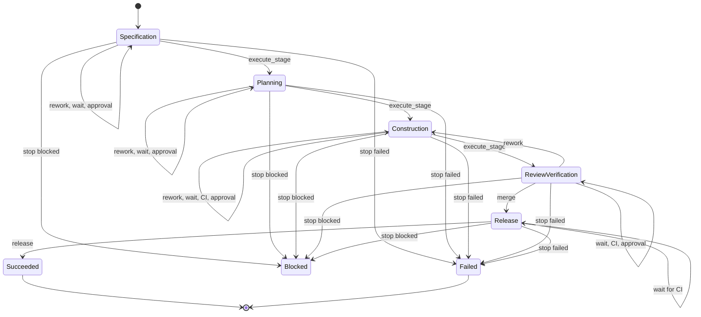
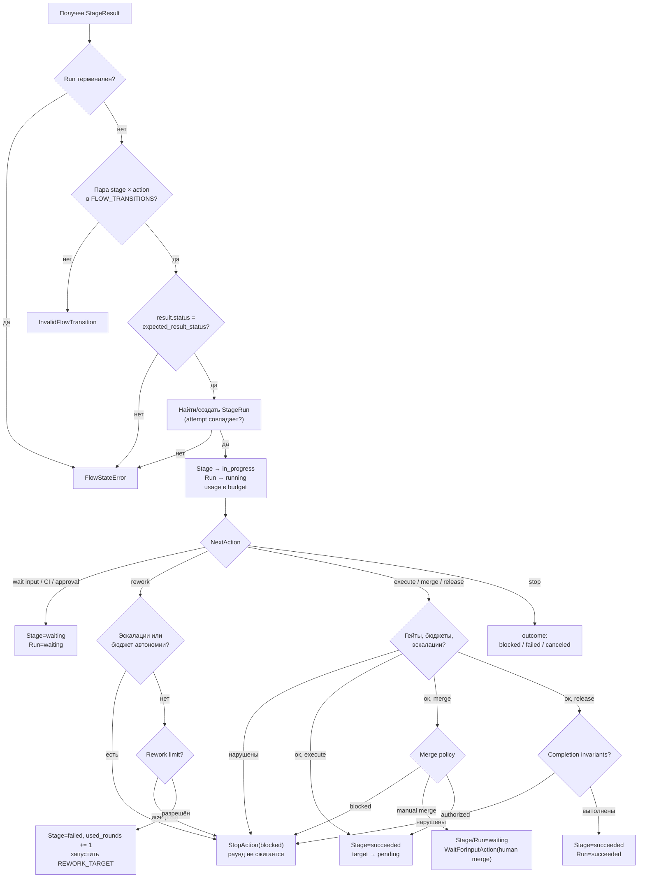
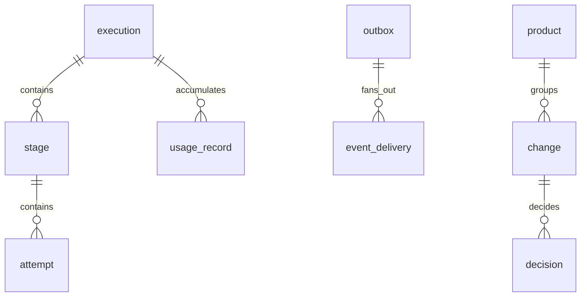
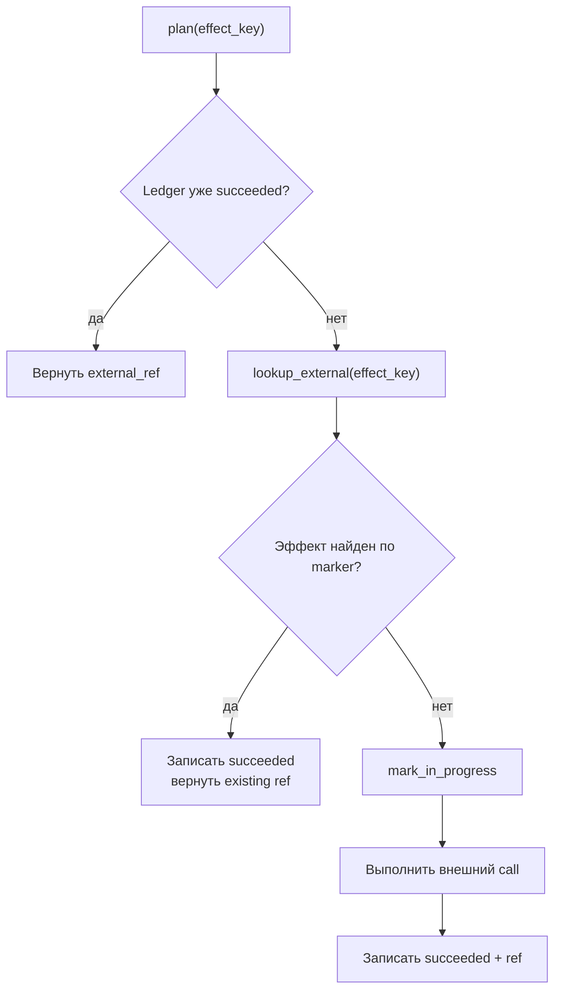

# Оркестрация: доменный Flow и operational state

**Исходники:**

- [`src/dark_factory/orchestration/flow.py`](../../src/dark_factory/orchestration/flow.py) — межстадийный доменный FSM;
- [`src/dark_factory/orchestration/idempotency.py`](../../src/dark_factory/orchestration/idempotency.py) — операционная идемпотентность стадии;
- [`src/dark_factory/orchestration/state/`](../../src/dark_factory/orchestration/state/) — PostgreSQL state store;
- [`src/dark_factory/changes/`](../../src/dark_factory/changes/) — домен: статусы, `NextAction`, контракты, на которых построены оба слоя.

**Главный потребитель:** durable-раннер — [`orchestration/runner.py`](../../src/dark_factory/orchestration/runner.py) + [`orchestration/state/run_store.py`](../../src/dark_factory/orchestration/state/run_store.py), CLI-лицо — [`cli/runner.py`](../../src/dark_factory/cli/runner.py) (T-092). Потребители `state/` — [`api/`](../../src/dark_factory/api/), [`cli/`](../../src/dark_factory/cli/), [`orchestration/reconcile/`](../../src/dark_factory/orchestration/reconcile/); сам `flow.py` дополнительно потребляет экспорт `orchestration/__init__.py`.

## 1. Главное разделение

| Подсистема | Представление | Главная операция | Ответственность |
|---|---|---|---|
| `flow.py` | Pydantic domain models | `apply_result()` | Проверить действие (гейты, лимиты, эскалации, merge policy) и изменить доменные статусы |
| `state/` | SQLAlchemy ORM | репозитории в транзакции | Надёжно сохранить operational state в PostgreSQL |
| `idempotency.py` | Protocol + evidence-файл | `find_existing()` / `record()` | Не исполнять одну логическую операцию стадии дважды |

`state/engine.py` — фабрика **SQLAlchemy Engine и Session**, а не workflow engine.



> Durable-раннер среза S1 существует: `runner.advance_run()` загружает `ChangeRun` из `run_store.RunStore`, вызывает `apply_result()` и сохраняет **всё решение** атомарно (`RunStore.persist_decision`: stage_result, статусы stage/attempt/run, `pending`-строки созданных стадий — successor-стадия, без которой run не продолжится, — и outbox-событие `run.stage_completed`). Повтор той же операции он распознаёт до любой записи и просто возвращает committed-результат (`replayed`, §13.2). Внешние side effects и harness-исполнитель стадии — срез S2: инжектируемый `StageExecutor` подменяется без изменения драйвера, `cli/stage.py` по-прежнему пишет evidence-файлы и двигает статусы в run record напрямую (T-003). Ниже разделены реализованное поведение и обязанности будущего caller-а.

## 2. Два уровня оркестрации

Согласно ADR-005:

- **внутри стадии** — pydantic-graph task graph (`orchestration/taskgraph.py`, T-015) и детерминированный исполнитель (`orchestration/stages/`, rework-петля `orchestration/rework.py`) — см. [orchestration-execution.md](orchestration-execution.md);
- **между стадиями** — собственный лёгкий табличный FSM из `flow.py`.

`flow.py` не вызывает LLM/harness, не обращается в БД и не запускает CI. Он принимает уже сформированный `StageResult` с одним из восьми вариантов закрытого union `NextAction`.

## 3. Контракт межстадийного Flow

### 3.1. Вход: `StageResult`

Frozen-модель (`schema_version = 1`): `stage`, `run_id`, `change_id`, `attempt_number`, `input_revision`, `status`, дискриминированный `next_action`, `artifacts`, `evidence`, `gate_results`, `findings`, `escalations`, `usage`, `produced_at`.

Допустимые result statuses: `waiting`, `succeeded`, `failed`, `blocked` — validator отклоняет остальные (`pending`/`in_progress`/`skipped` не имеют результата).

### 3.2. Действия

`expected_result_status(action)` возвращает статус, который обязан сопровождать действие; несовпадение отклоняется движком.

| `NextAction` | Смысл | Требуемый result status |
|---|---|---|
| `execute_stage(next_stage)` | Перейти к следующей стадии маршрута | `succeeded` |
| `wait_for_input(reason)` | Ждать ввода человека | `waiting` |
| `wait_for_ci(reason, change_request?)` | Ждать CI по change request | `waiting` |
| `rework(round, max_rounds, reason)` | Начать ограниченный rework | `failed` |
| `phase_round(phase, reason?)` | Следующий раунд **той же** стадии для следующей операторской фазы (M3, ADR-039): только `specification` — requirements → architecture → interface; раунд доработки не тратится | `succeeded` |
| `request_approval(gate, requested_from?)` | Ждать human approval на гейте | `waiting` |
| `merge(change_request)` | Merge-переход Review/Verification → Release по merge policy | `succeeded` |
| `release(target_environment="dev")` | Успешно завершить Release | `succeeded` |
| `stop(outcome, reason)` | Остановить запуск | `blocked` / `failed` / `canceled` |

`stop(canceled)` не имеет представимого result status (статуса `canceled` среди result statuses нет): отмену runner применяет напрямую через `ChangeRun.apply_status()`, а такой `StageResult` отклоняется validator-ом до движка.

### 3.3. Выход: `FlowDecision`

Frozen-dataclass: `stage`, **`action`** (effective action), `stage_status`, `run_status`, `next_stage`. Effective action может отличаться от запрошенного:

- при нарушении гейтов, бюджета, эскалации или completion invariant — синтезированный `StopAction(blocked, reason)`;
- когда merge policy требует человека — синтезированный `WaitForInputAction("waiting for human merge (ADR-011 p.2): …")`.

## 4. Таблица допустимых действий

`FLOW_TRANSITIONS` — единственный источник допустимых пар `Stage × NextAction.type`; `REWORK_TARGET` — куда уходит rework-раунд.

| Stage | Допустимые actions | Rework target |
|---|---|---|
| Specification | execute, wait input, rework, **phase_round**, approval, stop | в себя (rework и phase_round) |
| Planning | execute, wait input, rework, approval, stop | в себя |
| Construction | execute, wait input, wait CI, rework, approval, stop | в себя |
| Review / Verification | merge, wait input, wait CI, rework, approval, stop | → Construction |
| Release | release, wait CI, stop | (rework вне таблицы) |



Review не имеет shortcut `execute_stage`: только `MergeAction` (через merge policy) открывает Release. У Release нет `execute_stage` и rework: неудача деплоя эскалирует через `stop`. `Blocked` возобновляется в ту же стадию (`blocked → in_progress`), как только человек отвечает на wait-причину.

## 5. Статусы и таблицы переходов

Доменные таблицы живут в `changes/run.py`, значения — в `changes/enums.py`. Любое изменение статуса идёт через `ChangeRun.apply_status()` / `StageRun.apply_status()`: вне таблицы — `InvalidStatusTransition`; каждый переход инкрементирует `state_revision` (optimistic concurrency, ADR-006 п.4). Единственный переход вне доменного Flow — операторское снятие запуска (§19): `RunStore.withdraw_run` проводит те же рёбра `* → canceled` через durable-writer, не через `apply_status`.

### 5.1. `RunStatus`

| Статус | Разрешённые переходы |
|---|---|
| `pending` | running, canceled, superseded |
| `running` | waiting, blocked, succeeded, failed, canceled, superseded |
| `waiting` | running, blocked, failed, canceled, superseded |
| `blocked` | running, failed, canceled, superseded |
| `succeeded`, `failed`, `canceled`, `superseded` | терминальные — переходов нет |

### 5.2. `StageStatus`

| Статус | Разрешённые переходы |
|---|---|
| `pending` | in_progress, skipped, canceled, superseded |
| `in_progress` | waiting, succeeded, failed, blocked, canceled, superseded |
| `waiting` | in_progress, failed, blocked, canceled, superseded |
| `blocked` | in_progress, failed, canceled, superseded |
| `failed` | in_progress, canceled, superseded — **не терминальный**: retry начинает новую попытку той же операции |
| `succeeded`, `skipped`, `superseded`, `canceled` | терминальные |

Прямых рёбер `pending → succeeded` и `waiting → succeeded` нет: `_ensure_stage_run()` сначала вводит стадию в `in_progress`, затем обработчик завершает её одним шагом.

## 6. Алгоритм `apply_result(run, result, *, history=(), now=None, merge_context=None)`

`now` подменяет настольные часы для deadline-лимита (детерминизм тестов и replays); `history` передаёт caller для completion invariants; `merge_context` — факты merge для merge policy.



### 6.1. Поиск активного `StageRun`

`_ensure_stage_run()`: ищет последний non-terminal `StageRun` той же стадии; проверяет совпадение attempt number — несовпадение даёт `FlowStateError` (защита от устаревших результатов, ADR-006 п.4); если активного occurrence нет — разрешает создать только attempt 1; переводит стадию из `pending`/`waiting`/`blocked` в `in_progress`.

Детерминированный ID occurrence:

```text
<run.id>:<stage.value>:<occurrence>
```

### 6.2. Wait и resume

Wait-действия (`wait_for_input`, `wait_for_ci`, `request_approval`) переводят стадию и run в `waiting` без каких-либо проверок. Следующий результат той же попытки снова вводит стадию в `in_progress`, а run — в `running`. Caller обязан сохранить `StageResult` и run **до завершения job и внешнего ожидания** (ADR-006 п.8).

### 6.3. Rework

Порядок проверок (T-016, ADR-018 п.5):

1. объявленные эскалации на результате (`result.escalations`) — вето без сжигания раунда: эскалация не является rework-итерацией;
2. исчерпан ли бюджет автономии контракта (`autonomy_budget_violation`, итерация = один `StageRun` occurrence);
3. `rework_violation(budget, requested_round)` из `orchestration/rules/limits.py`.

Разрешённый раунд: `budget.used_rework_rounds += 1`, текущий stage occurrence → `failed`, запуск `REWORK_TARGET[result.stage]` (Review/Verification возвращается в Construction, остальные — в себя). Run остаётся `running`. Сам `flow.py` не трогает `attempt_number`: физические попытки — забота execution/state слоя.

С M3 раунд доработки **той же** стадии (`specification → specification`, `construction → construction`) и `phase_round` — **новая операция** стадии, а не очередная попытка провалившейся: `_handle_rework` (когда `REWORK_TARGET[stage] is stage`) и `_handle_phase_round` вызывают `_restart(run, stage)` — свежий `StageRun` occurrence (`<run>:<stage>:<n>`) добавляется даже при нетерминальном предыдущем, тогда как `_start` переиспользует retryable-occurrence для повтора заблокированной попытки той же операции. Драйвер объявляет новую строку в `runner._created_stages` (исключаются только stage run'ы, существовавшие до решения, по идентичности объекта — не по стадии), и `persist_decision` вставляет её с `input_revision`, которую закрепляет резолвер, — голова ветки после предыдущего раунда. До исправления раунд продолжал провалившуюся строку как попытку N+1 на **старой** ревизии, и ключ эффекта `publish_commit` (`operation_key:effect_type:effect_target`, §13.1) совпадал с прежним — effect ledger replay-ил предыдущий коммит, и правка агента не доходила до ветки (найдено на живом прогоне M3; TD-046). Порядок occurrence'ов одной стадии при чтении — `stage.created_at` (§10). Проверки: `tests/test_orchestration_runner.py::test_a_same_stage_rework_round_is_a_new_operation_at_the_advanced_revision`, `tests/integration/test_runner_advance.py::test_a_rework_round_persists_the_spent_budget_and_a_new_stage_operation`.

### 6.4. Merge и merge policy (T-026, ADR-011 п.2)

Порядок: существование следующей стадии → `_block_reason` (гейты, бюджеты) → объявленные эскалации → **merge policy** (`evaluate_merge` из `orchestration/policy/merge.py`).

`merge_context=None` означает ручной режим (FR-010): машина не мержит на отсутствующих данных, run паркуется в `waiting`. Иначе контекст якорится к run и результату через `dataclasses.replace`: `route`, `stage` и `gate_results` авторитетны — caller не может расширить или сузить набор гейтов.

`MergePolicy` по умолчанию: `auto_merge_risk_classes = ∅` (авто-merge отключён до T-085), `merge_methods = {squash}` (T-032), гейт merge-авторизации — `REVIEW`. `evaluate_merge` проверяет в фиксированном порядке, первая причина побеждает:

| Проверка | Нарушение → исход |
|---|---|
| executor = `agent` | `blocked` (FR-004, FR-023) |
| `expected_sha`/`head_sha` неизвестны или не равны | `blocked` (FR-011) |
| обязательные гейты не удовлетворены результатами **на итоговом SHA** | `blocked` (T-032) |
| последнее human-решение на гейте REVIEW не привязано к итоговому SHA или не `approved` | `manual_merge_required` (version-bound approval, ADR-009 п.7) |
| executor = `human` | `human_merge_authorized` |
| executor = `trusted_finalizer` и риск-класс в политике | `finalizer_merge_allowed` (+ `merge_method=squash`) |
| иначе | `manual_merge_required` |

Исходы в Flow: `blocked` → `StopAction(blocked)`; `manual_merge_required` → `_wait_for_human_merge` (Stage/Run `waiting`, effective action — `WaitForInputAction`); авторизованные → advance в Release, сам merge исполняет runner с полномочиями trusted finalizer — у agent pods их нет.

### 6.5. Release

После `_block_reason` и объявленных эскалаций проверяются completion invariants (ADR-009 п.9) по `[*history, result]`: вся required evidence должна быть `available` и не должно остаться открытых blocker findings. Историю передаёт caller; Flow её самостоятельно не загружает. Выполнены — Stage и Run → `succeeded`.

## 7. Матрица действий и политик

| Action | Гейты + budgets | Эскалации | Merge policy | Rework limit | Completion invariants |
|---|---:|---:|---:|---:|---:|
| `execute_stage` | да | да: объявленные + полоса классов + бюджет автономии; гейт входа в construction — префлайт исполнителя стадии (T-063) | нет | нет | нет |
| `merge` | да | да: только объявленные | да | нет | нет |
| `release` | да | да: только объявленные | нет | нет | да |
| `rework` | нет | да: объявленные + бюджет автономии | нет | да | нет |
| `wait_for_input` / `wait_for_ci` / `request_approval` | нет | нет | нет | нет | нет |
| `stop` | нет | нет | нет | нет | нет |

`_accumulate_usage()` вызывается для **любого** действия до policy-проверок: `tokens_used += total_tokens` (или `prompt + completion`), `cost_used += cost`, когда задан. Поэтому расход текущей попытки может сам исчерпать бюджет и заблокировать следующий переход (FR-016: рестарты не сбрасывают расход). Нарушение policy — не исключение: Flow возвращает `StopAction(blocked)` со стадией и run в `blocked`.

## 8. Implementation Contract и эскалации (T-016, ADR-018)

`changes/implementation_contract.py` — frozen-модель утверждённой границы автономной реализации: `scope` (in_scope/out_of_scope), `acceptance_criteria`, `architectural_constraints`, `ui_evidence`, `risk_class`, `budget` (`max_autonomous_iterations`, `deadline`, `max_cost`), `allowed_boundaries`, `escalation_rules` (по умолчанию весь каталог `EscalationRule`), `approval`. `approval is None` = контракт не утверждён.

Runner копирует контракт в `ChangeRun.implementation_contract` при создании run, а драйвер (`orchestration/runner.advance_run`) кладёт его в `StageContext.implementation_contract` (T-063). Проверки контракта живут в `orchestration/policy/escalation.py` (10 детерминированных функций), а в потоке действуют так:

- **гейт входа в construction** (`contract_entry_violation`) — это префлайт **исполнителя стадии Construction**: `stages/checks.construction_entry_reason(context)` возвращает причину, и обе реализации `StageExecutor` (`stages/executor.py`, `stages/agent.py`) заканчивают попытку `StopAction(blocked)` **до** workspace, harness, ветки и change request. Гейт атрибутируется стадии, которой принадлежит по смыслу: блокируется попытка Construction, планирование остаётся `succeeded`, и retry не переделывает завершённую работу (T-063, дефект B2 пилота). Контекст, собранный драйвером, run-backed и гейтится (`enforce_contract_entry=True`, fail-closed); одиночный детерминированный путь `factory stage run` исполняет стадию снапшота без run и контракта и явно отказывается от гейта — гейт остаётся за драйвером, единственным местом, где контракт можно прикрепить и утвердить;
- **бюджет автономии** (`autonomy_budget_violation`): `iterations_used = len(run.stages)` (все occurrences run);
- **объявленные эскалации** (`escalation_stop_reason(result.escalations)`): любое объявленное `EscalationViolation` останавливает автономное продвижение; wait-действия проходят сквозь эскалации (стадия уже «ожидает решения»).

## 9. Ошибки Flow

| Ошибка | Когда возникает |
|---|---|
| `InvalidFlowTransition` | Пара stage/action вне `FLOW_TRANSITIONS`; execute target не совпадает с маршрутом |
| `FlowStateError` | Run терминален; status не соответствует action; attempt устарел; у merge нет следующей стадии |
| `InvalidStatusTransition` | Доменные `apply_status()` получили запрещённый status edge |
| Pydantic `ValidationError` | Некорректен сам versioned DTO (недопустимый result status или `next_action.type`) |

## 10. Что хранит `state/`

PostgreSQL — authoritative operational state (ADR-004). CI показывает observed state, но не заменяет state store. `base.py` задаёт stable naming convention ограничений (детерминированные имена для Alembic); CHECK-констрейнты рендерятся из значений доменных enum-ов (`_values`) — единый источник истины; `ALL_MODELS` — 13 таблиц для схемы и миграций.



| Таблица | Ключевые поля | Заметки |
|---|---|---|
| `execution` | id, change_id, route, provider, status, state_revision, budget, implementation_contract | корень запуска; `budget` (JSONB `BudgetSnapshot`) — накопленный расход и раунды доработки, `persist_decision` пишет его с каждым решением (FR-008/FR-016) |
| `stage` | id = operation_key, execution_id, stage, status, input_revision, attempt_count, created_at | `operation_key` unique; `created_at` (`0008_stage_created_at`: server default `now()`, backfill из `started_at`) упорядочивает occurrence'ы одной стадии — `RunStore._load_stages` сортирует по `(позиция стадии на маршруте, created_at, id)`, и последняя строка стадии — та, что в работе (раунд доработки или `phase_round` — новая операция, §6.3) |
| `attempt` | id = attempt_id, operation_key, stage_id, attempt_number, status | физическая попытка |
| `stage_result` | id = attempt_id, run_id, operation_key, status, payload | immutable, CHECK по result-статусам |
| `usage_record` | execution_id, attempt_id, prompt/completion tokens, cost | расход по попыткам |
| `execution_lease` | resource_type + resource_id, owner_id, fencing_token, expires_at | без FK к execution |
| `effect_ledger` | effect_key, status, external_ref | без FK; `effect_key` unique |
| `outbox` | event_id, event_type, aggregate_id, aggregate_version, sequence | unique (aggregate_id, sequence) |
| `event_delivery` | event_id + consumer_id, status, attempts | по строке на consumer |
| `change` | id, external_ref, risk_class, product_id, payload | `external_ref` — partial unique; `product_id` — продукт-владелец (nullable, без FK) |
| `product` | id, repository, status, status_reason, payload | реестр продуктов (T065, ADR-030); `status` — CHECK из `ProductStatus` |
| `decision` | id, change_id, gate, outcome, commit_sha, idempotency_key, phase | `idempotency_key` — partial unique; `phase` (nullable, CHECK из `Phase`; `0007_phase_rounds`) различает решения на общем гейте `specification`, `NULL` — решение до M3 (читается как фаза своего гейта, ADR-039 п.3) |
| `audit_log` | id, actor, action, resource_type + resource_id, outcome | append-only |

Миграции Alembic — `migrations/versions/`; последние: `0006_conversations` (M2, таблицы обсуждения — §11.2), `0007_phase_rounds` (M3, `decision.phase` с CHECK по `Phase`), `0008_stage_created_at` (M3, `stage.created_at` с backfill из `started_at`).

State-specific enum-ы: `EffectStatus` (`planned`, `in_progress`, `succeeded`, `unknown`) и `DeliveryStatus` (`pending`, `delivered`, `failed`, `dead`, `waived`) — persistence-статусы, а не wire contract.

## 11. `change_store.py`: intake, продукты, решения, аудит (T035/T065, ADR-009 п.7)

Репозитории тонкие и идемпотентные; потребители — HTTP API (`api/routes_changes.py`) и будущий durable wiring.

- **`ChangeRepository`**: intake Change-документа; повтор по `id` возвращает существующую строку (`ON CONFLICT DO NOTHING` по PK → `(existing, False)`); дедуп по `external_ref` — partial unique index (FR-017, максимум один change на запись трекера); `get_raw()` отдаёт ORM-строку с `state_revision` для optimistic-concurrency проверок.
- **`ChangeRepository`, intake M1** (T071): документ `Change` несёт `brief` (`IntakeBrief`), `scenario` и `spend_limit` в том же JSONB-`payload` — миграции не нужно, старые payload'ы валидны (`brief=None`, `scenario=full`); `list(product_id=…)` фильтрует по владеющему продукту; `update_brief()` заменяет бриф под `SELECT … FOR UPDATE`, не двигая `state_revision` (ревизия считает version-bound решения, и Console выводит её из их числа).
- **`ProductRepository`** (T065, ADR-030): реестр продуктов; регистрация идемпотентна по `id` (`ON CONFLICT DO NOTHING` по PK → `(existing, False)`); `get()`/`list()` читают продукт; `update_status()` двигает `created → validating → ready | error` под optimistic `state_revision` (`SELECT … FOR UPDATE`), причина сбоя — в `status_reason`; аудит — забота API, репозиторий его не пишет.
- **`DecisionRepository`**: version-bound approval; replay по `Idempotency-Key` (partial unique index: тот же ключ → то же решение, `created=False`); `actor_role` — роль API-вызывающего (`operator`/`service`), это не агентная роль (ADR-007).
- **`AuditRepository`**: append-only аудит мутаций — одна строка в **транзакции caller-а** (`change.intake`, `approval.record`, `run.withdraw` — §19), `details` без секретов.

### 11.1. `Guidance` — «следующий шаг» как read model (T074, ADR-033)

`orchestration/guidance.py` — чистая детерминированная проекция состояния ChangeSet в блок для оператора: `Guidance{subject, phase, headline, why, primary, secondary[], blockers[], after}`. Входы — продукт (`ProductStatus`), задача (бриф `draft`/`complete`, сценарий, лимит), последний run (`RunStatus`, активная стадия → фаза ADR-032, `BudgetSnapshot`: исчерпан ли `cost_budget`, `rework_exhausted`) и `NextAction` его последнего `StageResult` (техническое продолжение → человеческий шаг: `request_approval` → «Согласовать <гейт>» с `POST …/approvals`; `wait_for_ci` → блокер `who=ci` с CR; `wait_for_input`, `rework`, `merge` (действие `Смержить CR` показано **недоступным** до помощника merge M5), `release`, `stop`). Правила ADR-033 p.4 проверяются тестами на каждом состоянии: ровно одно `primary` с этапной подписью, недоступное действие несёт `reason`, блокер атрибутирован (`operator|agent|ci|factory|external`). Проекция ничего не исполняет и не разрешает запрещённых переходов: действие называет `cli`-команду и/или `api`-эндпоинт, который его выполняет. `orchestration/state/guidance.py` собирает факты из store (`latest_run`, `load_history`) — им пользуются и API (`GET /changes/{id}/guidance`, `GET /products/{id}/guidance`), и CLI (`factory change status`), поэтому оба интерфейса показывают один шаг по построению. Разделение Ф2/Ф3 внутри `specification` — T098; пока фаза стадии `specification` — `requirements`.

`orchestration/intake.py` (T072) — «Помоги сформулировать»: `BriefFormulator(harness)` шлёт роли `product` один `TaskEnvelope` (`run_id="intake"`, стадия `specification`, без инструментов) с инструкцией вернуть один JSON-объект из четырёх полей и разбирает ответ в `IntakeBrief`; недоступный/отказавший/сбойный harness или ответ не-бриф → черновик с `error` (текст исключения не эхоится — только тип, ADR-009), исходный текст всегда сохраняется в `source_text`.

### 11.2. Обсуждение и документы (T078–T087, ADR-034/ADR-035)

`conversation_store.py` — репозитории домена обсуждения (`changes/conversations.py`): `ConversationRepository` (вопросы `Question`, замечания `Comment`, поручения `ReworkOrder`; добавление идемпотентно по id, `save_*` заменяет документ, списки фильтруются по фазе/статусу/артефакту), `ArtifactDraftRepository` (один черновик автосейва на артефакт, upsert/delete — ADR-035 п.4) и `ArtifactViewRepository` (отметки «просмотрено» по ревизии — отдельная таблица, чтобы просмотр нельзя было прочитать как согласование, ADR-034 п.2). Таблицы `question`, `comment`, `rework_order`, `artifact_draft`, `artifact_view` — миграция `0006_conversations`, FK на `change` с каскадом.

`conversation_ops.py` — операторские операции, общие для API и CLI (ADR-033 п.3): `answer_question` (проверка ответа по типу вопроса), `add_comment` (якорь привязывается к голове ветки), `issue_rework_order` (одно поручение на фазу одновременно; в той же транзакции — version-bound `rejected` по гейту фазы), `record_phase_decision` (согласование/пропуск через прекондиции гейта T087 и проверку ревизии). Типизированные отказы — `ConversationNotFoundError`/`ConversationConflictError`/`ConversationInputError`.

`conversations.py` — сборка для драйвера: `load_conversation_inputs` (typed-входы попытки — `ConversationInputs`, ADR-034 п.5), `with_store_facts` (решения store, привязанные к наблюдённой голове CR, и поручения фазы дополняют `GateObservation`), `record_stage_outcome` (после продвижения: вопросы агента из `StageResult.questions` под детерминированными id, `pending → in_progress` при `ReworkAction`, `in_progress → done` со сводкой и `addressed` замечаний при человеческом ожидании, `escalated` при `blocked`). Семантика — `orchestration/conversations.py` (staleness, якоря, разбор структурных блоков агента, `plan_rework_order` через `plan_rework`) и `orchestration/phase_gate.py` (прекондиции гейта); поверхность над git — `orchestration/artifacts.py`.

### 11.3. Фазы и раунды стадии `specification` (T092–T098, ADR-039)

`orchestration/phases.py` — чистая проекция восьми операторских фаз (ADR-032): `specification_phase(route, decisions, revisions)` — первая фаза без действующего решения (`approved`, привязанного к ревизии артефактов **самой фазы**, или `waived`); `current_phase(run, …)`; `project_phases(...)` → `PhasesProjection{current, phases[8]{state, revision, approved_revision, счётчики, iteration}}` для `GET /changes/{id}/phases` и `factory change phases`. `phase_gate.py` получил `decision_phase`/`phase_decisions` (решение до M3 с `phase=NULL` читается как фаза своего гейта), `specification_phases(route)` (на `quick` фазы `interface` нет), `ui_requirement` и `checks` фазы `interface` (T097). `state/phases.py` собирает факты: `phase_revisions` — последний коммит, тронувший файлы фазы (`ArtifactService.latest_revision`), `ui_requirement` — из frontmatter `design/overview.md` (`context/design.py`), `current_change_phase`, `build_phases`.

Раунды: `StageContext.phase`/`StageResult.phase` несут фазу попытки; `stages/agent.py` выбирает роль и скилл раунда (`PHASE_ROLE`, `PHASE_SKILL`: `architect`/`solution-design`, `design`/`ui-spec`); `with_store_facts` вкладывает в `GateObservation` решения, привязанные к ревизии своей фазы (а `waived` — без ревизии), и `phase`/`next_phase`; `stages/gates.py` резолвит согласование нефинальной фазы в `PhaseRoundAction` (стадия входит в себя новой операцией, раунд доработки не тратится — `flow._handle_phase_round`), а согласование последней — в `ExecuteStageAction` с `specification` `passed` и `ui` `passed`/`skipped`. `cli/runner.py` вычисляет фазу попытки перед `advance_run` через `current_change_phase` (нужен шов `repository`).

Read-model'ы фаз (T093/T094): `orchestration/decisions.py: build_decisions_view(change, artifacts=…, decisions=…, rework_orders=…, architecture_revision=…)` → `DecisionsView` с производным статусом карточек (`superseded` из frontmatter; `needs_revision` — открытое поручение с решением в `decision_ids` или устаревшее согласование при ADR, изменённом после него; `accepted` — действующее согласование фазы `architecture`; иначе `proposed`), `pending_alternative` и `affected_artifacts` (файлы `design`/`adr`/`ui`/`spec`, изменённые относительно ревизий последнего `done`-поручения по решению — через `ArtifactService.diff`); `state/decisions.py: load_decisions_view` собирает входы из `DecisionRepository.list_for_change`, `ConversationRepository.list_rework_orders` и `phase_revisions` — одна сборка для `GET /changes/{id}/decisions` и `factory change decisions`. `orchestration/ui_spec.py: build_ui_spec_view` — узлы `ui` дерева через `context/ui_spec.py` плюс `dev_url` из `.factory/product/factory.yaml` ветки изменения (`dev_url_of`); ревизия — `latest_revision` по путям `ui`. Без репозитория оба view пустые с причиной в `errors` (`REPOSITORY_NOT_BOUND`), API переводит это в 503. «Запросить альтернативу» — `conversation_ops.issue_rework_order(..., decision_ids=[…])` фазы `architecture` из `api/routes_decisions.py` и `cli/changes.py`.

### 6.3.1. Доработка по поручению оператора (T081, ADR-034 п.3)

Human-gated стадия (например, `specification`) паркуется в `waiting`; наблюдение (`stages/gates.py`) с *pending* `ReworkOrder` в `GateObservation.rework_orders` резолвит ожидание не в `ExecuteStage`, а в `ReworkAction(round=used+1)` (или в `StopAction(blocked)` с причиной цикла, когда `plan_rework_order` отказывает: исчерпан лимит, поручение на той же ревизии, что предыдущее, повтор того же набора замечаний). Flow применяет `_handle_rework` как раньше: тратит раунд бюджета run, стадия остаётся в `failed` и переоткрывается следующей попыткой на новой ревизии. Счётчик — `budget.used_rework_rounds`, а не число замечаний.

## 12. `stage_results.py`: durable результаты попыток (T035, FR-014, ADR-006 п.3/п.4)

`StageResultRepository` — публичный write API неизменяемых `StageResult`:

- `record()` собирает ключи из самого результата (`operation_key`, `attempt_id`) и вставляет `ON CONFLICT DO NOTHING` по PK `attempt_id`: повтор той же попытки — no-op, предыдущие попытки никогда не перезаписываются;
- чтение: `get(run_id, stage, attempt_number)` (ранняя по `produced_at` при неоднозначности), `list_for_run()`, `list_for_change()` — упорядочено по `(produced_at, stage, attempt_number)`.

Таблица — read-источник API-агрегатов (`api/aggregates.py`, правило «последний выигрывает»). Запись из durable-раннера — `RunStore.persist_decision` (T-092, `orchestration/state/run_store.py`): `stage_result` пишется в одной транзакции со статусами stage/attempt/run, `pending`-строками стадий, которые создало решение (successor-стадия, без неё run не продолжится; с M3 — и новая операция **той же** стадии для раунда доработки или `phase_round`, §6.3), бюджетом run (`execution.budget = run.budget` — потраченные раунды доработки, токены и стоимость, FR-008/FR-016: до исправления на живом прогоне M3 расход не персистился, и следующий advance читал `used_rework_rounds = 0`; TD-047) и outbox-событием. Повтор той же попытки не доходит до этой записи: `advance_run` проверяет committed-результат **до любой мутации** (в т.ч. до lease) и на replay не пишет вообще ничего (§13.2). CLI `stage run` по-прежнему пишет `StageResult` только в evidence-каталог (§13).

## 13. Идемпотентность: два уровня (ADR-006 п.3)

### 13.1. Ключи: `changes/keys.py`

```text
operation_key = execution_id:stage:input_revision
attempt_id    = operation_key:attempt_number
effect_key    = operation_key:effect_type:effect_target
```

Новая input revision — новая логическая операция; retry той же ревизии добавляет физическую попытку; внешний эффект имеет стабильный ключ независимо от повтора job. `ON CONFLICT DO NOTHING` по этим ключам используют `ExecutionRepository.create()`, `get_or_create_stage()`, `append_attempt()`, `StageResultRepository.record()`, `ChangeRepository.create()`.

### 13.2. Операционный уровень: `orchestration/idempotency.py`

Повтор `stage run` с тем же `operation_key` возвращает уже закоммиченный `StageResult` вместо повторного исполнения:

- `StageOperationStore` — Protocol хранилища (`find_existing` / `record`); текущая реализация — **`EvidenceOperationStore`**: single-slot `stage_result.json` в evidence-каталоге, атомарная запись через `.tmp` + replace, guard идентичности (чужой ключ — `ValueError`); любая ошибка файла (отсутствует, нечитаем, torn, чужой) трактуется как «закоммиченного результата нет»;
- `stage_operation_key(result)` пересобирает ключ из полей самого результата; без `input_revision` результат не имеет полной идентичности и `None`;
- `REPLAYABLE_RESULT_STATUSES = {succeeded, waiting}`: `succeeded` финален, `waiting` был сохранён до внешнего ожидания (ADR-006 п.8); `failed`/`blocked` сознательно не replay-ются — stage FSM разрешает retry как **новую** попытку той же операции, внешние эффекты которой дедуплицирует effect ledger (§16).

Потребитель — CLI `stage run` (replay без второго исполнения). С T-092 тот же policy применяет durable-раннер `factory run advance`: до любой мутации он читает committed-результат операции (`RunStore.committed_result`: run + stage + input_revision + attempt) и на `REPLAYABLE_RESULT_STATUSES` возвращает его как outcome `replayed`, **не записывая ничего** — ни результата, ни мутации attempt (его `status`/`finished_at` остаются финализированными; `open_attempt` вообще отказывается открывать финализированный attempt). Коммитнутый `failed`/`blocked` отказывается с ошибкой: retry — новая физическая попытка той же операции (ADR-006 п.3/п.7), и это протокол retry/resume среза S2. `EvidenceOperationStore` остаётся хранилищем `stage run` — интерфейс уже зафиксирован.

## 14. Engine и транзакции

- `create_state_engine(url)` с `pool_pre_ping=True`; `create_session_factory(engine)` с `expire_on_commit=False`;
- `session_scope(factory)`: commit при успехе, rollback при любом исключении, Session всегда закрыта;
- `DEFAULT_DATABASE_URL` — локальный PostgreSQL; production-секреты приходят через конфигурацию окружения (`DATABASE_URL`), не через default.

## 15. Optimistic concurrency и fencing

`ExecutionRepository.update_status()` под `SELECT … FOR UPDATE` требует одновременно ожидаемую `state_revision` и актуальный `fencing_token` lease; выставляет статус, инкрементирует ревизию, ставит `finished_at` для терминальных статусов. Ошибки: `StateConflictError` (ревизия/строка), `StaleFencingTokenError` (чужой токен).

`LeaseRepository`: `acquire()` создаёт lease или забирает истёкшую (token + 1; живой чужой lease → `LeaseLostError`), `renew()` требует того же owner и token, `release()` удаляет lease только для текущего owner/token. Kubernetes `concurrencyPolicy: Forbid` — оптимизация; корректность обеспечивают строка lease и монотонный token.

**Граница реализации:** fenced optimistic update есть только для `Execution.status`. Fenced-метода для `Stage.status` нет; `append_attempt()` меняет `attempt_count` без expected revision/fencing.

## 16. Effect ledger

`ensure_effect(session, effect_key, *, lookup_external, call)` даёт effectively-once внешний эффект:



`lookup_external` вызывается **до** `call`, чтобы crash между внешним вызовом и commit не создал второй эффект при retry. Критическое условие: адаптер внешней системы обязан находить эффект по детерминированному marker. `mark_unknown()` существует, но `ensure_effect()` сам его не вызывает — обработка неизвестного исхода на caller-е.

## 17. Transactional outbox и dispatcher

`OutboxRepository.publish()` пишет `outbox` + `event_delivery` (по строке на consumer, `pending`) **в транзакции caller-а** — изменение state и событие атомарны. `next_sequence()` = `max(sequence) + 1`; unique `(aggregate_id, sequence)` защищает от дубликата (конкурентный конфликт caller обрабатывает retry транзакции). Порядок гарантируется только внутри aggregate; глобального порядка нет.

Доставка реализована: `orchestration/events/` — `OutboxDispatcher` резервирует очередные доставки через `FOR UPDATE SKIP LOCKED` + короткий lease, соблюдает ordering-gate по `aggregate_id`, вызывает обработчики вне транзакций, фиксирует исходы с exponential backoff и `dead` при исчерпании, умеет cleanup отработанных событий. Доставка at-least-once — потребители дедуплицируют по `event_id`. CLI: `factory outbox dispatch / replay / skip`. Детали эксплуатации — [orchestration-operations.md](orchestration-operations.md).

## 18. Reconciliation (T-063, ADR-006 п.5/п.7/п.9)

Reconciler реализован в `orchestration/reconcile/`:

- `rules.py` — таблица «аномалия → действие» `ANOMALY_RULES`: 6 правил в фиксированном порядке, первое совпадение побеждает: повторяющаяся ошибка → escalate в Blocked; истёкшая lease → takeover со свежим token; дубликаты запусков → supersede не-канонического (канонический — лексикографически минимальный id); merged MR без завершённого run → record merge; approved+passed без merge → решение merge policy для trusted finalizer (PLAN_MERGE / WAIT_FOR_HUMAN / ESCALATE); branch behind → update branch. `resolve_drift()` решает рассинхрон CI ↔ PostgreSQL **в пользу PostgreSQL**;
- `service.py` — `GlobalReconciler`: один идемпотентный проход в транзакции; защита от параллельных проходов двойная — CronJob `concurrencyPolicy: Forbid` (2–5 мин, `activeDeadlineSeconds: 300`) и глобальный PG-lease `("reconciler", "global")` с fencing token. Применяет только state-мутации (takeover, supersede, record merge, escalate); PLAN_MERGE / WAIT_FOR_HUMAN / UPDATE_BRANCH — journal-only для своих исполнителей. Агентные задачи reconciler не исполняет; webhook — только ускоритель;
- `PostgresReconciliationService` — адаптер порта `ReconciliationService` (drift-сверка без собственного I/O); CLI: `factory reconcile` — один проход, отчёт text/JSON.

## 19. Операторское снятие запуска (T064, TD-030)

`RunStore.withdraw_run` — единственный переход, который переводит run в терминальный `canceled` **вне** доменного Flow: запуск, вставший на внешнее ожидание (`waiting`/`blocked`) или потерявший путь вперёд, закрывает оператор, а не внешнее событие. Переход живёт в ядре (`orchestration/state/run_store.py`); CLI и API — только вызывающие оболочки.

- **Что пишется**: каждая non-terminal строка `stage` и сам `execution` переводятся в `canceled` через те же доменные таблицы (`RunStore.advance_stage` и `ExecutionRepository.update_status`, §15) — с `finished_at`; решение пишется append-only в `audit_log` (`run.withdraw`, `resource_type="run"`, `resource_id=<run id>`, `outcome` `created`/`replayed`, `details.reason`; §11, ADR-009 п.7). События в outbox нет: операторское снятие не создаёт `run.stage_completed` и не заводит новых потребителей.
- **Что не пишется**: `StageResult` не создаётся и не перезаписывается (FR-014) — коммитнутая история попыток и терминальные статусы стадий остаются как были; доменный Flow не вызывается вообще.
- **Гонка**: lease запуска берётся с fencing token, и run перевыводится под ним (ADR-006 п.6, ADR-024 условие 2); живой lease конкурентного advance → `LeaseLostError`, снятие не выполняется. Статус run меняется под optimistic `state_revision`.
- **Идемпотентность и отказы**: повтор уже снятого run не пишет в состояние ничего (ни ревизии, ни lease) и сообщает `replayed`; терминальный не-`canceled` run (`succeeded`/`failed`/`superseded`) отвергается `RunNotWithdrawableError` — завершённый run не воскрешается и не переклассифицируется; неизвестный run — `UnknownRunError`.
- **Следствие**: снятый run терминален, поэтому `advance_run` отказывает на нём `RunNotAdvanceableError` — вернуть запуск в работу снятием нельзя.

Потребители: CLI `factory run withdraw` (exit 0/1/2) и API `POST /runs/{run_id}/withdraw` (Bearer + `runs:write` + роль `operator`, 200/404/409).

## 20. Несовпадающие модели

`ChangeRun`/`StageRun` (Pydantic) и `Execution`/`StageRow` (ORM) похожи по смыслу, но это разные модели; mapper между ними не реализован. CLI двигает run/stage через `apply_status()` напрямую (T-003), а не через `apply_result()`, и пока не пишет `StageResult` в PostgreSQL (`StageResultRepository` — публичный write API, durable wiring — следующая задача). Изменение Pydantic-модели само по себе в PostgreSQL не попадает: это обязанность application orchestration layer.

## 21. Граничные случаи и ограничения

| Случай | Поведение |
|---|---|
| Повтор `apply_result()` с тем же результатом | Не дедуплицируется: usage добавится повторно; защита replay — обязанность caller (§13) |
| `result.stage` не является глобально «текущей» стадией run | Допустимо: Flow проверяет active occurrence и пару stage/action, не глобальный курсор |
| Usage текущей попытки исчерпывает бюджет | Накапливается до policy-проверок — переход этим же результатом блокируется |
| Гейты и бюджет нарушены одновременно | Причина по гейтам приоритетна; несколько лимитов — все, в порядке token → cost → deadline, через `; ` |
| Объявленная эскалация при rework | Rejected без сжигания раунда (`used_rework_rounds` не меняется) |
| `ReworkAction.max_rounds` отличается от run budget | Решает run `BudgetSnapshot`; поле действия информационное |
| Merge без `merge_context` | Ручной режим: run в `waiting`, машина не мержит (FR-010) |
| Approval на старом SHA | Не авторизует merge: учитываются только решения и гейты на итоговом SHA |
| `update_status()` с запрещённым доменной таблицей статусом | Пройдёт: repository не проверяет transition table — домен валидирует сам |
| Конкурентная публикация outbox | Возможен конфликт `(aggregate_id, sequence)` — retry транзакции caller-а |
| `stop(canceled)` в `StageResult` | Отклоняется validator-ом: отмену применяет runner через `ChangeRun.apply_status()` |
| Повтор `withdraw_run` уже снятого run | Идемпотентно: состояние и `state_revision` не двигаются, в audit пишется только `replayed`; терминальный не-`canceled` run отвергается `RunNotWithdrawableError` (§19) |

## 22. Где искать проверки

- `tests/test_flow_engine.py` — интеграция политик в Flow: полный маршрут standard, накопление usage, wait/rework/бюджеты/гейты, merge-политика (approval, SHA mismatch, agent executor, устаревшие гейты), release-инварианты, терминальность, stale attempt;
- `tests/test_flow_transitions.py` — исчерпывающий обход всех пар стадия × действие, отсутствие мёртвых рёбер, closed union;
- `tests/test_flow_policy.py` — эскалации и контракт в Flow: атрибуция гейта входа в construction (T-063: уход из planning не блокируется, неодобренный контракт не подменяет полосу классов), все условия эскалации, вето rework без сжигания раунда, бюджет автономии, wait проходит сквозь эскалации; гейт как префлайт стадии — `tests/test_orchestration_stages.py`, `tests/test_orchestration_agent_stage.py`, а его атрибуция и идемпотентный retry — `tests/test_orchestration_runner.py`;
- `tests/test_changes_models.py` — таблицы переходов, терминальные статусы, идемпотентные ключи, бюджеты, completion invariants;
- `tests/test_changes_next_action.py` — закрытость union `NextAction` (шаблон `assert_never`); `tests/test_changes_serialization.py` — JSON/YAML round-trip, отказ unknown action type, запрет mutable `latest` в `RunManifest`;
- `tests/test_orchestration_phases.py` — текущая фаза стадии `specification`, решение до M3 как фаза своего гейта, проекция восьми фаз; `tests/test_orchestration_decisions.py` — производный статус карточек, `affected_artifacts`, `UiSpecView` с `dev_url`, пустые view без репозитория;
- `tests/test_changes_implementation_contract.py` — схема контракта, frozen, эскалации в round-trip;
- `tests/test_changes_intake.py` — бриф (выведенный статус, нормализация), лимит (`to_budget`), обратная совместимость `Change`; `tests/test_orchestration_guidance.py` — проекция `Guidance` исчерпывающе по `ProductStatus`, состояниям брифа и `RunStatus` × причина ожидания; `tests/test_orchestration_intake.py` — формулировщик брифа на скриптованном harness;
- `tests/integration/` — `test_state_schema.py` (схема PostgreSQL), `test_stage_run_idempotency.py` (идемпотентность stage/attempt и `EvidenceOperationStore`), `test_runner_advance.py` (durable-раннер над реальными строками), `test_run_withdraw.py` (операторское снятие, §19), `test_reconcile.py` (проход reconciler), `test_events_dispatcher.py` (outbox at-least-once), `test_api.py` (intake/approvals/trace/withdraw);
- `tests/contract/` — `test_workflow_engine_port.py`, `test_reconciliation_service.py` — контракты портов.

## 23. Связь с другими модулями

| Документ | Связь |
|---|---|
| [routes.md](routes.md) | Топология маршрута: `route_profile().next_stage()` — цель execute/merge; `HUMAN_GATES` |
| [rules.md](rules.md) | Гейт-политика и лимиты: `unsatisfied_gates`, `rework_violation`, `continuation_violations` |
| [orchestration-execution.md](orchestration-execution.md) | Внутри-стадийное исполнение: `stages/`, `taskgraph.py`, rework-петля |
| [orchestration-operations.md](orchestration-operations.md) | Эксплуатация: reconciler, outbox dispatcher, lease/recovery, policy |
| [ports.md](ports.md) | `WorkflowEnginePort`, `ReconciliationService` — швы, которые заполнит application layer |

## 24. Связанные решения

- [ADR-004](../adr/ADR-004-postgresql-factory-state.md) — PostgreSQL как authoritative state;
- [ADR-005](../adr/ADR-005-stage-scoped-graphs-light-workflow-core.md) — два уровня оркестрации, табличный межстадийный FSM;
- [ADR-006](../adr/ADR-006-ephemeral-job-pods-reconciler-cronjob.md) — durable execution: идемпотентность, lease/fencing, reconcile;
- [ADR-011](../adr/ADR-011-risk-based-merge-release-policy.md) — merge/release policy, human merge gate;
- [ADR-016](../adr/ADR-016-postgresql-outbox.md) — transactional outbox и доставка;
- [ADR-018](../adr/ADR-018-human-participation-autonomous-execution.md) — участие человека, Implementation Contract, эскалации.
