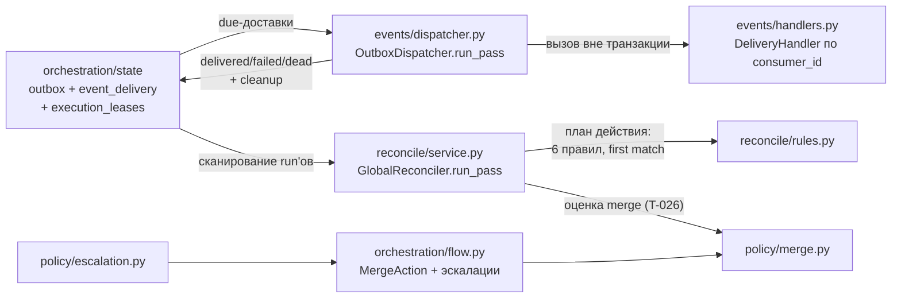
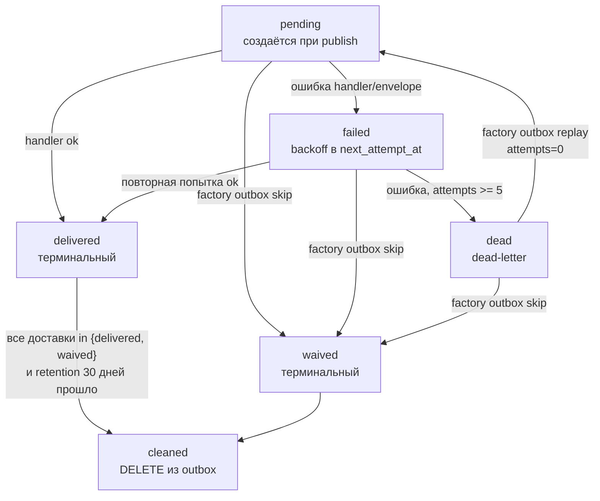
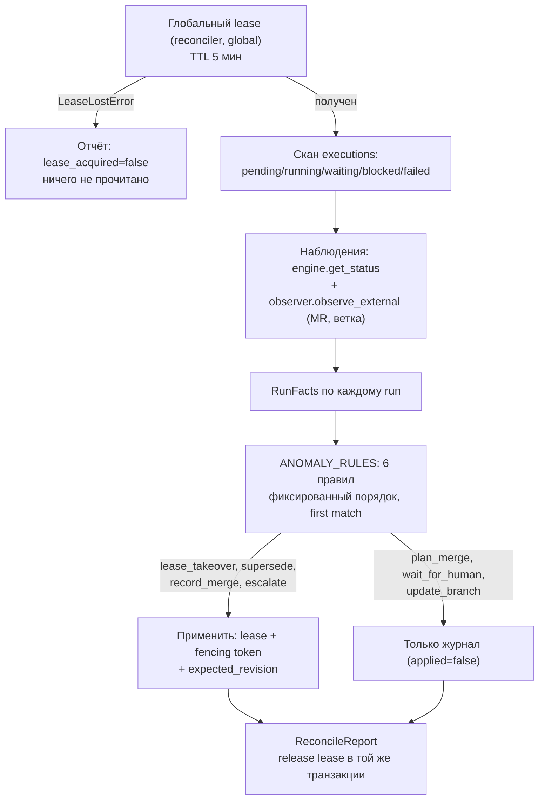

# Эксплуатационные подсистемы — events, reconcile, policy

**Исходники:** [`orchestration/events/`](../../src/dark_factory/orchestration/events/), [`orchestration/reconcile/`](../../src/dark_factory/orchestration/reconcile/), [`orchestration/policy/`](../../src/dark_factory/orchestration/policy/)

**Главный потребитель:** CLI [`cli/outbox.py`](../../src/dark_factory/cli/outbox.py) и [`cli/reconcile.py`](../../src/dark_factory/cli/reconcile.py) — те же проходы выполняют CronJob'ы (`deploy/events/`); для `policy` — [`orchestration/flow.py`](../../src/dark_factory/orchestration/flow.py) (эскалации и `MergeAction`) и сам реконсилятор ([`reconcile/rules.py`](../../src/dark_factory/orchestration/reconcile/rules.py) вызывает merge policy).

## 1. Назначение

Три подсистемы закрывают эксплуатацию автономного Flow:

- **`events/`** — transactional outbox (T-028, ADR-016): упорядоченная доставка доменных событий потребителям, ретраи с backoff, dead-letter, replay/skip оператором, retention-cleanup;
- **`reconcile/`** — реконсилятор (T-063, ADR-006): периодический проход, обнаруживающий аномалии (зависший lease, дубликаты run'ов, потерянные merge) и применяющий state-level восстановление;
- **`policy/`** — чистые детерминированные правила без I/O и часов: классификация решений (ADR-018 p.6), условия эскалации (ADR-018 p.5), merge policy (T-026, ADR-011), участие человека (ADR-018 p.1), риск-классы (ADR-011 p.5).

Дисциплина общая с `rules/`: чистые функции получают `now` явным параметром, одинаковые факты дают одинаковый результат; исполнение (dispatcher, reconciler) отделено от принятия решений (rules, policy).

## 2. Events — transactional outbox (T-028, ADR-016)

### 2.1. Модели хранения

Пишущая сторона — `OutboxRepository.publish()` в [`state/repositories.py`](../../src/dark_factory/orchestration/state/repositories.py): событие и его per-consumer доставки дописываются в транзакции вызывающего кода. Читающая сторона — `DeliveryRepository` в `events/repository.py`.

Таблица `outbox` (модель `OutboxEvent`):

| Поле | Тип | Примечание |
|---|---|---|
| `event_id` | String(128), PK | Идентификатор события |
| `event_type` | String(64), index | Тип (`EventType`) |
| `event_version` | Integer | `>= 1`, по умолчанию `1` |
| `occurred_at` | DateTime(timezone=True) | Порядок резервирования начинается с него |
| `change_id`, `run_id` | String(128), index | Связь с change/run |
| `stage` | String(32), nullable | Стадия-источник |
| `aggregate_id` + `sequence` | String(128) + Integer | Unique `(aggregate_id, sequence)` — поток и порядок |
| `aggregate_version` | Integer | `>= 1` |
| `correlation_id`, `causation_id` | String(128), nullable | Трассировка причинности |
| `artifact_refs`, `payload` | JSONB | Ссылки на артефакты и полезная нагрузка |

Таблица `event_delivery` (модель `EventDelivery`): PK `(event_id, consumer_id)`; `event_id` — FK на `outbox` c `ondelete CASCADE` (cleanup уносит доставки вместе с событием); `status`, `attempts` (по умолчанию `0`), `next_attempt_at` (lease/backoff), `last_error` (String(1024)).

`DeliveryStatus` (см. `state/enums.py`): `pending`, `delivered`, `failed`, `dead`, `waived`.

### 2.2. Жизненный цикл доставки

### 2.3. Упорядоченная доставка (`events/rules.py`)

Глобальный порядок не гарантируется; порядок держится только внутри потока — `aggregate_id` (unique `(aggregate_id, sequence)`, change/run делят sequence-пространство агрегата). Механика в `DeliveryRepository.reserve_batch`:

1. кандидаты — доставки в статусе `pending`/`failed` с `next_attempt_at IS NULL OR <= now`, отсортированные по `(occurred_at, sequence, event_id, consumer_id)`, берутся под `FOR UPDATE OF event_delivery SKIP LOCKED` в короткой транзакции;
2. ordering gate — кандидату разрешено идти, только если его `sequence` равен минимальному недоставленному sequence потока (`ordering_eligible` — строгое равенство); иначе доставка откладывается (`deferred`), строка буквально не трогается;
3. зарезервированная строка получает lease: `next_attempt_at = now + LEASE_SECONDS`;
4. guard фиксации исхода `UPDATE ... WHERE status IN (pending, failed)` не перезаписывает терминальные/операторные состояния (`dead`, `waived`), появившиеся гонкой, — такой исход читается как `deferred`.

Гэп в потоке (включая `dead`) блокирует все последующие доставки потребителя, пока оператор не сделает replay или skip — осознанное MVP-ограничение: заблокированный поток занимает слоты пачки.

### 2.4. Ретраи, dead-letter, replay, cleanup

| Константа | Значение | Смысл |
|---|---:|---|
| `MAX_ATTEMPTS` | `5` | Попыток до `dead` |
| `BACKOFF_BASE_SECONDS` | `30` | База backoff (задержка перед 2-й попыткой) |
| `BACKOFF_MULTIPLIER` | `4` | Рост между ретраями |
| `BACKOFF_CAP_SECONDS` | `3600` | Потолок одной задержки |
| `LEASE_SECONDS` | `120` | Lease резервирования (дольше прохода CronJob, короче двух интервалов) |
| `DISPATCH_BATCH_SIZE` | `100` | Верхняя граница пачки за проход |
| `MAX_ERROR_LENGTH` | `1024` | Обрезка `last_error` |
| `RETENTION_DAYS` | `30` | Retention доставленных событий до cleanup |

График ретраев: 30 с → 2 мин → 8 мин → 32 мин → `dead` (на 5-й неудаче) — постоянно падающий потребитель парковается примерно за час. `backoff_delay_seconds(attempts < 1)` raises `ValueError`.

- **replay** (`DeliveryRepository.replay`): `dead`/`failed` → `pending`, сброс `attempts=0`, `next_attempt_at=None`, `last_error=None`; возвращает отсортированные пары `(consumer_id, previous_status)`.
- **skip** (`DeliveryRepository.skip`): `pending`/`failed`/`dead` → `waived` (под `FOR UPDATE`); админское решение, разблокирующее поток.
- **cleanup** (`cleanup_expired_events`): событие удаляется, только когда каждая доставка в `{delivered, waived}` **и** `occurred_at + RETENTION_DAYS <= now` (`is_cleanup_eligible`); событие без доставок — eligible; кандидаты выбираются только старше cutoff; удаление — один `DELETE`, FK-каскад уносит доставки; архивация (ADR-016 p.9) не реализована.

### 2.5. Проход диспетчера и журнал

`OutboxDispatcher.run_pass(*, now=None, cleanup=False)`:

1. резервирование пачки в короткой транзакции;
2. вызов handler'а **строго вне транзакции** — медленный потребитель никогда не держит транзакцию;
3. фиксация каждого исхода в своей короткой транзакции;
4. опциональный cleanup отдельной транзакцией.

Исходы — журнал прохода: `DispatchReport(schema_version=1, reserved, outcomes)`; `DeliveryOutcome(event_id, consumer_id, outcome, attempts, next_attempt_at, error)` — все модели frozen pydantic, `--json` даёт стабильную сериализацию. `DeliveryOutcomeKind`:

| Исход | Кто порождает | Смысл |
|---|---|---|
| `delivered` | проход | Handler отработал; `attempts += 1` |
| `failed` | проход | Ошибка handler/envelope; `attempts += 1`, backoff |
| `deferred` | проход | Ordering gate отложил или исход проиграл гонку — строка не тронута |
| `dead` | проход | Бюджет попыток исчерпан (`attempts >= MAX_ATTEMPTS`) |
| `replayed` / `skipped` | — | Определены в модели; CLI replay/skip печатают собственные строки |
| `cleaned` | cleanup | Событие удалено; единственный event-level исход, `consumer_id = None` |

`sort_outcomes` фиксирует порядок журнала: по `event_id`, затем `consumer_id` (`None` первым).

Потребители — `DeliveryHandler` (Protocol: `async deliver(event: DomainEvent, consumer_id: str, /) -> None`), реестр `HandlerRegistry` с fallback `NoOpHandler` (только debug-лог): незарегистрированный consumer не ломает проход, реестр — точка расширения для трекер-паблишера (T-063) и консольного трекера (T-090). Контракт — **at-least-once**: crash между вызовом handler'а и фиксацией исхода повторит доставку после истечения lease; точная однократность не обещается — потребители дедуплицируют по `event_id` (внутренние — через effect ledger, ADR-006 p.3). Битый envelope в строке читается как неудача доставки (dead-letter), не abort прохода.

### 2.6. Эксплуатация

CLI [`cli/outbox.py`](../../src/dark_factory/cli/outbox.py): `factory outbox dispatch [--json] [--cleanup] [--limit N]`, `factory outbox replay --event-id ID [--consumer ID]`, `factory outbox skip --event-id ID --consumer ID`. Коды выхода: `0` — проход завершён (в т.ч. делать нечего), `1` — replay/skip-цель не найдена или не в подходящем статусе, `2` — store недоступен или невалидный ввод (`--limit < 1`); URL и текст исключений не эхосятся (ADR-009).

Манифест CronJob — [`deploy/events/outbox-dispatcher-cronjob.yaml`](../../deploy/events/outbox-dispatcher-cronjob.yaml): каждые 2 минуты (`*/2 * * * *`), `concurrencyPolicy: Forbid`, `activeDeadlineSeconds: 300`, `backoffLimit: 0`, команда `factory outbox dispatch --cleanup`, namespace `factory`, SA `factory-api`. Образ и Secret — плейсхолдеры (реальный образ T033/T042; секрет создаётся вне git).

## 3. Reconcile — реконсилятор (T-063, ADR-006)

### 3.1. Поток реконсиляции

### 3.2. Таблица аномалий → действий (`reconcile/rules.py`)

Правила (`ANOMALY_RULES`) выполняются в фиксированном порядке, first match wins, максимум одно действие на run за проход. Терминальные статусы (`succeeded`, `superseded`) не получают действий. Вход правил — `RunFacts`: PostgreSQL (желаемое состояние) плюс наблюдения engine/observer.

| № | Аномалия | Условие | Действие |
|---|---|---|---|
| 1 | `repeated_error` | Две последние попытки одной стадии обе `failed` (`_detect_repeated_error`), run в `running`/`waiting` | `escalate` → `blocked` (восстановление повторит отказ; ADR-006 p.7, ADR-018 p.5) |
| 2 | `expired_lease` | `lease.expires_at <= now` | `lease_takeover` — захват с новым монотонным fencing token (ADR-006 p.6) |
| 3 | `duplicate_runs` | Активный run не является каноническим (лексикографически минимальный id среди активных run'ов change) | `supersede` → `superseded` |
| 4 | `merged_cr_without_run` | CR `merged`, но run не `succeeded` | `record_merge` → `succeeded`, факт слияния записан (`merged_sha`) |
| 5 | `approved_passed_without_merge` | CR `open`, есть merge-контекст, run в `running`/`waiting` | Через `evaluate_merge` с `executor="trusted_finalizer"`: `finalizer_merge_allowed` → `plan_merge`; `blocked` → `escalate`; иначе `wait_for_human` |
| 6 | `branch_behind` | `branch.behind_count > 0`, run в `running`/`waiting` | `update_branch` — для provider wiring; устойчивая неудача вернётся как `repeated_error` |

### 3.3. Сервис: один идемпотентный проход (`reconcile/service.py`)

`GlobalReconciler.run_pass(*, now=None)` — вся операция в одной транзакции: захват глобального лиза, скан, мутации, release; rollback восстанавливает лиз. Двойная защита от параллельных проходов (ADR-006 p.6): K8s `concurrencyPolicy: Forbid` (только оптимизация) и lease-строка `("reconciler", "global")` в `execution_leases` — второй реконсилятор получает `lease_acquired=False` и завершается, ничего не читая.

| Константа | Значение |
|---|---|
| `RECONCILE_INTERVAL_MINUTES` | `(2, 5)` — ожидаемое окно расписания |
| `GLOBAL_LEASE_TTL` / `EXECUTION_LEASE_TTL` | `5 мин` |
| `ACTIVE_DEADLINE_SECONDS` | `300` |
| `EXECUTION_LEASE_RESOURCE_TYPE` | `"execution"` |

Применяются только state-мутации (`_ACTION_TARGETS`): `supersede → SUPERSEDED`, `record_merge → SUCCEEDED`, `escalate → BLOCKED`; `plan_merge`, `wait_for_human`, `update_branch` — journal-only (их исполнители: trusted finalizer, человек, provider wiring). Реконсилятор никогда не исполняет агентские задачи. Каждая мутация защищена дважды: (пере)захват execution-lease (живой чужой лиз → `applied=False`) и `update_status` с fencing token и `expected_revision`; доменно-невалидный переход не форсируется — остаётся в журнале до следующего прохода.

Идемпотентность: повторный проход по тем же наблюдениям ничего не меняет — захваченные лизы живы, superseded-run'ы уходят из выборки, escalated-run'ы больше не в `running`/`waiting`, записанные слияния терминальны. Webhooks — только ускоритель (ADR-019): проход не зависит от их срабатывания.

Журнал прохода — `ReconcileReport(schema_version=1, lease_acquired, owner_id, scanned, entries)`; запись на run — `RunReconciliation(run_id, change_id, desired_status, desired_revision, observed_status, in_sync, action, applied, note)`; действие — `ReconcileAction(kind, anomaly, run_id, reason, merged_sha, merge_method)` (`merged_sha` — только у `record_merge`, `merge_method` — только у `plan_merge`). Все модели frozen pydantic — `--json` сравним между проходами.

### 3.4. Дрейф CI ↔ PostgreSQL

`resolve_drift(desired, observed)` — сравнение в пользу PostgreSQL: результат всегда несёт желаемые `status`/`state_revision`; `in_sync=False` при расхождении; несовпадение `run_id` — `ValueError`. `PostgresReconciliationService` — адаптер порта `ReconciliationService` без собственного I/O. `observe_statuses` опрашивает `WorkflowEnginePort.get_status`; неизвестные run'ы просто не наблюдаются (`in_sync=None` в журнале), без engine правила PostgreSQL-источников (`expired_lease`, дубликаты, `repeated_error`) остаются рабочими.

### 3.5. Эксплуатация

CLI [`cli/reconcile.py`](../../src/dark_factory/cli/reconcile.py): `factory reconcile [--json]`; владелец лиза — из `DARK_FACTORY_RECONCILER_OWNER_ID` или уникальный `factory-reconcile-<pid>-<uuid8>`; `lease_acquired=False` — нормальный исход с exit `0`; недоступный store — exit `2`. **Манифест CronJob реконсилятора в `deploy/` отсутствует** (планируется в T040/T042) — пока проход запускается вручную через CLI.

## 4. Policy — чистые правила (T-016, T-026)

### 4.1. Классификация решений (`decision_class.py`)

`classify_decision(facts: DecisionFacts) -> DecisionVerdict`; приоритет: `new_boundary` > `pinned_by_adr` > `allowed_options` > консервативный дефолт.

| Вход | Класс | Человек | ADR | Rationale |
|---|---|---:|---:|---:|
| `pinned_by_adr=True` | `KNOWN_PATH` | нет | нет | нет |
| `allowed_options` непустые | `BOUNDED_CHOICE` | нет | нет | да |
| `new_boundary=True` или нет сигналов | `NEW_PATH` | да | да | нет |

Монотонность: агент может **повысить** класс, понизить — только формальная политика или человек (`transition_decision_class`, иначе `DecisionClassPolicyError`).

### 4.2. Риск-классы и точки контроля (`risk.py`, T-080)

Модуль — policy-поверхность риска (ADR-023). Доменные примитивы живут слоем ниже, в [`changes/risk.py`](../../src/dark_factory/changes/risk.py) (`changes` — самый нижний слой), и реэкспортируются здесь, чтобы публичная поверхность пакета не менялась:

- `RISK_ORDER` — тотальный порядок `R0 < R1 < R2 < R3 < R4`;
- `R2_THRESHOLD = R2` — порог, с которого начинаются обязательства класса;
- `is_r2_or_higher(risk)` — сравнение с порогом.

`classify_risk(facts) -> RiskClass` — детерминированный вывод класса из наблюдаемых фактов, первый совпавший уровень выигрывает: `factory_self_modification` → R4; `irreversible` или `regulated_data` → R3; непустые `boundaries` или `decision_class = NEW_PATH` → R2; `documentation_only` → R0; иначе R1 (ADR-023 п.2). Класс не самоотчёт: агент не может передать «свой» класс в обход функции.

[`effective_risk_class(declared, facts, *, route_floor)`](../../src/dark_factory/changes/risk.py) — максимум из трёх слагаемых: заявленный класс, класс из фактов и пол маршрута. Функция только повышает класс; понижение агентом запрещено (`transition_risk_class`, `RiskClassPolicyError`). Формальная политика понижения — сам пол: он не может быть опущен решением агента и определяет обязательные гейты и точки контроля.

Точки контроля (`ControlPoint`) — именованные человеческие решения, привязанные к существующему `(stage, gate)`:

| Точка | Стадия | Гейт |
|---|---|---|
| `problem` | `specification` | `specification` |
| `solution` | `planning` | `planning` |
| `ux` | `construction` | `ui` |
| `discovery_release` | `review_verification` | `review` |

`CONTROL_POINT_BINDING` — сама привязка; `required_control_points(route, stage, risk_class)` — обязательные точки тройки (единственное правило: точка обязательна тогда и только тогда, когда её гейт входит в `required_human_gates(route, stage, risk_class)`, см. [rules.md](rules.md)); `missing_control_points(route, stage, risk_class, decisions, *, sha=None)` — точки без человеческого `APPROVED`-решения, привязанного к `sha` (version-bound approval, ADR-009 п.7; `sha=None` сравнивается с непривязанным решением, поэтому approval на старом SHA точку не закрывает). `RISK_ASSESSMENT_MANUAL` удалён — ручных условий эскалации после T-080 нет.

### 4.3. Условия эскалации (`escalation.py`)

Каждая проверка — чистая функция, возвращающая `EscalationViolation` (`rule`, `reason`, `manual_assessment`) или `None`. Поле `manual_assessment` — deprecated и всегда `False` (ADR-023 п.5): после T-080 ни одно условие не является ручной оценкой; поле останется в сериализуемом контракте до ближайшей ревизии схемы записи (ADR-015 п.3). Flow ветоет автономное продолжение при нарушении, объявленном на `StageResult.escalations` (`escalation_stop_reason` склеивает нарушения через `"; "`), и дополнительно вызывает `contract_entry_violation` при входе в construction, `route_allows_risk` на каждом продвижении стадии (полоса классов маршрута, T-080) и `autonomy_budget_violation` на каждой итерации.

| Функция | Нарушение фиксируется, когда | `EscalationRule` |
|---|---|---|
| `contract_entry_violation` | Контракт отсутствует или `approval is None` (гейт входа в construction, T-016 DoD) | `implementation_contract_unapproved` |
| `requirements_violation` | Список конфликтов требований непуст | `requirements_deficient` |
| `scope_exit_violation` | Элемент вне `scope.in_scope` | `scope_exit` |
| `boundary_change_violation` | Граница не покрыта контрактом, либо покрыта, но изменение несовместимо без утверждённого плана миграции | `boundary_change` |
| `adr_proposal_violation` | Агент предлагает новый ADR | `new_adr_proposal` |
| `risk_escalation_violation` | Класс ≥ R2, и не выполнено хотя бы одно обязательство класса: маршрут не допускает класс или нет человеческих решений на обязательных точках контроля стадии; `reason` перечисляет всё невыполненное | `risk_raised_to_r2` |
| `gate_failure_violation` | Неповторяемое policy-нарушение или исчерпан rework-бюджет при падающих гейтах (исправимое остаётся в bounded rework, T-014) | `unrecoverable_gate_failure` |
| `autonomy_budget_violation` | `iterations_used >= contract.budget.max_autonomous_iterations` | `autonomy_budget_exhausted` |
| `ui_verification_violation` | UI не подтверждается автоматически | `ui_unverifiable` |
| `irreversible_operation_violation` | Запрошена необратимая операция | `irreversible_operation` |

`risk_escalation_violation(*, risk_class, route, stage, decisions=(), sha=None)` ниже R2 молчит — обязательства класса возникают только с R2 (ADR-023 п.5), поэтому для R0/R1 поведение прежнее.

`BoundaryChange(area, compatible=True, migration_plan_approved=False)`; защищённые границы `BoundaryArea`: `public_api`, `data_schema`, `iam`, `architecture_boundary`.

### 4.4. Merge policy (`merge.py`, T-026)

`MergePolicy` (замороженная конфигурация): `auto_merge_risk_classes = frozenset()` — пусто означает ручной режим (FR-010; auto-merge для отдельных классов — T-085); `merge_methods = {"squash"}` (T-032); `merge_authorization_gate = Gate.REVIEW` (ADR-011 p.2). `DEFAULT_MERGE_POLICY` = эти значения; в `flow.py` используется как `MERGE_POLICY`.

`evaluate_merge(context: MergeRequestContext, *, policy)` — фиксированный порядок проверок, первый исход выигрывает:

| Шаг | Проверка | Исход при нарушении |
|---|---|---|
| 1 | `executor == "agent"` | `blocked` (FR-004, FR-023: у агентских задач нет права на merge) |
| 2 | `expected_sha`/`head_sha` неизвестны или различаются | `blocked` (FR-011) |
| 3 | Гейты не satisfied на финальном SHA — участвуют только результаты с `sha == expected_sha` | `blocked` (T-032: новый SHA инвалидирует прошлые проходы, ADR-009 p.7) |
| 4 | Для R2+ обязательные точки контроля класса не имеют человеческого approval на финальном SHA (`missing_control_points`) | `blocked` с перечнем отсутствующих точек (ADR-023 п.4/п.5) |
| 5 | Нет человеческого решения на гейте merge, привязанного к финальному SHA, либо последнее — не `APPROVED` | `manual_merge_required` (version-bound approval, ADR-009 p.7; решения `policy`/`agent` не считаются) |
| 6 | `executor == "human"` | `human_merge_authorized` |
| 7 | `executor == "trusted_finalizer"` и `risk_class` в `auto_merge_risk_classes` | `finalizer_merge_allowed` + `merge_method` (`"squash"`, когда метод ровно один) |
| 8 | Иначе | `manual_merge_required` |

Шаг 4 действует только для R2+: ниже R2 точки контроля не запрашиваются, и отсутствие approval остаётся ожиданием человека (`manual_merge_required`), как раньше (T-080).

Проводка в Flow: на `MergeAction` контекст якорится к run — `route=run.route`, `stage=result.stage`, `gate_results=result.gate_results` (вызывающий не может расширить/сузить набор гейтов); без контекста политика не вызывается вовсе — ручной режим. `blocked` → `StopAction(blocked)`; `manual_merge_required` → `WaitForInputAction`, run в `WAITING` до человеческой авторизации на финальный SHA.

**Branch protection** ([`rules/merge_protection.py`](../../src/dark_factory/rules/merge_protection.py), T-032) — provider-side аналог: `protected_branch=True`, `required_approving_reviews=1`, `required_status_checks=True`, `allowed_merge_methods={"squash"}`, `dismiss_stale_approvals=True`. `protection_violations(observed, policy)` детерминированно возвращает до одного нарушения на правило: `branch_not_protected`, `insufficient_required_approvals`, `required_checks_missing`, `non_squash_merge_allowed`, `stale_approvals_not_dismissed`.

### 4.5. Участие человека (`participation.py`)

`PHASE_PARTICIPATION` — дословная таблица ADR-018 p.1 (9 фаз): problem/requirements, UX/UI, architecture, merge, prod — `human_in_the_loop`; implementation_planning, quality/security — `human_on_the_loop`; coding, deploy_to_dev — `human_off_the_loop`.

Проекция на стадии Flow (`STAGE_PARTICIPATION`):

| Stage | Режим |
|---|---|
| `specification`, `planning`, `review_verification` | `human_in_the_loop` |
| `construction`, `release` | `human_off_the_loop` |

Человеческие гейты Flow — `HUMAN_GATES = {specification, review}` в [`rules/gates.py`](../../src/dark_factory/rules/gates.py) (реэкспортируется из `flows/routes.py`): базовый набор, не зависящий от маршрута (ADR-018). Риск-класс расширяет его — `rules.gates.required_human_gates(route, stage, risk_class)` (T-080, ADR-023 п.3): с R2 человеческим становится и `planning`, с R3/R4 — каждый требуемый гейт стадии. Planning остаётся in-the-loop и через эскалации (например, новый ADR), но с R2 его подтверждение — уже обязательное решение.

## 5. Граничные случаи

| Случай | Поведение |
|---|---|
| Гэп в потоке (меньший sequence недоставлен, включая `dead`) | Кандидат `deferred`, строка не тронута; поток занимает слоты до replay/skip |
| `dead` в голове потока | Блокирует доставку и cleanup до replay/skip |
| Гонка: операторский replay/skip между резервированием и фиксацией | `commit_outcome` не перезаписывает `dead`/`waived`; исход читается как `deferred` |
| Crash после вызова handler'а до фиксации | Повторная доставка после lease (at-least-once); эффект один — дедупликация по `event_id` |
| Неизвестный `consumer_id` | `NoOpHandler` — проход не ломается |
| `backoff_delay_seconds(0)` / отрицательное | `ValueError` |
| Событие без доставок, старше retention | Cleanup eligible (vacuously) |
| Ровно 30 дней после `occurred_at` | Cleanup ещё eligible: `occurred_at + retention <= now` |
| Повторный проход реконсилятора по тем же данным | Ничего не меняет (идемпотентность) |
| `repeated_error` и `expired_lease` одновременно | Правило 1 выигрывает (фиксированный порядок) |
| Канонический run (лексикографический минимум) | Не суперсидится, суперсидится сосед |
| Merged CR у `succeeded`-run | Не записывается повторно |
| `approved_passed_without_merge` без merge-контекста | Правило молчит |
| Live-чужой lease или доменно-невалидный переход | Мутация не применяется: `applied=false` + note, следующая итерация |
| `lease_acquired=False` | Пустой отчёт, exit 0 — нормальный исход |
| Гейт-результат без `sha` или с другим SHA при merge | Не удовлетворяет финальный SHA → `blocked` |
| Решение не от `HUMAN`, на другом гейте или с другим `commit_sha` | Не авторизует merge |
| Последнее решение — `REJECTED`/`WAIVED` | `manual_merge_required` |
| Финализатор при дефолтной политике (пустые классы) | `manual_merge_required` — ручной режим |
| Маршрут не допускает класс изменения (R2+ на `quick`) | Продвижение стадии останавливается `StopAction(blocked)` с полосой маршрута в причине (T-080, ADR-023 п.3) |
| R2+ и нет approval на обязательной точке контроля при merge | `blocked` с перечнем точек; для R0/R1 — прежний `manual_merge_required` (ADR-023 п.5) |
| Approval привязан к старому SHA | Точку контроля не закрывает: version-bound approval (ADR-009 п.7) |
| Агент понижает decision/risk класс | `DecisionClassPolicyError` / `RiskClassPolicyError` |

## 6. Где искать проверки

- [`test_orchestration_events.py`](../../tests/test_orchestration_events.py) — таблица backoff, dead-правило, ordering-eligibility, cleanup-матрица, журнал и реестр обработчиков;
- [`test_orchestration_reconcile.py`](../../tests/test_orchestration_reconcile.py) — таблица аномалий, приоритеты правил, идемпотентность планирования, drift, наблюдение engine;
- [`test_policy_decision_class.py`](../../tests/test_policy_decision_class.py), [`test_policy_risk.py`](../../tests/test_policy_risk.py) — классификация, монотонность, привязка и обязательность точек контроля;
- [`test_changes_risk.py`](../../tests/test_changes_risk.py), [`test_rules_gates_risk.py`](../../tests/test_rules_gates_risk.py) — вывод класса из фактов, эффективный класс, полосы маршрутов и человеческие гейты (T-080);
- [`test_policy_escalation.py`](../../tests/test_policy_escalation.py) — все десять условий эскалации и общий stop-reason;
- [`test_policy_merge.py`](../../tests/test_policy_merge.py) — все исходы merge policy и предусловия;
- [`test_policy_participation.py`](../../tests/test_policy_participation.py) — таблица фаз ADR-018 и проекция на стадии;
- интеграции: [`tests/integration/test_events_dispatcher.py`](../../tests/integration/test_events_dispatcher.py), [`tests/integration/test_reconcile.py`](../../tests/integration/test_reconcile.py) — полные проходы против PostgreSQL;
- CLI: [`test_cli_outbox.py`](../../tests/test_cli_outbox.py), [`test_cli_reconcile.py`](../../tests/test_cli_reconcile.py); branch protection: [`test_rules_merge_protection.py`](../../tests/test_rules_merge_protection.py); интеграция policy с Flow: [`test_flow_policy.py`](../../tests/test_flow_policy.py).

## 7. Связанные решения

- [ADR-006](../adr/ADR-006-ephemeral-job-pods-reconciler-cronjob.md) — ephemeral job pods, CronJob-реконсилятор, лизы и fencing;
- [ADR-011](../adr/ADR-011-risk-based-merge-release-policy.md) — merge/release policy, ручной режим MVP, риск-классы;
- [ADR-023](../adr/ADR-023-risk-classes-and-control-points.md) — классы R0–R4, точки контроля, полосы маршрутов;
- [ADR-016](../adr/ADR-016-postgresql-outbox.md) — transactional outbox: доставка, порядок, dead-letter, retention;
- [ADR-018](../adr/ADR-018-human-participation-autonomous-execution.md) — участие человека по фазам, эскалации, классы решений;
- [ADR-009](../adr/ADR-009-minimal-bootstrap-otel.md) — version-bound approvals (p.7) и retention аудита.

## 8. Связь с другими модулями

- [orchestration-flow-and-state.md](orchestration-flow-and-state.md) — Flow, PostgreSQL state store, лизы/fencing: таблицы `outbox`/`event_delivery` и `execution_leases` описаны там;
- [rules.md](rules.md) — гейты и лимиты; merge policy переиспользует `unsatisfied_gates` из `rules/gates.py`;
- [cli.md](cli.md) — контракты команд `factory outbox *` и `factory reconcile`;
- [api.md](api.md) — API утверждений, привязанных к SHA (version-bound approval);
- [orchestration-execution.md](orchestration-execution.md) — внутристадийное исполнение (stages, taskgraph, rework), вокруг которого работают event/reconcile-подсистемы;
