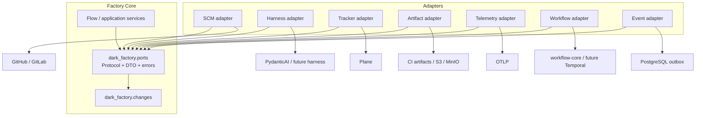
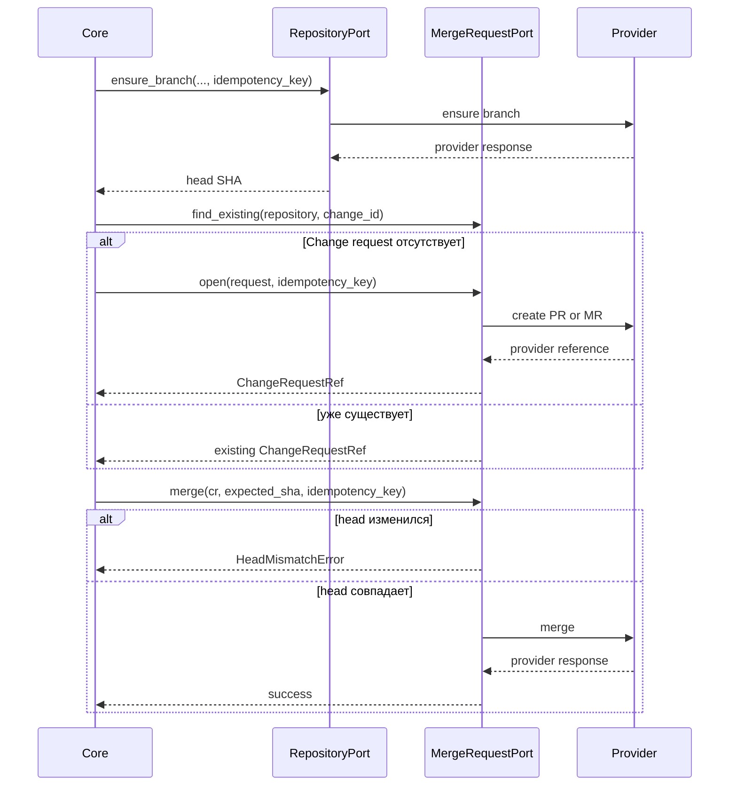
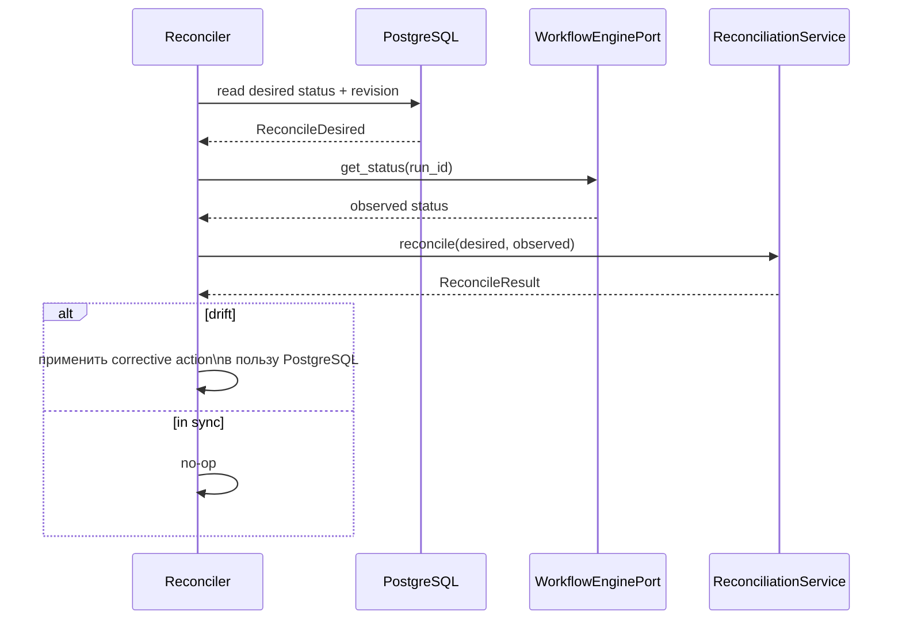
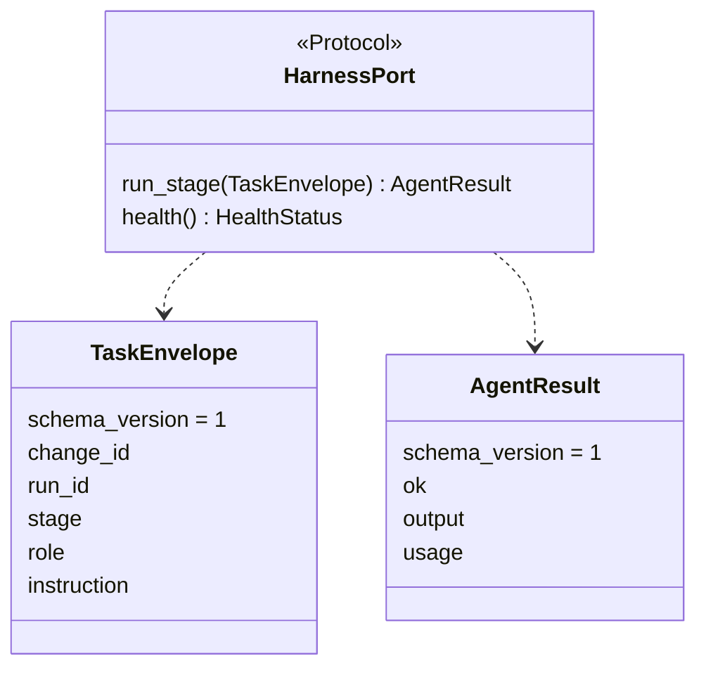

# Порты Factory Core — `ports/`

**Исходники:** [`src/dark_factory/ports/`](../../src/dark_factory/ports/)

**Реализации для тестов:** [`src/dark_factory/adapters/fakes/`](../../src/dark_factory/adapters/fakes/)

## 1. Зачем нужны порты

Factory Core следует Ports & Adapters: ядро знает **что** ему нужно от внешнего мира, но не знает **как** конкретный провайдер это делает.



Правила зависимостей:

- core не импортирует `dark_factory.adapters`;
- адаптеры импортируют контракты через единый фасад `dark_factory.ports`;
- provider SDK-типы не должны попадать в core contract;
- GitHub PR и GitLab MR представлены одним `ChangeRequestRef`;
- второй адаптер реализует тот же Protocol и проходит ту же contract-test suite.

`ports/__init__.py` реэкспортирует Protocol, DTO, ошибки и доменные типы из сигнатур, чтобы адаптерам не требовалось импортировать внутренние пакеты ядра.

## 2. Состав каталога

| Файл | Назначение |
|---|---|
| `protocols.py` | Десять runtime-checkable Protocol |
| `agents.py` | Версионированные `TaskEnvelope`, `AgentResult` |
| `common.py` | Общие provider-neutral DTO |
| `reconciliation.py` | Desired/observed/result reconcile |
| `events.py` | Типы событий и immutable event envelope |
| `errors.py` | Нормализованные port-level ошибки |
| `__init__.py` | Публичный фасад слоя |

Все Protocol помечены `@runtime_checkable`: structural compatibility можно проверить через `isinstance(adapter, Port)`. Это не заменяет поведенческие contract tests.

## 3. Каталог портов

### 3.1. `RepositoryPort`

Операции с ветками и ревизиями продукта.

```python
get_revision(repository, ref) -> str
ensure_branch(repository, branch, *, from_revision, idempotency_key) -> str
```

- `get_revision` возвращает SHA/revision ref;
- `ensure_branch` идемпотентно обеспечивает ветку от заданной revision и возвращает head.

Изменяющая операция принимает `idempotency_key`, чтобы replay job не создавал второй эффект.

### 3.2. `MergeRequestPort`

Жизненный цикл provider-neutral change request.

```python
open(request, *, idempotency_key) -> ChangeRequestRef
find_existing(repository, change_id) -> ChangeRequestRef | None
add_comment(cr, body, *, idempotency_key) -> None
merge(cr, *, expected_sha, idempotency_key) -> None
```

`OpenChangeRequest` содержит repository, factory `change_id`, source/target branches, title/description и `head_sha`.

Безопасный merge требует `expected_sha`: если head изменился, адаптер должен отказать с `HeadMismatchError`, не выполняя merge.



### 3.3. `PipelinePort`

```python
status(repository, ref) -> PipelineStatus
```

Наблюдает CI pipeline. `PipelineStatus` содержит ref, строковый status и optional URL. Документированный словарь:

```text
queued | in_progress | success | failure | canceled
```

Поле имеет тип `str`, поэтому DTO сам не валидирует этот закрытый набор; адаптер и contract tests обязаны его соблюдать.

### 3.4. `TrackerPort`

```python
get_change(external_ref) -> Change | None
publish_status(change_id, status, *, idempotency_key) -> None
request_approval(change_id, gate, *, idempotency_key) -> None
```

Интеграция с внешним tracker. По контракту недоступность tracker не должна блокировать CLI/Console, однако отдельного result/error-типа для degraded режима пока нет.

### 3.5. `HarnessPort`

```python
run_stage(envelope) -> AgentResult
health() -> HealthStatus
```

Единственная граница выполнения агентной работы. Детерминированные шаги стадии должны обходить harness.

Первый адаптер — PydanticAI, но его типы и API не должны просачиваться в core.

### 3.6. `ArtifactStorePort`

```python
put(spec) -> ArtifactRef
get(ref) -> bytes
exists(ref) -> bool
```

Хранилище тяжёлой evidence. `ArtifactSpec` содержит type, name, bytes и optional producer.

У `put()` нет отдельного idempotency key: fake использует content-addressing по SHA-256. Production adapter должен сохранить эквивалентную повторяемую семантику.

### 3.7. `TelemetryPort`

```python
span(name, **attributes) -> AbstractContextManager[Span]
record_usage(usage, **attributes) -> None
```

Единственный синхронный порт. Поддерживает корреляцию `change → run → stage → agent → tool`.

Минимальный `Span` — context manager. T-060 заменит его OTel-реализацией за тем же контрактом.

### 3.8. `WorkflowEnginePort`

```python
start(*, idempotency_key, expected_revision=None) -> str
resume(run_id, *, idempotency_key) -> str
cancel(run_id, *, idempotency_key, reason) -> None
get_status(run_id) -> RunStatus
```

Управляет жизненным циклом execution substrate. Это не `state/engine.py` и не `flow.apply_result()`:

- WorkflowEngine запускает/resume/cancel наблюдаемое исполнение;
- Flow вычисляет доменный переход;
- state store хранит authoritative desired state.

### 3.9. `ReconciliationService`

```python
reconcile(*, desired, observed) -> ReconcileResult
```

Отделён от workflow engine, потому что разные engines требуют разной recovery logic.



`ReconcileObserved.state_revision` optional: не каждый engine сообщает revision. `ReconcileResult` всегда несёт authoritative desired status/revision.

### 3.10. `EventPublisherPort`

```python
publish(event) -> None
```

Отделяет producer-а события от транспорта/outbox tables. `DomainEvent` уже содержит `event_id`, поэтому именно он служит ключом дедупликации.

Важно: атомарность `state + event` — обязанность adapter/application transaction; она не выражена параметром Python-метода.

## 4. DTO

### 4.1. Agent contract

`TaskEnvelope` и `AgentResult`:

- immutable (`frozen=True`);
- имеют `schema_version = 1`;
- добавление optional/compatible полей допустимо;
- breaking change требует новой schema version.



### 4.2. Common DTO

| DTO | Поля |
|---|---|
| `HealthStatus` | `healthy`, optional detail |
| `PipelineStatus` | ref, status, optional URL |
| `OpenChangeRequest` | repository, change ID, branches, title, description, head SHA |
| `ArtifactSpec` | type, name, bytes, producer |
| `Span` | name и mutable attributes |

### 4.3. Reconciliation DTO

Все immutable:

- `ReconcileDesired(run_id, status, state_revision)`;
- `ReconcileObserved(run_id, status, state_revision?)`;
- `ReconcileResult(run_id, in_sync, status, state_revision)`.

### 4.4. Event envelope

`DomainEvent` содержит:

- event ID/type/version/time;
- change/run/stage;
- aggregate ID/version;
- correlation/causation IDs;
- artifact refs;
- payload.

Ordering гарантируется не глобально, а только внутри одного `aggregate_id` через outbox sequence. Разные aggregates одного run общего порядка не имеют.

## 5. Ошибки

Текущая нормализованная иерархия:

```text
RuntimeError
└── PortError
    ├── HeadMismatchError
    └── RunNotFoundError
```

| Ошибка | Значение |
|---|---|
| `HeadMismatchError` | Merge запросил устаревший expected SHA |
| `RunNotFoundError` | Workflow engine не знает run ID |

Общих типов для unavailable, timeout, authentication, rate limit и generic not found пока нет. Fake adapters в некоторых случаях выбрасывают built-in `KeyError`/`ValueError`; production-код не должен предполагать более широкий нормализованный контракт, чем объявлено в `errors.py`.

## 6. Идемпотентность

State-changing операции используют один из трёх механизмов:

| Механизм | Где применяется |
|---|---|
| Явный `idempotency_key` | branch, CR, comment, tracker update, workflow start/resume/cancel |
| Content hash | artifact `put` |
| `event_id` | event publication |

Порт принимает ключ, но durable effect ledger находится в state/application слое. Сам Protocol не гарантирует хранение ключа между рестартами — это обязанность адаптера.

## 7. Правила реализации адаптера

Новый адаптер должен:

1. импортировать публичные типы из `dark_factory.ports`;
2. не возвращать provider SDK objects;
3. реализовать async/sync семантику сигнатур;
4. сохранять идемпотентность mutating methods;
5. нормализовать объявленные ошибки;
6. выполнять optimistic checks, например `expected_sha`;
7. пройти общую contract-test suite;
8. не смешивать два provider-а внутри одного run.

## 8. Текущее и целевое состояние

В HLD `SourceControlPort` — логическая группа возможностей. В коде она разложена на три независимых Protocol:

- `RepositoryPort`;
- `MergeRequestPort`;
- `PipelinePort`.

`CIPort` и `SDDPort`, перечисленные в целевой архитектуре, в текущем `ports/` ещё не реализованы и относятся к следующим задачам плана.

Концептуальные сигнатуры в старых ADR могут отличаться от текущего `protocols.py`. Для реализации source of truth — текущий Python contract и contract tests; ADR объясняет архитектурный intent.

## 9. Граничные случаи

- `PipelineStatus.status` не ограничен enum на уровне типа;
- атомарность `EventPublisherPort.publish()` с state change не выражена сигнатурой;
- provider exclusivity run-а не выражена в `WorkflowEnginePort`;
- fencing token отсутствует в `ReconciliationService` contract и обеспечивается state layer;
- fake reconcile определяет `in_sync` по status, не по revision;
- error normalization пока неполна;
- область уникальности `idempotency_key` зависит от конкретной операции/адаптера и должна быть документирована реализацией.

## 10. Где искать проверки

- `tests/test_import_boundaries.py` — направление зависимостей;
- `tests/contract/` — единый поведенческий контракт fake/production adapters;
- `src/dark_factory/adapters/fakes/` — минимальные эталонные реализации для разработки.

## 11. Связанные решения

- [ADR-002](../adr/ADR-002-python-core-stack.md) — Python/PydanticAI за `HarnessPort`;
- [ADR-006](../adr/ADR-006-ephemeral-job-pods-reconciler-cronjob.md) — workflow и reconciliation;
- [ADR-008](../adr/ADR-008-plugin-architecture-core-sdk.md) — расширяемость адаптерами;
- [ADR-015](../adr/ADR-015-repository-boundaries.md) — границы и единый фасад ports;
- [ADR-016](../adr/ADR-016-postgresql-outbox.md) — event publishing;
- [ADR-019](../adr/ADR-019-multi-provider-sc-ci-github-first.md) — GitHub/GitLab neutrality.
