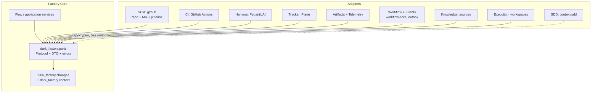
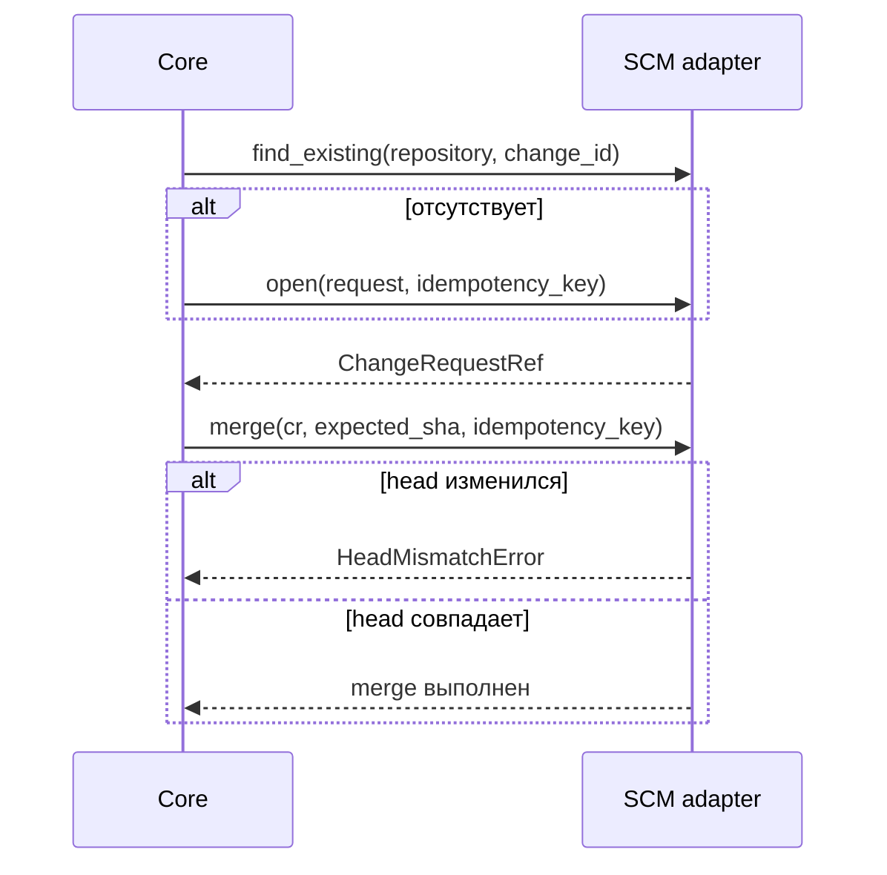
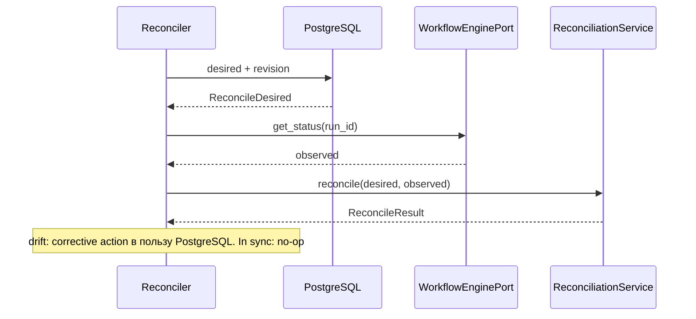

# Порты Factory Core — `ports/`

**Исходники:** [`src/dark_factory/ports/`](../../src/dark_factory/ports/)

**Реализации:** тесты — [`adapters/fakes/`](../../src/dark_factory/adapters/fakes/); продакшн — [`scm/github/`](../../src/dark_factory/adapters/scm/github/), [`harness/`](../../src/dark_factory/adapters/harness/), [`context/sdd/`](../../src/dark_factory/context/sdd/)

## 1. Зачем нужны порты

Factory Core следует Ports & Adapters: ядро знает **что** ему нужно от внешнего мира, но не знает **как** конкретный провайдер это делает. Слой фиксирует четырнадцать runtime-checkable Protocol, их DTO и нормализованные ошибки.



Правила зависимостей (проверяются `tests/test_import_boundaries.py`): core не импортирует `dark_factory.adapters` (правило A) и SDK провайдеров (правило C: `pydantic_ai`, `githubkit`, `gitlab`, `plane`, `kubernetes`, `boto3`, `minio`…); адаптеры импортируют контракты только через единый фасад `dark_factory.ports` (правило B); GitHub PR и GitLab MR представлены одним `ChangeRequestRef`, и второй адаптер проходит ту же contract-test suite; все state-changing операции принимают `idempotency_key`, один run исполняется ровно в одном провайдере.

`ports/__init__.py` реэкспортирует Protocol, DTO, ошибки и доменные типы из сигнатур: из `dark_factory.changes` (`Stage`, `Gate`, `RunStatus`, `GateResult`, `Usage`…) и из `dark_factory.context` (`ContextBundle`, `build_bundle`, `ChangeSet`, `RequirementsSnapshot`, ошибки SDD) — адаптерам не требуется импортировать внутренние пакеты ядра. Единственное исключение — адаптеры `context.sdd`, которые намеренно не импортируют `dark_factory.ports`: фасад сам реэкспортирует их ошибки (раздел 5).

## 2. Состав каталога

| Файл | Назначение |
|---|---|
| `protocols.py` | Шестнадцать runtime-checkable Protocol |
| `agents.py` | Версионированные `TaskEnvelope`, `AgentResult` |
| `common.py` | Общие provider-neutral DTO и функция `stage_gate()` |
| `context.py` | DTO для `KnowledgePort`/`ExecutionPort` (T-012) |
| `provisioning.py` | DTO провижининга репозитория: `RepositoryValidation`, `MirrorRef`, `BaselineBootstrapResult`, `AppliedPack` (T067, ADR-031) |
| `reconciliation.py` / `events.py` | Desired/observed/result reconcile; типы событий и immutable event envelope |
| `errors.py` / `__init__.py` | Нормализованные port-level ошибки; публичный фасад слоя |

Все Protocol помечены `@runtime_checkable`: structural compatibility можно проверить через `isinstance(adapter, Port)`. Это не заменяет поведенческие contract tests.

## 3. Каталог портов

### 3.1. Source control: `RepositoryPort`, `MergeRequestPort`, `PipelinePort`

```python
get_revision(repository, ref) -> str
ensure_branch(repository, branch, *, from_revision, idempotency_key) -> str
publish_commit(repository, branch, changes, /, *, message, idempotency_key) -> str
# --- MergeRequestPort ---
open(request, *, idempotency_key) -> ChangeRequestRef
find_existing(repository, change_id) -> ChangeRequestRef | None
add_comment(cr, body, *, idempotency_key) -> None
merge(cr, *, expected_sha, idempotency_key) -> None
# --- PipelinePort ---
status(repository, ref) -> PipelineStatus
```

`get_revision` возвращает SHA/revision ref; `ensure_branch` идемпотентно обеспечивает ветку от заданной revision и возвращает head. `publish_commit` публикует правки агентной стадии (TD-024): коммит и push — **один** внешний эффект с одним ключом (ADR-006 p.3); единица переноса — файловое множество (`path → bytes`), не дифф, а `WorkspaceHandle` в сигнатуре нет — SCM-адаптер не читает workspace, значения собираются через `ExecutionPort.collect_changes` и передаются по значению. Идемпотентность — replay-dedup по ключу с lookup-first по невидимому маркеру в commit message (переживает холодный адаптер); пустой `changes` — `ValueError` («нет изменений» — решение стадии), отсутствующая ветка — `KeyError`; возвращённый SHA — ревизия коммита, её стадия несёт как `head_sha` change request. `OpenChangeRequest` содержит repository, factory `change_id`, source/target branches, title/description и `head_sha`; `change_id` — ключ дедупликации через `find_existing`. Безопасный merge требует `expected_sha`: при другом head адаптер отказывает с `HeadMismatchError`, не выполняя merge. `PipelinePort` наблюдает CI pipeline; документированный словарь статусов — `queued | in_progress | success | failure | canceled`, но поле имеет тип `str`, поэтому DTO сам этот набор не валидирует.



### 3.2. `CIPort`

```python
run_stage_job(request, *, idempotency_key) -> str
gate_status(job_ref) -> GateResult
artifacts(job_ref) -> list[ArtifactRef]
```

Диспетчеризация CI-задания стадии, наблюдение его gate-результата и сбор артефактов (ADR-019 p.3). `StageJobRequest` содержит repository, `stage` (строка) и `ref` — ветку или SHA, на которых задание исполняется. Гейт задания — базовый гейт стадии из `stage_gate()`:

| Stage | Базовый гейт CI-задания |
|---|---|
| `specification` | Specification |
| `planning` | Planning |
| `construction` | Code |
| `review_verification` | Verification |
| `release` | Release |

`stage_gate(stage)` принимает строку и валидирует её через `Stage(stage)`; неизвестная стадия — `ValueError`. Полная route-политика гейтов остаётся в `rules/gates.py`: маршрут добавляет гейты, которые CI-задание не оценивает (например, UI). Адаптеры: `FakeCI` (идемпотентен по ключу — replay возвращает job ref первого вызова; незасеянное задание сообщает `pending`) и `GitHubCI`.

### 3.3. `TrackerPort`

```python
get_change(external_ref) -> Change | None
publish_status(change_id, status, *, idempotency_key) -> None
request_approval(change_id, gate, *, idempotency_key) -> None
```

Интеграция с внешним tracker (Plane, ADR-013). По контракту недоступность tracker не должна блокировать CLI/Console (FR-020); отдельного result/error-типа для degraded режима пока нет. Адаптеры: `FakeTracker` (память, идемпотентность по ключу), `NoOpTracker` (заглушка для контура без трекера, ADR-013 п.5) и `PlaneTrackerAdapter` (self-hosted Plane, T-033).

`PlaneTrackerAdapter` (пакет `adapters/tracker/`) держит конвенции, которые сигнатурой порта не выражены:

| Аспект | Решение |
|---|---|
| `external_ref` | Handle задачи в Plane — id инстанса или проектный ключ (`PLANE-42`); сегменты пути percent-кодируются |
| Пропавшая задача | 404 → `None` (такой задачи нет); недоступность (5xx, сеть) → `PlaneAPIError` — degraded режим выбирает вызывающий |
| `change_id` | Тот же handle: для tracker-задач `get_change` возвращает Plane issue id как `Change.id`, поэтому запись адресуется задаче |
| `publish_status` / `request_approval` | Комментарий к задаче: `factory status: …` и `factory approval requested: …` |
| Идемпотентность | Невидимый HTML-маркер `<!-- dark-factory:idempotency:<key> -->` в теле комментария (как у source-control адаптера); повтор с тем же ключом ничего не публикует (FR-017) |
| Риск-класс | Из label `risk:R2`; без такого label — `R1` (intake-дефолт); понижение остаётся политикой (ADR-011 п.5) |
| Webhook | `webhook.py`: HMAC-SHA256 по `<timestamp>.<body>`, окно ±300 с, дедупликация по `X-Plane-Delivery`, ротация с двумя активными секретами (ADR-013 п.6) |

Подпись покрывает timestamp, поэтому переигранный запрос нельзя «освежить» правкой заголовка; stock Plane подписывает только тело — контракт приходит из webhook-прокси перед фабрикой, а сам webhook остаётся ускорителем, не источником истины (ADR-013 п.2). Конфигурация — из окружения (`PlaneConfig.from_env`): `DARK_FACTORY_PLANE_BASE_URL`, `DARK_FACTORY_PLANE_API_KEY` (секрет), `DARK_FACTORY_PLANE_WORKSPACE_SLUG`, `DARK_FACTORY_PLANE_PROJECT_ID`, `DARK_FACTORY_PLANE_REPOSITORY_SLUG`, опционально `DARK_FACTORY_PLANE_REPOSITORY_PROVIDER` и webhook-секреты (`…_WEBHOOK_SECRET`, `…_WEBHOOK_SECRET_PREVIOUS`).

### 3.4. `HarnessPort`

```python
run_stage(envelope) -> AgentResult
health() -> HealthStatus
```

Единственная граница выполнения агентной работы; детерминированные шаги стадии должны обходить harness. Конверт закрепляет роль, скилл и снимок `ContextBundle` (раздел 4.1); пайплайн профилей живёт в `dark_factory.agents`. Продакшн-адаптер — `PydanticAIHarness`; его типы не просачиваются в core.

### 3.5. `ArtifactStorePort` и `TelemetryPort`

```python
put(spec) -> ArtifactRef
get(ref) -> bytes
exists(ref) -> bool
# --- TelemetryPort ---
span(name, **attributes: str) -> AbstractContextManager[Span]
record_usage(usage, **attributes: str) -> None
```

`ArtifactStorePort` — хранилище тяжёлой evidence; `ArtifactSpec` содержит `artifact_type`, `name`, `content: bytes` и optional `producer`. У `put()` нет отдельного idempotency key: fake использует content-addressing по SHA-256, production adapter обязан сохранить эквивалентную повторяемую семантику.

`TelemetryPort` — единственный синхронный порт; поддерживает корреляцию `change → run → stage → agent → tool → CI job → deployment`, атрибуты типизированы строками. `Span` остаётся value-объектом порта и context manager'ом: адаптер `OtlpTelemetryAdapter` (T-060, `adapters/telemetry`) отдаёт вызывающему именно его, а OTel-span живёт под ним, поэтому типы провайдера в core не просачиваются. Корреляция держится на вложенности: каждый `span(...)` открывает текущий OTel-span, поэтому вложенный span становится ребёнком предыдущего без передачи id.

`record_usage` пишет usage/cost отдельным короткоживущим span'ом `factory.usage` — ребёнком текущего span'а (AI-вызова или стадии) — с атрибутами `usage.prompt_tokens`, `usage.completion_tokens`, `usage.total_tokens`, `usage.cost`; без активного span'а запись не теряется. Политика экспорта (T-060): по умолчанию job logs (stdout), опционально JSON-lines artifact (`DARK_FACTORY_TELEMETRY_EXPORTER=file` + `DARK_FACTORY_TELEMETRY_FILE`); внешний OTLP-backend — вне MVP (TD-003). Сбой экспортёра деградирует телеметрию, но не роняет пайплайн. Вызывающий обязан не передавать в имена и атрибуты секреты и персональные данные (ADR-009 п.8).

### 3.6. `WorkflowEnginePort` и `ReconciliationService`

```python
start(*, idempotency_key, expected_revision=None) -> str
resume(run_id, *, idempotency_key) -> str
cancel(run_id, *, idempotency_key, reason) -> None
get_status(run_id) -> RunStatus
# --- ReconciliationService ---
reconcile(*, desired, observed) -> ReconcileResult
```

Управляет жизненным циклом execution substrate; это не `state/engine.py` и не `flow.apply_result()`: engine запускает/resume/cancel наблюдаемое исполнение, Flow вычисляет доменный переход, state store хранит authoritative desired state. Reconciliation отделён от engine, потому что разные engines требуют разной recovery logic.



`ReconcileObserved.state_revision` optional: не каждый engine сообщает revision; `ReconcileResult` всегда несёт authoritative desired status/revision.

### 3.7. `EventPublisherPort`

```python
publish(event) -> None
```

Отделяет producer-а события от транспорта/outbox tables; `DomainEvent` уже содержит `event_id` — он служит ключом дедупликации. Атомарность `state + event` — обязанность adapter/application transaction; она не выражена параметром Python-метода.

### 3.8. `KnowledgePort`, `ExecutionPort`, `SDDPort`

```python
collect(request) -> ContextBundle
# --- ExecutionPort ---
prepare_workspace(request, *, idempotency_key) -> WorkspaceHandle
write_file(workspace, path, content, *, idempotency_key) -> None
run_command(workspace, argv, *, idempotency_key) -> ExecutionResult
collect_evidence(workspace, path, *, idempotency_key) -> EvidenceFile
collect_changes(workspace, /, *, idempotency_key) -> Mapping[str, bytes]
# --- SDDPort ---
create_change(change) -> str
read_requirements(change_id) -> RequirementsSnapshot
apply_delta(change_id, *, expected_revision) -> str
```

`KnowledgePort` собирает источники контекста изменения в версионированный `ContextBundle` (T-012, FR-001); вход — `ContextRequest(change_id, run_id)`. Порт сознательно минимален: поиск и traversal источников придут вместе с реальными source providers, не раньше (YAGNI). В P0 реализация — `FakeKnowledge`: seed-хранилище, sha256 по содержимому, фиксированный `retrieved_at`; пустой bundle — валидный детерминированный результат, а не ошибка. `ExecutionPort` — изолированный worktree от закреплённой ревизии, запись файлов, исполнение команд и сбор evidence (T-012): `prepare_workspace` идемпотентен по ключу (replay возвращает тот же handle, FR-017), `write_file` — write-половина `collect_evidence` (T-092 S2), `collect_evidence` возвращает файл с sha256-хешем содержимого, `collect_changes` — read-половина публикации (TD-024): копия текущего файлового множества workspace для `RepositoryPort.publish_commit`. Роль `idempotency_key` различается по методам (см. §6): replay-дедуп — только у `prepare_workspace`; `write_file` идемпотентен по состоянию, а у `run_command`/`collect_evidence`/`collect_changes` ключ — только адрес в effect ledger/аудите. В P0 реализация — `FakeExecution` (результат команды детерминирован по `argv`, evidence из seed-файлов); реальный worktree-адаптер появится позже.

`SDDPort` — жизненный цикл ChangeSet над product baseline, Native SDD Core (ADR-020 p.8). Адаптеры: `NativeChangeSetAdapter` (основной), `SpecKitAdapter` (bootstrap-импорт legacy-артефактов `specs/`), `OpenSpecAdapter` (compatibility import/export). Все три реализуют Protocol **структурно** из `dark_factory.context.sdd` и не импортируют `dark_factory.ports` — runtime-checkable валидация работает и без этого импорта. `apply_delta` оптимистична: `expected_revision` закрепляет baseline, расхождение — `BaselineMismatchError` с expected/actual.

### 3.9. `RepositoryProvisioningPort`

```python
validate(repository) -> RepositoryValidation
ensure_mirror(repository, *, idempotency_key) -> MirrorRef
bootstrap_baseline(repository, *, packs, idempotency_key) -> BaselineBootstrapResult
```

Подготовка репозитория продукта до того, как его коснётся стадия агента (T067–T069, ADR-031). Два адаптера за одним портом (ADR-031 p.2): `LocalMirror` — операторское локальное зеркало под `DARK_FACTORY_WORKSPACE_MIRROR_ROOT` (раскладка `<root>/<provider>/<slug>` — та же, что у `WorktreeExecution`; T067) и `ProviderClone` — клон с провайдера на installation-токене GitHub App без PAT (T068). `validate` — read-only проба без ключа и без мутаций (p.5): `UNAVAILABLE`, `EMPTY` (unborn HEAD — штатный случай), `BASELINE_ABSENT`/`BASELINE_CURRENT` по наличию `.factory/product` (ADR-020) в HEAD (`BASELINE_STALE` зарезервирован и адаптерами не выставляется — TD-038). `ensure_mirror` — replay-дедуп по ключу, отсутствующий репозиторий — `KeyError`. `bootstrap_baseline` — применение паков (T069): реализован на `ProviderClone` (см. ниже), а адаптер без этой возможности бросает `ProvisioningOperationUnsupportedError` с именем операции, а не сообщает о невыполненном bootstrap (p.6). Реализация T067 — `LocalMirror` + `FakeRepositoryProvisioning`; согласие раскладки с `WorktreeExecution` пинится `tests/test_adapters_provisioning.py` (адаптер не может импортировать ядро мимо `dark_factory.ports`).

Реализация T068 — `ProviderClone` (`adapters/scm/github/provisioning.py`; git-хост — `DARK_FACTORY_GITHUB_CLONE_URL`, по умолчанию `https://github.com`, отдельно от REST-адреса `DARK_FACTORY_GITHUB_API_URL`). Аутентификация — installation-токен существующего GitHub App контура (`GitHubAppAuth`, инжектируемые `token_provider`/`transport`), PAT не вводится; токен уходит git **только** через окружение дочернего процесса (`GIT_CONFIG_KEY_0` = `http.<clone_base_url>/.extraheader`, `GIT_CONFIG_VALUE_0` = `AUTHORIZATION: basic base64("x-access-token:<token>")`, `GIT_TERMINAL_PROMPT=0`), поэтому его нет ни в argv, ни в URL, а stderr git отбрасывается: отсутствие App-кредов (`GitHubAuthError`), отвергнутый токен и репозиторий вне установки App дают fail-closed диагностику без эха секрета (ADR-009). `validate` — read-only проба: `tempfile`-bare-клон `--depth=1 --single-branch` не мутирует ни репозиторий, ни локальное зеркало, и, в отличие от `git ls-remote --symref` (тот получает `unborn HEAD symref-target`, но не печатает его), сохраняет `default_branch` у `EMPTY`. `ensure_mirror` — клон или `git fetch --prune origin` в `<root>/<provider>/<slug>` с replay-дедупом по ключу. Contract-сюита параметризована `fake | local_mirror | provider_clone` и проходит через loopback-эмулятор git smart-HTTP (`tests/contract/git_http_api.py` поверх `git http-backend`); пин раскладки и обработки кредов — `tests/test_adapters_provider_clone.py`.

**`bootstrap_baseline` (T069).** Реализуется на `ProviderClone`: канонический Product Baseline принадлежит продуктовому репозиторию (ADR-020 п.3), а провайдерский доступ есть только у клона; `LocalMirror` сохраняет `ProvisioningOperationUnsupportedError` (ADR-031 p.2/p.6). Паки — данные из необязательного корня `DARK_FACTORY_PACKS_ROOT` (без него клон/валидация работают, а bootstrap падает fail-closed; заданный криво (пусто/относительно) — `ValueError` с именем переменной без значения). Адаптер берёт пак по имени (`<root>/<name>`), строго читает его манифест `pack.yaml` (`dark-factory.dev/pack/v1`, непустой `name`, SemVer `version`, а при наличии `id` он обязан называть пак) — иначе `PackLoadError`/`ValueError`, называющий пак, — и переносит поддерево `baseline/` в корень репозитория как `.factory/` (конвенция «`baseline/` → `.factory/`»: README пака + общий загрузчик `adapters/provisioning/packs.py`); прочие объявленные содержимые пака (`changeset/`) — шаблоны, не payload bootstrap. Механика: путь `ensure_mirror` (clone/fetch) → выравнивание рабочего зеркала на текущую вершину ветки по умолчанию провайдера (`git reset --hard origin/<default>`; на несозданной удалённой ветке — пропуск) → запись payload в рабочее дерево → `git add --all --force` (ставит в индекс и игнорируемый `.factory/`) → коммит → `git push origin HEAD:refs/heads/<default>` → сверка фактической вершины ветки у провайдера (`git ls-remote`) с заявленной ревизией. Токен попадает в git только через окружение дочернего процесса (инвариант T068: не argv и не URL), в agent-поды credentials не уходят (p.7). Пустой репозиторий (unborn HEAD) — штатный случай: bootstrap создаёт первый коммит (p.4). Идемпотентность двойная: replay по `idempotency_key` (тот же ключ → та же ревизия, FR-017) и физический no-op — payload не поставил ни одного изменения **при наличии `.factory/product` в HEAD**: коммит не создаётся, а evidence — паки, записанные в subject существующего коммита baseline (`bootstrap: apply name@version, …`), причём baseline, созданный не bootstrap'ом, не даёт ни одного пака. Если изменений нет, а baseline в HEAD отсутствует, bootstrap падает fail-closed, а не выдаёт чужую ревизию за readiness. Bootstrap не является механизмом апгрейда baseline (смена версии манифеста без изменения содержимого — тот же no-op), `BASELINE_STALE` остаётся зарезервированным словарём (TD-038). Результат — evidence, а не сообщение (p.6): `BaselineBootstrapResult(repository, revision, applied_packs)`.

## 4. DTO

### 4.1. Agent contract

| Контракт | Поля |
|---|---|
| `TaskEnvelope` | `schema_version = 1`, `change_id`, `run_id`, `stage`, `role`, `instruction`, `skill_id?`, `bundle_hash?` |
| `AgentResult` | `schema_version = 1`, `ok`, `output = ""`, `usage?` |

Оба immutable (`frozen=True`) pydantic-модели с `AGENTS_SCHEMA_VERSION = 1` (`AgentSchemaVersion = Literal[1]`): добавление optional-полей сохраняет версию, breaking change требует новой. T-011 добавил `skill_id` и `bundle_hash` аддитивно (ADR-007): конверт закрепляет роль, скилл и снимок `ContextBundle` (FR-001); минимальные envelope остаются валидными.

### 4.2. Common и context DTO

| DTO | Поля |
|---|---|
| `HealthStatus` (dataclass) | `healthy`, optional `detail` |
| `PipelineStatus` (dataclass) | `ref`, `status`, optional `url` |
| `OpenChangeRequest` | repository, change_id, source/target branches, title, description?, head_sha |
| `StageJobRequest` | repository, `stage: str`, `ref` |
| `ArtifactSpec` | `artifact_type`, `name`, `content: bytes`, producer? |
| `Span` (dataclass) | `name`, mutable `attributes: dict[str, str]` |
| `ContextRequest` | `change_id`, `run_id` |
| `WorkspaceRequest` | `repository: RepositoryRef`, `revision`, `change_id` |
| `WorkspaceHandle` | `workspace_id`, `repository`, `revision` |
| `ExecutionResult` | `ok`, `exit_code`, `stdout = ""`, `stderr = ""` |
| `EvidenceFile` | `path`, `content_hash` (sha256), `content: bytes` |

`HealthStatus`, `PipelineStatus`, `Span` — dataclasses (первые два frozen), остальные — frozen pydantic-модели; `Span` совместим с `with port.span(...) as span:` и на `__exit__` ничего не записывает; context-DTO живут в `ports/context.py` и обслуживают `KnowledgePort`/`ExecutionPort`.

### 4.3. `ContextBundle`

Доменный тип из `dark_factory.context.bundle`, реэкспортируемый фасадом: `ContextSource(kind, location, revision?, content_hash, retrieved_at)`; `SourceKind`: `repo`, `spec`, `constitution`, `adr`, `engineering_pack`, `evidence` — один `spec` закрывает `specs/` до T-020 и `openspec/` после, их различает `location`; сам `ContextBundle(schema_version = 1, change_id, run_id, sources: tuple, bundle_hash)`.

`build_bundle(*, change_id, run_id, sources)`: отвергает точный дубликат — совпадение identity `(kind, location, revision, content_hash)` даже при другом `retrieved_at` — как `ValueError`, а не молчаливое слияние; нормализует `sources` в канонический порядок; считает `bundle_hash` как sha256 канонической сериализации отсортированных identity, `retrieved_at` в hash не входит. Равные входы всегда дают равный bundle — воспроизводимость DoD T-012.

### 4.4. Reconciliation и SDD DTO

- `ReconcileDesired(run_id, status, state_revision)`, `ReconcileObserved(run_id, status, state_revision?)`, `ReconcileResult(run_id, in_sync, status, state_revision)` — все immutable;
- `ChangeSet` (из `context.sdd.normalized`) — агрегат: `manifest` плюс опциональные `delta`, `documents`, `tasks`, `verification`, `evidence`, `reconciliation`;
- `RequirementsSnapshot(change_id, baseline_revision, requirements)` — результат `read_requirements`; каждая `RequirementEntry` несёт `id`, `operation` и опциональные `artifact`/`superseded_by`.

### 4.5. Event envelope

`DomainEvent` содержит event ID/type/version/time; change/run/stage; aggregate ID/version; correlation/causation IDs; artifact refs; payload. `EventType` (девять значений): `change.intaken`, `run.started`, `run.stage_completed`, `run.status_changed`, `gate.evaluated`, `approval.recorded`, `merge.completed`, `release.completed`, `usage.recorded`. Ordering гарантируется не глобально, а только внутри одного `aggregate_id` через outbox sequence — разные aggregates одного run общего порядка не имеют.

### 4.6. Provisioning DTO

| DTO | Поля |
|---|---|
| `RepositoryValidation` | `repository`, `state: RepositoryState`, `default_branch?`, `head_revision?` |
| `MirrorRef` | `repository`, `location`, `default_branch?`, `head_revision?` |
| `AppliedPack` | `name`, `version` |
| `BaselineBootstrapResult` | `repository`, `revision`, `applied_packs: tuple[AppliedPack, ...]` |

`RepositoryState` — `StrEnum`: `unavailable`, `empty`, `baseline_absent`, `baseline_current`, `baseline_stale`. Все модели frozen; `RepositoryValidation` — read-only снимок (ADR-031 p.5), `BaselineBootstrapResult` — evidence провижининга (p.6). `AppliedPack(name, version)` — имя и SemVer-версия из манифеста (`pack.yaml`) применённого пака (T069). Replay по тому же `idempotency_key` возвращает запись первого вызова; физический no-op под новым ключом возвращает паки, записанные в коммите baseline (пустой кортеж, если baseline создан не bootstrap'ом), — evidence не повторяет запрос вызывающего.

## 5. Ошибки

Текущие иерархии (GitHub-адаптер дополняет PortError-иерархию собственным `GitHubAPIError`):

```text
RuntimeError
└── PortError
    ├── HeadMismatchError
    ├── RunNotFoundError
    ├── ProvisioningOperationUnsupportedError
    └── GitHubAPIError          (только adapters/scm/github/client.py)

Exception
└── SDDError                    (dark_factory/context/sdd/errors.py)
    ├── ChangeNotFoundError
    ├── BaselineMismatchError
    ├── MissingArtifactError
    └── FrontmatterError
```

| Ошибка | Значение |
|---|---|
| `HeadMismatchError` | Merge запросил устаревший expected SHA |
| `RunNotFoundError` | Workflow engine не знает run ID |
| `ProvisioningOperationUnsupportedError` | Адаптер провижининга не умеет операцию (несёт `operation`); сообщать о невыполненном bootstrap запрещено (ADR-031 p.6) |
| `ChangeNotFoundError` | Нет ChangeSet с запрошенным id под factory root |
| `BaselineMismatchError` | Baseline на диске не совпал с ожидаемой ревизией; несёт expected/actual |

Фасад реэкспортирует только `ChangeNotFoundError` и `BaselineMismatchError`; иерархия SDD порождается от `Exception` напрямую, потому что адаптеры `context.sdd` не импортируют `dark_factory.ports` (раздел 1). Общих типов для unavailable, timeout, authentication, rate limit и generic not found пока нет. Fake adapters в ряде случаев выбрасывают built-in `KeyError`/`ValueError`; production-код не должен предполагать более широкий нормализованный контракт, чем объявлен в `errors.py`.

## 6. Идемпотентность

State-changing операции используют один из четырёх механизмов:

| Механизм | Где применяется |
|---|---|
| Явный `idempotency_key` | branch, commit (publish, replay-дедуп lookup-first по маркеру в message — TD-024), CR, comment, tracker update, CI job dispatch, workspace prepare (replay-дедуп), mirror ensure и baseline bootstrap провижининга (replay-дедуп; у bootstrap физический no-op — когда payload не поставил изменений, а `.factory/product` уже есть в HEAD, и тогда evidence берётся из коммита baseline, а не из запроса), workflow start/resume/cancel |
| Content hash | artifact `put` |
| `expected_revision` | SDD `apply_delta` — optimistic concurrency |
| `event_id` | event publication |

`run_command`/`collect_evidence`/`collect_changes` принимают ключ по контракту, но он служит **только адресом в effect ledger/аудите**: они обязаны исполнять/читать **текущее** состояние workspace и никогда не возвращать результат, закэшированный по ключу. Причина — цикл агента «правка → прогон тестов → правка → прогон тестов»: инструменты шлют стабильный ключ на прогон, и дедуп по ключу вернул бы первый (падающий) результат навсегда. Поэтому replay-дедуп по ключу обязателен только для `prepare_workspace` (минт внешнего ресурса) и `publish_commit` (минт коммита), а `write_file` идемпотентен **по состоянию** (last write wins на пути) и не должен пропускаться по ключу. Порт принимает ключ, но durable effect ledger находится в state/application слое; сам Protocol не гарантирует хранение ключа между рестартами — это обязанность адаптера.

## 7. Правила реализации адаптера

Новый адаптер должен:

1. импортировать публичные типы из `dark_factory.ports` (исключение — структурные адаптеры `context.sdd`, раздел 3.8);
2. не возвращать provider SDK objects;
3. реализовать async/sync семантику сигнатур — все порты, кроме `TelemetryPort`, async;
4. сохранять идемпотентность mutating methods и нормализовать объявленные ошибки;
5. выполнять optimistic checks, например `expected_sha` или `expected_revision`;
6. пройти общую contract-test suite;
7. не смешивать два provider-а внутри одного run.

## 8. Текущее и целевое состояние

В HLD `SourceControlPort` — логическая группа возможностей; в коде она разложена на три независимых Protocol (`RepositoryPort`, `MergeRequestPort`, `PipelinePort`), а исполнение CI-заданий вынесено в отдельный `CIPort`. `CIPort` и `SDDPort`, ранее относившиеся к следующим задачам плана, теперь формализованы и реализованы: `CIPort` — `FakeCI` и `GitHubCI`; `SDDPort` — адаптеры `context.sdd`. `KnowledgePort` и `ExecutionPort` пока закрыты фейками P0; реальные source providers и worktree-адаптер появятся в следующих задачах. `TrackerPort` уже закрыт реальным провайдером: `PlaneTrackerAdapter` (T-033) рядом с `NoOpTracker` и `FakeTracker`. `TelemetryPort` тоже закрыт реальным провайдером: `OtlpTelemetryAdapter` (T-060) рядом с `FakeTelemetry`; подключение адаптера к стадиям и Flow — следующая задача, как и внешний OTLP-backend (TD-003). Сигнатуры 1:1 с [`specs/001-dark-factory-mvp/contracts/ports.md`](../../specs/001-dark-factory-mvp/contracts/ports.md); концептуальные сигнатуры в старых ADR могут отличаться от текущего `protocols.py`: для реализации source of truth — текущий Python contract и contract tests, ADR объясняет архитектурный intent.

## 9. Граничные случаи

| Случай | Поведение |
|---|---|
| `PipelineStatus.status` | не ограничен enum на уровне типа |
| `StageJobRequest.stage` | строка, не `Stage`: `stage_gate` кидает `ValueError` на неизвестную стадию |
| `publish()` вместе с state change | атомарность не выражена сигнатурой |
| Provider exclusivity run-а | не выражена в `WorkflowEnginePort` |
| Fencing token | отсутствует в `ReconciliationService`, обеспечивается state layer |
| Fake reconcile | определяет `in_sync` по status, не по revision |
| Error normalization | неполна; fakes кидают built-in `KeyError`/`ValueError` |
| Пустой `ContextBundle` | валидный воспроизводимый результат (`sources == ()`) |
| Дубликат источника в `build_bundle` | `ValueError`, даже если отличается только `retrieved_at` |
| `KnowledgePort` | без поиска и traversal — минимальность по YAGNI |
| `FakeExecution.run_command`/`collect_evidence` | детерминированные чтения, replay ledger не ведётся |
| Область уникальности `idempotency_key` | зависит от операции/адаптера, документируется реализацией |
| `publish_status`/`request_approval` к несуществующей задаче | `PlaneAPIError` (404): реальный tracker не принимает запись в никуда, `FakeTracker` допускает любой id; сюита сидит задачу самим binding'ом |

## 10. Связь с другими модулями

| Документ | Связь |
|---|---|
| [context.md](context.md) | `ContextBundle`, `ContextSource` и Native SDD Core — доменные типы за `KnowledgePort`/`SDDPort` |
| [agents.md](agents.md) | Роли, скиллы и профили, которые `TaskEnvelope` передаёт в `HarnessPort` |
| [orchestration-flow-and-state.md](orchestration-flow-and-state.md) | Application services и state store — потребители портов, outbox, effect ledger |

## 11. Где искать проверки

- `tests/test_import_boundaries.py` — правила A/B/C направления зависимостей;
- `tests/contract/` — пятнадцать сюит (по одной на Protocol с поведенческим контрактом; от `test_repository_port.py` до `test_sdd_port.py`, включая `test_ci_port.py`, `test_knowledge_port.py`, `test_execution_port.py`, `test_repository_provisioning_port.py`): единый поведенческий контракт fake/production adapters;
- `tests/test_adapters_provisioning.py` — `LocalMirror` и `WorktreeExecution` читают один корень зеркала и одну раскладку (пин против дрейфа, ADR-031 p.2);
- `tests/test_adapters_provider_clone.py` — `ProviderClone`: переменная и раскладка зеркала совпадают с `WorktreeExecution`, mirror минтабелен исполнителем, а installation-токен не покидает окружение дочернего процесса (пины ADR-009 и ADR-031 p.2);
- `bootstrap_baseline` (T069) — `tests/test_adapters_provider_clone.py` и контрактная сюита `tests/contract/test_repository_provisioning_port.py` (паки — реальный корень репозитория, `tests/contract/conftest.py`): раскладка `baseline/` → `.factory/`, строгий манифест и `DARK_FACTORY_PACKS_ROOT`, evidence `(revision, applied_packs)`, replay по ключу и физический no-op (паки из коммита baseline; чужой baseline — пусто), fail-closed при отсутствии изменений без baseline, выравнивание на вершину провайдера и push `HEAD:refs/heads/<default>` со сверкой `git ls-remote`, `LocalMirror` → `ProvisioningOperationUnsupportedError`;
- `tests/contract/git_http_api.py` — loopback-эмулятор git smart-HTTP (реальные bare-репозитории, installation-токен как HTTP Basic, ответы от `git http-backend`), которым сюита `test_repository_provisioning_port.py` параметризована `fake | local_mirror | provider_clone`;
- `tests/contract/plane_api.py` — in-memory эмулятор Plane REST API, которым сюита `test_tracker_port.py` параметризована `fake | plane`;
- `tests/test_plane_tracker_adapter.py`, `tests/test_plane_webhook.py` — маппинг задачи, запись комментарием, guard webhook (все негативные сценарии);
- `tests/test_telemetry_otlp_adapter.py` — восстановление цепочки трасс `change → … → deployment`, usage-корреляция, политика экспорта и изоляция сбоя экспортёра;
- `tests/test_agents_contract.py` — версионирование `TaskEnvelope`/`AgentResult`;
- `tests/test_context_bundle.py` — воспроизводимость, канонический порядок и дубликаты `ContextBundle`;
- `src/dark_factory/adapters/fakes/` — минимальные эталонные реализации для разработки.

## 12. Связанные решения

- [ADR-002](../adr/ADR-002-python-core-stack.md) — Python/PydanticAI за `HarnessPort`;
- [ADR-006](../adr/ADR-006-ephemeral-job-pods-reconciler-cronjob.md) — workflow, retries, reconciliation;
- [ADR-008](../adr/ADR-008-plugin-architecture-core-sdk.md) — расширяемость адаптерами;
- [ADR-009](../adr/ADR-009-minimal-bootstrap-otel.md) — OTel как нейтральный контракт наблюдаемости за `TelemetryPort`;
- [ADR-013](../adr/ADR-013-plane-tracker-trackerport.md) — Plane за `TrackerPort`;
- [ADR-015](../adr/ADR-015-repository-boundaries.md) — границы репозиториев и единый фасад ports;
- [ADR-016](../adr/ADR-016-postgresql-outbox.md) — event publishing через outbox;
- [ADR-017](../adr/ADR-017-unified-openspec-sdd-factory-profile.md) — единый OpenSpec/SDD-профиль фабрики (bootstrap-адаптеры `SDDPort`);
- [ADR-019](../adr/ADR-019-multi-provider-sc-ci-github-first.md) — provider-neutral SC/CI, GitHub-first;
- [ADR-020](../adr/ADR-020-native-sdd-core.md) — Native SDD Core за `SDDPort`;
- [ADR-031](../adr/ADR-031-repository-provisioning.md) — провижининг репозитория продукта: `validate`/`ensure_mirror`/`bootstrap_baseline` за `RepositoryProvisioningPort`.
