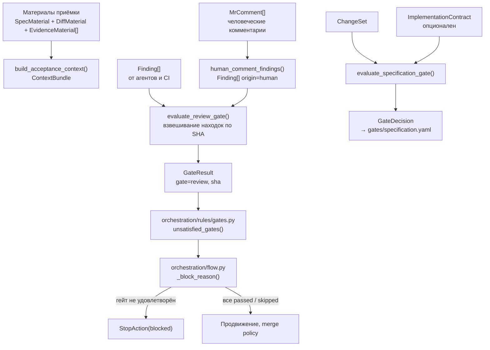
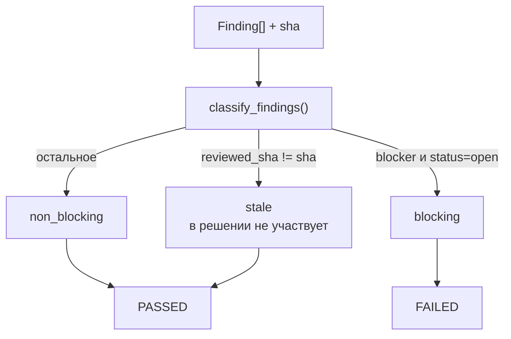
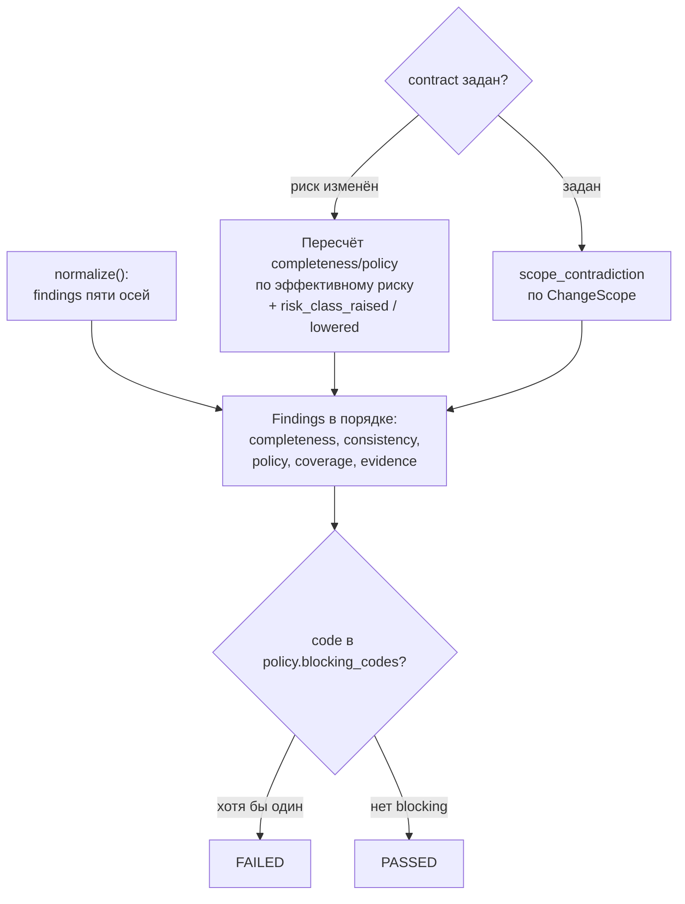

# Качество и гейты — `quality/`

**Исходники:** [quality/](../../src/dark_factory/quality/)

**Главный потребитель:** [`orchestration/rules/gates.py`](../../src/dark_factory/orchestration/rules/gates.py) — политика обязательных гейтов; решение применяет [`orchestration/flow.py`](../../src/dark_factory/orchestration/flow.py). Оценочные функции `quality` из `src/` пока не вызываются — потребители только в тестах (§6.4).

## 1. Назначение

`quality/` **вычисляет результаты проверок**. Отвечает на вопрос «какова оценка этой работы?», но не решает «можно ли продолжать» — это политика `orchestration/rules/`: она потребляет готовые результаты гейтов и говорит Flow, блокировать ли переход (детали — [rules.md](rules.md)).

| Файл | Слой | Содержание |
|---|---|---|
| `acceptance.py` | независимая приёмка (T-013, FR-006, FR-007) | сборка контекста приёмки, находки (включая человеческие комментарии как данные), review-гейт по конкретному SHA |
| `gates/specification.py` | specification-гейт (T-021, ADR-020) | детерминированные машинные проверки над нормализованным ChangeSet |
| `gates/decision.py` | запись решения (ADR-020 §12) | `GateDecision`, человеческий override, YAML-артефакт |
| `gates/__init__.py` | публичный API | экспорт всех символов гейтов |

Инварианты из докстрингов:

- чистота и детерминизм: нет harness, LLM и часов; одинаковый вход — одинаковый результат;
- приёмка не наследует контекст автора: он собирается заново из закреплённой спецификации, диффа на проверяемом SHA и собранного evidence;
- `quality` не зависит от `orchestration`: flow потребляет гейты, а не наоборот. Порядок классов риска скопирован из `orchestration.policy.risk` осознанно — границы импортов важнее DRY.

Общий словарь находок и результатов — `changes/findings.py`:

| Тип | Ключевые поля | Роль |
|---|---|---|
| `Finding` | `id`, `origin` (agent/human/ci), `severity` (blocker/major/minor/info), `status` (open/resolved/waived/obsolete), `reviewed_sha`, `file`/`line`, `confidence` (0.0–1.0), `evidence_ids` | находка ревью; блокирующий вес решает гейт, `confidence` его не меняет |
| `GateResult` | `gate`, `status`, `sha`, `summary`, `evidence_ids` | результат одного гейта, оценённого на финальном SHA (ADR-019 p.3) |
| `Decision` | `id`, `gate`, `outcome`, `decided_by`, `decided_at`, `commit_sha` | решение approval; `commit_sha` привязывает его к ревизии (FR-011) |

## 2. Общая схема



`ContextBundle` — чистый контекст, в котором работает приёмка; сам review-гейт принимает только находки.

## 3. Независимая приёмка — `acceptance.py`

### 3.1. Материалы приёмки

Все три — frozen pydantic-модели со строками `min_length=1`:

| Модель | Поля | Смысл |
|---|---|---|
| `SpecMaterial` | `location`, `revision`, `content` | закреплённая спецификация изменения (FR-003) |
| `DiffMaterial` | `repository`, `sha`, `content` | дифф, снятый на проверяемом SHA (FR-006, FR-009) |
| `EvidenceMaterial` | `evidence_id`, `location`, `content_hash` | артефакт evidence (T-012); `content_hash` — sha256-дайджест коллектора, приёмка ничего не проверяет дважды, она фиксирует провенанс |

### 3.2. `build_acceptance_context()`

```python
def build_acceptance_context(
    *, change_id: str, run_id: str, spec: SpecMaterial, diff: DiffMaterial,
    evidence: Sequence[EvidenceMaterial] = (), now: datetime | None = None,
) -> ContextBundle
```

- бандл собирается с нуля и никогда не копируется из авторского;
- `content_hash` spec и diff — sha256 их содержимого; у evidence — хэш от коллектора;
- `retrieved_at` — только bookkeeping и в `bundle_hash` не входит: одинаковые материалы дают одинаковый `bundle_hash` (тест сдвигает `now` на час — хэш совпадает); `now=None` означает `datetime.now(UTC)`;
- дубликат `evidence_id` — `ValueError` `duplicate evidence id …`: один снапшот каждого артефакта;
- типы источников: `SourceKind.SPEC`, `SourceKind.REPO`, `SourceKind.EVIDENCE`.

### 3.3. Человеческие комментарии как данные (FR-007)

`MrComment` (frozen): `comment_id`, `body` обязательны; `file`, `line` (`ge=1`), `reviewed_sha`, `evidence_id` опциональны. `body` — сырой текст обсуждения: он записывается и никогда не интерпретируется; человек блокирует merge решением approval (ADR-018), а не текстом комментария.

`human_comment_findings(comments, *, reviewed_sha) -> list[Finding]`: один комментарий — один `Finding` с `origin=human`, `severity=info`, `status=open`; `required_action` не выставляется, текст не парсится; `evidence_id` комментария попадает в `evidence_ids` находки. Комментарий со своим `reviewed_sha` сохраняет его — для следующего прохода по новому SHA он устаревает (stale).

### 3.4. Классификация находок

`REVIEW_BLOCKING_SEVERITIES: Final = frozenset({FindingSeverity.BLOCKER})` — блокирующие severity по умолчанию (T-013); переопределяется параметром `blocking_severities`.

`classify_findings(findings, *, sha, blocking_severities=REVIEW_BLOCKING_SEVERITIES) -> FindingClassification` делит находки:

| Класс | Условие |
|---|---|
| `stale` | `reviewed_sha` задан и не равен `sha` — новая ревизия инвалидирует прежнее ревью |
| `blocking` | `severity` входит в `blocking_severities` и `status is open`; resolved/waived/obsolete никогда не блокируют — зеркалит completion invariant |
| `non_blocking` | остальные применимые находки; находка без `reviewed_sha` относится к текущему ревью |

`FindingClassification` (frozen) — кортежи `Finding`: `blocking`, `non_blocking`, `stale`.

### 3.5. `evaluate_review_gate()`

```python
def evaluate_review_gate(
    findings: Sequence[Finding], *, sha: str,
    blocking_severities: frozenset[FindingSeverity] = REVIEW_BLOCKING_SEVERITIES,
) -> GateResult
```

Детерминированное взвешивание: любая blocking-находка — `FAILED`, иначе `PASSED`; `gate=Gate.REVIEW`. `sha` записывается в результат: решение действительно только для этого SHA, новая голова инвалидирует его, и проверки повторяются (FR-011). `evidence_ids` — отсортированное объединение evidence_ids blocking- и non_blocking-находок (stale исключены).

| Ситуация | `summary` |
|---|---|
| есть blocking | `review gate failed: {N} blocking finding(s) at {sha}: {ids через ", "}` |
| passed, есть non-blocking | `review gate passed: {N} non-blocking finding(s) at {sha}` |
| passed, находок нет | `review gate passed: no findings at {sha}` |
| есть stale | суффикс `; {N} stale finding(s) excluded` |



## 4. Specification-гейт — `gates/specification.py`

### 4.1. Вход: находки пяти осей `normalize()`

`normalize()` из `context/sdd/normalized.py` вычисляет пять осей **как данные** — находки, не решения; гейт их взвешивает.

| Ось `Axis` | Коды находок `normalize()` |
|---|---|
| `completeness` | `missing_required_artifact` — обязательный слот профиля×риск не объявлен в `change.yaml` |
| `consistency` | `baseline_revision_mismatch` (дельта таргетит другую ревизию baseline, чем закрепил манифест), `duplicate_delta_target`, `self_supersede`, `declared_artifact_missing` (документные слоты intent/design объявлены, но файла нет; YAML-слоты spec/tasks/verification/evidence/reconciliation объявлены, но артефакт не прочитан) |
| `policy` | `reconciliation_required_for_high_risk` — риск манифеста R2–R4 без reconciliation-плана |
| `coverage` | для целей с префиксом `req:`, затронутых add/modify: `requirement_without_task` (не удовлетворена ни одной задачей), `requirement_without_verification` (нет записи в verification-плане) |
| `evidence` | `required_evidence_unavailable`, `missing_evidence_for_accepted_change` (статус accepted/reconciled/closed без evidence) |

Обязательный набор слотов задаёт `required_artifacts(profile, risk_class)` из `context.sdd.strictness`: `bugfix-r0` — пустое множество, иначе базовый набор плюс `reconciliation` для R2+.

### 4.2. Собственные проверки гейта

| Проверка | Код | Ось | Условие |
|---|---|---|---|
| acceptance-сценарий | `requirement_without_acceptance_scenario` | `completeness` | требование затронуто add/modify (цель с префиксом `req:`), но в verification-плане нет записи с check `type="acceptance-scenario"` (`ACCEPTANCE_SCENARIO_CHECK`) |
| понижение риска | `risk_class_lowered_without_policy` | `policy` | контракт задаёт эффективный риск ниже манифестного; понизить класс может только формальная политика или человек (ADR-011 p.5) |
| повышение риска | `risk_class_raised` | `policy` | контракт повышает риск; informational — всегда неблокирующий |
| противоречие scope | `scope_contradiction` | `consistency` | пункт (без учёта регистра и внешних пробелов: `casefold` + `strip`) присутствует и в `in_scope`, и в `out_of_scope` контракта; по одному finding на пункт в отсортированном порядке |

При наличии контракта с изменённым риском оси `completeness` и `policy` пересчитываются по **эффективному** риску (обязательный набор слотов и требование reconciliation), а не по манифестному; оси `coverage` и `evidence` не пересчитываются. Проверка acceptance-сценариев применяется всегда.

### 4.3. Политика блокирующих кодов

`SpecGatePolicy` (frozen): `name="specification-gate"`, `version="1.0"`, `blocking_codes=DEFAULT_SPEC_GATE_BLOCKING_CODES`. Код блокирует, только если входит в набор; **любой иной код, включая неизвестный, — неблокирующий**.

`DEFAULT_SPEC_GATE_BLOCKING_CODES` — 12 кодов: `baseline_revision_mismatch`, `declared_artifact_missing`, `duplicate_delta_target`, `missing_required_artifact`, `reconciliation_required_for_high_risk`, `requirement_without_acceptance_scenario`, `requirement_without_task`, `requirement_without_verification`, `required_evidence_unavailable`, `risk_class_lowered_without_policy`, `scope_contradiction`, `self_supersede`.

Вне набора: `risk_class_raised` — informational; `missing_evidence_for_accepted_change` — домен release-гейта, evidence приходит с приёмкой.

### 4.4. `evaluate_specification_gate()`

```python
def evaluate_specification_gate(
    changeset: ChangeSet, contract: ImplementationContract | None = None,
    *, policy: SpecGatePolicy | None = None,
) -> GateDecision
```

1. `normalize(changeset)` даёт findings пяти осей;
2. контракт корректирует effective risk и scope (§4.2);
3. находки складываются в фиксированном порядке: `completeness → consistency → policy → coverage → evidence`;
4. `blocking = code in policy.blocking_codes`; результат — `FAILED` при хотя бы одном blocking, иначе `PASSED`;
5. собирается `GateDecision` с `decided_by=policy`; `evidence` — отсортированное объединение объявленных путей артефактов (`manifest.artifacts.values()`) и id evidence-записей.

| Ситуация | `explanation` |
|---|---|
| есть blocking | `specification gate failed: {N} blocking findings: {коды через ", "}` |
| passed, есть findings | `specification gate passed: {N} non-blocking findings` |
| passed, findings нет | `specification gate passed: no findings` |



Порядок риска R0 < R1 < R2 < R3 < R4 (ADR-011 p.5) — локальная копия из `orchestration.policy.risk`.

## 5. Запись решения — `gates/decision.py`

| Константа | Значение |
|---|---|
| `GATE_DECISION_SCHEMA` | `"dark-factory.dev/gate-decision/v1"` (+ `type GateDecisionSchema = Literal[...]`, пара держится синхронно) |
| `SPECIFICATION_GATE_POLICY` / `SPECIFICATION_GATE_POLICY_VERSION` | `"specification-gate"` / `"1.0"` |
| `GATES_DIR` / `SPECIFICATION_GATE_ARTIFACT` | `"gates"` / `"specification.yaml"` |

Wire-конфиг моделей: `frozen=True, populate_by_name=True, serialize_by_alias=True` — на входе принимаются и python-, и wire-имена, наружу всегда wire-имена.

`GateDecision` (sdd-native-core.md §12) — запись решения одного гейта:

| Поле | Тип | Default | Замечание |
|---|---|---|---|
| `schema_` (alias `schema`) | `GateDecisionSchema` | `"dark-factory.dev/gate-decision/v1"` | |
| `policy` | `str` | `"specification-gate"` | |
| `policy_version` | `str` | `"1.0"` | |
| `gate` | `Gate` | `SPECIFICATION` | |
| `changeset_id` | `str` | — | |
| `changeset_revision` | `str` | — | `manifest.baseline.revision` |
| `risk_class` | `RiskClass` | — | эффективный класс |
| `result` | `GateStatus` | — | только `passed`/`failed`: запись финальна, `pending`/`skipped` — run-состояния, в запись не попадают |
| `findings` | `tuple[GateFinding, …]` | `()` | |
| `evidence` | `tuple[str, …]` | `()` | отсортированные ссылки |
| `explanation` | `str` | — | детерминированная сводка |
| `decided_by` | `DecisionSource` | `POLICY` | |
| `override` | `GateDecisionOverride \| None` | `None` | |

Timestamps отсутствуют: историю ведёт Git. `GateFinding`: `axis` (`Axis`), `code`, `message`, `blocking: bool`. Валидатор `GateDecisionOverride` пропускает только `DecisionSource.HUMAN`.

### 5.1. Override

`apply_override(decision, *, decided_by: DecisionSource, reason: str) -> GateDecision`:

- override разрешён только человеку (`decided_by=HUMAN`; ADR-011/018: агенты гейты не отменяют);
- только failed-решению; `reason` обязан быть непустым;
- возвращается `model_copy` с заполненным `override` — исходное решение не меняется, результат остаётся `failed`: override записан, а не отменён;
- нарушения — `GateOverrideError(ValueError)`.

### 5.2. Персистентность

`write_gate_decision(change_dir: Path, decision: GateDecision)` создаёт `change_dir/gates/` и пишет `specification.yaml` через `yaml.safe_dump(decision.model_dump(mode="json", exclude_none=True), sort_keys=False, allow_unicode=True)`. `exclude_none` убирает пустой override; обратный `GateDecision.model_validate(yaml)` даёт равную модель.

## 6. Как результаты гейтов попадают в обязательные гейты Flow

### 6.1. Обязательные гейты маршрута (`orchestration/rules/gates.py`)

- `required_gates(route, stage) -> frozenset[Gate]` — базовый набор стадии плюс добавки маршрута: Specification→`specification`, Planning→`planning`, Construction→`code`, Review/Verification→`review`+`verification`, Release→`release`; `standard` добавляет `ui` на Construction, `quick` — ничего.
- `unsatisfied_gates(route, stage, results) -> list[Gate]` — последний результат по каждому гейту выигрывает; удовлетворяют `passed` и `skipped`; `failed`, `pending` и отсутствие результата — нет; сортировка по `gate.value`.

### 6.2. Применение в `flow.py`

`_block_reason(run, stage, gate_results, now)` вызывается в обработчиках действий продвижения `ExecuteStageAction`, `MergeAction` и `ReleaseAction`; остальные действия (rework, wait-*, request_approval, stop) гейты не проверяют. Гейты проверяются раньше бюджетов: при неудовлетворённых гейтах причина — `required gates not satisfied: {имена}`, Flow синтезирует `StopAction(blocked)` и статусы `StageStatus.BLOCKED` / `RunStatus.BLOCKED`.

На уровне Flow гейты проверяются без сравнения SHA (SHA-blind); привязку к финальному SHA добавляет merge policy (T-026, ADR-011) для `MergeAction`: flow анкорит `route`, `stage` и `gate_results` к run и результату, так что контекст вызова не может расширить или сузить набор гейтов. Policy засчитывает только результаты с `sha == expected_sha` (результат на старом SHA устарел) и требует человеческого approval на гейте `review` (`MergePolicy.merge_authorization_gate`), привязанного к финальному SHA.

### 6.3. Откуда `GateResult` берутся в `src` сегодня

| Источник | Что выдаёт |
|---|---|
| `orchestration/stages/checks.py` → `pending_gate_results()` | `pending` по каждому обязательному гейту: детерминированный путь стадии не может честно выдать `passed`/`failed` — машинные проверки идут на финальном SHA в CI (FR-009) |
| `adapters/fakes/ci.py` → `FakeCI.run_stage_job()` | `pending` с базовым гейтом стадии (`ports.common.stage_gate`) |
| `adapters/scm/github/ci.py` → `GitHubCI.gate_status()` | результат из check-runs с именем `dark-factory/{stage}` (`CHECK_RUN_NAME_TEMPLATE`); отменённые, stale и неизвестные conclusion — `failed` (fail closed) |

`stage_gate(stage)` из `ports/common.py` сопоставляет стадии базовый CI-гейт: specification→`specification`, planning→`planning`, construction→`code`, review_verification→`verification`, release→`release`; гейты `ui` и `review` в CI-маппинг не входят.

### 6.4. Место quality в этой цепочке — пока не подключено

Оценочные функции `quality` **не вызываются из `src/`**: импорт `dark_factory.quality` есть только в тестах. По замыслу `evaluate_review_gate()` возвращает `GateResult` гейта `review`, который питает `unsatisfied_gates()`, а `GateDecision` — персистентная запись ChangeSet; конвертации `GateDecision` → `GateResult` в коде нет. Пока review/specification-гейты в Flow попадают только через тесты.

## 7. Граничные случаи

| Случай | Поведение |
|---|---|
| Дубликат `evidence_id` в материалах приёмки | `ValueError` |
| Комментарий без `reviewed_sha` | привязывается к `reviewed_sha` текущего прохода |
| Находка с чужим `reviewed_sha` | stale: в решении не участвует; в summary — `; N stale finding(s) excluded` |
| Находка без `reviewed_sha` | относится к текущему ревью и может блокировать |
| Blocker со статусом `resolved`/`waived`/`obsolete` | не блокирует: blocking — только `open` |
| Только stale-находки | `passed` («no findings» + пометка о stale) |
| Человеческие комментарии | severity `info` — merge не останавливают |
| `confidence` находки | документирует уверенность (0.0–1.0), на блокирующий вес не влияет |
| Контракт понизил риск | блокирует `risk_class_lowered_without_policy`; оси completeness/policy пересчитаны по эффективному риску |
| Контракт повысил риск без reconciliation-артефактов | блокируют `missing_required_artifact` и `reconciliation_required_for_high_risk`; плюс informational `risk_class_raised` |
| Контракт повысил риск, reconciliation на месте | `passed` с единственным non-blocking `risk_class_raised` |
| Пункт scope различается регистром/пробелами | всё равно противоречие: `casefold` + `strip` |
| ChangeSet accepted/reconciled/closed без evidence | non-blocking `missing_evidence_for_accepted_change` |
| У требования пустой список checks | блокирует `requirement_without_acceptance_scenario` |
| `blocking_codes=frozenset()` в политике | findings остаются, все non-blocking → `passed`; имя/версия политики попадают в решение |
| Override агентом, policy, passed-решением или с пустой reason | `GateOverrideError` |
| `GateDecision` с `result=pending|skipped` | ошибка валидатора: решение фиксирует только passed/failed |

## 8. Где искать проверки

- [`tests/test_quality_acceptance.py`](../../tests/test_quality_acceptance.py) — воспроизводимость и провенанс контекста приёмки, human-комментарии, классификация находок, review-гейт и его влияние на merge через Flow;
- [`tests/test_quality_specification_gate.py`](../../tests/test_quality_specification_gate.py) — машинные проверки spec-гейта, политика блокирующих кодов, override, YAML round trip, детерминизм;
- [`tests/test_packs_product_baseline.py`](../../tests/test_packs_product_baseline.py) — шаблон ChangeSet из `packs/product-baseline` прогоняется через `evaluate_specification_gate()` и обязан проходить;
- [`tests/test_flow_engine.py`](../../tests/test_flow_engine.py) — интеграция gate-результатов с Flow: пропущенный результат блокирует продвижение;
- [`tests/test_policy_merge.py`](../../tests/test_policy_merge.py) — гейты на финальном SHA в merge policy.

## 9. Связанные решения

- [ADR-005](../adr/ADR-005-stage-scoped-graphs-light-workflow-core.md) — детерминированный межстадийный FSM: гейты проверяются в точках продвижения;
- [ADR-011](../adr/ADR-011-risk-based-merge-release-policy.md) — merge/release policy по классам риска: порядок R0<R1<R2<R3<R4, merge-гейт за человеком;
- [ADR-018](../adr/ADR-018-human-participation-autonomous-execution.md) — участие человека: комментарии как данные, override только человеком, агенты не отменяют гейты.

## 10. Связь с другими модулями

- [rules.md](rules.md) — политика: какие гейты обязательны и как их нарушение блокирует Flow;
- [orchestration-flow-and-state.md](orchestration-flow-and-state.md) — движок Flow, применяющий решения гейтов;
- [routes.md](routes.md) — маршруты и человеческие гейты.
