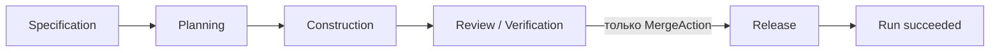
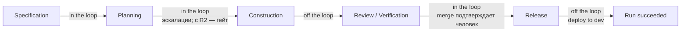
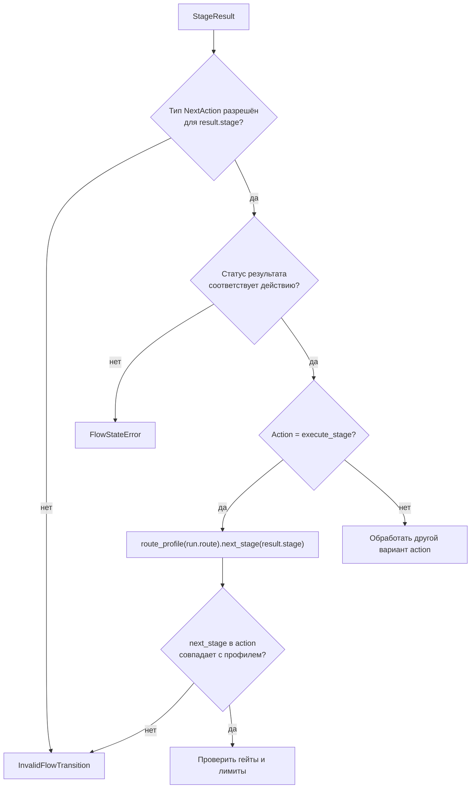

# Маршруты Factory Flow — `flows/routes.py`

**Исходник:** [`src/dark_factory/flows/routes.py`](../../src/dark_factory/flows/routes.py)

**Связанные модули:** [`changes/enums.py`](../../src/dark_factory/changes/enums.py), [`changes/risk.py`](../../src/dark_factory/changes/risk.py), [`context/sdd/strictness.py`](../../src/dark_factory/context/sdd/strictness.py), [`rules/gates.py`](../../src/dark_factory/rules/gates.py), [`orchestration/flow.py`](../../src/dark_factory/orchestration/flow.py)

## 1. Зачем нужен модуль

Маршрут — это **топология межстадийного Flow**: упорядоченный список стадий, через которые проходит один запуск (`ChangeRun`). Модуль намеренно не решает, успешно ли прошла стадия, какие гейты обязательны и какое действие разрешено.

Он отвечает только на четыре вопроса:

1. с какой стадии начинается маршрут;
2. какая стадия непосредственно следует за текущей;
3. какие гейты требуют явного человеческого решения (`HUMAN_GATES`, раздел 4);
4. какую полосу классов риска маршрут допускает (`min_risk_class`/`max_risk_class`, раздел 2.1).

Это позволяет независимо изменять четыре аспекта Flow:

| Аспект | Где задаётся |
|---|---|
| Порядок стадий | `flows/routes.py` |
| Полоса классов риска маршрута | `flows/routes.py` |
| Допустимые типы действий на стадии | `orchestration/flow.py::FLOW_TRANSITIONS` |
| Обязательные гейты | `rules/gates.py` |

Если в будущем появится маршрут, пропускающий часть стадий, достаточно добавить другой `RouteProfile`: таблицу типов действий и движок переходов менять не требуется.

## 2. Маршруты

Доменный enum `Route` содержит четыре значения:

- `quick` — быстрый маршрут (полоса `R0–R1`);
- `standard` — стандартный маршрут (`R0–R4`);
- `architecture` — маршрут архитектурных изменений (`R2–R4`);
- `foundation` — маршрут перестройки репозитория и платформенных изменений (`R3–R4`).

`architecture` и `foundation` — аддитивное расширение `Route` из T-080 (ADR-023 п.6): значения — стабильные wire-строки, зафиксированные CHECK-констрейнтом `execution.route` (миграция `0003_route_risk_classes`, обратимая).

**Все четыре маршрута проходят одинаковые пять стадий** — топологию T-080 не менял:



Последовательность хранится в неизменяемом кортеже `STAGE_SEQUENCE`:

```text
SPECIFICATION
→ PLANNING
→ CONSTRUCTION
→ REVIEW_VERIFICATION
→ RELEASE
```

Разница маршрутов не топологическая. Она в gate policy и в полосе классов риска:

| Стадия | `quick` | `standard` | `architecture` | `foundation` |
|---|---|---|---|---|
| Specification | Specification | Specification | Specification | Specification |
| Planning | Planning | Planning | Planning | Planning |
| Construction | Code | Code + UI | Code + UI | Code + UI |
| Review / Verification | Review + Verification | Review + Verification | Review + Verification | Review + Verification |
| Release | Release | Release | Release | Release |

То есть `quick` не пропускает Construction или Review: он не требует только UI-гейт на Construction. `architecture` и `foundation` требуют все семь гейтов, как `standard`. Человеческие гейты базового набора от маршрута не зависят (раздел 4); риск-класс расширяет их поверх маршрута (`rules.gates.required_human_gates`).

### 2.1. Полоса классов риска (ADR-023 п.6)

| Маршрут | `min_risk_class` | `max_risk_class` |
|---|---|---|
| `quick` | `R0` | `R1` |
| `standard` | `R0` | `R4` |
| `architecture` | `R2` | `R4` |
| `foundation` | `R3` | `R4` |

`route_allows_risk(route, risk_class)` истинно, только если класс попадает в полосу. Полоса двусторонняя: `foundation` не «везёт» R2 — его пол поднимает изменение до R3. Пол маршрута — слагаемое формулы эффективного класса ([`changes/risk.py`](../../src/dark_factory/changes/risk.py)): маршрут может только **повышать** класс и никогда не понижает.

Практическое следствие (DoD T-080): R2+ на `quick` невозможно — маршрут не выбирается при выборе маршрута, а если класс повышен в ходе run, продвижение стадии останавливается `StopAction(blocked)` (эскалация `risk_raised_to_r2`, ADR-023 п.3).

### 2.2. Выбор маршрута (ADR-023 п.6)

[`PROFILE_ROUTE`](../../src/dark_factory/context/sdd/strictness.py) задаёт базовый маршрут профиля строгости: `bugfix-r0` → `quick`; `product-feature`, `ui-research` → `standard`; `architecture-change` → `architecture`; `repository-rebuild`, `platform-change` → `foundation`.

`select_route(profile, risk_class)` детерминирован и только ужесточает маршрут: класс выше потолка поднимает маршрут до наименее строгого, который класс допускает (R2+ с профилем `bugfix-r0` даёт `standard`, а не `quick`). Класс ниже пола маршрут не понижает — пол поднимает сам класс. Порядок строгости — `ROUTE_STRICTNESS`: `quick < standard < architecture < foundation`.

## 3. `RouteProfile`

```python
@dataclass(frozen=True)
class RouteProfile:
    route: Route
    stages: tuple[Stage, ...]
    min_risk_class: RiskClass = RiskClass.R0
    max_risk_class: RiskClass = RiskClass.R4
```

Объект содержит:

- `route` — идентификатор маршрута;
- `stages` — упорядоченную последовательность стадий;
- `min_risk_class`/`max_risk_class` — полосу классов риска маршрута (ADR-023 п.6); по умолчанию `R0`/`R4`.

`frozen=True` запрещает обычное изменение полей после создания, а кортеж защищает порядок стадий от мутации.

### `initial_stage`

Возвращает `stages[0]`. Для встроенных профилей это всегда `Stage.SPECIFICATION`.

Важно: конструктор не проверяет, что `stages` непуст. Пользовательский `RouteProfile(stages=())` создастся, но обращение к `initial_stage` приведёт к `IndexError`. Встроенные профили этому случаю не подвержены.

### `human_gates`

Property, возвращающее `HUMAN_GATES` — frozenset гейтов, требующих явного человеческого решения (раздел 4). Свойство заявлено в API профиля, но в MVP возвращает один и тот же набор для любого маршрута.

### `next_stage(stage)`

Алгоритм:

1. найти первое вхождение `stage` в кортеже;
2. если стадия отсутствует — вернуть `None`;
3. если стадия последняя — вернуть `None`;
4. иначе вернуть следующий элемент.

Для встроенного профиля:

| Вход | Результат |
|---|---|
| `SPECIFICATION` | `PLANNING` |
| `PLANNING` | `CONSTRUCTION` |
| `CONSTRUCTION` | `REVIEW_VERIFICATION` |
| `REVIEW_VERIFICATION` | `RELEASE` |
| `RELEASE` | `None` |

`None` имеет два значения: стадия отсутствует в профиле **или** является терминальной. Вызывающий код при необходимости должен различать эти ситуации по контексту.

## 4. Человеческие гейты — `HUMAN_GATES`

Базовый набор определён в [`rules/gates.py`](../../src/dark_factory/rules/gates.py) — единственном источнике гейт-политики (ADR-005) — и реэкспортируется из `flows/routes.py` (публичная поверхность модуля сохранена):

```python
HUMAN_GATES: Final[frozenset[Gate]] = frozenset({Gate.SPECIFICATION, Gate.REVIEW})
```

Стадии, на которых автономный Flow останавливается и ждёт явного человеческого решения (ADR-018 p.1):

| Гейт | Стадия | Что подтверждает человек |
|---|---|---|
| `specification` | Specification | результат discovery: требования, UX, архитектура |
| `review` | Review / Verification | merge подтверждается человеком (ADR-011 p.2) |

Свойства:

- **базовый набор** human gates **не зависит ни от маршрута, ни от класса риска**: `quick` пропускает UI/расширенные гейты, но не человеческие (contracts/cli.md); `RouteProfile.human_gates` возвращает один frozenset для всех маршрутов;
- риск-класс **расширяет** набор поверх базового — `rules.gates.required_human_gates(route, stage, risk_class)` = `(HUMAN_GATES | RISK_HUMAN_GATES[risk_class]) & required_gates(route, stage)` (ADR-023 п.3): с `R1` человеческим становится `ui` (там, где маршрут его требует), с `R2` — ещё и `planning`, с `R3`/`R4` — каждый требуемый гейт стадии. Риск только **добавляет** и никогда не убирает: `specification` и `review` человеческие всегда;
- Planning остаётся in-the-loop **и через escalation-условия** (например, предложение нового ADR), а не только через гейт — поэтому `Gate.PLANNING` в `HUMAN_GATES` не входит; с `R2` он становится обязательным человеческим решением через `required_human_gates` (точка контроля `solution`, T-080);
- deploy to dev после merge — human-off-the-loop (стадия Release), prod — ручной post-MVP (T-091).



Потребитель — `orchestration/policy/participation.py`: он проецирует таблицу фаз ADR-018 p.1 (`PHASE_PARTICIPATION`) на пять стадий (`STAGE_PARTICIPATION`) и согласован с `HUMAN_GATES` контрактными тестами.

## 5. Реестр профилей

`ROUTE_PROFILES` — явный словарь по всем четырём маршрутам (не comprehension: полосы классов у маршрутов различны, поэтому каждый профиль заявляет свои `min_risk_class`/`max_risk_class`, ADR-023 п.6):

```python
ROUTE_PROFILES = {
    Route.QUICK: RouteProfile(..., max_risk_class=RiskClass.R1),
    Route.STANDARD: RouteProfile(...),
    Route.ARCHITECTURE: RouteProfile(..., min_risk_class=RiskClass.R2),
    Route.FOUNDATION: RouteProfile(..., min_risk_class=RiskClass.R3),
}
```

`route_profile(route)` выполняет прямой lookup в этом словаре и возвращает существующий экземпляр без копирования; полнота словаря по всем значениям `Route` закреплена тестом.

Аннотация `Final` запрещает переприсваивание имени для статического анализатора, но сам объект `ROUTE_PROFILES` остаётся обычным изменяемым `dict`. Код проекта рассматривает его как конфигурационную константу. `HUMAN_GATES` — такая же `Final`-константа, но её модуль-источник — `rules/gates.py`; `flows/routes.py` её импортирует и реэкспортирует, а `flows/__init__.py` — дальше.

## 6. Как маршрут участвует в переходе

Одного профиля недостаточно, чтобы выполнить переход. `apply_result()` проверяет переход в несколько шагов:



Разделение здесь принципиально:

- `FLOW_TRANSITIONS` отвечает, допустим ли **тип** действия;
- `RouteProfile` определяет конкретную **целевую стадию** для последовательного перехода;
- `rules` решают, разрешено ли фактически продолжить.

### Особый переход Review → Release

На `REVIEW_VERIFICATION` действие `execute_stage` отсутствует. Для перехода к `RELEASE` требуется `MergeAction`. Это исключает обход merge policy обычным последовательным переходом.

### Rework не следует маршруту вперёд

Rework использует отдельную таблицу `REWORK_TARGET`:

| Исходная стадия | Цель rework |
|---|---|
| Specification | Specification |
| Planning | Planning |
| Construction | Construction |
| Review / Verification | Construction |

Запись Release → Release присутствует для полноты mapping, но `rework` не разрешён таблицей действий Release.

## 7. Инварианты

Для встроенной конфигурации выполняются следующие инварианты:

1. каждый элемент `Route` имеет профиль, а каждый профиль строгости (`WorkflowProfile`) — базовый маршрут в `PROFILE_ROUTE`;
2. все четыре маршрута начинаются с Specification;
3. Release — последняя стадия и не имеет successor;
4. стадии последовательности уникальны;
5. `execute_stage` может вести только к непосредственному successor;
6. переход Review / Verification → Release проходит только через `merge`;
7. разница `quick` и остальных маршрутов — только UI-гейт Construction (у `standard`, `architecture`, `foundation` он есть);
8. базовые `human_gates` одинаковы для всех маршрутов и равны `{Specification, Review}`, а `required_human_gates` шире базового набора и растёт с классом риска;
9. полосы классов двусторонние: `quick` не допускает R2+, `foundation` — ничего ниже R3;
10. `select_route` детерминирован и никогда не понижает маршрут профиля — только ужесточает.

## 8. Граничные случаи

| Случай | Поведение |
|---|---|
| Пустой пользовательский профиль | `initial_stage` вызывает `IndexError` |
| Стадия не входит в профиль | `next_stage()` возвращает `None` |
| Стадия последняя | `next_stage()` возвращает `None` |
| Стадия повторяется | используется первое вхождение, потому что вызывается `tuple.index()` |
| Неизвестный ключ в `route_profile()` | обычный `KeyError` |
| Класс ниже пола маршрута (`foundation` и `R2`) | `route_allows_risk` — `False`: пол маршрута поднимает класс до R3 до входа в полосу |
| R2+ и маршрут `quick` | Продвижение стадии останавливается `StopAction(blocked)` (T-080) |
| Профиль `bugfix-r0` и класс R2+ | `select_route` возвращает `standard`: короткий маршрут недоступен |
| `ExecuteStageAction` указывает не successor | `InvalidFlowTransition` |
| Обязательный гейт не пройден | Flow заменяет продвижение на `StopAction(blocked)` |

## 9. Где искать проверки

- `tests/test_flows_routes.py` — полнота профилей, порядок стадий, terminal Release, полосы классов и `select_route` (T-080);
- `tests/test_rules_gates_risk.py` — `route_allows_risk` и `required_human_gates` по всем тройкам `(route, stage, risk_class)`;
- `tests/test_flow_transitions.py` — exhaustive-проверка всех пар `Stage × NextAction`;
- `tests/test_flow_engine.py` — корректная целевая стадия, merge boundary и gate policy;
- `tests/test_rules_gates.py` — различия `quick`/`standard`;
- `tests/test_policy_participation.py` — `HUMAN_GATES`, их независимость от маршрута и согласованность со стадиями in-the-loop;
- `tests/test_flow_policy.py` — блокировка продвижения при классе, недопустимом маршрутом (T-080).

## 10. Связь с другими модулями

| Документ | Связь |
|---|---|
| [rules.md](rules.md) | Гейт-политика: какие гейты обязательны для пары route/stage |
| [orchestration-flow-and-state.md](orchestration-flow-and-state.md) | `FLOW_TRANSITIONS`, `REWORK_TARGET` и алгоритм `apply_result()` |
| [quality.md](quality.md) | Гейты качества и приёмка результата стадии |

## 11. Связанные решения

- [ADR-005](../adr/ADR-005-stage-scoped-graphs-light-workflow-core.md) — лёгкий табличный FSM между стадиями;
- [ADR-011](../adr/ADR-011-risk-based-merge-release-policy.md) — merge policy и human-confirmed merge;
- [ADR-018](../adr/ADR-018-human-participation-autonomous-execution.md) — участие человека и человеческие гейты;
- [ADR-023](../adr/ADR-023-risk-classes-and-control-points.md) — полосы классов риска маршрутов, точки контроля, расширение `Route`;
- [HLD §8](../hld.md#8-домен-изменения-и-change-flow) — сквозной Change Flow.
