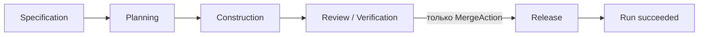
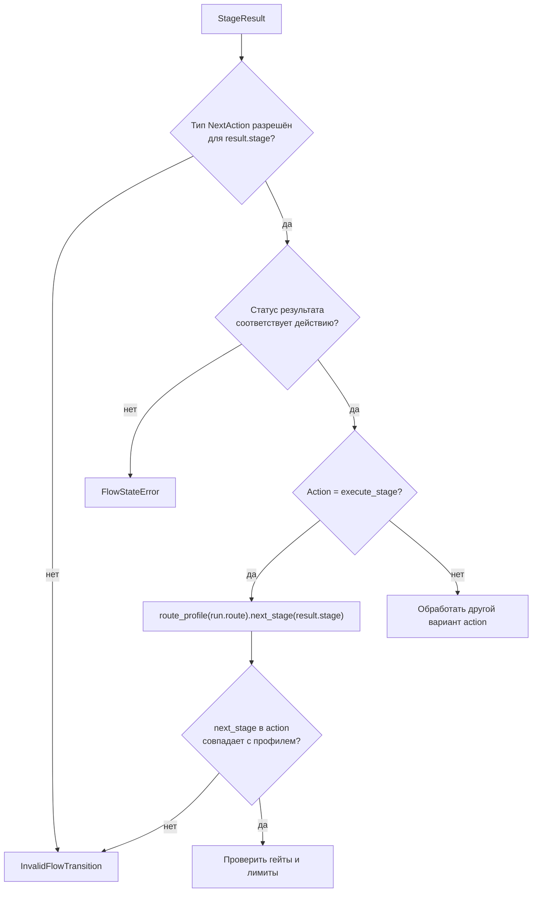

# Маршруты Factory Flow — `flows/routes.py`

**Исходник:** [`src/dark_factory/flows/routes.py`](../../src/dark_factory/flows/routes.py)

**Связанные модули:** [`changes/enums.py`](../../src/dark_factory/changes/enums.py), [`rules/gates.py`](../../src/dark_factory/rules/gates.py), [`orchestration/flow.py`](../../src/dark_factory/orchestration/flow.py)

## 1. Зачем нужен модуль

Маршрут — это **топология межстадийного Flow**: упорядоченный список стадий, через которые проходит один запуск (`ChangeRun`). Модуль намеренно не решает, успешно ли прошла стадия, какие гейты обязательны и какое действие разрешено.

Он отвечает только на два вопроса:

1. с какой стадии начинается маршрут;
2. какая стадия непосредственно следует за текущей.

Это позволяет независимо изменять три аспекта Flow:

| Аспект | Где задаётся |
|---|---|
| Порядок стадий | `flows/routes.py` |
| Допустимые типы действий на стадии | `orchestration/flow.py::FLOW_TRANSITIONS` |
| Обязательные гейты | `rules/gates.py` |

Если в будущем появится маршрут, пропускающий часть стадий, достаточно добавить другой `RouteProfile`: таблицу типов действий и движок переходов менять не требуется.

## 2. Маршруты MVP

Доменный enum `Route` содержит два значения:

- `quick` — быстрый маршрут;
- `standard` — стандартный маршрут.

В текущем MVP **оба маршрута проходят одинаковые пять стадий**:



Последовательность хранится в неизменяемом кортеже `STAGE_SEQUENCE`:

```text
SPECIFICATION
→ PLANNING
→ CONSTRUCTION
→ REVIEW_VERIFICATION
→ RELEASE
```

Разница `quick` и `standard` сейчас не топологическая. Она находится в gate policy:

| Стадия | `quick` | `standard` |
|---|---|---|
| Specification | Specification | Specification |
| Planning | Planning | Planning |
| Construction | Code | Code + UI |
| Review / Verification | Review + Verification | Review + Verification |
| Release | Release | Release |

То есть `quick` не пропускает Construction или Review: он не требует только UI-гейт на Construction.

## 3. `RouteProfile`

```python
@dataclass(frozen=True)
class RouteProfile:
    route: Route
    stages: tuple[Stage, ...]
```

Объект содержит:

- `route` — идентификатор маршрута;
- `stages` — упорядоченную последовательность стадий.

`frozen=True` запрещает обычное изменение полей после создания, а кортеж защищает порядок стадий от мутации.

### `initial_stage`

Возвращает `stages[0]`. Для встроенных профилей это всегда `Stage.SPECIFICATION`.

Важно: конструктор не проверяет, что `stages` непуст. Пользовательский `RouteProfile(stages=())` создастся, но обращение к `initial_stage` приведёт к `IndexError`. Встроенные профили этому случаю не подвержены.

### `next_stage(stage)`

Алгоритм:

1. найти первое вхождение `stage` в кортеже;
2. если стадия отсутствует — вернуть `None`;
3. если стадия последняя — вернуть `None`;
4. иначе вернуть следующий элемент.

Для встроенного профиля:

| Вход | Результат |
|---|---|
| `SPECIFICATION` | `PLANNING` |
| `PLANNING` | `CONSTRUCTION` |
| `CONSTRUCTION` | `REVIEW_VERIFICATION` |
| `REVIEW_VERIFICATION` | `RELEASE` |
| `RELEASE` | `None` |

`None` имеет два значения: стадия отсутствует в профиле **или** является терминальной. Вызывающий код при необходимости должен различать эти ситуации по контексту.

## 4. Реестр профилей

`ROUTE_PROFILES` создаётся при импорте модуля перебором всех элементов `Route`:

```python
ROUTE_PROFILES = {
    route: RouteProfile(route=route, stages=STAGE_SEQUENCE)
    for route in Route
}
```

Так текущий код гарантирует, что каждый объявленный `Route` получает профиль. `route_profile(route)` выполняет прямой lookup в этом словаре и возвращает существующий экземпляр без копирования.

Аннотация `Final` запрещает переприсваивание имени для статического анализатора, но сам объект `ROUTE_PROFILES` остаётся обычным изменяемым `dict`. Код проекта рассматривает его как конфигурационную константу.

## 5. Как маршрут участвует в переходе

Одного профиля недостаточно, чтобы выполнить переход. `apply_result()` проверяет переход в несколько шагов:



Разделение здесь принципиально:

- `FLOW_TRANSITIONS` отвечает, допустим ли **тип** действия;
- `RouteProfile` определяет конкретную **целевую стадию** для последовательного перехода;
- `rules` решают, разрешено ли фактически продолжить.

### Особый переход Review → Release

На `REVIEW_VERIFICATION` действие `execute_stage` отсутствует. Для перехода к `RELEASE` требуется `MergeAction`. Это исключает обход merge policy обычным последовательным переходом.

### Rework не следует маршруту вперёд

Rework использует отдельную таблицу `REWORK_TARGET`:

| Исходная стадия | Цель rework |
|---|---|
| Specification | Specification |
| Planning | Planning |
| Construction | Construction |
| Review / Verification | Construction |

Запись Release → Release присутствует для полноты mapping, но `rework` не разрешён таблицей действий Release.

## 6. Инварианты

Для встроенной конфигурации выполняются следующие инварианты:

1. каждый элемент `Route` имеет профиль;
2. оба маршрута начинаются с Specification;
3. Release — последняя стадия и не имеет successor;
4. стадии последовательности уникальны;
5. `execute_stage` может вести только к непосредственному successor;
6. переход Review / Verification → Release проходит только через `merge`;
7. разница `quick` и `standard` — только UI-гейт Construction.

## 7. Граничные случаи

| Случай | Поведение |
|---|---|
| Пустой пользовательский профиль | `initial_stage` вызывает `IndexError` |
| Стадия не входит в профиль | `next_stage()` возвращает `None` |
| Стадия последняя | `next_stage()` возвращает `None` |
| Стадия повторяется | используется первое вхождение, потому что вызывается `tuple.index()` |
| Неизвестный ключ в `route_profile()` | обычный `KeyError` |
| `ExecuteStageAction` указывает не successor | `InvalidFlowTransition` |
| Обязательный гейт не пройден | Flow заменяет продвижение на `StopAction(blocked)` |

## 8. Где искать проверки

- `tests/test_flows_routes.py` — полнота профилей, порядок стадий, terminal Release;
- `tests/test_flow_transitions.py` — exhaustive-проверка всех пар `Stage × NextAction`;
- `tests/test_flow_engine.py` — корректная целевая стадия, merge boundary и gate policy;
- `tests/test_rules_gates.py` — различия `quick`/`standard`.

## 9. Связанные решения

- [ADR-005](../adr/ADR-005-stage-scoped-graphs-light-workflow-core.md) — лёгкий табличный FSM между стадиями;
- [ADR-011](../adr/ADR-011-risk-based-merge-release-policy.md) — merge policy;
- [HLD §8](../hld.md#8-домен-изменения-и-change-flow) — сквозной Change Flow.
