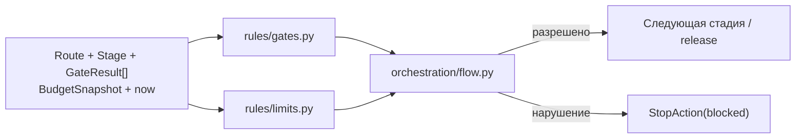
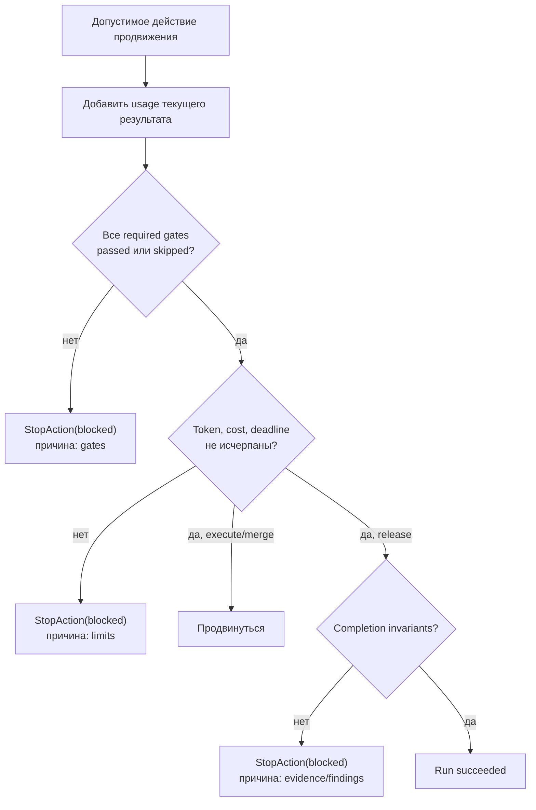

# Правила Factory Flow — `rules/`

**Исходники:** [`src/dark_factory/rules/`](../../src/dark_factory/rules/)

**Главный потребитель:** [`orchestration/flow.py`](../../src/dark_factory/orchestration/flow.py)

## 1. Назначение

`rules/` содержит детерминированные политики, которые отвечают на вопрос: **может ли автономный Flow продолжать работу?**

Подсистема разделена на два файла:

- `gates.py` — обязательные проверки качества для пары route/stage;
- `limits.py` — пределы rework, токенов, стоимости и времени.

Функции не обращаются к БД, CI, часам ОС или внешним API. Время для deadline передаётся явно, поэтому одинаковый вход даёт одинаковый результат.



## 2. Gate policy

### 2.1. Каталог гейтов

В MVP определены семь гейтов:

- `specification`;
- `planning`;
- `code`;
- `ui`;
- `review`;
- `verification`;
- `release`.

### 2.2. Базовая привязка к стадиям

| Stage | Базовые обязательные gates |
|---|---|
| Specification | Specification |
| Planning | Planning |
| Construction | Code |
| Review / Verification | Review, Verification |
| Release | Release |

`standard` добавляет UI-гейт на Construction. `quick` дополнительных гейтов не добавляет.


`required_gates(route, stage)` объединяет базовый набор стадии и route-specific additions и возвращает `frozenset[Gate]`.

### 2.3. Что считается пройденным

| `GateStatus` | Удовлетворяет обязательный гейт |
|---|---:|
| `passed` | да |
| `skipped` | да |
| `failed` | нет |
| `pending` | нет |
| результат отсутствует | нет |

`skipped` означает «проверен и неприменим», поэтому не блокирует Flow.

### 2.4. `unsatisfied_gates()`

Функция:

1. строит карту последнего статуса для каждого гейта;
2. получает обязательные гейты для route/stage;
3. оставляет отсутствующие, `pending` и `failed`;
4. сортирует результат по строковому `Gate.value`.

Если один гейт проверялся несколько раз, **последний элемент входной последовательности выигрывает**. Timestamp и `GateResult.sha` здесь не сравниваются.

Результаты необязательных гейтов не влияют на решение.

## 3. Limit policy

### 3.1. `BudgetSnapshot`

Flow использует run-level snapshot:

| Поле | Default | Назначение |
|---|---:|---|
| `max_rework_rounds` | `3` | Максимум rework-раундов |
| `used_rework_rounds` | `0` | Уже использованные раунды |
| `token_budget` | `None` | Опциональный предел токенов |
| `tokens_used` | `0` | Накопленное использование |
| `cost_budget` | `None` | Опциональный предел стоимости |
| `cost_used` | `0` | Накопленная стоимость |
| `deadline` | `None` | Опциональный предельный момент |

По умолчанию включён только rework limit. Остальные лимиты действуют, когда им назначено значение.

### 3.2. Rework

`rework_violation(budget, requested_round)` проверяет:

1. исчерпан ли run-level счётчик `used_rework_rounds >= max_rework_rounds`;
2. не превышает ли запрошенный номер `requested_round` максимум.

При разрешённом rework Flow увеличивает `used_rework_rounds` на единицу.

Важные детали:

- authority — `BudgetSnapshot`, а не поле `ReworkAction.max_rounds`;
- код не требует, чтобы `requested_round == used_rework_rounds + 1`;
- token/cost/deadline при rework отдельно не проверяются текущей реализацией.

### 3.3. Продолжение

`continuation_violations(budget, now)` возвращает все нарушения в стабильном порядке:

1. token budget;
2. cost budget;
3. deadline.

| Лимит | Условие блокировки |
|---|---|
| Tokens | `tokens_used >= token_budget` |
| Cost | `cost_used >= cost_budget` |
| Deadline | `now > deadline` |

Следствия:

- ровно на token/cost budget продолжение уже запрещено;
- ровно в момент deadline продолжение ещё разрешено;
- несколько budget violations объединяются в одну строку через `; `.

## 4. Порядок принятия решения в Flow

Гейты и continuation limits проверяются только при продвижении через:

- `ExecuteStageAction`;
- `MergeAction`;
- `ReleaseAction`.

Для этих действий `_block_reason()` проверяет:

1. обязательные гейты;
2. token/cost/deadline.

Если одновременно нарушены гейты и бюджет, наружу возвращается причина по гейтам. Это осознанный приоритет: сначала диагностика качества стадии, затем расхода ресурсов.

Для release после этого отдельно проверяются completion invariants: обязательная evidence должна быть доступна, blocker findings — закрыты.



### Usage учитывается до проверки

`_accumulate_usage()` вызывается до action-specific policy checks:

- если `Usage.total_tokens` указан, используется он;
- иначе складываются `prompt_tokens + completion_tokens`;
- `cost` добавляется только когда не равен `None`.

Поэтому расход текущего StageResult может исчерпать бюджет и заблокировать этот же переход.

## 5. Матрица действий и политик

| Action | Gate check | Token/cost/deadline | Rework limit | Completion invariants |
|---|---:|---:|---:|---:|
| `execute_stage` | да | да | нет | нет |
| `merge` | да | да | нет | нет |
| `release` | да | да | нет | да |
| `rework` | нет | нет | да | нет |
| `wait_for_input` | нет | нет | нет | нет |
| `wait_for_ci` | нет | нет | нет | нет |
| `request_approval` | нет | нет | нет | нет |
| `stop` | нет | нет | нет | нет |

Wait-action может перевести run в ожидание даже при уже исчерпанном бюджете. При этом usage текущего результата всё равно будет накоплен. Проверка сработает при следующем действии продвижения.

## 6. Как нарушение представляется

Нарушение policy не является исключением. Flow синтезирует:

```text
StopAction(outcome=blocked, reason=<диагностика>)
StageStatus.BLOCKED
RunStatus.BLOCKED
next_stage = None
```

Исключения зарезервированы для структурно некорректного входа: недопустимой пары stage/action, несовпадающего result status, stale attempt и т. п.

`blocked` — не окончательный `RunStatus`: доменная таблица разрешает восстановление `blocked → running` после устранения причины.

## 7. Граничные случаи

| Случай | Поведение |
|---|---|
| Обязательный gate отсутствует | блокировка |
| Последний результат gate — `failed`, предыдущий — `passed` | блокировка |
| Последний результат gate — `passed`, предыдущий — `failed` | разрешение по этому gate |
| Gate имеет `skipped` | удовлетворён |
| Лишний необязательный gate упал | не влияет |
| Gate и budget нарушены одновременно | причина gate имеет приоритет |
| Несколько budgets нарушены | возвращаются все: token → cost → deadline |
| `now == deadline` | ещё разрешено |
| `used_rework_rounds == max_rework_rounds` | rework запрещён |
| `requested_round` пропустил номер, но не превысил max | текущий код разрешает |
| `ReworkAction.max_rounds` отличается от run budget | решение принимает run budget |

## 8. Где искать проверки

- `tests/test_rules_gates.py` — required/unsatisfied gates и порядок;
- `tests/test_rules_limits.py` — границы budgets и rework;
- `tests/test_flow_engine.py` — интеграция rules с Flow;
- `tests/test_flow_transitions.py` — разрешённые action types.

## 9. Связанные решения

- [ADR-005](../adr/ADR-005-stage-scoped-graphs-light-workflow-core.md) — детерминированный межстадийный FSM;
- [ADR-011](../adr/ADR-011-risk-based-merge-release-policy.md) — merge/release policy;
- [ADR-018](../adr/ADR-018-human-participation-autonomous-execution.md) — остановка автономного цикла и участие человека.
