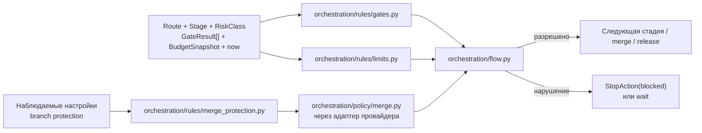
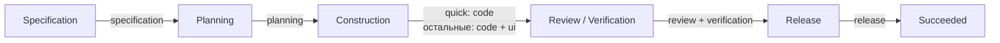
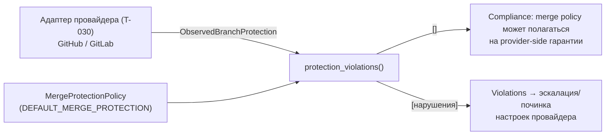
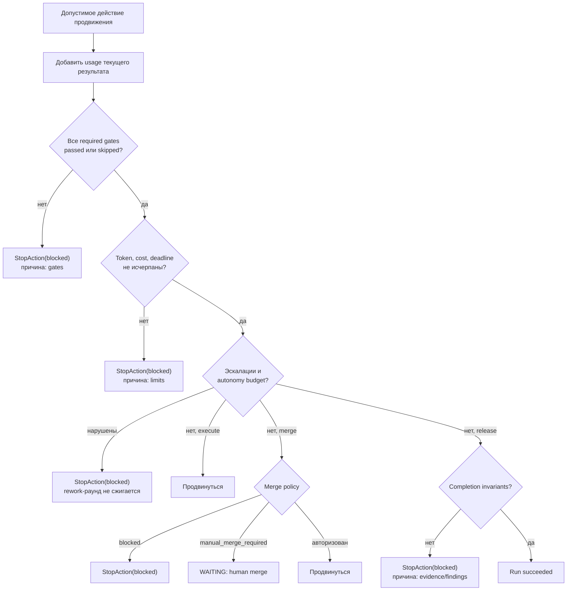

# Правила Factory Flow — `orchestration/rules/`

**Исходники:** [`src/dark_factory/orchestration/rules/`](../../src/dark_factory/orchestration/rules/)

**Главный потребитель:** [`orchestration/flow.py`](../../src/dark_factory/orchestration/flow.py)

## 1. Назначение

`orchestration/rules/` содержит детерминированные политики, которые отвечают на вопрос: **может ли автономный Flow продолжать работу?**

Подсистема разделена на три файла:

- `gates.py` — обязательные проверки качества для тройки route/stage/risk_class (машинный набор — от route/stage, человеческий — ещё и от класса, T-080);
- `limits.py` — пределы rework, токенов, стоимости и времени;
- `merge_protection.py` — требования к branch protection провайдера для merge-гейта (T-026, T-032).

Функции не обращаются к БД, CI, часам ОС, сети или внешним API. Время для deadline передаётся явно, наблюдаемые настройки провайдера — готовыми данными, поэтому одинаковый вход даёт одинаковый результат.



## 2. Gate policy

### 2.1. Каталог гейтов

В MVP определены семь гейтов:

- `specification`;
- `planning`;
- `code`;
- `ui`;
- `review`;
- `verification`;
- `release`.

### 2.2. Базовая привязка к стадиям

| Stage | Базовые обязательные gates |
|---|---|
| Specification | Specification |
| Planning | Planning |
| Construction | Code |
| Review / Verification | Review, Verification |
| Release | Release |

`standard` добавляет UI-гейт на Construction; `quick` дополнительных гейтов не добавляет. Так же, как `standard`, требуют все семь гейтов `architecture` и `foundation` (T-080, ADR-023 п.6).



`required_gates(route, stage)` объединяет базовый набор стадии и route-specific additions и возвращает `frozenset[Gate]` — набор **машинных** гейтов. Его сигнатура не менялась ни в T-080: риск-класс новых гейтов не создаёт.

### 2.3. Человеческие гейты и риск-класс (T-080, ADR-023 п.3)

`RISK_HUMAN_GATES` — человеческие гейты, которые класс добавляет к базовому набору ADR-018 (`HUMAN_GATES` из этого же модуля, ADR-018):

| Класс | `RISK_HUMAN_GATES[класс]` |
|---|---|
| `R0` | — |
| `R1` | `ui` |
| `R2` | `ui`, `planning` |
| `R3`, `R4` | все семь гейтов |

`required_human_gates(route, stage, risk_class)` = `(HUMAN_GATES | RISK_HUMAN_GATES[risk_class]) & required_gates(route, stage)`. Пересечение с `required_gates` нужно, чтобы человеческим становился только фактически требуемый гейт: `ui` на `quick` маршрут не требует — точкой контроля он не становится. Отсюда инвариант, закреплённый тестами: человеческий гейт — всегда подмножество требуемых, а базовые `specification` и `review` человеческие для любого класса. Пары `(stage, gate)` из этого набора — те же, что у точек контроля ([orchestration-operations.md](orchestration-operations.md) §4.2).

### 2.4. Что считается пройденным

| `GateStatus` | Удовлетворяет обязательный гейт |
|---|---:|
| `passed` | да |
| `skipped` | да |
| `failed` | нет |
| `pending` | нет |
| результат отсутствует | нет |

`skipped` означает «проверен и неприменим», поэтому не блокирует Flow.

### 2.5. `unsatisfied_gates()`

Функция:

1. строит карту последнего статуса для каждого гейта;
2. получает обязательные гейты для route/stage;
3. оставляет отсутствующие, `pending` и `failed`;
4. сортирует результат по строковому `Gate.value`.

Если один гейт проверялся несколько раз, **последний элемент входной последовательности выигрывает**: новый SHA инвалидирует прежние прохождения (ADR-009 п.7). Timestamp и `GateResult.sha` здесь не сравниваются — гейты на уровне Flow «SHA-blind», привязку к финальному SHA добавляют merge policy и провайдерская branch protection (см. раздел 4 и [quality.md](quality.md)).

Результаты необязательных гейтов не влияют на решение.

## 3. Limit policy

### 3.1. `BudgetSnapshot`

Flow использует run-level snapshot (`changes/usage.py`):

| Поле | Default | Назначение |
|---|---:|---|
| `max_rework_rounds` | `3` | Максимум rework-раундов |
| `used_rework_rounds` | `0` | Уже использованные раунды |
| `token_budget` | `None` | Опциональный предел токенов |
| `tokens_used` | `0` | Накопленное использование |
| `cost_budget` | `None` | Опциональный предел стоимости |
| `cost_used` | `0` | Накопленная стоимость |
| `deadline` | `None` | Опциональный предельный момент |

У snapshot есть вычисляемые свойства — `rework_exhausted`, `token_budget_exhausted`, `cost_budget_exhausted`, `rework_rounds_remaining`, — которые и читают правила лимитов. По умолчанию включён только rework limit; остальные лимиты действуют, когда им назначено значение.

### 3.2. Нарушения — типизированные

Каждое нарушение — frozen-dataclass `LimitViolation` с полями:

| Поле | Тип | Значения |
|---|---|---|
| `rule` | `LimitRule` | `rework_limit`, `token_budget`, `cost_budget`, `deadline` |
| `reason` | `str` | Человекочитаемая диагностика с точными числами |

### 3.3. Rework

`rework_violation(budget, *, requested_round)` проверяет:

1. исчерпан ли run-level счётчик (`budget.rework_exhausted`, то есть `used_rework_rounds >= max_rework_rounds`);
2. не превышает ли запрошенный номер `requested_round` максимум.

При разрешённом rework Flow увеличивает `used_rework_rounds` на единицу.

Важные детали:

- authority — `BudgetSnapshot`, а не поле `ReworkAction.max_rounds`;
- код не требует, чтобы `requested_round == used_rework_rounds + 1`;
- token/cost/deadline при rework отдельно не проверяются текущей реализацией.

### 3.4. Продолжение

`continuation_violations(budget, *, now)` возвращает все нарушения в стабильном порядке:

1. token budget;
2. cost budget;
3. deadline.

| Лимит | Условие блокировки |
|---|---|
| Tokens | `tokens_used >= token_budget` |
| Cost | `cost_used >= cost_budget` |
| Deadline | `now > deadline` |

Следствия:

- ровно на token/cost budget продолжение уже запрещено;
- ровно в момент deadline продолжение ещё разрешено;
- в Flow несколько нарушений объединяются в одну строку причины через `; `.

Run-level правила этого раздела переиспользует бюджет-координатор ([`orchestration/budget/`](../../src/dark_factory/orchestration/budget/), T-062): там живут run/role-allowance, резервации вызовов и вердикт `AWAITING_DECISION`, который stage-путь отображает в `Blocked`. Пороги и тексты причин не дублируются: координатор складывает свой журнал в `BudgetSnapshot` и вызывает те же `continuation_violations`. Подробности — [budget.md](budget.md).

## 4. Merge protection policy

`merge_protection.py` (T-026, T-032) описывает **требования к настройкам branch protection провайдера** — данные, а не сетевые вызовы. Это провайдерская сторона merge policy (GitHub rulesets / GitLab protected branches).

### 4.1. Требуемая политика — `MergeProtectionPolicy`

| Поле | Default | Требование |
|---|---|---|
| `protected_branch` | `True` | Целевая ветка отклоняет прямые пушы и force-push |
| `required_approving_reviews` | `1` | Минимум один approving human review |
| `required_status_checks` | `True` | Обязательные проверки enforcing на merge, то есть на финальном SHA |
| `allowed_merge_methods` | `{squash}` | Только squash; объявленный набор исчерпывающий |
| `dismiss_stale_approvals` | `True` | Новый пуш снимает старые approvals |

`DEFAULT_MERGE_PROTECTION` — константа с этими значениями. Требования — провайдерский аналог version-bound approvals (ADR-009 п.7): новый SHA не должен наследовать одобрения старого.

### 4.2. Наблюдение и проверка

`ObservedBranchProtection` — все поля обязательны: адаптер явно фиксирует, что увидел, а неполное наблюдение не должно выглядеть комплиантным. `protection_violations(observed, *, policy=DEFAULT_MERGE_PROTECTION)` сравнивает наблюдение с политикой и возвращает `list[MergeProtectionViolation]`; пустой список — compliance.

Проверка детерминирована: не более одного нарушения на правило, в фиксированном порядке `MergeProtectionRule`:

1. `branch_not_protected` — ветка не защищена;
2. `insufficient_required_approvals` — требуемых approvals меньше минимума;
3. `required_checks_missing` — обязательные проверки не enforced;
4. `non_squash_merge_allowed` — набор разрешённых методов merge отличается от squash-only;
5. `stale_approvals_not_dismissed` — stale approvals не снимаются.



В текущем коде `protection_violations` вызывается только тестами; наблюдаемые настройки должен поставлять адаптер провайдера (T-030). Merge policy в Flow работает поверх: stage-гейты SHA-blind, а гарантии финального SHA дают branch protection плюс version-bound approval.

## 5. Порядок принятия решения в Flow

Гейты и continuation limits проверяются только при продвижении через:

- `ExecuteStageAction`;
- `MergeAction`;
- `ReleaseAction`.

Для всех трёх `_block_reason()` проверяет по порядку:

1. обязательные гейты (`unsatisfied_gates`);
2. token/cost/deadline (`continuation_violations`).

Если одновременно нарушены гейты и бюджет, наружу возвращается причина по гейтам. Это осознанный приоритет: сначала диагностика качества стадии, затем расхода ресурсов.

Дальше порядок расходится по действиям:

| Действие | После `_block_reason()` |
|---|---|
| `execute_stage` | `_escalation_reason()`: объявленные эскалации → полоса классов маршрута (T-080) → autonomy budget контракта (`iterations_used = len(run.stages)`). Гейт входа в Construction в Flow не участвует: его проверяет префлайт исполнителя стадии (T-063) |
| `merge` | объявленные эскалации → merge policy (`evaluate_merge`) |
| `release` | объявленные эскалации → completion invariants (обязательная evidence доступна, blocker findings закрыты) |
| `rework` | объявленные эскалации → autonomy budget → rework limit; эскалация и исчерпанный autonomy budget ветоируют раунд **без сжигания** |

Merge policy без `merge_context` не консультируется вовсе: отсутствие merge-фактов — ручной режим (FR-010), run переходит в `WAITING` на человеческий merge. Подробности merge policy — [orchestration-operations.md](orchestration-operations.md), полный алгоритм — [orchestration-flow-and-state.md](orchestration-flow-and-state.md).



### Usage учитывается до проверки

`_accumulate_usage()` вызывается до action-specific policy checks:

- если `Usage.total_tokens` указан, используется он;
- иначе складываются `prompt_tokens + completion_tokens`;
- `cost` добавляется только когда не равен `None`.

Поэтому расход текущего StageResult может исчерпать бюджет и заблокировать этот же переход.

## 6. Матрица действий и политик

| Action | Gate check | Token/cost/deadline | Эскалации | Autonomy budget | Rework limit | Merge policy | Completion invariants |
|---|---:|---:|---:|---:|---:|---:|---:|
| `execute_stage` | да | да | да | да | нет | нет | нет |
| `merge` | да | да | только объявленные | нет | нет | да | нет |
| `release` | да | да | только объявленные | нет | нет | нет | да |
| `rework` | нет | нет | да | только autonomy | да | нет | нет |
| `wait_for_input` | нет | нет | нет | нет | нет | нет | нет |
| `wait_for_ci` | нет | нет | нет | нет | нет | нет | нет |
| `request_approval` | нет | нет | нет | нет | нет | нет | нет |
| `stop` | нет | нет | нет | нет | нет | нет | нет |

Wait-action может перевести run в ожидание даже при уже исчерпанном бюджете. При этом usage текущего результата всё равно будет накоплен. Проверка сработает при следующем действии продвижения.

Эскалации и autonomy budget контракта живут не в `orchestration/rules/`, а в [`orchestration/policy/escalation.py`](../../src/dark_factory/orchestration/policy/escalation.py) — Flow вызывает их вместе с правилами `orchestration/rules/`, поэтому они включены в порядок принятия решения. Гейт входа в Construction — не проверка Flow, а префлайт исполнителя стадии (T-063, `stages/checks.construction_entry_reason`): он останавливает попытку Construction до любого внешнего эффекта.

## 7. Как нарушение представляется

Нарушение policy не является исключением. Flow синтезирует:

```text
StopAction(outcome=blocked, reason=<диагностика>)
StageStatus.BLOCKED
RunStatus.BLOCKED
next_stage = None
```

Исключения зарезервированы для структурно некорректного входа: недопустимой пары stage/action, несовпадающего result status, stale attempt и т. п.

`blocked` — не окончательный `RunStatus`: доменная таблица разрешает восстановление `blocked → running` после устранения причины.

## 8. Граничные случаи

| Случай | Поведение |
|---|---|
| Обязательный gate отсутствует | блокировка |
| Последний результат gate — `failed`, предыдущий — `passed` | блокировка |
| Последний результат gate — `passed`, предыдущий — `failed` | разрешение по этому gate |
| Gate имеет `skipped` | удовлетворён |
| Лишний необязательный gate упал | не влияет |
| Gate и budget нарушены одновременно | причина gate имеет приоритет |
| Несколько budgets нарушены | возвращаются все: token → cost → deadline |
| `now == deadline` | ещё разрешено |
| `used_rework_rounds == max_rework_rounds` | rework запрещён |
| `requested_round` пропустил номер, но не превысил max | текущий код разрешает |
| `ReworkAction.max_rounds` отличается от run budget | решение принимает run budget |
| Объявлена эскалация в StageResult | execute/merge/release/rework заблокированы; rework-раунд не сжигается |
| Вход в Construction без approved Implementation Contract | попытка Construction блокируется префлайтом стадии до любого внешнего эффекта (T-063): планирование остаётся `succeeded`, retry не переделывает его |
| Класс изменения не допускается маршрутом (R2+ на `quick`) | execute блокируется с полосой маршрута в причине (T-080, ADR-023 п.3) |
| Исчерпан autonomy budget контракта | execute и rework блокируются |
| `merge_context` не передан | ручной режим: run в `WAITING` на человеческий merge |
| Merge policy вернул `blocked` | `StopAction(blocked)` с причиной политики |
| R2+ и нет approval на обязательной точке контроля при merge | `blocked` с перечнем точек; для R0/R1 — прежний `manual_merge_required` (T-080) |
| Наблюдение провайдера не соответствует `MergeProtectionPolicy` | список violations в фиксированном порядке правил |

## 9. Где искать проверки

- `tests/test_rules_gates.py` — required/unsatisfied gates и порядок;
- `tests/test_rules_gates_risk.py` — `required_human_gates` и полосы маршрутов (T-080);
- `tests/test_rules_limits.py` — границы budgets и rework;
- `tests/test_rules_merge_protection.py` — compliance и violations branch protection;
- `tests/test_flow_engine.py` — интеграция rules с Flow;
- `tests/test_flow_policy.py` — merge policy и эскалации в Flow;
- `tests/test_flow_transitions.py` — разрешённые action types.

## 10. Связанные решения

- [ADR-005](../adr/ADR-005-stage-scoped-graphs-light-workflow-core.md) — детерминированный межстадийный FSM;
- [ADR-009](../adr/ADR-009-minimal-bootstrap-otel.md) — version-bound approvals, инвалидируемые новым SHA;
- [ADR-011](../adr/ADR-011-risk-based-merge-release-policy.md) — merge/release policy и branch protection;
- [ADR-018](../adr/ADR-018-human-participation-autonomous-execution.md) — остановка автономного цикла и участие человека;
- [ADR-023](../adr/ADR-023-risk-classes-and-control-points.md) — риск-классы R0–R4, человеческие гейты и полосы маршрутов.

## 11. Связь с другими модулями

- [routes.md](routes.md) — топология маршрутов и стадий, из которой берутся гейты;
- [quality.md](quality.md) — кто вычисляет результаты гейтов, которые проверяет `orchestration/rules/`;
- [orchestration-flow-and-state.md](orchestration-flow-and-state.md) — главный потребитель: как Flow применяет правила;
- [orchestration-operations.md](orchestration-operations.md) — merge policy и эскалации рядом с правилами `orchestration/rules/`.
