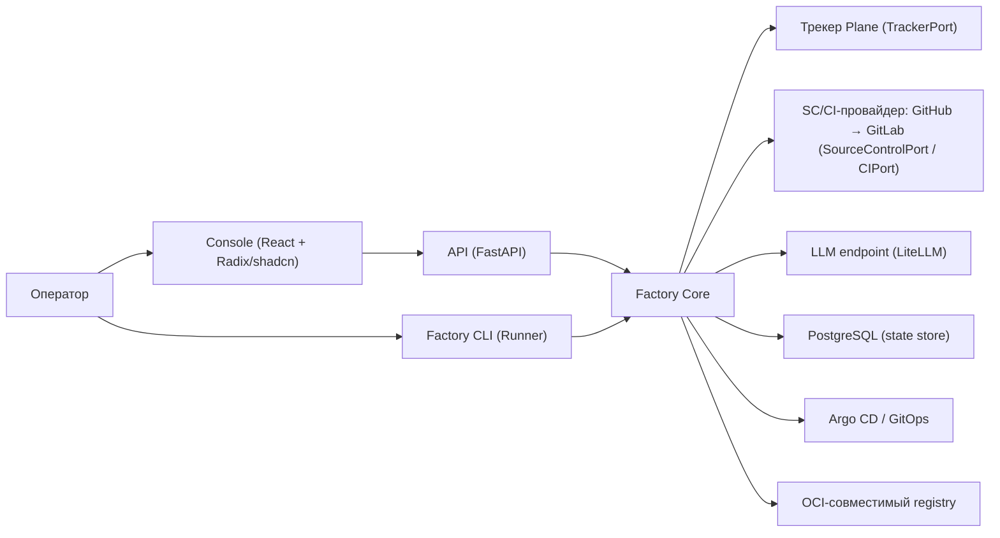
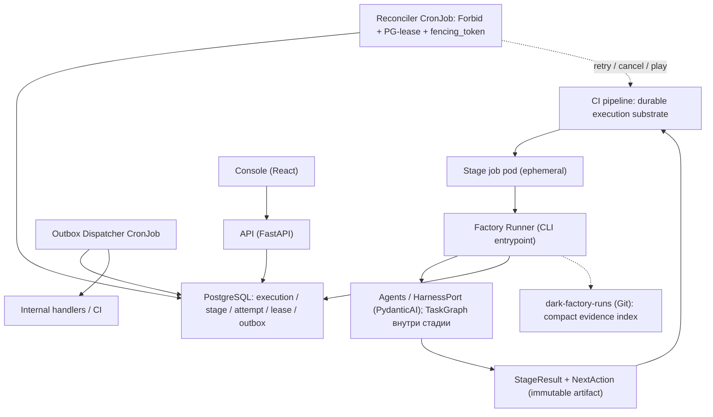
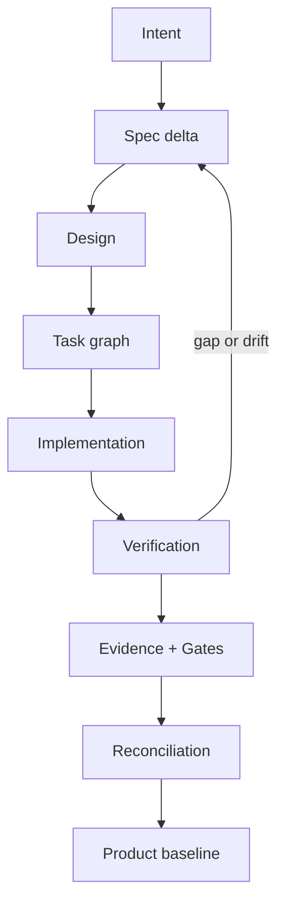
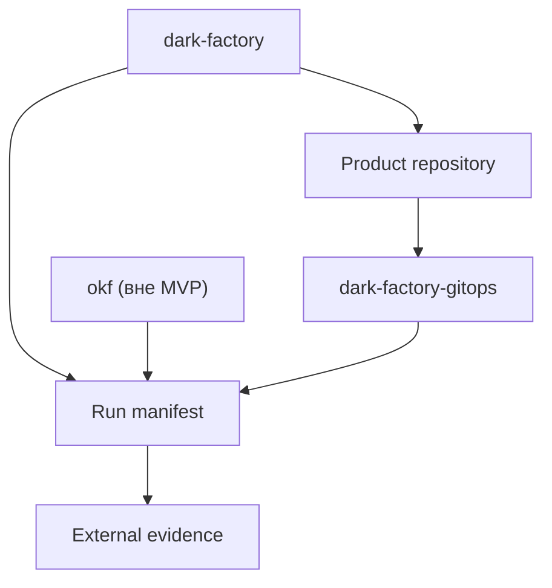

# HLD — Software Dark Factory MVP

Высокоуровневое описание архитектуры фабрики. Сводный документ: он описывает **актуальную архитектуру** и **связывает все принятые ADR** в единую картину. Каждое значимое решение — со ссылкой на ADR; ADR остаются источником истины по конкретному решению, HLD — по их сочетанию.

- **Дата**: 2026-09-13
- **Статус**: 🟡 pre-MVP — архитектурные решения приняты (ADR-001…ADR-019), каркас кода и базовый CI готовы (T-002)
- **Область**: архитектура MVP фабрики (один оператор, один пилотный продукт, локальный контур)
- **Связанные документы**: `docs/vision-2026-09-13-v1.md` (зачем и что), `specs/001-dark-factory-mvp/tasks.md` (задачи и последовательность), `.specify/memory/constitution.md` (принципы и гейты), `docs/adr/` (решения)

---

## 1. Назначение и область

**Software Dark Factory** — конвейер агентной разработки ПО: специализированные агентные роли превращают задачу в работающий, протестированный и задокументированный код, доведённый до merge и деплоя в dev-контур, при избирательном участии человека ([ADR-018](adr/ADR-018-human-participation-autonomous-execution.md)).

Документ отвечает на вопросы: из каких частей состоит система, как они связаны, где проходят границы (модули, порты, репозитории, доверие), как обеспечиваются идемпотентность, восстановление и трассируемость. Детали реализации — в задачах `specs/001-dark-factory-mvp/tasks.md`; конкретные решения — в ADR.

**Вне области MVP:** production-контур и его автоматизация, Temporal/DBOS, Kafka, полный корпоративный observability-стек, Keycloak/Vault/MinIO/Harbor, OKF knowledge graph, Figma/Web Components UIKit, marketplace ([ADR-009](adr/ADR-009-minimal-bootstrap-otel.md), [ADR-015](adr/ADR-015-repository-boundaries.md), vision §5).

---

## 2. Архитектурные принципы

| Принцип | Суть | Источник |
|---|---|---|
| Ports & Adapters (hexagonal) | Ядро зависит только от портов; внешние системы — за адаптерами; ядро не импортирует SDK провайдеров | [ADR-015](adr/ADR-015-repository-boundaries.md) п.3, [ADR-019](adr/ADR-019-multi-provider-sc-ci-github-first.md) |
| Модульный монолит | Один релиз и lockfile; границы модулей проверяются CI, а не декларируются | [ADR-002](adr/ADR-002-python-core-stack.md), [ADR-015](adr/ADR-015-repository-boundaries.md) п.3 |
| Разделение источников истины | Git — долгоживущая истина; PostgreSQL — authoritative operational state; CI-провайдер — durable execution substrate, **не** state store | [ADR-004](adr/ADR-004-postgresql-factory-state.md), [ADR-006](adr/ADR-006-ephemeral-job-pods-reconciler-cronjob.md) п.2 |
| Ephemeral execution | Нет постоянно живущих воркеров: pod на стадию + scheduled reconciler; Runner — CLI, а не сервис | [ADR-003](adr/ADR-003-no-temporal-in-mvp.md), [ADR-006](adr/ADR-006-ephemeral-job-pods-reconciler-cronjob.md) |
| Идемпотентность по умолчанию | at-least-once запуск + effectively-once контролируемые side effects (operation/attempt/effect keys, effect ledger) | [ADR-006](adr/ADR-006-ephemeral-job-pods-reconciler-cronjob.md) п.3 |
| Расширяемость через плагины | Стабильное ядро + SDK + типы плагинов + FactoryPack; поставка поэтапная | [ADR-008](adr/ADR-008-plugin-architecture-core-sdk.md) |
| Evidence-based | Каждый шаг оставляет проверяемую цепочку доказательств; наличие артефакта ≠ пройденный гейт | [ADR-009](adr/ADR-009-minimal-bootstrap-otel.md), [ADR-020](adr/ADR-020-native-sdd-core.md) |
| Участие человека по фазам | Human-in-the-loop на намерении/решениях/merge; Human-off-the-loop на реализации | [ADR-018](adr/ADR-018-human-participation-autonomous-execution.md) |

---

## 3. Реестр ADR и связь с разделами HLD

| ADR | Решение | Статус | Разделы HLD |
|---|---|---|---|
| [ADR-001](adr/ADR-001-adopt-spec-kit.md) | Spec Kit как SDD-инструмент bootstrap-фазы; целевая модель заменена ADR-020 | принято (bootstrap; историческое) | §12 |
| [ADR-002](adr/ADR-002-python-core-stack.md) | Python core stack: модульный монолит, PydanticAI за `HarnessPort`, pydantic-graph внутри стадии, FastAPI | принято | §2, §6, §7, §10 |
| [ADR-003](adr/ADR-003-no-temporal-in-mvp.md) | Temporal в MVP не нужен; подключение позже через `WorkflowEnginePort` | принято | §8, §20 |
| [ADR-004](adr/ADR-004-postgresql-factory-state.md) | PostgreSQL — серверная БД состояния: execution/stage/attempt/leases/outbox/очередь | принято | §9 |
| [ADR-005](adr/ADR-005-stage-scoped-graphs-light-workflow-core.md) | pydantic-graph только внутри стадии; межстадийный Flow — собственный лёгкий durable workflow-core (таблица переходов) | принято | §8, §10 |
| [ADR-006](adr/ADR-006-ephemeral-job-pods-reconciler-cronjob.md) | Ephemeral job pods + идемпотентный reconciler CronJob; ключи идемпотентности, lease/fencing, retry-автомат | принято (ревизия 3) | §5, §8, §9 |
| [ADR-007](adr/ADR-007-nine-role-catalog.md) | Каталог из 9 ролей; расширяем через плагины типа `agent` | принято | §10 |
| [ADR-008](adr/ADR-008-plugin-architecture-core-sdk.md) | Ядро + SDK + 8 типов плагинов + FactoryPack; границы доверия режимов исполнения | принято | §11 |
| [ADR-009](adr/ADR-009-minimal-bootstrap-otel.md) | Минимальный bootstrap + OTel как контракт наблюдаемости; MVP-модель идентичности; граница данных LLM | принято | §15, §17 |
| [ADR-010](adr/ADR-010-local-k8s-helm-argocd.md) | Локальный Docker Desktop Kubernetes + Helm + Argo CD; rollback и совместимость миграций | принято | §14 |
| [ADR-011](adr/ADR-011-risk-based-merge-release-policy.md) | Risk-based merge/release: merge в MVP — человек, авторазвёртывание dev после merge, Prod — вручную | принято | §8, §13 |
| [ADR-012](adr/ADR-012-gitlab-premium.md) | GitLab Premium для GitLab-провайдера (T-034) с CE-fallback | принято | §13 |
| [ADR-013](adr/ADR-013-plane-tracker-trackerport.md) | Plane (self-hosted, webhook+HMAC) за `TrackerPort` | принято | §7, §13 |
| [ADR-014](adr/ADR-014-react-uikit-storybook.md) | Small UIKit на React (Radix + shadcn), Storybook как исполняемая UI-спецификация | принято | §6, §13 |
| [ADR-015](adr/ADR-015-repository-boundaries.md) | Границы репозиториев: 4 системных + динамическая группа `products`; протокол версионирования | принято с условиями | §6, §15, §16 |
| [ADR-016](adr/ADR-016-postgresql-outbox.md) | PostgreSQL outbox вместо Kafka: `event_delivery`, ordering, retry/dead-letter, retention | принято (ревизия 3) | §9, §20 |
| [ADR-017](adr/ADR-017-unified-openspec-sdd-factory-profile.md) | Единый OpenSpec с профилями `factory-sdd` / `product-sdd`; Spec Kit — только bootstrap | заменено (ADR-020) | §12 |
| [ADR-018](adr/ADR-018-human-participation-autonomous-execution.md) | Модель участия человека по фазам; Implementation Contract и условия эскалации | принято | §8, §17 |
| [ADR-019](adr/ADR-019-multi-provider-sc-ci-github-first.md) | Мультипровайдерный SC/CI: GitHub-адаптер первым, GitLab — вторым; `ChangeRequestRef`, инвариант «один run — один провайдер» | принято | §7, §13 |
| [ADR-020](adr/ADR-020-native-sdd-core.md) | Native SDD Core: ChangeSet + Product Baseline `.factory/`; центральный OKF — федеративная проекция; Spec Kit/OpenSpec — bootstrap- и compatibility-адаптеры | принято | §12, §16 |

Шаблон новых решений — [`adr/ADR-000-template.md`](adr/ADR-000-template.md); правила процесса — [`adr/README.md`](adr/README.md).

---

## 4. Системный контекст



- **Оператор** — единственная человеческая роль MVP: формулирует намерение, утверждает Implementation Contract и merge, получает отчёты (§8).
- **SC/CI-провайдер** — внешний control plane (код, change request, CI): GitHub первым, GitLab вторым ([ADR-019](adr/ADR-019-multi-provider-sc-ci-github-first.md)).
- **Трекер Plane** — intake задач и публикация статусов за `TrackerPort` ([ADR-013](adr/ADR-013-plane-tracker-trackerport.md)).
- **PostgreSQL** — authoritative operational state, не замена Git-истине ([ADR-004](adr/ADR-004-postgresql-factory-state.md)).

---

## 5. Контейнеры и модель исполнения (runtime view)

Модель исполнения: CI pipeline — durable substrate и координатор CI-графа; работа стадии — в ephemeral job pod; продолжение между стадиями — через типизированные `StageResult`/`NextAction`, а не через долгоживущий процесс ([ADR-006](adr/ADR-006-ephemeral-job-pods-reconciler-cronjob.md)).



**Компоненты**

| Компонент | Роль | ADR |
|---|---|---|
| Factory Runner (CLI) | Точка входа стадии; агенту не нужен постоянно живущий сервис | [ADR-006](adr/ADR-006-ephemeral-job-pods-reconciler-cronjob.md) п.1 |
| Reconciler CronJob | Идемпотентный проход каждые 2–5 мин: зависшие jobs, timeout, retry, superseded, WAIT-продолжение | [ADR-006](adr/ADR-006-ephemeral-job-pods-reconciler-cronjob.md) п.5–6, п.12 |
| Outbox Dispatcher CronJob | Доставка событий outbox, retry/dead-letter | [ADR-016](adr/ADR-016-postgresql-outbox.md) п.4 |
| API (FastAPI) | runs, evidence, approvals, управление; mutating-операции — token-authenticated | [ADR-002](adr/ADR-002-python-core-stack.md), [ADR-009](adr/ADR-009-minimal-bootstrap-otel.md) п.7 |
| Console (React) | Операторский контроль: 5 экранов MVP | [ADR-014](adr/ADR-014-react-uikit-storybook.md), [ADR-021](adr/ADR-021-console-mvp-delivery.md) |
| PostgreSQL | Authoritative operational state | [ADR-004](adr/ADR-004-postgresql-factory-state.md) |

---

## 6. Factory Core: модульная структура

Модульный монолит на Python ([ADR-002](adr/ADR-002-python-core-stack.md)). Каркас пакетов создан в T-002 (`src/dark_factory/`); модули наполняются задачами `specs/001-dark-factory-mvp/tasks.md`.

| Модуль (пакет) | Ответственность | ADR |
|---|---|---|
| `changes` | Доменная модель изменения: intake, спецификация, состояние изменения | [ADR-002](adr/ADR-002-python-core-stack.md), T-003 |
| `orchestration` | Межстадийный Flow: таблица переходов, гейты, rework-лимиты, маршруты | [ADR-005](adr/ADR-005-stage-scoped-graphs-light-workflow-core.md), T-004 |
| `agents` | Ролевые профили как сменные исполнители стадий | [ADR-007](adr/ADR-007-nine-role-catalog.md), T-011 |
| `context` | Сборка и фиксация `ContextBundle` для агентов | T-012 |
| `execution` | Провайдеры исполнения агентной работы (worktree, контейнер, job) | [ADR-006](adr/ADR-006-ephemeral-job-pods-reconciler-cronjob.md) |
| `quality` | Детерминированные гейты качества результата изменения | [ADR-020](adr/ADR-020-native-sdd-core.md), T-013 |
| `ports` | Абстрактные интерфейсы, развязывающие ядро и внешние системы | [ADR-002](adr/ADR-002-python-core-stack.md), [ADR-015](adr/ADR-015-repository-boundaries.md) п.3 |
| `adapters` | Конкретные реализации портов для внешних систем и runtime | [ADR-019](adr/ADR-019-multi-provider-sc-ci-github-first.md) |
| `api`, `cli`, `console`, `packs`, `flows`, `rules` | Точки входа и расширения (наполняются задачами T-030…T-090) | [ADR-008](adr/ADR-008-plugin-architecture-core-sdk.md) |

**Правила границ (проверяются CI).** Зависимости направлены от адаптеров к контрактам ядра: адаптеры импортируют только `dark_factory.ports` (и собственные подпакеты); импорт `adapters` из ядра запрещён; прямой доступ агентов/flows к Git-провайдеру, Kubernetes и хранилищам в обход портов запрещён ([ADR-015](adr/ADR-015-repository-boundaries.md) п.3). Инвариант закреплён тестом `tests/test_import_boundaries.py` (правила A и B).

---

## 7. Порты и адаптеры

| Порт | Назначение | Адаптеры MVP | ADR |
|---|---|---|---|
| `HarnessPort` | Исполнение агентной стадии исполнителем | PydanticAI (первый); второй harness — T-089 | [ADR-002](adr/ADR-002-python-core-stack.md), [ADR-008](adr/ADR-008-plugin-architecture-core-sdk.md) |
| `WorkflowEnginePort` | start / resume / cancel / get_status исполнения | Лёгкий workflow-core; позже — Temporal | [ADR-006](adr/ADR-006-ephemeral-job-pods-reconciler-cronjob.md) п.9, [ADR-003](adr/ADR-003-no-temporal-in-mvp.md) |
| `ReconciliationService` | reconcile(desired vs observed) — отдельно от движка | Reconciler CronJob | [ADR-006](adr/ADR-006-ephemeral-job-pods-reconciler-cronjob.md) п.9 |
| `SourceControlPort` | Repository / MergeRequest / Pipeline; ядро оперирует `ChangeRequestRef` | `GitHubAdapter` (P0), `GitLabAdapter` (P1) | [ADR-019](adr/ADR-019-multi-provider-sc-ci-github-first.md) |
| `CIPort` | Запуск агентных стадий, статусы гейтов, artifacts | Actions (GitHub), CI (GitLab) | [ADR-019](adr/ADR-019-multi-provider-sc-ci-github-first.md) |
| `ArtifactStorePort` | Доступ к тяжёлой evidence (логи, отчёты, SBOM, скриншоты) | CI artifacts провайдера; в DC — S3/MinIO | [ADR-009](adr/ADR-009-minimal-bootstrap-otel.md), [ADR-015](adr/ADR-015-repository-boundaries.md) п.4 |
| `TrackerPort` | get_change / publish_status / request_approval | Plane; NoOp-заглушка до готовности | [ADR-013](adr/ADR-013-plane-tracker-trackerport.md) |
| `TelemetryPort` | OTLP-экспорт, usage/cost-атрибуты | OTLP; backend опционален | [ADR-009](adr/ADR-009-minimal-bootstrap-otel.md) п.2–3 |
| `EventPublisherPort` | Публикация событий без привязки домена к транспорту | PostgreSQL outbox | [ADR-016](adr/ADR-016-postgresql-outbox.md) п.7 |
| `SDDPort` | Жизненный цикл спецификаций изменения | `NativeChangeSetAdapter` (основной), `SpecKitAdapter` (bootstrap-импорт), `OpenSpecAdapter` (compatibility) | [ADR-020](adr/ADR-020-native-sdd-core.md) п.8 |

Порты — единая точка интеграции: второй провайдер/трекер/harness добавляется как новый адаптер без изменения Flow, reconcile и CI-шаблонов ([ADR-019](adr/ADR-019-multi-provider-sc-ci-github-first.md) п.1). Совместимость подтверждается единой контрактной тест-сюитой портов (fake → GitHub → GitLab).

---

## 8. Домен изменения и Change Flow

### 8.1. Сквозной сценарий

```mermaid
flowchart LR
    INTAKE["Intake (трекер / CLI)"] --> SPEC["Specification (SDD-гейт)"]
    SPEC --> PLAN["Planning (Implementation Contract)"]
    PLAN --> DEV["Implementation (автономно)"]
    DEV --> QUAL["Quality review + bounded rework ≤3"]
    QUAL --> CR["Change request (PR/MR)"]
    CR --> MERGE["Merge (человек)"]
    MERGE --> BUILD["OCI build (immutable digest)"]
    BUILD --> GITOPS["GitOps MR (trusted finalizer)"]
    GITOPS --> ARGO["Argo CD → dev"]
    ARGO --> SMOKE["Smoke + evidence"]
    SMOKE --> DONE["Released to dev"]
```



### 8.2. Два уровня оркестрации

- **Внутри стадии** — `pydantic-graph` `TaskGraph`: параллельные подзадачи (branch/join ≤2), reducers ([ADR-005](adr/ADR-005-stage-scoped-graphs-light-workflow-core.md) п.1, T-015).
- **Между стадиями** — собственный лёгкий durable workflow-core: единственный источник разрешённых переходов — неизменяемая таблица переходов; `StageResult`/`NextAction` типизированы ([ADR-005](adr/ADR-005-stage-scoped-graphs-light-workflow-core.md) п.2). Гарантия корректности переходов — на трёх уровнях: типы (mypy strict, `assert_never`), рантайм (единственная функция сверки с таблицей), тесты (exhaustive-обход таблицы).

### 8.3. Риск-классы, гейты и участие человека

Режим участия человека фиксируется по фазам ([ADR-018](adr/ADR-018-human-participation-autonomous-execution.md) п.1):

| Фаза | Роль человека | Режим |
|---|---|---|
| Требования | Уточняет цели, ограничения, acceptance criteria | Human-in-the-loop |
| UX/UI | Оценивает сценарии, прототипы, визуальный результат | Human-in-the-loop |
| Архитектура | Совместно утверждает значимые решения | Human-in-the-loop |
| Планирование реализации | Проверяет границы задачи и уровень риска | Human-on-the-loop |
| Написание кода | Агенты реализуют, тестируют, исправляют | Human-off-the-loop |
| Проверки качества/безопасности | Автогейты; человек — по исключениям | Human-on-the-loop |
| Merge (MVP) | Явное подтверждение человека | Human-in-the-loop |
| Deploy в dev | Автоматически после merge и зелёных гейтов | Human-off-the-loop |
| Prod | Ручное разрешение после evidence | Human-in-the-loop |

Вход release-политики — риск-классы R0–R4 (T-080): LLM может повысить класс, понизить — только формальная политика ([ADR-011](adr/ADR-011-risk-based-merge-release-policy.md) п.5). Реализация ограничена утверждённым **Implementation Contract** (scope, acceptance criteria, архитектурные ограничения, UI evidence, риск-класс, бюджет, правила эскалации); выход за границы или неисправимые findings останавливают автономный цикл ([ADR-018](adr/ADR-018-human-participation-autonomous-execution.md) п.3–5). Архитектурные решения классифицируются как Known path / Bounded choice / New path — человек обязателен только для New path.

Риск-класс — детерминированная функция наблюдаемых фактов изменения, а не самоотчёт: класс выводится `classify_risk`, эффективный берётся максимумом из заявленного, выведенного из фактов и пола маршрута, поэтому ни один вход не может его понизить, и агент не может передать «свой» класс в обход политики. Маршруты имеют полосы классов (`quick` — R0–R1, `standard` — R0–R4, `architecture` — R2–R4, `foundation` — R3–R4), выбор маршрута `select_route` только ужесточает маршрут по классу; с R2+ обязательства класса проверяются как гейт (полоса маршрута и version-bound человеческие точки контроля `problem`/`solution`/`ux`/`discovery_release`), а не как ручная оценка ([ADR-023](adr/ADR-023-risk-classes-and-control-points.md)).

---

## 9. Модель состояния, идемпотентность и события

### 9.1. Разделение ответственности за состояние ([ADR-006](adr/ADR-006-ephemeral-job-pods-reconciler-cronjob.md) п.2)

| Хранилище | Что хранит |
|---|---|
| PostgreSQL ([ADR-004](adr/ADR-004-postgresql-factory-state.md)) | Authoritative operational state: execution, stage, attempt, lease, reconcile action, outbox, usage/cost |
| CI pipeline | Durable execution substrate и координатор CI-графа; наблюдаемое состояние jobs; **не** state store фабрики |
| `dark-factory-runs` (Git) | Компактный immutable индекс evidence: `RunManifest`, итоговый `StageResult`, approvals/decisions, ссылки, digest, provenance |
| CI artifacts | Тяжёлая evidence (логи, отчёты, скриншоты, SBOM) через `ArtifactStorePort` |
| Product repository | Исходный код и продуктовые изменения (commit/MR) |

Рассинхрон «CI ↔ PostgreSQL» разрешается в пользу PostgreSQL после сверки observed-состояния.

### 9.2. Ключи идемпотентности ([ADR-006](adr/ADR-006-ephemeral-job-pods-reconciler-cronjob.md) п.3)

```text
operation_key = execution_id + stage_id + input_revision
attempt_id    = operation_key + attempt_number
effect_key    = operation_key + effect_type + effect_target
```

- `operation_key` одинаков для всех повторов стадии; новая входная ревизия — новая логическая операция.
- `attempt_id` не входит в ключ операции — иначе retry терял бы идемпотентность.
- Каждый внешний side effect (branch, commit, MR, deployment, comment) сопровождается **durable effect ledger**: статус `planned / in_progress / succeeded / unknown`, `external_ref`; при `unknown` — lookup по детерминированному маркеру перед повтором.

**Гарантия:** at-least-once запуск стадии и effectively-once фиксация контролируемых side effects; exactly-once execution не гарантируется.

### 9.3. Конкурентность reconcile ([ADR-006](adr/ADR-006-ephemeral-job-pods-reconciler-cronjob.md) п.6)

Kubernetes `concurrencyPolicy: Forbid` — оптимизация; корректность обеспечивает PostgreSQL lease (`global-reconciler`, `owner_id` = pod UID, монотонный `fencing_token`, `expires_at`). Все изменения execution выполняются с проверкой `state_revision` и `fencing_token`.

### 9.4. Retry и внешнее ожидание ([ADR-006](adr/ADR-006-ephemeral-job-pods-reconciler-cronjob.md) п.7–8)

Retry — детерминированный конечный автомат с явным перечнем retryable `failure_reason`, `max_attempts`, backoff, retry budget, терминальным `failed_requires_intervention`; неизвестный исход — `unknown_outcome` с обязательной сверкой. Внешнее ожидание: `NextAction.WAIT` → blocking manual job → аутентифицированный callback (HMAC/подписанный токен, timestamp, replay-защита) → `play` API; повторный callback не порождает второй переход.

### 9.5. Событийная модель ([ADR-016](adr/ADR-016-postgresql-outbox.md))

Transactional outbox в БД фабрики: изменение состояния и событие — в одной транзакции. Доставка at-least-once через Outbox Dispatcher CronJob; состояние доставки — per-consumer `event_delivery`; порядок — только в рамках `changeId`/`runId` по монотонному `sequence`; retry с exponential backoff и dead-letter; cleanup — только after all-delivered + retention. Kafka в MVP не разворачивается; миграция — отдельным ADR по измеримым триггерам (§20).

---

## 10. Агенты, роли и harness

**Каталог — 9 широких ролей** (профили исполнения, не сервисы): Product, Design, Architect, Develop, Quality, Security, Infrastructure, CI/CD, Operation ([ADR-007](adr/ADR-007-nine-role-catalog.md) п.1). Ядро MVP — Product, Develop, Quality; остальные подключаются по маршруту/риску (T-081, T-082). Reviewer — режим независимой проверки соответствующим профилем, не отдельная роль.

- Профили — версионированные манифесты (входы/выходы, tools, ограничения, stop-conditions); контракт `AgentProfile → TaskEnvelope → AgentResult` (T-003).
- Каталог расширяем: новая роль — плагин типа `agent` без изменения ядра и таблицы переходов.
- Harness — PydanticAI за `HarnessPort` ([ADR-002](adr/ADR-002-python-core-stack.md) п.2); смена исполнителя — второй адаптер того же порта (T-089).
- Контекст агента — `ContextBundle` (модуль `context`), фиксируется в evidence (T-012).

---

## 11. Плагины и расширяемость

Архитектурная модель: **стабильное ядро + SDK + 8 типов плагинов + FactoryPack** ([ADR-008](adr/ADR-008-plugin-architecture-core-sdk.md)).

| Тип плагина | Назначение |
|---|---|
| `agent` | Ролевой профиль (расширение каталога ролей) |
| `tool` | Инструмент агента |
| `workflow` | Дополнительный рабочий процесс |
| `gate` | Проверка/гейт (например, UI-гейты) |
| `connector` | Коннектор внешней системы (например, Plane) |
| `executor` | Провайдер исполнения |
| `knowledge` | Источник знаний |
| `blueprint` | Шаблон/скелет продукта |
| `ui-extension` | Расширение Console (после T-051) |

**Границы доверия** ([ADR-008](adr/ADR-008-plugin-architecture-core-sdk.md) п.4, [ADR-015](adr/ADR-015-repository-boundaries.md) п.3): in-process — только встроенные version-pinned плагины trusted core (allowlist в ядре); остальные — subprocess (timeout, лимиты ресурсов, capability allowlist, без наследования секретов). Манифест не может сам повысить режим доверия; внешние/marketplace-плагины — не раньше решения о подписи и sandboxing (T-088).

**Поставка поэтапная:** порты/адаптеры как швы SDK — с первой итерации (T-005); минимальный реестр/загрузчик манифестов — с первой pack-задачей (T-070); каталог блоков/scorecards — P3 (T-087); FactoryPack/маркетплейс — P3 (T-088).

---

## 12. SDD-слой: Native SDD Core

Каноническая модель — **Native SDD Core** ([ADR-020](adr/ADR-020-native-sdd-core.md); полная спецификация — [`sdd-native-core.md`](sdd-native-core.md)): каждая разработка — ChangeSet со стабильным ID и цепочкой `Intent → Spec → Design → Tasks → Verification → Evidence → Reconciliation`; ChangeSet содержит дельту относительно канонического Product Baseline.



Ключевые решения:

- **ChangeSet** — `.factory/changes/<year>/<id>/` с манифестом `change.yaml`. Семантическое состояние (`draft → proposed → specified → designed → ready → accepted → reconciled → closed`) хранится в Git; runtime-состояние (job, lease, retry, attempt) — в PostgreSQL (§9). Состав артефактов определяется workflow profile и risk class (§8.3); путь каталога ChangeSet стабилен.
- **Product Baseline** — `.factory/product/` рядом с кодом; для multi-repo продукта — отдельный product-spec репозиторий. Baseline содержит только принятые состояния (`active`, `superseded`, `retired`); acceptance → reconciliation (`add/modify/supersede/retire`) обновляет baseline и связи графа.
- **Spec** — дельта над baseline (`delta.yaml`), а не копия всей спецификации; **декомпозиция** — `tasks/graph.yaml` (WorkGraph с трассировкой `satisfies`), `tasks.md` — генерируемое представление для человека, Plane — внешнее рабочее представление графа ([ADR-013](adr/ADR-013-plane-tracker-trackerport.md)).
- **Frontmatter-политика**: все самостоятельно адресуемые SDD-артефакты имеют минимальный YAML frontmatter (`schema`, `id`, `type`, `title`, `product`, `status`, `change`) и становятся узлами OKF-графа; generated views и вспомогательная документация могут его не иметь.
- **Verification, evidence и gates**: проверки определяются до начала реализации (`verification/plan.yaml`); evidence — ссылки, digest и provenance в Git, тяжёлые отчёты — в CI artifacts/Object Storage; gates фиксируют GateDecision (policy и версия, revision ChangeSet, результат, evidence, объяснение, агент/человек, разрешённый override). Гейт работает поверх нормализованного контракта ChangeSet: наличие артефакта не равно пройденному гейту.
- **Размещение знаний**: product repositories — canonical knowledge; центральный OKF — федеративная read-проекция (индексация baselines, enterprise knowledge graph, поиск, context retrieval), не source of truth и не bottleneck (§16).
- `SDDPort` — единая точка интеграции; `NativeChangeSetAdapter` — основной, `SpecKitAdapter` — bootstrap-импорт legacy-артефактов, `OpenSpecAdapter` — compatibility import/export.
- **Spec Kit** ([ADR-001](adr/ADR-001-adopt-spec-kit.md)) остаётся инструментом bootstrap-разработки до готовности Native SDD Core (T-020); `.specify/` и `specs/<фича>/` сохраняются как historical bootstrap evidence. **OpenSpec** ([ADR-017](adr/ADR-017-unified-openspec-sdd-factory-profile.md), заменён) — compatibility-инструмент. Два параллельных канонических SDD-процесса не допускаются.

---

## 13. SC/CI-контур и release policy

**Мультипровайдерный SC/CI за портами** ([ADR-019](adr/ADR-019-multi-provider-sc-ci-github-first.md)): `SourceControlPort` (+`CIPort`), провайдер выбирается на уровне репозитория (`provider: github | gitlab`). GitLab MR и GitHub PR сведены к единому `ChangeRequestRef`. Инвариант эксклюзивности: **один run исполняется ровно в одном провайдере**; смена провайдера репозитория применяется только к новым run'ам.

- **GitHub-адаптер — первый провайдер MVP** (T-030, критический путь): GitHub App с короткоживущими installation tokens, webhooks (ускоритель), Actions в self-hosted раннерах, Checks API, artifacts, branch protection/rulesets, обязательные checks/approvals.
- **GitLab-адаптер — второй провайдер** (T-034, P1): GitLab Premium как целевая редакция с CE-совместимой базой и документированным fallback ([ADR-012](adr/ADR-012-gitlab-premium.md)).
- Контрактные тест-сюиты портов исполняются против каждого адаптера (fake → GitHub → GitLab) ([ADR-019](adr/ADR-019-multi-provider-sc-ci-github-first.md) п.6).

**Release policy** ([ADR-011](adr/ADR-011-risk-based-merge-release-policy.md)): в MVP merge — только человек; низкорисковое изменение R0/R1 автономно доводится до готового к merge состояния; **после ручного merge** развёртывание в dev выполняет **trusted finalizer** (GitOps-MR с immutable digest, merge после зелёных гейтов и валидного evidence) — у agent pods таких credentials нет. Auto-merge R0/R1 — policy-controlled, отдельная задача T-085, после накопления статистики пилота. Prod — только вручную после валидации (пост-MVP, T-091).

---

## 14. Delivery: GitOps в локальном Kubernetes

Цель MVP — **локальный Docker Desktop Kubernetes на MacBook 24GB + Helm + Argo CD**; поток поставки — GitOps через `dark-factory-gitops` ([ADR-010](adr/ADR-010-local-k8s-helm-argocd.md) п.1, [ADR-015](adr/ADR-015-repository-boundaries.md)).

- Профиль ресурсов: 10–12 ГБ Docker, concurrency=1; namespaces, quotas, NetworkPolicy deny-by-default; capacity smoke фиксирует пик RAM/CPU/диска до повышения concurrency (T-040).
- Лицензия Docker Desktop проверяется на bootstrap; запасной путь — VM (RKE2 с теми же Helm chart'ами); Compose — деградированный режим без GitOps/Argo ([ADR-010](adr/ADR-010-local-k8s-helm-argocd.md) п.3).
- ARM64: образы собираются под arm64/мульти-арх, digest'ы закрепляются.
- **Rollback и миграции:** revert GitOps-коммита откатывает образ, но не схему БД; изменения схемы (Alembic) — backward-compatible (expand/contract), destructive — отдельным шагом после стабилизации ([ADR-010](adr/ADR-010-local-k8s-helm-argocd.md) п.6).
- Миграция в shared/DC-контур — T-091 (values-dc, тот же chart без изменений кода).

---

## 15. Evidence, наблюдаемость и данные

- **OTel — нейтральный контракт наблюдаемости:** `TelemetryPort` + OTLP-адаптер; экспорт по умолчанию — job logs/artifacts; внешний backend опционален ([ADR-009](adr/ADR-009-minimal-bootstrap-otel.md) п.2).
- **AI-трассы** — Pydantic Evals + OTel (usage/cost-атрибуты); Langfuse — не обязательная зависимость.
- **Долгоживущая evidence** — в Git (`dark-factory-runs`), а не в observability-хранилище; тяжёлые данные — CI artifacts через `ArtifactStorePort` ([ADR-015](adr/ADR-015-repository-boundaries.md) п.4).
- **Retention:** срок хранения обязательной evidence перекрывает максимальный срок approval/retry/аудита; недоступная обязательная evidence → статус `evidence_unavailable`, успешный терминальный статус запрещён ([ADR-009](adr/ADR-009-minimal-bootstrap-otel.md) п.9).
- Наблюдаемость не привязана к вендору: OTLP-экспорт заменяет backend без правок ядра. Сквозная корреляция «change → run → stage → agent → tool» — с первого дня (T-060).

---

## 16. Репозитории и версионирование

**Четыре системных репозитория + динамическая группа продуктовых** ([ADR-015](adr/ADR-015-repository-boundaries.md)):

| Репозиторий | Роль | Статус MVP |
|---|---|---|
| `dark-factory` | Модульный монолит: core, CLI, API, Console, adapters, agents, flows, rules, packs, CI-шаблоны, charts | P0 |
| `dark-factory-gitops` | Желаемое состояние окружений: Argo CD Applications, values, immutable digests; без secrets | P0 |
| `dark-factory-runs` | Компактный immutable индекс evidence | P0 |
| `okf` | Knowledge graph: федеративная проекция продуктовых baselines ([ADR-020](adr/ADR-020-native-sdd-core.md)) | Целевой, вне MVP |
| `products/` | Группа репозиториев (group/org): пилот — один репозиторий; далее — отдельный репозиторий на продукт по критерию извлечения; для multi-repo продукта — отдельный product-spec репозиторий с baseline `.factory/` | P0 (пилот) |

Связи между репозиториями — не ветки и не `latest`, а immutable идентификаторы (commit SHA, semver, artifact digest), иначе run невоспроизводим:

```yaml
factory_version: 0.3.1
factory_commit: 4f86c2a
pack_name: backend-go
pack_version: 1.4.0
blueprint_version: 2.1.0
product_commit: 731ac91
gitops_commit: ca31c10
okf_revision: 9f12a44
```



- Продукт не зависит от внутреннего Python API фабрики — интеграция через схемы, CLI и versioned packs.
- Канонический baseline продукта хранится рядом с кодом (`.factory/`); для multi-repo продукта — в отдельном product-spec репозитории (`<product>-spec`), откуда координирующие ChangeSet связывают репозитории-цели ([ADR-020](adr/ADR-020-native-sdd-core.md)). Центральный `okf` агрегирует baselines как федеративную read-проекцию и не заменяет их как source of truth.
- `dark-factory` — защищённый модульный монолит; границы доверия (trusted core и policies vs agents/prompts/packs/CI-шаблоны) — разные `CODEOWNERS`, разрешённые пути, risk classes, pipeline gates ([ADR-015](adr/ADR-015-repository-boundaries.md) п.3).

---

## 17. Безопасность и границы доверия

| Аспект | Решение | ADR |
|---|---|---|
| Идентичность и доступ | Локальный контур: один оператор + service-идентичности (CI, CLI); mutating-операции API — token-based; service-токены с минимальными scopes в Kubernetes Secret, ротация | [ADR-009](adr/ADR-009-minimal-bootstrap-otel.md) п.7 |
| Approval | Version-bound запись `{actor, role, contract_hash/commit_sha, timestamp, decision}`; изменение hash/SHA аннулирует approval | [ADR-009](adr/ADR-009-minimal-bootstrap-otel.md) п.7, [ADR-018](adr/ADR-018-human-participation-autonomous-execution.md) п.3 |
| Секреты | Никогда в коде и git; только через Kubernetes Secret / env; Vault — вне MVP | [ADR-006](adr/ADR-006-ephemeral-job-pods-reconciler-cronjob.md) п.12, [ADR-009](adr/ADR-009-minimal-bootstrap-otel.md) |
| Граница данных LLM | Секреты и персональные данные не попадают в prompt/context и в OTel/log; scan/redaction до отправки; tool output и содержимое репозитория — untrusted input (prompt injection); TLS до endpoint | [ADR-009](adr/ADR-009-minimal-bootstrap-otel.md) п.8 |
| SC/CI credentials | GitHub App: короткоживущие installation tokens с минимальными permissions; долгоживущие PAT отсутствуют; у agent pods нет merge/deploy credentials | [ADR-019](adr/ADR-019-multi-provider-sc-ci-github-first.md) п.3, [ADR-011](adr/ADR-011-risk-based-merge-release-policy.md) п.2 |
| Webhook'и | HMAC-подпись + signed timestamp, дедупликация по event ID, constant-time сравнение, ротация секрета; webhook — ускоритель, не источник истины | [ADR-013](adr/ADR-013-plane-tracker-trackerport.md) п.6, [ADR-016](adr/ADR-016-postgresql-outbox.md) п.8 |
| Job pods | Минимальные Kubernetes permissions, NetworkPolicy (только GitLab API/провайдер и PostgreSQL), alert при отсутствии успешного reconcile | [ADR-006](adr/ADR-006-ephemeral-job-pods-reconciler-cronjob.md) п.12 |

---

## 18. NFR

| Категория | Требование | ADR |
|---|---|---|
| Идемпотентность | at-least-once запуск + effectively-once side effects (effect ledger); дедупликация по `eventId`/`commandId` | [ADR-006](adr/ADR-006-ephemeral-job-pods-reconciler-cronjob.md), [ADR-016](adr/ADR-016-postgresql-outbox.md) |
| Восстановление | Durable execution substrate + идемпотентный reconciler; RPO/RTO для authoritative state; автоматизированный backup с restore-тестом (T-040) | [ADR-004](adr/ADR-004-postgresql-factory-state.md) п.7, [ADR-006](adr/ADR-006-ephemeral-job-pods-reconciler-cronjob.md) |
| Latency recovery | Окно до интервала CronJob (2–5 мин); webhook — ускоритель | [ADR-006](adr/ADR-006-ephemeral-job-pods-reconciler-cronjob.md) п.1, п.10 |
| Capacity | Один узел, concurrency=1, профиль 10–12 ГБ; повышение — только по capacity smoke | [ADR-010](adr/ADR-010-local-k8s-helm-argocd.md) п.2 |
| Retention | Evidence retention перекрывает окно approval/retry/аудита; cleanup outbox — after all-delivered + retention | [ADR-009](adr/ADR-009-minimal-bootstrap-otel.md) п.9, [ADR-016](adr/ADR-016-postgresql-outbox.md) п.9 |
| Трассируемость | Сквозная цепочка «change → run → stage → agent → tool»; run record воспроизводим по immutable revisions | [ADR-009](adr/ADR-009-minimal-bootstrap-otel.md), [ADR-015](adr/ADR-015-repository-boundaries.md) п.5 |

---

## 19. Эволюция и открытые точки переоценки

| Тема | Текущее решение | Триггер пересмотра | ADR |
|---|---|---|---|
| Workflow engine | Лёгкий workflow-core | Измеренные критерии (корреляция внешних событий, сложные таймеры/SLA, межсистемные компенсации, durable resume, рост кода вокруг провайдера); точка — T-091 | [ADR-003](adr/ADR-003-no-temporal-in-mvp.md) п.4 |
| Execution controller | CI + reconciler CronJob | Hard/soft/capacity-триггеры; точка — T-091 | [ADR-006](adr/ADR-006-ephemeral-job-pods-reconciler-cronjob.md) п.10 |
| Событийный транспорт | PostgreSQL outbox | Рост event rate/`outbox_lag_p95`, стоимость `event_delivery`, потребность в независимом replay; отдельный ADR | [ADR-016](adr/ADR-016-postgresql-outbox.md) п.10 |
| SC/CI-провайдеры | GitHub первым, GitLab вторым | T-034 — GitLab-адаптер на той же контрактной сюите | [ADR-019](adr/ADR-019-multi-provider-sc-ci-github-first.md) |
| Автономность release | Merge — человек; auto-merge — после статистики | Накопление статистики пилота (T-072) → T-085 | [ADR-011](adr/ADR-011-risk-based-merge-release-policy.md) |
| Инфраструктура | Минимальный bootstrap + OTel | Миграция в shared/DC-контур — T-091 | [ADR-009](adr/ADR-009-minimal-bootstrap-otel.md) |
| SDD-модель | Native SDD Core (ChangeSet, Product Baseline, OKF-проекция) | Устойчивость схем `change/v1` при росте профилей и числа продуктов; точка — T-020 | [ADR-020](adr/ADR-020-native-sdd-core.md) |

---

## 20. Связанные документы

- Продуктовое видение и скоуп MVP — `docs/vision-2026-09-13-v1.md`
- Каноническая модель SDD (Native SDD Core) — `docs/sdd-native-core.md`
- План работ, критические пути, Definition of Done — `specs/001-dark-factory-mvp/tasks.md`
- Принципы, гейты и язык документации — `.specify/memory/constitution.md`, `AGENTS.md`
- Архитектурные решения — `docs/adr/` (реестр — `docs/adr/README.md`)
- Индекс документации — `docs/README.md`
