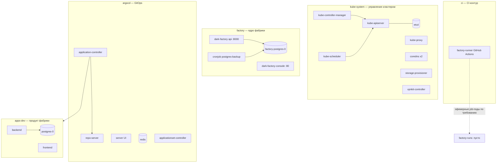

# Кластер Docker Desktop: контейнеры, назначение, необходимость

Справочник для человека: что за контейнеры запущены в локальном Kubernetes на Docker Desktop, зачем каждый нужен и можно ли без него обойтись. Полезен при ревизии ресурсов ноутбука (ADR-010: профиль 10–12 GB) и при разборе «а что это за под».

Данные — снимок 2026-09-18. Состояние кластера меняется; как собрать актуальное — раздел «Как обновить данные».

Общая топология:



## 1. kube-system — системные компоненты Kubernetes

«Цена входа» за Kubernetes как таковой ([ADR-010](../adr/ADR-010-local-k8s-helm-argocd.md)). Удалять нельзя, экономить на них нечего. Первые четыре — static pods, управляются самой VM Docker Desktop.

| Контейнер (образ) | Назначение | Необходимость |
|---|---|---|
| **kube-apiserver** (`registry.k8s.io/kube-apiserver:v1.32.2`) | Единственная точка входа в кластер: всё (kubectl, Argo CD, runner, Console) ходит через него. Слушает на IP VM `192.168.65.3` | **Обязателен** — сердце кластера |
| **etcd** (`etcd:3.5.16-0`) | Хранилище всего состояния кластера: объекты, секреты, статус узла | **Обязателен** — без него кластер «забывает» себя |
| **kube-controller-manager** (`v1.32.2`) | Циклы контроля: доводит фактическое состояние до желаемого (реплики Deployment, привязка PVC и т.д.) | **Обязателен** |
| **kube-scheduler** (`v1.32.2`) | Назначает поды на узлы | **Обязателен** (даже на одном узле) |
| **kube-proxy** (`v1.32.2`, DaemonSet) | Сетевые правила (iptables) для Service — благодаря ему работает маршрутизация ClusterIP | **Обязателен** |
| **coredns** ×2 (`coredns:v1.11.3`, svc `kube-dns`) | DNS кластера: `factory-postgres.factory.svc` и т.п. Две реплики — дефолт chart'а | **Обязателен**; 2 реплики для MVP избыточны, но безвредны |
| **storage-provisioner** (`docker/desktop-storage-provisioner:v3.0`) | Специфичен для Docker Desktop: автоматически создаёт hostPath-тома под PVC. Обслуживает диски обеих PostgreSQL и бэкапов (StorageClass `hostpath`) | **Обязателен в Docker Desktop** при использовании PVC |
| **vpnkit-controller** (`docker/desktop-vpnkit-controller:v4.0`) | Специфичен для Docker Desktop: сетевой мост host (macOS) ↔ VM — проброс портов, DNS, связь `localhost` с кластером | **Обязателен в Docker Desktop** (сетевой слой VM) |

## 2. argocd — GitOps-движок ([ADR-010](../adr/ADR-010-local-k8s-helm-argocd.md))

| Контейнер (образ) | Назначение | Необходимость |
|---|---|---|
| **application-controller** (`quay.io/argoproj/argocd:v3.5.3`, StatefulSet) | Ядро GitOps: сверяет желаемое состояние из git с фактическим в кластере, выполняет sync, считает health. Ведёт Applications `apps-dev`, `factory`, `product-1-dev` | **Обязателен** — без него нет GitOps-потока (revert-коммит = rollback) |
| **repo-server** (argocd v3.5.3) | Клонирует репозитории и рендерит манифесты (`helm template` чарта `charts/dark-factory` и др.) | **Обязателен** |
| **server** (argocd v3.5.3) | UI/API Argo CD — человек смотрит sync/health и дёргает синк | **Нужен для человека** (merge/sync-решения — человек, [ADR-011](../adr/ADR-011-risk-based-merge-release-policy.md)); чисто автоматическому контуру не нужен |
| **redis** (`redis:8.6.4-alpine`) | Кэш между controller/repo-server — меньше запросов к git и API | **Косвенно нужен**: часть штатной установки; без него деградация производительности, не функциональности |
| **applicationset-controller** (argocd v3.5.3) | Генерирует Applications из шаблонов | **Пока не нужен по факту**: ApplicationSet в кластере нет ни одного. Установлен в составе chart'а; можно убрать — выигрыш немного RAM |

## 3. factory — ядро фабрики

| Контейнер (образ) | Назначение | Необходимость |
|---|---|---|
| **api** (`dark-factory:local`, деплоймент `dark-factory`) | API фабрики: `factory api serve --host 0.0.0.0 --port 8000` (FastAPI). Отдаёт `/api/v1/runs` и прочее для Console; entry point процессной модели ([ADR-025](../adr/ADR-025-process-entry-point-and-lazy-composition.md)) | **Обязателен** — единственный постоянно живущий сервис ядра |
| **console** (`dark-factory-console:local`, деплоймент `dark-factory-console`) | Console MVP: React + nginx, порт 80 ([ADR-021](../adr/ADR-021-console-mvp-delivery.md)). Человек через него наблюдает runs и участвует в решениях | **Нужен для человека**; автоматическому конвейеру не обязателен, но это MVP-интерфейс участия ([ADR-018](../adr/ADR-018-human-participation-autonomous-execution.md)) |
| **postgres** (`postgres:16.4`, StatefulSet `factory-postgres-0`) | State store фабрики: таблицы переходов, lease/fencing, effect ledger, outbox, run records ([ADR-004](../adr/ADR-004-postgresql-factory-state.md), [ADR-016](../adr/ADR-016-postgresql-outbox.md), [ADR-024](../adr/ADR-024-durable-run-driver-and-composition-root.md)). PVC `data-factory-postgres-0` 5Gi | **Обязателен** — единственное durable-хранилище состояния; потеря = потеря всех запусков |
| **backup** (`postgres:16.4`, CronJob `factory-postgres-backup`, `30 2 * * *` UTC) | Ночной `pg_dump` через `/usr/local/bin/backup.sh` на PVC `factory-postgres-backups` (2Gi) | **Нужен для защиты данных**, к работе фабрики напрямую не привязан |

## 4. ci — CI-контур ([ADR-019](../adr/ADR-019-multi-provider-sc-ci-github-first.md), GitHub-first)

| Контейнер (образ) | Назначение | Необходимость |
|---|---|---|
| **runner** (`ghcr.io/actions/actions-runner`) | Self-hosted GitHub Actions runner, приписан к репозиторию с метками `factory,k8s`. Исполняет CI-джобы фабрики; ему выдан токен kube API (SA-токен/CA смонтированы файлами) и задан `FACTORY_JOB_NAMESPACE=factory-runs` | **Нужен для CI**: машинные гейты на MR идут через него. Без него кластер живёт, но проверки не исполняются |

## 5. factory-runs — эфемерные агентные джобы ([ADR-006](../adr/ADR-006-ephemeral-job-pods-reconciler-cronjob.md), [ADR-024](../adr/ADR-024-durable-run-driver-and-composition-root.md))

Сейчас **пусто** (только стандартный configmap). Namespace зарезервирован и подписан `component: agent-jobs`: сюда по требованию создаются одноразовые job-поды агентных стадий (durable-драйвер `factory run advance` / reconciler), живут минуты и исчезают. Постоянных контейнеров нет и не должно быть — пустое состояние здесь норма, а не поломка.

## 6. apps-dev — продукт, развёрнутый фабрикой

Не компоненты фабрики, а её «изделие»: деплой проверяет сам GitOps-контур в e2e-пилоте.

| Контейнер (образ) | Назначение | Необходимость |
|---|---|---|
| **backend** (`ghcr.io/vadagama/dark-factory-product-1-backend`, :8000) | Backend продукта product-1 | Нужен, пока идёт пилот; расходный материал эксперимента |
| **frontend** (`ghcr.io/vadagama/dark-factory-product-1-frontend`, :8080) | Фронтенд продукта | Аналогично |
| **postgres** (StatefulSet `dark-factory-product-1-postgres-0`) | БД продукта, PVC 5Gi | Аналогично |

## 7. default

Только служебный Service `kubernetes` (endpoint API-сервера). Подов нет — норма.

## Как обновить данные

Команды, которыми собран этот справочник:

```sh
# Поды и контейнеры кластера
kubectl get pods -A -o wide

# Образы каждого пода
kubectl get pods -A -o custom-columns='NS:.metadata.namespace,POD:.metadata.name,IMAGES:.spec.containers[*].image'

# Контроллеры (кто кем управляет)
kubectl get deploy,sts,ds,job,cronjob -A

# Сервисы и хранилище
kubectl get svc -A
kubectl get pvc -A

# GitOps-приложения Argo CD
kubectl get applications -n argocd
```

## Наблюдения на момент снимка (2026-09-18)

Зафиксированы как контекст, не как задачи:

1. **Бэкапы БД фабрики фактически не работали**: CronJob `factory-postgres-backup` — последняя успешная джоба за 3 дня до снимка, затем три подряд `DeadlineExceeded`. Резервной копии фактически нет — стоит проверить.
2. **Argo CD Application `factory` — OutOfSync / Missing** (источник: `charts/dark-factory` @ main): расхождение между git и кластером стоит разобрать.
3. **Кандидаты на экономию ресурсов** в MVP-профиле ноутбука: `applicationset-controller` (не используется) и вторая реплика coredns. Выигрыш небольшой; решение за владельцем.

## Связанные документы

- [ADR-010](../adr/ADR-010-local-k8s-helm-argocd.md) — локальный Kubernetes + Helm + Argo CD, ресурсный профиль.
- [ADR-021](../adr/ADR-021-console-mvp-delivery.md) — Console MVP.
- [ADR-004](../adr/ADR-004-postgresql-factory-state.md) / [ADR-016](../adr/ADR-016-postgresql-outbox.md) — state store и outbox.
- [ADR-006](../adr/ADR-006-ephemeral-job-pods-reconciler-cronjob.md) / [ADR-024](../adr/ADR-024-durable-run-driver-and-composition-root.md) / [ADR-025](../adr/ADR-025-process-entry-point-and-lazy-composition.md) — эфемерные джобы, durable-драйвер, entry point.
- [ADR-019](../adr/ADR-019-multi-provider-sc-ci-github-first.md) — GitHub-first CI.
- [ADR-011](../adr/ADR-011-risk-based-merge-release-policy.md) — merge/release policy.
- [ADR-018](../adr/ADR-018-human-participation-autonomous-execution.md) — участие человека.
