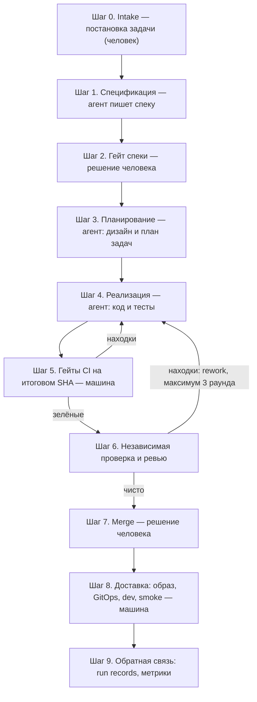

# Ретроспектива: как фабрика создаёт продукт dark-factory-product-1 — процесс по шагам

Вторая ретроспектива пилота. Первая ([retrospective-dark-factory-product-1.md](./retrospective-dark-factory-product-1.md))
— о жизни репозитория продукта: паки, bootstrap, деплой. Здесь — о
**производственном процессе**: как задача превращается в работающий код
продукта внутри фабрики, какие артефакты создаёт каждая стадия и где в этом
процессе есть человек.

Основа — живой прогон инкремента 1 пилота T043: 10 реальных задач
(`chg_t043_p01…p10`, 5 quick R1 + 5 standard R2), зарегистрированных в фабрике
18 сентября 2026. Прогон продолжается; для каждой стадии отмечено, что уже
доказано живьём, а что пока работает по дизайну.

**Легенда:** 👤 — действие человека. Всё остальное делают агенты и автоматика.

---

## 1. Конвейер одним взглядом

Стадии конвейера (так они называются в фабрике): `specification → planning →
construction → review_verification → release`. На каждой — свои гейты:
часть машинные (CI, проверки качества), часть — человеческие решения.

---

## 2. Шаг 0. Intake: задача становится изменением

Человек формулирует, **что** нужно сделать; фабрика регистрирует единицу
изменения. Здесь задаётся риск-класс — от него зависит строгость всего
дальнейшего маршрута.

| | |
|---|---|
| **Кто** | 👤 человек (постановка) + фабрика (регистрация) |
| **Артефакты** | Запись изменения в фабрике: ID (`chg_t043_p01…p10`), название, описание, риск-класс (R1/R2); пустой run, который ждёт продвижения |
| **Человек** | Формулирует задачи и регистрирует их — матрица 10 задач финализирована в `deploy/local/pilot/tasks.json` |

**На product-1:** зарегистрированы 10 задач — от «документировать API в
README» (quick, R1) до «фича backend+frontend» (standard, R2). Повторный
intake безопасен — дубликаты отсеиваются.

---

## 3. Шаг 1. Спецификация: агент пишет спеку

Первая агентная стадия. Агент работает в изолированной копии продуктового
репозитория, читает baseline и задачу, формулирует требования, и публикует
результат в продукт как change request (CR). У агента нет прав мержить —
только создать ветку и CR.

| | |
|---|---|
| **Кто** | агент (роль `product`), автономно |
| **Артефакты** | Спека изменения в продукте: дельта требований, критерии приёмки, сценарии; ветка в продуктовом репозитории; change request с описанием; зелёный CI на спеке |
| **Человек** | — (кроме постановки задачи на шаге 0) |

**На product-1:** опубликованы **9 спецификаций из 10** — CR `product-1#1`–`#9`
(p02→#1, p03→#2, p05→#3, p06→#4, p07→#5, p10→#6, p04→#7, p08→#8, p09→#9);
p01 дождётся пере-intake. Попытки агента видны: например, p04 пережила две
заблокированные попытки из-за ошибок инструментов — после доводки
p08/p09 опубликовали спеки с первой попытки.

---

## 4. Шаг 2. Гейт спеки: решение человека

Спека — человеческое решение (ADR-018): что именно строить, утверждает
человек, а не машина. Стадия останавливается в состоянии waiting и ждёт.

| | |
|---|---|
| **Кто** | 👤 человек |
| **Артефакты** | Мерж CR в продукте (или approval через Console/API с привязкой к ревизии); фабрика фиксирует прохождение гейта, привязанное к конкретной ревизии |
| **Человек** | Решение выражается самым наблюдаемым действием — мержем CR: отдельная форма «согласования» не обязательна |

**На product-1:** оператор смержил все 9 спек-CR одним махом (без формального
ревью) — и это сработало: наблюдаемый merge оказался сильнейшей формой
ответа на гейт. По пути был починен резолв гейта: до фикса (PR #88)
мерж чисто human-gated стадии не снимал waiting.

---

## 5. Шаг 3. Планирование: агент проектирует реализацию

Агент превращает согласованную спеку в план: как менять код, какие файлы и
модули затронутся, в каком порядке, какие ограничения соблюдать. Для задач
повышенного риска (R2+) конвейер дополнительно требует зафиксированных
человеческих решений — контрольных точек, привязанных к ревизии.

| | |
|---|---|
| **Кто** | агент (architect/design), автономно |
| **Артефакты** | Дизайн изменения и граф задач (что делается, что чем обосновано и в каком порядке); граница автономии реализации — scope, критерии, ограничения; CI на артефактах планирования |
| **Человек** | On-the-loop; для R2+ — контрольные точки (решения человека по риску) |

**На product-1:** стадии p02–p10 продвинуты в planning; следующий advance
каждой запускает агента планирования (расход LLM). Гейт планирования —
машинный (CI на артефактах); починка «планирование дождётся CI» — PR #89.

---

## 6. Шаг 4. Реализация: агент пишет код

Самая автономная часть конвейера — человек из неё исключён полностью
(Human-off-the-loop). Агент реализует изменение по согласованному плану в
ветке задачи, сам пишет тесты, сам коммитит.

| | |
|---|---|
| **Кто** | агент (develop), автономно |
| **Артефакты** | Код и тесты в ветке задачи; коммиты; evidence прогона; CR (MR) с описанием работы и доказательствами проверок |
| **Человек** | — (вмешательство = только через ответы на вопросы и находки ревью) |

**На product-1:** по дизайну; до этой стадии живой прогон ещё не дошёл —
пилот на шаге 3.

---

## 7. Шаг 5. Гейты CI на итоговом SHA

Машина проверяет итоговый коммит ветки, а не «какие-то» коммиты: типизация,
тесты, UI-гейты, безопасность, сборка. Fail-closed: красный гейт — merge
невозможен; пропущенная обязательная проверка зелёной не считается.

| | |
|---|---|
| **Кто** | машина (CI продукта, 9 джоб) |
| **Артефакты** | Результаты гейтов, привязанные к итоговому SHA; при сборке — immutable digest-образы |
| **Человек** | — (кроме случаев, когда нужно выключить тяжёлый этап переменной пайплайна — и вернуть перед merge) |

**На product-1:** механика доказана живьём ещё на инкременте 0 — 4 прогона CI
продукта, финальный 9/9; в пилоте гейты на спеках тоже зелёные.

---

## 8. Шаг 6. Независимая проверка и реворк

Агент-проверяющий смотрит на работу свежим контекстом: вердикт по каждому
критерию приёмки, находки. Блокирующие находки уходят на доработку —
максимум 3 раунда, дальше эскалация человеку. Каждый новый коммит в ветке
обнуляет прежние допуски: всё проверяется заново.

| | |
|---|---|
| **Кто** | агент (quality) + машина |
| **Артефакты** | Вердикты по критериям, список находок, evidence; после доработки — новый SHA и повторный прогон гейтов |
| **Человек** | On-the-loop: вмешивается по исключениям; ответы оставляет в CR/Console |

**На product-1:** по дизайну; живых раундов rework пока не было.

---

## 9. Шаг 7. Merge: решение человека

Единственная точка, где изменённый код попадает в `main` продукта. Merge
делает только человек — агентам merge-полномочий нет (ADR-011). Согласование
привязано к итоговому SHA: новый коммит — прежний допуск недействителен.

| | |
|---|---|
| **Кто** | 👤 человек |
| **Артефакты** | Squash-merge в `main`; зафиксированное human-решение на гейте merge |
| **Человек** | Ревьюит CR (summary + evidence в описании), ставит approval, мержит |

**На product-1:** для кода задач — впереди; правило уже сработало на спеках
(9 мержей оператора) и на всех 89+ PR самой фабрики.

---

## 10. Шаг 8. Доставка: образ → GitOps → dev → smoke

После merge человек больше не нужен: доверенный финализатор фабрики сам
публикует образ по неизменяемому digest, обновляет GitOps-репозиторий и
мержит его MR; Argo докатывает новый digest в dev-окружение; smoke-проверка
фиксирует релиз. Откат — revert GitOps-коммита, продуктовый репозиторий не
трогается.

| | |
|---|---|
| **Кто** | машина (финализатор, Argo CD) |
| **Артефакты** | Образы `sha-<коммит>`, GitOps-MR с новым digest, Application в dev, smoke-результат, запись релиза |
| **Человек** | — (в dev; prod и вне запланированных вмешательств — 👤) |

**На product-1:** живой цикл «образы CI → GitOps-MR с digest → Argo →
apps-dev → smoke» пройден целиком на инкременте 0 (деплой и зелёный smoke);
автоматизация этого цикла для каждой задачи — за живым прогоном пилота.

---

## 11. Шаг 9. Обратная связь

Каждая попытка каждой стадии оставляет след: результат стадии, расход,
свидетельства проверок. Из этого собираются метрики пилота и уроки, которые
возвращаются в правила фабрики.

| | |
|---|---|
| **Кто** | машина + 👤 человек (анализ) |
| **Артефакты** | Run records, метрики (стоимость с попытками, принятые с первого прохода, раунды rework, ручные вмешательства), журнал отклонений, предложения в правила |
| **Человек** | Читает журнал, решает, что менять в конвейере |

**На product-1:** журнал ведётся с первого дня (`docs/t043-pilot-journal.md`);
12 дефектов доводки драйвера найдены и закрыты именно через этот контур
(PR #85, #86, #88, #89) — конвейер учится на собственном живом прогоне.

---

## 12. Как управляют прогоном (бытовая механика)

Не технические детали, но полезно понимать, как процесс «едет»:

- **Одна команда — одна стадия.** `factory run advance` исполняет ровно одну
  стадию одного запуска; повтор безопасен (replay-first). Есть цикл по всем
  десяти задачам.
- **Waiting — это норма, а не ошибка.** Стадия честно ждёт: человека
  (гейт), зелёного CI или решения; blocked — ждёт человека уже с проблемой,
  которую автоматика не может обойти.
- **Агенты работают в изоляции.** Каждая попытка — отдельная рабочая копия
  репозитория; параллельные прогоны одного изменения запрещены.
- **Ответы на гейты — только через человека:** Console или команда approval с
  привязкой к ревизии; либо, как показала практика, просто merge CR —
  наблюдаемое человеческое действие.
- **Решения не подделываются.** Агенты не аппрувят и не мержат — у них нет ни
  полномочий, ни токенов на это.

---

## 13. Где участвовал человек: процессная сводка

| Шаг | Человек | Форма участия |
|---|---|---|
| Intake | 👤 | Постановка: что строим, риск-класс |
| Гейт спеки | 👤 | Утверждение спеки (мерж 9 CR) — единственное обязательное решение до кода |
| Контрольные точки R2+ | 👤 | Решения по риску, привязанные к ревизии |
| Гейты CI / реализация / доставка | — | Полностью без человека |
| Ревью и merge кода | 👤 | Approval + squash-merge (впереди в пилоте) |
| Исключения (blocked, эскалации) | 👤 | По факту возникновения |
| Обратная связь | 👤 | Разбор журнала, правила |

Формула подтверждается: **намерение и необратимый выпуск — человек;
исполнение и проверки — фабрика.** На 10 задач пилота до кода человек
потребовался ровно один раз на задачу — на гейте спеки.

---

## 14. Статус на product-1: доказано живьём и что впереди

| Участок процесса | Статус |
|---|---|
| Intake → registry | ✅ живьём, 10 задач |
| Спецификация (агент) | ✅ живьём, 9 спек опубликованы |
| Гейт спеки (человек) | ✅ живьём, 9 мержей оператора |
| Планирование (агент) | 🔄 запущено: p02–p10 в planning |
| Реализация, CI, ревью, rework | ⏳ по дизайну; живой прогон — за пилотом |
| Merge кода (человек) | ⏳ правило доказано на спеках и на PR фабрики |
| Доставка после merge | ✅ механика доказана на инкременте 0; по-задачная автоматизация — за пилотом |
| Метрики и DoD ≥7/10 | 🔄 копятся; отчёт по SC-001…SC-008 — финал пилота |

---

## Источники

- `docs/t043-pilot-journal.md` — живой журнал инкремента 1 (попытки, гейты,
  дефекты доводки).
- `docs/plan-t043-e2e-pilot.md` — план пилота, матрица задач, метрики.
- `deploy/local/pilot/README.md`, `deploy/local/pilot/tasks.json` — матрица
  10 задач и операторские сценарии.
- `docs/descriptions/crm-end-to-end-flow.md` — каноническая модель конвейера
  (стадии, гейты, режимы человека, ADR-018).
- `docs/instructions/work-with-gitlab-product.md`,
  `docs/instructions/run-spec-approval-us2.md`,
  `docs/instructions/run-review-rework-us3.md` — человеческая сторона
  процесса.
- `src/dark_factory/changes/enums.py` — канонические имена стадий и гейтов.
- Git-история фабрики: PR #85, #86, #88, #89 — доводка драйвера на живом
  прогоне.
