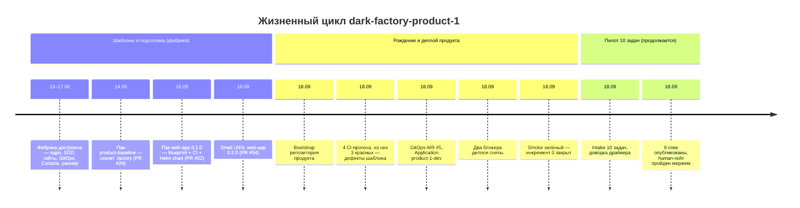

# Ретроспектива: dark-factory-product-1 — от замысла до деплоя

История первого продукта, проведённого через фабрику end-to-end: пилотного
репозитория `vadagama/dark-factory-product-1` (private, GitHub). Документ —
пошаговая ретроспектива: какие шаги проходил продукт, какие артефакты
создавались на каждом шаге и где участвовал человек. Без технических деталей —
они остались в источниках (раздел «Источники»).

**Период:** 13–18 сентября 2026. **Статус:** инкремент 0 (деплой) закрыт;
инкремент 1 (пилот 10 задач) продолжается.

**Легенда:** 👤 — действие человека (оператора/владельца). Всё без помечки
сделано фабрикой — агентами, CI или автоматикой.

---

## 1. Хронология одним взглядом

---

## 2. Предыстория: фабрика достроена (13–17 сентября)

Продукт не появился из ничего: сначала фабрика довела себя до состояния,
в котором способна произвести и развернуть чужой репозиторий. За пять дней
слиты ~80 PR — от каркаса до Console; каждый мерж — 👤.

| Что появилось | Артефакты |
|---|---|
| Ядро конвейера: стадии, гейты, merge-политика, rework-циклы | `src/dark_factory/`, спецификация Native SDD Core, ADR-001…ADR-027 |
| GitOps-контур: Kubernetes (Docker Desktop), Helm, Argo CD, immutable-образы | `deploy/`, `charts/`, репозиторий `dark-factory-gitops`, окружения `factory` и `apps-dev` |
| Console (6 экранов) и durable-раннер (T-092) — последняя деталь перед пилотом | `console/`, `factory run advance` |

К этому моменту всё было проверено на тестах и макетах, но живого продукта
ещё не существовало.

---

## 3. Этап 1. Шаблоны, из которых собран продукт (14–16 сентября)

Продукт рождается из engineering-паков — шаблонов, по которым фабрика
разворачивает новый репозиторий. Три пака, три MR, все смержены 👤:

| Шаг | Артефакты | Человек |
|---|---|---|
| Пак `product-baseline` (T-022, PR #24, 14.09) | Скелет `.factory/` для продуктовых репозиториев: `factory.yaml`, baseline-ноды (требования, сценарии, решения, возможности), канонический скелет ChangeSet, правила минимальных изменений | мерж 👤 |
| Пак `web-app` 0.1.0 (T-070, PR #52, 16.09) | Blueprint web-приложения (backend + frontend + БД), собственный CI продукта (9 джоб), Dockerfile'ы, Helm chart приложения, тестовые конвенции | мерж 👤 |
| Пак `ui` 0.1.0 + web-app 0.2.0 (T-071, PR #54, 16.09) | Small UIKit: токены, 12 компонентов + 5 паттернов, Storybook, 4 UI-гейта; копия кита внутри blueprint | мерж 👤; WCAG-приёмка неавтоматизируемых критериев — 👤 по правилам кита |

На этом этапе продукт существовал только как шаблон в `packs/`.

---

## 4. Этап 2. Решение о пилоте (18 сентября)

| Шаг | Артефакты | Человек |
|---|---|---|
| Утверждён план T043 — E2E-пилот: 10 реальных задач (5 quick R1 + 5 standard R2) через полный цикл intake → спека → реализация → MR → CI → merge → образ → GitOps → dev → smoke | `docs/plan-t043-e2e-pilot.md`; критерий успеха — ≥7/10 задач e2e без ручных правок артефактов агента | 👤 утвердил план |
| Матрица задач финализирована: от «документировать API в README» до «фича backend+frontend» | `deploy/local/pilot/tasks.json` (chg_t043_p01…p10) | 👤 финализировал |

---

## 5. Этап 3. Bootstrap продукта (18 сентября, инкремент 0)

Рождение репозитория. По определению bootstrap это операторское
развёртывание — вне конвейера:

| Шаг | Артефакты | Человек |
|---|---|---|
| Создан приватный репозиторий продукта | `vadagama/dark-factory-product-1` | 👤 |
| Применены паки: blueprint web-app + baseline `.factory/`, заменены плейсхолдеры (22 файла), baseline проверен фабричным адаптером | Структура продукта: `backend/`, `frontend/`, `deploy/`, `.factory/`, `README.md` | 👤 |
| Bootstrap-коммит запушен в `main` | Коммит `940b3ae` — точка рождения продукта | 👤 |

---

## 6. Этап 4. Первые сборки: CI учит шаблон (18 сентября)

Собственный CI продукта — первый настоящий исполнитель шаблона. Структурная
валидация паков не поймала того, что поймал живой CI. Три красных прогона,
каждый — дефект не продукта, а шаблона пака; все фиксы сделаны канонично
в паке (0.2.0 → 0.2.1) и зеркально в продукте:

| Прогон | Что поймал CI | Артефакты | Человек |
|---|---|---|---|
| run 1 | Backend не импортируется без переменной окружения БД; строгая типизация спотыкается о настройки тестов | Фиксы в паке: фабричная сборка приложения + изоляция тестов | — |
| run 2 | Сканер безопасности бракует устаревший пакет в базовом образе (тэг базы upstream не пересобран) | Фикс в паке: обновление OS-пакетов в runtime-стадии | — |
| run 3 | Сканер снова бракует — на этот раз библиотеку, вшитую в колесо зависимости версии 3.3 | Фикс в паке: верхний пин версии `<3.3` | — |
| run 4 | Всё зелёное | CI 9/9 джоб; два immutable digest-образа (backend, frontend) опубликованы в ghcr | — |

Фиксы всех трёх красных прогонов собраны в паке web-app 0.2.1 и ушли одним
PR — мерж 👤 (PR #82).

Ключевой урок этапа: дефект шаблона обязан чиниться в паке — иначе bootstrap
следующего продукта воспроизведёт тот же баг.

---

## 7. Этап 5. Прописка в окружении: GitOps (18 сентября)

Продукт должен появиться в dev-окружении как желаемое состояние в git:

| Шаг | Артефакты | Человек |
|---|---|---|
| GitOps-MR: каталог продукта с чартом (digest-пины образов), дочернее Application `product-1-dev` | MR `dark-factory-gitops#5` | — |
| Seed-fixture (временный busybox-стенд DoD) удалена — продукт занял её квоту (1 CPU) | Удаление `envs/dev/pilot/` из gitops; старый Application `pilot-dev` снят | 👤 снял руками (root-app не удаляет ресурсы автоматически) |
| Секрет БД продукта создан вне git (пароль не попадает в репозиторий) | Secret `dark-factory-product-1-db` в `apps-dev` | 👤 создал |
| MR смержен admin-override — на GitHub Free формальное требование ревью обходит владелец | Мерж MR #5 (TD-026); зафиксировано: admin-merge = то же ручное решение человека | 👤 |

Argo создал Application `product-1-dev` — и начался деплой.

---

## 8. Этап 6. Деплой: два блокера (18 сентября)

Оба блокера вскрыты только живым кластером; оба закрыты фиксами в паке или
действием человека:

| Блокер | Что происходило | Разрешение | Человек |
|---|---|---|---|
| Первый запуск: миграционный хук стартует раньше, чем поднимается БД продукта, и не может к ней подключиться | first-install deadlock: 26+ неудачных попыток | Фикс канонично в паке: хук перенесён на фазу после установки + обёртка ожидания БД (30 попыток × 5 с); следствие зафиксировано в шаблоне — миграции должны быть обратно совместимыми (expand/contract) | мерж 👤 |
| Кластер не может скачать образы: пакеты ghcr, запушенные из приватного репозитория, создаются приватными, а API GitHub не позволяет сменить видимость | ErrImagePull unauthorized | 👤 сделал оба пакета публичными в GitHub UI (toy-образы с digest-пинами); на будущее для приватных продуктов — imagePullSecret в чарте пака | 👤 (TD-029) |

Итог: поды backend / frontend / postgres Running, миграции прошли,
Application `product-1-dev` — Synced/Healthy (gitops-ревизия `b7da87f`).

---

## 9. Этап 7. Smoke и закрытие инкремента 0 (18 сентября)

| Шаг | Артефакты | Человек |
|---|---|---|
| Smoke-проверка живого деплоя | `GET /api/healthz` → `{"status":"ok","database":"ok"}`; `GET /` → HTTP 200 (страница с заголовком продукта) | — |
| Закрыты цели и долги: DoD T-070 «blueprint разворачивается в apps-dev», TD-010, TD-029 | Записи в `docs/tech-dept.md`, журнал пилота | — |
| Документация актуализирована по итогам живого прогона | `docs/descriptions/crm-end-to-end-flow.md` (PR #83), каталог контейнеров кластера (PR #84) — мержи 👤 | 👤 |
| Наблюдение на будущее | Переустановка релиза пересоздаёт PVC и теряет данные БД → правило: обновлять релиз только upgrade'ом (или revert-коммитом в gitops) | — |

Живой цикл «образы CI → GitOps-MR с digest → Argo → apps-dev → smoke»
пройден целиком. Продукт работает в dev.

---

## 10. Этап 8. После деплоя: пилот 10 задач (18 сентября, продолжается)

Продукт стал рабочим телом для главной цели T043 — прогнать через фабрику
10 реальных задач:

| Шаг | Артефакты | Человек |
|---|---|---|
| Подготовлено окружение пилота: зеркало продукта для агент-стадий, проброс БД, драйвер прогона | `deploy/local/pilot/` (increment-1.sh, pilot_api.py, tasks.json); зеркало `df-mirrors/…/dark-factory-product-1` | 👤 подготовил зеркало и окружение |
| Задачи зарегистрированы в фабрике | 10 изменений `chg_t043_p01…p10` в state store | — |
| Живой прогон вскрыл дефекты доводки драйвера — фабрика учится работать вживую | 11 фиксов в трёх PR (#85, #86, #88): например, ошибки инструментов больше не роняют попытку агента, а возвращаются модели текстом; мерж спек-CR человеком теперь корректно снимает human-гейт | мержи 👤 |
| Агенты опубликовали 9 спецификаций из 10 (p01 дождётся пере-intake) | 9 change request'ов в продукте: `product-1#1`–`#9`, CI зелёный | — |
| Спеки — человеческое решение (ADR-018): все 9 CR ждут human-гейта | 9 карточек в состоянии waiting | 👤 решил |
| 👤 Оператор выразил решения мержем всех 9 спек-CR | 9 мержей в продуктовом репозитории; фабрика засчитала их как прохождение гейтов | 👤 |
| Стадии p02–p10 продвинуты в планирование (следующий шаг запускает агента планирования) | Раны в planning; p01 — пере-intake после подтверждения резолва | — |

На момент ретроспективы пилот на стадии «планирование → реализация»;
метрики (стоимость с попытками, принятые с первого прохода, раунды rework,
ручные вмешательства) копятся в журнале; отчёт по SC-001…SC-008 — вперёд.

---

## 11. Сводка: где участвовал человек

Формула конвейера — решения и необратимый выпуск за человеком, исполнение
и проверки за машиной. На продукте product-1 она подтвердилась:

| Момент | Что сделал человек | Почему не машина |
|---|---|---|
| Вся фабрика до пилота | Смержил ~80 PR (и продолжает) | merge — человек (ADR-011) |
| Bootstrap продукта | Создал репозиторий, применил паки, запушил первый коммит | bootstrap по определению — операторское развёртывание вне конвейера |
| Секрет БД | Создал вне git | секреты никогда не в git |
| GitOps-MR | Admin-merge | на GitHub Free требование ревью обходится только владельцем; решение всё равно ручное |
| Снятие fixture | Удалил старый Application руками | автоматика root-app не удаляет ресурсы |
| Видимость ghcr-пакетов | Сделал пакеты публичными в UI | API GitHub не позволяет сменить видимость — граница автоматизации провайдера |
| Спеки задач | Смержил все 9 спек-CR | спека — человеческое решение (ADR-018) |
| Точки waiting/blocked | Все решения гейтов approval/merge — только человек | агенты не аппрувят и не мержат (ADR-011) |

Характерно: даже «безформальное» решение (мерж CR без формального ревью)
машина распознала как человеческое — наблюдаемый merge оказался сильнейшей
формой ответа на гейт.

---

## 12. Уроки

- **Шаблон валидируется структурно, но живой CI — первый настоящий
  исполнитель.** Пять дефектов пака поймал только реальный прогон; все
  чинились канонично в паке, а не точечно в продукте.
- **Fail-closed проверки ловят невидимое.** Три из пяти дефектов шаблона и
  оба блокера деплоя не были видны ни на рендере, ни в тестах — их принес
  только живой контур (сканер образов, кластер, квоты).
- **Границы API провайдера — точки ручного вмешательства.** Смена видимости
  пакетов оказалась недоступна автоматике — и честно легла на человека.
- **Квоты окружения — реальное ограничение.** Продукт занял 1 CPU, и
  временный fixture-стенд уступил ему место.
- **Human-гейт работает и в мягкой форме.** Девять мержей спек — единственные
  решения, которые потребовались от человека на 10 задач, и их оказалось
  достаточно, чтобы конвейер двинулся дальше.

---

## 13. Что осталось (на момент ретроспективы)

- Провести p02–p10 через планирование → реализацию → MR → merge → релиз;
  пере-intake p01.
- Собрать метрики пилота (vision §7, FR-024) и отчёт по SC-001…SC-008.
- Закрыть DoD T043: ≥7/10 задач e2e без ручных правок артефактов агента.

---

## Источники

- `docs/plan-t043-e2e-pilot.md` — план пилота, инкременты 0 и 1.
- `docs/t043-pilot-journal.md` — журнал отклонений и решений.
- `specs/001-dark-factory-mvp/tasks.md` — T-018 (T-022), T-041 (T-070),
  T-042 (T-071), T-043 (T-072).
- `docs/tech-dept.md` — TD-010, TD-020, TD-025, TD-026, TD-028, TD-029.
- `deploy/local/pilot/README.md`, `deploy/local/pilot/tasks.json` — матрица
  задач и операторские сценарии.
- `docs/descriptions/crm-end-to-end-flow.md` — сквозной сценарий фабрики.
- Git-история фабрики (PR #24, #52, #54, #81–#89) и gitops-репозитория
  (MR #5).
