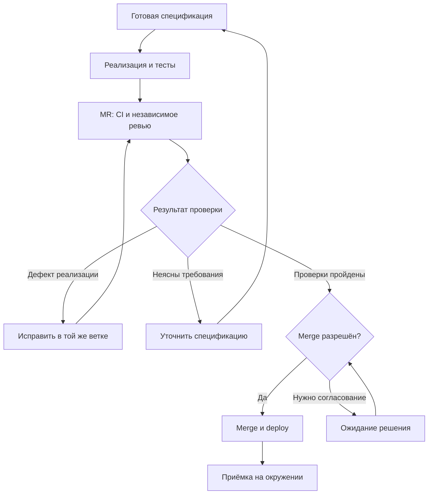
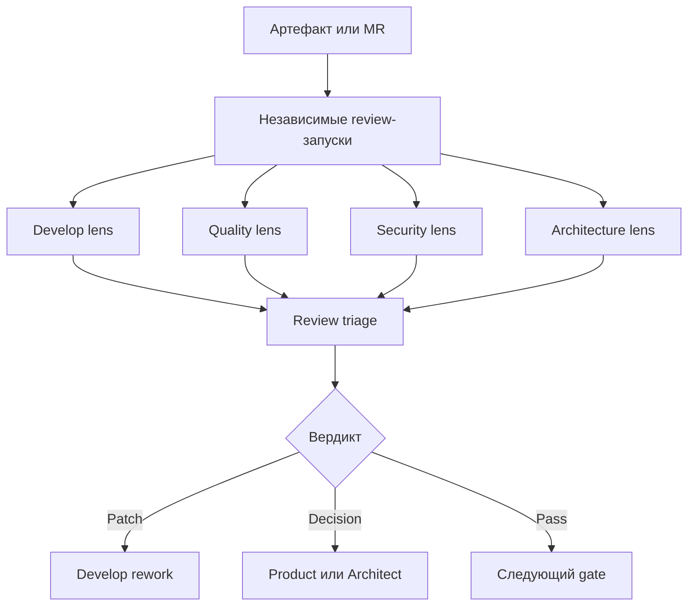
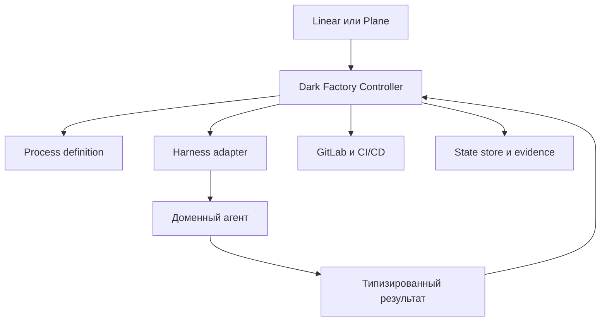

<!--
Источник: Notion — Агенты
URL: https://app.notion.com/p/3d9db33037c880f095b8e6ebf35f27f1
Выгружено: 2026-09-12
-->

# Агенты

**Для Factory MVP я предлагаю один процесс из восьми шагов, четыре профиля агентов и небольшую библиотеку навыков.** Основой прикладных правил станет agent-flow; BMAD добавит качественную проработку задачи и проверку результата; AI-DLC — управление этапами и доказательствами их прохождения; dmtools — автономный цикл работы с задачами и MR.

Для твоих приложений на FastAPI, PostgreSQL, React и Small UIKit это позволит автоматизировать путь от согласованной задачи до проверенного развёртывания, сохранив возможность менять harness.

Сначала существенное уточнение по источникам: **текущие BMAD и AI-DLC уже развитее, чем модель «набор Markdown-инструкций».** В актуальном `aidlc-workflows/main` описаны независимое от harness ядро, детерминированный движок, сохраняемое состояние и профили процесса. В BMAD есть `bmad-build-auto` для автономной реализации одной задачи; он оставляет структурированный результат и локальный коммит, но не выполняет push. Поэтому собственную фабрику следует проектировать с учётом этих возможностей. [AI-DLC](https://github.com/awslabs/aidlc-workflows), [BMAD Build Auto](https://docs.bmad-method.org/build/autonomous-development-loops/).

Ниже — **предлагаемая архитектура Factory**, а не описание готового функционала одного из этих проектов.

**Из каждого источника стоит взять конкретную часть.**

<table header-row="true">
<tr>
<td>Источник</td>
<td>Что переносим</td>
<td>Как адаптируем для MVP</td>
</tr>
<tr>
<td>**agent-flow**</td>
<td>OpenSpec, правила `SM-*`, исследование существующего кода, solution review, отдельный контекст ревьюера, ограничения итераций</td>
<td>Объединяем дубли FE/BE; добавляем FastAPI; выносим интеграции и переходы процесса из промптов</td>
</tr>
<tr>
<td>**BMAD**</td>
<td>Глубину анализа по сложности задачи; проверку требований, архитектуры и UX; проверку обоснованности замечаний</td>
<td>Четыре профиля агентов; подробные PRD и архитектурные документы только при необходимости</td>
</tr>
<tr>
<td>**AI-DLC**</td>
<td>Профили маршрута, явные этапы и gates, связь решения с проверяемыми артефактами, возобновление процесса</td>
<td>Один основной маршрут и короткий вариант; ограниченный набор состояний и проверок</td>
</tr>
<tr>
<td>**dmtools-agents**</td>
<td>Получение задач, подготовку рабочего окружения, структурированные результаты, создание PR, review → rework → merge</td>
<td>GitLab вместо GitHub; Linear либо Plane вместо Jira; переходы через программные адаптеры</td>
</tr>
</table>

В загруженном agent-flow эта основа уже хорошо видна в `spec`, `solution-review`, `implement`, `sm-mr-reviewer` и QA-навыках. Однако `implement` оставляет MR, CI и stage человеку, а `turnkey` требует отдельных подтверждений спеки и коммита. Для автономной Factory это нужно **явно переработать в отдельном профиле процесса**, сохранив интерактивный профиль для обычной работы команды.

BMAD полезен именно адаптивностью: его документация допускает короткую спецификацию для понятного изменения и дополнительное планирование, когда есть неоднозначность или архитектурный риск. AI-DLC также разделяет профиль маршрута, глубину проработки и стратегию тестирования. [Планирование BMAD](https://docs.bmad-method.org/plan/choose-a-planning-path/), [Профили AI-DLC](https://github.com/awslabs/aidlc-workflows/blob/main/docs/guide/workflow-profiles.md).

**Процесс должен управляться Factory, а каждый запуск агента — выполнять ограниченное задание.**

<table header-row="true">
<tr>
<td>Сущность</td>
<td>На какой вопрос отвечает</td>
<td>Пример</td>
</tr>
<tr>
<td>**Process**</td>
<td>Что выполняется следующим и при каких условиях?</td>
<td>После замечаний ревью — исправление, затем повторная проверка</td>
</tr>
<tr>
<td>**Agent**</td>
<td>Кто выполняет интеллектуальную работу и с какими полномочиями?</td>
<td>Reviewer читает код и проверяет результат</td>
</tr>
<tr>
<td>**Skill**</td>
<td>Как выполнить определённую работу?</td>
<td>Подготовить спецификацию, проверить миграцию</td>
</tr>
<tr>
<td>**Rule**</td>
<td>Какие ограничения обязательны?</td>
<td>Изменение прав доступа требует заданного gate</td>
</tr>
<tr>
<td>**Reference**</td>
<td>Какие знания и примеры использовать?</td>
<td>Эталон FastAPI endpoint, каталог компонентов UIKit</td>
</tr>
<tr>
<td>**Tool / adapter**</td>
<td>Как выполнить внешнее действие?</td>
<td>Прочитать задачу, создать MR, получить результат CI</td>
</tr>
<tr>
<td>**Artifact / evidence**</td>
<td>Что произведено и чем подтверждён результат?</td>
<td>Спецификация, diff, отчёт тестов, review</td>
</tr>
<tr>
<td>**Harness**</td>
<td>Как запустить агента с моделью, контекстом и инструментами?</td>
<td>Первый адаптер исполнения на PydanticAI</td>
</tr>
</table>

Это разделение устраняет типичное дублирование: навык не хранит собственный цикл разработки, агент не выбирает следующий этап всего проекта, а референс не содержит скрытых правил согласования.

**Основной маршрут Factory я бы сделал таким.**

<table header-row="true">
<tr>
<td>Шаг</td>
<td>Что происходит</td>
<td>Исполнитель</td>
<td>Результат и условие перехода</td>
</tr>
<tr>
<td>**1. Intake**</td>
<td>Получить задачу, репозиторий, источники, зависимости; определить профиль и риск</td>
<td>Код Factory + Analyst при необходимости</td>
<td>Задача доступна для выполнения; зависимости выполнены</td>
</tr>
<tr>
<td>**2. Understand**</td>
<td>Проверить текущее поведение, уточнить scope, сценарии, AC и пробелы</td>
<td>Analyst</td>
<td>Проверяемые требования; существенные вопросы закрыты</td>
</tr>
<tr>
<td>**3. Specify & plan**</td>
<td>Определить решение, контракты, изменения данных, UI и порядок работ</td>
<td>Solution</td>
<td>OpenSpec change и план проверок</td>
</tr>
<tr>
<td>**4. Ready gate**</td>
<td>Независимо проверить полноту и реализуемость; получить требуемое согласование</td>
<td>Reviewer + код gate</td>
<td>Зафиксирована разрешённая к реализации версия спецификации</td>
</tr>
<tr>
<td>**5. Build**</td>
<td>Реализовать вертикальный срез, добавить тесты, выполнить локальные проверки</td>
<td>Builder</td>
<td>Коммит в рабочей ветке; результаты проверок</td>
</tr>
<tr>
<td>**6. Verify & review**</td>
<td>Создать или обновить MR, выполнить CI и независимое ревью; обработать замечания</td>
<td>Адаптеры + Reviewer + Builder</td>
<td>Зелёные проверки и отсутствие блокирующих замечаний для актуального кода</td>
</tr>
<tr>
<td>**7. Merge & deploy**</td>
<td>Проверить политику merge, выполнить merge и pipeline развёртывания</td>
<td>Код Factory + GitLab CI</td>
<td>Зафиксированы результат merge и развёрнутый артефакт</td>
</tr>
<tr>
<td>**8. Accept & close**</td>
<td>Выполнить smoke/приёмку на целевом окружении, обновить задачу и знания</td>
<td>Проверки + Reviewer при необходимости</td>
<td>Подтверждён результат поставки либо создан блокер</td>
</tr>
</table>

Для описания жизненного цикла эти шаги можно сгруппировать в **Inception → Construction → Delivery & feedback**. Это удобное укрупнение для Factory, а не точное воспроизведение фаз текущей версии AI-DLC.

Ключевой цикл автономности:



**Для MVP достаточно двух маршрутов и отдельной политики риска.**

<table header-row="true">
<tr>
<td>Маршрут</td>
<td>Применимость</td>
<td>Отличие</td>
</tr>
<tr>
<td>`standard`</td>
<td>Новая функция, новый экран, изменение бизнес-логики</td>
<td>Все восемь шагов</td>
</tr>
<tr>
<td>`quick`</td>
<td>Понятный локальный дефект или небольшая доработка</td>
<td>Understand и Specify сокращены; независимые проверки сохраняются</td>
</tr>
</table>

Новый продукт проходит `standard`: сначала согласуются общая архитектура и первый сквозной сценарий, затем следующие небольшие изменения повторяют тот же маршрут.

Риск определяется отдельно. Например, маленькое изменение в авторизации может требовать человеческого решения, хотя по объёму относится к `quick`. Новая неопределённость во время исполнения возвращает задачу на уточнение.

**Четырёх профилей агентов будет достаточно.** Это четыре определения роли, которые можно многократно запускать с разным контекстом.

<table header-row="true">
<tr>
<td>Профиль</td>
<td>Ответственность</td>
<td>Основные навыки</td>
<td>Ограничения</td>
</tr>
<tr>
<td>**Analyst**</td>
<td>Понять проблему, изучить AS-IS, сформулировать требования и приёмку</td>
<td>`understand`, `specify`</td>
<td>Не придумывает бизнес-решения вместо заказчика</td>
</tr>
<tr>
<td>**Solution**</td>
<td>Выбрать техническое решение, контракты, UI-паттерны и декомпозицию</td>
<td>`design`, `plan`</td>
<td>Работает в границах согласованных требований</td>
</tr>
<tr>
<td>**Builder**</td>
<td>Реализовать код, миграции, тесты и конфигурацию поставки</td>
<td>`implement`, `test`, `rework`</td>
<td>Не разрешает собственный merge и не ослабляет gates</td>
</tr>
<tr>
<td>**Reviewer**</td>
<td>Проверить спецификацию, код, тесты и итоговый сценарий</td>
<td>`review`, `verify`</td>
<td>Проверяет в отдельном контексте; не исправляет проверяемый код приложения</td>
</tr>
</table>

У Reviewer достаточно режимов `spec`, `code`, `acceptance`. У Builder — подключаемых технологических профилей FastAPI, React, PostgreSQL, Helm/VM.

Для небольшой fullstack-функции один Builder последовательно меняет backend и frontend. Разделение на отдельных BE/FE-исполнителей появляется, когда действительно нужны параллельность или разные контексты.

**Оркестратор при этом — программный компонент.** Он читает результат агента и выбирает разрешённый переход. Политики повторов, merge и публикации не должны зависеть от текста вроде «всё готово» в ответе модели.

**Библиотеку навыков я бы начал с десяти элементов.**

<table header-row="true">
<tr>
<td>Skill</td>
<td>Содержание</td>
<td>Основа</td>
</tr>
<tr>
<td>`understand`</td>
<td>Сбор контекста, исследование кода, вопросы одним пакетом</td>
<td>agent-flow `research`, `grill-me`; BMAD</td>
</tr>
<tr>
<td>`specify`</td>
<td>Scope, AC, негативные сценарии, изменения требований</td>
<td>agent-flow `story-analysis`, `spec`; BMAD</td>
</tr>
<tr>
<td>`design`</td>
<td>API, данные, интеграции, UX, NFR; решения по необходимости</td>
<td>agent-flow `contracts`, `plan`; AI-DLC</td>
</tr>
<tr>
<td>`plan`</td>
<td>Вертикальные срезы, зависимости, порядок реализации и проверки</td>
<td>agent-flow `decompose`; BMAD</td>
</tr>
<tr>
<td>`implement`</td>
<td>Изменение по спецификации с использованием существующих паттернов</td>
<td>agent-flow writers; BMAD Build</td>
</tr>
<tr>
<td>`test`</td>
<td>Проверки поведения, регрессия, интеграционные и UI-тесты</td>
<td>agent-flow QA; BMAD</td>
</tr>
<tr>
<td>`review`</td>
<td>Проверка требований либо diff; подтверждение и классификация замечаний</td>
<td>agent-flow reviewers; BMAD</td>
</tr>
<tr>
<td>`rework`</td>
<td>Исправление конкретных замечаний и ошибок CI</td>
<td>dmtools</td>
</tr>
<tr>
<td>`verify`</td>
<td>Проверка AC на собранном/развёрнутом приложении</td>
<td>agent-flow QA; AI-DLC</td>
</tr>
<tr>
<td>`retrospect`</td>
<td>Анализ повторяющихся ошибок, предложения улучшений</td>
<td>BMAD; AI-DLC</td>
</tr>
</table>

Создание ветки, коммита, MR, публикация комментариев, merge и изменение статусов — **программные действия адаптеров**. Навык может подготовить описание MR или анализ CI, но техническое выполнение и контроль результата принадлежат коду.

Это соответствует полезному шаблону dmtools: подготовка входа → запуск исполнителя → обработка структурированного выхода. В его конфигурациях разработки, review и rework отдельно указаны подготовительные и завершающие JS-действия. [Development](https://github.com/IstiN/dmtools-agents/blob/main/story_development.json), [Review](https://github.com/IstiN/dmtools-agents/blob/main/pr_review.json), [Rework](https://github.com/IstiN/dmtools-agents/blob/main/pr_rework.json).

Каждый `SKILL.md` должен содержать одинаковые разделы: **применимость, вход, обязательный контекст, действия, выход, критерии завершения, причины блокировки**. Подробные технологические инструкции подключаются ссылками.

**Референсы стоит организовать вокруг повторяемых инженерных решений.**

<table header-row="true">
<tr>
<td>Группа</td>
<td>Минимальное содержимое</td>
</tr>
<tr>
<td>`product/`</td>
<td>Глоссарий, роли пользователей, границы продукта, ключевые сценарии</td>
</tr>
<tr>
<td>`architecture/`</td>
<td>Границы модулей, интеграции, ADR, разрешённые паттерны</td>
</tr>
<tr>
<td>`backend/fastapi/`</td>
<td>Эталон endpoint → service → repository; обработка ошибок, транзакции, тесты</td>
</tr>
<tr>
<td>`data/postgresql/`</td>
<td>Миграции, ограничения целостности, индексы, совместимость изменений</td>
</tr>
<tr>
<td>`frontend/react/`</td>
<td>Организация feature, формы, запросы, состояния loading/empty/error</td>
</tr>
<tr>
<td>`ui/small/`</td>
<td>Каталог компонентов, токены, композиции экранов, примеры использования</td>
</tr>
<tr>
<td>`testing/`</td>
<td>Матрица проверок, фикстуры, примеры API/UI-тестов</td>
</tr>
<tr>
<td>`delivery/`</td>
<td>Pipeline, Helm либо VM deployment, smoke, rollback</td>
</tr>
<tr>
<td>`examples/`</td>
<td>Несколько принятых изменений: требование → код → тест → review</td>
</tr>
</table>

**Наиболее ценный референс для агента — проверенный пример из твоего стека.** Для первых приложений я бы подготовил эталоны списка с фильтрами, формы создания/редактирования, проверки прав, фоновой операции и изменения схемы БД.

Референс хранит пояснение и пример. Обязательное требование получает отдельный ID правила. Автоматизируемая проверка реализуется в коде или CI. Это позволяет не загружать агенту весь каталог стандартов при каждом запуске.

Из BMAD особенно полезно перенести проверку самих review-находок: подтвердить заявленное последствие, убрать необоснованные замечания с объяснением, разделить исправление, отложенную проблему и необходимость решения. Для MVP достаточно одного Reviewer с таким протоколом. [BMAD Review](https://docs.bmad-method.org/build/review-a-change/).

**Структуру репозитория Factory предлагаю следующую.** На старте это обычные каталоги и Python-интерфейсы; отдельный реестр плагинов пока не нужен.

<table header-row="true">
<tr>
<td>Путь</td>
<td>Назначение</td>
</tr>
<tr>
<td>`process/change.yaml`</td>
<td>Определение этапов и связей между ними</td>
</tr>
<tr>
<td>`process/profiles/`</td>
<td>Настройки `standard` и `quick`</td>
</tr>
<tr>
<td>`agents/`</td>
<td>Четыре профиля: роль, навыки, инструменты, выход</td>
</tr>
<tr>
<td>`skills/<name>/SKILL.md`</td>
<td>Процедуры выполнения работ</td>
</tr>
<tr>
<td>`rules/`</td>
<td>Версионированные правила с ID и уровнем обязательности</td>
</tr>
<tr>
<td>`references/`</td>
<td>Технологические инструкции и проверенные примеры</td>
</tr>
<tr>
<td>`templates/`</td>
<td>Шаблоны документов и конфигураций</td>
</tr>
<tr>
<td>`src/factory/orchestrator/`</td>
<td>Состояния, переходы, повторы, ожидания и возобновление</td>
</tr>
<tr>
<td>`src/factory/contracts/`</td>
<td>Типы заданий, результатов, замечаний и evidence</td>
</tr>
<tr>
<td>`src/factory/harnesses/`</td>
<td>Первый адаптер исполнения; общий контракт для будущих</td>
</tr>
<tr>
<td>`src/factory/adapters/`</td>
<td>GitLab, выбранный трекер, источники знаний</td>
</tr>
<tr>
<td>`src/factory/checks/`</td>
<td>Детерминированные проверки и gates</td>
</tr>
<tr>
<td>`tests/`</td>
<td>Проверки жизненного цикла, адаптеров и восстановления</td>
</tr>
<tr>
<td>`evals/`</td>
<td>Набор задач для оценки качества фабрики</td>
</tr>
<tr>
<td>`upstream.yaml`</td>
<td>Источник, версия, исходный путь и изменения заимствований</td>
</tr>
</table>

В продуктовых репозиториях остаются:

<table header-row="true">
<tr>
<td>Путь</td>
<td>Что хранится</td>
</tr>
<tr>
<td>`.factory/project.yaml`</td>
<td>Стек, команды проверок, подключения, политика автономности</td>
</tr>
<tr>
<td>`AGENTS.md`</td>
<td>Короткие правила работы с конкретным репозиторием</td>
</tr>
<tr>
<td>`openspec/specs/`</td>
<td>Актуальные требования</td>
</tr>
<tr>
<td>`openspec/changes/<id>/`</td>
<td>Proposal, delta specs, design при необходимости, tasks</td>
</tr>
<tr>
<td>`docs/architecture/`</td>
<td>Долгоживущие архитектурные решения</td>
</tr>
<tr>
<td>Код, тесты и deployment-конфигурация</td>
<td>Реализация продукта</td>
</tr>
</table>

В конфигурации продукта фиксируется версия набора Factory. Общие правила FE/BE не копируются вручную по проектам.

**OpenSpec должен остаться единым комплектом спецификаций продукта.** При заимствовании методик BMAD и AI-DLC их результаты нужно отображать в этот комплект. Отдельные конкурирующие PRD, SPEC и requirements-файлы для одного изменения быстро начнут расходиться.

Для связи с OKF достаточно идентификаторов и ссылок:

<table header-row="true">
<tr>
<td>Связь</td>
<td>Пример</td>
</tr>
<tr>
<td>Изменение реализует требование</td>
<td>`change → requirement`</td>
</tr>
<tr>
<td>Требование затрагивает компонент</td>
<td>`requirement → component`</td>
</tr>
<tr>
<td>Решение обосновано ADR</td>
<td>`change → ADR`</td>
</tr>
<tr>
<td>Проверка подтверждает AC</td>
<td>`test → acceptance criterion`</td>
</tr>
<tr>
<td>Поставка содержит изменение</td>
<td>`MR → change → deployment`</td>
</tr>
</table>

Это предлагаемые связи Factory, а не утверждение о встроенном графовом движке OpenSpec. Для MVP граф можно строить из метаданных и ссылок; OKF индексирует их. Текущее состояние выполнения хранится отдельно от требований.

**Для автономности важнее надёжный MR-цикл, чем увеличение числа агентов.**

Из dmtools стоит перенести работу с одним PR на протяжении разработки, review и rework, а также отдельный программный шаг merge. Его штатный процесс ориентирован на Jira и GitHub; адаптация к Linear/Plane и GitLab потребует реализации соответствующих операций. [Процесс dmtools](https://github.com/IstiN/dmtools-agents).

В Factory я бы закрепил следующие условия:
- **Одна единица изменения — одна рабочая ветка и один MR.** Исправления продолжают существующий MR.
- **Результаты привязаны к версии.** Review — к commit SHA, согласование — к версии спецификации, deploy — к digest артефакта.
- **Новый commit требует актуальных проверок.** Старое заключение не разрешает merge изменённого кода.
- **Замечания имеют ID и доказательство.** Правило или AC, место, последствие, серьёзность, статус исправления.
- **Не более трёх циклов исправления по умолчанию.** Отдельно ограничиваются время и стоимость; после исчерпания — блокировка с объяснением.
- **Технический сбой не равен дефекту кода.** Недоступность runner/API приводит к повтору операции, а не к переписыванию приложения.
- **Повторный запуск сверяет внешнее состояние.** Уже созданный MR или выполненный merge не повторяются.
- **Приёмка начинается до merge.** Основные тесты выполняются на изменении; после deploy подтверждается работоспособность окружения.

Не стоит использовать метку трекера как единственную блокировку: проверка и установка метки могут конкурировать. Для локального MVP хватит одного контроллера с сохраняемым состоянием; для нескольких исполнителей нужна атомарная выдача задания с ограниченным сроком владения.

**Политика автономности задаётся на проект, а значимые исключения — на изменение.**

<table header-row="true">
<tr>
<td>Действие</td>
<td>Предлагаемое поведение MVP</td>
</tr>
<tr>
<td>Исследование и подготовка спецификации</td>
<td>Автоматически; существенные неизвестные собираются в вопросы</td>
</tr>
<tr>
<td>Реализация согласованной задачи</td>
<td>Автоматически</td>
</tr>
<tr>
<td>Коммит, push, MR, комментарии бота, rework</td>
<td>Автоматически в пределах политики проекта</td>
</tr>
<tr>
<td>Merge обычного изменения</td>
<td>Автоматически при выполнении всех gates, если включён auto-merge</td>
</tr>
<tr>
<td>Изменение архитектурных границ, прав, рискованных миграций</td>
<td>Согласование соответствующего решения</td>
</tr>
<tr>
<td>Deploy в non-prod</td>
<td>Автоматически</td>
</tr>
<tr>
<td>Deploy в production</td>
<td>По отдельной политике окружения</td>
</tr>
<tr>
<td>Ослабление правил самой Factory</td>
<td>Через отдельное изменение и review</td>
</tr>
</table>

Разрешения обеспечивает runtime и настройки внешних систем. Агент не может выдать себе дополнительные полномочия правкой промпта.

**В качестве исполнения MVP я бы выбрал небольшой Python-контроллер, один harness-адаптер и GitLab CI для проверок и поставки.** Контроллер запускается локально или на VM, сохраняет состояние и периодически сверяет трекер/MR. Долгие ожидания CI и человека освобождают исполнителя.

Если первый harness — PydanticAI, его адаптер получает задание и возвращает типизированный результат. Shell, редактор файлов, тестовые команды и ограничения доступа нужно предоставить явно. Temporal и универсальный визуальный конструктор процесса на этом этапе можно отложить.

При этом актуальное ядро AI-DLC уже реализует часть нужных механизмов. **Если решишь использовать его движок целиком, именно он должен владеть внутренними этапами**, а Factory — очередью задач, адаптерами и внешним MR/deploy-циклом. Одновременное ведение одного процесса двумя движками создаст лишнюю сложность.

Практический порядок реализации:
1. **Нормализовать agent-flow:** убрать FE/BE-дубли, выделить четыре роли, десять навыков, правила и референсы; добавить профиль FastAPI.
2. **Описать один маршрут и контракты:** задания, результаты, состояния, gates, привязку к версиям.
3. **Провести одну задачу сквозь весь цикл:** выбранный трекер → OpenSpec → код → GitLab MR → review/rework → merge → non-prod → smoke.
4. **Проверить восстановление:** остановка после push, повтор события, новый commit после review, сбой CI и исчерпание итераций.
5. **Добавить короткий маршрут и auto-merge разрешённых изменений.**
6. **Ввести eval-набор и улучшения:** измерять долю принятых задач, число вмешательств человека, стоимость принятого изменения, циклы rework и дефекты после merge.

Первую версию я бы считал готовой, когда она **самостоятельно доводит небольшую согласованную fullstack-задачу до проверенного non-prod, корректно исправляет замечания в том же MR и восстанавливается после прерывания без дублирования действий**. Именно такой результат даст основу для расширения процесса, harness и интеграций.

---

Да, согласен: **эти девять ролей можно зафиксировать как целевой каталог агентов Dark Factory**. Набор хорошо покрывает полный цикл от идеи до эксплуатации и при этом не требует отдельных BA, QA, SRE, Release Manager и DevOps-агентов.

## Итоговый набор

<table header-row="true">
<tr>
<td>Роль</td>
<td>Имя</td>
<td>ID профиля</td>
<td>Основа AI-DLC</td>
<td>Основная ответственность</td>
</tr>
<tr>
<td>Product</td>
<td>Kevin</td>
<td>`product`</td>
<td>[Product Agent](https://github.com/awslabs/aidlc-workflows/blob/main/docs/guide/agents/product-agent.md)</td>
<td>Intent, scope, требования, stories, acceptance criteria</td>
</tr>
<tr>
<td>Design</td>
<td>Bob</td>
<td>`design`</td>
<td>[Design Agent](https://github.com/awslabs/aidlc-workflows/blob/main/docs/guide/agents/design-agent.md)</td>
<td>UX-flow, состояния экранов, Small UIKit, accessibility</td>
</tr>
<tr>
<td>Architect</td>
<td>Stuart</td>
<td>`architect`</td>
<td>[Architect Agent](https://github.com/awslabs/aidlc-workflows/blob/main/docs/guide/agents/architect-agent.md)</td>
<td>Границы решения, контракты, данные, NFR, ADR, декомпозиция</td>
</tr>
<tr>
<td>Infrastructure</td>
<td>Dave</td>
<td>`infrastructure`</td>
<td>[AWS Platform Agent](https://github.com/awslabs/aidlc-workflows/blob/main/docs/guide/agents/aws-platform-agent.md)</td>
<td>Terraform, Kubernetes/VM, Helm, сеть, IAM инфраструктуры</td>
</tr>
<tr>
<td>Security</td>
<td>Mel</td>
<td>`security`</td>
<td>[DevSecOps Agent](https://github.com/awslabs/aidlc-workflows/blob/main/docs/guide/agents/devsecops-agent.md)</td>
<td>Threat modeling, secure design, AppSec, supply chain и security gates</td>
</tr>
<tr>
<td>Develop</td>
<td>Carl</td>
<td>`develop`</td>
<td>[Developer Agent](https://github.com/awslabs/aidlc-workflows/blob/main/docs/guide/agents/developer-agent.md)</td>
<td>Исследование кода, реализация, тесты разработчика, rework</td>
</tr>
<tr>
<td>Quality</td>
<td>Phil</td>
<td>`quality`</td>
<td>[Quality Agent](https://github.com/awslabs/aidlc-workflows/blob/main/docs/guide/agents/quality-agent.md)</td>
<td>Test strategy, функциональные и интеграционные проверки, AC/NFR validation</td>
</tr>
<tr>
<td>CI/CD</td>
<td>Tim</td>
<td>`pipeline-deploy`</td>
<td>[Pipeline & Deploy Agent](https://github.com/awslabs/aidlc-workflows/blob/main/docs/guide/agents/pipeline-deploy-agent.md)</td>
<td>GitLab CI/CD, release, deployment, rollback, smoke</td>
</tr>
<tr>
<td>Operation</td>
<td>Jerry</td>
<td>`operation`</td>
<td>[Operations Agent](https://github.com/awslabs/aidlc-workflows/blob/main/docs/guide/agents/operations-agent.md)</td>
<td>Observability, SLO, runbooks, incidents, operational feedback</td>
</tr>
</table>

Я бы сохранил внутреннее имя `pipeline-deploy`, а в интерфейсе показывал **CI/CD**.

## Критические адаптации AI-DLC

### 1. Infrastructure должен стать vendor-neutral

`aws-platform-agent` слишком привязан к AWS, CDK, CloudFormation, CloudWatch и AWS Well-Architected.

Для Dark Factory его контракт нужно заменить:
- AWS → Yandex Cloud, OpenStack, on-premise;
- CDK/CloudFormation → Terraform;
- EKS/ECS → RKE2/Kubernetes или VM;
- AWS IAM → Keycloak, Vault, Kubernetes RBAC и облачный IAM;
- CloudWatch/X-Ray → Prometheus, Grafana, Loki/ELK, OpenTelemetry, Jaeger;
- инфраструктурные изменения — только через IaC и GitLab MR.

Имя `infrastructure` здесь правильнее исходного.

### 2. Security не должен вести отдельную линейную фазу

В AI-DLC DevSecOps Agent — supporting role, и это подходит Factory:
- подключается к архитектурному проектированию;
- проверяет IAM, данные и trust boundaries;
- формирует security acceptance criteria;
- проверяет MR и результаты SAST/SCA/secret/IaC scanning;
- участвует в production readiness для рискованных изменений.

То есть Security — **сквозной условный агент**, а не обязательная остановка каждого процесса.

### 3. Разделить Infrastructure, CI/CD и Operation

<table header-row="true">
<tr>
<td>Агент</td>
<td>Владеет</td>
<td>Не владеет</td>
</tr>
<tr>
<td>Infrastructure</td>
<td>Средами, Terraform, Kubernetes/VM, сетью, IAM, Helm-конфигурацией</td>
<td>GitLab pipeline и релизом</td>
</tr>
<tr>
<td>CI/CD</td>
<td>GitLab CI, сборкой артефакта, promotion, deploy, rollback, smoke</td>
<td>Архитектурой платформы</td>
</tr>
<tr>
<td>Operation</td>
<td>Метриками, логами, traces, SLO, алертами, runbooks, incident feedback</td>
<td>Выполнением релиза</td>
</tr>
</table>

Например:
- Infrastructure создаёт namespace, БД, Vault policy и Helm values;
- CI/CD собирает image, запускает проверки и выполняет Helm deployment;
- Operation проверяет, что сервис наблюдаем и соответствует SLO.

## Отдельный Reviewer Agent не нужен

Я пересмотрел прежнее предложение о четвёрке обобщённых агентов. При выбранном наборе **review лучше сделать режимом работы профильных агентов**, а не десятой ролью.



Важно различать:
- **тип агента** — `develop`;
- **экземпляр выполнения** — конкретный автономный запуск;
- **режим** — `implement`, `review` или `rework`.

Код должен проверять **новый экземпляр Develop с чистым контекстом**, а не тот же диалог, который его написал. Quality и Security подключаются параллельно по правилам маршрута.

Независимое ревью из BMAD можно сохранить как набор lenses:
- `acceptance-auditor`;
- `correctness`;
- `edge-cases`;
- `verification-gap`;
- `security`;
- `architecture-conformance`.

После этого выполняется triage: `patch`, `defer`, `decision-needed`, `reject`. Шум и неподтверждённые замечания фиксируются как отклонённые, а не передаются Develop.

## Кто запускается для разных задач

<table header-row="true">
<tr>
<td>Сценарий</td>
<td>Обязательные</td>
<td>Условные</td>
</tr>
<tr>
<td>Небольшой bugfix</td>
<td>Develop, Quality</td>
<td>Security</td>
</tr>
<tr>
<td>Простая backend-фича</td>
<td>Product, Develop, Quality</td>
<td>Architect, Security</td>
</tr>
<tr>
<td>Fullstack-функция</td>
<td>Product, Design, Develop, Quality</td>
<td>Architect, Security</td>
</tr>
<tr>
<td>Новый сервис</td>
<td>Product, Architect, Develop, Quality, CI/CD</td>
<td>Design, Infrastructure, Security, Operation</td>
</tr>
<tr>
<td>Изменение Terraform/Helm</td>
<td>Infrastructure, CI/CD, Quality</td>
<td>Architect, Security, Operation</td>
</tr>
<tr>
<td>Изменение авторизации</td>
<td>Product, Architect, Develop, Quality, Security</td>
<td>Infrastructure</td>
</tr>
<tr>
<td>Изменение observability</td>
<td>Operation, Develop, Quality</td>
<td>Infrastructure, CI/CD</td>
</tr>
<tr>
<td>Production incident</td>
<td>Operation, Develop, Quality</td>
<td>Security, Infrastructure, Product</td>
</tr>
</table>

Для типового приложения FastAPI + PostgreSQL + React + Small UIKit чаще всего будут работать:

```plain text
Product → Design + Architect → Develop → Quality → CI/CD
```

Infrastructure, Security и Operation подключаются только при наличии соответствующих триггеров.

## Владение этапами Factory

<table header-row="true">
<tr>
<td>Этап</td>
<td>Lead</td>
<td>Support</td>
</tr>
<tr>
<td>Intake и классификация</td>
<td>Оркестратор</td>
<td>Product</td>
</tr>
<tr>
<td>Intent и scope</td>
<td>Product</td>
<td>Architect</td>
</tr>
<tr>
<td>Requirements и AC</td>
<td>Product</td>
<td>Design, Quality</td>
</tr>
<tr>
<td>UX/UI design</td>
<td>Design</td>
<td>Product, Develop</td>
</tr>
<tr>
<td>Architecture и contracts</td>
<td>Architect</td>
<td>Develop, Security, Infrastructure</td>
</tr>
<tr>
<td>План вертикальных срезов</td>
<td>Architect</td>
<td>Product, Develop, Quality</td>
</tr>
<tr>
<td>Implementation</td>
<td>Develop</td>
<td>—</td>
</tr>
<tr>
<td>Build and test</td>
<td>Quality</td>
<td>Develop, Security</td>
</tr>
<tr>
<td>MR review</td>
<td>Независимые экземпляры агентов</td>
<td>Develop, Quality, Security, Architect</td>
</tr>
<tr>
<td>Rework</td>
<td>Develop</td>
<td>Агент, создавший замечание</td>
</tr>
<tr>
<td>Infrastructure provisioning</td>
<td>Infrastructure</td>
<td>Security</td>
</tr>
<tr>
<td>CI/CD и deployment</td>
<td>CI/CD</td>
<td>Quality, Infrastructure</td>
</tr>
<tr>
<td>Operational acceptance</td>
<td>Operation</td>
<td>Quality, CI/CD</td>
</tr>
<tr>
<td>Feedback и улучшения</td>
<td>Operation</td>
<td>Product</td>
</tr>
</table>

## Каких AI-DLC агентов не переносить

### Delivery Agent

Для MVP отдельный Delivery Agent не нужен.

Его возможные обязанности распределяются так:
- приоритизация и scope — Product;
- техническая декомпозиция — Architect;
- состояние задач — Linear/Plane;
- выбор следующего шага — детерминированный оркестратор;
- branch/MR/CI transitions — GitLab-адаптер;
- ограничения параллельности — scheduler Factory.

LLM не должен решать, находится ли задача в `Review`, закончился ли pipeline или можно ли выполнить merge. Это проверяет код по состоянию GitLab и политике проекта.

### Compliance Agent

Для Factory MVP отдельный Compliance Agent тоже не нужен. Compliance-требования хранятся в правилах, а применяются Product, Architect и Security.

Выделять его стоит позже, если появятся PCI DSS, формализованные privacy controls, финансовый аудит или регуляторные процессы с отдельными доказательствами соответствия.

### Универсальные Reviewer Agents AI-DLC

Не переносим как постоянные роли. Их механику независимого review и triage включаем в режимы девяти доменных агентов.

## Базовые skills по агентам

<table header-row="true">
<tr>
<td>Агент</td>
<td>Skills MVP</td>
</tr>
<tr>
<td>Product</td>
<td>`capture-intent`, `clarify-requirements`, `define-scope`, `write-stories`, `validate-dor`</td>
</tr>
<tr>
<td>Design</td>
<td>`design-user-flow`, `specify-ui`, `map-uikit-components`, `review-ui`</td>
</tr>
<tr>
<td>Architect</td>
<td>`reverse-engineer`, `design-solution`, `design-contracts`, `define-nfr`, `decompose-change`, `review-architecture`</td>
</tr>
<tr>
<td>Infrastructure</td>
<td>`design-infrastructure`, `implement-terraform`, `implement-helm`, `validate-infrastructure`</td>
</tr>
<tr>
<td>Security</td>
<td>`threat-model`, `define-security-controls`, `security-review`, `validate-security-evidence`</td>
</tr>
<tr>
<td>Develop</td>
<td>`explore-code`, `plan-implementation`, `implement`, `write-tests`, `rework`</td>
</tr>
<tr>
<td>Quality</td>
<td>`design-tests`, `verify-acceptance`, `run-quality-gates`, `regression-test`, `validate-nfr`</td>
</tr>
<tr>
<td>CI/CD</td>
<td>`build-pipeline`, `create-mr`, `analyze-ci`, `deploy`, `rollback`, `smoke-test`</td>
</tr>
<tr>
<td>Operation</td>
<td>`design-observability`, `define-slo`, `create-runbook`, `validate-production`, `analyze-feedback`</td>
</tr>
</table>

Но не все из перечисленного должны быть LLM skills:
- создание MR;
- изменение статуса задачи;
- polling CI;
- merge;
- повтор deploy;
- получение pipeline logs;
- проверка commit SHA;
- блокировка рабочего задания.

Это детерминированные операции оркестратора и адаптеров.

## Структура определения агента

У всех девяти агентов должен быть один формат:

```yaml
id: develop
title: Develop
description: Implements approved changes and repairs verified findings

capabilities:
  - code-analysis
  - implementation
  - unit-testing
  - rework

skills:
  - explore-code
  - plan-implementation
  - implement
  - write-tests
  - rework

references:
  required:
    - engineering/common
    - project/context
  conditional:
    python:
      - engineering/backend/fastapi
    typescript:
      - engineering/frontend/react
    database:
      - engineering/data/postgresql

tools:
  - filesystem
  - git
  - shell

permissions:
  code: write
  specification: propose_change
  merge_request: none
  deployment: none

modes:
  - implement
  - review
  - rework

output_schema: develop-result.v1
```

Общие ограничения не нужно размножать по девяти промптам. Они загружаются из:

```plain text
agents/
skills/
rules/
references/
contracts/
```

## Важное решение по оркестрации

Над этими агентами должен находиться **не “Manager Agent”, а Dark Factory Controller**:



Controller отвечает за:
- выбор профиля процесса;
- активацию агентов;
- передачу минимального контекста;
- состояние и возобновление;
- retries и лимиты;
- review/rework loop;
- human gates;
- GitLab MR и merge policy;
- идемпотентность внешних действий.

PydanticAI на старте реализует harness и работу агента внутри одного шага. Он не должен становиться единственным владельцем долгоживущего состояния процесса.

## Окончательная рекомендация

**Фиксируем эти девять агентов как целевую доменную модель Dark Factory.**

При этом:
1. `aws-platform` переименовываем и переписываем в vendor-neutral `infrastructure`.
2. Review реализуем как независимые режимы существующих агентов.
3. Delivery и generic Reviewer в MVP не добавляем.
4. Product и Architect делят продуктовую и техническую декомпозицию.
5. CI/CD отвечает за delivery automation, но не за бизнес-планирование.
6. Operation замыкает learning loop обратно на Product.
7. В каждом процессе запускается только применимое подмножество ролей.
8. Оркестрация и интеграции остаются программными компонентами, а не обязанностями LLM-агентов.

Это уже достаточно компактная и одновременно полноценная модель для автономного цикла:

**идея → требования → решение → код → MR → review → rework → merge → deploy → operation feedback**.
