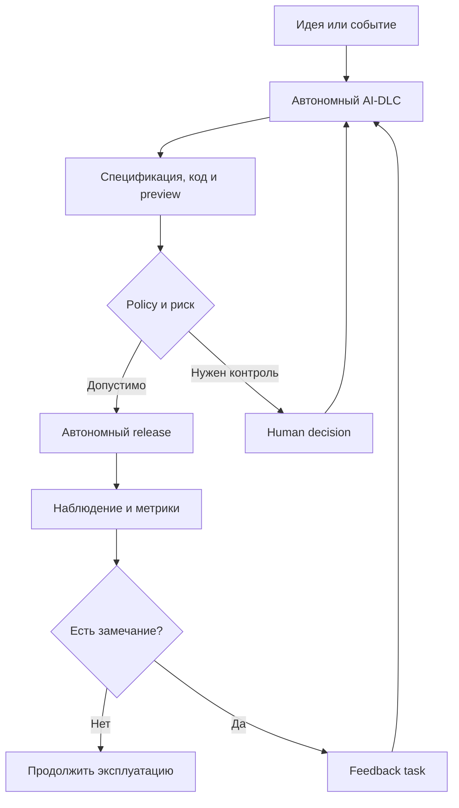

<!--
Источник: Notion — Автономная агентная система
URL: https://app.notion.com/p/3d9db33037c880ff8fd9f4b0de1b0f52
Выгружено: 2026-09-12
-->

# Автономная агентная система

Да. Для Dark Factory целевая модель должна быть не «человек согласовывает каждую фазу», а **Human Off The Loop с управлением по исключениям**:
- фабрика самостоятельно проходит весь AI-DLC;
- человек постоянно может наблюдать результат;
- замечания человека превращаются в обычные задачи;
- фабрика останавливается только при заранее определённых рисках или невозможности принять решение;
- обязательные согласования остаются только для бизнес-значимых, дорогостоящих, необратимых и регулируемых действий.

Если человек должен нажать Approve после анализа, архитектуры, разработки и тестирования — это Human-in-the-Loop, а не Human Off The Loop.

## Где участие человека действительно обязательно

<table header-row="true">
<tr>
<td>Фаза</td>
<td>Работа фабрики</td>
<td>Участие человека</td>
</tr>
<tr>
<td>Инициация продукта</td>
<td>Разбор идеи, сбор контекста, подготовка Product Brief</td>
<td>Обязательно только для подтверждения новой цели, бюджета или владельца продукта</td>
</tr>
<tr>
<td>Discovery</td>
<td>Анализ Notion, задач, кода, API, формирование требований</td>
<td>Только при неразрешимой неоднозначности или конфликте бизнес-правил</td>
</tr>
<tr>
<td>Планирование</td>
<td>Декомпозиция, оценка, зависимости, выбор агентов</td>
<td>Не требуется, если задача укладывается в установленные ограничения</td>
</tr>
<tr>
<td>UX/UI</td>
<td>Генерация сценариев, прототипов, реализация по UI Kit</td>
<td>Наблюдение и необязательная корректировка человеком</td>
</tr>
<tr>
<td>Архитектура</td>
<td>Выбор паттернов, API, моделей данных, ADR</td>
<td>Только для значимого изменения архитектурных границ или технологического стандарта</td>
</tr>
<tr>
<td>Разработка</td>
<td>Код, тесты, документация, миграции</td>
<td>Не требуется</td>
</tr>
<tr>
<td>Review и rework</td>
<td>Несколько независимых ревью, исправления, повторные проверки</td>
<td>Только при конфликте агентов или исчерпании лимита исправлений</td>
</tr>
<tr>
<td>Security</td>
<td>SAST, dependency scan, secrets, threat checks</td>
<td>Только для принятия остаточного высокого риска</td>
</tr>
<tr>
<td>Deploy в dev/test</td>
<td>Автоматическое развёртывание и smoke-тесты</td>
<td>Не требуется</td>
</tr>
<tr>
<td>Deploy в production</td>
<td>Canary, health-check, rollback</td>
<td>Требуется только для высокорисковых изменений; низкорисковые можно выпускать автоматически</td>
</tr>
<tr>
<td>Эксплуатация</td>
<td>Мониторинг, диагностика, автокоррекция, rollback</td>
<td>Только при серьёзном инциденте или выходе за установленные полномочия</td>
</tr>
<tr>
<td>Learning loop</td>
<td>Предложение изменений агентов, skills, правил и процесса</td>
<td>Обязательно для публикации существенных изменений самой фабрики</td>
</tr>
</table>

Таким образом, обязательное участие человека связано не столько с фазами, сколько с **классом решения**.

## Четыре обязательные точки контроля

Я бы оставил только четыре типа обязательного вмешательства.

### 1. Авторизация нового намерения

Человек подтверждает действия, меняющие направление продукта:
- запуск нового продукта;
- изменение бизнес-цели;
- существенное расширение scope;
- подключение нового внешнего поставщика;
- заметное увеличение бюджета или инфраструктурного потребления.

При этом небольшие улучшения уже существующего продукта могут запускаться автоматически из backlog, мониторинга или пользовательской обратной связи.

### 2. Неразрешимое бизнес-решение

Фабрика эскалирует вопрос, если существуют несколько допустимых вариантов, но выбор нельзя вывести из правил и контекста:
- комиссия должна быть 3% или 5%;
- кто имеет право подтверждать возврат;
- какая система является master;
- нужно ли хранить персональные данные;
- какое поведение считается правильным при конфликте требований.

Эскалация должна содержать не открытый вопрос «что делать?», а подготовленное решение:

> Обнаружен конфликт между BRD и текущим поведением системы.
> Рекомендация: использовать вариант B.
> Последствия: изменение API и миграция данных.
> Альтернативы: A и C.

### 3. Высокорисковое или необратимое действие

Обязательное подтверждение требуется перед:
- необратимой миграцией или удалением данных;
- изменением IAM, финансовой логики или персональных данных;
- переключением критичной интеграции;
- production-релизом с высоким blast radius;
- принятием Critical/High security risk;
- отключением rollback;
- изменением контрактов, затрагивающим большое количество потребителей.

Обычные UI-изменения, багфиксы, документация, тесты и совместимые API-изменения должны проходить автоматически.

### 4. Изменение самой Dark Factory

Фабрика может самостоятельно анализировать свою эффективность и готовить улучшения, но не должна бесконтрольно расширять собственные полномочия.

Человеку следует подтверждать:
- изменение policy и quality gates;
- добавление новых полномочий агентам;
- подключение новых MCP-инструментов;
- изменение правил production-доступа;
- увеличение бюджетных лимитов;
- автоматическое принятие ранее запрещённых решений.

Изменения промптов, вспомогательных skills и эвристик низкого риска могут проходить через автоматический evaluation pipeline.

## Как должно работать необязательное вмешательство

Ваш сценарий правильный: человек не участвует в процессе постоянно, а наблюдает за формирующейся системой и вмешивается, когда видит проблему.

Например:
1. Фабрика реализовала страницу и развернула preview.
2. Человек замечает неправильное расположение кнопки.
3. Он выделяет элемент или прикладывает скриншот и пишет:

    «Переместить кнопку подтверждения в footer формы».

4. Console создаёт feedback task, связывает её с исходной задачей, UI-компонентом и текущим OpenSpec change.
5. Design Agent уточняет UI-решение.
6. Develop Agent исправляет код.
7. Quality Agent запускает visual regression и тесты.
8. Фабрика обновляет существующий MR или создаёт новый.
9. Человек получает уведомление о готовом preview, но подтверждать результат не обязан.

То же относится к:
- неточным формулировкам;
- пропущенному состоянию интерфейса;
- новому компоненту;
- изменению бизнес-правила;
- дополнительному API;
- уточнению архитектурного ограничения;
- пожеланию по производительности.

Каждое вмешательство человека должно становиться **структурированным событием**, а не неформальным сообщением, которое ломает автономный поток.

## Модель событий Human Feedback

Полезно ввести единый тип `HumanFeedback`, например:

```yaml
type: human_feedback
source: factory_console
target:
  product: small-store
  change: add-return-document
  artifact: ui/return-form
  component: submit-button

category: ui_defect
severity: medium

observation: >
  Кнопка подтверждения теряется при прокрутке длинной формы.

expected_result: >
  Кнопка должна находиться в закрепленном footer.

requested_action: fix

attachments:
  - screenshot://return-form-001

execution_policy:
  create_task: true
  reopen_change: true
  require_human_approval_after_fix: false
```

Агентная система сама определяет:
- это дефект, уточнение или новый scope;
- какие спецификации затронуты;
- нужно ли обновлять OpenSpec;
- какие агенты должны быть вызваны;
- можно ли продолжить текущий MR;
- требуется ли новая задача;
- какие тесты добавить.

## Какие вмешательства не должны останавливать фабрику

Большинство замечаний пользователя должны выполняться асинхронно:

<table header-row="true">
<tr>
<td>Вмешательство</td>
<td>Реакция</td>
</tr>
<tr>
<td>Исправить текст</td>
<td>Автоматическая задача и обновление MR</td>
</tr>
<tr>
<td>Изменить UI</td>
<td>Исправление и новый preview</td>
</tr>
<tr>
<td>Добавить компонент</td>
<td>Impact analysis, изменение спецификации и реализация</td>
</tr>
<tr>
<td>Изменить API</td>
<td>Проверка совместимости и обновление контрактов</td>
</tr>
<tr>
<td>Добавить тест</td>
<td>Автоматическое дополнение test suite</td>
</tr>
<tr>
<td>Вернуться к предыдущему варианту</td>
<td>Создание revert/change task</td>
</tr>
<tr>
<td>«Мне не нравится результат»</td>
<td>Фабрика просит конкретизировать критерии или предлагает варианты</td>
</tr>
<tr>
<td>Приостановить изменение</td>
<td>Мгновенная остановка связанных запусков</td>
</tr>
<tr>
<td>Запретить release</td>
<td>Установка блокирующей policy</td>
</tr>
</table>

Человек может влиять на работу фабрики в любой момент, но это не означает, что фабрика должна ждать человека после каждого изменения.

## Риск-ориентированные режимы автономности

Я рекомендую назначать режим не всему проекту, а каждому изменению.

<table header-row="true">
<tr>
<td>Уровень</td>
<td>Примеры</td>
<td>Режим</td>
</tr>
<tr>
<td>R0 — минимальный</td>
<td>Текст, документация, тесты, форматирование</td>
<td>Полностью автономно</td>
</tr>
<tr>
<td>R1 — низкий</td>
<td>UI, локальный багфикс, внутренний refactoring</td>
<td>Автономно с уведомлением</td>
</tr>
<tr>
<td>R2 — средний</td>
<td>Новый компонент, совместимое API, миграция с rollback</td>
<td>Автономно до staging; production по policy</td>
</tr>
<tr>
<td>R3 — высокий</td>
<td>IAM, платежи, персональные данные, breaking API</td>
<td>Обязательное подтверждение перед production</td>
</tr>
<tr>
<td>R4 — критический</td>
<td>Удаление данных, отключение защиты, большой blast radius</td>
<td>Обязательное архитектурное и операционное решение</td>
</tr>
</table>

Начинать MVP лучше консервативно: автоматизировать R0–R1, затем разрешить R2 после накопления статистики. R3–R4 оставить с обязательным human gate.

## Когда фабрика обязана остановиться

Нужен отдельный набор `stop conditions`:
- недостаточно данных для проверки acceptance criteria;
- конфликт требований, который нельзя разрешить по приоритетам источников;
- превышен лимит стоимости, времени или итераций;
- повторный цикл review → rework не устраняет проблему;
- тесты нестабильны и результат нельзя считать достоверным;
- обнаружена Critical/High security-проблема;
- отсутствует безопасный rollback;
- изменение выходит за разрешённый scope;
- агент запрашивает новые полномочия;
- фактический blast radius выше заявленного;
- разные агенты дают несовместимые оценки высокого риска.

Во всех остальных случаях фабрика должна продолжать работу и лишь информировать человека.

## Что должен видеть человек в Dark Factory Console

Console лучше строить не как последовательность кнопок согласования, а как **панель наблюдения и вмешательства**:
- текущее состояние каждого change;
- рабочий preview;
- история решений и ADR;
- требования и acceptance criteria;
- что изменилось в коде, API, данных и инфраструктуре;
- результаты тестирования и security checks;
- выводы независимых review-агентов;
- текущий уровень риска;
- стоимость и длительность выполнения;
- уверенность фабрики в результате;
- нерешённые противоречия;
- действия `Comment`, `Request change`, `Add scope`, `Pause`, `Rollback`, `Escalate`.

Главный экран должен отвечать человеку на три вопроса:
1. Что фабрика сейчас делает?
2. Почему она решила делать именно так?
3. Где действительно требуется моё решение?

## Целевой процесс



## Итоговая рекомендация

Для Dark Factory я бы сформулировал принцип так:

> **Человек не является участником стандартного workflow. Он является владельцем намерения, наблюдателем результата и органом эскалации для исключений.**

В нормальном режиме задача должна автономно пройти:

**идея → discovery → спецификация → архитектура → разработка → review → rework → тестирование → staging → release → наблюдение.**

Человек вмешивается через новую задачу или комментарий, когда видит недостаток. Обязательная остановка возникает только при бизнес-неоднозначности, высоком риске, необратимом воздействии или изменении полномочий самой фабрики. Это и будет практическая, безопасная реализация **Human Off The Loop**, а не просто автоматизированный процесс с большим количеством скрытых ручных согласований.
