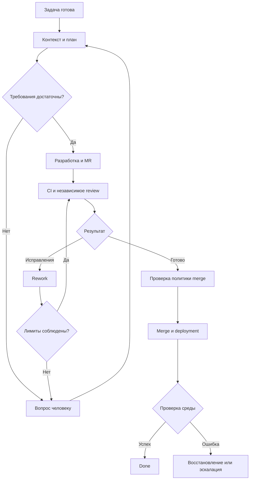

<!--
Источник: Notion — Автономная разработка с использованием AIDLC и dmtools
URL: https://app.notion.com/p/3d9db33037c88095a8b5dcb0faf3c5f9
Выгружено: 2026-09-12
-->

# Автономная разработка с использованием AIDLC и dmtools

**Я бы дополнил Dark Factory двумя связанными наборами функций: управление разработкой по AI-DLC и автономное выполнение задач по образцу dmtools-agents.** При этом переходами между состояниями управляет один оркестратор Factory, а агенты выполняют конкретные задания через выбранный harness.

Уточнение к предыдущему обсуждению: текущий AI-DLC уже содержит детерминированный движок, разделение engine/conductor и автономный режим Construction. Однако ошибки Construction останавливают процесс с выбором retry/skip/abort. Поэтому автономный цикл работы с задачами и MR требует дополнительных механизмов. [Движок AI-DLC](https://github.com/awslabs/aidlc-workflows/blob/main/docs/reference/17-skill-system.md), [Construction](https://github.com/awslabs/aidlc-workflows/blob/main/docs/guide/04-phases-and-stages.md).

Ниже — дополненная целевая функциональность и способ её реализации для твоего MVP.

**1. Функции процесса разработки на базе AI-DLC**

В текущем введении AI-DLC описаны пять фаз, выбор масштаба и глубины процесса, агенты, знания, правила, аудит и восстановление сессий. Для Factory предлагаю следующую адаптацию. [AI-DLC Introduction](https://github.com/awslabs/aidlc-workflows/blob/main/docs/guide/00-introduction.md).

<table header-row="true">
<tr>
<td>Функция Dark Factory</td>
<td>Что использовать из AI-DLC</td>
<td>Как дополнить для Factory MVP</td>
</tr>
<tr>
<td>Регистрация инициативы</td>
<td>Spaces и intents</td>
<td>Связать инициативу с продуктом, репозиторием, задачей Linear/Plane и запуском Factory</td>
</tr>
<tr>
<td>Подключение проекта</td>
<td>Initialization, workspace detection</td>
<td>Определить стек, команды сборки и тестов, UIKit, CI/CD и целевую среду</td>
</tr>
<tr>
<td>Сбор требований</td>
<td>Intent capture, requirements</td>
<td>Получать контекст из задачи, Notion и OKF; выделять критерии приёмки и открытые вопросы</td>
</tr>
<tr>
<td>Выбор процесса</td>
<td>Scope, depth, test strategy</td>
<td>Начать с трёх профилей: `feature`, `bugfix`, `maintenance`; независимо задавать уровень автономности</td>
</tr>
<tr>
<td>Анализ существующего приложения</td>
<td>Reverse engineering, practices discovery</td>
<td>Выявлять затронутые компоненты, контракты, зависимости и применимые стандарты</td>
</tr>
<tr>
<td>Проектирование</td>
<td>Domain design, contract design, NFR</td>
<td>Использовать шаблоны FastAPI, PostgreSQL, React и Small UIKit; ADR создавать для существенных решений</td>
</tr>
<tr>
<td>Декомпозиция</td>
<td>Units of work и зависимости</td>
<td>Формировать небольшие задания с результатом, критериями приёмки и зависимостями</td>
</tr>
<tr>
<td>Реализация</td>
<td>Construction</td>
<td>Выполнять каждое задание в отдельной ветке и изолированной рабочей среде</td>
</tr>
<tr>
<td>Проверка результата</td>
<td>Build/test и verification gates</td>
<td>Проверять требования, тесты, API-контракты и изменения спецификаций до merge</td>
</tr>
<tr>
<td>Доставка</td>
<td>Operation</td>
<td>Запускать GitLab CI/CD, проверять deployment и smoke-тесты в K8S или VM</td>
</tr>
<tr>
<td>Возобновление</td>
<td>State, audit, session recovery</td>
<td>Восстанавливать работу после завершения процесса агента или runner</td>
</tr>
<tr>
<td>Улучшение практик</td>
<td>Rules и learning loop</td>
<td>Собирать повторяющиеся замечания и предлагать изменения skills, правил и шаблонов отдельным MR</td>
</tr>
</table>

Это **предлагаемая адаптация**, а не перечень готовых интеграций upstream.

Для OpenSpec я бы закрепил роль источника требований и изменений спецификаций в Git. AI-DLC определяет, когда их подготовить и проверить; Factory хранит состояние выполнения. Так агентам не придётся поддерживать два независимых комплекта одинаковых требований.

**2. Что конкретно перенести из dmtools-agents**

В dmtools-agents уже описан цикл, где Scrum Master сканирует Jira, запускает разработку, review, rework и merge. Есть отдельные режимы для AI-задач и обычного кода. Текущая реализация ориентирована на Jira и GitHub Actions; для Linear/Plane и GitLab потребуется адаптация. [README dmtools-agents](https://github.com/IstiN/dmtools-agents/blob/main/README.md).

<table header-row="true">
<tr>
<td>Механизм в dmtools-agents</td>
<td>Функция в Dark Factory</td>
<td>Способ переноса</td>
</tr>
<tr>
<td>`sm.json`, `js/smAgent.js`</td>
<td>Автоматический подбор готовых задач</td>
<td>Перенести модель «условие → действие» в правила диспетчера Factory</td>
</tr>
<tr>
<td>`story_development.json`</td>
<td>Разработка задачи до открытия MR</td>
<td>Переиспользовать структуру инструкций, подготовку контекста и разделение подготовки/исполнения/публикации</td>
</tr>
<tr>
<td>`pr_review.json`</td>
<td>Независимое автоматическое review</td>
<td>Адаптировать структурированный результат и публикацию замечаний к GitLab discussions</td>
</tr>
<tr>
<td>`pr_rework.json`</td>
<td>Исправление замечаний</td>
<td>Продолжать работу в существующей ветке и MR, передавать агенту конкретные замечания</td>
</tr>
<tr>
<td>`retry_merge.json`</td>
<td>Повторная проверка готовности к merge</td>
<td>Выполнять проверку и merge обычным кодом</td>
</tr>
<tr>
<td>`skipIfLabel`, `addLabel`, `releaseLock()`</td>
<td>Защита от повторного запуска</td>
<td>Сохранить отображение статуса в трекере; для захвата задачи использовать атомарную lease в БД</td>
</tr>
<tr>
<td>`wip`</td>
<td>Пауза обработки</td>
<td>Добавить `pause/resume` задачи и проекта</td>
</tr>
<tr>
<td>`workflowFailureReporter.js`</td>
<td>Обработка неуспешного запуска</td>
<td>Сохранять причину, ссылки на логи и решение: повторить, исправить или эскалировать</td>
</tr>
<tr>
<td>`.dmtools/config.js`</td>
<td>Настройки конкретного продукта</td>
<td>Перенести в декларативный конфиг проекта Factory</td>
</tr>
<tr>
<td>`run-agent.sh` и providers</td>
<td>Подключение исполнителей</td>
<td>Использовать как образец адаптера harness</td>
</tr>
</table>

Конфигурация review уже задаёт ответы `APPROVE`, `REQUEST_CHANGES`, `BLOCK` и серьёзность замечаний. Rework использует отдельные шаги подготовки и публикации исправлений; merge-конфигурация вызывает JS без запуска AI. Это особенно полезные границы для переноса. [Review](https://github.com/IstiN/dmtools-agents/blob/main/pr_review.json), [Rework](https://github.com/IstiN/dmtools-agents/blob/main/pr_rework.json), [Merge](https://github.com/IstiN/dmtools-agents/blob/main/retry_merge.json).

**3. Дополнительные функции, необходимые именно для автономности**

Одного запуска агентов по статусу задачи недостаточно. Я бы включил в MVP следующие механизмы:

<table header-row="true">
<tr>
<td>Функция</td>
<td>Требуемое поведение</td>
</tr>
<tr>
<td>Проверка готовности задачи</td>
<td>До разработки проверить наличие критериев приёмки, репозитория, разрешённого scope и необходимых решений</td>
</tr>
<tr>
<td>События и периодическая сверка</td>
<td>Реагировать на изменения задач, MR и pipeline; периодически сверять состояние для восстановления пропущенных событий</td>
</tr>
<tr>
<td>Защита от дубликатов</td>
<td>Повторное событие не создаёт второй запуск, ветку, MR или одинаковый комментарий</td>
</tr>
<tr>
<td>Сохранение состояния</td>
<td>Хранить этап, попытку, владельца lease, MR, commit SHA, результаты проверок и ожидаемое событие</td>
</tr>
<tr>
<td>Ограниченный rework</td>
<td>Например, максимум три цикла исправлений плюс лимиты времени и стоимости</td>
</tr>
<tr>
<td>Классификация ошибок</td>
<td>Различать ошибку кода, сбой инфраструктуры, недостаток требований и запрещённое действие</td>
</tr>
<tr>
<td>Актуальность review</td>
<td>Привязывать результат review к commit SHA; новый commit требует повторной проверки</td>
</tr>
<tr>
<td>Политика merge</td>
<td>Проверять разрешённый scope, актуальный CI, review, обязательные approvals и отсутствие блокирующих обсуждений</td>
</tr>
<tr>
<td>Проверка доставки</td>
<td>Различать `Merged`, `Deployed` и `Done`; критерий завершения определять для проекта</td>
</tr>
<tr>
<td>Эскалация</td>
<td>Передавать человеку конкретный вопрос, доказательства и варианты решения с возможностью продолжить запуск</td>
</tr>
</table>

**Особенно важно: ответ агента `APPROVE` — вход для проверки политики. Само право выполнить merge определяет код Factory и настройки GitLab.**

**4. Целевой автономный цикл**

Например, после комментария reviewer:
1. GitLab adapter получает событие и сверяет актуальное состояние MR.
2. Оркестратор создаёт задание rework с замечаниями и текущим SHA.
3. Develop исправляет код и выполняет локальные проверки.
4. Адаптер публикует commit в ту же ветку.
5. CI и Reviewer проверяют новую версию.
6. При выполнении всех условий Merge Controller выполняет merge.
7. После deployment Factory проверяет среду и обновляет задачу.

В dmtools Story flow генерация отдельных Test Case задач показана после merge. **Для твоего MVP я бы перенёс обязательные приёмочные и регрессионные проверки до merge**, а после deployment оставил проверки работающей среды. [Story Pipeline](https://github.com/IstiN/dmtools-agents/blob/main/README.md).

**5. Минимальная декомпозиция реализации**

С учётом выбранного направления со своим оркестратором и сменными harness я предлагаю один Python-проект с такими модулями:

<table header-row="true">
<tr>
<td>Модуль</td>
<td>Ответственность</td>
</tr>
<tr>
<td>`process`</td>
<td>Профили и этапы, адаптированные из AI-DLC</td>
</tr>
<tr>
<td>`controller`</td>
<td>Состояния, события, диспетчеризация, retry/rework, восстановление</td>
</tr>
<tr>
<td>`agents`</td>
<td>Три роли: Analyst/Architect, Develop, Reviewer</td>
</tr>
<tr>
<td>`skills`</td>
<td>Анализ требований, проектирование, реализация, тестирование, review, исправления</td>
</tr>
<tr>
<td>`harnesses`</td>
<td>Единый контракт запуска; первый адаптер — PydanticAI</td>
</tr>
<tr>
<td>`adapters`</td>
<td>GitLab, один выбранный трекер, Notion/OKF</td>
</tr>
<tr>
<td>`policies`</td>
<td>Готовность задачи, лимиты, проверки merge и deployment</td>
</tr>
<tr>
<td>`artifacts`</td>
<td>Контракты результатов, ссылки на OpenSpec, отчёты и доказательства</td>
</tr>
<tr>
<td>`state`</td>
<td>PostgreSQL: запуски, шаги, события, lease и ожидающие действия</td>
</tr>
</table>

**Scrum Master, Merge Controller и синхронизация статусов должны быть обычным кодом.** Для них не нужен отдельный LLM-агент. Develop может выполнять и разработку, и rework; Reviewer запускается отдельно с собственным контекстом проверки.

GitLab CI остаётся средой выполнения сборки, тестирования и доставки. Между запусками Factory сохраняет состояние и ожидает события — длительно работающая сессия агента не требуется. Temporal на этом этапе можно оставить за пределами MVP.

**6. Что вывести в Dark Factory Console**

<table header-row="true">
<tr>
<td>Экран</td>
<td>Основные функции</td>
</tr>
<tr>
<td>Очередь</td>
<td>Готовые задачи, приоритет, зависимости, причина блокировки</td>
</tr>
<tr>
<td>Запуск</td>
<td>Текущий этап, агент, попытка, время, стоимость, логи</td>
</tr>
<tr>
<td>Требования</td>
<td>OpenSpec change, критерии приёмки, открытые вопросы</td>
</tr>
<tr>
<td>MR и проверки</td>
<td>Diff, SHA, CI, замечания, история исправлений</td>
</tr>
<tr>
<td>Решения</td>
<td>Вопросы человеку, approvals, причина запрета merge</td>
</tr>
<tr>
<td>Доставка</td>
<td>Среда, версия, deployment, smoke-тесты</td>
</tr>
<tr>
<td>Улучшения</td>
<td>Повторяющиеся ошибки, предложения изменений skills и стандартов</td>
</tr>
</table>

Learning loop стоит подключить после запуска основного цикла: собирать кандидаты автоматически, а изменения общих правил проводить отдельным MR с проверками. В AI-DLC обучение также предусматривает подтверждение сохраняемых правил; предложенная автоматизация Factory расширяет этот процесс. [Rules and Learning Loop](https://github.com/awslabs/aidlc-workflows/blob/main/docs/guide/09-rules-and-the-learning-loop.md).

Первый рабочий срез я бы ограничил **одним репозиторием, одним трекером и профилем `bugfix`**: готовая задача → исправление → MR → CI → review → rework → merge по политике → deployment в non-prod → smoke-тест. Он позволит проверить автономность целиком, прежде чем расширять discovery, параллельную разработку и набор агентов.
