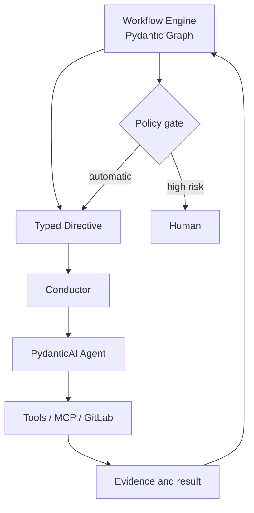

<!--
Источник: Notion — awslabs-aidlc-workflows
URL: https://app.notion.com/p/awslabs-aidlc-workflows-3d9db33037c880ba959ac4feeb2a5493
Выгружено: 2026-09-12
-->

# awslabs-aidlc-workflows

Коротко: из `awslabs/aidlc-workflows` для Dark Factory стоит брать не готовую платформу целиком, а методологическое ядро, контракты и отдельные механизмы управления workflow. Ориентировочно можно переиспользовать:
- 60–70% методологии, артефактов и декларативных описаний;
- 30–40% архитектурных решений;
- 10–20% TypeScript/Bun-кода непосредственно.

На 12 сентября 2026 актуальный release — `2.8.2`, а `main` уже содержит дальнейшие изменения. Репозиторий значительно взрослее ранней версии: 33 стадии, 14 ролей, 11 scopes, детерминированный engine, runtime graph, плагины, worktree/swarm, audit и learning loop. [Документация AI-DLC](https://github.com/awslabs/aidlc-workflows/blob/main/docs/README.md), [release 2.8.2](https://github.com/awslabs/aidlc-workflows/releases/tag/v2.8.2).

## Что брать в первую очередь

<table header-row="true">
<tr>
<td>Компонент AI-DLC</td>
<td>Решение для Dark Factory</td>
<td>Как использовать</td>
</tr>
<tr>
<td>Stage definitions</td>
<td>Брать и адаптировать</td>
<td>Основа каталога фаз, стадий, входов, выходов и gates</td>
</tr>
<tr>
<td>Agent personas</td>
<td>Брать содержание</td>
<td>Переложить в ваши 9 ролей</td>
</tr>
<tr>
<td>Engine → typed directive → conductor</td>
<td>Брать архитектурный паттерн</td>
<td>Реализовать на Python/Pydantic</td>
</tr>
<tr>
<td>Scope profiles</td>
<td>Брать</td>
<td>Использовать для `bugfix`, `feature`, `mvp`, `infra`, `security`, `refactor`</td>
</tr>
<tr>
<td>Artifact vocabulary</td>
<td>Брать почти напрямую</td>
<td>Сопоставить с OpenSpec и OKF</td>
</tr>
<tr>
<td>State machine и audit taxonomy</td>
<td>Брать модель</td>
<td>Реализовать как события в PostgreSQL</td>
</tr>
<tr>
<td>Runtime graph</td>
<td>Брать концепцию</td>
<td>Сделать операционным графом исполнения</td>
</tr>
<tr>
<td>Rules + learning loop</td>
<td>Брать</td>
<td>Дополнить автоматическими evaluation и promotion workflow</td>
</tr>
<tr>
<td>Sensors</td>
<td>Брать и усилить</td>
<td>Превратить часть advisory-проверок в blocking policy gates</td>
</tr>
<tr>
<td>Unit DAG / Bolt / worktrees / swarm</td>
<td>Брать механику</td>
<td>Соединить с GitLab MR-циклом</td>
</tr>
<tr>
<td>Plugin mechanism</td>
<td>Брать архитектурные принципы</td>
<td>Реализовать нативный реестр Python-плагинов</td>
</tr>
<tr>
<td>Multi-harness projections</td>
<td>Брать идею</td>
<td>Поддержать Codex, OpenCode, Zed и внешние harness</td>
</tr>
<tr>
<td>Knowledge files / DocumentKB</td>
<td>Использовать только как reference</td>
<td>Источником знаний сделать OKF и корпоративные системы</td>
</tr>
<tr>
<td>Полный Bun runtime</td>
<td>Не переносить</td>
<td>Не делать его вторым workflow-движком</td>
</tr>
</table>

## 1. Декларативная модель стадий

Это один из самых ценных элементов репозитория. Стадия отделена от агента:
- stage определяет, что сделать;
- agent определяет, кто и как это делает;
- scope определяет, нужно ли запускать стадию;
- sensor проверяет результат;
- engine определяет следующий переход.

Стадии описаны Markdown-файлами с YAML frontmatter: dependencies, consumed/produced artifacts, lead/support agents, execution topology, scopes, sensors и gate policy.

Для Dark Factory я бы сохранил сам принцип, но сделал каноническую Pydantic-модель:

```python
class StageDefinition(BaseModel):
    id: StageId
    phase: PhaseId
    lead_role: AgentRole
    supporting_roles: list[AgentRole]
    depends_on: list[StageId]
    consumes: list[ArtifactType]
    produces: list[ArtifactType]
    execution: ExecutionTopology
    gate_policy: GatePolicy
    sensors: list[SensorId]
    scopes: set[ScopeId]
```

Markdown/OpenSpec остаются удобным authoring-форматом, но после компиляции превращаются в типизированный граф.

## 2. Разделение engine и conductor

Это, пожалуй, главное архитектурное решение, которое стоит перенести.

AI-DLC разделяет:
- детерминированный engine — вычисляет следующий шаг;
- conductor — выполняет поручение с помощью LLM;
- typed directive — контракт между ними;
- human — принимает решения только там, где нужна ответственность.

Engine оперирует командами `next`, `continue`, `report`, `park`, а на выходе формирует типизированные directives вроде `run-stage`, `ask`, `invoke-swarm`, `done`. Маршрутизация не отдана модели. [Описание orchestration engine](https://github.com/awslabs/aidlc-workflows/blob/main/docs/reference/17-skill-system.md).

Для Dark Factory это должно выглядеть так:



Это полностью соответствует ранее выбранной границе:
- PydanticAI — поведение агентов;
- Pydantic Graph — детерминированная внутрипроцессная оркестрация;
- Temporal — только длительные процессы, retries, timers, ожидания и human approvals;
- PostgreSQL — долговечное состояние и audit.

Сам TypeScript engine переносить построчно не нужно. Перенести следует его контракты, invariants и тестовые сценарии.

## 3. Scopes вместо единственного тяжёлого SDLC

В AI-DLC есть профили `enterprise`, `classic`, `mvp`, `feature`, `bugfix`, `refactor`, `infra`, `security-patch`, `poc`, `express`, `workshop`. Scope выбирает подмножество стадий, а depth регулирует глубину документов.

Для Dark Factory это критично: 33 стадии нельзя запускать для каждой задачи.

Предлагаю сохранить следующие профили:

<table header-row="true">
<tr>
<td>Dark Factory scope</td>
<td>Ожидаемый процесс</td>
</tr>
<tr>
<td>`express`</td>
<td>задача → код → проверки</td>
</tr>
<tr>
<td>`bugfix`</td>
<td>анализ дефекта → тест воспроизведения → исправление → MR</td>
</tr>
<tr>
<td>`feature`</td>
<td>требования → design → implementation → MR → deploy</td>
</tr>
<tr>
<td>`mvp`</td>
<td>product → architecture → UI → units → implementation → deployment</td>
</tr>
<tr>
<td>`refactor`</td>
<td>reverse engineering → target design → characterization tests → refactoring</td>
</tr>
<tr>
<td>`infra`</td>
<td>architecture → IaC → security → validate → deploy</td>
</tr>
<tr>
<td>`security-patch`</td>
<td>finding → threat assessment → patch → security verification</td>
</tr>
<tr>
<td>`enterprise`</td>
<td>полный процесс с compliance и архитектурными gates</td>
</tr>
</table>

Для обычной разработки Dark Factory должен использовать примерно 8–15 стадий, а не полный lifecycle.

## 4. Ваши девять агентов

Из содержимого AI-DLC можно собрать выбранный вами состав:

<table header-row="true">
<tr>
<td>Dark Factory</td>
<td>Источник в AI-DLC</td>
</tr>
<tr>
<td>Product</td>
<td>`product-agent` + часть `product-lead-agent`</td>
</tr>
<tr>
<td>Design</td>
<td>`design-agent`</td>
</tr>
<tr>
<td>Architect</td>
<td>`architect-agent` + `architecture-reviewer-agent`</td>
</tr>
<tr>
<td>Infrastructure</td>
<td>`aws-platform-agent`, но без AWS-зависимости</td>
</tr>
<tr>
<td>Security</td>
<td>`devsecops-agent` + `compliance-agent`</td>
</tr>
<tr>
<td>Develop</td>
<td>`developer-agent`</td>
</tr>
<tr>
<td>Quality</td>
<td>`quality-agent`</td>
</tr>
<tr>
<td>CI/CD</td>
<td>`pipeline-deploy-agent`</td>
</tr>
<tr>
<td>Operation</td>
<td>`operations-agent`</td>
</tr>
</table>

`delivery-agent`, `composer-agent` и reviewer-агенты не обязательно делать отдельными постоянными персонажами:
- Delivery — capability Product/CI/CD либо сервис планирования;
- Composer — системная функция изменения workflow graph;
- Reviewer — режим независимого запуска Architect/Security/Quality, а не отдельная бизнес-роль.

Из agent-файлов стоит забирать:
- обязанности;
- ограничения;
- входные и выходные артефакты;
- checklists;
- knowledge packs;
- tool policies;
- критерии завершения.

Prompt-текст нужно переписать под ваш runtime и терминологию.

## 5. Unit DAG, worktrees и autonomous swarm

Новая версия AI-DLC уже умеет:
- строить dependency DAG единиц разработки;
- вычислять топологические parallel batches;
- создавать отдельный git worktree на Unit;
- выдавать каждому worker утверждённый план и testing contract;
- проверять фактическую сходимость командой build/test;
- защищать тестовые файлы от изменения;
- требовать независимое review evidence;
- сливать только проверенные изменения;
- возвращать управление человеку при неисправимой ошибке.

Это хороший фундамент Human Off The Loop. Но это ещё не полный ваш процесс `Task → MR → review → rework → merge`.

Над ним нужен слой из `dmtools-agents` и собственных GitLab-адаптеров:
1. Получить задачу из Plane/Linear.
2. Создать execution intent.
3. Сформировать OpenSpec change.
4. Декомпозировать на Units.
5. Создать worktrees/branches.
6. Запустить агентов.
7. Открыть GitLab MR.
8. Получить pipeline, review и security findings.
9. Автоматически создать rework iteration.
10. Повторять до достижения convergence policy.
11. Выполнить merge.
12. Наблюдать deployment и production signals.
13. Закрыть задачу и записать learning.

Именно внешний Task/MR lifecycle должен принадлежать Dark Factory, а не встроенному AIDLC workflow.

## 6. Artifact graph и связь с OpenSpec/OKF

Полезны следующие артефакты AI-DLC:
- intent statement;
- requirements;
- user stories;
- mockups и interaction specification;
- architecture components;
- ADR;
- contract summary;
- unit-of-work;
- dependency DAG;
- delivery plan;
- functional design;
- NFR requirements/design;
- test strategy;
- infrastructure design;
- deployment plan;
- observability и incident artifacts;
- traceability records.

Но не стоит хранить три независимых набора почти одинаковых документов.

Распределение ответственности лучше сделать таким:

<table header-row="true">
<tr>
<td>Слой</td>
<td>Назначение</td>
</tr>
<tr>
<td>OpenSpec</td>
<td>Изменение продукта: requirements, scenarios, delta, tasks</td>
</tr>
<tr>
<td>AI-DLC-derived stages</td>
<td>Процесс получения и проверки артефактов</td>
</tr>
<tr>
<td>OKF</td>
<td>Граф знаний, решений, компонентов, политик и зависимостей</td>
</tr>
<tr>
<td>PostgreSQL event store</td>
<td>Runtime state, attempts, gates, budgets, audit</td>
</tr>
<tr>
<td>Git</td>
<td>Версионируемые спецификации, код и evidence</td>
</tr>
<tr>
<td>Notion/OpenMetadata/GitLab</td>
<td>Авторитетные внешние источники через адаптеры</td>
</tr>
</table>

`runtime-graph.json` можно сохранить как экспорт или локальный read model. Каноническим runtime-состоянием для multi-tenant Dark Factory он быть не должен.

## 7. Rules, learning loop и sensors

AI-DLC хранит правила по цепочке:

`organization → team → project → phase → stage`

Исправление агента можно подтвердить на gate и превратить в правило для следующих workflow. Sensors выполняют детерминированные проверки структуры, traceability, lint и type check. [Rules and learning loop](https://github.com/awslabs/aidlc-workflows/blob/main/docs/guide/09-rules-and-the-learning-loop.md).

Для Dark Factory я бы взял эту модель, но добавил обязательный процесс promotion:
1. Observation.
2. Candidate learning.
3. Evaluation на исторических задачах.
4. Проверка отсутствия деградации.
5. Security/policy review.
6. Canary activation.
7. Promotion `project → team → organization`.
8. Возможность автоматического rollback.

В AI-DLC многие sensors advisory. В Dark Factory необходимы три режима:
- `observe` — только telemetry;
- `warn` — finding и продолжение;
- `block` — запрет перехода или merge.

## 8. Plugin architecture

Текущий AIDLC уже имеет сильную plugin-модель:
- плагин не изменяет core;
- может добавлять stages, agents, scopes, sensors, knowledge и tools;
- может только аддитивно расширять существующую стадию;
- конфликт завершается ошибкой, а не last-write-wins;
- выключение плагина возвращает чистый core;
- slug является стабильной идентичностью.

Это почти идеально соответствует вашей целевой декомпозиции. [Plugin mechanism](https://github.com/awslabs/aidlc-workflows/blob/main/docs/reference/18-plugin-mechanism.md).

Но install-time composition файлов не стоит копировать буквально. Для Dark Factory лучше:
- Python entry points или собственный registry;
- Pydantic manifest;
- semver и dependency constraints;
- capability declarations;
- RBAC и tenant allowlist;
- подпись и provenance пакетов;
- sandbox/tool permissions;
- compatibility matrix;
- contract tests;
- runtime enable/disable без мутации core-файлов.

## Что сознательно не переносить

Я бы не переносил:
- весь Bun/TypeScript runtime как основу Dark Factory;
- Markdown-файлы как транзакционное состояние платформы;
- 33 стадии в каждый workflow;
- approval gate после каждой стадии;
- AWS-специфичный Infrastructure Agent;
- harness hooks как бизнес-ядро;
- DocumentKB как ещё одну корпоративную базу знаний;
- автоматическое локальное merge как замену GitLab MR;
- advisory sensors там, где нужны enforceable policies;
- локальную файловую модель как основу multi-tenancy;
- один долгоживущий интерактивный conductor как единственного владельца процесса.

## Практический порядок переноса

### MVP — взять сейчас

1. Stage schema и stage graph.
2. 9 адаптированных agent definitions.
3. Scopes `express`, `bugfix`, `feature`, `mvp`.
4. Typed directives.
5. State machine и audit events.
6. Artifact vocabulary.
7. Sensors и quality gates.
8. OpenSpec binding.
9. Git worktree execution.
10. GitLab Task/MR/rework loop.

### Следующий этап

1. Unit DAG и parallel batches.
2. Risk-based autonomy policy.
3. Rules и learning candidates.
4. OKF knowledge resolver.
5. Plugin SDK.
6. Replay, cost и budget accounting.
7. Operation feedback loop.

### Позже

1. Multi-repository coordination.
2. Autonomous swarm.
3. Self-improvement с evaluation/canary/rollback.
4. Enterprise multi-tenancy и quotas.
5. Подписанный marketplace плагинов.
6. Несколько interchangeable harness.

Итоговая рекомендация: не форкать `aidlc-workflows` как основу продукта. Зафиксировать его как upstream/reference implementation и перенести в Python четыре самостоятельных пакета:
- `factory-methodology` — stages, artifacts, scopes, roles;
- `factory-engine` — graph, state machine, directives, policies;
- `factory-runtime` — PydanticAI agents, tools, execution, worktrees;
- `factory-integrations` — GitLab, Plane/Linear, OpenSpec, OKF, MCP.

Так Dark Factory получит зрелость AI-DLC, но не унаследует его файловую, Bun- и harness-ориентированную архитектуру. Лицензия репозитория `MIT-0` допускает использование, изменение и включение кода без требования атрибуции, хотя внутренний реестр происхождения заимствований всё равно желательно сохранить.
