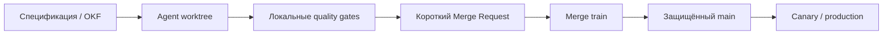

<!--
Источник: Notion — CI
URL: https://app.notion.com/p/3d3db33037c880fdb302f08dbbc5d4f3
Выгружено: 2026-09-12
-->

# CI

**Trunk-Based Development очень хорошо подходит для Software Dark Factory — я бы оценил совместимость на 9/10.** Более того, для большого количества параллельно работающих AI-агентов это почти целевая модель. Но использовать нужно не прямую запись агентов в `main`, а **gated trunk: короткие ветки + worktrees + автоматизированная очередь слияния**.

### Почему Trunk-Based особенно полезен агентам

AI-агенты генерируют изменений существенно больше, чем обычная команда. При GitFlow или долгоживущих feature-ветках быстро возникают:
- большие расхождения между ветками;
- повторная реализация одной функциональности разными агентами;
- сложные конфликты;
- длительная интеграция;
- устаревание контекста агента;
- накопление непроверяемых изменений.

Trunk-Based требует небольших порций работы и слияния минимум раз в день, а в Dark Factory — скорее каждые несколько минут или часов. DORA связывает этот подход с более высокой скоростью и стабильностью поставки, если trunk всегда остаётся работоспособным. [DORA: Trunk-based development](https://dora.dev/capabilities/trunk-based-development/)

### Рекомендуемая схема

Каждый агент получает:
- отдельный `git worktree`;
- короткоживущую ветку `agent/<task-id>`;
- конкретный bounded scope из OpenSpec/OKF;
- актуальный `main` как исходную точку;
- право создавать MR, но не напрямую изменять `main`.

Важно: **worktree не является альтернативой Trunk-Based**. Worktree изолирует рабочее пространство агента, а Trunk-Based определяет, как и когда изменения интегрируются.

### Оптимальная модель для вашей фабрики

<table header-row="true">
<tr>
<td>Уровень</td>
<td>Рекомендуемое правило</td>
</tr>
<tr>
<td>Работа агента</td>
<td>Отдельный worktree и ветка на одну небольшую задачу</td>
</tr>
<tr>
<td>Размер изменения</td>
<td>Один сценарий, контракт, компонент или рефакторинг</td>
</tr>
<tr>
<td>Время жизни ветки</td>
<td>Минуты или часы, желательно не больше рабочего дня</td>
</tr>
<tr>
<td>`main`</td>
<td>Protected branch, прямой push запрещён</td>
</tr>
<tr>
<td>Проверки</td>
<td>Локальные быстрые проверки → обязательный GitLab pipeline</td>
</tr>
<tr>
<td>Интеграция</td>
<td>Merged-results pipeline + merge train</td>
</tr>
<tr>
<td>Незавершённая функция</td>
<td>Feature flag или branch by abstraction</td>
</tr>
<tr>
<td>Релиз</td>
<td>Из `main`, независимо от момента слияния</td>
</tr>
<tr>
<td>Откат</td>
<td>Автоматический rollback либо быстрый fix-forward</td>
</tr>
</table>

GitLab Merge Trains особенно важен: он проверяет MR не только относительно текущего `main`, но и вместе с изменениями, уже стоящими впереди в очереди. Это предотвращает ситуацию, когда два MR по отдельности зелёные, но вместе ломают trunk. [GitLab Merge Trains](https://docs.gitlab.com/ci/pipelines/merge_trains/)

### Что нельзя делать

Trunk-Based для Dark Factory не должен означать:
- прямой `git push` агента в `main`;
- один общий workspace для нескольких агентов;
- длинную ветку на всю фичу;
- запуск всех проверок только в медленном GitLab CI;
- автоматическое слияние архитектурных и инфраструктурных изменений без оценки риска;
- использование зелёного unit-теста как единственного критерия готовности.

Без защищённого trunk и качественных автоматических gates пригодность снижается примерно до **3/10**: фабрика начнёт очень быстро производить нестабильный код.

### Какие gates должны стоять перед trunk

Быстрые, запускаемые локально агентом:
- форматирование, lint, type checking;
- unit-тесты;
- проверка OpenAPI/AsyncAPI и DTO;
- архитектурные правила и dependency boundaries;
- проверка соответствия реализации спецификации;
- secret scanning;
- анализ изменённой области.

Перед merge:
- merged-results pipeline;
- интеграционные и contract-тесты;
- миграции БД на совместимость;
- SAST и dependency scanning;
- сборка контейнера;
- минимальный smoke-тест;
- проверка артефактов: код, тесты, документация, ADR при необходимости.

После merge:
- деплой в ephemeral/canary;
- e2e и synthetic-тесты;
- анализ ошибок, latency и бизнес-инвариантов;
- автоматический rollback при нарушении SLO.

GitLab позволяет защитить `main`, ограничить push/merge, потребовать approvals и Code Owner approval. [GitLab Protected Branches](https://docs.gitlab.com/user/project/repository/branches/protected/)

### Где оставить человека

Человеку не нужно просматривать каждый стандартный MR. Лучше ввести risk-based approval:
- **Низкий риск:** агент автоматически проходит gates и merge train.
- **Средний риск:** подтверждение владельца компонента или агента-рецензента.
- **Высокий риск:** обязательное решение человека — IAM, платежи, персональные данные, destructive migrations, публичные API, Kafka-схемы, Terraform/Kubernetes, архитектурные инварианты.
- **Исключение из стандартов:** только человек с фиксацией ADR или waiver.

### Итоговая рекомендация

Для вашей Software Dark Factory я бы выбрал:

> **Scaled Trunk-Based Development + isolated worktrees + short-lived agent branches + protected main + mandatory merge train + risk-based human approval.**

Это лучше, чем GitFlow, и значительно безопаснее прямой работы агентов в `main`. Основным ограничителем скорости станет не Git, а длительность quality gates. Поэтому быстрый цикл проверок нужно выполнять локально в Podman/worktree, а в GitLab оставлять независимую обязательную верификацию и интеграционную очередь. Сам Trunk-Based допускает короткоживущие ветки и прямо рассматривает их как нормальную модель для масштабированной разработки. [Trunk-Based Development](https://trunkbaseddevelopment.com/)
