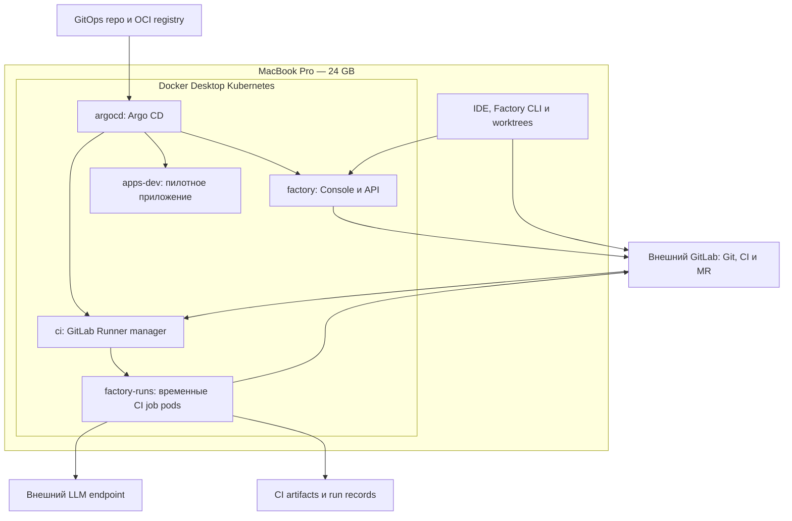
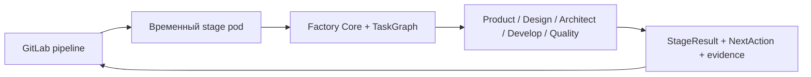
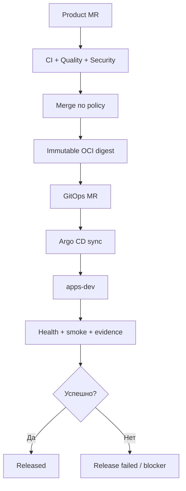

<!--
Источник: Notion — Deployment
URL: https://app.notion.com/p/3d6db33037c880a6ae9cdc3628154796
Выгружено: 2026-09-12
-->

# Deployment

Версия 0.7 · 12 сентября 2026 · Статус: целевое deployment-решение для MVP.

Документ синхронизирован с [HLD MVP](hld-mvp.md), [Компоненты фабрики](factory-components.md) и [Агенты](agents.md). Это архитектурная цель, а не описание уже работающего контура.

> **🎯 Решение MVP:** один локальный Kubernetes-контур в Docker Desktop на MacBook Pro 24 GB, внешний GitLab, Helm и Argo CD. Factory Core исполняется локально или во временных GitLab CI job pods. Temporal, PostgreSQL ядра, постоянный Factory Worker и обязательный Langfuse не разворачиваются.

# 1. Область решения

Deployment MVP должен подтвердить один сквозной сценарий:

> задача → OpenSpec → реализация → MR → CI/review/rework → merge по политике → immutable image → GitOps MR → dev deployment → smoke → evidence и обновление статуса.

Первый контур рассчитан на одного оператора, один пилотный продукт и один тяжёлый agent job одновременно. Внутри job допускаются до двух параллельных агентов, если задачи независимы и хватает ресурсов.

В MVP входят:
- локальная разработка через CLI и git worktrees;
- Dark Factory Console и FastAPI API;
- локальный GitLab Runner с Kubernetes executor;
- временные pods выполнения стадий;
- Helm charts и Argo CD;
- отдельный namespace пилотного приложения;
- внешний GitLab, LLM endpoint и один выбранный tracker adapter;
- CI artifacts, run records и OpenTelemetry;
- dev release с проверкой smoke.

Не входят:
- Temporal или DBOS;
- PostgreSQL как БД состояния фабрики;
- постоянный workflow worker, собственная очередь и scheduler;
- локальный GitLab, локальная LLM и полный корпоративный observability stack;
- обязательный Langfuse;
- полностью автономный production release;
- отдельный pipeline или pod на каждый LLM/tool call;
- обязательные preview/test/stage/prod-контуры на первом ноутбуке.

# 2. Целевая топология MVP



Главное разделение ответственности:

<table fit-page-width="true" header-row="true">
<tr>
<td>Компонент</td>
<td>Ответственность</td>
<td>Не делает</td>
</tr>
<tr>
<td>Factory Flow/Core</td>
<td>Определяет фазы, переходы, gates, роли и NextAction</td>
<td>Не является длительно живущим scheduler</td>
</tr>
<tr>
<td>Pydantic Graph</td>
<td>Исполняет TaskGraph внутри одной стадии: branch, parallel/join, локальный rework</td>
<td>Не хранит состояние между CI jobs</td>
</tr>
<tr>
<td>PydanticAI</td>
<td>Первый HarnessPort adapter для агентного задания</td>
<td>Не определяет весь SDLC flow</td>
</tr>
<tr>
<td>GitLab CI</td>
<td>Запускает stages/jobs, gates и reconcile по расписанию</td>
<td>Не кодирует всю доменную семантику процесса</td>
</tr>
<tr>
<td>GitLab Git/MR</td>
<td>Источник истины для кода, OpenSpec, review и принятого SHA</td>
<td>Не выполняет агентную оркестрацию</td>
</tr>
<tr>
<td>Argo CD</td>
<td>Применяет желаемое состояние из GitOps repo</td>
<td>Не разворачивает незакоммиченный worktree</td>
</tr>
<tr>
<td>Console/API</td>
<td>Показывает статус и evidence, инициирует разрешённые операции</td>
<td>Не хранит единственную копию состояния workflow</td>
</tr>
</table>

# 3. Execution-контуры

<table fit-page-width="true" header-row="true">
<tr>
<td>Контур</td>
<td>Назначение</td>
<td>Исполнение</td>
<td>Авторитетность</td>
</tr>
<tr>
<td>Local fast loop</td>
<td>Быстрые изменения, unit/component tests, локальный rework</td>
<td>macOS, CLI, worktree, нативные runtimes</td>
<td>Предварительный результат</td>
</tr>
<tr>
<td>Authoritative CI loop</td>
<td>Агентные стадии и обязательные gates для итогового SHA</td>
<td>Временный pod GitLab Runner</td>
<td>Источник evidence для merge</td>
</tr>
<tr>
<td>Local platform loop</td>
<td>Helm, ingress, probes, policies и GitOps</td>
<td>Docker Desktop Kubernetes</td>
<td>Dev verification</td>
</tr>
<tr>
<td>Shared/DC target</td>
<td>Командное использование и дальнейшие окружения</td>
<td>Kubernetes в ЦОД/облаке</td>
<td>После MVP</td>
</tr>
</table>

Локальный fast loop может выполнить несколько циклов `agent → patch → test → fix` внутри одного запуска. Длинное ожидание человека завершает процесс: продолжение создаёт новый запуск с сохранёнными входами, а не удерживает worker.

# 4. Namespace-модель

<table fit-page-width="true" header-row="true">
<tr>
<td>Namespace</td>
<td>Содержимое</td>
<td>Ключевые ограничения</td>
</tr>
<tr>
<td>`argocd`</td>
<td>Argo CD</td>
<td>Читает GitOps repo; применяет только разрешённые namespaces</td>
</tr>
<tr>
<td>`factory`</td>
<td>Console, API; опционально SQLite cache PVC</td>
<td>Один API pod; без полномочий прямого production deploy</td>
</tr>
<tr>
<td>`ci`</td>
<td>GitLab Runner manager</td>
<td>Создаёт pods только в `factory-runs`</td>
</tr>
<tr>
<td>`factory-runs`</td>
<td>Временные agent/orchestration/quality jobs</td>
<td>Non-root, TTL cleanup, quotas, deny-by-default egress</td>
</tr>
<tr>
<td>`apps-dev`</td>
<td>Пилотное приложение и его product dependencies</td>
<td>Изолировано от control-plane namespaces</td>
</tr>
</table>

Preview namespace на MR допустим как следующий профиль, но не является обязательным условием первого MVP. При включении он создаётся детерминированно, получает TTL и удаляется после merge/close.

# 5. Что запускается где

## На macOS нативно

- IDE и локальный Factory CLI;
- Git и отдельный worktree на инициативу/задачу;
- быстрый React/FastAPI/Python test loop;
- подготовка OpenSpec, diff и локальных evidence;
- `kubectl`, Helm и диагностические команды с обязательной проверкой kube context.

## В Docker Desktop Kubernetes

- Argo CD;
- Dark Factory Console/API;
- GitLab Runner manager;
- временные CI job pods;
- пилотное приложение;
- необходимые только пилоту PostgreSQL/Redis/mock services.

## Внешние зависимости

- GitLab 16: repositories, CI pipelines, MR, approvals и schedules;
- LLM endpoint через существующий LiteLLM либо прямой adapter;
- один выбранный трекер через TrackerPort;
- OCI registry;
- Vault/secret management и Keycloak — для shared/DC-профиля;
- внешние telemetry backends — опционально.

Не следует разворачивать на Mac уменьшенную копию всей корпоративной платформы: Kafka, OpenSearch/ELK, Prometheus/Grafana, Vault, Keycloak, MinIO и Langfuse подключаются только при реальной необходимости сценария.

# 6. GitLab Runner и модель jobs

Runner manager использует Kubernetes executor и создаёт временный pod для стадии. Factory Runner — это CLI/entrypoint единого Python-релиза внутри pod, а не отдельный постоянно работающий сервис.



На delivery-стадиях дополнительно подключаются роли Infrastructure, Security, CI/CD и Operation. Профили ролей определяют tools и permissions; имя роли не даёт полномочий автоматически.

Основные правила:
- один job исполняет одну стадию Flow, а не один LLM-вызов;
- до двух независимых задач могут выполняться параллельно внутри job через TaskGraph;
- ожидание approval освобождает Runner;
- новый job читает StageResult, RunSnapshot, Git/MR и фактическое состояние внешних систем;
- reconcile schedule продолжает только разрешённые сценарии MR/CI;
- webhook ускоряет реакцию, но не является единственным журналом;
- перед повтором внешнего действия выполняется lookup по `change_id`, ветке, MR и release reference;
- гарантия exactly-once не заявляется.

# 7. Изоляция и безопасность

Worktree разделяет файлы, но не является security boundary. Граница исполнения — pod/container с отдельными credentials, сетью и лимитами.

Для `factory-runs` обязательно:
- `runAsNonRoot`, read-only root filesystem где возможно;
- запрет `privileged`, Docker socket и `hostPath`;
- `automountServiceAccountToken: false`, если Kubernetes API не нужен;
- CPU/RAM/ephemeral-storage limits и active deadline;
- отдельные service accounts по типам jobs;
- NetworkPolicy с deny-by-default и разрешённым egress только к GitLab, LLM, registry и необходимым API;
- cleanup workspaces и pods по TTL;
- закреплённые image digests и проверенные base images.

Непроверенный код не получает merge/deploy credentials и секреты управляющей части. Git push/MR выполняет ограниченный publisher job; merge и release — отдельный доверенный finalizer job после проверки policy. Production credentials агентам не выдаются.

> **🔒 NetworkPolicy считается защитой только после теста, что CNI Docker Desktop/целевого кластера действительно её применяет. Bootstrap должен включать негативные egress-тесты и запрет доступа из `factory-runs` в `factory`, `ci` и `argocd`.**

# 8. Сборка и публикация OCI

После прохождения CI для итогового SHA доверенный build job:
1. использует закреплённый engineering/build profile;
2. собирает OCI image без privileged Docker-in-Docker по умолчанию;
3. создаёт SBOM;
4. выполняет SAST/SCA/secrets/image scan согласно профилю;
5. подписывает/аттестует образ, когда соответствующий контур готов;
6. публикует image в registry;
7. передаёт immutable digest в release handler.

```plain text
registry.example/apps/task-tracker@sha256:...
```

Buildpacks, BuildKit, Kaniko или другой builder выбираются engineering pack/ADR. Deployment-документ не фиксирует преждевременно один механизм. `latest` и изменяемые tags не используются для promotion.

# 9. Helm и Argo CD

Helm описывает Kubernetes package; Argo CD применяет желаемое состояние из Git. В shared-контуре прямой `helm upgrade` из agent job не является deployment-механизмом.

Локально поддерживаются два режима:
- **Helm verification из worktree** — быстрая проверка chart до публикации; не считается release;
- **Argo CD sync из GitOps repo** — авторитетная проверка GitOps flow.

Release flow:



Один и тот же digest должен продвигаться между будущими dev/test/stage/prod. Пересборка для следующего окружения запрещена без явного основания.

# 10. Состояние, persistence и artifacts

В MVP нет обязательной серверной БД фабрики. Состояние разделено следующим образом:

<table fit-page-width="true" header-row="true">
<tr>
<td>Данные</td>
<td>Источник истины</td>
</tr>
<tr>
<td>Код, OpenSpec, packs, rules, prompts и skills</td>
<td>Git repositories</td>
</tr>
<tr>
<td>Review, approvals, merge и принятый SHA</td>
<td>GitLab MR/manual job</td>
</tr>
<tr>
<td>Статус CI и технические проверки</td>
<td>GitLab pipeline/jobs</td>
</tr>
<tr>
<td>StageResult, NextAction, usage, findings и evidence refs</td>
<td>CI artifacts и долговременный run record</td>
</tr>
<tr>
<td>Deployment version</td>
<td>GitOps commit + OCI digest + Argo status</td>
</tr>
<tr>
<td>Крупные screenshots/log bundles</td>
<td>ArtifactStorePort: GitLab artifacts либо S3/MinIO</td>
</tr>
<tr>
<td>Console list/cache</td>
<td>Опциональный SQLite + PVC; полностью восстанавливаемый</td>
</tr>
</table>

Потеря SQLite/PVC не должна терять approval, budget, run state или возможность продолжить процесс. CLI jobs не открывают файл SQLite Console.

# 11. Observability и learning signals

Минимальная телеметрия проходит через TelemetryPort и OpenTelemetry:
- correlation: change → run → stage → agent call → tool call → CI job → deployment;
- structured logs и длительности;
- token/cost usage и budget outcome;
- test/review findings;
- deployment/smoke result;
- ссылки на GitLab и evidence.

На первом этапе данные сохраняются в job logs/artifacts и при наличии отправляются во внешний OTel backend. Полный локальный Prometheus/Grafana/Loki/Tempo stack не обязателен.

Langfuse — опциональный внешний adapter для AI traces, а не хранилище состояния и не зависимость learning loop. Pydantic Evals использует версионируемые datasets/evidence; предложения по изменению prompt, skill, rule, pack или flow проходят OpenSpec → MR → CI/evals → human-controlled merge.

# 12. Ресурсный профиль MacBook Pro 24 GB

Начальная гипотеза, которую необходимо подтвердить измерениями:

<table header-row="true">
<tr>
<td>Параметр</td>
<td>Стартовое значение</td>
</tr>
<tr>
<td>Docker Desktop memory</td>
<td>10–12 GB</td>
</tr>
<tr>
<td>Kubernetes nodes</td>
<td>1</td>
</tr>
<tr>
<td>Тяжёлые agent jobs</td>
<td>Runner concurrency = 1</td>
</tr>
<tr>
<td>Параллельные агенты внутри job</td>
<td>До 2 при независимых задачах</td>
</tr>
<tr>
<td>Локальная LLM</td>
<td>Нет</td>
</tr>
<tr>
<td>Kubernetes autostart</td>
<td>По необходимости</td>
</tr>
</table>

Multi-node на одном Mac не обеспечивает HA хоста. Повышать concurrency следует только после измерения peak memory, CPU throttling и длительности Playwright/browser tests.

# 13. Bootstrap

Bootstrap выполняется один раз и должен быть воспроизводимым:
1. Проверить лицензию Docker Desktop для корпоративного использования и доступность ARM64 images.
2. Включить Docker Desktop Kubernetes; зафиксировать поддерживаемую версию.
3. Создать namespaces, quotas, service accounts и baseline NetworkPolicy.
4. Установить Argo CD через Helm.
5. Подключить `dark-factory-gitops` с read-only credentials для чтения.
6. Установить GitLab Runner manager с Kubernetes executor.
7. Установить chart Dark Factory Console/API.
8. Настроить registry access и внешний GitLab/LLM/tracker endpoint.
9. Передать secrets через bootstrap/secret management; не коммитить их в Git.
10. Выполнить platform smoke: создать job pod, проверить egress/denies, собрать тестовый image, выполнить Argo sync и запустить smoke пилотного приложения.

Для локальных команд фиксируется защита от ошибочного контекста:

```yaml
local:
  required_kube_context: docker-desktop
  deny_remote_contexts: true
```

# 14. Репозитории и deployment artifacts

<table fit-page-width="true" header-row="true">
<tr>
<td>Репозиторий</td>
<td>Deployment-содержимое</td>
</tr>
<tr>
<td>`dark-factory`</td>
<td>Core/CLI/API/Console, OpenSpec, CI templates, `charts/dark-factory`, policies, tests/evals</td>
</tr>
<tr>
<td>`dark-factory-gitops`</td>
<td>Argo CD Applications, environment values и immutable digests; без secrets</td>
</tr>
<tr>
<td>`dark-factory-runs`</td>
<td>Небольшие run manifests, StageResult, usage summaries и evidence refs</td>
</tr>
<tr>
<td>`okf`</td>
<td>Архитектурные сущности и связи; отдельный Git repo</td>
</tr>
<tr>
<td>Product repositories</td>
<td>Код, OpenSpec, engineering profile, CI configuration и Helm chart продукта</td>
</tr>
</table>

Минимальные values-профили:

```plain text
charts/dark-factory/
├── values.yaml
├── values-local.yaml
└── values-dc.yaml
```

`values-local.yaml` и `values-dc.yaml` меняют resources, registry, endpoints, ingress, identity, storage и Runner configuration. Core, CLI contracts и charts остаются теми же.

# 15. Переход в shared/DC-контур

Миграция после MVP выполняется без смены процессной модели:
- перенести Argo CD, Runner и Factory chart в управляемый/shared Kubernetes;
- включить TLS и OIDC через Keycloak;
- определить роли Operator, Approver и Admin;
- подключить Vault/external secrets;
- вынести artifacts в устойчивое хранилище и настроить retention/backup;
- увеличить Runner concurrency только после capacity test;
- добавить preview/test/stage, если они дают измеримую ценность;
- отделить production Argo CD и credentials от non-prod;
- сохранить immutable digest promotion и human gate для production.

Temporal/DBOS возвращается на рассмотрение только при подтверждённых требованиях: множество долгих ожиданий, сложные timers/signals, межсистемные компенсации, высокая конкуренция и необходимость точного durable resume. Он не добавляется как обязательная часть переноса в ЦОД.

# 16. Критерии готовности deployment MVP

- [ ] Чистый Docker Desktop Kubernetes воспроизводимо устанавливается из bootstrap-инструкции.
- [ ] Argo CD синхронизирует Factory и пилотное приложение из GitOps repo.
- [ ] Локальный Runner создаёт временный non-root job pod и удаляет его после выполнения.
- [ ] Agent job не имеет merge/deploy credentials и доступа к control-plane namespaces.
- [ ] Publisher/finalizer отделены от sandbox исполнения.
- [ ] Один Factory Core запускается локально и в CI с одинаковыми контрактами.
- [ ] Job сохраняет StageResult, NextAction, usage и evidence refs.
- [ ] Ожидание человека не удерживает pod/Runner.
- [ ] Итоговый SHA повторно проходит обязательные CI gates.
- [ ] После merge публикуется immutable OCI digest.
- [ ] GitOps MR меняет digest; Argo CD разворачивает его в `apps-dev`.
- [ ] Неуспешный smoke не переводит изменение в `Released`.
- [ ] Потеря Console cache не теряет состояние процесса.
- [ ] Проверены ARM64 compatibility, resource limits и NetworkPolicy enforcement.
- [ ] MVP работает без Temporal, серверной БД ядра и обязательного Langfuse.

# Итоговое решение

1. **Один локальный Kubernetes-контур** — достаточная инфраструктура MVP.
2. **GitLab — внешний control plane**, источник истины для Git, MR и CI.
3. **Factory Runner — временный CLI-процесс в CI job pod**, а не постоянный worker.
4. **Pydantic Graph исполняет TaskGraph только внутри стадии**; продолжение между jobs опирается на сохранённые результаты и GitLab.
5. **Helm упаковывает, Argo CD разворачивает**; shared deployment выполняется только через GitOps.
6. **Привилегии build/publish/merge/deploy отделены** от исполнения непроверенного кода.
7. **CI artifacts, run records и GitOps commit** составляют проверяемую цепочку evidence.
8. **OpenTelemetry обязателен как нейтральный telemetry contract**; Langfuse остаётся опциональным adapter.
9. **Production release не входит в MVP** и требует отдельного контура и human approval.
10. **Миграция в ЦОД выполняется сменой values и интеграций**, без переписывания Core и Flow.
