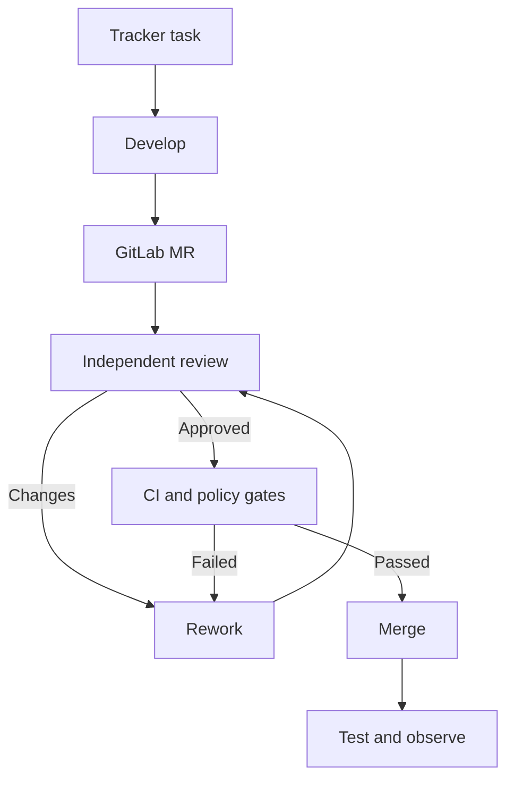
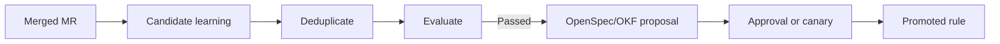

<!--
Источник: Notion — dmtools-agents
URL: https://app.notion.com/p/dmtools-agents-3d9db33037c8804c98c3d6c6051f436d
Выгружено: 2026-09-12
-->

# dmtools-agents

Коротко: `dmtools-agents` стоит использовать как референс операционного контура автономной разработки. AI-DLC лучше описывает, какие стадии и артефакты должны существовать, а `dmtools-agents` — как фактически провести задачу через разработку, PR/MR, review, rework, merge и тестирование.

Я бы заимствовал около 70% процессных идей, 30–40% инструкций и контрактов, но не более 15–25% JavaScript-кода: целевая Dark Factory строится на Python, PydanticAI и Pydantic Graph.

Анализ выполнен по `main` на 12 сентября 2026. [Репозиторий dmtools-agents](https://github.com/IstiN/dmtools-agents).

## Самые ценные механизмы

<table header-row="true">
<tr>
<td>Компонент</td>
<td>Что делать</td>
<td>Ценность</td>
</tr>
<tr>
<td>Task-driven controller</td>
<td>Переосмыслить и реализовать</td>
<td>Автоматически находит работу и запускает нужное действие</td>
</tr>
<tr>
<td>Development → review → rework → merge</td>
<td>Брать почти целиком как процесс</td>
<td>Закрывает главный автономный цикл</td>
</tr>
<tr>
<td>SCM abstraction</td>
<td>Брать интерфейсы и сценарии</td>
<td>Уже нормализует GitHub, GitLab и Azure DevOps</td>
</tr>
<tr>
<td>Tracker abstraction</td>
<td>Брать идею</td>
<td>Добавить Plane и Linear</td>
</tr>
<tr>
<td>Structured review contract</td>
<td>Брать</td>
<td>Машиночитаемый результат review</td>
</tr>
<tr>
<td>Recovery agents</td>
<td>Брать</td>
<td>Лечение зависших и рассинхронизированных процессов</td>
</tr>
<tr>
<td>Feedback loop</td>
<td>Брать и усилить</td>
<td>Агент самостоятельно исправляет ошибки quality gates</td>
</tr>
<tr>
<td>Quality/policy gates</td>
<td>Брать</td>
<td>Детерминированное условие продолжения</td>
</tr>
<tr>
<td>Concurrency limits</td>
<td>Брать</td>
<td>Контроль числа одновременных дорогих jobs</td>
</tr>
<tr>
<td>Provider runner</td>
<td>Брать архитектуру</td>
<td>Переключаемые Codex, Claude, Cursor, Kimi и другие</td>
</tr>
<tr>
<td>Knowledge update from MR</td>
<td>Брать концепцию</td>
<td>Основа self-improvement</td>
</tr>
<tr>
<td>Test automation lifecycle</td>
<td>Брать выборочно</td>
<td>Failed test → bug → fix → retest</td>
</tr>
<tr>
<td>Jira labels как locks</td>
<td>Не брать буквально</td>
<td>Заменить PostgreSQL leases</td>
</tr>
<tr>
<td>Polling раз в 20 минут</td>
<td>Оставить только fallback</td>
<td>Основной запуск делать по webhook/event</td>
</tr>
</table>

## 1. Контур Task → MR → review → rework → merge

Это главное, что стоит перенести.

В репозитории реализован следующий цикл:



Реализация включает:
- создание ветки;
- изменение кода;
- периодические checkpoint-коммиты;
- создание PR/MR;
- загрузку diff, discussions и CI failures;
- inline review comments;
- классификацию замечаний;
- повторный запуск Developer для rework;
- разрешение исправленных review threads;
- проверку mergeability;
- обновление отставшей ветки;
- ожидание CI;
- squash merge;
- синхронизацию статуса задачи.

В документации репозитория полный Story flow доходит от Backlog через requirements и solution design до PR review, rework, merge и тестирования. [Описание pipeline](https://github.com/IstiN/dmtools-agents#pipeline-diagrams).

Для Dark Factory эти действия должны стать не отдельными «агентами», а типизированными операциями workflow:

```python
class DevelopmentCycle:
    prepare_workspace
    implement
    validate
    publish_merge_request
    review
    rework
    await_pipeline
    merge
    verify_deployment
```

Исполнителями операций будут ваши роли `Develop`, `Quality`, `Security`, `CI/CD` и `Operation`.

## 2. Controller/Reconciler вместо интерактивного запуска

`smAgent.js` работает как контроллер:
1. Выбирает задачи запросом к tracker.
2. Проверяет preconditions.
3. Захватывает задачу.
4. Выбирает agent configuration.
5. Запускает локальное или удалённое выполнение.
6. Ограничивает concurrency.
7. После завершения обновляет задачу.
8. На следующем цикле исправляет рассинхронизацию.

Для Dark Factory нужно позаимствовать controller pattern, но заменить JQL-конфигурацию универсальным контрактом:

```python
class AutomationRule(BaseModel):
    id: str
    trigger: EventTrigger | ScheduleTrigger
    selector: WorkSelector
    preconditions: list[Condition]
    action: ActionId
    transition_on_success: StateId
    transition_on_failure: StateId
    lease_policy: LeasePolicy
    retry_policy: RetryPolicy
    concurrency_policy: ConcurrencyPolicy
    recovery_policy: RecoveryPolicy
```

Запуск:
- GitLab/Plane webhook — основной путь;
- Kafka event — внутренний транспорт;
- периодический reconciler — страховка от потерянных событий;
- ручной запуск из Dark Factory Console — управляемое вмешательство.

Это намного надёжнее, чем только cron/polling.

## 3. SCM adapter

В `js/common/scm.js` уже есть унифицированные операции для GitHub, GitLab и Azure DevOps:
- найти PR/MR;
- получить diff;
- получить discussions;
- добавить общий или inline comment;
- ответить в thread;
- закрыть thread;
- создать и merge MR;
- получить pipeline/commit statuses;
- получить job logs;
- запустить pipeline;
- rebase/update branch.

[SCM abstraction](https://github.com/IstiN/dmtools-agents/blob/main/js/common/scm.js).

Для Dark Factory это хорошая основа интерфейса, но реализацию лучше переписать:

```python
class ScmPort(Protocol):
    async def create_merge_request(...)
    async def get_diff(...)
    async def get_discussions(...)
    async def add_inline_comment(...)
    async def resolve_thread(...)
    async def get_pipeline(...)
    async def rebase(...)
    async def merge(...)
```

Для вашего MVP нужен только `GitLabScmAdapter`. GitHub/ADO можно оставить как будущие плагины.

Стоит отделить от SCM:
- `RepositoryPort`;
- `MergeRequestPort`;
- `PipelinePort`;
- `ArtifactRegistryPort`.

В `dmtools-agents` эти функции местами смешаны в одном provider.

## 4. Формальный контракт code review

Очень полезен формат `pr_review.json`:

```json
{
  "recommendation": "APPROVE | REQUEST_CHANGES | BLOCK",
  "summary": "...",
  "generalComment": "...",
  "resolvedThreadIds": [],
  "inlineComments": [
    {
      "path": "src/example.py",
      "line": 42,
      "comment": "...",
      "severity": "BLOCKING | IMPORTANT | SUGGESTION"
    }
  ],
  "issueCounts": {
    "blocking": 0,
    "important": 1,
    "suggestion": 2
  }
}
```

[PR review configuration](https://github.com/IstiN/dmtools-agents/blob/main/pr_review.json).

Для Dark Factory контракт стоит расширить:
- `finding_id`;
- `category`: correctness/security/architecture/testing/performance;
- `rule_id`;
- `evidence`;
- `confidence`;
- `fingerprint`;
- `introduced_by_commit`;
- `blocking_policy`;
- `suggested_patch`;
- `verification_command`.

Это позволит связывать замечание с rework attempt и автоматически проверять, действительно ли оно устранено.

## 5. Recovery и Dark Factory Manager

`dfManager.js` — один из самых ценных компонентов. Это детерминированный watchdog, который обнаруживает:
- stale processing labels;
- задачу без активного job;
- approved MR, который не был merged;
- несколько одновременно запущенных jobs для одной задачи;
- повторяющийся failure loop;
- несогласованность tracker, PR и CI.

Он имеет два режима:
- `audit` — только отчёт;
- `safe-recover` — безопасное автоматическое исправление.

[DF Manager](https://github.com/IstiN/dmtools-agents/blob/main/js/dfManager.js).

В Dark Factory это должен быть отдельный `Operation`-компонент — Reconciler:

<table header-row="true">
<tr>
<td>Аномалия</td>
<td>Автоматическое действие</td>
</tr>
<tr>
<td>Lease истёк, job отсутствует</td>
<td>Освободить lease и поставить задачу в очередь</td>
</tr>
<tr>
<td>Job работает, lease потерян</td>
<td>Восстановить lease</td>
</tr>
<tr>
<td>Несколько runs одной задачи</td>
<td>Остановить дубликаты</td>
</tr>
<tr>
<td>MR merged, workflow не завершён</td>
<td>Восстановить состояние по GitLab</td>
</tr>
<tr>
<td>MR approved, pipeline passed, merge не выполнен</td>
<td>Повторить merge</td>
</tr>
<tr>
<td>Branch behind</td>
<td>Выполнить rebase и повторить CI</td>
</tr>
<tr>
<td>Повторяющаяся ошибка</td>
<td>Остановить цикл и эскалировать человеку</td>
</tr>
<tr>
<td>Превышен budget</td>
<td>Поставить `Awaiting Decision`</td>
</tr>
</table>

Это важная часть Human Off The Loop: человек вмешивается только после выхода за автоматический recovery envelope.

## 6. Bounded feedback loop

В `feedbackLoop.js` реализованы:
- повторный запуск агента в той же сессии;
- передача ошибки в recovery prompt;
- ограничение числа попыток;
- список non-recoverable errors;
- blocking и non-blocking gates;
- quality gates;
- policy gates;
- post-publish gates.

[Feedback loop](https://github.com/IstiN/dmtools-agents/blob/main/js/common/feedbackLoop.js).

В Dark Factory стоит сохранить три уровня:
1. `retry_same_agent` — исправить локальную техническую ошибку.
2. `replan` — пересмотреть план, если ошибка архитектурная.
3. `escalate` — credentials, policy conflict, budget exhaustion, неоднозначное требование.

Каждый retry должен создавать новый `Attempt`, а не переписывать прежнее состояние.

## 7. Блокировки и идемпотентность

В `dmtools-agents` используются tracker labels:
- `sm_story_development_triggered`;
- `sm_story_review_triggered`;
- `sm_story_rework_triggered`;
- `pr_approved`;
- WIP labels для ручной остановки.

Это полезная семантика, но плохой механизм блокировки для enterprise-платформы: labels не дают надёжной атомарности и зависят от задержек индексации Jira.

В Dark Factory лучше:

```plain text
execution_leases
- resource_type
- resource_id
- workflow_id
- owner
- fencing_token
- acquired_at
- expires_at
- heartbeat_at
```

А в Plane/Linear/GitLab публиковать только проекцию:
- `df:running`;
- `df:blocked`;
- `df:needs-human`;
- `df:approved`.

Внутреннее состояние Dark Factory должно быть источником истины для execution, а GitLab — источником истины для кода и утверждённых спецификаций.

## 8. Multi-provider agent runner

`scripts/run-agent.sh` унифицирует запуск Cursor, Claude Code, Copilot, Kimi, Codemie и других CLI. Это хорошая реализация harness adapter.

Для Dark Factory нужно взять интерфейс:

```python
class HarnessAdapter(Protocol):
    async def start(self, request: AgentRunRequest) -> AgentRunHandle
    async def resume(self, handle, feedback) -> AgentRunResult
    async def cancel(self, handle) -> None
    async def collect_usage(self, handle) -> Usage
```

PydanticAI будет основным встроенным harness. Внешние CLI — плагины. Тогда модель или harness можно менять без изменения workflow.

Полезен также `loop_guard.py`, обнаруживающий повторение одинаковых tool calls и останавливающий зациклившийся процесс. Для фабрики это нужно развить до универсального Run Supervisor:
- repeated tool calls;
- отсутствие изменяемого результата;
- token burn rate;
- слишком долгий шаг;
- повторение одинаковых ошибок;
- выход за разрешённую область файлов.

## 9. Самообучение из MR

`pr_knowledge_update` анализирует merged PR/MR, diff и обсуждения, после чего выделяет обобщаемые эвристики. Он требует:
- отделять разовый инцидент от общего правила;
- связывать правило с конкретным trigger;
- искать семантический дубликат;
- усиливать существующую эвристику вместо создания копии;
- сохранять provenance до исходного MR;
- поддерживать weight.

[Knowledge update rules](https://github.com/IstiN/dmtools-agents/blob/main/instructions/knowledge_update/general_guidelines.md).

Это хорошо ложится на ваш learning loop:



Однако агент не должен напрямую изменять организационные правила. Он создаёт `LearningCandidate`; promotion выполняется после evaluation, canary и policy checks.

## Что взять из prompt/instruction library

Наиболее полезные блоки:
- `investigate_before_*`;
- `input_context_reading`;
- `preserve_references`;
- `acceptance_criteria_quality`;
- `TDD approach`;
- `review priorities`;
- `repeated review`;
- `CI failures`;
- `inline comments`;
- `structured output contracts`;
- `rework instructions`;
- `test case creation/relation rules`;
- `error handling`;
- `knowledge update`.

Их следует преобразовать в маленькие версионируемые skills, подключаемые по необходимости, а не собирать в один большой prompt.

## Что не следует переносить

Не стоит копировать:
- Jira как внутренний workflow engine;
- JQL как язык описания процесса;
- labels как distributed locks;
- cron каждые 20 минут как основной trigger;
- жёстко заданные статусы Jira;
- глобальные JavaScript-функции DMTools/GraalJS;
- shell-скрипты как платформенный execution API;
- хранение попыток только marker-файлами;
- прямой merge по одному `pr_approved` label;
- один общий checkout для последовательных local runs;
- автоматические checkpoint-коммиты без явного provenance;
- prompts, одновременно содержащие роль, workflow и интеграционную логику.

## Как объединить AI-DLC и dmtools-agents

<table header-row="true">
<tr>
<td>Источник</td>
<td>Что даёт Dark Factory</td>
</tr>
<tr>
<td>AI-DLC</td>
<td>Фазы, стадии, роли, артефакты, scopes, gates, stage graph</td>
</tr>
<tr>
<td>dmtools-agents</td>
<td>Tracker-driven execution, MR lifecycle, recovery, CI feedback</td>
</tr>
<tr>
<td>OpenSpec</td>
<td>Каноническая спецификация изменения</td>
</tr>
<tr>
<td>OKF</td>
<td>Граф знаний, правил, решений и компонентов</td>
</tr>
<tr>
<td>PydanticAI</td>
<td>Выполнение агентом конкретной стадии</td>
</tr>
<tr>
<td>Pydantic Graph</td>
<td>Детерминированная маршрутизация</td>
</tr>
<tr>
<td>Temporal</td>
<td>Длительное ожидание CI, approvals, timers и durable retries</td>
</tr>
<tr>
<td>PostgreSQL</td>
<td>Runs, attempts, leases, audit, budgets</td>
</tr>
<tr>
<td>GitLab</td>
<td>Код, спецификации, MR, pipeline и approved history</td>
</tr>
<tr>
<td>Plane/Linear</td>
<td>Пользовательская проекция задач и статусов</td>
</tr>
</table>

Итоговая рекомендация: из `dmtools-agents` переносить не «Scrum Master на JavaScript», а отдельный модуль `factory-delivery-loop` со следующими bounded contexts:
- `work-intake`;
- `execution-controller`;
- `workspace-manager`;
- `merge-request-cycle`;
- `review-and-rework`;
- `quality-gates`;
- `reconciler`;
- `run-supervisor`;
- `learning-candidates`;
- `tracker/scm/harness adapters`.

Именно `dmtools-agents` должен стать главным референсом для операционного автономного цикла Dark Factory, тогда как AI-DLC — главным референсом для методологии и графа стадий. Код доступен под [MIT License](https://github.com/IstiN/dmtools-agents/blob/main/LICENSE), поэтому отдельные универсальные функции можно перенести напрямую с сохранением copyright/license notice.
