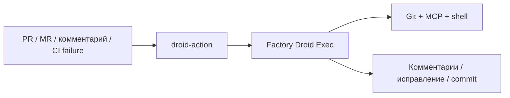
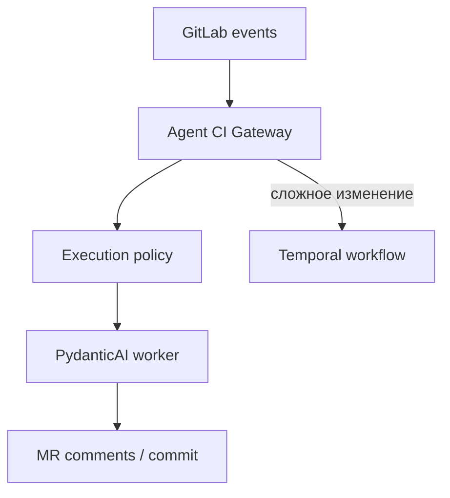
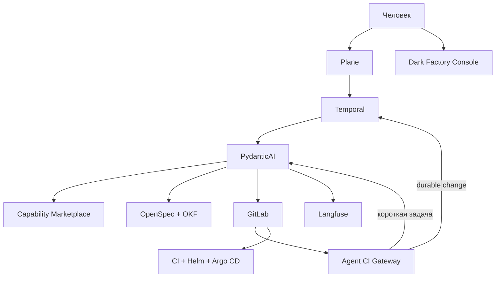

<!--
Источник: Notion — Улучшения в соответствии с droid
URL: https://app.notion.com/p/3d7db33037c880afaa81fbea5e04fe14
Выгружено: 2026-09-12
-->

# Улучшения в соответствии с droid

Короткий вывод: ваша Dark Factory существенно шире, чем `droid-action + factory-plugins`.

Эти два репозитория Factory.ai закрывают прежде всего:
- запуск AI-агента внутри GitHub/GitLab CI;
- автоматическое ревью, security review и исправление CI;
- упаковку навыков, команд, агентов, MCP и hooks в плагины.

Ваша архитектура претендует на управление полным жизненным циклом изменения: от инициативы и спецификации до реализации, проверки, релиза, накопления знаний и улучшения платформенных строительных блоков.

Поэтому Factory.ai здесь — не архитектурная альтернатива всей Dark Factory, а хороший референс для двух её подсистем:
1. Agent Execution / CI Agent Gateway.
2. Skill & Plugin Marketplace.

Сравнение основано на актуальном содержимом [droid-action](https://github.com/Factory-AI/droid-action) и [factory-plugins](https://github.com/Factory-AI/factory-plugins).

## 1. Что на самом деле представляют эти репозитории

### `Factory-AI/droid-action`

Это интеграционный адаптер между событиями GitHub/GitLab и проприетарным runtime Factory Droid.

Типичный поток:



Поддерживаемые сценарии:
- `@droid fill` — заполнение описания PR;
- `@droid review` — ревью изменений;
- `@droid security` — STRIDE/OWASP-проверка;
- полное security-сканирование репозитория;
- CI Steward:
    - анализ упавших jobs;
    - классификация flaky/infrastructure/code failure;
    - повторный запуск;
    - автоматическое исправление;
    - commit исправления;
    - ограничение числа итераций;
- repository-specific review guidelines через `.factory/skills/...`;
- GitHub Actions и GitLab CI Component.

Сам `droid-action` не является оркестратором всего SDLC. Он запускает одну ограниченную агентную сессию в ответ на событие.

### `Factory-AI/factory-plugins`

Это marketplace расширений для Droid. Формат плагина допускает:

```plain text
plugin/
├── .factory-plugin/plugin.json
├── skills/
├── droids/
├── commands/
├── mcp.json
└── hooks.json
```

То есть плагин способен объединять:
- инструкции/skills;
- специализированных агентов;
- пользовательские команды;
- MCP-инструменты;
- lifecycle hooks.

Сейчас публичный marketplace содержит, среди прочего:
- security engineering;
- code review;
- TypeScript/React practices;
- runtime debugging;
- browser/terminal/UI verification;
- создание и улучшение skills;
- autonomous research loop.

Это хороший механизм распространения повторно используемых возможностей, но не полноценная система управления архитектурой и SDLC.

---

# 2. Сравнение с вашей Dark Factory

<table header-row="true">
<tr>
<td>Архитектурный аспект</td>
<td>Ваша Dark Factory</td>
<td>`droid-action` / `factory-plugins`</td>
</tr>
<tr>
<td>Цель</td>
<td>Управление полным SDLC</td>
<td>Выполнение отдельных агентных задач</td>
</tr>
<tr>
<td>Источник работы</td>
<td>Plane: Initiative/Epic/Story/Bug</td>
<td>PR/MR, комментарий, CI event</td>
</tr>
<tr>
<td>Управление процессом</td>
<td>Temporal workflows</td>
<td>GitHub Actions / GitLab CI jobs</td>
</tr>
<tr>
<td>Agent harness</td>
<td>PydanticAI</td>
<td>Проприетарный Droid Exec</td>
</tr>
<tr>
<td>Долговременный процесс</td>
<td>Да: ожидания, approvals, retry, resume</td>
<td>Ограниченно жизнью CI/job и внутренней сессии</td>
</tr>
<tr>
<td>Спецификации</td>
<td>OpenSpec</td>
<td>Специального слоя нет</td>
</tr>
<tr>
<td>Архитектурные знания</td>
<td>OKF knowledge graph</td>
<td>Repo context, skills, session history</td>
</tr>
<tr>
<td>Управление задачами</td>
<td>Plane + Dark Factory Console</td>
<td>GitHub/GitLab issues и PR/MR</td>
</tr>
<tr>
<td>Human-in-the-loop</td>
<td>В бизнес-, архитектурных и release-gates</td>
<td>В основном через PR/MR</td>
</tr>
<tr>
<td>Agent observability</td>
<td>Langfuse</td>
<td>Логи action/Droid и комментарии</td>
</tr>
<tr>
<td>Исполнение</td>
<td>Локальные worktrees + CI agents</td>
<td>GitHub/GitLab runners</td>
</tr>
<tr>
<td>Skills</td>
<td>Версионируемые корпоративные skills</td>
<td>`SKILL.md` внутри плагинов</td>
</tr>
<tr>
<td>Marketplace</td>
<td>Нужно спроектировать</td>
<td>Уже есть plugin marketplace</td>
</tr>
<tr>
<td>MCP</td>
<td>Централизованный корпоративный tool layer</td>
<td>`mcp.json` внутри плагина</td>
</tr>
<tr>
<td>UI-стандарты</td>
<td>Small UIKit, токены, шаблоны, visual regression</td>
<td>Отдельные frontend/design skills</td>
</tr>
<tr>
<td>Backend-стандарты</td>
<td>Golden paths, библиотеки, шаблоны</td>
<td>Можно упаковать в skills, но готового слоя нет</td>
</tr>
<tr>
<td>Platform engineering</td>
<td>Kubernetes, Helm, Argo CD, GitLab, Vault</td>
<td>За пределами этих репозиториев</td>
</tr>
<tr>
<td>Deployment приложений</td>
<td>GitOps через Helm/Argo CD</td>
<td>Не является основной функцией</td>
</tr>
<tr>
<td>Enterprise IAM</td>
<td>Keycloak, Vault, политики инструментов</td>
<td>GitHub App/token и Factory API key</td>
</tr>
<tr>
<td>Непрерывное улучшение блоков</td>
<td>Registry, метрики adoption, upgrade campaigns</td>
<td>Skill creation и autoresearch, но нет целой модели rollout</td>
</tr>
<tr>
<td>Vendor independence</td>
<td>Open-source/self-hosted компоненты</td>
<td>Критическая зависимость от Factory API/Droid</td>
</tr>
</table>

## Главное архитектурное отличие

Factory строит систему вокруг coding agent:

```plain text
Repository → Droid → изменения в Repository
```

Вы строите систему вокруг управляемого Change:

```plain text
Business change
  → refinement
  → specification
  → architecture
  → implementation
  → verification
  → release
  → knowledge update
  → platform learning
```

Это принципиально разный уровень охвата.

---

# 3. Сильные стороны подхода Factory.ai

## 3.1. Простая событийная интеграция

`droid-action` не пытается реализовать весь процесс разработки. Он реагирует на понятные события:
- появился MR;
- пользователь вызвал команду;
- завершился pipeline;
- упала проверка;
- запущено расписание.

Это стоит перенести в Dark Factory. Не всякое действие должно проходить через большой Temporal workflow.

Например:
- заполнить MR description;
- провести review;
- классифицировать падение теста;
- проверить соблюдение UI Kit;
- обновить changelog.

Такие операции лучше запускать короткими event-driven jobs.

## 3.2. Ограничение возможностей технически

Особенно удачно сделан CI Steward:
- edit tools предоставляются только при разрешённом auto-fix;
- scope исправлений определяется до запуска агента;
- protected paths проверяются после работы;
- есть бюджеты retries/fixes/runs;
- конфигурация берётся из default branch;
- fork PR не получает доступ к секретам;
- изменения, нарушающие политику, откатываются.

Это сильнее, чем просто написать агенту в prompt: «не меняй production Helm».

Для Dark Factory это должен быть фундаментальный принцип:

> Политика исполняется оркестратором и sandbox, а не только инструкцией модели.

## 3.3. Удачная модель плагина

Сочетание `skills + agents + commands + MCP + hooks` лучше, чем хранение сотен несвязанных промптов.

Для вашей фабрики плагин может представлять целую capability:

```plain text
small-react-frontend/
├── plugin.yaml
├── skills/
│   ├── use-small-uikit/
│   ├── accessibility-review/
│   └── visual-regression/
├── agents/
│   ├── ui-implementer.yaml
│   └── ux-reviewer.yaml
├── commands/
│   ├── implement-screen.yaml
│   └── review-screen.yaml
├── policies/
│   ├── allowed-dependencies.rego
│   └── protected-paths.yaml
├── tools/
│   └── mcp.json
└── evaluations/
    ├── component-compliance.yaml
    └── visual-quality.yaml
```

Factory.ai не показывает полноценные `policies` и `evaluations` как центральную модель плагина. Для вашей фабрики их стоит добавить.

## 3.4. Хорошая модель постепенного внедрения

`droid-action` можно добавить в репозиторий двумя файлами, не мигрируя весь процесс. Это важный урок для SMALL.

Dark Factory тоже должна подключаться к существующему проекту постепенно:
1. automated review;
2. CI diagnosis;
3. specification validation;
4. implementation agent;
5. полный ChangeWorkflow.

---

# 4. В чём ваша архитектура сильнее

## 4.1. Полный управляемый SDLC

Temporal позволяет моделировать:
- `ChangeWorkflow`;
- `RefinementWorkflow`;
- `ImplementationWorkflow`;
- `ReviewReworkWorkflow`;
- `VerificationWorkflow`;
- `ReleaseWorkflow`.

Появляются:
- устойчивое состояние процесса;
- ожидание решения человека;
- таймауты;
- компенсации;
- controlled retry;
- параллельные проверки;
- восстановление после сбоя;
- прослеживаемость от Story до production.

GitHub Action не следует использовать как замену этой модели.

## 4.2. Отделение процесса от агента

В целевой Dark Factory:
- Temporal решает, что и когда выполнить;
- PydanticAI определяет, как агент рассуждает и вызывает tools;
- Plane показывает состояние работы человеку;
- GitLab хранит проверяемый результат;
- Langfuse наблюдает за AI-выполнением.

У Factory Droid orchestration и agent runtime сильнее связаны с продуктом поставщика.

Ваше разделение сложнее, но архитектурно устойчивее и допускает замену:
- модели;
- agent harness;
- task tracker;
- Git provider;
- execution environment.

## 4.3. Спецификация как самостоятельный артефакт

В Factory поток в основном начинается с уже существующего issue или PR. Но качественная разработка начинается раньше — с проверки проблемы, ограничений, acceptance criteria, NFR и архитектурных последствий.

OpenSpec даёт вашей фабрике формализованный контракт изменения до генерации кода.

## 4.4. Корпоративный knowledge graph

Repo context хорошо отвечает на вопрос:

> Как устроен этот репозиторий?

OKF должен отвечать на более широкий вопрос:

> Какие системы, capabilities, API, события, владельцы, данные и ограничения затрагивает изменение?

Для SMALL это критично: Pricing, Loyalty, MDM, OMS, Stock, Kafka и IAM не помещаются в контекст одного репозитория.

## 4.5. Golden paths и управляемое развитие платформы

Ваша фабрика предусматривает:
- Small UIKit;
- backend-библиотеки;
- service templates;
- API/event conventions;
- Helm charts;
- observability defaults;
- IAM integration;
- автоматические upgrade campaigns.

`factory-plugins` позволяет распространить инструкции, но сам по себе не обеспечивает:
- dependency inventory;
- совместимость версий;
- измерение adoption;
- массовое обновление приложений;
- canary rollout;
- контроль архитектурного drift.

---

# 5. Где ваша архитектура пока уступает Factory.ai

Здесь у Dark Factory есть четыре заметных пробела.

## 5.1. Нет единого формата расширения

Сейчас у вас отдельно существуют:
- skills;
- prompts;
- PydanticAI agents;
- Temporal activities/workflows;
- MCP configurations;
- policies;
- evaluation datasets;
- templates.

Нужен общий `Factory Package` или `Capability Pack`.

Например:

```yaml
apiVersion: darkfactory.small.kz/v1
kind: CapabilityPack
metadata:
  name: small-react-application
  version: 1.4.0

runtime:
  agents:
    - ui-implementer
    - ui-reviewer

skills:
  - small-uikit
  - react-architecture
  - accessibility

tools:
  - gitlab
  - plane
  - playwright
  - small-uikit-catalog

workflows:
  - implement-ui
  - verify-ui

policies:
  protectedPaths:
    - .gitlab-ci.yml
    - deploy/prod/**
  allowedPackages:
    - "@small/ui"
    - "@tanstack/react-query"

evaluations:
  - ui-compliance
  - accessibility
  - visual-regression
```

## 5.2. Нет лёгкого event-driven режима

Если каждое исправление линтера требует создания Temporal workflow, Story в Plane и OpenSpec change, фабрика станет тяжёлой.

Нужно два режима:

<table header-row="true">
<tr>
<td>Режим</td>
<td>Для чего</td>
</tr>
<tr>
<td>Fast Agent Job</td>
<td>Review, CI fix, docs, formatting, dependency update</td>
</tr>
<tr>
<td>Durable Change Workflow</td>
<td>Feature, архитектурное изменение, миграция, release</td>
</tr>
</table>

`droid-action` — хороший образец первого режима.

## 5.3. Недостаточно конкретна модель capability security

В Dark Factory нужно формализовать:
- read/write tools отдельно;
- разрешённые репозитории;
- разрешённые пути;
- допустимые команды;
- network destinations;
- secrets scope;
- maximum cost;
- maximum iterations;
- maximum changed files;
- возможность создания MR, но не merge;
- deployment permissions по окружениям.

Factory уже реализует часть этого для CI Steward на уровне runtime enforcement.

## 5.4. Нужен настоящий marketplace

Skills, шаблоны и MCP-конфигурации должны быть:
- версируемыми;
- подписанными;
- тестируемыми;
- совместимыми с конкретными runtime;
- распространяемыми по проектам;
- автоматически обновляемыми;
- измеряемыми по эффективности.

Одного Git-репозитория с папками skills будет мало, когда фабрика охватит 20 команд.

---

# 6. Что стоит перенять практически

Я бы добавил к вашей архитектуре два компонента.

## Agent CI Gateway

Лёгкий сервис/набор GitLab CI Components:



Он должен поддерживать команды, аналогичные:
- `@factory refine`;
- `@factory implement`;
- `@factory review`;
- `@factory security`;
- `@factory fix-ci`;
- `@factory verify-ui`;
- `@factory explain`;
- `@factory update-spec`;
- `@factory prepare-release`.

Fast-задачи выполняются непосредственно worker'ом. Долговременные задачи передаются в Temporal.

## Capability Marketplace

Центральный каталог:
- skills;
- agents;
- commands;
- workflows;
- MCP/tool adapters;
- policy packs;
- golden paths;
- evaluation suites;
- application templates.

Для первого этапа не нужен отдельный сложный сервис. Достаточно:
1. GitLab-репозитория `dark-factory-capabilities`;
2. manifest-схемы;
3. semantic versioning;
4. CI-валидации;
5. OCI-публикации пакетов в Harbor;
6. каталога в Dark Factory Console.

Позже можно добавить рейтинги, compatibility matrix, usage metrics и controlled rollout.

---

# 7. Рекомендуемая объединённая архитектура



Здесь подход Factory.ai используется там, где он действительно силён:
- CI-triggered execution;
- команды в MR;
- изолированные skills;
- plugin marketplace;
- runtime-enforced permissions;
- bounded auto-fix loops.

А ваши компоненты сохраняют полный контур управления:
- Plane — рабочая прозрачность;
- Temporal — надёжный SDLC;
- OpenSpec — контракт изменения;
- OKF — корпоративный контекст;
- PydanticAI — независимый agent harness;
- Langfuse — AI observability;
- GitLab + Helm + Argo CD — delivery.

# Итоговая оценка

<table header-row="true">
<tr>
<td>Критерий</td>
<td>Dark Factory</td>
<td>Factory OSS-репозитории</td>
</tr>
<tr>
<td>Полнота SDLC</td>
<td>9/10</td>
<td>4/10</td>
</tr>
<tr>
<td>Простота внедрения</td>
<td>5/10</td>
<td>9/10</td>
</tr>
<tr>
<td>Vendor independence</td>
<td>9/10</td>
<td>4/10</td>
</tr>
<tr>
<td>Agent CI integration</td>
<td>6/10</td>
<td>9/10</td>
</tr>
<tr>
<td>Skills/plugin packaging</td>
<td>5/10</td>
<td>9/10</td>
</tr>
<tr>
<td>Enterprise knowledge</td>
<td>9/10</td>
<td>3/10</td>
</tr>
<tr>
<td>Durable orchestration</td>
<td>9/10</td>
<td>3/10</td>
</tr>
<tr>
<td>Security enforcement</td>
<td>6/10</td>
<td>8/10</td>
</tr>
<tr>
<td>Platform standardization</td>
<td>9/10</td>
<td>5/10</td>
</tr>
<tr>
<td>Текущая зрелость реализации</td>
<td>Пока 3–4/10</td>
<td>8/10</td>
</tr>
</table>

Мой вывод: менять вашу архитектуру на Factory.ai не следует. Но стоит явно скопировать три архитектурных паттерна:
1. **Agent CI Gateway**, аналогичный `droid-action`.
2. **Capability Marketplace**, развивающий модель `factory-plugins`.
3. **Технически исполняемые ограничения**, как в CI Steward.

Это закроет наиболее слабое место текущей Dark Factory: между большой, хорошо продуманной SDLC-архитектурой и быстрым практическим запуском агента на конкретном MR или упавшем pipeline.
