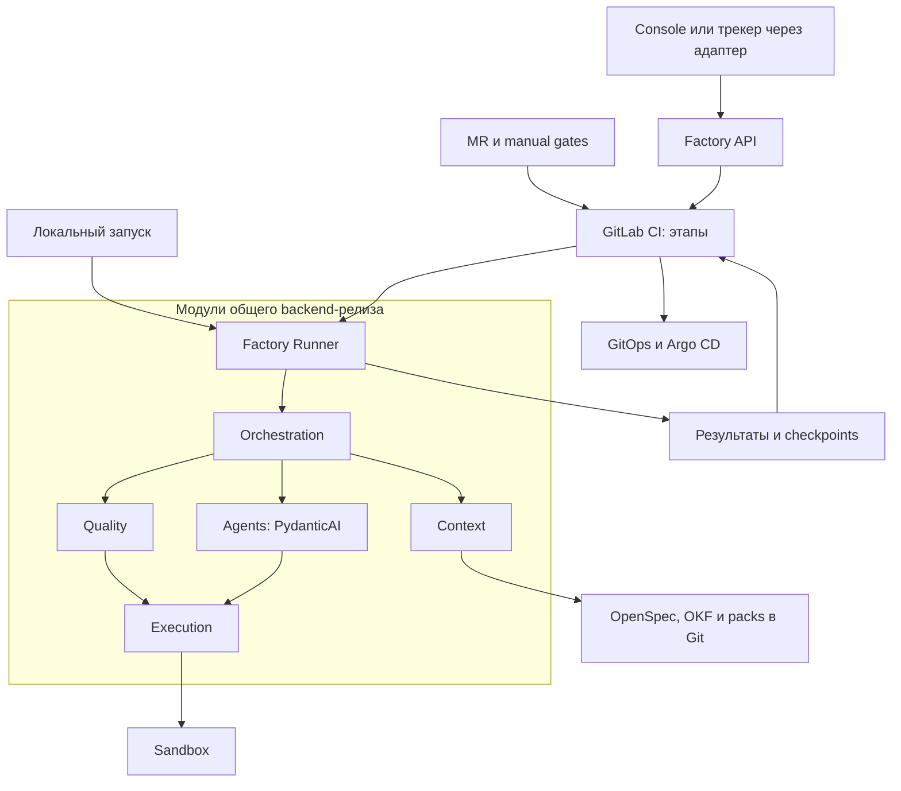
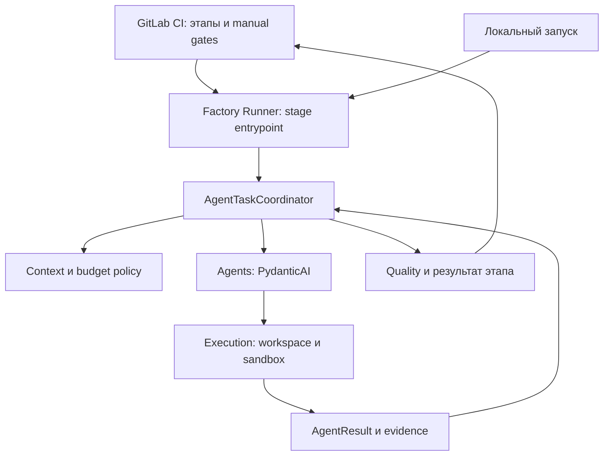

<!--
Источник: Notion — Компоненты фабрики
URL: https://app.notion.com/p/3d3db33037c8807ca02cda6cfddf0784
Выгружено: 2026-09-12
-->

# Компоненты фабрики

Описание целевой Dark Factory · 10 сентября 2026

**Статус:** проект архитектуры. Документ раскрывает компоненты и их границы; он не утверждает, что они уже реализованы.

Решение для текущего MVP от 10 сентября 2026: GitLab CI управляет этапами SDLC; Python + PydanticAI — мультиагентной работой внутри запуска; Temporal и DBOS не требуются. Отдельная БД ядра не вводится: состояние выражается через Git, MR и результаты CI. Console использует Radix + shadcn; трекеры и UI Kits подключаются через adapters/packs. OpenSpec применяется и к продуктам, и к самой Dark Factory.

Основа: [HLD MVP](hld-mvp.md). Более ранние идеи из [Модульность фабрики](factory-modularity.md) используются только там, где не противоречат HLD MVP.

**Приоритет источников:** предоставленное пользователем решение о GitLab-first MVP заменяет прежнюю схему «короткое в CI, долгое в Temporal» и прежнее предположение об обязательном PostgreSQL ядра. Ссылки на HLD и раннюю модульность сохранены для контекста; актуальные границы MVP описаны здесь.

## Архитектура в целом

Dark Factory — модульный монолит Python с шестью модулями: Changes, Orchestration, Agents, Context, Execution, Quality. API работает как сервис, Factory Runner запускает этап из того же backend-релиза в CI или локально. Console — React + Radix + shadcn. GitLab CI управляет последовательностью этапов и согласованиями; Python-модуль Orchestration координирует агентов внутри этапа. Сгенерированный код выполняется в sandbox. Постоянный workflow engine и отдельная БД ядра в MVP отсутствуют.

Перечень ниже содержит логические компоненты разных уровней: модуль, библиотека, конфигурация, внешний продукт, процесс или инфраструктура. Это **не 31 отдельный микросервис**.

<table header-row="true">
<tr>
<td>Слой</td>
<td>Состав</td>
<td>Физическое исполнение</td>
</tr>
<tr>
<td>Управление</td>
<td>Console, API, Changes, approvals</td>
<td>Frontend и backend API</td>
</tr>
<tr>
<td>Процесс и агенты</td>
<td>Orchestration, Agents, Context, Quality, policies</td>
<td>Factory Runner внутри CI job либо локального запуска</td>
</tr>
<tr>
<td>Выполнение кода</td>
<td>Execution, workspace, Sandbox Runner</td>
<td>Управляющий модуль + ограниченные Kubernetes Jobs</td>
</tr>
<tr>
<td>Инженерная база</td>
<td>OpenSpec продуктов и фабрики, OKF, packs, skills, подключаемые UI Kits</td>
<td>Git, библиотеки и инструменты</td>
</tr>
<tr>
<td>Интеграции</td>
<td>Адаптеры трекеров: Plane/Jira/Linear; GitLab, LLM, Langfuse</td>
<td>Внешние системы через адаптеры</td>
</tr>
<tr>
<td>Поставка и эксплуатация</td>
<td>Git/MR/CI artifacts, Artifact Store, Registry, Helm, Argo CD, Kubernetes</td>
<td>Инфраструктурные сервисы и репозитории</td>
</tr>
</table>

На схеме показаны основные зависимости, а не все сетевые соединения. Модули используют типизированные порты; доступ к внешним продуктам выполняют адаптеры. Политики, registry, хранилища и telemetry являются общими обеспечивающими механизмами.

## Каталог компонентов

### 1. Dark Factory Console — рабочее место оператора

**Тип:** React-приложение на Radix + shadcn; отдельная frontend-сборка.

Console использует собственные темы, tokens и композиции компонентов Radix + shadcn. Small UIKit не является её зависимостью. Выбор UI Kit создаваемого продукта на Console не влияет.

Показывает инициативы и запуски, этап, блокеры, вопросы, бюджет, diff, preview и evidence. Через Console человек запускает и отменяет работу, просматривает основания для согласования и переходит к MR/manual gate. Источник решения — GitLab с проверяемым участником и привязкой к версии.

**Вход → выход:** состояние и артефакты → команды Factory API и решения человека.

Продуктовое планирование может находиться в подключённом трекере — Plane, Jira, Linear или другом. Console управляет исполнением фабрики и поддерживает прямой intake без трекера. В MVP достаточно списка запусков и карточки ChangeRun.

### 2. Factory API — вход в управляющий контур

**Тип:** FastAPI; процесс из общего backend-релиза.

Принимает команды Console и адаптеров, проверяет контракты и права, вызывает GitLab API для запуска pipeline и чтения статусов. API не содержит собственного постоянно работающего SDLC engine.

**Операции:** submit change, start stage, cancel, get status, get evidence. Ответ на запуск содержит change_id и подтверждённую ссылку на pipeline. При потере ответа GitLab результат сначала сверяется по correlation ID.

Согласование фиксируется в MR или блокирующем manual job. Console показывает соответствующую ссылку; действие через API допустимо только с сохранением проверяемой личности согласующего. Общий bot token не должен подменять её.

Повторный запрос проверяет уже существующую инициативу и запуск. Без транзакционного диспетчера строгая exactly-once доставка не обещается; конкурентные повторы сериализуются механизмами выбранного CI-процесса.

### 3. Factory Runner / CLI — исполнение этапа

**Тип:** CLI/entrypoint общего Python backend, запускаемый GitLab job либо локально.

Получает stage, change_id, RunSnapshot и ссылки на входные результаты. Вызывает Orchestration, Context, Agents, Execution и Quality, сохраняет результат этапа и завершает процесс.

В MVP нет отдельного Temporal worker и постоянно работающего worker с собственной очередью. GitLab Runner предоставляет вычислительную среду для CI job; Factory Runner — программа внутри неё.

Один запуск может включать несколько агентов и ограниченный цикл agent → patch → test → rework. Отдельный job на каждый tool call не создаётся.

При ожидании решения человека сохраняются вопросы, спецификация и MR, затем запуск заканчивается. Продолжение получает сохранённые входы, а не живое состояние Python. Локальный запуск использует те же контракты; обязательная финальная проверка проходит в CI.

### 4. Changes — инициатива и решения человека

**Тип:** внутренний доменный модуль.

Владеет ChangeRequest, нейтральной ссылкой ExternalWorkItemRef на выбранный трекер через TrackerPort, исходной целью, областью изменения и Approval. Трекером может быть Plane, Jira, Linear или другая система; ссылка необязательна при прямом intake. Отличает инициативу от её попыток исполнения: одна Change может иметь несколько ChangeRun.

**Операции:** submit, approve, reject, cancel. **Выход:** нормализованный запрос и проверенное решение, адресованное конкретному run/этапу.

Approval представляет ссылку на решение MR/manual job и содержит участника, действие, время, основание и spec revision либо commit SHA. Отдельная approval-БД в ядре не создаётся. После изменения согласованного содержимого соответствующий approval становится неприменим. Модуль не вызывает LLM и shell.

### 5. Orchestration — мультиагентная координация внутри этапа

**Тип:** Python-модуль src/factory/modules/orchestration в модульном монолите.

**GitLab CI управляет этапами SDLC и зависимостями jobs. AgentTaskCoordinator в Python управляет агентами внутри одного запуска.** Второй глобальный движок переходов в ядре не создаётся.

Stage entrypoint выбирает обработчик Refinement, Planning, Implementation, ReviewRework, Verification или Release. Эти обработчики вызываются из pipeline; .gitlab-ci.yml описывает порядок, зависимости и ручные точки, но не содержит prompts и агентных циклов.

AgentTaskCoordinator:
- проверяет предложенную Planner декомпозицию и зависимости задач;
- выбирает agent profiles, модели, skills и ContextBundle;
- резервирует бюджет внутри запуска и ограничивает параллелизм;
- вызывает PydanticAI через Agents, собирает AgentResult и evidence;
- объединяет независимые изменения и выполняет ограниченный rework.

UI и backend сначала согласуют контракт; независимые writers получают отдельные workspace. Интеграция последовательная, итог проверяется на общем SHA. В MVP один активный change и максимум две независимые агентные задачи.

**Вход → выход:** TaskEnvelope, RunSnapshot, результаты предыдущего этапа → результат этапа, checkpoint, blockers, usage и ссылки на артефакты.

Локальный запуск и CI используют один Python-модуль. Возможный будущий durable engine сможет вызывать те же обработчики; универсальный runtime DSL сейчас не разрабатывается.

При падении job повторяется этап либо используется явно реализованный checkpoint. Автоматическое продолжение Python-кода с последней операции не предполагается.

### 6. Temporal — возможное расширение после MVP

**Статус:** исключён из обязательного состава и deployment MVP. DBOS и другой workflow engine вместо него также не вводятся.

Даже ожидание согласования несколько дней не требует Temporal: pipeline может ждать manual job без занятого runner, либо следующий этап запускается после решения с сохранённым результатом предыдущего.

Вернуться к durable engine следует при реальной необходимости корреляции нескольких внешних событий, сложных таймеров и эскалаций, автоматического восстановления после частичных изменений и координации связанных инициатив.

Критерий — сложность ожиданий и восстановления, а не длительность задачи или количество агентов. Если вокруг GitLab появляется собственный журнал переходов, очередь событий и планировщик восстановления, нужно пересмотреть решение.

Будущая интеграция затронет сохранение состояния, retry, сигналы и deployment; это отдельное архитектурное изменение. Обработчики этапов и AgentTaskCoordinator останутся Python-кодом фабрики.

### 7. Agents — Agent Runtime на PydanticAI

**Тип:** внутренний модуль и библиотека исполнения агентов.

Владеет AgentRun, загрузкой профиля, подготовкой разрешённых tools, вызовами модели, проверкой структуры ответа и учётом usage. Получает ограниченное задание, а не полномочия на весь SDLC.

**Вход:** TaskEnvelope с целью, AC, ContextBundle, схемой ответа, deadline и бюджетом. **Выход:** AgentResult со статусом, artifact/evidence refs, blockers и usage.

PydanticAI используется как harness для типизированного взаимодействия с моделью и инструментами. Профили и DSL фабрики реализуются поверх него; это не готовый формат конфигурации библиотеки.

Agents вызывается AgentTaskCoordinator из Orchestration внутри CI job либо локального запуска. Повторы runtime и CI имеют согласованные лимиты; сохранённое usage учитывается при повторе этапа. Структурно валидный JSON ещё не доказывает правильность реализации.

### 8. Профили агентов — настраиваемые роли

**Тип:** версионируемые конфигурации в Git, исполняемые одним Agent Runtime.

Профиль задаёт роль, prompt, skills, output schema, контекстную политику, список инструментов, модельную политику и лимиты. Flow связывает конкретный этап с профилем.

<table header-row="true">
<tr>
<td>Роль</td>
<td>Задача и результат</td>
</tr>
<tr>
<td>Analyst</td>
<td>Уточняет цель, сценарии, AC и вопросы; готовит спецификацию.</td>
</tr>
<tr>
<td>Planner</td>
<td>Определяет план, зависимости, контракты, риск и необходимость архитектора.</td>
</tr>
<tr>
<td>Implementer</td>
<td>Выполняет связанное изменение в workspace; UI/Python/Go — специализации профиля.</td>
</tr>
<tr>
<td>Reviewer</td>
<td>Независимо анализирует spec, diff и evidence; возвращает findings, не скрытые исправления.</td>
</tr>
<tr>
<td>Verifier</td>
<td>Анализирует покрытие AC и результаты проверок; сами тесты исполняются программами.</td>
</tr>
</table>

Архитектурный, UI, security и data-эксперты подключаются по сложности задачи. Для штатного release отдельный LLM-агент не нужен.

Мультиагентность означает несколько ограниченных задач и независимых контекстов. Отдельный сервис или pod на роль не требуется. В MVP — один ChangeRun, максимум две независимые агентные задачи; один writer на workspace. Объединённый результат проверяется повторно.

### 9. Model Catalog и LLM-доступ

**Тип:** конфигурация Agents + ModelPort-адаптер; провайдеры или существующий LiteLLM — внешняя зависимость.

Каталог сопоставляет алиасы вроде coding-standard и reasoning-strong с provider/model ID, поддерживаемыми возможностями, настройками и версией тарифов. Конкретный выбор фиксируется для запуска.

**Вход → выход:** профиль и требования задачи → выбранная модель и результат вызова с usage.

Простое извлечение данных получает недорогую модель; сложное проектирование и независимый review — более сильную. Тесты, lint и формальные преобразования работают без LLM. Эскалация ограничена числом попыток и бюджетом.

LiteLLM, если используется, решает доступ к моделям. Он не определяет SDLC, не заменяет Agent Runtime и не является источником бюджета ChangeRun. Новый собственный gateway в MVP не создаётся.

### 10. Policy и Budget Control — правила допуска

**Тип:** общие типизированные сервисы внутри монолита, без отдельного policy-сервера в MVP.

Проверяют область изменения, доступные инструменты, риск, требуемые gates, согласования, стоимость, время, число попыток и параллелизм. Механизмы вызываются Changes, Orchestration, Agents и Execution в соответствующих точках.

Бюджет резервируется до запуска параллельной задачи и сверяется с фактическим usage после неё. При неизвестном результате платного вызова резерв нельзя немедленно считать свободным. Оценка расходов фабрики сверяется с данными провайдера; абсолютный финансовый предел требует также provider-side ограничений.

Prompt сообщает правило агенту, но доступ ограничивают код, credentials и инфраструктура. Агент не может изменить политику своей проверки и этим же изменением разрешить себе merge.

### 11. Context — сборка контекста

**Тип:** внутренний модуль.

Собирает ContextBundle из AC, OpenSpec, релевантного кода, контрактов, OKF и инженерного pack. Хранит происхождение сведений: URI, commit/version и причину включения.

**Вход → выход:** задача, scope и бюджет контекста → компактный пакет проверяемых источников.

Сначала используются пути, текст, метаданные и известные отношения. Отдельные graph/vector DB не обязательны. Индекс является производным и может быть перестроен.

Context не копирует всю корпоративную БЗ в каждый запрос и не объявляет противоречивые требования согласованными. Неоднозначности возвращаются Analyst/Planner. Инструкции из репозитория не могут расширять полномочия инструмента.

### 12. OpenSpec — спецификации продуктов и самой Dark Factory

**Тип:** файлы и процесс работы с ними в Git каждого разрабатываемого решения.

OpenSpec применяется в двух равноправных контурах:
- **Репозитории продуктов:** поведение приложения, сценарии, AC, контракты и задачи реализации.
- **Репозиторий dark-factory:** изменения Console, API, Orchestration, Agent Runtime, adapters, packs, policies и инфраструктурных возможностей фабрики.

Спецификации Dark Factory хранятся в её собственном openspec/ рядом с исходниками; в продуктах — в их openspec/. Разработка фабрики следует тому же циклу proposal/specification → plan/tasks → implementation → verification → archive.

Например, подключение Jira Adapter или нового UI-pack начинается со спецификации capabilities, схем конфигурации, ошибок и acceptance tests. Изменение мультиагентного координатора описывает dispatch, retry, budget и условия завершения.

**Результат:** spec revision, связанная с approval, MR и evidence. OpenSpec хранит ожидаемое поведение, а состояние этапов хранится в GitLab CI, а результаты агентных запусков — в manifests/checkpoints.

HLD и ADR описывают архитектуру, OKF — межсистемные знания; OpenSpec описывает изменения и действующие требования конкретного репозитория. Clarification, architecture checklist и cross-artifact analysis включаются в gates; отдельный конкурирующий процесс Spec Kit не вводится.

Самоизменение фабрики проходит её OpenSpec, независимые gates и evals. Изменяющий агент не утверждает собственное расширение полномочий.

### 13. OKF — архитектурные знания

**Тип:** отдельный Git-репозиторий и KnowledgePort-адаптер.

Содержит системы, компоненты, capabilities, владельцев, зависимости, архитектурные решения, контракты и инварианты. Контекст читается на зафиксированной ревизии.

**Вход → выход:** component IDs и область изменения → релевантные ограничения и зависимости; принятый результат → предложение актуализации архитектурных объектов через MR.

OKF описывает ландшафт, OpenSpec — изменения и требования конкретного решения, включая саму Dark Factory. Индекс и граф строятся из канонических исходников. После merge фабрика предлагает обновление знаний; предположение агента не становится утверждённым архитектурным фактом автоматически.

### 14. Artifact Store — доказательства и результаты

**Тип:** порт хранения; PVC в lab, S3-совместимый backend при развитии.

Хранит отчёты тестов, browser traces, screenshots, логи команд, результаты агентов и manifests. Большие данные передаются ссылками, а не через историю workflow.

ArtifactRef содержит идентификатор, тип, URI, hash, размер, run/step ID и связь с проверяемой ревизией. Evidence дополнительно фиксирует, какое утверждение подтверждено, каким инструментом и с каким результатом.

Immutable-артефакт не перезаписывается новой попыткой. Нужны retention, ограничение объёма, права чтения и backup. ArtifactStorePort отделяет код фабрики от PVC/S3; управление метаданными остаётся в Context, техническое чтение и запись — в адаптере.

### 15. Execution — workspace и команды

**Тип:** внутренний модуль, вызывающий ExecutionPort.

Владеет Workspace, lease, CommandRun, подготовкой исходников, применением patch, запуском команд, сбором результатов и cleanup.

**Вход:** repo/base SHA, разрешённая область, команда, лимиты и refs входных файлов. **Выход:** workspace ref, exit code, изменения файлов, логи и evidence.

Lease исключает одновременную запись нескольких агентов в одну область. Worktree ускоряет работу с Git-деревьями, но не изолирует процессы, сеть и секреты. Execution не получает права production release.

### 16. Sandbox Runner — изолированное выполнение кода

**Тип:** Kubernetes executor и временные Jobs в namespace factory-runs.

Выполняет сгенерированный код, сборки и тесты вне управляющего процесса. Рабочая область может жить на время задачи и переиспользоваться между командами; Job и workspace имеют отдельные жизненные циклы.

Обязательны ограниченные CPU/RAM/disk/time, non-root, отсутствие privileged, hostPath и Docker socket, минимальный service account и отсутствие ненужного API token. Egress ограничивается реально работающими средствами кластера.

Execution-адаптер Factory Runner управляет Jobs только в разрешённом namespace. Push, создание MR и deployment выполняют управляющие адаптеры. По timeout/cancel процессы останавливаются, результаты собираются, ресурсы очищаются; при рестарте выполняется поиск осиротевших Jobs.

### 17. Quality — допуск на основе доказательств

**Тип:** внутренний модуль и доверенные реализации проверок.

Владеет GateResult, findings, набором обязательных проверок и агрегированным решением. Получает спецификацию, candidate SHA и результаты Execution/CI.

Проверяет полноту AC, архитектурные ограничения, типы, unit/integration/contract tests, безопасность, UI-сценарии и корректность release evidence. Набор зависит от pack и класса риска.

Отсутствующий отчёт, timeout или неполный запуск не считаются pass. Результаты тестов относятся к конкретному SHA; после изменений повторяются затронутые проверки и обязательный интеграционный gate.

LLM-review дополняет машинные проверки. Неуспех возвращает findings в ограниченный rework; при исчерпании бюджета процесс становится Blocked.

### 18. Подключаемые UI Kits и инженерные библиотеки

**Тип:** расширяемый каталог версионируемых UI/backend packs.

Фабрика не привязана к одному UI Kit. Проект выбирает ui_pack: например radix-shadcn, small-uikit или иной совместимый pack. **Для Console закреплён Radix + shadcn; Small UIKit — один из возможных вариантов для создаваемых продуктов.**

Каждый UI-pack определяет:
- технологическую совместимость и способ подключения компонентов: пакет зависимостей либо управляемый исходный код;
- tokens, тему, компоненты, patterns, templates, shell и системные состояния;
- источники документации/manifest и UI Knowledge Provider;
- skills, примеры, правила импортов и стилизации;
- stories/mocks, gates, visual baselines и критерии доступности;
- версии, migration instructions и consumer tests.

Для small-uikit pack могут применяться @small/ui и соответствующие ограничения импортов. Для radix-shadcn pack используются свои правила компонентов и исходников. Универсального требования импортировать @small/ui для всех продуктов нет.

Pack подключается через существующий Plugin Registry: добавляются manifest, документация, skills, blueprint и gate bindings. Если нужен новый источник знаний или исполнитель проверки, добавляется Adapter. Изменение доменного ядра не требуется.

Проверки получают активный ui_pack из RunSnapshot. Смешивание несовместимых kits блокируется политикой конкретного проекта. Подключение другого UI Kit к новому проекту и миграция существующего UI — разные изменения; миграция требует OpenSpec, плана и regression tests.

Backend-библиотеки расширяются тем же способом: Python/FastAPI, Go и другие профили предоставляют API/error conventions, IAM, observability и тестовые шаблоны.

Недостающий компонент оформляется как gap выбранного pack. Обновления распространяются отдельными MR с проверками потребителей; при хранении компонентов исходным кодом отдельно проверяются локальные изменения и конфликты обновления.

### 19. Storybook, mocks и UI verification

**Тип:** инструменты продукта и UI-pack, запускаемые в preview/sandbox/CI.

Storybook представляет каталог компонентов и состояния страниц; MSW моделирует ответы API для живого прототипа; Playwright проверяет пользовательские сценарии и визуальные изменения; accessibility-проверки дополняют их.

**Вход → выход:** UX-контракт и React-код → интерактивный preview, stories, screenshots, traces и GateResult.

UIKit/style policy берётся из выбранного ui_pack. TypeScript и тесты проверяют применение его компонентов и сценарии loading/empty/error/forbidden. Для Console используется radix-shadcn pack; продукт может выбрать small-uikit либо иной pack. UI Knowledge Provider отдаёт агенту документацию через доступный адаптер; MCP здесь возможен, но не обязателен.

Новая visual baseline требует отдельного согласования. Автоматические проверки не гарантируют удобство и отсутствие всех a11y-ошибок: новые и критичные сценарии проверяет человек. Figma не является обязательным входом.

### 20. Plugin Registry и Composition Root

**Тип:** код сборки приложения при старте, внутри общего релиза.

Composition Root связывает модули с реализациями портов. Registry проверяет manifest, совместимость версии core, схемы конфигурации, capabilities, зависимости и уникальность ID.

Для MVP три типа расширений: Adapter — доверенная реализация порта; Pack — декларативные профили, skills, prompts, schemas и ссылки на gates; Flow — доверенные Python-обработчики этапов, контракты и CI bindings.

Registry фиксируется на старте. Запуск получает snapshot конкретных версий. Профиль агента не требует нового Python-плагина, а новая модель часто требует только записи каталога.

Внутрипроцессный Python-плагин является доверенным кодом: manifest не создаёт изоляцию. Горячая загрузка произвольного кода, маркетплейс и самостоятельные сервисы для каждого типа плагина не входят в MVP.

### 21. Ports, adapters и MCP

**Тип:** типизированные интерфейсы и интеграционный код.

TrackerPort, SourceControlPort, CIPort, ModelPort, KnowledgePort, ArtifactStorePort, ExecutionPort и TelemetryPort определяют конкретные операции и результаты. Адаптер преобразует контракты фабрики в API внешней системы, обрабатывает pagination, rate limits, ошибки и повторные вызовы.

Нельзя заменять контракты универсальным invoke(any) или давать плагинам доступ к таблицам соседнего модуля. Бизнес-правила остаются у владельца операции.

MCP подходит для подключения внешних инструментов. Он не заменяет workflow, IAM и внутренние вызовы монолита. Разрешённые tools, credentials и область данных назначает runtime.

### 22. Packs, prompts, skills и blueprints

**Тип:** инженерная конфигурация в Git.

Pack объединяет профиль продукта или самой фабрики: версии инструментов и библиотек, agent profiles, prompts, skills, output schemas, gates и стартовый blueprint. Выбор ui_pack и его версии фиксируется в конфигурации проекта и RunSnapshot; Console использует radix-shadcn. Flow binding связывает stage с Python entrypoint, профилями агентов и CI job; тот же entrypoint доступен локально. Blueprint создаёт каркас продукта, skill описывает способ работы, prompt задаёт роль и конкретные инструкции, gate проверяет обязательный результат.

Корпоративные инварианты имеют канонический источник; project rules уточняют локальный контекст и не отменяют обязательные ограничения платформы.

Каждый run фиксирует версии этих элементов. Изменение pack влияет на новые запуски после проверки; незаметная подмена инструкций на retry запрещена. Packs поставляются вместе с monorepo фабрики до появления причины выделять отдельные репозитории.

### 23. Task Tracker Adapter — Plane, Jira, Linear и другие

**Тип:** заменяемые адаптеры внешних систем через TrackerPort.

**Plane не является ключевым или обязательным компонентом Dark Factory.** Он может быть первой реализацией адаптера наравне с Jira, Linear или другим трекером. Фабрика поддерживает прямой запуск через Console/API без внешнего трекера.

Трекер хранит продуктовую инициативу, приоритет, владельца и обсуждения. Адаптер нормализует их в ChangeRequest и публикует агрегированный статус, блокеры и ссылки на spec, run, MR, preview и release.

Changes хранит нейтральный ExternalWorkItemRef: provider, workspace/project, item ID и URL. Статусы, поля и webhook конкретной системы сопоставляются в конфигурации адаптера.

TrackerPort предоставляет get_work_item, publish_status, add_reference и другие явно типизированные операции. Адаптер объявляет capabilities; недоступные custom fields, approvals или webhook не предполагаются автоматически. В MVP согласование фиксируется в GitLab MR/manual gate; Console и трекер показывают ссылки на него.

Webhook дедуплицируется; внешняя публикация повторяется при ошибке. Сбой трекера не теряет работу и не блокирует независимые задачи. В MVP проверяется один выбранный адаптер и режим прямого intake; обязательной привязки к Plane нет.

### 24. GitLab — код, MR и контроль интеграции

**Тип:** внешняя система и SourceControlPort-адаптер.

Хранит код фабрики и продуктов, OpenSpec, инженерную конфигурацию и MR. Фабрика создаёт короткую ветку, публикует кандидат, связывает MR с ChangeRun и читает результат проверок.

Merge допускается после gates и approval для актуальной версии. Параллельные результаты интегрируются последовательно; проверяется объединённое состояние, а не только два независимых зелёных отчёта.

GitLab-специфичные API скрыты адаптером. Замена Git-хостинга требует нового адаптера и проверки доступных механизмов допуска, но не переписывания Agent Runtime или доменной модели.

### 25. GitLab CI и Registry — исполнение SDLC, проверки и сборка

**Тип:** pipelines, доверенные GitLab runners, CI-адаптер и registry.

**GitLab CI — основной механизм исполнения этапов MVP независимо от общей длительности инициативы.** Он задаёт зависимости jobs, проверки, manual gates и при необходимости дочерние/межпроектные pipelines.

Job вызывает Factory Runner с конкретным stage и pinned входами. Выбор агентов/моделей, параллелизм внутри задания и rework реализуются в Python. Быстрые итерации выполняются внутри одной job либо локально в worktree; новый pipeline на каждый вызов агента не создаётся.

Для человеческого решения используется MR или блокирующий manual job. Альтернатива — закончить этап и запустить следующий после согласования. Ожидание не удерживает работающий Python-процесс или CI runner.

**Вход → выход:** change_id, stage, Git SHA, RunSnapshot и input refs → результат этапа, reports, usage, checkpoint и при сборке image digest.

Retry повторяет job; checkpoint позволяет переиспользовать только явно сохранённые совместимые результаты. Перед созданием ветки, MR, pipeline или release проверяется существующий результат. Любой новый commit проходит необходимые gates заново.

Перед merge сверяются согласованный SHA, актуальная спецификация и evidence. Нажатие manual job само по себе не доказывает согласование правильной версии: связь проверяет обработчик.

Registry хранит неизменяемые образы. Публикуемый релиз собирается по принятому post-merge процессу; Argo CD получает digest через GitOps.

Для GitLab 16 синтаксис, доступность approvals и CI-механизмов сверяются с точной минорной версией и редакцией. MR-ревью и blocking manual gate выбираются из реально доступных механизмов.

### 26. GitOps-репозиторий, Helm и Argo CD

**Тип:** декларативное desired state, упаковка Kubernetes и контроллер синхронизации.

GitOps хранит environment values, версии charts и image digests. Helm описывает ресурсы приложения. Argo CD читает Git и приводит окружение к заданному состоянию.

Release-стадия создаёт разрешённое изменение GitOps, отслеживает синхронизацию и health, запускает smoke и только затем фиксирует успешный deployment.

Merge продуктового кода, публикация образа и успешное развёртывание — разные факты. Ошибка smoke не превращается в Done. Откат приложения указывает предыдущий digest; миграции данных требуют собственного плана.

В MVP автоматизируется согласованный dev release. Production остаётся отдельной процедурой с участием человека.

### 27. Kubernetes Docker Desktop — локальная платформа

**Тип:** среда lab на MacBook с Helm и Argo CD.

Размещает API/Console, Artifact Store при выборе PVC и Argo CD. Execution использует ограниченные Jobs в factory-runs; создаваемые приложения размещаются в apps-dev. GitLab Runner может быть локальным или внешним с доступом к разрешённой среде выполнения.

**Temporal, DBOS, отдельная БД ядра и постоянно работающий Factory Worker не входят в базовый deployment.** Factory Runner запускается на время CI job либо локального этапа.

Начальный профиль — один локальный узел, один активный change и одна тяжёлая sandbox-задача. Второй агент допускается при наличии ресурсов. Трекер, GitLab/CI, LLM endpoint и Langfuse могут быть удалёнными.

values-local и values-dc отделяют storage, ingress, identity, registry и ресурсы. Перенос артефактов и проверка восстановления выполняются явно; PVC не является backup.

При сне Mac локальные задачи могут прерваться. После запуска оператор повторяет этап с проверенными входами/checkpoint и сверкой внешних эффектов; прозрачное восстановление процесса не обещается.

### 28. Identity, secrets и аудит доступа

**Тип:** инфраструктурные механизмы и проверки API/runtime.

В локальном single-user профиле доступ ограничен локальным оператором. Для общей среды предусматривается OIDC через Keycloak и роли Operator, Approver, Admin. Право запустить задачу отделено от права согласовать merge или изменить политику.

Credentials разделяются по интеграциям и операциям. В Git и manifests находятся ссылки, а не значения секретов. Sandbox не получает общие release credentials; секреты не включаются в LLM-контекст и диагностические артефакты.

Корпоративные IAM/EIS/Kafka подключаются по конкретной потребности продуктов. Это интеграции ландшафта, а не обязательные сервисы внутреннего ядра Dark Factory.

### 29. Langfuse и техническая наблюдаемость

**Тип:** TelemetryPort-адаптер и внешний/опциональный сервис Langfuse; логи и метрики runtime.

Langfuse используется для анализа вызовов моделей, prompts, token usage, задержек и качества агентных результатов. Технические логи и метрики показывают очередь, ошибки CI jobs, агентных задач, sandbox, интеграций и deployment.

Сквозные идентификаторы: change ID, run ID, agent run ID, Git SHA, CI ID, deployment ref, trace ID.

Диагностические трассы не являются источником состояния SDLC, approvals или финансовых резервов. Их недоступность не должна терять обязательный audit/usage; диагностическая доставка может повторяться отдельно. Секреты и чувствительные данные фильтруются до отправки.

### 30. Evals и контролируемое самоулучшение

**Тип:** версионируемый набор задач, evaluators и отдельный flow изменений фабрики.

Сравнивает текущую и кандидатную версию prompts, skills, моделей, packs и runtime на одинаковых задачах. Измеряет долю принятых изменений, пропущенные дефекты, вмешательства человека, время и полную стоимость принятого изменения.

Изменения фабрики предварительно описываются в openspec/ репозитория dark-factory. Неудачные запуски становятся кандидатами в eval-набор после очистки данных. Агент может создать MR к фабрике, но не самостоятельно утвердить новые полномочия или снизить критерии своей приёмки.

Улучшения сначала проходят evals и пилот, затем распространяются по продуктам через version-update MR и consumer tests. В MVP достаточно небольшого фиксированного набора, отчёта сравнения и ручного допуска.

### 31. State Persistence — Git, MR и результаты CI без отдельной БД ядра

**Тип:** правила сохранения и чтения через GitLab/ArtifactStore adapters; выделенный DB server ядра в MVP не требуется.

Источники состояния:
- Git хранит OpenSpec фабрики и продуктов, код, конфигурации и pinned revisions.
- MR и manual jobs фиксируют review/решения, участника и время; ApprovalRef дополнительно связывает решение со spec revision или SHA.
- Pipeline/job records хранят этапы, попытки и их статусы.
- Run manifest и артефакты хранят входы, результаты агентов, usage, operation refs, blockers и checkpoints.

Каждая инициатива имеет стабильный change_id; каждый запуск — run_id и attempt_id, связанные с pipeline/job IDs. Новый запуск явно получает ссылки на предыдущие принятые результаты, а не автоматически берёт «последний artifact».

Checkpoint содержит task ID, input hashes, SHA, версии flow/pack/model settings, завершённые шаги, usage и ссылки на внешние эффекты. При несовместимости он не используется. Без checkpoint повторяется этап целиком.

Ветку, MR, образ и GitOps-изменение проверяют перед повторным созданием. Результаты сохраняются по завершении значимых шагов; потеря процесса до записи может привести к повторному платному LLM-вызову.

**Бюджет:** один координатор резервирует ресурсы между агентами своего запуска. Повторные попытки читают сохранённый usage; неопределённый расход после аварии не считается нулевым. Для MVP запуски одной инициативы сериализуются. Общий строгий бюджет множества независимых concurrent pipelines потребует атомарного постоянного ledger либо внешнего механизма лимитов.

Срок хранения CI artifacts должен покрывать ожидания и повторные запуски. Критичные входы, evidence и checkpoints сохраняются в долговременном Artifact Store по политике retention; истёкший или отсутствующий результат блокирует автоматическое продолжение.

Console читает GitLab и manifests через API; индекс является перестраиваемым представлением. Отдельный SQL State Store, event bus и outbox в MVP не вводятся.

**Ограничение:** это восстановление по результатам этапов, а не durable replay. При росте требований к событиям, конкуренции и автоматическому восстановлению вводится постоянное состояние и при необходимости Temporal отдельным решением. Внутренние БД GitLab, трекера и Langfuse остаются зависимостями этих продуктов.

## Источники истины и правила записи

<table header-row="true">
<tr>
<td>Сведения</td>
<td>Владелец и каноническое место</td>
<td>Кто использует</td>
</tr>
<tr>
<td>Цель, приоритет, продуктовый владелец</td>
<td>Выбранный трекер через TrackerPort либо прямой intake Console/API; snapshot закрепляется в ChangeRun</td>
<td>Changes и Console</td>
</tr>
<tr>
<td>Этапы, ожидания, retry</td>
<td>GitLab pipelines/jobs; сохранённые manifests и checkpoints для продолжения этапов</td>
<td>API, Factory Runner, Console</td>
</tr>
<tr>
<td>Approvals, budget ledger, audit</td>
<td>Решения MR/manual job, run manifests и сохранённое usage/evidence согласно компоненту 31</td>
<td>Orchestration и policy checks</td>
</tr>
<tr>
<td>Код, спецификация, prompts, skills, packs</td>
<td>Git с pinned revisions</td>
<td>Context, Agents, Quality</td>
</tr>
<tr>
<td>Системы и архитектурные отношения</td>
<td>OKF Git repo</td>
<td>Context и Planner</td>
</tr>
<tr>
<td>Логи тестов, screenshots, отчёты</td>
<td>Artifact Store; refs на конкретный SHA</td>
<td>Quality, Console, человек</td>
</tr>
<tr>
<td>LLM-трассы</td>
<td>Langfuse как диагностическое представление</td>
<td>Анализ и evals</td>
</tr>
<tr>
<td>Желаемая версия окружения</td>
<td>GitOps repo</td>
<td>Argo CD и Release</td>
</tr>
<tr>
<td>Фактически развёрнутая версия</td>
<td>Наблюдаемое состояние кластера и deployment evidence</td>
<td>Release и оператор</td>
</tr>
</table>

GitLab CI управляет переходами между этапами; Orchestration управляет задачами агентов внутри этапа. Внешние эффекты имеют устойчивые operation IDs; перед повтором результат сверяется. В MVP нет внутреннего event bus, outbox или durable engine. Ошибку внешней публикации сохраняют в результате и повторяют отдельным ограниченным запуском с дедупликацией.

## Контракты, связывающие компоненты

<table header-row="true">
<tr>
<td>Контракт</td>
<td>Минимальное содержание</td>
</tr>
<tr>
<td>ChangeRequest</td>
<td>Цель, actor, сценарии, AC, scope, tracker ref</td>
</tr>
<tr>
<td>RunSnapshot</td>
<td>Git SHA, flow/pack/prompt/skill versions, конкретная model config, policy version</td>
</tr>
<tr>
<td>TaskEnvelope</td>
<td>Цель задачи, входные refs, AC, output schema, tools, budget, deadline</td>
</tr>
<tr>
<td>AgentResult</td>
<td>Status, artifact refs, evidence refs, blockers, usage</td>
</tr>
<tr>
<td>GateResult</td>
<td>Gate/version, candidate SHA, status, findings, evidence refs</td>
</tr>
<tr>
<td>Approval</td>
<td>Actor, action, spec revision или SHA, время, основание</td>
</tr>
<tr>
<td>ReleaseReference</td>
<td>Source SHA, image digest, GitOps revision, environment, health/smoke evidence</td>
</tr>
</table>

Идентификаторы и общие конверты находятся в небольшом shared kernel. Предметные правила остаются в модулях. Проверки импортов и contract tests защищают границы. Точная схема полей проектируется в коде; таблица описывает ответственность контракта.

## Как компоненты работают вместе на одной задаче

1. Трекер через адаптер либо Console/API передаёт инициативу. Changes закрепляет change_id и входной snapshot; GitLab запускает refinement job с Factory Runner.
2. Context получает pinned OpenSpec, OKF и pack. Analyst готовит вопросы, спецификацию и MR. Если нужен человек, этап сохраняет результат и завершается. Решение фиксируется в MR/manual gate; следующий запуск получает утверждённую ревизию.
3. Planner составляет план и контракты; policy определяет проверки, бюджет и необходимое участие архитектора.
4. AgentTaskCoordinator в Orchestration формирует задачи и зависимости, выбирает профили/LLM и резервирует бюджет. Agents исполняет задачи; Execution подготавливает отдельные workspace и sandbox. Для UI применяется выбранный ui_pack; для Console — Radix + shadcn.
5. Reviewer изучает spec/diff/evidence независимо. Quality агрегирует проверки; замечания возвращаются в ограниченный rework.
6. GitLab CI проверяет итоговый commit, человек выполняет review и согласование актуального SHA. После merge собирается выпускаемый образ; новый commit всегда проходит необходимые проверки заново.
7. Release обновляет GitOps digest; Argo CD развёртывает dev. Health и smoke подтверждают результат. Deployment failure сохраняется как failure, даже если merge уже успешен.
8. Подключённый трекер получает итог и ссылки через адаптер; при прямом intake итог доступен в Console. Формируется предложение изменения OKF. Langfuse и evals используются для анализа качества и стоимости. При разработке фабрики спецификация и изменения сохраняются в её собственном репозитории.

## Что требуется на старте и что развивается позже

<table header-row="true">
<tr>
<td>Обязательно для сквозного MVP</td>
<td>Способ ограничить сложность</td>
</tr>
<tr>
<td>Console/API/Factory Runner и шесть модулей</td>
<td>Один репозиторий и backend-релиз; минимальный UI</td>
</tr>
<tr>
<td>GitLab CI для этапов; Git/MR/manifests и Artifact Store для состояния</td>
<td>Без Temporal и отдельной БД ядра; явные checkpoint, retention и безопасный повтор</td>
</tr>
<tr>
<td>Agents, profiles, policy, registry</td>
<td>Пять логических ролей; до двух независимых задач; Adapter/Pack/Flow</td>
</tr>
<tr>
<td>Execution, artifacts и Quality</td>
<td>Один Kubernetes executor и один технологический pack</td>
</tr>
<tr>
<td>TrackerPort и один выбранный адаптер, GitLab, CI, LLM; прямой intake</td>
<td>Использовать доступные внешние endpoints</td>
</tr>
<tr>
<td>OpenSpec и OKF</td>
<td>OpenSpec в репозитории фабрики и в продуктах; OKF отдельно; простой индекс</td>
</tr>
<tr>
<td>Helm, Argo CD, Docker Desktop Kubernetes</td>
<td>Один локальный кластер и dev release</td>
</tr>
<tr>
<td>Телеметрия и минимальные evals</td>
<td>Usage/audit обязательны; полный локальный Langfuse не обязателен</td>
</tr>
</table>

Развитие по подтверждённой потребности: дополнительные packs и flows, S3 backend, командный IAM, масштабирование sandbox, consumer evals, устойчивый общий кластер и процедура production release. Отдельные graph/vector DB, брокер внутренних событий, visual workflow builder, UI-плагины и массовый вынос модулей в сервисы не являются обязательной целевой стадией.

## Основания и связанные документы

- [HLD MVP](hld-mvp.md) — основной источник состава, шести модулей, типов расширений и deployment MVP.
- [Модульность фабрики](factory-modularity.md) — ранняя проработка модульности; положения, противоречащие HLD, не перенесены.
- [Целевая структура агентов и скиллов](target-agents-and-skills.md) — роли, skills, контракты передачи задач и принципы независимой проверки.
- [UI/UX](ui-ux.md) — UI-процесс, UIKit, прототипы, tests и visual approval.

**Зафиксированное решение MVP:** GitLab CI — этапы, Python + PydanticAI — агентная координация, Git/MR/CI artifacts — состояние. Temporal остаётся возможным будущим расширением по сложности восстановления. Эта актуализация относится к странице компонентов; связанные исходные страницы данным изменением не редактировались.
