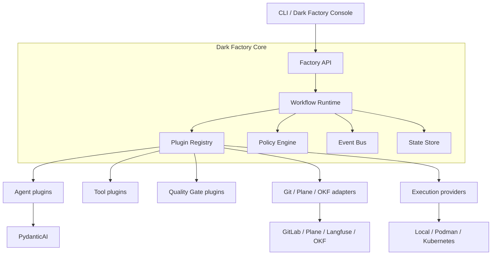
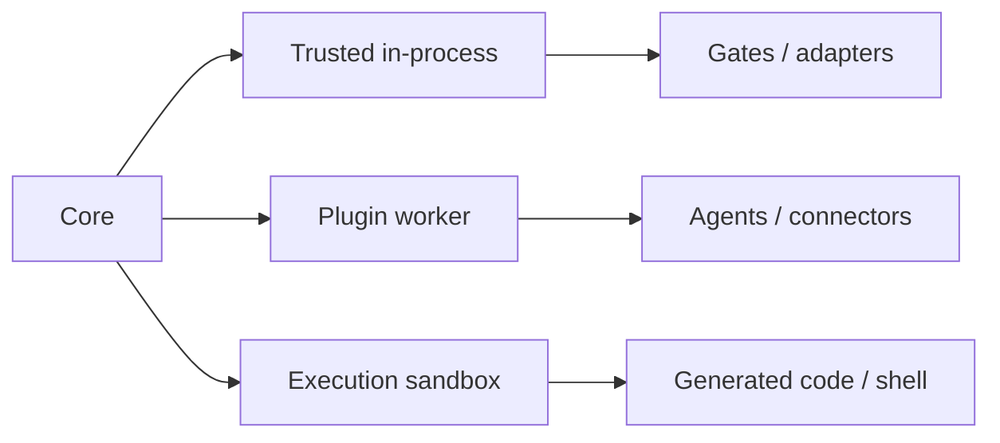

<!--
Источник: Notion — Модульность фабрики
URL: https://app.notion.com/p/3d7db33037c88046b107e4382c883527
Выгружено: 2026-09-12
-->

# Модульность фабрики

Чтобы Dark Factory действительно была модульной и плагинной, нужно построить её не как набор напрямую связанных сервисов, а как **небольшое стабильное ядро + контракты расширения + подключаемые плагины**.

Для вашего первого релиза я рекомендую **модульный монолит на Python**, а не микросервисную архитектуру. PydanticAI, workflow engine и большинство плагинов могут выполняться в одном процессе. Тяжёлые, небезопасные и независимо масштабируемые плагины — во внешних workers.

## 1. Целевая модель



Ядро ничего не должно знать о конкретных:
- GitLab или GitHub;
- Plane или Jira;
- Langfuse;
- Temporal;
- OKF;
- LLM-провайдере;
- локальном выполнении, Podman или Kubernetes;
- языках и технологических стеках создаваемых приложений.

Оно знает только интерфейсы: `SourceControl`, `TaskTracker`, `WorkflowEngine`, `Agent`, `QualityGate`, `ExecutionProvider`.

---

# 2. Что оставить в стабильном ядре

Ядро должно быть максимально маленьким.

## Обязательные функции Core

1. **Change model**

    Единая модель изменения:
    - `Change`;
    - `ChangeRun`;
    - `StepRun`;
    - `Artifact`;
    - `Decision`;
    - `Evidence`;
    - `Approval`;
    - `Failure`.

2. **Workflow Runtime**

    - состояния;
    - переходы;
    - retry;
    - checkpoint;
    - pause/resume;
    - human approval;
    - compensation;
    - лимиты review/rework.

3. **Plugin Registry**

    - обнаружение плагинов;
    - проверка совместимости;
    - конфигурация;
    - жизненный цикл;
    - выбор реализации интерфейса.

4. **Event Bus**

    Внутренние доменные события:
    - `change.created`;
    - `step.started`;
    - `artifact.produced`;
    - `gate.failed`;
    - `approval.requested`;
    - `change.released`.

5. **Policy Engine**

    Определяет:
    - разрешённые инструменты;
    - обязательные gates;
    - необходимость участия человека;
    - бюджеты;
    - допустимые модели;
    - права на commit, push, merge и deploy.

6. **State Store**

    PostgreSQL на старте. Без привязки доменной модели к Temporal, Plane или Langfuse.

## Что не включать в Core

- промпты;
- бизнес-правила конкретных приложений;
- UI Kit;
- знание конкретного Git;
- правила Python, Go или React;
- реализацию CI;
- логику Plane;
- структуру OKF;
- конкретные модели;
- deployment templates.

Это всё должно приходить через плагины или пакеты проекта.

---

# 3. Типы плагинов

Я бы ввёл восемь официальных типов.

<table header-row="true">
<tr>
<td>Тип</td>
<td>Назначение</td>
<td>Примеры</td>
</tr>
<tr>
<td>`agent`</td>
<td>Выполнение интеллектуальной роли</td>
<td>Analyst, Builder, Reviewer</td>
</tr>
<tr>
<td>`tool`</td>
<td>Действие, доступное агенту</td>
<td>Git, filesystem, browser, database</td>
</tr>
<tr>
<td>`workflow`</td>
<td>Описание процесса</td>
<td>Change, Bugfix, Dependency Update</td>
</tr>
<tr>
<td>`gate`</td>
<td>Детерминированная проверка</td>
<td>Tests, security, architecture, UX</td>
</tr>
<tr>
<td>`connector`</td>
<td>Интеграция с внешней системой</td>
<td>GitLab, Plane, Langfuse, OKF</td>
</tr>
<tr>
<td>`executor`</td>
<td>Среда выполнения</td>
<td>Local, worktree, Podman, Kubernetes</td>
</tr>
<tr>
<td>`knowledge`</td>
<td>Получение и публикация контекста</td>
<td>OKF, repository RAG, OpenMetadata</td>
</tr>
<tr>
<td>`blueprint`</td>
<td>Шаблон создаваемого приложения</td>
<td>React/FastAPI, Go service, worker</td>
</tr>
</table>

Дополнительно можно иметь `ui-extension`, но только после появления Dark Factory Console.

---

# 4. Ключевые extension points

## Agent plugin

Агент не должен управлять workflow. Он получает задание и возвращает структурированный результат.

```python
class AgentPlugin(Protocol):
    manifest: PluginManifest

    async def execute(
        self,
        context: AgentContext,
        task: AgentTask,
    ) -> AgentResult:
        ...
```

`AgentResult` содержит:
- outcome;
- созданные артефакты;
- предлагаемые действия;
- вопросы человеку;
- evidence;
- usage;
- ошибки.

Агент не меняет глобальный статус Change напрямую.

## Quality Gate plugin

```python
class QualityGate(Protocol):
    async def evaluate(
        self,
        context: GateContext,
        artifacts: list[Artifact],
    ) -> GateResult:
        ...
```

`GateResult`:
- `passed`;
- найденные нарушения;
- severity;
- evidence;
- возможность автоматического исправления;
- ссылка на policy.

Gate лучше делать детерминированным. LLM может объяснить ошибку, но не должен единолично решать, прошла ли сборка или тест.

## Connector plugin

```python
class TaskTracker(Protocol):
    async def get_change(self, external_id: str) -> ChangeInput: ...
    async def publish_status(self, update: StatusUpdate) -> None: ...
    async def request_approval(self, request: ApprovalRequest) -> None: ...
```

Реализации:
- `PlaneConnector`;
- позднее `LinearConnector`;
- `JiraConnector`;
- `NoOpTaskTracker`.

За счёт этого Plane не становится частью доменной модели фабрики.

## Execution Provider

```python
class ExecutionProvider(Protocol):
    async def create_workspace(self, spec: WorkspaceSpec) -> Workspace: ...
    async def execute(self, command: CommandSpec) -> ExecutionResult: ...
    async def destroy_workspace(self, workspace_id: str) -> None: ...
```

Реализации:
- `LocalWorktreeExecutor`;
- `PodmanExecutor`;
- `KubernetesJobExecutor`;
- позднее `RemoteSandboxExecutor`.

Workflow выбирает capability, например `isolated_execution`, а не конкретно Kubernetes.

---

# 5. Манифест плагина

Каждый плагин должен иметь декларативный манифест.

```yaml
apiVersion: factory.small.kz/v1alpha1
kind: Plugin

metadata:
  name: gitlab-connector
  version: 0.3.0

spec:
  type: connector
  entrypoint: dark_factory_gitlab.plugin:GitLabPlugin

  compatibility:
    core: ">=0.4,<1.0"
    sdk: "^0.3"

  provides:
    - source-control
    - merge-request
    - pipeline-status

  requires:
    capabilities:
      - secrets.read:gitlab
      - network.gitlab
    plugins: []

  configSchema: schemas/config.json

  permissions:
    repository:
      - read
      - create-branch
      - push
      - create-merge-request
    protectedBranches: false

  execution:
    mode: in-process
    timeout: 30s
```

Манифест позволяет до запуска определить:
- совместим ли плагин;
- какие возможности он предоставляет;
- какие зависимости ему нужны;
- какие права он запрашивает;
- можно ли запускать его внутри процесса;
- какая конфигурация обязательна.

---

# 6. Capability-based архитектура

Workflow не должен ссылаться на имя плагина:

```yaml
steps:
  - id: create_workspace
    uses: local-worktree-plugin
```

Лучше ссылаться на требуемую capability:

```yaml
steps:
  - id: create_workspace
    requires:
      capability: workspace.isolated
    constraints:
      writable: true
      network: restricted
```

Registry подберёт реализацию:
- локально — `LocalWorktreeExecutor`;
- в CI — `PodmanExecutor`;
- в промышленном контуре — `KubernetesJobExecutor`.

Это позволяет менять инфраструктуру без переписывания workflow.

---

# 7. Плагинные workflow

Workflow следует хранить декларативно, но step handlers реализовывать кодом.

```yaml
apiVersion: factory.small.kz/v1alpha1
kind: Workflow

metadata:
  name: standard-change
  version: 1.0.0

spec:
  states:
    intake:
      action: change.normalize
      next: refinement

    refinement:
      agent:
        capability: agent.analysis
      gates:
        - requirement-completeness
      on:
        passed: implementation
        clarification_required: human_input

    implementation:
      agent:
        capability: agent.build
      executor:
        capability: workspace.isolated
      next: review

    review:
      agent:
        capability: agent.review
      limits:
        maxReworkCycles: 3
      on:
        passed: verification
        failed: implementation

    verification:
      gates:
        - tests
        - architecture
        - security
      on:
        passed: approval
        failed: implementation
```

Но YAML не должен становиться языком программирования. В нём описываются:
- состояния;
- переходы;
- policies;
- выбранные capabilities;
- timeout и retry;
- human checkpoints.

Сложная логика остаётся в типизированном Python-коде.

---

# 8. Три способа исполнения плагинов

Не все плагины одинаково безопасны.

<table header-row="true">
<tr>
<td>Режим</td>
<td>Для чего</td>
<td>Изоляция</td>
</tr>
<tr>
<td>In-process</td>
<td>Доверенные gates, adapters, лёгкие agents</td>
<td>Минимальная</td>
</tr>
<tr>
<td>Worker process</td>
<td>Агенты, индексаторы, коннекторы</td>
<td>Отдельный процесс</td>
</tr>
<tr>
<td>Sandbox/container</td>
<td>Код, shell, миграции, опасные инструменты</td>
<td>Максимальная</td>
</tr>
</table>



Особенно важно: **плагин агента и исполняемый агентом код — разные уровни доверия**. Даже доверенный Builder должен выполнять созданный код в ограниченной среде.

---

# 9. События как основной механизм интеграции

Плагины не должны вызывать друг друга напрямую.

Плохая связь:

```plain text
Workflow → Plane → GitLab → OKF → Langfuse
```

Правильная:

```plain text
Core публикует artifact.produced
├── GitLab plugin создаёт commit
├── OKF plugin обновляет граф
├── Plane plugin публикует ссылку
└── telemetry plugin записывает trace
```

Событие должно иметь версию:

```json
{
  "eventType": "artifact.produced",
  "eventVersion": "1.0",
  "eventId": "evt-123",
  "changeId": "DF-42",
  "runId": "run-7",
  "producer": "implementation-step",
  "artifact": {
    "type": "source-code",
    "uri": "git://project/commit/abc123"
  }
}
```

Для первого релиза отдельная Kafka не требуется. Достаточно:
- PostgreSQL outbox;
- локального dispatcher;
- идемпотентных handlers.

Позднее transport можно заменить, не меняя контракт событий.

---

# 10. Структура репозиториев

Я рекомендую отделить платформу, официальный SDK и плагины.

```plain text
dark-factory/
├── core/
├── api/
├── workflow-runtime/
├── plugin-runtime/
├── policy-engine/
├── state-store/
├── cli/
└── tests/

dark-factory-sdk/
├── contracts/
├── events/
├── plugin-api/
├── testing/
└── compatibility/

dark-factory-plugins/
├── agents/
│   ├── analyst/
│   ├── builder/
│   ├── reviewer/
│   └── verifier/
├── connectors/
│   ├── gitlab/
│   ├── plane/
│   ├── langfuse/
│   └── okf/
├── gates/
│   ├── test/
│   ├── architecture/
│   ├── security/
│   └── ui/
├── executors/
│   ├── local-worktree/
│   ├── podman/
│   └── kubernetes/
└── blueprints/
    ├── react-fastapi/
    └── go-service/
```

Для первого этапа физически это может быть один monorepo с теми же границами. Выносить каждый плагин в отдельный GitLab-репозиторий сразу не нужно.

---

# 11. Продуктовые пакеты поверх платформы

Общие плагины недостаточны: фабрике нужны корпоративные стандарты SMALL. Их лучше собрать в устанавливаемый **Factory Pack**.

```yaml
apiVersion: factory.small.kz/v1alpha1
kind: FactoryPack

metadata:
  name: small-web-application
  version: 1.4.0

spec:
  plugins:
    - small-react-builder
    - small-ui-review
    - gitlab-connector
    - helm-validator

  skills:
    - small-ui-development
    - frontend-testing
    - accessibility

  gates:
    - small-ui-compliance
    - architecture-compliance
    - test-coverage
    - dependency-policy

  blueprint:
    name: react-fastapi
    version: 2.1.0

  policies:
    - human-production-approval
    - protected-branch-policy
```

В результате разные продукты используют разные сборки:
- `small-web-application`;
- `small-go-service`;
- `small-data-pipeline`;
- `small-integration-service`.

Так можно централизованно улучшать UI Kit, backend-библиотеки и стандарты без изменения Core.

---

# 12. Версионирование и совместимость

Нужно версионировать четыре разных уровня:

<table header-row="true">
<tr>
<td>Уровень</td>
<td>Пример</td>
</tr>
<tr>
<td>Core API</td>
<td>`v1`</td>
</tr>
<tr>
<td>Plugin SDK</td>
<td>`0.4.0`</td>
</tr>
<tr>
<td>Контракт конкретного plugin type</td>
<td>`gate/v1`</td>
</tr>
<tr>
<td>Сам плагин</td>
<td>`small-ui-gate/1.6.2`</td>
</tr>
</table>

Правила:
- SemVer для SDK и плагинов;
- JSON Schema/Pydantic для всех контрактов;
- contract tests;
- compatibility matrix;
- deprecated API минимум один минорный цикл;
- lock-файл активной сборки.

```yaml
# factory.lock.yaml
core: 0.6.2

plugins:
  gitlab-connector: 0.4.1
  pydantic-agent-runtime: 0.7.0
  small-ui-gate: 1.6.2
  local-worktree-executor: 0.3.4
```

Без lock-файла два запуска одного Change могут внезапно использовать разные версии инструментов.

---

# 13. Безопасность плагинов

Плагинная архитектура резко увеличивает поверхность атаки. Нужны:
- allowlist доверенных plugin registries;
- подпись пакетов;
- SBOM;
- проверка зависимостей;
- декларация permissions;
- отдельные service accounts;
- short-lived credentials;
- запрет прямого доступа к Vault;
- network policies;
- audit log каждого tool call;
- подтверждение человеком опасных операций.

Policy должна проверяться ядром, а не самим плагином:

```yaml
rules:
  - action: repository.merge
    require:
      - gates.allPassed
      - approval.architect
  - action: environment.deploy
    when:
      environment: production
    require:
      - approval.owner
      - approval.operator
```

---

# 14. Что сделать первым

Оптимальная последовательность:
1. Зафиксировать модели `Change`, `Run`, `Step`, `Artifact`, `Evidence`.
2. Создать `dark-factory-sdk` с Protocol/Pydantic-контрактами.
3. Реализовать Plugin Registry и manifest validation.
4. Сделать единый `ChangeWorkflow`.
5. Написать первые встроенные плагины:
    - PydanticAI Agent;
    - GitLab Connector;
    - Local Worktree Executor;
    - Test Gate;
    - Langfuse Telemetry.
6. Добавить PostgreSQL outbox и события.
7. Подключить Plane как необязательный adapter.
8. Добавить Factory Packs для React/FastAPI и Go.
9. Подключить OKF как асинхронный consumer.
10. Только после этого добавлять Temporal и Console.

## Главное архитектурное решение

Оптимальная формула для Dark Factory:

> **Модульный монолит Core + стабильный Plugin SDK + capability-based registry + изолированные execution plugins + версионируемые Factory Packs.**

При этом:
- **Core управляет процессом и безопасностью**;
- **плагины предоставляют возможности**;
- **Factory Packs собирают возможности под тип продукта**;
- **репозиторий проекта содержит спецификации и локальные правила**;
- **Plane, OKF, Langfuse и Temporal остаются заменяемыми адаптерами**.

Такая структура даст модульность уже сейчас, но не заставит преждевременно строить десятки микросервисов.
