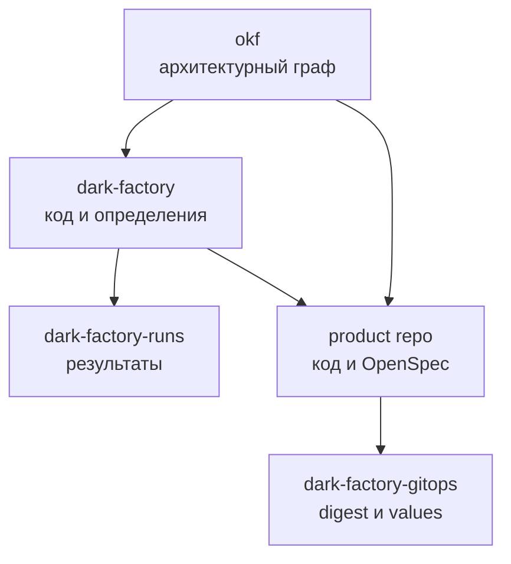

<!--
Источник: Notion — Git-структура проекта Dark Factory
URL: https://app.notion.com/p/3d9db33037c880619478cc20738719e2
Выгружено: 2026-09-12
-->

# Git-структура проекта Dark Factory

Версия 1.0 · 12 сентября 2026 · Статус: предлагаемая структура для MVP.

Связанные решения: [HLD MVP](hld-mvp.md) · [Deployment](deployment.md)

> **🎯 Решение:** использовать несколько репозиториев с чёткими источниками истины, но саму фабрику оставить модульным монолитом в одном основном репозитории. Для MVP не дробить Python Core, API, CLI, Console, agents, skills, flows и packs на отдельные репозитории или сервисы.

# 1. Принципы организации Git

1. **Один основной репозиторий и один релиз фабрики.** Core, CLI, API и Console изменяются атомарно и проходят общий pipeline.
2. **Код отделён от состояния.** Код и декларативные определения находятся в dark-factory; результаты запусков — в dark-factory-runs; состояние deployment — в dark-factory-gitops.
3. **Git является источником истины.** Требования, OpenSpec, rules, prompts, skills, flows, packs, approvals через MR и принятые версии хранятся в Git.
4. **OpenSpec размещается рядом с изменяемой системой.** Спецификации самой фабрики находятся в dark-factory/openspec; спецификации продукта — в его собственном репозитории. Отдельный глобальный репозиторий OpenSpec не создаётся.
5. **OKF — отдельный knowledge repo.** Он хранит общие архитектурные сущности и связи, но не дублирует код, OpenSpec или run logs.
6. **Trunk-Based Development.** Основная ветка main защищена; изменения выполняются в короткоживущих ветках и отдельных worktree; интеграция — только через MR.
7. **Декларативное расширение прежде программного.** Новый agent, skill, flow, rule или pack по возможности добавляется конфигурацией. Python adapter добавляется, когда нужен новый исполняемый контракт.
8. **Границы проверяются автоматически.** CI валидирует импорты модулей, схемы, ссылки каталога, совместимость pack, OpenSpec, security policy и CODEOWNERS.

# 2. Карта репозиториев

<table fit-page-width="true" header-row="true">
<tr>
<td>Репозиторий</td>
<td>Назначение и источник истины</td>
<td>Владелец</td>
<td>MVP</td>
</tr>
<tr>
<td>**dark-factory**</td>
<td>Python Core, CLI, API, Console, adapters, agents, skills, flows, rules, packs, OpenSpec, Helm chart, CI templates и тесты</td>
<td>Factory Platform Team</td>
<td>Обязательно</td>
</tr>
<tr>
<td>**dark-factory-gitops**</td>
<td>Желаемое состояние окружений: Argo CD Applications, Helm values и immutable OCI digests; без secrets</td>
<td>Infrastructure + CI/CD</td>
<td>Обязательно</td>
</tr>
<tr>
<td>**dark-factory-runs**</td>
<td>Долговременные небольшие run records: manifests, StageResult, usage, decisions и ссылки на evidence</td>
<td>Factory Platform Team</td>
<td>Обязательно; может быть создан после первого вертикального slice</td>
</tr>
<tr>
<td>**okf**</td>
<td>Общие архитектурные сущности, отношения, constraints и представления knowledge graph</td>
<td>Architecture</td>
<td>Обязательно как отдельный repo, наполнение итеративное</td>
</tr>
<tr>
<td>**product-template**</td>
<td>Шаблон создаваемых продуктов: React, FastAPI, PostgreSQL, OpenSpec, CI и Helm</td>
<td>Factory Platform Team</td>
<td>Рекомендуется; допустимо начать как template внутри dark-factory</td>
</tr>
<tr>
<td>**product repositories**</td>
<td>Код, спецификации, тесты и deployment package каждого продукта</td>
<td>Product Team</td>
<td>Один пилотный продукт</td>
</tr>
</table>



Репозитории образуют разные источники истины. GitOps не должен копировать application code; runs не должен хранить бинарные artifacts; OKF не должен превращаться во вторую документацию всех файлов проекта.

# 3. Основной репозиторий dark-factory

```plain text
dark-factory/
├── README.md
├── CONTRIBUTING.md
├── SECURITY.md
├── CODEOWNERS
├── pyproject.toml
├── uv.lock
├── package.json
├── pnpm-lock.yaml
├── Makefile
├── .gitlab-ci.yml
├── .editorconfig
├── .pre-commit-config.yaml
│
├── openspec/
│   ├── config.yaml
│   ├── specs/
│   └── changes/
│
├── src/
│   └── dark_factory/
│       ├── __init__.py
│       ├── bootstrap.py
│       ├── settings.py
│       ├── shared/
│       ├── changes/
│       ├── orchestration/
│       ├── agents/
│       ├── context/
│       ├── execution/
│       ├── quality/
│       ├── delivery/
│       ├── learning/
│       ├── ports/
│       ├── adapters/
│       ├── api/
│       └── cli/
│
├── catalog/
│   ├── agents/
│   ├── skills/
│   ├── flows/
│   ├── rules/
│   ├── packs/
│   ├── prompts/
│   └── schemas/
│
├── console/
│   ├── src/
│   ├── public/
│   ├── tests/
│   └── package.json
│
├── charts/
│   └── dark-factory/
│       ├── Chart.yaml
│       ├── values.yaml
│       ├── values-local.yaml
│       ├── values-dc.yaml
│       └── templates/
│
├── ci/
│   ├── templates/
│   ├── policies/
│   └── scripts/
│
├── tests/
│   ├── unit/
│   ├── integration/
│   ├── contract/
│   ├── architecture/
│   ├── e2e/
│   ├── evals/
│   └── fixtures/
│
├── docs/
│   ├── architecture/
│   ├── adr/
│   ├── development/
│   ├── runbooks/
│   └── generated/
│
├── examples/
│   ├── changes/
│   ├── flows/
│   └── packs/
│
└── scripts/
    ├── bootstrap/
    ├── validation/
    └── maintenance/
```

## 3.1 Корневые файлы

<table fit-page-width="true" header-row="true">
<tr>
<td>Файл</td>
<td>Назначение</td>
</tr>
<tr>
<td>README.md</td>
<td>Быстрый старт, локальный запуск, карта репозитория и ссылки на архитектуру</td>
</tr>
<tr>
<td>CONTRIBUTING.md</td>
<td>Trunk-Based workflow, worktree, правила MR, команды проверок и Definition of Done</td>
</tr>
<tr>
<td>SECURITY.md</td>
<td>Threat reporting, secrets policy и границы доверия agent jobs</td>
</tr>
<tr>
<td>CODEOWNERS</td>
<td>Обязательные reviewers для Core, security, infrastructure, agents, skills и packs</td>
</tr>
<tr>
<td>pyproject.toml + uv.lock</td>
<td>Единый Python package и воспроизводимые зависимости Core, CLI и API</td>
</tr>
<tr>
<td>package.json + pnpm-lock.yaml</td>
<td>Workspace и зависимости Console; Python и frontend остаются в одном release repo</td>
</tr>
<tr>
<td>Makefile</td>
<td>Стабильные команды для человека и агента: setup, lint, test, eval, build, dev</td>
</tr>
<tr>
<td>.gitlab-ci.yml</td>
<td>Точка входа, включающая версионируемые шаблоны из ci/templates</td>
</tr>
</table>

# 4. Границы Python-модулей

<table fit-page-width="true" header-row="true">
<tr>
<td>Модуль</td>
<td>Ответственность</td>
<td>Разрешённые зависимости</td>
</tr>
<tr>
<td>shared</td>
<td>Идентификаторы, базовые DTO, ошибки и value objects</td>
<td>Стандартная библиотека и Pydantic; не знает о других модулях</td>
</tr>
<tr>
<td>changes</td>
<td>Intake, change_id, жизненный цикл изменения, approval references</td>
<td>shared и ports</td>
</tr>
<tr>
<td>orchestration</td>
<td>Flow, Stage, TaskGraph, transitions, fan-out/fan-in, review/rework limits</td>
<td>shared, ports и публичные контракты модулей</td>
</tr>
<tr>
<td>agents</td>
<td>AgentProfile, TaskEnvelope, AgentResult, model/tool policy и budget accounting</td>
<td>shared, ports, catalog loader</td>
</tr>
<tr>
<td>context</td>
<td>ContextBundle, выбор файлов, OpenSpec/OKF references и provenance</td>
<td>shared и ports</td>
</tr>
<tr>
<td>execution</td>
<td>Workspace/worktree, команды, patch, sandbox и evidence collection</td>
<td>shared и ports</td>
</tr>
<tr>
<td>quality</td>
<td>Deterministic checks, GateResult, aggregation и eval policy</td>
<td>shared, ports и публичные результаты</td>
</tr>
<tr>
<td>delivery</td>
<td>MR, merge policy, OCI/GitOps release orchestration и smoke result</td>
<td>shared и ports; привилегированные действия только через trusted adapters/jobs</td>
</tr>
<tr>
<td>learning</td>
<td>Сбор signals, формирование improvement proposal и eval comparison</td>
<td>shared и ports; не изменяет main автоматически</td>
</tr>
<tr>
<td>ports</td>
<td>Интерфейсы Harness, SCM, Tracker, Knowledge, ArtifactStore, Telemetry, Sandbox и Deployment</td>
<td>shared; не содержит vendor SDK</td>
</tr>
<tr>
<td>adapters</td>
<td>PydanticAI, GitLab, Tracker, MCP, OKF, OpenTelemetry, registry и artifact backends</td>
<td>ports и внешние SDK</td>
</tr>
<tr>
<td>api / cli</td>
<td>Входные интерфейсы к тем же use cases и composition root</td>
<td>Публичные application services; без собственной бизнес-логики</td>
</tr>
</table>

Правило зависимости: domain/application modules обращаются к внешним системам только через ports. Adapters зависят от ports, но ports не зависят от adapters. bootstrap.py является composition root и единственным местом сборки конкретных реализаций.

# 5. Каталог расширений

Каталог хранит декларативные, версионируемые определения. Для каждого типа должна существовать JSON Schema или Pydantic-модель в catalog/schemas и команда factory validate catalog.

```plain text
catalog/
├── agents/
│   ├── product/
│   │   ├── agent.yaml
│   │   └── instructions.md
│   ├── design/
│   ├── architect/
│   ├── infrastructure/
│   ├── security/
│   ├── develop/
│   ├── quality/
│   ├── ci-cd/
│   └── operation/
├── skills/
│   └── <skill-id>/
│       ├── SKILL.md
│       ├── schema.json
│       ├── references/
│       └── tests/
├── flows/
│   └── aidlc-mvp/
│       ├── flow.yaml
│       ├── stages/
│       └── tests/
├── rules/
│   ├── global/
│   ├── security/
│   ├── architecture/
│   └── delivery/
├── packs/
│   └── react-fastapi-postgres/
│       ├── pack.yaml
│       ├── references/
│       └── tests/
├── prompts/
│   ├── fragments/
│   └── policies/
└── schemas/
```

## Девять ролевых профилей

Используются стабильные идентификаторы: Product, Design, Architect, Infrastructure, Security, Develop, Quality, CI/CD и Operation. Отображаемые имена миньонов являются metadata профиля и не используются в permissions, policy или маршрутизации.

Каждый agent.yaml должен фиксировать:
- id, display_name, version и назначение;
- разрешённые stages и типы задач;
- required capabilities и допустимые tools;
- default harness/model policy;
- входной и выходной Pydantic contract;
- context policy и budget limits;
- prohibited actions и escalation conditions;
- используемые skills, rules, prompt fragments и eval suite.

# 6. OpenSpec и связь со структурой

```plain text
openspec/
├── config.yaml
├── specs/
│   ├── orchestration/
│   ├── agents/
│   ├── context/
│   ├── execution/
│   ├── quality/
│   ├── delivery/
│   ├── learning/
│   └── console/
└── changes/
    └── <change-id>/
        ├── proposal.md
        ├── design.md
        ├── tasks.md
        └── specs/
```

Правила:
- specs описывает принятую текущую систему; changes — предлагаемые изменения;
- change-id совпадает в ветке, MR, pipeline variables, run record и tracker;
- OpenSpec не дублирует ADR: OpenSpec описывает ожидаемое изменение, ADR — устойчивое архитектурное решение и причины;
- после merge принятый delta переносится в актуальные specs по процессу OpenSpec;
- изменение публичного port, Flow contract, agent result или schema требует contract tests и migration note;
- продуктовый OpenSpec всегда остаётся в product repo, даже если изменение инициировано фабрикой.

# 7. Репозиторий dark-factory-gitops

```plain text
dark-factory-gitops/
├── README.md
├── CODEOWNERS
├── bootstrap/
│   ├── namespaces/
│   ├── policies/
│   ├── argocd/
│   └── gitlab-runner/
├── clusters/
│   ├── local/
│   │   ├── root-application.yaml
│   │   └── values/
│   └── dc/
│       ├── root-application.yaml
│       └── values/
├── apps/
│   ├── dark-factory/
│   └── pilot-product/
├── environments/
│   ├── dev/
│   ├── test/
│   ├── stage/
│   └── prod/
├── policies/
├── tests/
└── .gitlab-ci.yml
```

Для MVP реально заполняются local и dev. Папки test/stage/prod могут быть добавлены позднее; пустые фиктивные окружения создавать не требуется.

GitOps хранит только ссылки на версии и конфигурацию без секретов. Пример авторитетной версии приложения — OCI digest, а не latest tag. Agent job может подготовить GitOps MR, но не имеет права напрямую синхронизировать production.

# 8. Репозиторий dark-factory-runs

```plain text
dark-factory-runs/
├── README.md
├── schema/
│   ├── run-manifest.schema.json
│   └── stage-result.schema.json
├── runs/
│   └── 2026/
│       └── 09/
│           └── <change-id>/
│               └── <run-id>/
│                   ├── manifest.yaml
│                   ├── snapshot.json
│                   ├── stages/
│                   │   └── <stage-id>.json
│                   ├── usage.json
│                   ├── decisions.md
│                   └── evidence-index.json
├── retention/
└── .gitlab-ci.yml
```

В репозиторий не помещаются screenshots, большие logs, build output, модели, архивы и секреты. evidence-index содержит URI, checksum, media type, producer, created_at и retention class; сами крупные artifacts остаются в GitLab artifacts или S3/MinIO через ArtifactStorePort.

Каждая запись должна быть идемпотентно адресуемой по change_id + run_id + stage_id. Исправление принятого record выполняется новой записью/ревизией, а не скрытым переписыванием истории.

# 9. Репозиторий OKF

```plain text
okf/
├── README.md
├── okf.yaml
├── schemas/
├── entities/
│   ├── systems/
│   ├── components/
│   ├── capabilities/
│   ├── interfaces/
│   ├── data/
│   ├── teams/
│   └── constraints/
├── relations/
├── views/
├── mappings/
│   ├── gitlab/
│   ├── openspec/
│   └── deployment/
├── changes/
├── tests/
└── .gitlab-ci.yml
```

OKF хранит глобальные знания и стабильные отношения: система → компонент → интерфейс → данные → команда → ограничение. Поля source_ref и version_ref указывают на Git commit, OpenSpec spec или ADR. Генерируемые views отделяются от редактируемых вручную entities.

Не переносить в OKF целиком README, спецификации, prompts, исходный код или run evidence. Граф должен ссылаться на первичные артефакты, а не конкурировать с ними.

# 10. Шаблон продуктового репозитория

```plain text
<product>/
├── README.md
├── CODEOWNERS
├── openspec/
├── backend/
│   ├── src/
│   ├── migrations/
│   └── tests/
├── frontend/
│   ├── src/
│   └── tests/
├── contracts/
│   ├── openapi/
│   └── asyncapi/
├── deploy/
│   └── helm/
├── tests/
│   ├── integration/
│   └── e2e/
├── docs/
│   ├── adr/
│   └── runbooks/
├── factory.yaml
└── .gitlab-ci.yml
```

factory.yaml — минимальный манифест подключения продукта к фабрике. Он содержит engineering pack и его версию, пути к OpenSpec/кодовой базе/chart, команды build/test/lint, quality profile, deployment target и допустимые capabilities. Он не содержит prompts, tokens или credentials.

# 11. Размещение артефактов: однозначные правила

<table fit-page-width="true" header-row="true">
<tr>
<td>Артефакт</td>
<td>Где хранится</td>
</tr>
<tr>
<td>Код фабрики, agents, skills, flows, rules и packs</td>
<td>dark-factory</td>
</tr>
<tr>
<td>Спецификация изменения фабрики</td>
<td>dark-factory/openspec</td>
</tr>
<tr>
<td>Спецификация изменения продукта</td>
<td>product repo/openspec</td>
</tr>
<tr>
<td>Архитектурное решение</td>
<td>docs/adr соответствующего repo; связь индексируется в OKF</td>
</tr>
<tr>
<td>Run/Stage result и usage summary</td>
<td>dark-factory-runs</td>
</tr>
<tr>
<td>Большой evidence, screenshot, log bundle</td>
<td>ArtifactStore; в runs только ссылка и checksum</td>
</tr>
<tr>
<td>OCI image</td>
<td>Registry по immutable digest</td>
</tr>
<tr>
<td>Версия, развёрнутая в окружении</td>
<td>dark-factory-gitops</td>
</tr>
<tr>
<td>Общая архитектурная сущность или отношение</td>
<td>okf</td>
</tr>
<tr>
<td>Secret</td>
<td>Vault/secret store; никогда не Git</td>
</tr>
</table>

# 12. Branch, MR и worktree

Рекомендуемый поток:
1. Factory получает change_id из intake/tracker.
2. Создаёт короткоживущую ветку вида change/\<change-id\>-\<slug\> и отдельный worktree.
3. Сначала формирует или изменяет OpenSpec; specification MR может быть отдельным обязательным human gate.
4. После approval реализация выполняется в той же change lineage; допускается отдельный implementation MR.
5. CI проверяет итоговый SHA, а не только промежуточные commits.
6. Review findings становятся структурированными задачами rework; число циклов ограничено Flow policy.
7. Merge выполняет trusted finalizer после обязательных gates.
8. Build публикует immutable digest; release handler создаёт GitOps MR.
9. После Argo sync и smoke run record получает итоговый статус и evidence references.
10. Worktree и временная ветка удаляются только после сохранения необходимых результатов.

Никаких долгоживущих develop/release веток для MVP. Прямой push в main, force-push в защищённые ветки и auto-merge при незакрытых blockers запрещены.

# 13. CI pipelines по репозиториям

<table fit-page-width="true" header-row="true">
<tr>
<td>Repo</td>
<td>Минимальные stages</td>
</tr>
<tr>
<td>dark-factory</td>
<td>validate → lint → unit → contract → architecture → integration → eval → build → security → publish</td>
</tr>
<tr>
<td>product repo</td>
<td>spec validate → lint → test → contract → build → security → package → release proposal</td>
</tr>
<tr>
<td>dark-factory-gitops</td>
<td>schema → helm render → policy → diff → approval → sync/smoke evidence</td>
</tr>
<tr>
<td>dark-factory-runs</td>
<td>schema → references → secret scan → retention policy</td>
</tr>
<tr>
<td>okf</td>
<td>schema → identifiers → relations → source references → graph invariants</td>
</tr>
</table>

Не каждый LLM-вызов становится CI job. Один job исполняет одну стадию Flow; до двух независимых agent tasks могут выполняться внутри неё через TaskGraph.

# 14. CODEOWNERS и зоны контроля

Минимальные ownership rules:
- src/dark_factory/orchestration и catalog/flows — Architect + Factory Platform;
- src/dark_factory/execution, delivery, adapters/gitlab и ci — Infrastructure/CI-CD;
- catalog/rules/security, sandbox policies и SECURITY.md — Security;
- catalog/agents, skills, prompts и evals — профильный владелец + Quality;
- charts и GitOps — Infrastructure + CI/CD;
- public ports и schemas — Architect;
- learning proposals — Quality + владелец затронутого каталога;
- production values/policies — обязательный человек-approver.

Agent name не используется как GitLab identity. Запись выполняют технические identities с минимальными scope; merge/publish/deploy разделены между разными доверенными jobs.

# 15. Что не выделять в отдельные репозитории на MVP

Не выделять отдельно:
- каждый agent;
- каждый skill или prompt;
- Flow engine;
- PydanticAI adapter;
- API и CLI;
- Console;
- engineering packs;
- CI templates;
- eval datasets малого размера.

Выделение оправдано после появления независимого владельца, отдельного release cadence, требований доступа или повторного использования несколькими платформами. До этого оно увеличит число версий и cross-repo MR без полезной изоляции.

# 16. Порядок создания репозиториев

1. **dark-factory** — skeleton, contracts, один Flow, роли Product/Develop/Quality, GitLab adapter и вертикальный slice.
2. **пилотный product repo** — минимальный factory.yaml, OpenSpec, React/FastAPI/PostgreSQL, CI и Helm.
3. **dark-factory-gitops** — local/dev deployment через Argo CD и immutable digest.
4. **dark-factory-runs** — долговременная схема StageResult/RunSnapshot и evidence index.
5. **okf** — минимальные entities для Factory, пилотного продукта, interfaces и constraints.
6. Расширить оставшиеся роли, skills, packs и learning loop после прохождения первого сквозного сценария.
7. Вынести product-template в отдельный repo, когда первый продукт стабилен и структура подтверждена практикой.

# 17. Критерии готовности Git-структуры

- [ ] Каждый артефакт имеет один источник истины и однозначный repo/path.
- [ ] Основной repo устанавливается одной командой и выпускается как один versioned release.
- [ ] CLI и API используют один composition root и одинаковые contracts.
- [ ] Catalog schemas и cross-references проверяются в CI.
- [ ] OpenSpec изменения фабрики и продукта не смешиваются.
- [ ] Imports между Python-модулями проверяются architecture tests.
- [ ] CODEOWNERS покрывает security, orchestration, delivery, catalog и GitOps.
- [ ] Agent jobs не имеют merge, publish или production deploy credentials.
- [ ] Run records не содержат secrets и тяжёлые artifacts.
- [ ] GitOps хранит immutable digest и проходит render/policy validation.
- [ ] OKF links проверяются, но сбой необязательной индексации не блокирует локальный test loop.
- [ ] Первый вертикальный сценарий change → spec → code → MR → review/rework → merge → image → GitOps → dev smoke воспроизводим.

# Итог

Целевая модель — **четыре платформенных репозитория плюс независимые product repositories**. При этом исполняемая фабрика остаётся в dark-factory как единый модульный монолит и единый release. Такое разделение отделяет код, знания, историю запусков и deployment state, но не создаёт преждевременную сеть микрорепозиториев.
