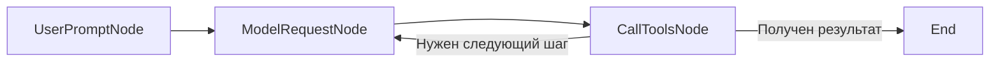
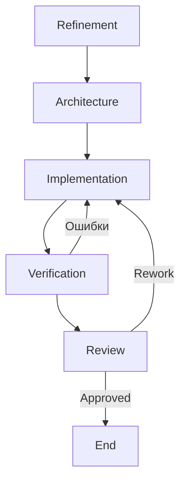
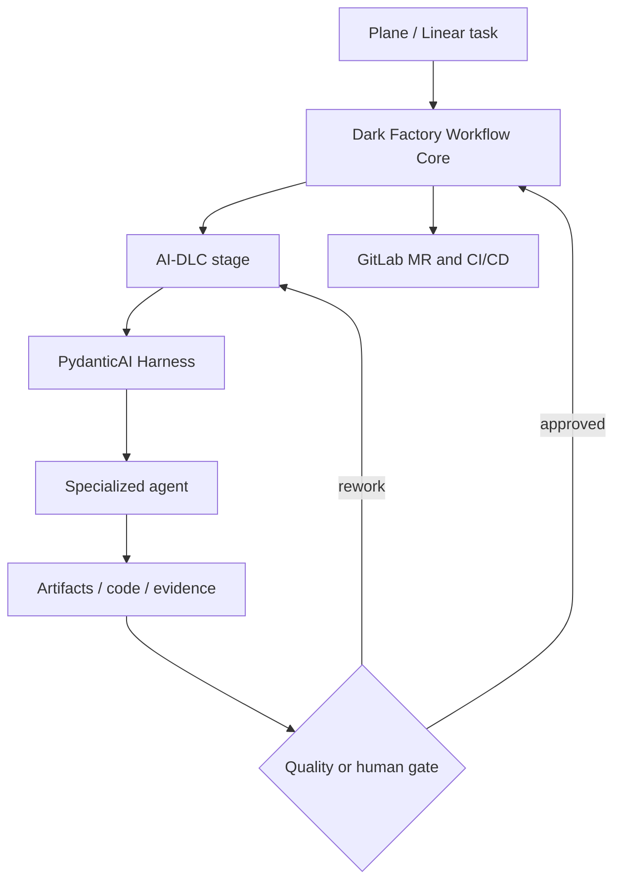
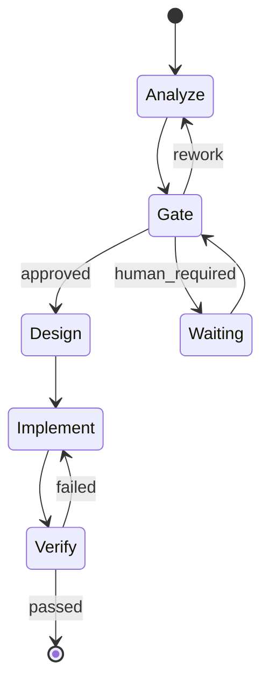

<!--
Источник: Notion — Графы и PydenticAI
URL: https://app.notion.com/p/3d9db33037c880e1a5ead3e9e6f6279e
Выгружено: 2026-09-12
-->

# Графы и PydenticAI

В PydanticAI нет отдельного термина **Graph Engineering** как методологии, но технически он реализован достаточно полно через библиотеку `pydantic-graph`.

Ключевая особенность: **граф описывается обычным Python-кодом с типизированными узлами, состоянием и переходами**, а не YAML/JSON DSL.

## Два уровня графов в PydanticAI

### 1. Внутренний граф одного агента

Каждый `Agent` внутри уже работает как конечный автомат на базе `pydantic-graph`:



Типовой цикл:
1. `UserPromptNode` формирует сообщения и инструкции.
2. `ModelRequestNode` вызывает LLM.
3. `CallToolsNode`:
    - выполняет tools;
    - обрабатывает структурированный output;
    - запускает retry при ошибке валидации;
    - либо возвращает окончательный результат.
4. Если агенту нужно продолжить рассуждение, управление возвращается в `ModelRequestNode`.
5. `End` завершает запуск.

Обычно этот граф скрыт за:

```python
result = await agent.run("Implement feature")
```

Но его можно выполнить пошагово:

```python
async with agent.iter("Implement feature") as run:
    async for node in run:
        print(node)
```

Или управлять вручную:

```python
async with agent.iter("Implement feature") as run:
    node = run.next_node

    while not isinstance(node, End):
        # Здесь можно проверить, изменить или перехватить node
        node = await run.next(node)
```

Это позволяет:
- наблюдать каждый model/tool turn;
- отменять выполнение;
- добавлять внешние policy checks;
- перехватывать вызов модели;
- ограничивать стоимость и количество шагов;
- стримить события в UI;
- интегрировать выполнение с внешним оркестратором.

Внутренний граф агента официально построен на `pydantic-graph`. [Документация Agent graph](https://pydantic.dev/docs/ai/core-concepts/agent/#iterating-over-an-agents-graph)

---

### 2. Прикладной workflow-граф

Для процесса Dark Factory можно создать собственный граф, где узлы — это уже не отдельные вызовы tool, а стадии SDLC:



Внутри каждого узла можно запускать один или несколько PydanticAI-агентов.

Таким образом:
- внешний граф управляет процессом разработки;
- внутренний граф каждого агента управляет LLM/tool loop.

## Основные строительные блоки

<table header-row="true">
<tr>
<td>Конструкция</td>
<td>Назначение</td>
</tr>
<tr>
<td>`GraphBuilder`</td>
<td>Сборка графа</td>
</tr>
<tr>
<td>`@g.step`</td>
<td>Функциональный узел</td>
</tr>
<tr>
<td>`BaseNode`</td>
<td>Классовый типизированный узел</td>
</tr>
<tr>
<td>`GraphRunContext` / `StepContext`</td>
<td>Доступ к state, dependencies и input</td>
</tr>
<tr>
<td>`Decision`</td>
<td>Условное ветвление</td>
</tr>
<tr>
<td>`map()`</td>
<td>Параллельная обработка элементов</td>
</tr>
<tr>
<td>`broadcast()`</td>
<td>Отправка входа в несколько ветвей</td>
</tr>
<tr>
<td>`Join`</td>
<td>Синхронизация параллельных ветвей</td>
</tr>
<tr>
<td>`Reducer`</td>
<td>Агрегация результатов</td>
</tr>
<tr>
<td>`End`</td>
<td>Завершение выполнения</td>
</tr>
<tr>
<td>`graph.iter()`</td>
<td>Пошаговое выполнение</td>
</tr>
<tr>
<td>`graph.render()`</td>
<td>Генерация Mermaid</td>
</tr>
</table>

Актуальный `GraphBuilder` поддерживает `Decision`, параллельные ветви, `map`, `broadcast`, `join` и reducers. [Graph Builder API](https://pydantic.dev/docs/ai/graph/builder/)

## Типизированные переходы

В оригинальном классовом API исходящие переходы определяются возвращаемым типом метода `run()`:

```python
@dataclass
class Review(BaseNode[FactoryState, FactoryDeps, ReleaseResult]):

    async def run(
        self,
        ctx: GraphRunContext[FactoryState, FactoryDeps],
    ) -> Rework | Verification | End[ReleaseResult]:

        result = await reviewer.run(...)

        if result.approved:
            return Verification()

        if ctx.state.rework_count >= 3:
            return End(ReleaseResult(status="manual_review"))

        return Rework(findings=result.findings)
```

Из сигнатуры видно, что после `Review` разрешены только:
- `Rework`;
- `Verification`;
- завершение через `End`.

Это важная часть Graph Engineering в PydanticAI: **топология workflow выражается системой типов Python**. Невалидный переход выявляется значительно раньше, чем при использовании строковых идентификаторов узлов.

В новом builder API связи можно задавать явно:

```python
g.add(
    g.edge_from(implementation).to(verification),
    g.edge_from(verification).to(decision),
)
```

## State, inputs и dependencies

PydanticAI различает три вида данных:

<table header-row="true">
<tr>
<td>Тип</td>
<td>Что содержит в Dark Factory</td>
</tr>
<tr>
<td>`inputs`</td>
<td>Результат предыдущего узла</td>
</tr>
<tr>
<td>`state`</td>
<td>Изменяемое состояние конкретного workflow run</td>
</tr>
<tr>
<td>`deps`</td>
<td>Внешние сервисы и адаптеры</td>
</tr>
</table>

Например:

```python
@dataclass
class FactoryState:
    change_id: str
    branch: str | None = None
    mr_id: int | None = None
    rework_count: int = 0
    completed_phases: set[str] = field(default_factory=set)


@dataclass
class FactoryDeps:
    gitlab: GitLabPort
    plane: TrackerPort
    knowledge: KnowledgePort
    runtime: ExecutionRuntime
```

Это хорошо соответствует вашей плагинной архитектуре:
- `state` — состояние ChangeWorkflow;
- `deps` — GitLab/Plane/Notion/OKF/MCP-адаптеры;
- node/step — фаза AI-DLC;
- агент — исполнитель внутри фазы;
- Pydantic-модель — контракт входа и результата.

## Условные переходы

`Decision` маршрутизирует данные по:
- типу;
- literal-значению;
- пользовательскому predicate.

Например:

```python
review_decision = g.decision()
review_decision.branch(
    g.match(IsApproved).to(verification),
    g.match(NeedsRework).to(rework),
    g.match(NeedsHuman).to(human_gate),
)
```

Берётся первая подходящая ветвь — семантика близка к `match` или `if/elif/else`. [Decision Nodes](https://pydantic.dev/docs/ai/graph/builder/decisions/)

## Параллельное выполнение

GraphBuilder поддерживает два основных варианта.

### Map

Одна и та же операция запускается параллельно для нескольких элементов:

```python
g.edge_from(changed_files).map().to(code_review)
```

Подходит для:
- проверки изменённых файлов;
- запуска специализированных reviewers;
- анализа нескольких сервисов;
- генерации тестов по сценариям.

### Broadcast

Один вход передаётся нескольким разным ветвям:

```python
g.edge_from(implementation_result).to(
    security_review,
    architecture_review,
    test_review,
)
```

Затем результаты объединяются:

```python
reviews = g.join(
    reduce_list_append,
    initial_factory=list[ReviewResult],
)
```

Важно: параллельные задачи разделяют общий mutable state, поэтому для Dark Factory лучше передавать результаты через типизированные outputs и reducers, минимизируя конкурентную запись в `state`. [Parallel Execution](https://pydantic.dev/docs/ai/graph/builder/parallel/)

## Что Pydantic Graph не делает

Сам `pydantic-graph` — это **не полноценная замена Temporal или GitLab CI**.

Он не предоставляет из коробки:
- distributed task queue;
- worker management;
- календарные таймеры;
- полноценную event sourcing модель;
- инфраструктурные retries между процессами;
- deployment control;
- управление MR и CI;
- бизнес-реестр workflow instances.

Особенно важно: новый параллельный `GraphBuilder` не имеет встроенного сохранения состояния и возобновления после рестарта. Для таких сценариев документация рекомендует durable execution backend. [Ограничения persistence](https://pydantic.dev/docs/ai/graph/builder/#persistence-and-resumability)

PydanticAI отдельно интегрируется с Temporal, DBOS, Prefect, Restate и другими execution engines для durable agents. [Durable Execution](https://pydantic.dev/docs/ai/capabilities/durable_execution/overview/)

## Как это применить в вашей Dark Factory

Я бы разделил графы на три уровня:

<table header-row="true">
<tr>
<td>Уровень</td>
<td>Реализация</td>
<td>Пример</td>
</tr>
<tr>
<td>SDLC orchestration</td>
<td>Ваш workflow engine / GitLab CI</td>
<td>Refinement → Implementation → MR → Review → Merge</td>
</tr>
<tr>
<td>Фаза процесса</td>
<td>`pydantic-graph`</td>
<td>параллельные review, rework loop, выбор исполнителя</td>
</tr>
<tr>
<td>Agent loop</td>
<td>Встроенный граф `Agent`</td>
<td>LLM → tool → LLM → output</td>
</tr>
</table>

То есть не стоит превращать весь Dark Factory в один гигантский `pydantic-graph`.

Оптимальная граница:

```plain text
ChangeWorkflow
 ├── RefinementGraph
 ├── ImplementationGraph
 ├── ReviewReworkGraph
 └── VerificationGraph
```

Каждый подграф должен:
- иметь типизированный input/output;
- не знать напрямую о Plane или GitLab SDK;
- получать интеграции через `deps`;
- возвращать решение, а не самостоятельно изменять глобальное состояние процесса;
- иметь ограниченные циклы;
- оставлять долгоживущую оркестрацию GitLab CI, а позже — Temporal.

## Итог

В PydanticAI Graph Engineering реализован сильнее, чем может показаться:
- каждый агент уже является графом/FSM;
- имеется отдельный типобезопасный `pydantic-graph`;
- поддерживаются состояние, DI, ветвления и циклы;
- новый GraphBuilder поддерживает параллельные ветви, `map`, `broadcast`, joins и reducers;
- выполнение можно контролировать пошагово;
- граф визуализируется в Mermaid;
- агенты естественно встраиваются внутрь узлов.

Но PydanticAI — это прежде всего **code-first библиотека для исполнения типизированных агентных графов**, а не готовая платформа управления SDLC. Для вашего MVP я бы использовал `pydantic-graph` как локальный движок фаз и agent orchestration, а GitLab CI — как durable верхнеуровневый workflow. Это даст вам Graph Engineering без необходимости сразу писать собственный полноценный workflow engine.

---

Короткий ответ: **AI-DLC-флоу не следует полностью зашивать внутрь PydanticAI Harness**. Для Dark Factory лучше разделить:
- **AI-DLC** — методология и описание процесса;
- **собственный лёгкий Workflow Core** — состояние, переходы, gates, retries;
- **PydanticAI Harness** — исполнение конкретного этапа агентом;
- **GitLab CI** — запуск, проверка кода, MR и deployment;
- **Temporal не нужен для MVP**.

При этом отдельный инфраструктурный workflow engine пока не требуется: лёгкий движок можно реализовать в том же Python-приложении на `pydantic-graph`.

## Целевая схема



## Разделение ответственности

<table header-row="true">
<tr>
<td>Компонент</td>
<td>За что отвечает</td>
</tr>
<tr>
<td>AI-DLC definition</td>
<td>Фазы, стадии, обязательные артефакты, роли, условия пропуска, verification gates</td>
</tr>
<tr>
<td>Workflow Core</td>
<td>Текущее состояние процесса, выбор следующей стадии, DAG зависимостей, retries, pause/resume, approval, rework</td>
</tr>
<tr>
<td>PydanticAI</td>
<td>Agent loop, модели, typed input/output, tools, MCP, dependency injection</td>
</tr>
<tr>
<td>PydanticAI Harness</td>
<td>Файлы, shell, репозиторий, планирование, subagents, context management, ограничения, memory</td>
</tr>
<tr>
<td>`pydantic-graph`</td>
<td>Внутренняя реализация state machine/DAG AI-DLC-флоу</td>
</tr>
<tr>
<td>OpenSpec</td>
<td>Спецификации продукта и changes; источник требований и критериев приёмки</td>
</tr>
<tr>
<td>GitLab</td>
<td>Ветки/worktrees, MR, CI jobs, тесты, security checks, merge, deployment</td>
</tr>
<tr>
<td>Plane/Linear</td>
<td>Пользовательская задача, статус, исполнители, ссылки на run/MR</td>
</tr>
<tr>
<td>PostgreSQL</td>
<td>Состояние workflow run, события, approvals, attempts, artifact references</td>
</tr>
<tr>
<td>OKF</td>
<td>Связи между требованиями, решениями, кодом, тестами и знаниями</td>
</tr>
</table>

PydanticAI официально позиционирует harness как окружение вокруг модели: инструменты, рабочее пространство, память, subagents и управление контекстом. Его `Dynamic Workflow` позволяет агенту динамически вызывать subagents, но это **локальная агентская оркестрация**, а не полный SDLC workflow engine. [PydanticAI Harness](https://pydantic.dev/docs/ai/harness/)

## Как будет исполняться одна стадия AI-DLC

Например, стадия `2.3 Requirements Analysis`:
1. Workflow Core читает определение стадии.
2. Проверяет входные условия и наличие исходных артефактов.
3. Выбирает агента `product-analyst`.
4. Создаёт typed `StageInput`.
5. PydanticAI Harness предоставляет агенту:
    - OpenSpec;
    - код и структуру репозитория;
    - знания из Notion/OKF;
    - MCP Plane/GitLab;
    - skills;
    - файловые и shell-инструменты.
6. Агент возвращает структурированный `StageResult`.
7. Детерминированный validator проверяет артефакты и traceability.
8. Reviewer-agent делает содержательное ревью.
9. Workflow Core принимает решение:
    - `completed`;
    - `rework`;
    - `waiting_for_human`;
    - `failed`;
    - `skipped`.

Пример контракта:

```python
class StageResult(BaseModel):
    status: Literal["completed", "rework", "blocked"]
    artifacts: list[ArtifactRef]
    evidence: list[Evidence]
    decisions: list[Decision]
    open_questions: list[Question]
    next_stage_hint: str | None = None
```

Именно структурированные контракты — одна из главных причин использовать PydanticAI.

## Что реализовать через `pydantic-graph`

`pydantic-graph` подходит для вашего лёгкого Workflow Core: это отдельная typed state-machine библиотека, разработанная рядом с PydanticAI, но не зависящая от него. Она поддерживает узлы, решения, состояние, ветвления и параллельное исполнение. [Pydantic Graph](https://pydantic.dev/docs/ai/graph/graph/)



Однако важно разделять два уровня графа:
- **статический AI-DLC-граф** — известные фазы, стадии, gates и зависимости;
- **динамический agent graph** — созданные агентом подзадачи, параллельные исследования, review swarm.

Первый принадлежит Workflow Core. Второй может исполняться PydanticAI Harness внутри отдельной стадии.

## Почему не стоит отдавать весь флоу harness

Если главный orchestrator-agent сам решает, какую AI-DLC-стадию запускать дальше, появляются проблемы:
- процесс становится недетерминированным;
- сложнее гарантировать обязательные gates;
- LLM может пропустить стадию или повторить side effect;
- сложно возобновлять процесс после рестарта;
- труднее менять PydanticAI на Pi или DeepSeek Harness;
- бизнес-состояние оказывается смешано с conversation history;
- аудит процесса зависит от внутренних сообщений модели.

Поэтому переходы уровня:

```plain text
requirements → architecture → units → implementation → review → merge
```

должны определяться кодом и конфигурацией Workflow Core, а не решением LLM.

А вот внутри `architecture` агент может сам организовать:

```plain text
codebase scan + NFR analysis + integration research
                 ↓
          architect synthesis
```

Это правильное место для `SubAgents` и `Dynamic Workflow`.

## Нужен ли отдельный движок

Есть три значения слова «отдельный»:

<table header-row="true">
<tr>
<td>Вариант</td>
<td>Решение для MVP</td>
</tr>
<tr>
<td>Отдельный логический модуль</td>
<td>**Да, обязательно**</td>
</tr>
<tr>
<td>Отдельный Python-сервис</td>
<td>Необязательно, можно modular monolith</td>
</tr>
<tr>
<td>Temporal/Prefect/Restate</td>
<td>Пока нет</td>
</tr>
</table>

Рекомендуемая структура:

```plain text
dark-factory/
├── workflow-core/       # state machine, transitions, gates
├── methodology-aidlc/   # определения фаз и стадий AI-DLC
├── harness-pydantic/    # PydanticAI adapter
├── agents/              # роли агентов
├── skills/
├── integrations/
│   ├── gitlab/
│   ├── plane/
│   ├── notion/
│   └── okf/
├── artifacts/
├── policies/
└── api/
```

Workflow Core должен обращаться к harness через собственный порт:

```python
class HarnessPort(Protocol):
    async def execute(
        self,
        assignment: AgentAssignment,
        context: ExecutionContext,
    ) -> AgentExecutionResult: ...
```

Тогда позднее появятся адаптеры:

```plain text
HarnessPort
├── PydanticAIHarnessAdapter
├── PiHarnessAdapter
├── DeepSeekHarnessAdapter
└── ExternalCodingAgentAdapter
```

Это позволит менять исполнитель без переписывания AI-DLC-флоу.

## Где остаётся GitLab CI

GitLab CI не стоит превращать в детальный AI-DLC engine из 33 jobs. Его роль:
- запустить или продолжить Dark Factory run;
- создать worktree/branch;
- выполнить детерминированные build/test/lint/security jobs;
- сохранить artifacts;
- создать MR;
- применить merge policy;
- выполнить deployment.

AI-DLC-фазы и human gates живут в Workflow Core. GitLab получает крупные команды:

```plain text
factory run
factory resume
factory verify
factory create-mr
factory rework
```

## Когда потребуется Temporal

PydanticAI поддерживает интеграции durable execution с Temporal, DBOS, Prefect и Restate, но это именно подключаемые execution backends, а не основание помещать весь процесс в agent loop. [Durable Execution](https://pydantic.dev/docs/ai/capabilities/durable_execution/overview/)

Temporal стоит добавить позднее, если появятся:
- сотни одновременных workflow runs;
- процессы на дни и недели;
- ожидание нескольких внешних approval;
- гарантированное выполнение side effects;
- сложные таймеры и SLA;
- recovery после падения worker;
- distributed execution между несколькими средами.

Для MVP достаточно:

```plain text
pydantic-graph
+ PostgreSQL state/event log
+ GitLab CI
+ idempotent stage executors
+ retry policy
```

## Итоговая рекомендация

**Не делать PydanticAI владельцем AI-DLC-флоу.** Сделать собственный небольшой `workflow-core`, реализованный на Python и `pydantic-graph`. PydanticAI Harness использовать как основной исполнитель стадий.

Формула архитектуры:

> **AI-DLC определяет, что делать → Workflow Core решает, когда и в каком порядке → PydanticAI Harness выполняет агентскую работу → GitLab проверяет и доставляет результат.**

Это даст минимальный MVP сейчас и сохранит возможность позже заменить PydanticAI Harness на Pi/DeepSeek либо добавить Temporal без переписывания методологии и OpenSpec-процесса.
