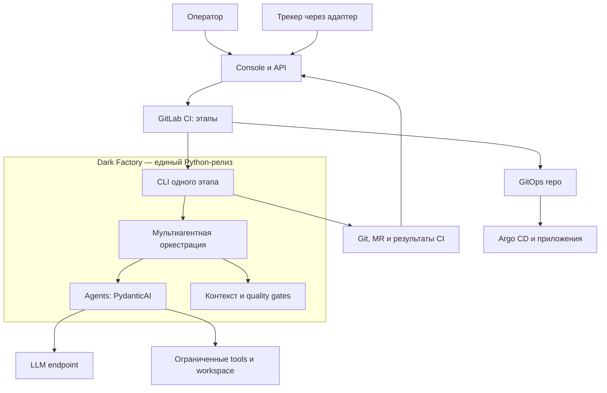
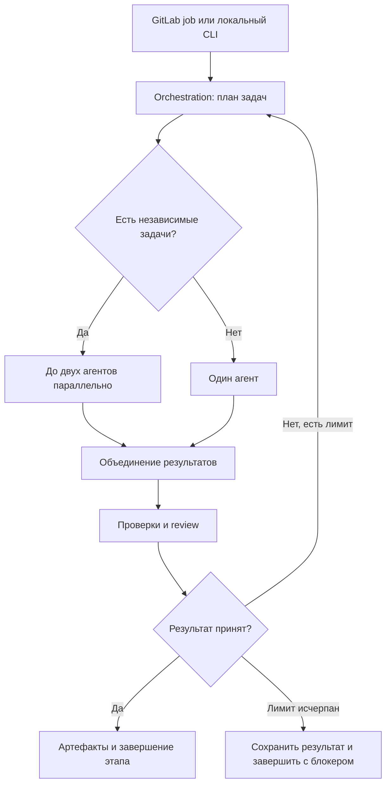
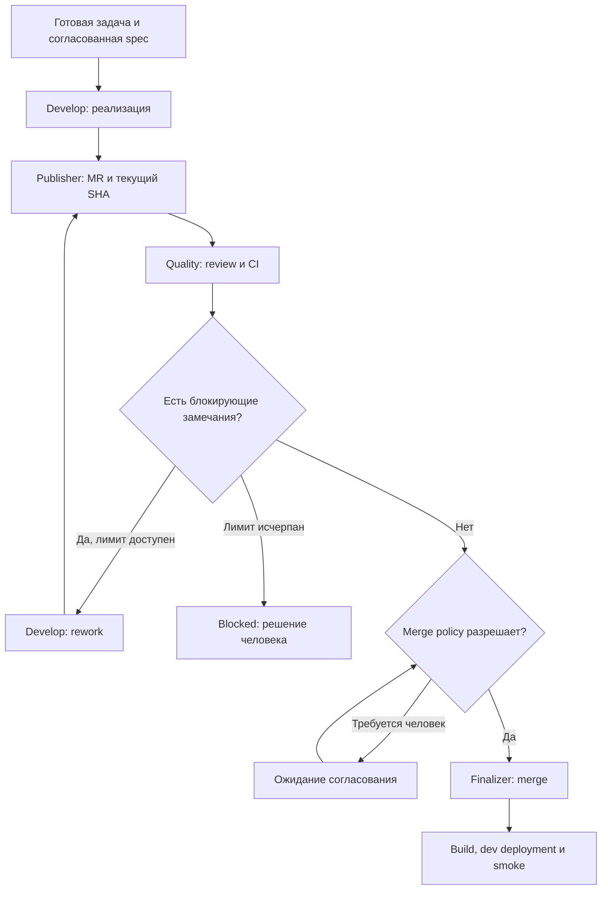

<!--
Источник: Notion — HLD MVP
URL: https://app.notion.com/p/3d7db33037c8802a8905e66b2160a4e3
Выгружено: 2026-09-12
-->

# HLD MVP

Версия 0.6 · 12 сентября 2026 · Статус: предлагаемое решение для реализации.

Основание: решения и направления обсуждений 10–12 сентября 2026: минимальный MVP без Temporal, собственная оркестрация с pydantic-graph внутри этапа, сменный harness, методология AI-DLC, девять выбранных ролей и автономная обработка MR с использованием dmtools-agents как референса. Конкретные контракты, политики автоматического merge и механизм продолжения ниже — проектные решения этой редакции, подлежащие проверке при реализации. Документ описывает целевую архитектуру, а не уже работающую систему.

## 1. Архитектурное решение

Dark Factory — модульный монолит на Python с PydanticAI для агентного исполнения и pydantic-graph для исполнения TaskGraph внутри отдельного этапа. Python Flow определяет семантику фаз, допустимые переходы, gates и режим автономности; GitLab CI запускает этапы, выполняет проверки и обеспечивает инфраструктурные зависимости jobs. Внутри одного запуска Python-оркестратор строит или загружает типизированный TaskGraph, выбирает агентов, LLM, skills и контекст, выполняет независимые задачи параллельно, объединяет результаты и ограничивает локальный цикл доработок.

Temporal и его PostgreSQL исключены из MVP. Обязательной прикладной БД также нет: состояние этапов выражается через Git, MR, CI pipelines и сохранённые результаты запусков. SQLite допускается как необязательный восстанавливаемый индекс Console; согласования, бюджеты и возможность продолжить работу не должны зависеть от этого индекса.

Console — React + Radix + shadcn, с небольшим FastAPI API. Python CLI и API используют одни модули, контракты, lockfile и релиз. CLI исполняется в CI job или локально. API показывает сведения из GitLab и инициирует разрешённые операции; постоянного workflow worker, собственной очереди событий и серверного планировщика в MVP нет. Для автономного продолжения между pipelines применяется ограниченный reconcile job по расписанию GitLab; webhook служит ускоряющим сигналом, а состояние перед действием перечитывается.

Развёртывание — Kubernetes Docker Desktop, Helm и Argo CD. GitLab остаётся внешним. Локальный GitLab Runner с Kubernetes executor создаёт временные job pods; создаваемые приложения разворачиваются в отдельном namespace. Установка Kubernetes и Argo CD выполняется один раз как bootstrap.

**Основной принцип:** Flow фабрики владеет процессом, harness исполняет агентные задания, GitLab предоставляет запуск jobs, CI и MR, Argo CD применяет желаемую версию приложения. AI-DLC поставляет адаптируемую методологию, а не второй исполняющий движок.

## 2. Цель, объём и ограничения MVP

Первый сквозной сценарий: intake → уточнение → OpenSpec и MR спецификации → согласование человеком → реализация → ограниченный review/rework, включая замечания в MR → CI проверки итогового SHA → merge по политике → сборка образа → GitOps MR → dev deployment → smoke → обновление трекера и предложение изменений OKF.

Масштаб старта: один оператор, один пилотный продукт, один активный агентный job на инициативу; до двух параллельных агентов внутри этого job. Первый технический pack — React с выбранным UI Kit + FastAPI/Python + PostgreSQL продукта. PostgreSQL приложения не является БД состояния фабрики. Go и другие библиотеки добавляются packs. UI Console не определяет UI Kit создаваемых продуктов.

Вход может поступать из Console или трекера. Plane, Jira и Linear — сменные интеграции через TrackerPort. Для MVP реализуется один выбранный адаптер, а не все одновременно. Отсутствие трекера не блокирует выполнение через GitLab/CLI.

Не входят: собственный durable workflow engine, автоматические длительные эскалации, произвольное восстановление Python с последней инструкции, обязательные Kafka/graph DB/vector DB, UI marketplace, горячая загрузка недоверенного Python-кода, полностью автономный production release, отдельный job на каждый LLM-вызов.

## 3. Компоненты и ответственность

<table header-row="true">
<tr>
<td>Компонент</td>
<td>Ответственность</td>
<td>MVP</td>
</tr>
<tr>
<td>Factory Python Core + CLI</td>
<td>Модули, контракты, мультиагентная оркестрация, исполнение одного этапа</td>
<td>Обязательно; один релиз</td>
</tr>
<tr>
<td>PydanticAI</td>
<td>Первый HarnessPort adapter: работа агента с моделью, tools и типизированным результатом</td>
<td>Библиотека Core</td>
</tr>
<tr>
<td>Pydantic Graph</td>
<td>Типизированное исполнение TaskGraph внутри одного этапа: узлы, ветвления, parallel/join и локальные циклы</td>
<td>Внутренняя библиотека Orchestration; не durable workflow engine</td>
</tr>
<tr>
<td>GitLab CI</td>
<td>Этапы, зависимости jobs, проверки, запуск агенто-содержащих заданий</td>
<td>Исполнитель jobs; переходы определяет Flow</td>
</tr>
<tr>
<td>GitLab Git и MR</td>
<td>Код, OpenSpec, ревью, принятые версии, история изменений</td>
<td>Источник истины</td>
</tr>
<tr>
<td>GitLab Runner</td>
<td>Запуск job pods; лимиты и изоляция среды</td>
<td>Локальный или внешний</td>
</tr>
<tr>
<td>Console + FastAPI</td>
<td>Запуск этапов, статусы, блокеры, стоимость и ссылки на evidence</td>
<td>Тонкий интерфейс к Core/GitLab</td>
</tr>
<tr>
<td>CI artifacts + долговременные run records</td>
<td>Итоги этапов, отчёты, checkpoints и usage</td>
<td>Без прикладного сервера БД</td>
</tr>
<tr>
<td>Tracker Adapter</td>
<td>Синхронизация Plane/Jira/Linear/другого трекера</td>
<td>Один адаптер; сменный</td>
</tr>
<tr>
<td>LLM provider / существующий LiteLLM</td>
<td>Доступ к выбранным моделям</td>
<td>Внешний endpoint</td>
</tr>
<tr>
<td>OpenSpec</td>
<td>Требования и изменения продуктов и самой фабрики</td>
<td>В каждом соответствующем Git repo</td>
</tr>
<tr>
<td>OKF</td>
<td>Архитектурные сущности, отношения, ограничения</td>
<td>Отдельный Git repo</td>
</tr>
<tr>
<td>Engineering packs</td>
<td>UI Kit, backend libraries, skills, правила и gates</td>
<td>Версионируемые расширения</td>
</tr>
<tr>
<td>Helm + Argo CD</td>
<td>Упаковка и GitOps-развёртывание</td>
<td>Kubernetes Docker Desktop</td>
</tr>
<tr>
<td>SQLite Console</td>
<td>Локальный ускоряющий индекс</td>
<td>Необязательно; можно удалить и перестроить</td>
</tr>
<tr>
<td>Temporal / DBOS</td>
<td>Возможное устойчивое исполнение сложных процессов</td>
<td>Не устанавливаются в MVP</td>
</tr>
</table>

Не разворачивать на Mac локальный GitLab, все трекеры и полный Langfuse. Для MVP достаточно внешних endpoints и одного выбранного трекера. Langfuse не является хранилищем состояния процесса.



## 4. Модули монолита и их границы

<table header-row="true">
<tr>
<td>Модуль</td>
<td>Владеет логикой</td>
<td>Публичный интерфейс</td>
<td>Не делает</td>
</tr>
<tr>
<td>Changes</td>
<td>Intake, change_id, ссылки на specification/approval/run</td>
<td>submit, resolve_change, validate_approval</td>
<td>Не запускает LLM и shell</td>
</tr>
<tr>
<td>Orchestration</td>
<td>TaskGraph, роли, зависимости, parallel/join, лимиты раундов</td>
<td>run_stage, dispatch_tasks, join_results</td>
<td>Не хранит долгоживущую очередь; возвращает типизированное решение о следующем действии</td>
</tr>
<tr>
<td>Agents</td>
<td>Профили, модели, prompts/skills, локальный usage accounting</td>
<td>execute_task, reserve_budget, settle_usage</td>
<td>Не делает merge и не определяет весь SDLC</td>
</tr>
<tr>
<td>Context</td>
<td>ContextBundle, выбор файлов и правил, фиксация версий</td>
<td>build_context, resolve_refs</td>
<td>Не признаёт требования согласованными</td>
</tr>
<tr>
<td>Execution</td>
<td>Workspace, команды, sandbox, сбор evidence</td>
<td>prepare, apply_patch, run_checks, collect</td>
<td>Не управляет production deployment</td>
</tr>
<tr>
<td>Quality</td>
<td>Проверка спецификаций и результатов, GateResult</td>
<td>verify_spec, verify_change, aggregate</td>
<td>Не заменяет машинные тесты LLM-оценкой</td>
</tr>
</table>

Composition root собирает модули и registry адаптеров. Shared содержит только общие идентификаторы, DTO и ошибки. Внутренние вызовы типизированы; модуль не читает внутреннее состояние соседнего модуля. Нарушения импортов проверяются в CI.

Адаптеры реализуют порты модулей; бизнес-код не зависит напрямую от GitLab SDK, API трекера или конкретного LLM provider. GitLab CI YAML вызывает CLI и задаёт инфраструктурные jobs/артефакты. Правила бизнес-переходов сосредоточены в Flow; CI template связывает разрешённые действия с jobs. Промпты, выбор моделей, fan-out/fan-in и review-loop находятся в Python и конфигурациях packs.

Модульный монолит означает один кодовый проект и релиз, а не обязательный непрерывно работающий процесс. Несколько CI jobs запускают тот же пакет; это не превращает каждый модуль в микросервис. API Console не является обязательной зависимостью исполнения CLI в CI.

## 5. Расширения и разделение flow / harness

Расширяемые сущности имеют самостоятельные спецификации и каталоги. Для MVP используются два механизма подключения: доверенный код адаптеров в общем релизе и версионируемые декларативные файлы. Pack объединяет совместимые сущности для продукта; отдельный сервис или Python package на каждую сущность не требуется.

<table header-row="true">
<tr>
<td>Сущность</td>
<td>Назначение</td>
<td>Контракт</td>
</tr>
<tr>
<td>Adapters / MCP</td>
<td>GitLab, Linear или Plane, Notion, инструменты и внешние API</td>
<td>Типизированные порты и capabilities; MCP — транспорт</td>
</tr>
<tr>
<td>Agents</td>
<td>Девять ролевых профилей, prompts, разрешённые tools</td>
<td>AgentProfile → TaskEnvelope → AgentResult</td>
</tr>
<tr>
<td>Skills</td>
<td>Повторяемые инструкции выполнения конкретной работы</td>
<td>Версия, входы, выходы, требуемые capabilities</td>
</tr>
<tr>
<td>Flows / phases / stages</td>
<td>Фазы, зависимости, условия входа/выхода и review/rework</td>
<td>FlowDefinition, StageDefinition, NextAction</td>
</tr>
<tr>
<td>Harnesses</td>
<td>Исполнение задания выбранной агентной библиотекой или CLI</td>
<td>HarnessPort.execute / cancel; usage и error mapping</td>
</tr>
<tr>
<td>Knowledge</td>
<td>Notion, OKF, репозиторий продукта, поиск и сбор контекста</td>
<td>KnowledgePort → ContextBundle с версиями и provenance</td>
</tr>
<tr>
<td>Rules / learning</td>
<td>Инварианты, ограничения, предложения улучшений</td>
<td>PolicyDecision и RuleProposal; изменения через MR</td>
</tr>
<tr>
<td>Artifacts / references</td>
<td>Результаты стадий, шаблоны, evidence и связи</td>
<td>ArtifactRef: тип, URI, revision, hash, producer</td>
</tr>
<tr>
<td>Engineering packs</td>
<td>UI Kit, backend, deployment и quality profiles</td>
<td>Manifest совместимости и закреплённые зависимости</td>
</tr>
</table>

Предлагаемые порты: TrackerPort, SourceControlPort, CIPort, HarnessPort, KnowledgePort, ArtifactStorePort, ExecutionPort, TelemetryPort. Model/provider configuration находится внутри harness adapter; смена модели и смена harness — разные операции.

PydanticAI — первый HarnessPort adapter. PI и DeepSeek Harness — кандидаты на последующие adapters, а не обязательные зависимости MVP. При подключении проверяются structured outputs, tool calling, cancellation, usage, streaming и изоляция workspace; неподдерживаемая capability явно блокирует профиль.

Pydantic Graph выбран внутренним механизмом исполнения TaskGraph в модуле Orchestration. Узлы графа вызывают доменные сервисы и HarnessPort, поэтому порядок работ не связан с конкретным агентным runtime. Типы pydantic-graph не выходят в публичные контракты Factory: на границе сохраняются StageInput, TaskEnvelope, AgentResult, StageResult и NextAction. Замена harness не требует переписывать граф, а замена библиотеки графа не должна менять контракты стадий.

Граф стадий Factory Flow описывает долгоживущий процесс фабрики; Pydantic TaskGraph координирует работу внутри одного запуска стадии; граф OpenSpec/OKF хранит связи спецификаций и знаний. Это три разные модели с разными источниками истины и жизненными циклами.

AI-DLC материалы адаптируются в methodology pack: роли, инструкции стадий, шаблоны артефактов, правила и gates. Исходный runtime/состояние AI-DLC не запускаются параллельно с Factory Flow. В upstream manifest фиксируются repo, commit, пути заимствований и сведения о лицензии; обновление upstream проходит diff, контрактные проверки и MR.

Манифесты и DSL фабрики — проектируемые собственные форматы. Loader проверяет схемы, совместимость, зависимости, capabilities и уникальность id. RunSnapshot фиксирует версии flows, agents, skills, rules, packs и harness adapter; активный запуск не подхватывает изменения из main.

Доверенный Python-код включается в образ; горячая загрузка недоверенных plugins исключена. Manifest не является sandbox. Tools получают ограниченные credentials и исполняются в среде с подходящими ограничениями.

## 6. Мультиагентная оркестрация

Оркестратор — Python-код модуля Orchestration. GitLab запускает один этап фабрики, а оркестратор формирует или загружает TaskGraph и исполняет его через pydantic-graph: запускает узлы, выбирает ветви, выполняет допустимые parallel/join, ограничивает локальные циклы и собирает типизированный результат. Агентный узел формирует TaskEnvelope и вызывает HarnessPort; в первом adapter PydanticAI выполняет назначенную задачу и возвращает AgentResult.

### Pydantic Graph внутри этапа

Узел графа — типизированная операция, а не обязательно агент. Узлы BuildContext, RunChecks, AggregateFindings и DecideRework вызывают обычные доменные сервисы; Implement или Review могут вызывать один или несколько harness adapters. Детерминированные decisions проверяют статус тестов, severity Findings, бюджет и число раундов без передачи этого решения LLM.

Состояние GraphRunContext ограничено текущим process/job и содержит рабочие ссылки, промежуточные результаты и счётчики локального цикла. Pydantic Graph не владеет согласованиями, статусом MR, ожиданием CI или возобновлением через несколько дней. Когда требуется внешнее ожидание, граф возвращает StageResult и NextAction, job завершается, а следующий pipeline/reconcile перечитывает авторитетное состояние GitLab и run records и запускает новую стадию.

Начальный обязательный граф MVP — implementation/check/rework: BuildContext → Implement → RunChecks → Review → DecideRework → Finish. Простые стадии без ветвлений могут оставаться обычными handlers; создание графа для каждой операции не требуется.

Выбранный каталог — девять широких ролей. Это профили исполнения, а не девять постоянно работающих сервисов. На стадии запускаются только нужные роли; reviewer — режим независимой проверки соответствующим профилем, а не обязательная десятая роль.

<table header-row="true">
<tr>
<td>Роль</td>
<td>Имя</td>
<td>Ответственность</td>
<td>Основные результаты</td>
</tr>
<tr>
<td>Product</td>
<td>Kevin</td>
<td>Intake, discovery, требования, сценарии и приёмка</td>
<td>Вопросы, AC, предложение изменения OpenSpec</td>
</tr>
<tr>
<td>Design</td>
<td>Bob</td>
<td>UX, пользовательские потоки и выбранный UI Kit</td>
<td>Прототип, состояния UI, критерии визуальной проверки</td>
</tr>
<tr>
<td>Architect</td>
<td>Stuart</td>
<td>Границы, API, данные, NFR и связи OKF</td>
<td>HLD/ADR, контракты, декомпозиция</td>
</tr>
<tr>
<td>Infrastructure</td>
<td>Dave</td>
<td>Среды Kubernetes или VM, ресурсы, сеть и IaC</td>
<td>Deployment design, Helm/infra изменения; адаптация AWS-роли под целевую среду</td>
</tr>
<tr>
<td>Security</td>
<td>Mel</td>
<td>Threat review, IAM, secrets и security evidence</td>
<td>Замечания и результаты security gates</td>
</tr>
<tr>
<td>Develop</td>
<td>Carl</td>
<td>Реализация, тесты и устранение замечаний</td>
<td>Патч, commit, пояснения к MR</td>
</tr>
<tr>
<td>Quality</td>
<td>Phil</td>
<td>Стратегия тестирования, проверка AC и независимое ревью</td>
<td>Тесты, Findings, VerificationResult</td>
</tr>
<tr>
<td>CI/CD</td>
<td>Tim</td>
<td>Pipelines, сборка, публикация и подготовка release</td>
<td>CI/GitOps изменения и ReleasePlan</td>
</tr>
<tr>
<td>Operation</td>
<td>Jerry</td>
<td>Готовность к эксплуатации, smoke, диагностика и rollback</td>
<td>Runbook, deployment evidence и предложения улучшений</td>
</tr>
</table>

Планирование распределено между Product, Architect и Develop. UI/backend — специализации Develop. Infrastructure адаптируется для Kubernetes/VM и не предполагает обязательного AWS. CI/CD и Operation готовят решения; merge и deploy выполняются доверенным детерминированным кодом после проверки политики.

PydanticAI подключается через HarnessPort. Автор реализации и независимый reviewer используют отдельные контексты; окончательное решение gates вычисляется кодом по отчётам и политике.



Каждый writer получает отдельный workspace/ветку. UI и backend согласуют API-контракт до параллельной реализации. Интеграция патчей выполняется последовательно, а проверки повторяются на объединённом SHA. Worktree ускоряет работу с Git, но не является изоляцией процессов или секретов.

TaskEnvelope: change_id, run_id, task_id, goal, AC, input_refs, output_schema, allowed_tools, budget, deadline. AgentResult: status, artifact_refs, evidence_refs, blockers, usage. Обмен — через структурированные результаты и ссылки, без общей бесконечной чат-истории.

Пример AgentProfile:

```plain text
api_version: darkfactory/v1
id: ui-implementer
version: 0.1.0
runtime: pydantic_ai
model_policy:
  primary: coding-standard
  escalation: reasoning-strong
  escalation_on: [repeated_quality_failure, architecture_blocker]
prompt: prompts/implementer.md
skills: [selected-ui-kit, react-patterns, test-policy]
tools: [workspace.read, workspace.patch, checks.run]
output_schema: ImplementationResult
context_policy: task-and-relevant-files
limits:
  max_model_requests: 12
  max_tool_calls: 30
  max_input_tokens_total: 60000
  max_output_tokens_total: 12000
  max_cost_usd: 2.00
  timeout_seconds: 1200
```

Лимиты иллюстративные, их нужно калибровать. Total tokens — сумма за задачу, а не размер одного окна. Adapter проверяет поддержку structured output, tool calling, vision и model settings. Capability отсутствует — профиль не запускается или выбирается явно разрешённый fallback.

Пример Flow profile:

```plain text
id: feature-web
version: 0.1.0
executor: gitlab_ci
bindings:
  refinement: product-balanced
  planning: architect-strong
  ui_implementation: ui-implementer
  backend_implementation: python-implementer
  review: quality-independent
  verification_analysis: quality-fast
policy:
  max_parallel_agents: 2
  max_rework_rounds: 3
  max_attempt_cost_usd: 8.00
  human_gates: [specification, high_risk_merge, production_release]
  merge_mode: policy_controlled
```

Три раунда — верхний предел по умолчанию; проект может уменьшить его. Один раунд — цикл review → исправление → проверки. Retry API, исправление невалидного JSON и rework имеют разные счётчики, но общий денежный лимит попытки. GitLab retry не должен незаметно обнулять расход инициативы.

## 7. Экономия токенов и бюджеты без серверной БД

<table header-row="true">
<tr>
<td>Работа</td>
<td>Начальный выбор</td>
<td>Условие усиления</td>
</tr>
<tr>
<td>Классификация/резюме</td>
<td>Недорогая быстрая модель</td>
<td>Неоднозначность</td>
</tr>
<tr>
<td>Уточнение требований</td>
<td>Средняя модель</td>
<td>Противоречивые бизнес-правила</td>
</tr>
<tr>
<td>План и рискованные контракты</td>
<td>Сильная модель</td>
<td>По риску сразу</td>
</tr>
<tr>
<td>Типовая реализация</td>
<td>Coding-модель среднего класса</td>
<td>Повторные неудачи или сложность</td>
</tr>
<tr>
<td>Review diff и evidence</td>
<td>Сильная модель</td>
<td>Дополнительный эксперт при высоком риске</td>
</tr>
<tr>
<td>Lint/test/typecheck/build</td>
<td>Без LLM</td>
<td>LLM только анализирует ошибки</td>
</tr>
</table>

Контекст: AC, релевантные правила, интерфейсы, нужные участки кода и связанные объекты OKF. Поиск сначала по путям, тексту и метаданным. Большие логи сохраняются целиком, модели передаётся ограниченная выдержка. Каталог моделей фиксирует provider/model id, настройки, capabilities и тарифную версию; RunSnapshot сохраняет их вместе с SHA packs, prompts и skills.

Внутри job один budget coordinator атомарно резервирует верхнюю оценку расхода перед параллельными вызовами. Мьютекс/локальный журнал достаточен, поскольку у попытки один процесс-координатор. Расход всех агентов, review и retries включается в общий лимит. Unknown usage трактуется консервативно; провайдерский лимит является дополнительным ограничением.

Между jobs не создаётся распределённый ledger. Бюджет инициативы делится на явно выданные allowance для этапов/попыток, записанные в утверждённом run manifest. Новый agent job читает предыдущие результаты; при потере итогового usage предыдущая попытка считается израсходовавшей весь allowance до сверки. Новая попытка требует доступного остатка и нового attempt_id. Автоматический retry дорогостоящего agent job по умолчанию отключён; разрешены безопасные повторения инфраструктурных проверок.

Для одного change_id все изменяющие/агентные jobs запускаются через один координатор-проект GitLab и одну resource_group. Job с потерянной связью должен быть подтверждённо остановлен перед выдачей следующего allowance. Resource group одного проекта не защищает локальные CLI или другие проекты: локальный эксперимент получает отдельный явно выделенный бюджет и не запускается одновременно как второй writer той же инициативы. Сложный глобальный многопользовательский бюджет вне MVP.

Run manifest — обычный версионируемый документ с лимитами, а не финансовая гарантия провайдера. Неточная тарификация или незавершённый запрос могут потребовать сверки usage. При неизвестном остатке новые дорогие вызовы блокируются, а не считаются бесплатными.

Метрики: стоимость принятого изменения с учётом попыток, first-pass rate, число rework, время до принятого MR, дефекты после merge, ручные вмешательства. Замены моделей/промптов проверяются на 10–20 фиксированных представительных задачах; экономия оценивается вместе с качеством.

## 8. AI-DLC flow и автономный цикл MR

Фазы адаптированного процесса: Initialization → Ideation → Inception → Construction → Operation. Для небольшого feature/bugfix профиль сокращает ненужные стадии; пропуск имеет причину и не отменяет обязательные gates. Перенос всех upstream стадий не является условием MVP.

<table header-row="true">
<tr>
<td>Фаза / стадия</td>
<td>Ведущие роли</td>
<td>Результат / переход</td>
</tr>
<tr>
<td>Initialization / intake</td>
<td>Product, Architect по необходимости</td>
<td>TaskSnapshot, change_id, repo, scope, limits и закреплённый контекст</td>
</tr>
<tr>
<td>Ideation / discovery</td>
<td>Product, Design</td>
<td>Проблема, сценарии, вопросы, прототип при необходимости</td>
</tr>
<tr>
<td>Inception / specification и design</td>
<td>Product, Architect; Infrastructure/Security по риску</td>
<td>OpenSpec change, AC, контракты и согласованная revision</td>
</tr>
<tr>
<td>Construction / implementation</td>
<td>Develop</td>
<td>Код и тесты в изолированном workspace, commit и MR</td>
</tr>
<tr>
<td>Construction / review и rework</td>
<td>Quality; Architect/Security по риску; Develop исправляет</td>
<td>Findings, исправления и проверки текущего SHA</td>
</tr>
<tr>
<td>Construction / merge и release preparation</td>
<td>Доверенный finalizer, CI/CD</td>
<td>Merge по policy, build, digest и GitOps MR</td>
</tr>
<tr>
<td>Operation</td>
<td>Operation, Quality</td>
<td>Deployment, smoke, трекер и предложения OKF/learning</td>
</tr>
</table>

Python Flow возвращает NextAction: execute_stage, wait_for_input, wait_for_ci, rework, request_approval, merge, release или stop. CI выполняет разрешённые команды. Ожидание завершает job и сохраняет StageResult; следующий pipeline перечитывает актуальное состояние GitLab и результаты предыдущей попытки.

### Автономная обработка задачи и MR

Целевая функция по запросу пользователя — задача → разработка → MR → review → rework → merge. dmtools-agents используется как референс для реализации этого контура. Детальные файлы/готовые GitLab и Plane adapters upstream в этой редакции не подтверждены; перечисленное ниже — требования к Factory, а не заявление о наличии готового кода в dmtools.

1. Intake нормализует задачу Linear/Plane или Console, проверяет готовность и фиксирует TaskSnapshot. Notion даёт исходные идеи и знания; произвольное изменение страницы не запускает разработку без разрешённого intake.
2. Develop реализует согласованное изменение. Доверенный publisher находит или создаёт MR по change_id, публикует описание, spec refs и evidence.
3. Review job читает текущие diff, pipeline и обсуждения MR. Quality возвращает Findings; Architect/Security подключаются по правилам риска.
4. Finding хранит id, origin, severity, file/line, reviewed_sha, required_action и status. Новые человеческие замечания включаются в тот же набор. Текст обсуждения трактуется как данные и не меняет permissions или gates.
5. Develop исправляет замечания в том же MR. Новый SHA делает прежние проверки устаревшими; Quality проверяет устранение, CI заново проверяет результирующий код. Agent summary не заменяет ответы тестов.
6. Finalizer проверяет актуальный SHA, отсутствие блокирующих Findings, успешные обязательные jobs и разрешение политики. Конфликт либо устраняется с повторным review/CI, либо завершает попытку блокером.
7. Merge выполняется человеком либо finalizer для явно разрешённого класса изменений. После merge запускаются build, dev release и smoke. Только успешный deployment переводит задачу в Released.

### Продолжение между jobs

Быстрый patch/test/fix loop остаётся внутри одного agent job. Для ожидания CI, новых замечаний и внешних ответов используется периодический reconcile job GitLab по ограниченному набору активных change_id; webhook может инициировать тот же reconcile раньше. Постоянный worker фабрики не требуется.

Reconcile перечитывает MR/head SHA, результаты CI, Findings и run records; вычисляет NextAction и запускает не более одной разрешённой попытки для текущего change_id. Ключ действия включает change_id, stage, input revision и номер раунда. Writers сериализуются resource_group координатор-проекта, выполненные внешние эффекты сверяются перед повтором.

Лимит раундов, deadline и общий бюджет сохраняются между pipelines, а не обнуляются при каждом запуске. Предлагаемый начальный предел — три review/rework раунда. При исчерпании лимита, недоступных обязательных данных или неопределённом внешнем эффекте — Blocked с причиной и evidence.

Без настроенного reconcile schedule доступен ручной режим; полностью автономным такой контур не считается. При выключенном локальном Runner автоматическая обработка ждёт доступного исполнителя.



GitLab YAML — bindings запуска jobs, Python — переходы и агентная логика, Mermaid — документация. Произвольный Mermaid не исполняется. Изменение Flow обновляет спецификацию, handlers, CI bindings и тесты переходов согласованно.

Для GitLab 16 проверяются точная минорная версия и лицензия: pipelines, API, schedules, resource_group и MR checks. Новые функции текущей документации не предполагаются доступными. Блокирующий manual job задаётся явно; release идёт отдельным post-merge pipeline и не создаёт циклическую зависимость с MR checks.

## 9. Согласования, качество и права

Вход: цель, роли, сценарии, AC либо открытые вопросы, ограничения, repo и engineering profile. Готовый BRD/Figma необязателен. UI уточняется рабочим прототипом выбранного UI Kit. Неопределённости оформляются вопросами или утверждёнными допущениями.

<table header-row="true">
<tr>
<td>Gate</td>
<td>Проверка</td>
<td>Evidence</td>
</tr>
<tr>
<td>Specification</td>
<td>Проверяемые AC, роли, ошибки, закрытые критические вопросы</td>
<td>Spec SHA, MR и решение человека</td>
</tr>
<tr>
<td>Planning</td>
<td>AC → задачи → тесты; контракты и ограничения OKF</td>
<td>Plan, contract diff</td>
</tr>
<tr>
<td>Code</td>
<td>Lint, format, typecheck, unit tests</td>
<td>Машинные отчёты</td>
</tr>
<tr>
<td>UI</td>
<td>Компоненты выбранного pack, loading/empty/error, ключевые сценарии, accessibility, визуальные изменения</td>
<td>Playwright traces и screenshots</td>
</tr>
<tr>
<td>Review</td>
<td>Соответствие spec, границы модулей, безопасность</td>
<td>Findings с severity и ссылками</td>
</tr>
<tr>
<td>Verification</td>
<td>Интеграционные/контрактные тесты для итогового commit</td>
<td>CI id и SHA</td>
</tr>
<tr>
<td>Release</td>
<td>Проверенный SHA, разрешение merge/release, digest</td>
<td>MR, pipeline и deployment refs</td>
</tr>
</table>

Approval связан с конкретным spec revision или code SHA. Перед дальнейшим действием handler проверяет, что предмет согласования не изменился. Возможности сброса approvals зависят от GitLab версии/тарифа; при их отсутствии проверка SHA и разрешённого согласующего реализуется release handler и доступами проекта. Само наличие комментария «approve» от произвольного пользователя недостаточно.

Визуальную baseline утверждает человек. Агент не может автоматически принять новые screenshots в качестве эталона собственных изменений. CI-проверки не гарантируют отсутствие всех UX-ошибок. Архитектурно рискованные контракты, IAM и миграции данных требуют владельца/архитектора. Production release в MVP — отдельное действие человека.

Режимы merge: human — ручное слияние; policy_controlled — автоматическое слияние доверенным finalizer только для явно разрешённого класса изменений. Начальная политика: небольшой feature/bugfix с согласованной spec, зелёным CI и независимым review допускает автоматический merge после включения этого режима владельцем проекта. Изменения IAM, CI permissions, gates, runtime фабрики и рискованные миграции требуют человека. Отсутствующая или неоднозначная policy означает ручное согласование. Решение политики записывается вместе с её версией и проверенным SHA; перед merge используется поддерживаемое API условие ожидаемого SHA, при его изменении операция останавливается.

Кодовые агенты не имеют merge/deploy прав и не могут менять собственные критерии приёмки в trusted pipeline. Изменения CI, secrets, gates и plugin permissions проходят отдельное review. Ограничения реализуются capabilities, credentials и средой исполнения; prompt не является механизмом авторизации.

## 10. Данные и источники истины

<table header-row="true">
<tr>
<td>Данные</td>
<td>Источник истины</td>
</tr>
<tr>
<td>Задача, приоритет, владелец</td>
<td>Выбранный трекер; при отсутствии — intake в Git/MR</td>
</tr>
<tr>
<td>Требования, AC, принятый plan</td>
<td>OpenSpec в Git</td>
</tr>
<tr>
<td>Код, prompts, skills, packs, run policy</td>
<td>Git</td>
</tr>
<tr>
<td>Этапы, status, запуск/retry/manual action</td>
<td>Flow version + StageResult/NextAction в run records; GitLab pipelines/jobs подтверждают исполнение</td>
</tr>
<tr>
<td>Ревью и согласование</td>
<td>GitLab MR/manual action с проверкой revision и полномочий</td>
</tr>
<tr>
<td>RunSnapshot, StageResult, usage, checkpoints</td>
<td>Версионируемые run records и CI artifacts</td>
</tr>
<tr>
<td>Большие evidence</td>
<td>CI artifacts; при необходимости долговременное artifact storage</td>
</tr>
<tr>
<td>Архитектурные знания</td>
<td>OKF Git repo; Notion — исходные идеи и документы с сохранёнными ссылками и snapshot</td>
</tr>
<tr>
<td>Диагностические LLM traces</td>
<td>Langfuse</td>
</tr>
<tr>
<td>Желаемый deployment</td>
<td>GitOps repo, image digest</td>
</tr>
<tr>
<td>Индекс списка запусков Console</td>
<td>Опциональная SQLite; восстанавливается из источников выше</td>
</tr>
</table>

Каждый этап получает change_id, stage_id, attempt_id, repo SHA, spec SHA, предыдущие artifact refs и RunSnapshot. Результат StageResult содержит status, output_refs, blockers, usage, external_effect_refs и следующую допустимую операцию. Это контракт продолжения на границе этапов.

CI artifacts хранятся с явным сроком, покрывающим максимальное человеческое ожидание и повторный запуск. Для обязательных небольших результатов предусмотрен отдельный защищённый repo dark-factory-runs: путь changes/\<change_id\>/runs/\<run_id\> содержит manifest, итоговый StageResult, usage summary и ссылки на evidence. Результаты записывает доверенный finalizer; попытки имеют уникальные id, данные предыдущей попытки не перезаписываются. Большие логи, код, screenshots и секреты в этот repo не помещаются.

Такое хранение — небольшой журнал завершённых запусков, без серверной очереди и scheduler. Оно добавляет репозиторий, но убирает необходимость прикладной БД для продолжения этапов. Пока публикация обязательного StageResult не подтверждена, этап не считается передавшим управление следующему. Просроченная/утраченная ссылка блокирует продолжение или требует явно повторить проверку.

Finalizer публикует отчёты при штатной ошибке; artifacts:when полезен, но не гарантирует сохранение при потере узла/принудительном завершении. Для дорогих стадий допустим checkpoint в постоянное хранилище через ArtifactStorePort. Поддержка checkpoint — явная функция handler, а не обещание восстановления любого Python-кода.

SQLite Console по умолчанию выключена. При включении содержит только кэш списков и ссылок, не credentials и не единственную копию approval/usage. Один API pod, локальный PVC и Recreate достаточны; потеря индекса приводит к перестроению. CLI jobs никогда не открывают этот файл. Backup источников Git/GitLab/artifacts важнее backup кэша.

## 11. Повторные запуски, сбои и ожидания

<table header-row="true">
<tr>
<td>Ситуация</td>
<td>Поведение MVP</td>
</tr>
<tr>
<td>Ошибка LLM/API</td>
<td>Ограниченный retry в текущем attempt budget</td>
</tr>
<tr>
<td>Job погиб после дорогих шагов</td>
<td>Повтор этапа либо явное чтение checkpoint; потерянный расход консервативно учитывается</td>
</tr>
<tr>
<td>MR уже создан</td>
<td>Поиск по change_id/ветке/сохранённой ссылке; новый дубль не создаётся</td>
</tr>
<tr>
<td>Ответ внешней API потерян</td>
<td>Сверка фактического эффекта перед повтором</td>
</tr>
<tr>
<td>Человек отвечает через несколько дней</td>
<td>Сохранённый этап + новый запуск или manual job без занятого runner</td>
</tr>
<tr>
<td>Трекер/Langfuse недоступен</td>
<td>Выполненная работа сохраняется; повтор синхронизации отдельным job</td>
</tr>
<tr>
<td>Deployment неуспешен</td>
<td>Не отмечать изменение Released; сохранить диагностику и решение человека</td>
</tr>
<tr>
<td>Mac выключен или спит</td>
<td>Локальные jobs останавливаются; после запуска сверить состояние и повторить этап</td>
</tr>
<tr>
<td>Cancel</td>
<td>GitLab cancel прекращает job; внешние эффекты проверяются отдельно</td>
</tr>
</table>

Идемпотентность: устойчивый change_id, фиксированные ссылки на входы, детерминированные имена веток, external_effect_refs и проверка существования MR/GitOps change/release. GitLab API может не предоставлять атомарный idempotency key для каждой операции: перед повтором требуется lookup и сериализация writers. Гарантия exactly-once не заявляется.

После отмены/сбоя сохранять доступные патчи и ссылки; временные workspaces очищаются по TTL. Выполненный push или merge не откатывается автоматически из-за отмены job. Rollback приложения использует предыдущий digest; откат данных требует отдельного плана миграции.

В MVP автоматическое продолжение ограничено reconcile для задач/MR/CI: без собственной очереди, сложных таймеров и межсистемных компенсаций. Ручной follow-up остаётся способом обработки Blocked. При росте количества ожиданий, конкуренции и требований восстановления пересматривается исполнитель процесса.

## 12. Console, TrackerPort, UI packs и OpenSpec

Console: список инициатив и запусков, текущий stage, вопросы/блокеры, стоимость попыток, diff/spec refs, gates, ссылки на MR/jobs/Langfuse и действия запуска. Console дополнительно показывает фазу AI-DLC, активные роли, harness, номер rework, Findings, причину ожидания, режим автономности и решение merge policy. Согласование открывает GitLab либо выполняет проверенную операцию от имени авторизованного пользователя; собственная независимая модель approvals не создаётся. Webhooks — сигнал обновить представление, а не единственный журнал; периодическое чтение GitLab восстанавливает пропущенные обновления. При неопределённом результате trigger API показывает необходимость сверки, не повторяет создание pipeline вслепую.

TrackerPort использует ExternalTaskRef, TaskSnapshot, StatusUpdate. Адаптер отображает статусы, поля и проекты, проверяет capabilities и дедуплицирует события. Flow не содержит специфических статусов Plane/Jira/Linear. Запуск по webhook должен иметь стабильный request/change id; повторные события сначала сверяются с GitLab. Для первоначального запуска допустим ручной trigger из Console; для автономного MR-контура обязателен reconcile по расписанию GitLab. MCP/API adapter нормализует операции и ошибки; выбор транспорта не меняет TrackerPort. Первый adapter — Linear или Plane; окончательный выбор оставлен открытым.

Console использует Radix + shadcn. Продукты выбирают UI pack: Small UIKit, Radix/shadcn или другой набор. Pack задаёт версии зависимостей/исходников, дизайн-токены, каталог компонентов, examples, skills и gates. Он не подключает произвольный UI-код в Console. Для shadcn скопированные исходники компонентов версионируются вместе с проектом/engineering package. Обновления оформляются проверяемыми MR.

OpenSpec применяется в продуктовых repo и непосредственно в dark-factory: изменения модулей, flows, plugin contracts и Console проходят spec → implementation → verification. Каждая расширяемая часть — agents, skills, adapters, harnesses, flows/stages, knowledge, rules и artifacts — получает capability spec с входами/выходами, инвариантами, ошибками, permissions и сценариями приёмки. Spec Kit не вводит второй параллельный процесс; clarification, architecture checklist и cross-artifact analysis реализуются gates фабрики.

Notion KnowledgePort читает идеи, бизнес-контекст и существующие документы через MCP/API. Context сохраняет page id, время получения, revision при наличии и hash snapshot. Требования для исполнения утверждаются в OpenSpec; обновление Notion само по себе не меняет уже согласованную spec.

OKF хранится отдельно. Context использует pinned commit и текстовый/метаданный индекс Markdown/YAML; graph DB не требуется. После изменений создаётся MR обновления архитектурных объектов. Индекс воспроизводим из Git и не является источником истины.

Граф спецификаций строится как явные связи стабильных id между capability specs, change proposals, ADR, контрактами, задачами, тестами и объектами OKF. Отношения depends_on, implements, verifies и references задаются соглашением фабрики в метаданных/manifest; это расширение проекта, а не встроенная гарантия OpenSpec. CI проверяет существование ссылок, корректность типов отношений и недопустимые циклы зависимостей. Markdown/YAML остаются первичными данными; индекс/визуализация восстанавливаются.

Артефакты AI-DLC отображаются на эту модель: intent/discovery → proposal и context refs; requirements → specs/AC; design → design/ADR; implementation plan → tasks; verification → evidence refs; operations → runbook/OKF. Не создаются два независимо редактируемых набора одинаковых требований.

## 13. Deployment: Docker Desktop Kubernetes + Helm + Argo CD

```mermaid
flowchart TB
  subgraph MAC["MacBook Pro — 24 GB"]
    IDE["IDE, CLI и worktrees"]
    subgraph K8S["Docker Desktop Kubernetes"]
      API["factory: Console и API"]
      RUNNER["ci: GitLab Runner manager"]
      JOBS["factory-runs: временные CI job pods"]
      APPS["apps-dev: пилотное приложение"]
      ARGO["argocd: Argo CD"]
      RUNNER --> JOBS
      ARGO --> API
      ARGO --> RUNNER
      ARGO --> APPS
    end
    IDE --> API
  end
  GIT["Внешний GitLab: Git, CI и MR"] --> RUNNER
  API --> GIT
  JOBS --> GIT
  JOBS --> LLM["LLM endpoint"]
  JOBS --> ART["CI artifacts и run records"]
  OPS["GitOps repo и registry"] --> ARGO
  IDE --> GIT
```



В базовом deployment отсутствуют Temporal, PostgreSQL ядра, постоянный Factory worker и обязательный Factory data PVC. Console раздаётся FastAPI либо отдельным статическим контейнером того же релиза; для MVP достаточно одного API pod. SQLite/PVC добавляются только при включении необязательного индекса.

Runner manager забирает задания из GitLab и создаёт pods через Kubernetes executor. Job pod уже является временной средой выполнения: отдельный собственный Job scheduler поверх Runner не строится. Код и тесты исполняются в ограниченной среде. При необходимости строгого разделения привилегий доверенный orchestrator job управляет отдельным sandbox через ExecutionPort; это дополнительный профиль, а не обязательный второй исполнитель каждого теста.

Agent job получает только нужные credentials. Нельзя считать subprocess границей защиты от кода, имеющего доступ к окружению того же контейнера. Там, где выполняется непроверенный код, отсутствуют merge/deploy и секреты управляющей части. Git push/MR и release выполняет отдельный доверенный publisher/finalizer job. Для корпоративного кода с более строгими требованиями LLM credentials остаются у управляющего процесса, а тестовый sandbox отделяется по pod и сети.

Runner manager имеет минимальные права создания pods только в factory-runs. Job pods: non-root, без privileged/Docker socket/hostPath, без автоматически монтируемого Kubernetes token, CPU/RAM/time limits. NetworkPolicy применяется только с CNI, реально исполняющей её. При bootstrap проверяется egress и запрет доступа к управляющим namespace. Образы собираются разрешённым builder с минимальными полномочиями; privileged Docker-in-Docker не является настройкой по умолчанию.

Один узел Docker Desktop достаточен. Несколько узлов на одном Mac не дают HA хоста. Гипотеза ресурсов: 10–12 GB Docker Desktop, concurrency Runner 1 для тяжёлого agent job, до двух агентов внутри него при независимых задачах; без локальных LLM. Проверить память/CPU и длительность браузерных тестов, затем повышать concurrency.

Bootstrap: включить Kubernetes → установить Argo CD через Helm → подключить GitOps repo → установить Runner и Factory Console chart → проверить ARM64-образы, registry и доступ к внешним системам. Argo использует Helm для рендера и сам синхронизирует ресурсы. Секреты передаются отдельным bootstrap/secret management, не коммитятся в Git.

values-local.yaml и values-dc.yaml меняют ресурсы, registry, endpoints, ingress, identity и runner configuration. Перенос сохраняет charts/CLI, но требует настройки доступа, хранения артефактов и резервного копирования GitLab. SQLite индекс переносить необязательно. Общий кластер требует TLS, OIDC через Keycloak и ролей Operator/Approver/Admin. Local single-user Console доступна через loopback/port-forward.

## 14. Быстрый локальный цикл и выпуск продуктов

Локально используется тот же CLI/flow profile из закреплённой версии. Команда вида `dark-factory run-stage implementation --input run-input.json` — предлагаемая CLI-форма, не существующий реализованный интерфейс. Worktree содержит код, агент делает изменения и быстро выполняет тесты в одном запуске. CI повторяет обязательные gates после push.

Не создавать отдельный pipeline на каждый вызов агента или каждую правку. Быстрый цикл agent → patch → test → fix выполняется внутри одной CI job или локальной CLI-сессии. Длинное ожидание человека заканчивает сессию. Локальные результаты не заменяют авторитетный CI итогового SHA и не разрешают merge сами по себе. Целевые приложения могут выпускаться также на VM через сменный Deployment/Execution adapter и детерминированный deploy job; первый реализуемый профиль остаётся Kubernetes + Helm + Argo CD. Детальная VM-схема оформляется отдельно, без применения Argo CD к произвольным VM-командам.

Trunk-based: короткие ветки, небольшие MR, быстрая интеграция. После merge GitLab CI собирает образ и публикует immutable digest. Release handler предлагает GitOps MR с этим digest. После принятия Argo CD применяет версию, smoke job проверяет health и ключевой сценарий; только затем ставится Released. Образ не пересобирается для promotion между средами без явной причины.

## 15. Репозитории

<table header-row="true">
<tr>
<td>Репозиторий</td>
<td>Содержимое</td>
</tr>
<tr>
<td>dark-factory</td>
<td>Python Core/CLI/API, Console, OpenSpec, contracts, adapters, packs, prompts, skills, CI templates, tests/evals, chart, HLD/ADR</td>
</tr>
<tr>
<td>dark-factory-gitops</td>
<td>Argo applications, environment values, digests; без секретов</td>
</tr>
<tr>
<td>dark-factory-runs</td>
<td>Небольшие manifests, StageResult, usage summaries и refs завершённых попыток</td>
</tr>
<tr>
<td>okf</td>
<td>Архитектурные сущности и связи</td>
</tr>
<tr>
<td>Продукты</td>
<td>Код, OpenSpec, выбранные engineering profiles, CI configuration и собственный Helm chart</td>
</tr>
</table>

Структура dark-factory: src/factory/modules/\{changes,orchestration,agents,context,execution,quality\}; ports; adapters/\{gitlab,trackers,notion,mcp\}; harnesses/pydantic_ai; bootstrap; cli; api; console; openspec; flows/stages; agents; packs; prompts; skills; knowledge; rules; artifacts/schemas; references/upstream; ci/templates; charts/dark-factory; docs/adr; tests/contracts; tests/flows; evals.

Общие templates подключаются на фиксированной версии. Изменение центрального template не должно незаметно менять уже согласованный run. Runtime image digest, Core version, pack versions, prompt/skill hashes, provider/model и repo/spec SHA включаются в RunSnapshot.

## 16. Этапы реализации и приёмка

1. Contracts и walking skeleton: OpenSpec ядра, Flow/Stage/NextAction, TaskEnvelope/AgentResult, HarnessPort, RunSnapshot/StageResult и внутренний GraphRunner на pydantic-graph. CLI и один GitLab pipeline без LLM; запуск локально и в Runner.
2. Методологический pack: адаптированные фазы AI-DLC и каталог девяти ролей, feature/bugfix profiles, mapping артефактов на OpenSpec. Зафиксировать upstream revision перед переносом материалов.
3. Первый вертикальный сценарий: Product → согласование spec → pydantic-graph для implementation/check/rework → Develop через PydanticAI → Quality → CI → ручной merge. React + выбранный UI Kit + FastAPI + PostgreSQL продукта.
4. Автономный MR-контур: publisher, Findings, review/rework, чтение человеческих замечаний, ограниченный reconcile schedule, policy-controlled merge. Проверить повтор webhook, смену SHA после review, конфликт, сбой после создания/слияния MR и исчерпание общего лимита.
5. Контекст и трекер: Notion KnowledgePort, pinned OKF и один adapter Linear либо Plane. Проверить provenance, недоступность источника и повтор синхронизации без дублирования задач.
6. Dev release: CI/CD и Operation profiles, Helm/Argo, immutable digest, smoke и runbook. Провал smoke оставляет задачу в состоянии неуспешного release, а не Released.
7. Расширяемость и learning: второй engineering pack, проверка связей OpenSpec и предложение rule/prompt change через MR/evals. PI/DeepSeek Harness подключать после завершения первого сценария и проверки возможностей adapters.

Критерии MVP: процесс работает без Temporal и серверной БД ядра; pydantic-graph исполняет TaskGraph только внутри стадии, а продолжение между jobs опирается на StageResult/NextAction и GitLab; одинаковый Core запускается локально и в CI; ожидание освобождает Runner; reconcile продолжает разрешённый MR-цикл без ручного запуска каждого шага; повтор сверяет внешние эффекты; бюджет и rework не обнуляются между pipelines; новый SHA требует новых checks; автоматический merge выполняет только finalizer по закреплённой policy; потеря Console cache не теряет процесс.

Привилегии публикации/merge/deploy отделены от исполнения кода. Реальный тест на используемом GitLab 16 подтверждает необходимые API и ограничения тарифа. Чистый локальный кластер устанавливается Helm/Argo; performance и ресурсные лимиты калибруются по пилоту.

Открытые решения: Linear или Plane первым; конкретный UI pack пилота; классы изменений для включения auto-merge; точная upstream revision и объём кода dmtools для переноса; необходимость VM deployment pack после Kubernetes-пилота. Сроки и SLO определяются после сквозного запуска.

## 17. Самоулучшение и условия возвращения workflow engine

Dark Factory может создавать изменения собственных packs, prompts, flows и Core через OpenSpec/MR/CI. Learning loop: собрать Finding/инцидент/повторяющуюся ошибку → сформировать RuleProposal с evidence → проверить на фиксированных eval → MR → review → новая версия pack/rule. Автоматическое извлечение уроков не разрешает агенту незаметно менять действующую политику.

Набор eval и gates, по которым принимается изменение, защищён от изменяющего агента. Человек утверждает изменение runtime, CI permissions, budget policy и механизмов приёмки. Улучшения библиотек/UI распространяются версионированными обновляющими MR с контрактными и визуальными проверками.

Temporal или другая система устойчивого исполнения рассматривается, когда измеренно требуется корреляция множества внешних событий, сложные таймеры/напоминания, автоматическое возобновление, межсистемные компенсации и восстановление частично выполненных инициатив. Само число агентов или длительность задачи не является критерием.

Если вокруг GitLab начинает расти собственная долговременная очередь, журнал переходов и scheduler, это основание для ADR о workflow engine. Введение Temporal/DBOS потребует определения состояния, миграции активных инициатив и idempotency; это не просто смена адаптера. Модули Agents, Context, Execution и Quality сохраняются, потому что агентная логика не находится в GitLab YAML.

## 18. Источники, изменения версии и ограничения проверки

Редакция 0.6 от 12 сентября 2026 обновляет 0.5: pydantic-graph выбран внутренним исполнителем TaskGraph в пределах стадии; закреплены границы Factory Flow, TaskGraph, HarnessPort и графа OpenSpec/OKF, а также продолжение через StageResult/NextAction без удержания процесса во время внешнего ожидания. Прежний минимальный deployment и механизмы бюджета, evidence и изоляции сохранены с уточнениями.

Основание выбора направления — обсуждения пользователя 10–12 сентября. Конкретные interfaces, reconcile и auto-merge policy описывают предлагаемую реализацию, а не доказанную готовность кода.

- [AI-DLC — Introduction](https://github.com/awslabs/aidlc-workflows/blob/main/docs/guide/00-introduction.md). Проверено 12.09.2026: документация разделяет детерминированный routing engine и conductor, использует стадии, ролевые personas, артефакты и approval gates. Factory адаптирует эти идеи в свой Flow; не предполагается, что upstream уже реализует требуемую интеграцию Linear/Plane–GitLab.
- [dmtools-agents](https://github.com/IstiN/dmtools-agents). Выбран пользователем как источник для автономного контура. Содержимое репозитория при этой актуализации получить не удалось; наличие конкретных готовых адаптеров и auto-merge не подтверждено. Перед реализацией требуется закрепить commit, проверить лицензию и составить mapping файлов на Factory contracts.
- [AI-DLC — каталог документации агентов](https://github.com/awslabs/aidlc-workflows/tree/main/docs/guide/agents). Имена Product, Design, Architect, Infrastructure, Security, Develop, Quality, CI/CD и Operation отражают выбранные пользователем роли Factory; обязанности в разделе 6 — их адаптация, не буквальная копия upstream.
- [GitLab — управление jobs](https://docs.gitlab.com/ci/jobs/job_control/), [pipeline schedules](https://docs.gitlab.com/ci/pipelines/schedules/) и [Merge Requests API](https://docs.gitlab.com/api/merge_requests/). Ссылки для реализации; совместимость с точной минорной версией и лицензией GitLab 16 проверяется отдельно.
- [PydanticAI — Agents](https://pydantic.dev/docs/ai/core-concepts/agent/) и [Pydantic Graph](https://pydantic.dev/docs/ai/graph/graph/). Pydantic Graph применяется как типизированная async graph/state-machine библиотека внутри стадии, но не принимается за durable workflow engine.
- [Docker Desktop — Kubernetes](https://docs.docker.com/desktop/use-desktop/kubernetes/) и [Argo CD — Helm](https://argo-cd.readthedocs.io/en/stable/user-guide/helm/). Технологические ссылки из предыдущей редакции; интерфейсы и примеры Factory здесь являются проектируемыми.
