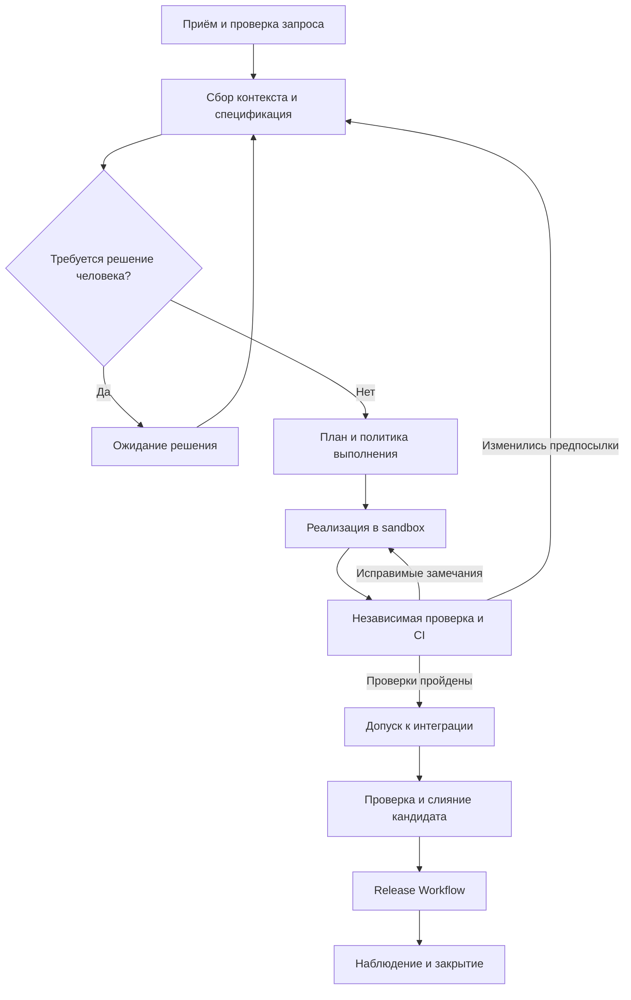

<!--
Источник: Notion — Описание оркестратора
URL: https://app.notion.com/p/3d3db33037c8801d8574f48c6a35d8c9
Выгружено: 2026-09-12
-->

# Описание оркестратора

**Оркестратор фабрики — это сервис, который ведёт изменение от запроса до проверенного выпуска, сохраняя состояние, управляя агентами и применяя правила допуска.** Агент предлагает решения и создаёт артефакты; оркестратор определяет, какой следующий шаг разрешён.

Для твоего стека я предлагаю реализацию на **Go + Temporal**, с GitLab для кода и проверок, Kubernetes для сред агентов, LiteLLM для доступа к моделям и OKF для архитектурного контекста.

Ниже — целевое описание программного flow.

**1. Единица управления — изменение**

Каждый запрос создаёт `ChangeWorkflow` с постоянным `change_id`. Это может быть новая функция, исправление, обновление зависимости или инфраструктурное изменение.

Workflow хранит:

<table header-row="true">
<tr>
<td>Данные</td>
<td>Назначение</td>
</tr>
<tr>
<td>Запрос, инициатор, владелец</td>
<td>Что требуется и кто принимает бизнес-решения</td>
</tr>
<tr>
<td>Версия спецификации</td>
<td>Зафиксированное ожидаемое поведение</td>
</tr>
<tr>
<td>Затронутые `component_id`</td>
<td>Область изменения и зависимости</td>
</tr>
<tr>
<td>Версии исходного кода и контекста</td>
<td>На каких данных выполняется работа</td>
</tr>
<tr>
<td>План и класс риска</td>
<td>Какие этапы, проверки и согласования обязательны</td>
</tr>
<tr>
<td>Запуски агентов</td>
<td>Исполнитель, модель, skills, попытки, результаты</td>
</tr>
<tr>
<td>Кандидат на интеграцию</td>
<td>Репозитории, ветки, commit SHA и MR</td>
</tr>
<tr>
<td>Доказательства проверок</td>
<td>Какие проверки прошла конкретная версия</td>
</tr>
<tr>
<td>Согласования</td>
<td>Кто разрешил какое действие над какой версией</td>
</tr>
<tr>
<td>Бюджет и сроки</td>
<td>Ограничения стоимости, времени и числа итераций</td>
</tr>
</table>

**Длинный разговор агентов не является состоянием процесса.** Состояние представлено структурированными данными и ссылками на версионированные артефакты.

**2. Программные компоненты**

Это логические модули. На старте их можно реализовать в одном Go-проекте, отдельно развернув API и пулы workers.

<table header-row="true">
<tr>
<td>Компонент</td>
<td>Ответственность</td>
</tr>
<tr>
<td>**Factory API**</td>
<td>Принимает запросы, команды пользователя и webhooks; проверяет IAM-права</td>
</tr>
<tr>
<td>**Workflow Engine**</td>
<td>Выполняет переходы, ожидания, таймеры и восстановление процесса</td>
</tr>
<tr>
<td>**Policy Evaluator**</td>
<td>Определяет допустимые действия, проверки, лимиты и согласования</td>
</tr>
<tr>
<td>**Context Builder**</td>
<td>Собирает контекст из OKF, спецификаций, контрактов и кода</td>
</tr>
<tr>
<td>**Agent Dispatcher**</td>
<td>Выбирает профиль агента, skills, модель и очередь исполнения</td>
</tr>
<tr>
<td>**Sandbox Manager**</td>
<td>Создаёт, восстанавливает и удаляет рабочие среды</td>
</tr>
<tr>
<td>**Integration Adapters**</td>
<td>Работают с GitLab, CI, GitOps, IAM и хранилищами</td>
</tr>
<tr>
<td>**Evidence Validator**</td>
<td>Проверяет полноту, происхождение и актуальность результатов</td>
</tr>
<tr>
<td>**Reconciler**</td>
<td>Сверяет ожидаемое состояние с GitLab, sandbox и окружениями</td>
</tr>
<tr>
<td>**Read Model**</td>
<td>Предоставляет порталу статусы, историю, затраты и блокировки</td>
</tr>
</table>

Temporal подходит для длительных процессов, которые могут ожидать человека, CI или внешнюю систему и продолжаться после сбоя. Состояние исполнения восстанавливается по истории событий. [Temporal Workflow Execution](https://docs.temporal.io/workflow-execution)

При этом:
- история Temporal — источник истины для исполнения workflow;
- PostgreSQL приложения — реестр внешних операций и представление данных для интерфейса;
- S3-совместимое хранилище — отчёты, логи, снимки и другие крупные артефакты;
- Git — источник истины для кода, спецификаций и конфигурации.

Нельзя независимо менять статус процесса и в Temporal, и в прикладной БД: представление для интерфейса должно обновляться из workflow и допускать восстановление.

**3. Основной flow**

Каждая стрелка — разрешённый переход с проверяемыми условиями. Агент не передаёт команду «перевести в следующий статус»: он возвращает результат, который обрабатывает workflow.

**4. Состояния процесса**

Я бы разделил **фазу работы** и **состояние исполнения**, чтобы не создавать десятки комбинаций вроде `ReviewWaitingForCI`.

<table header-row="true">
<tr>
<td>Фаза `phase`</td>
<td>Условие завершения</td>
</tr>
<tr>
<td>`INTAKE`</td>
<td>Запрос принят, права и дубликаты проверены</td>
</tr>
<tr>
<td>`SPECIFICATION`</td>
<td>Требования достаточно определены, обязательные вопросы закрыты</td>
</tr>
<tr>
<td>`PLANNING`</td>
<td>План валиден, риск и обязательные gates определены</td>
</tr>
<tr>
<td>`IMPLEMENTATION`</td>
<td>Подготовлен кандидат, быстрые проверки выполнены</td>
</tr>
<tr>
<td>`VERIFICATION`</td>
<td>Независимые проверки конкретного кандидата пройдены</td>
</tr>
<tr>
<td>`INTEGRATION`</td>
<td>Кандидат интегрирован с актуальной основной веткой</td>
</tr>
<tr>
<td>`RELEASE`</td>
<td>Нужный артефакт развёрнут по разрешённому маршруту</td>
</tr>
<tr>
<td>`OBSERVATION`</td>
<td>Завершена проверка результата выпуска</td>
</tr>
<tr>
<td>`CLOSED`</td>
<td>Зафиксирован итог и выполнена очистка</td>
</tr>
</table>

Отдельное поле `execution_status`:
- `RUNNING` — выполняется работа;
- `WAITING_EXTERNAL` — ожидается агент, CI или deployment;
- `WAITING_HUMAN` — требуется конкретное решение;
- `BLOCKED` — автоматическое продолжение невозможно;
- `PAUSED` — продвижение приостановлено оператором;
- `COMPLETED`, `FAILED`, `CANCELLED` — терминальные состояния.

При `BLOCKED` обязательно сохраняются причина, уже предпринятые действия и условие возобновления.

**5. Что выполняется на каждом этапе**

**Приём запроса**

Factory API проверяет инициатора через IAM и создаёт workflow с идемпотентным идентификатором запроса.

Повторная доставка webhook или повторное нажатие пользователем не должны создавать второй процесс.

На этом этапе определяются продукт, владелец, допустимые репозитории и первоначальный класс изменения. Запрос с недостаточными данными допускается к уточнению, но не к реализации.

**Сбор контекста и спецификация**

Context Builder получает доступные инициатору сведения:
- описание компонентов и зависимостей из OKF;
- действующие спецификации и ADR;
- API и событийные контракты;
- инварианты и проектные инструкции;
- релевантные участки кода.

Результат — `ContextManifest`: список источников, версий и контрольных сумм. Затем Specification Agent возвращает спецификацию, критерии приёмки и открытые вопросы.

Оркестратор проверяет структуру результата и обязательную полноту. Неразрешённый бизнес-вопрос переводит процесс в `WAITING_HUMAN`.

Ответ человека создаёт новую ревизию требований. Если требования изменились после реализации, workflow определяет, какие последующие результаты необходимо пересмотреть.

**Планирование**

Solution Agent вызывается только для изменений, которым нужен отдельный архитектурный анализ.

Его план должен содержать:

<table header-row="true">
<tr>
<td>Элемент плана</td>
<td>Содержание</td>
</tr>
<tr>
<td>Работы</td>
<td>Законченные проверяемые результаты</td>
</tr>
<tr>
<td>Зависимости</td>
<td>Что должно завершиться раньше</td>
</tr>
<tr>
<td>Область записи</td>
<td>Репозитории и компоненты, которые можно менять</td>
</tr>
<tr>
<td>Контракты</td>
<td>Какие интерфейсы сохраняются или изменяются</td>
</tr>
<tr>
<td>Проверки</td>
<td>Как доказать корректность</td>
</tr>
<tr>
<td>Выпуск</td>
<td>Порядок поставки и требования совместимости</td>
</tr>
<tr>
<td>Восстановление</td>
<td>Откат либо исправление вперёд</td>
</tr>
</table>

Policy Evaluator проверяет план: отсутствие циклов зависимостей, разрешённую область работ, лимиты параллелизма и обязательные проверки.

**План LLM является предложением. Исполняемый план появляется после программной валидации.**

**Реализация**

Sandbox Manager создаёт рабочую среду из разрешённого образа с зафиксированной версией репозитория.

Agent Dispatcher передаёт Engineering Agent:
- конкретную цель и критерии приёмки;
- ссылки на контекст;
- версии skills;
- разрешённые инструменты;
- область записи;
- лимиты времени, стоимости и действий.

Агент выполняет внутренний цикл «изменить → проверить → исправить» внутри sandbox. Оркестратор не управляет каждым редактированием файла: он контролирует этап целиком, прогресс и бюджет.

Для независимых подзадач можно создавать дочерние workflows. Работа нескольких агентов над одним изменением требует явного назначения ответственного за сборку общего кандидата.

**Проверка**

На зафиксированном commit SHA запускаются:
1. Доверенные автоматические gates.
2. Verification Agent.
3. Дополнительные специалисты, назначенные политикой.

Оркестратор проверяет не только итог `passed`, но и:
- завершились ли все обязательные проверки;
- относятся ли они к нужному SHA;
- выполнены ли доверенной версией проверяющего инструмента;
- есть ли требуемые доказательства;
- остались ли блокирующие findings.

После исправлений формируется новый кандидат. Зависимые проверки выполняются повторно; согласование старой версии не переносится автоматически.

Для независимости полезно иметь приёмочные проверки, которые инженерный агент не может изменить в рамках своей задачи.

**Интеграция**

Оркестратор отправляет кандидат в очередь интеграции. Перед слиянием проверяется его совместимость с актуальной основной веткой.

GitLab merged results pipelines проверяют временный commit, объединяющий исходную и целевую ветки. Эта возможность доступна в Premium/Ultimate; она требует дополнительной дисциплины очереди слияний при параллельных изменениях. [GitLab Docs](https://docs.gitlab.com/ci/pipelines/merged_results_pipelines/)

Если основная ветка изменилась, прежний зелёный pipeline сам по себе не является достаточным разрешением на слияние.

**Выпуск и наблюдение**

После интеграции запускается отдельный `ReleaseWorkflow`. Он управляет артефактом по digest, целевым окружением, необходимыми согласованиями и результатами наблюдения.

Это позволяет разделять частоту интеграции и частоту production-релизов.

Для нескольких репозиториев нельзя предполагать атомарное слияние. План должен предусматривать промежуточную совместимость, порядок выпуска и при необходимости feature flags.

После deployment workflow проверяет smoke-тесты и установленные показатели здоровья. Отсутствие телеметрии считается неопределённым результатом, а не успехом.

**6. Контракт запуска агента**

Все агенты получают одинаковую внешнюю оболочку задания, независимо от модели и внутреннего harness.

<table header-row="true">
<tr>
<td>Вход</td>
<td>Пример содержания</td>
</tr>
<tr>
<td>`task_id`, `change_id`, `revision`</td>
<td>Идентификаторы задания и версии</td>
</tr>
<tr>
<td>`agent_profile_version`</td>
<td>Версия профиля исполнителя</td>
</tr>
<tr>
<td>`skill_versions`</td>
<td>Зафиксированные skills</td>
</tr>
<tr>
<td>`input_refs`</td>
<td>Спецификация, контекст, код</td>
</tr>
<tr>
<td>`allowed_actions`</td>
<td>Разрешённые операции</td>
</tr>
<tr>
<td>`expected_output_schema`</td>
<td>Формат результата</td>
</tr>
<tr>
<td>`deadline`, `budget`</td>
<td>Лимиты</td>
</tr>
<tr>
<td>`idempotency_key`</td>
<td>Защита от повторного запуска</td>
</tr>
</table>

Результат:

<table header-row="true">
<tr>
<td>Поле</td>
<td>Назначение</td>
</tr>
<tr>
<td>`outcome`</td>
<td>`succeeded`, `needs_clarification`, `blocked`, `failed`</td>
</tr>
<tr>
<td>`artifact_refs`</td>
<td>Ссылки на созданные артефакты</td>
</tr>
<tr>
<td>`candidate_sha`</td>
<td>Версия кода, если применимо</td>
</tr>
<tr>
<td>`findings`</td>
<td>Обнаруженные проблемы</td>
</tr>
<tr>
<td>`evidence_refs`</td>
<td>Результаты проверок</td>
</tr>
<tr>
<td>`usage`</td>
<td>Время и потреблённый бюджет</td>
</tr>
<tr>
<td>`error_class`</td>
<td>Основание для retry или эскалации</td>
</tr>
</table>

Сообщение агента `succeeded` означает завершение его задания. **Оно не означает автоматического разрешения на merge или deployment.**

**7. Реализация на Temporal**

Предлагаемая иерархия:

<table header-row="true">
<tr>
<td>Workflow</td>
<td>Область ответственности</td>
</tr>
<tr>
<td>`ChangeWorkflow`</td>
<td>Полный жизненный цикл изменения</td>
</tr>
<tr>
<td>`AgentTaskWorkflow`</td>
<td>Запуск агента, ожидание результата, контроль лимитов и восстановление</td>
</tr>
<tr>
<td>`VerificationWorkflow`</td>
<td>Параллельные проверки и сбор заключения</td>
</tr>
<tr>
<td>`ReleaseWorkflow`</td>
<td>Выпуск, наблюдение и действия при деградации</td>
</tr>
</table>

Внешние операции выполняются через **Activities**: чтение OKF, обращения к моделям, запуск sandbox, создание MR и запрос deployment. Код workflow остаётся детерминированным; при replay он не должен заново обращаться к LLM. [Temporal Activities](https://docs.temporal.io/activities)

Для продолжительных запусков агента я бы использовал схему:
1. Activity регистрирует задание в Agent Runtime и получает `job_id`.
2. Workflow ожидает результат, таймер или команду отмены.
3. Runtime отправляет callback с `job_id` и результатом.
4. API проверяет подлинность и передаёт событие workflow.
5. При отсутствии callback Reconciler запрашивает фактическое состояние задания.

Ожидание не должно удерживать отдельный поток или worker на всё время работы агента.

Команды пользователя и внешние результаты поступают через механизмы сообщений Temporal. Для команд, которым требуется подтверждение принятия и валидация, подходят Updates; для асинхронных событий — Signals. [Temporal: message passing](https://docs.temporal.io/develop/go/workflows/message-passing)

Kafka можно использовать для публикации событий фабрики в корпоративный ландшафт. Внутреннее управление задачами и ожиданиями остаётся у Temporal — второй движок состояния на Kafka не нужен.

**8. Повторы и восстановление**

Нужно различать технический retry и новую инженерную попытку.

<table header-row="true">
<tr>
<td>Ситуация</td>
<td>Поведение</td>
</tr>
<tr>
<td>Временная ошибка API или rate limit</td>
<td>Ограниченный retry с backoff</td>
</tr>
<tr>
<td>Worker завершился</td>
<td>Восстановление workflow и сверка внешнего задания</td>
</tr>
<tr>
<td>Потерян sandbox</td>
<td>Восстановление из сохранённого checkpoint либо новая контролируемая попытка</td>
</tr>
<tr>
<td>Тест обнаружил дефект</td>
<td>Новая итерация реализации с findings</td>
</tr>
<tr>
<td>Требование противоречиво</td>
<td>Ожидание решения владельца</td>
</tr>
<tr>
<td>Превышен бюджет</td>
<td>`BLOCKED`, запрос изменения лимита</td>
</tr>
<tr>
<td>Нарушены полномочия</td>
<td>Остановка операции и фиксация причины</td>
</tr>
<tr>
<td>Результат относится к старой ревизии</td>
<td>Сохранение в истории без продвижения текущего процесса</td>
</tr>
<tr>
<td>Deployment имеет неизвестный результат</td>
<td>Сверка состояния до любых повторных действий</td>
</tr>
</table>

Temporal не делает внешние операции автоматически «ровно один раз». Для создания sandbox, MR и deployment нужны стабильные ключи операций и сверка результата.

Например, если MR уже создан, но ответ API потерян, повторная Activity должна найти существующий MR по сохранённому идентификатору операции, а не открыть новый.

Для выдачи права записи или слияния используются ограниченные по времени разрешения. Устаревший worker после потери владения задачей не должен сохранять возможность выполнять управляющие операции.

**9. Согласования, пауза и отмена**

Approval хранится как отдельное решение с привязкой к:
- пользователю и его полномочиям;
- разрешаемому действию;
- версии спецификации;
- commit SHA или digest артефакта;
- окружению;
- сроку действия.

Перед выполнением действия права проверяются повторно.

Команды имеют разную семантику:

<table header-row="true">
<tr>
<td>Команда</td>
<td>Что происходит</td>
</tr>
<tr>
<td>`Pause`</td>
<td>Новые этапы не запускаются; текущая операция останавливается в безопасной точке либо завершается</td>
</tr>
<tr>
<td>`Resume`</td>
<td>Повторно проверяются актуальность контекста, прав и результатов</td>
</tr>
<tr>
<td>`Cancel`</td>
<td>Запрашивается остановка дочерних задач, отзываются разрешения, выполняется очистка</td>
</tr>
<tr>
<td>`Approve` / `Reject`</td>
<td>Фиксируется решение по конкретному объекту согласования</td>
</tr>
<tr>
<td>`Revise`</td>
<td>Создаётся новая ревизия требований и пересматриваются зависимые результаты</td>
</tr>
</table>

Отмена процесса после deployment сама по себе не означает откат production. Это отдельное действие с собственными условиями.

**10. Обязательные инварианты оркестратора**

Их стоит реализовать как код и проверить сценариями отказов:
- один принятый запрос не создаёт несколько независимых изменений;
- результат старой попытки не продвигает новую ревизию;
- обязательные проверки относятся к выпускаемому кандидату;
- агент не может менять политику собственного допуска;
- внешняя операция не повторяется без проверки её результата;
- параллельные задания не превышают общий бюджет изменения;
- ожидание всегда имеет срок или явное правило эскалации;
- после перезапуска процесс продолжает работу без потери согласований и артефактов;
- очистка sandbox выполняется и при успехе, и при отмене, и при сбое;
- изменение версии workflow не ломает уже работающие процессы.

Для первого релиза оркестратора я бы реализовал **один репозиторий на изменение, три агентных профиля, один sandbox, независимый CI и ручное разрешение production-выпуска**. При этом идемпотентность, привязку проверок к SHA, лимиты и восстановление нужно заложить сразу: от них зависит возможность безопасно расширять автономность.
