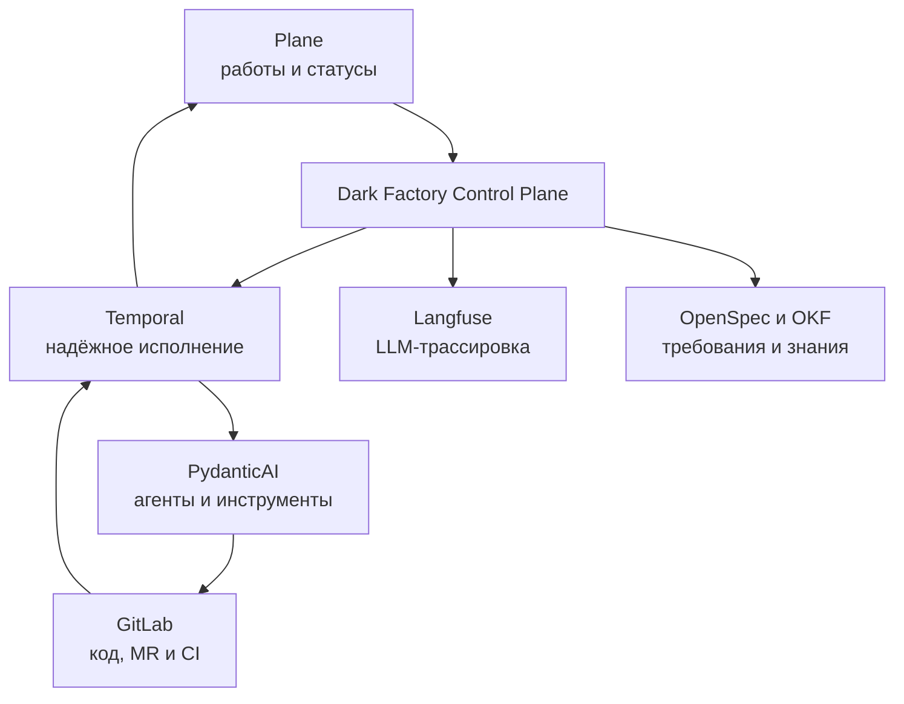

<!--
Источник: Notion — Plane
URL: https://app.notion.com/p/3d5db33037c880d4b42dd6e109e5f47e
Выгружено: 2026-09-12
-->

# Plane

В архитектуре Dark Factory **Plane выполняет функцию операционного контура управления разработкой**: показывает человеку и агентам, *что нужно сделать, кто/что это делает, в каком состоянии работа и где требуется решение человека*.

Это не движок фабрики и не оркестратор агентов. Это её **work management layer**.

<table header-row="true">
<tr>
<td>Функция Plane</td>
<td>Что хранится и отображается</td>
</tr>
<tr>
<td>Приём работ</td>
<td>Инициативы, фичи, задачи, дефекты, технический долг</td>
</tr>
<tr>
<td>Декомпозиция</td>
<td>Initiative → Epic/Module → Issue → Sub-issue</td>
</tr>
<tr>
<td>Состояние выполнения</td>
<td>Backlog, Analysis, Spec, Implementation, Review, Verification, Done, Blocked</td>
</tr>
<tr>
<td>Очереди агентов</td>
<td>Какие задачи готовы к автономному выполнению, назначенный агент, приоритет</td>
</tr>
<tr>
<td>Human-in-the-loop</td>
<td>Запросы уточнений, архитектурные согласования, принятие рисков, разрешение конфликтов</td>
</tr>
<tr>
<td>Связь с артефактами</td>
<td>Ссылки на OpenSpec, ADR, OKF-объекты, репозиторий, branch/worktree, MR, pipeline и deployment</td>
</tr>
<tr>
<td>Контроль результата</td>
<td>Acceptance criteria, Definition of Ready/Done, проверки и итоговый статус</td>
</tr>
<tr>
<td>Операционная прозрачность</td>
<td>Прогресс инициатив, блокировки, время цикла, незавершённая работа</td>
</tr>
<tr>
<td>Ручное управление</td>
<td>Pause, retry, reassign, cancel, escalation — через расширение или Dark Factory Console</td>
</tr>
</table>

### Место Plane в общем потоке

### Разделение ответственности

- **Plane** — что делаем, зачем, в каком состоянии, где требуется человек.
- **OpenSpec** — каким должен быть результат и по каким критериям он принимается.
- **OKF** — архитектурный контекст, зависимости, владельцы, ограничения и граф знаний.
- **Temporal** — как надёжно выполнить многошаговый процесс, повторить упавший шаг и дождаться события.
- **PydanticAI** — как агент рассуждает, вызывает инструменты и выдаёт структурированный результат.
- **GitLab** — код, worktree/branch, merge request, проверки и история изменений.
- **Langfuse** — как фактически работали модели: трассы, токены, задержки, качество и ошибки.
- **Dark Factory Console** — единая панель контроля, объединяющая данные перечисленных систем.

### Чего не следует помещать в Plane

Plane не должен быть:
- источником архитектурной истины;
- хранилищем полных спецификаций;
- workflow-движком долгоживущих процессов;
- системой исполнения агентов;
- хранилищем промптов и трассировок;
- заменой GitLab CI или deployment-системе.

В Plane достаточно хранить идентификаторы, краткий рабочий контекст, acceptance criteria и ссылки на канонические артефакты.

### Практическая модель задачи

Каждая задача фабрики в Plane может содержать:
- `component_id`;
- тип работы: feature, bug, refactoring, architecture, infrastructure;
- ссылку на OpenSpec change;
- связанные OKF-объекты;
- уровень автономности;
- назначенный агент или команда;
- требуемые quality gates;
- ссылку на workflow Temporal;
- worktree, commit и merge request;
- состояние CI, security review и deployment;
- причину блокировки;
- запрос решения человека.

### Нужен ли Plane в MVP

**Не обязательно для исполнения, но полезно для управляемости.**

Минимальная фабрика может работать как:

`OpenSpec → Temporal → PydanticAI → GitLab`

Однако без Plane человеку придётся собирать картину происходящего из GitLab, Temporal и логов. Plane даёт понятный продуктовый и проектный взгляд на фабрику.

Для MVP я бы использовал Plane как:
1. реестр и очередь работ;
2. доску состояний;
3. место принятия человеческих решений;
4. индекс ссылок на спеки, workflow и MR;
5. источник событий о создании, изменении и одобрении задачи.

Итого: **Plane — это операционная система управления работами Dark Factory, но не её исполняющее ядро**. При появлении полноценной Dark Factory Console Plane может остаться системой учёта задач, а специализированная консоль станет главным интерфейсом управления агентами и workflow.
