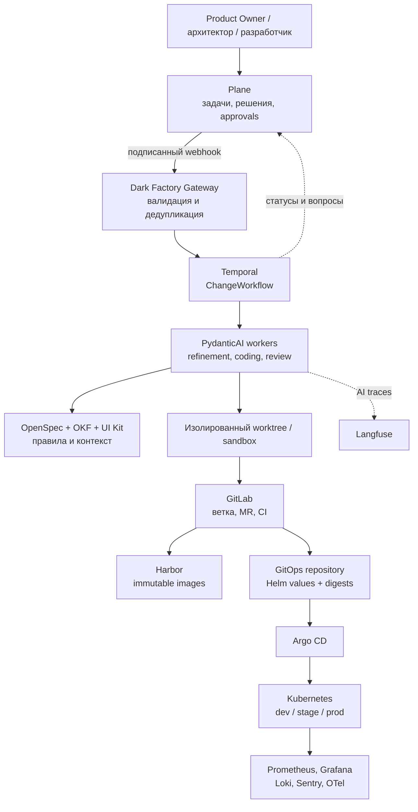
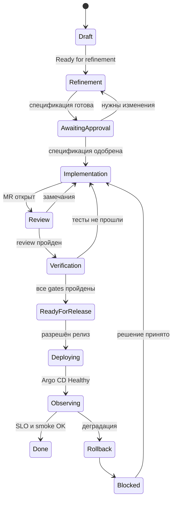
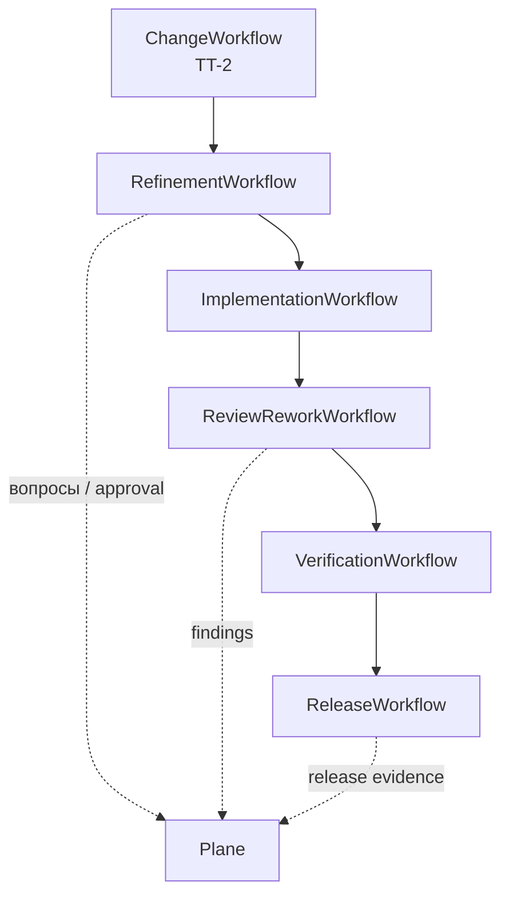
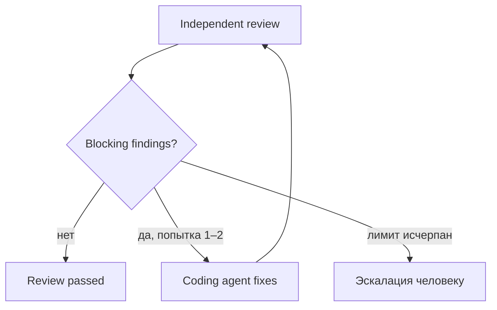
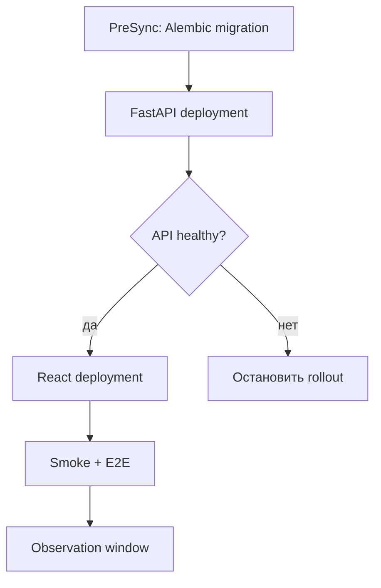
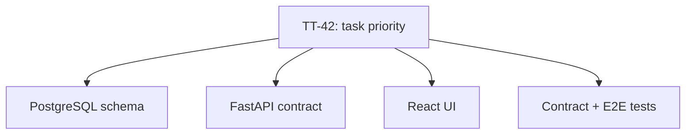

<!--
Источник: Notion — Процессы
URL: https://app.notion.com/p/3d6db33037c880298068cd915bad48ea
Выгружено: 2026-09-12
-->

# Процессы

## Целевая модель

Я трактую «трекер задач» как отдельное приложение, которое разрабатывается с помощью Dark Factory:
- frontend: React + TypeScript + корпоративный UI Kit;
- backend: FastAPI + Python;
- данные: PostgreSQL + Alembic;
- аутентификация: Keycloak;
- доставка: GitLab CI → Harbor → GitOps → Argo CD → Kubernetes.

Plane при этом остаётся системой управления разработкой, а не исполняющим движком.

Главная единица автоматизации:

> одна Plane Story → один `ChangeWorkflow` → одна OpenSpec-дельта → один проверяемый набор изменений → один набор release evidence.

Большой Epic вроде «MVP трекера задач» сначала разбивается на вертикальные Story. Не следует отдавать одному агенту задачу «сделать весь трекер».



Plane официально поддерживает webhook-события, уникальный delivery ID и HMAC-подпись, что позволяет безопасно и идемпотентно запускать workflow. [Plane webhook documentation](https://developers.plane.so/dev-tools/build-plane-app/webhooks)

## Кто является источником истины

<table header-row="true">
<tr>
<td>Объект</td>
<td>Source of truth</td>
<td>Роль</td>
</tr>
<tr>
<td>Бизнес-задача, приоритет, ответы, approval</td>
<td>Plane</td>
<td>Что и зачем делаем</td>
</tr>
<tr>
<td>Текущее исполнение, ожидания, retry, timeout</td>
<td>Temporal</td>
<td>Где реально находится процесс</td>
</tr>
<tr>
<td>Требования конкретного изменения</td>
<td>OpenSpec в Git</td>
<td>Проверяемая change specification</td>
</tr>
<tr>
<td>Код, MR, тестовые отчёты</td>
<td>GitLab</td>
<td>Инженерные доказательства</td>
</tr>
<tr>
<td>Компоненты, зависимости, архитектурные правила</td>
<td>OKF</td>
<td>Контекст ландшафта</td>
</tr>
<tr>
<td>Собранные образы</td>
<td>Harbor</td>
<td>Неизменяемые артефакты</td>
</tr>
<tr>
<td>Желаемая версия в среде</td>
<td>GitOps repository</td>
<td>Desired state</td>
</tr>
<tr>
<td>Фактическое состояние приложения</td>
<td>Argo CD и Kubernetes</td>
<td>Что реально развернуто</td>
</tr>
<tr>
<td>AI-трассы, стоимость, tool calls, оценки</td>
<td>Langfuse</td>
<td>Качество работы агентов</td>
</tr>
<tr>
<td>Ошибки и SLO приложения</td>
<td>Observability stack</td>
<td>Работоспособность продукта</td>
</tr>
<tr>
<td>Общая панель процесса</td>
<td>Dark Factory Console</td>
<td>Проекция всех источников, но не новый source of truth</td>
</tr>
</table>

Plane нельзя позволять вручную объявлять приложение развернутым. Статус `Released` должен появляться только после подтверждения Argo CD, smoke-тестов и периода наблюдения.

## Состояния задачи в Plane



Рекомендуемые Plane-состояния:
1. `Draft`
2. `Refinement`
3. `Awaiting Approval`
4. `Ready for Build`
5. `Implementation`
6. `Review`
7. `Verification`
8. `Ready for Release`
9. `Deploying`
10. `Observing`
11. `Done`
12. `Blocked / Cancelled`

## Сквозной процесс

### 1. Инициация задачи в Plane

Для первого выпуска создаётся Epic:

`TT-MVP — Веб-трекер задач`

В Epic фиксируются:
- какую проблему решаем;
- целевые пользователи;
- границы MVP;
- бизнес-результат;
- основные ограничения;
- владелец продукта;
- компоненты `task-tracker-web` и `task-tracker-api`;
- ссылка на продуктовую страницу и архитектурный контекст.

Epic разбивается на небольшие вертикальные Story:

<table header-row="true">
<tr>
<td>Story</td>
<td>Результат</td>
</tr>
<tr>
<td>`TT-1`</td>
<td>Пользователь входит и видит пустой список задач</td>
</tr>
<tr>
<td>`TT-2`</td>
<td>Пользователь создаёт и редактирует задачу</td>
</tr>
<tr>
<td>`TT-3`</td>
<td>Пользователь меняет статус задачи</td>
</tr>
<tr>
<td>`TT-4`</td>
<td>Пользователь фильтрует и ищет задачи</td>
</tr>
<tr>
<td>`TT-5`</td>
<td>Приложение готово к эксплуатации: метрики, ошибки, backup, SLO</td>
</tr>
</table>

Frontend и backend не следует оформлять отдельными бизнес-Story. Одна Story должна включать UI, API, БД и тесты, необходимые для законченного пользовательского сценария.

Пока задача находится в `Draft`, Dark Factory ничего не запускает. Перевод в `Ready for Refinement` отправляет webhook.

### 2. Приём события

Задействованы:
- Plane;
- Dark Factory Gateway;
- Temporal;
- Change Registry;
- Dark Factory Console.

Gateway:
1. проверяет HMAC-подпись;
2. дедуплицирует событие по `X-Plane-Delivery`;
3. получает полное состояние Story через Plane API;
4. определяет `component_id`;
5. запускает или сигнализирует существующий Temporal workflow.

Пример идентификаторов:

```plain text
change_id: TT-2
temporal_workflow_id: change/TT-2
branch: change/TT-2-create-task
openspec: openspec/changes/TT-2-create-task/
gitlab_label: change_id::TT-2
otel.attribute: change.id=TT-2
```

Изменение Plane Story не должно создавать второй workflow: Gateway отправляет Signal уже существующему `ChangeWorkflow`.

### 3. `ChangeWorkflow`

Это родительский durable workflow одной Story:



Temporal отвечает за:
- сохранение состояния;
- ожидание ответа человека хоть несколько дней;
- технические retry;
- timeout;
- pause/resume/cancel;
- ограничение циклов rework;
- восстановление после падения worker;
- координацию дочерних workflow.

Temporal поддерживает child workflows и записывает их состояние в историю исполнения. [Temporal Python child workflows](https://docs.temporal.io/develop/python/workflows/child-workflows)

PydanticAI выполняется внутри Temporal workflow. Вызовы модели, MCP и внешних инструментов исполняются как Activities, а не непосредственно в детерминированном workflow-коде. Это уже нативно поддерживается PydanticAI. [PydanticAI durable execution with Temporal](https://pydantic.dev/docs/ai/capabilities/durable_execution/temporal/)

### 4. `RefinementWorkflow`

Задействованы:
- PydanticAI Refinement Agent;
- Plane;
- OpenSpec;
- OKF;
- GitLab;
- репозиторий UI Kit;
- архитектурные rules;
- Langfuse.

Агент собирает контекст:
- описание и комментарии Plane;
- существующий код;
- текущие спецификации;
- компоненты и зависимости из OKF;
- UI Kit и правила его использования;
- ADR;
- требования безопасности;
- шаблоны аналогичных изменений.

На выходе формируется строго типизированный `ChangeSpec`, содержащий:
- problem statement;
- scope / out of scope;
- acceptance criteria;
- пользовательские сценарии;
- UI-состояния: loading, empty, error, forbidden;
- изменения API;
- изменения модели данных;
- требования совместимости;
- NFR;
- тестовый план;
- deployment и rollback plan;
- risk class;
- список human gates.

Свободный текст агента не должен становиться контрактом. Результат сохраняется в Git:

```plain text
openspec/changes/TT-2-create-task/
├── proposal.md
├── requirements.md
├── design.md
├── api.md
├── test-plan.md
└── tasks.md
```

Если информации не хватает, агент публикует в Plane конкретные вопросы и Temporal ожидает Signal с ответами.

После этого выполняются автоматические gates:
- нет противоречий между AC, design и test plan;
- каждое AC связано хотя бы с одним тестом;
- описаны ошибки и права доступа;
- определены затрагиваемые компоненты;
- отсутствуют запрещённые архитектурные зависимости;
- изменение API совместимо либо явно объявлено breaking;
- UI использует компоненты корпоративного UI Kit.

Для прикладной разработки достаточно OpenSpec. Отдельный Spec Kit здесь не нужен: полезные механики clarification, checklist и cross-artifact analysis следует реализовать как gates поверх OpenSpec.

### 5. Human Gate: утверждение спецификации

В Plane появляется краткое резюме:
- что будет изменено;
- какие компоненты затрагиваются;
- макет или ссылка на preview;
- риски;
- стоимость и оценка выполнения;
- нерешённые вопросы;
- ссылка на OpenSpec diff.

Product Owner подтверждает поведение, архитектор — существенные архитектурные решения.

После approval Story переходит в `Ready for Build`, а Temporal получает Signal.

### 6. `ImplementationWorkflow`

Задействованы:
- Temporal;
- PydanticAI Coding Agent;
- GitLab;
- изолированный git worktree;
- frontend/backend toolchains;
- Vault;
- Langfuse.

Для Story создаётся изолированное рабочее пространство:

```plain text
worktree: /workspaces/TT-2
branch: change/TT-2-create-task
base_sha: <текущий main>
```

Агент получает:
- ограниченный токен GitLab;
- доступ только к нужным MCP/tools;
- временные credentials из Vault;
- лимит времени и бюджета;
- список разрешённых директорий;
- утверждённый `ChangeSpec`.

В рекомендуемом монорепозитории:

```plain text
task-tracker/
├── apps/
│   ├── web/                 # React + TypeScript
│   └── api/                 # FastAPI + Python
├── contracts/
│   └── openapi.json
├── openspec/
├── deploy/
│   └── helm/
├── tests/
│   └── e2e/
└── .gitlab-ci.yml
```

Реализация идёт в таком порядке:
1. доменная модель и API-контракт;
2. Alembic migration;
3. FastAPI endpoint и Pydantic models;
4. генерация TypeScript API client;
5. React UI на компонентах UI Kit;
6. unit, integration и E2E tests;
7. эксплуатационная документация.

Быстрый внутренний цикл выполняется в worktree:
- Ruff;
- mypy/pyright;
- pytest;
- frontend lint и typecheck;
- Vitest;
- локальные integration tests;
- Playwright;
- сборка контейнеров.

GitLab CI не запускается после каждой мысли агента. Он остаётся финальным независимым контролем. Это сохраняет скорость worktree-подхода и доверие к централизованному CI.

### 7. Создание Merge Request

Когда локальные проверки пройдены, агент:
- делает commit;
- push в short-lived branch;
- открывает GitLab MR;
- связывает MR с Plane Story;
- прикладывает OpenSpec;
- публикует test evidence;
- описывает migration и rollback;
- переводит Story в `Review`.

MR должен содержать:

```plain text
Change: TT-2
Spec revision: 3
Affected components:
- task-tracker-web
- task-tracker-api

Risk: medium
Database migration: yes, backward compatible
Breaking API change: no
Rollback: previous image digest
```

### 8. `ReviewReworkWorkflow`

Review выполняет не тот же агент, который писал код.

Проверки разделяются по аспектам:
- соответствие OpenSpec;
- корректность Python/FastAPI;
- корректность React/UI Kit;
- API compatibility;
- безопасность;
- миграции БД;
- тестовое покрытие;
- accessibility;
- эксплуатационная готовность.

Каждое замечание формализуется:

```plain text
severity
rule_id
file
line
evidence
expected_behavior
suggested_fix
blocking
```

Цикл ограничивается, например, двумя автоматическими rework-итерациями:



Это защищает фабрику от бесконечного диалога двух агентов.

### 9. `VerificationWorkflow`

GitLab MR pipeline является авторитетным quality gate. Такие pipelines запускаются при открытии MR и при новых push в его ветку. [GitLab merge request pipelines](https://docs.gitlab.com/ci/pipelines/merge_request_pipelines/)

Рекомендуемый pipeline:
1. validation OpenSpec;
2. backend lint/typecheck;
3. frontend lint/typecheck;
4. unit tests;
5. OpenAPI compatibility;
6. integration tests с PostgreSQL;
7. migration test;
8. frontend component tests;
9. container build;
10. dependency и secret scanning;
11. SBOM;
12. image vulnerability scan;
13. deploy review environment;
14. Playwright E2E;
15. visual regression;
16. accessibility checks;
17. публикация `VerificationReport`.

Review environment лучше создавать через Argo CD/ApplicationSet в отдельном namespace:

```plain text
review-tt-2
```

Product Owner получает URL и может проверить сценарий непосредственно в браузере.

Если pipeline падает:
- Plane переходит в `Implementation`;
- создаются структурированные defect findings;
- Temporal запускает ограниченный rework;
- после исправления GitLab автоматически запускает новый pipeline.

### 10. Merge и создание релиза

При выполнении всех gates:
- MR merge в защищённый `main`;
- исходная ветка удаляется;
- main pipeline повторно собирает образы;
- образы маркируются commit SHA;
- образы подписываются;
- публикуются в Harbor;
- создаётся release evidence.

Например:

```plain text
harbor.small.kz/task-tracker/web@sha256:...
harbor.small.kz/task-tracker/api@sha256:...
```

Продвигать между средами нужно один и тот же digest, а не пересобирать приложение для каждой среды.

### 11. `ReleaseWorkflow`

Release Agent не выполняет `kubectl apply` в production. Он создаёт MR в GitOps-репозитории:

```plain text
platform-gitops/
└── applications/task-tracker/
    ├── dev/values.yaml
    ├── stage/values.yaml
    └── prod/values.yaml
```

Процесс:
1. обновить image digest для dev;
2. Argo CD синхронизирует dev;
3. выполнить smoke/E2E;
4. обновить тот же digest для stage;
5. проверить stage;
6. запросить production approval;
7. обновить prod;
8. Argo CD синхронизирует production.

Argo CD сравнивает desired state из Git с live state Kubernetes и может выполнять автоматическую синхронизацию без прямого доступа CI к Argo API. [Argo CD automated sync](https://argo-cd.readthedocs.io/en/release-2.11/user-guide/auto_sync/)

Порядок для приложения:



Миграции должны использовать expand/contract:
- сначала добавить совместимую структуру;
- затем развернуть backend;
- затем frontend;
- удаление старых полей — отдельным изменением.

### 12. Наблюдение и закрытие

После `Argo CD Healthy` задача ещё не становится `Done`. Она переходит в `Observing`.

Проверяются:
- HTTP 5xx;
- p95/p99 latency;
- readiness;
- frontend errors в Sentry;
- ошибки миграции;
- saturation БД;
- бизнес-smoke;
- ключевой пользовательский сценарий.

После успешного observation window:
- Plane → `Done`;
- OpenSpec change архивируется;
- OKF обновляет факты о компонентах и API;
- Plane получает ссылки на MR, pipeline, image digest и deployment;
- review environment удаляется;
- Langfuse сохраняет итоговые показатели агентного выполнения.

## Как выглядит последующее улучшение

Предположим, после первого релиза в Plane создаётся Story:

`TT-42 — Добавить приоритет задачи и фильтрацию по приоритету`

### Refinement

OpenSpec delta фиксирует:
- значения `low`, `medium`, `high`;
- default для существующих задач;
- изменение API;
- dropdown и badge из UI Kit;
- фильтр с сохранением в URL;
- совместимость старых клиентов;
- миграцию БД;
- критерии приёмки.

OKF показывает impact:



### Implementation

Backend:
- колонка `priority`;
- Pydantic enum;
- фильтр в endpoint;
- индекс при необходимости;
- backward-compatible OpenAPI.

Frontend:
- `PriorityBadge`;
- `PrioritySelect`;
- query parameter;
- empty/loading/error states;
- keyboard navigation и accessibility.

Проверки:
- миграция существующих записей;
- старый запрос без `priority`;
- фильтрация;
- недопустимое значение;
- UI interaction;
- E2E-сценарий;
- visual regression.

### Release

Безопасный порядок:
1. совместимая миграция;
2. новый API;
3. новый frontend;
4. включение функции;
5. observation window;
6. закрытие Story.

То есть улучшение проходит тот же workflow, но без bootstrap репозитория и инфраструктуры. Вместо полной спецификации продукта создаётся небольшая OpenSpec-дельта.

## Обязательные human gates

<table header-row="true">
<tr>
<td>Gate</td>
<td>Кто принимает</td>
<td>Когда обязателен</td>
</tr>
<tr>
<td>Scope/spec approval</td>
<td>Product Owner</td>
<td>Для всех новых функций</td>
</tr>
<tr>
<td>Architecture/data/security</td>
<td>Архитектор или профильный эксперт</td>
<td>Новая интеграция, IAM, миграция, breaking API</td>
</tr>
<tr>
<td>UI acceptance</td>
<td>Product Owner/дизайн-владелец</td>
<td>Изменение пользовательского сценария</td>
</tr>
<tr>
<td>Production promotion</td>
<td>Ответственный за продукт</td>
<td>Первые релизы и изменения среднего/высокого риска</td>
</tr>
<tr>
<td>Stop/rollback</td>
<td>On-call или владелец сервиса</td>
<td>Деградация после релиза</td>
</tr>
</table>

После накопления статистики низкорисковые изменения можно переводить на автоматическое production promotion. Для первых версий трекера я бы оставил ручное подтверждение production.

## Что не нужно включать в первую версию

- Kafka не нужен ни самому простому трекеру, ни для запуска workflow: Plane webhook + Gateway + Temporal достаточно. Kafka стоит добавлять при появлении нескольких независимых потребителей событий.
- Plane AI не нужен для выполнения Dark Factory. Интеграция через API/webhooks меньше связывает архитектуру с редакцией Plane.
- Не нужен отдельный агент на каждую мелкую функцию. Достаточно типизированных ролей refinement, implementation, review и verification.
- Не нужно копировать знания из OpenSpec в OKF вручную. OKF обновляется после merge из подтверждённых артефактов.
- Агентам нельзя давать прямой push в `main`, production credentials или `cluster-admin`.

## Критерий настоящего `Done`

Story считается завершённой, только если одновременно выполнено:

```plain text
OpenSpec approved
MR merged
Main pipeline green
Images published by digest
GitOps change merged
Argo CD Synced + Healthy
Smoke tests passed
Observation window passed
Plane contains release evidence
OKF synchronized
```

Таким образом, Plane показывает понятный человеку процесс, Temporal обеспечивает надёжное исполнение, PydanticAI принимает ограниченные интеллектуальные решения, GitLab доказывает качество кода, а Argo CD и Kubernetes подтверждают, что изменение действительно дошло до production.
