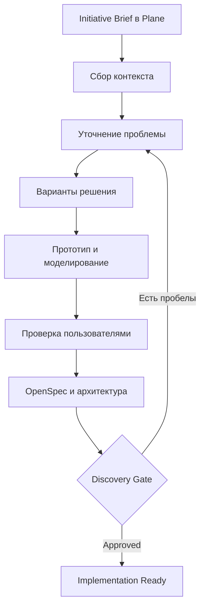
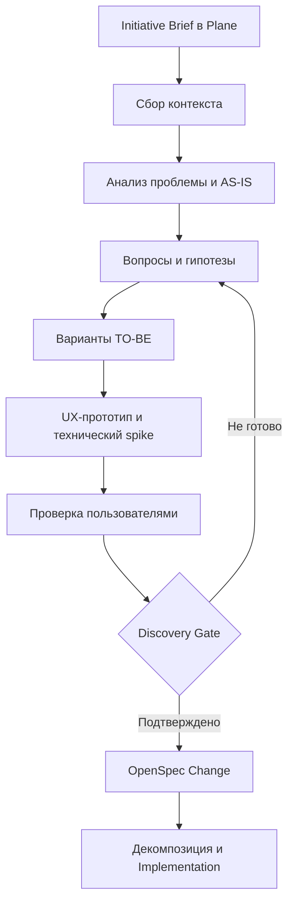
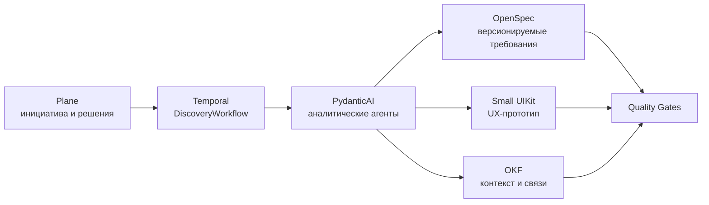

<!--
Источник: Notion — Уровни требований
URL: https://app.notion.com/p/3d7db33037c880758dc9f2d8b1ef1721
Выгружено: 2026-09-12
-->

# Уровни требований

Для Dark Factory оптимален не подход «сначала человек пишет идеальный BRD и рисует весь UI», а управляемое совместное discovery:

> Человек задаёт проблему, цели, ограничения и принимает ключевые решения.
> Фабрика исследует контекст, задаёт вопросы, строит варианты, прототипирует и превращает результат в проверяемую спецификацию.

На вход достаточно отдать качественный `Initiative Brief` на 1–3 страницы. Полный BRD, детализированные сценарии и готовый UI должны быть результатами discovery, а не обязательным входом.

## 1. Что нужно подать на вход

Минимальный пакет должен отвечать на вопрос «зачем и для кого», а не подробно описывать реализацию.

### Обязательный минимум — Initiative Brief

<table header-row="true">
<tr>
<td>Раздел</td>
<td>Что передать</td>
</tr>
<tr>
<td>Проблема</td>
<td>Что сейчас не работает, неудобно или дорого</td>
</tr>
<tr>
<td>Пользователи</td>
<td>Кто столкнулся с проблемой, роли и контекст работы</td>
</tr>
<tr>
<td>Ожидаемый результат</td>
<td>Какое изменение должно произойти</td>
</tr>
<tr>
<td>Метрики</td>
<td>По каким показателям поймём, что решение полезно</td>
</tr>
<tr>
<td>Основные сценарии</td>
<td>3–10 ключевых задач пользователя</td>
</tr>
<tr>
<td>Ограничения</td>
<td>Сроки, безопасность, регуляторика, технологии</td>
</tr>
<tr>
<td>Источники знаний</td>
<td>Документы, существующие системы, API, эксперты</td>
</tr>
<tr>
<td>Stakeholders</td>
<td>Кто принимает продуктовые и архитектурные решения</td>
</tr>
<tr>
<td>Неопределённости</td>
<td>Что пока неизвестно</td>
</tr>
<tr>
<td>Out of scope</td>
<td>Что сознательно не делаем</td>
</tr>
</table>

Пример хорошего входа:

```yaml
initiative: Управление задачами Dark Factory

problem:
  Человеку сложно видеть состояние автономной разработки,
  причины остановок и решения агентов.

users:
  - Product Owner
  - Architect
  - Tech Lead
  - Developer

outcomes:
  - состояние инициативы видно в одном интерфейсе
  - критические решения не принимаются без человека
  - причины отказов и повторных запусков объяснимы

metrics:
  - lead_time
  - human_interventions
  - rework_rate
  - escaped_defects

key_scenarios:
  - создать инициативу
  - согласовать требования
  - посмотреть план реализации
  - подтвердить рискованное решение
  - остановить или повторить workflow

constraints:
  - Plane CE
  - PydanticAI + Temporal
  - GitLab
  - OpenSpec
  - Small UIKit
  - без Figma
```

Такого материала достаточно, чтобы фабрика запустила discovery.

## 2. Что необязательно готовить заранее

### Полный BRD

Не нужен как обязательный вход. Большой BRD часто создаёт иллюзию определённости и заставляет фабрику автоматизировать неверно сформулированное решение.

BRD полезен, если:
- он уже существует;
- проект связан с законодательством или формальными корпоративными процедурами;
- требуется зафиксировать договорённости нескольких подразделений;
- бизнес-правила действительно сложны.

В таком случае BRD используется как источник знаний, но фабрика всё равно должна проверить его на противоречия, пропуски и непроверенные предположения.

### Подробные пользовательские сценарии

Желательны, но не обязательны. Достаточно назвать основные пользовательские задачи. Детальные сценарии, исключения и acceptance criteria формируются внутри discovery.

### Готовый UI

Не нужен. Для вашей Dark Factory, где используется Small UIKit и не предполагается Figma, на вход лучше передавать:
- роли пользователей;
- задачи и последовательность работы;
- информационные объекты;
- примеры данных;
- обязательные состояния интерфейса;
- пожелания или референсы;
- ограничения Small UIKit.

Фабрика сама создаёт кликабельный прототип на React + Small UIKit. Это полезнее статического макета: прототип сразу можно проверить браузерными тестами, accessibility-проверками и visual regression.

Готовый UI имеет смысл передавать только как референс, а не как безусловную спецификацию.

## 3. Целевой discovery-процесс



### Этап 1. Intake инициативы

В Plane создаётся Initiative или Epic, к которому прикладываются:
- Initiative Brief;
- исходные документы;
- ссылки на существующие системы;
- бизнес-владелец;
- decision makers;
- ограничения;
- желаемый срок.

PydanticAI-агент выполняет первичный анализ:
- классифицирует инициативу;
- выявляет неполные данные;
- находит противоречия;
- определяет затронутые домены и системы;
- проверяет, существует ли уже похожая capability;
- формирует карту неопределённостей.

Результат — не решение, а `Discovery Plan`.

### Этап 2. Сбор существующего контекста

Фабрика изучает:
- OKF — системы, сервисы, capabilities, owners и зависимости;
- GitLab — существующий код, API, ADR и deployment;
- OpenMetadata — данные и их владельцев;
- Notion — бизнес-контекст;
- Plane — связанные инициативы и дефекты;
- OpenAPI/AsyncAPI — доступные контракты;
- Small UIKit — готовые UI-компоненты и паттерны.

Результаты:
- context map;
- список затронутых систем;
- список переиспользуемых компонентов;
- ограничения архитектуры;
- заинтересованные стороны;
- перечень неизвестных данных.

Здесь OKF особенно важен: он не хранит требования конкретной доработки, а помогает определить влияние изменения на ландшафт.

### Этап 3. Problem Discovery

Агент формирует вопросы не обо всём подряд, а только о решениях, которые невозможно достоверно вывести из контекста.

Вопросы группируются по критичности:
- `Blocking` — без ответа нельзя выбрать решение;
- `Important` — можно сделать предположение, но есть риск;
- `Optional` — можно уточнить позднее.

Прорабатываются:
- реальные пользовательские проблемы;
- AS-IS;
- частота и масштаб проблемы;
- обходные процессы;
- бизнес-правила;
- исключения;
- права доступа;
- требования к аудиту;
- данные и источники истины;
- критерии успешности.

Каждое допущение сохраняется как явное `Assumption` с владельцем и статусом проверки.

### Этап 4. Варианты решения

Фабрика должна предложить обычно 2–3 варианта:

<table header-row="true">
<tr>
<td>Вариант</td>
<td>Содержание</td>
</tr>
<tr>
<td>Minimal</td>
<td>Минимальное изменение для проверки гипотезы</td>
</tr>
<tr>
<td>Recommended</td>
<td>Целевой баланс качества, стоимости и сроков</td>
</tr>
<tr>
<td>Strategic</td>
<td>Полное целевое решение, если подтверждён масштаб</td>
</tr>
</table>

Для каждого оцениваются:
- пользовательская ценность;
- сроки;
- архитектурная сложность;
- переиспользование платформенных компонентов;
- безопасность;
- стоимость сопровождения;
- обратимость решения;
- влияние на ландшафт.

Человек выбирает вариант. Это одна из точек, которую не следует полностью автоматизировать.

### Этап 5. UX-discovery через работающий прототип

Для UI-задач UX-дизайнер или UX-агент формирует:
1. Job stories.
2. User flow.
3. Информационную архитектуру.
4. Перечень экранов и состояний.
5. Low-fidelity HTML-прототип.
6. Интерактивный прототип на Small UIKit.
7. Набор UX-гипотез и вопросов пользователям.

Обязательно моделируются не только happy path, но и:
- пустое состояние;
- загрузка;
- ошибка;
- частично доступные данные;
- отсутствие прав;
- конфликт изменений;
- длительная операция;
- мобильное или узкое разрешение, если применимо.

Прототип остаётся экспериментом и не должен автоматически превращаться в production-код. После проверки фабрика либо выбрасывает его, либо переносит подтверждённые решения в реализацию с соблюдением стандартов.

### Этап 6. Проверка с пользователями

Критически важный этап, который нельзя заменить LLM-анализом.

Достаточно провести 3–5 сессий с представителями основных ролей для раннего выявления крупных проблем. Проверяется:
- понимает ли пользователь интерфейс;
- может ли выполнить основную задачу;
- соответствует ли процесс реальной работе;
- какие данные отсутствуют;
- где нарушена привычная терминология;
- какие исключения не учтены.

Фабрика фиксирует наблюдения, а не только субъективные пожелания. По результатам обновляются сценарии, прототип и гипотезы.

### Этап 7. Формализация решения

После подтверждения проблемы и концепции фабрика создаёт комплект артефактов.

<table header-row="true">
<tr>
<td>Артефакт</td>
<td>Где хранится</td>
</tr>
<tr>
<td>Initiative, задачи, решения и статусы</td>
<td>Plane</td>
</tr>
<tr>
<td>Product brief и discovery report</td>
<td>GitLab/документация проекта</td>
</tr>
<tr>
<td>Требования и change specification</td>
<td>OpenSpec</td>
</tr>
<tr>
<td>Acceptance criteria и примеры</td>
<td>OpenSpec</td>
</tr>
<tr>
<td>Архитектурное решение</td>
<td>ADR/HLD в GitLab</td>
</tr>
<tr>
<td>Изменения ландшафта</td>
<td>OKF</td>
</tr>
<tr>
<td>API и события</td>
<td>OpenAPI/AsyncAPI</td>
</tr>
<tr>
<td>UI flow и работающий прототип</td>
<td>GitLab</td>
</tr>
<tr>
<td>Тестовые сценарии</td>
<td>OpenSpec + test specifications</td>
</tr>
<tr>
<td>Связи между артефактами</td>
<td>OKF и идентификаторы Plane/GitLab</td>
</tr>
</table>

OpenSpec здесь является исполнимым контрактом изменения. OKF отражает

---

Для Dark Factory оптимальный вход — не «идеально проработанный BRD» и не готовый UI, а компактный структурированный пакет бизнес-намерения. Дальше фабрика сама проводит discovery, формирует варианты решения, прототипирует UX, устраняет неоднозначности и только после подтверждения человеком переводит инициативу в разработку.

Если заставить бизнес заранее подготовить подробный BRD и UI, значительная часть работы фабрики будет уже выполнена вручную — часто с преждевременными техническими решениями и ложной точностью.

## 1. Что передавать фабрике на вход

Минимальная единица входа — `Initiative Brief`, создаваемый в Plane. Для несложной задачи достаточно 1–3 страниц.

### Обязательная часть

<table header-row="true">
<tr>
<td>Блок</td>
<td>Что необходимо указать</td>
</tr>
<tr>
<td>Проблема</td>
<td>Что сейчас не работает или требует улучшения</td>
</tr>
<tr>
<td>Пользователи</td>
<td>Кто сталкивается с проблемой</td>
</tr>
<tr>
<td>Желаемый результат</td>
<td>Как должно измениться поведение или бизнес-процесс</td>
</tr>
<tr>
<td>Ценность</td>
<td>Зачем компании это делать</td>
</tr>
<tr>
<td>Критерии успеха</td>
<td>Измеримые бизнес- или пользовательские показатели</td>
</tr>
<tr>
<td>Ограничения</td>
<td>Сроки, регуляторика, безопасность, бюджет, обязательные системы</td>
</tr>
<tr>
<td>Заинтересованные стороны</td>
<td>Кто принимает решение, консультирует и использует результат</td>
</tr>
<tr>
<td>Исходные материалы</td>
<td>Регламенты, скриншоты, Excel, API, существующая система, обращения</td>
</tr>
<tr>
<td>Неопределённости</td>
<td>Что пока неизвестно или требует проверки</td>
</tr>
<tr>
<td>Границы</td>
<td>Что точно не входит в инициативу</td>
</tr>
</table>

Пример хорошего входа:

> Сотрудники магазина оформляют списание в 1С «Астор». Процесс занимает до 12 минут, часть документов возвращается из-за ошибок. Нужно позволить сотруднику оформлять списание в Small Магазин на ТСД, независимо от интерфейса Астора. Цель — сократить медианное время до 4 минут и снизить долю ошибочных документов ниже 2%. Обязательны offline-режим, аудит операций и интеграция с MDM.

Этого достаточно, чтобы запустить discovery.

### Желательная, но необязательная информация

- описание AS-IS;
- реальные примеры документов и данных;
- статистика ошибок;
- записи интервью;
- существующие бизнес-правила;
- примеры похожих решений;
- грубые наброски экранов;
- известные интеграции;
- предварительные acceptance criteria.

Главное правило: фабрика должна уметь начать с неполного запроса, но не должна начинать реализацию, пока критические неопределённости не сняты.

---

## 2. Нужен ли подробный BRD

Полностью проработанный BRD не является обязательным входом. В Dark Factory BRD становится одним из результатов discovery.

Предварительно подробный BRD полезен, если:
- процесс регулируется законодательством;
- требуется строгая финансовая или бухгалтерская логика;
- уже существует утверждённый корпоративный регламент;
- решение меняет критический сквозной процесс;
- необходимо согласование нескольких бизнес-подразделений.

Но даже такой BRD нельзя сразу превращать в код. Фабрика должна проверить:
- нет ли противоречий;
- покрыты ли исключения;
- проверяемы ли требования;
- существуют ли необходимые данные;
- совместимы ли требования с архитектурой;
- не описывает ли BRD устаревшее решение вместо реальной потребности.

То есть BRD — источник требований, а не автоматически исполняемая спецификация.

---

## 3. Нужен ли проработанный UI

Готовый UI тоже не нужен. На вход можно передавать:
- скриншоты существующего интерфейса;
- схему пользовательского пути;
- бумажный набросок;
- HTML-прототип;
- описание задачи пользователя;
- примеры желательного поведения.

В вашей Dark Factory оптимальный подход — не рисовать интерфейс заранее в Figma, а генерировать его в коде на Small UIKit:
1. агент формирует `User Journey`;
2. выделяет задачи и состояния пользователя;
3. собирает первый прототип из допустимых компонентов Small UIKit;
4. создаёт Storybook-сценарии;
5. показывает кликабельный preview;
6. бизнес и UX-проверяющий оставляют замечания;
7. агент уточняет UX и автоматически формирует тесты.

Так прототип сразу соответствует реальным компонентам, токенам и ограничениям реализации.

Человеку не нужно выбирать размеры полей и цвета. Его задача — подтвердить:
- правильность пользовательского пути;
- понятность терминов;
- полноту данных;
- обработку ошибок;
- соответствие реальному рабочему процессу.

---

# 4. Целевой discovery-процесс



## Этап 1. Intake и регистрация инициативы

В Plane создаётся `Initiative` или родительская Story.

PydanticAI-агент:
- классифицирует запрос;
- проверяет полноту входа;
- ищет связанные системы, спецификации и ADR;
- определяет заинтересованные стороны;
- формирует список неизвестного;
- оценивает уровень риска.

На этом этапе нельзя требовать полного набора acceptance criteria.

Результат:
- нормализованный `initiative.yaml`;
- границы инициативы;
- список источников;
- первоначальный риск-профиль;
- вопросы для discovery.

---

## Этап 2. Сбор и связывание контекста

Агенты получают данные из:
- Plane — задачи, обсуждения, решения;
- OKF — системы, сервисы, владельцы, capability, интеграции;
- GitLab — код, API, схемы, ADR и текущая реализация;
- OpenSpec — действующие требования и изменения;
- OpenMetadata — наборы данных и владельцы;
- observability-систем — фактические метрики и ошибки;
- пользовательских материалов — документы, скриншоты, интервью.

OKF здесь отвечает не за подробные требования, а за архитектурный контекст:
- какие системы затрагиваются;
- кто владелец;
- какие данные используются;
- какие зависимости и интеграции существуют;
- какие корпоративные ограничения действуют.

Результат — `Context Pack`, на основании которого агент не будет проектировать функцию в отрыве от ландшафта.

---

## Этап 3. Problem discovery

На этом этапе фабрика не проектирует решение, а доказывает, что правильно поняла проблему.

Формируются:
- problem statement;
- пользовательские роли;
- jobs-to-be-done;
- AS-IS journey;
- проблемные точки;
- baseline-метрики;
- бизнес-правила;
- ограничения;
- допущения;
- открытые вопросы.

Агент должен разделять три категории:

<table header-row="true">
<tr>
<td>Категория</td>
<td>Пример</td>
</tr>
<tr>
<td>Факт</td>
<td>18% документов возвращаются на исправление</td>
</tr>
<tr>
<td>Требование</td>
<td>Ошибки должны показываться до отправки документа</td>
</tr>
<tr>
<td>Гипотеза</td>
<td>Подсказки снизят количество ошибок вдвое</td>
</tr>
</table>

Это защищает фабрику от превращения предположений в обязательные требования.

---

## Этап 4. Управляемое уточнение требований

`RefinementWorkflow` в Temporal запускает цикл вопросов. Агент не должен выдавать бизнесу перечень из 50 вопросов. Вопросы группируются короткими раундами по критичности:
1. цель и критерии успеха;
2. границы процесса;
3. основные сценарии;
4. исключения;
5. роли и доступ;
6. данные и интеграции;
7. нефункциональные требования;
8. эксплуатация и поддержка.

Каждый вопрос должен содержать:
- почему он важен;
- предлагаемый вариант по умолчанию;
- альтернативы;
- последствия выбора;
- кто должен принять решение.

Ответы и решения сохраняются в Plane, а утверждённые положения — в OpenSpec. Plane остаётся рабочим пространством, OpenSpec — нормативным описанием изменения.

---

## Этап 5. Solution discovery

Фабрика генерирует не одно решение, а 2–3 варианта, например:
- минимальное изменение существующей системы;
- новый модуль внутри существующего сервиса;
- отдельный сервис или процесс.

Варианты сравниваются по:
- бизнес-ценности;
- сроку получения результата;
- сложности;
- UX;
- архитектурному соответствию;
- рискам;
- стоимости сопровождения;
- обратимости решения.

Архитектор подтверждает:
- системные границы;
- источники данных;
- API и события;
- ownership;
- требования IAM;
- необходимость ADR;
- изменения в OKF.

Не каждое изменение требует отдельного сервиса или ADR. Фабрика должна предпочитать минимально достаточное решение.

---

## Этап 6. UX discovery через работающий прототип

Для пользовательской функции агент создаёт тонкий вертикальный прототип:
- реальные компоненты Small UIKit;
- тестовые данные;
- основные переходы;
- состояния загрузки и ошибок;
- пустые состояния;
- ограничения прав;
- desktop/mobile/TSD-вариант при необходимости.

Прототип разворачивается локально или во временном preview-окружении. Он ещё может не иметь настоящего backend.

Проверяется не красота макета, а:
- способен ли пользователь выполнить задачу;
- понимает ли он терминологию;
- доступны ли необходимые данные;
- понятны ли ошибки;
- нет ли лишних действий;
- правильно ли отражены особые случаи.

После проверки прототип становится источником:
- UX acceptance criteria;
- Storybook stories;
- visual regression tests;
- accessibility tests;
- списка используемых UIKit-компонентов.

---

## Этап 7. Technical discovery

Параллельно выполняются технические spikes только по неизвестным с высоким риском:
- доступность API;
- структура данных;
- производительность;
- offline-синхронизация;
- работа с устройствами;
- авторизация;
- миграция;
- интеграция с legacy.

Spike не должен превращаться в скрытую реализацию продукта. Его результат — проверенное решение, измерения и снятый риск.

---

## Этап 8. Формирование OpenSpec Change

После discovery фабрика собирает исполняемый пакет изменения:

```plain text
openspec/changes/writeoff-on-tsd/
├── proposal.md
├── requirements.md
├── scenarios.md
├── ux-flow.md
├── data-contracts.md
├── api-contracts/
├── decisions.md
├── risks.md
├── test-strategy.md
└── tasks.md
```

В нём должны быть:
- проблема и ожидаемый эффект;
- scope / out of scope;
- функциональные требования;
- бизнес-правила;
- основные и альтернативные сценарии;
- acceptance criteria;
- NFR;
- UX flow;
- API и события;
- модель данных;
- требования безопасности;
- observability;
- migration/rollout;
- тестовая стратегия;
- трассировка требований до тестов.

OpenSpec описывает конкретное изменение продукта. OKF обновляется ссылками на новые или изменённые элементы архитектуры.

---

# 5. Discovery Gate: когда можно начинать разработку

Инициатива переходит в `Ready for Implementation`, только если выполнены критерии:

<table header-row="true">
<tr>
<td>Проверка</td>
<td>Требование</td>
</tr>
<tr>
<td>Ценность</td>
<td>Понятна проблема и измеримый результат</td>
</tr>
<tr>
<td>Scope</td>
<td>Зафиксированы границы и исключения</td>
</tr>
<tr>
<td>Сценарии</td>
<td>Основные и критические альтернативные сценарии описаны</td>
</tr>
<tr>
<td>UX</td>
<td>Ключевой путь подтверждён пользователями</td>
</tr>
<tr>
<td>Правила</td>
<td>Бизнес-правила непротиворечивы</td>
</tr>
<tr>
<td>Архитектура</td>
<td>Системные границы и интеграции определены</td>
</tr>
<tr>
<td>Данные</td>
<td>Источники, ownership и качество данных понятны</td>
</tr>
<tr>
<td>Безопасность</td>
<td>Роли, доступ и чувствительные данные определены</td>
</tr>
<tr>
<td>Тестируемость</td>
<td>Acceptance criteria могут быть автоматизированы</td>
</tr>
<tr>
<td>Риски</td>
<td>Нет неизвестных, способных полностью изменить решение</td>
</tr>
<tr>
<td>Решения</td>
<td>Человеческие approval зафиксированы</td>
</tr>
<tr>
<td>Трассировка</td>
<td>Требование связано со сценарием, задачей и тестом</td>
</tr>
</table>

Это не означает, что известно абсолютно всё. Оставшиеся неизвестные должны быть локальными и не менять фундамент решения.

---

# 6. Где обязательно участие человека

Dark Factory не должна самостоятельно принимать решения в четырёх точках:
1. **Problem Gate** — действительно ли проблема стоит решения.
2. **Solution Gate** — какой вариант и какие компромиссы принимаются.
3. **UX Gate** — способен ли реальный пользователь выполнить работу.
4. **Discovery Gate** — можно ли зафиксировать scope и начать реализацию.

<table header-row="true">
<tr>
<td>Участник</td>
<td>За что отвечает</td>
</tr>
<tr>
<td>Координатор/заказчик</td>
<td>Ценность, приоритет, бизнес-правила</td>
</tr>
<tr>
<td>Пользователь</td>
<td>Проверка реального процесса и UX</td>
</tr>
<tr>
<td>Product/BA</td>
<td>Scope, сценарии, метрики, согласованность</td>
</tr>
<tr>
<td>Архитектор</td>
<td>Границы, интеграции, данные и риски</td>
</tr>
<tr>
<td>Security/Data owner</td>
<td>Доступ, данные, compliance</td>
</tr>
<tr>
<td>Агенты</td>
<td>Анализ, генерация вариантов, прототипы, проверки и трассировка</td>
</tr>
</table>

Агенты готовят решения и выявляют противоречия. Человек принимает необратимые и ценностные решения.

---

# 7. Как это работает в компонентах Dark Factory



- **Plane** — прозрачность, обсуждения, статусы, назначения и approvals.
- **Temporal** — долгоживущий discovery workflow, ожидание ответов, возвраты и контроль стадий.
- **PydanticAI** — роли аналитика, UX-агента, архитектора, критика и проверяющего.
- **OpenSpec** — нормативный пакет изменения.
- **OKF** — знания о ландшафте и связи требований с архитектурой.
- **Small UIKit + Storybook** — исполняемая UX-спецификация.
- **GitLab** — version control, review, CI и история изменений.
- **Langfuse** — качество работы агентов: трассы, оценки, ошибки, стоимость и повторяемость.
- **Dark Factory Console** — единое представление текущего этапа, неопределённостей, артефактов и решений.

---

# 8. Рекомендуемые уровни входа

Фабрика должна принимать требования разной зрелости.

<table header-row="true">
<tr>
<td>Уровень</td>
<td>Что пришло</td>
<td>Что делает фабрика</td>
</tr>
<tr>
<td>L0 — Idea</td>
<td>Несколько предложений</td>
<td>Полный problem discovery</td>
</tr>
<tr>
<td>L1 — Brief</td>
<td>Проблема, пользователи, результат</td>
<td>Уточнение, сценарии, варианты</td>
</tr>
<tr>
<td>L2 — BRD</td>
<td>Подробные бизнес-требования</td>
<td>Валидация, устранение противоречий, UX</td>
</tr>
<tr>
<td>L3 — Prototype</td>
<td>BRD и прототип</td>
<td>Проверка UX и технической реализуемости</td>
</tr>
<tr>
<td>L4 — Spec Ready</td>
<td>OpenSpec, контракты, AC</td>
<td>Cross-artifact analysis и реализация</td>
</tr>
</table>

Не следует требовать L3–L4 от всех заказчиков. Сильная фабрика как раз должна превращать L0–L2 в качественную исполняемую спецификацию.

# Итоговая рекомендация

На вход Dark Factory следует отдавать:
1. краткое описание проблемы;
2. пользователей и заинтересованных лиц;
3. желаемый измеримый результат;
4. ограничения и обязательные правила;
5. доступные исходные материалы;
6. известные риски и вопросы.

Подробный BRD, детальные user stories и готовый UI должны быть преимущественно результатом discovery, а не обязательным входом.

Максимальное качество даст не максимальная детализация исходного документа, а последовательность:

**проблема → факты → вопросы → сценарии → варианты решения → кодовый UX-прототип → пользовательская проверка → технические spikes → OpenSpec → cross-artifact validation → человеческий approval → реализация.**

Ключевой показатель готовности — не объём документации, а отсутствие критической неоднозначности и полная трассировка:

**бизнес-цель → требование → сценарий → архитектурное решение → задача → код → тест → метрика результата.**
