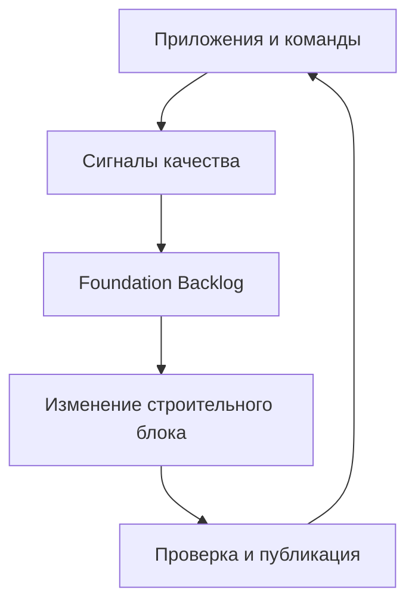
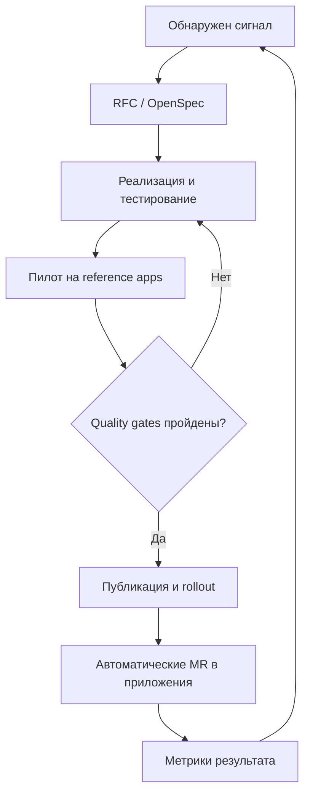
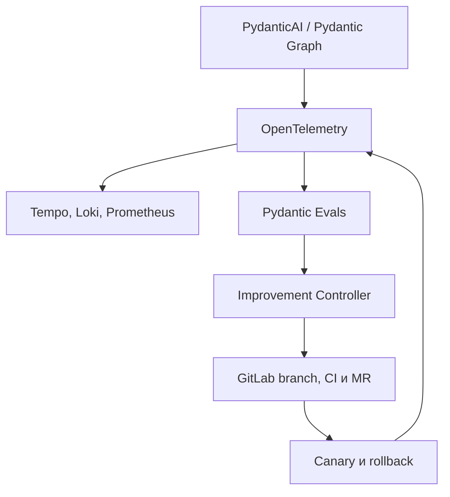
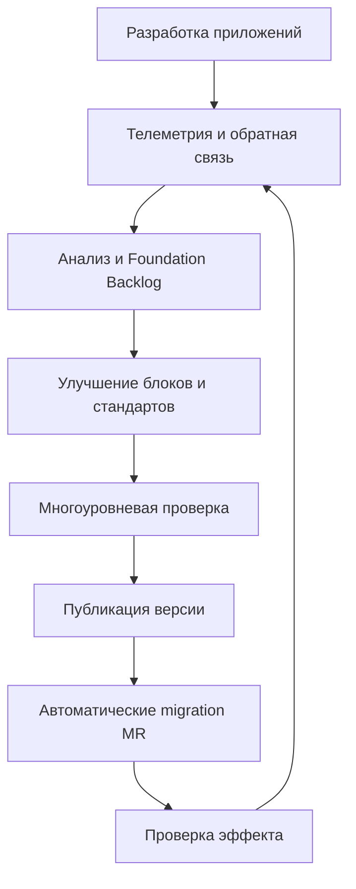
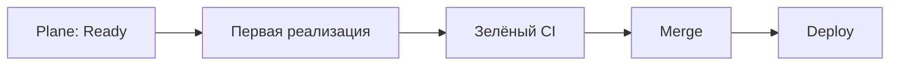
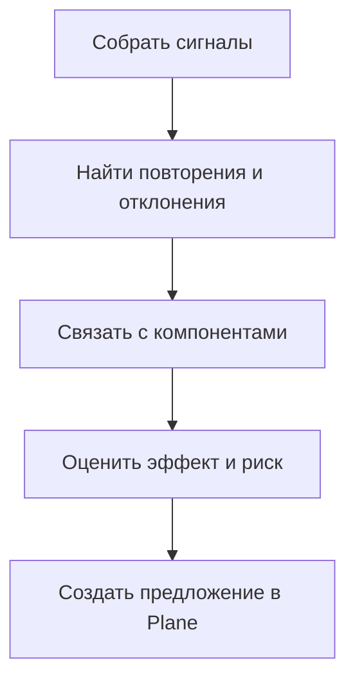
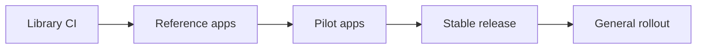
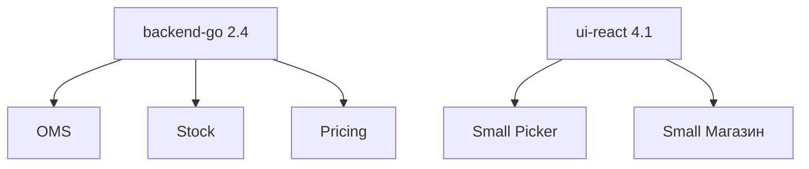
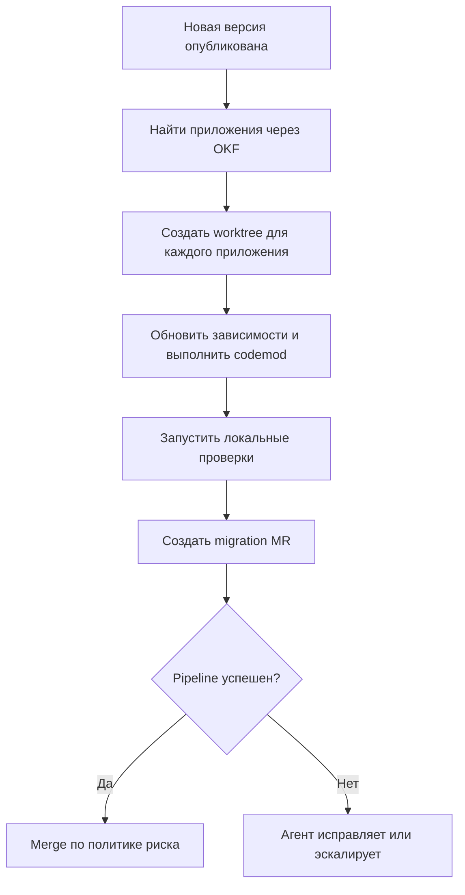
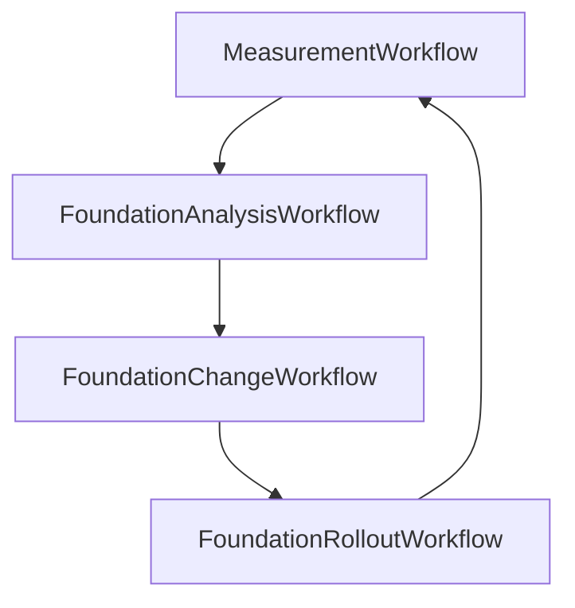

<!--
Источник: Notion — Самосовершенствование
URL: https://app.notion.com/p/3d7db33037c880319b37d5fd10208682
Выгружено: 2026-09-12
-->

# Самосовершенствование

Да — базовых элементов Dark Factory почти достаточно, но сейчас они описывают в основном производство приложений. Для постоянного улучшения UI-компонентов, backend-библиотек и стандартов нужен ещё один явно выделенный контур: **Engineering Foundation / Golden Path Lifecycle**.

Он должен превращать опыт всех создаваемых приложений обратно в улучшенные строительные блоки фабрики.

## Как должен работать цикл улучшения



### 1. Сбор сигналов

Dark Factory должна автоматически получать сигналы из нескольких источников:

<table header-row="true">
<tr>
<td>Источник</td>
<td>Какие сигналы</td>
</tr>
<tr>
<td>CI/CD приложений</td>
<td>ошибки сборки, flaky tests, время pipeline, уязвимости</td>
</tr>
<tr>
<td>Production observability</td>
<td>ошибки, latency, ресурсоёмкость, инциденты</td>
</tr>
<tr>
<td>UI-тестирование</td>
<td>visual regressions, accessibility, UX-проблемы</td>
</tr>
<tr>
<td>Анализ кода</td>
<td>повторяющийся код, отклонения от стандартов</td>
</tr>
<tr>
<td>Pydantic Evals + OpenTelemetry</td>
<td>ошибки агентов, неудачные промпты и skills, траектории вызовов, лишние итерации, стоимость и latency</td>
</tr>
<tr>
<td>Plane</td>
<td>запросы команд, технический долг, предложения</td>
</tr>
<tr>
<td>Разработчики</td>
<td>неудобные API, отсутствующие компоненты</td>
</tr>
<tr>
<td>Архитектурный контроль</td>
<td>повторяющиеся ADR, нарушения инвариантов</td>
</tr>
</table>

Особенно полезен автоматический поиск повторений: если агенты трижды реализовали похожий React-компонент, middleware или интеграционный клиент, фабрика должна предложить вынести его в общий строительный блок.

---

## Три каталога строительных блоков

Я бы разделил Foundation на три продуктовые линии.

### 1. UI Foundation

Содержит:
- дизайн-токены Small;
- React UI Kit на Radix + адаптированном shadcn;
- составные паттерны: формы, таблицы, фильтры, wizard, master-detail;
- типовые экраны: список, карточка, согласование, dashboard;
- accessibility rules;
- responsive- и mobile-паттерны;
- Storybook;
- visual regression tests;
- генераторы интерфейсов;
- UI-скиллы и примеры для агентов.

Важно разделять:
- **primitives** — Button, Input, Dialog;
- **patterns** — форма редактирования, таблица с фильтрами;
- **business blocks** — выбор магазина, сотрудника, SKU, организации;
- **application templates** — готовый административный интерфейс или рабочее место.

Это позволит агенту собирать приложение преимущественно из готовых блоков, а не генерировать CSS и UX заново.

### 2. Backend Foundation

Для каждого поддерживаемого стека — Go, Python/FastAPI и при необходимости TypeScript — нужны:
- application starter;
- конфигурация;
- логирование и OpenTelemetry;
- authentication через Keycloak;
- authorization;
- обработка ошибок;
- health/readiness probes;
- Kafka producer/consumer;
- REST/gRPC clients;
- PostgreSQL migrations;
- idempotency;
- retry, timeout, circuit breaker;
- audit log;
- outbox/inbox;
- тестовые fixtures и Testcontainers;
- Helm chart;
- GitLab CI templates;
- security defaults.

Здесь тоже полезны уровни:

<table header-row="true">
<tr>
<td>Уровень</td>
<td>Пример</td>
</tr>
<tr>
<td>Library</td>
<td>пакет для audit log</td>
</tr>
<tr>
<td>Framework extension</td>
<td>общий FastAPI middleware</td>
</tr>
<tr>
<td>Service template</td>
<td>готовый skeleton микросервиса</td>
</tr>
<tr>
<td>Reference implementation</td>
<td>эталонный сервис целиком</td>
</tr>
<tr>
<td>Deployment template</td>
<td>Helm values и policies</td>
</tr>
</table>

### 3. Engineering Standards

Стандарт не должен существовать только как Markdown. У него должно быть машинно-проверяемое представление:
- policy/rule;
- конфигурация линтера;
- CI gate;
- архитектурный тест;
- шаблон или generator;
- skill для агента;
- хорошие и плохие примеры;
- migration/codemod.

Например, стандарт «все HTTP-вызовы должны иметь timeout» должен присутствовать одновременно:
1. в документации;
2. в backend-библиотеке;
3. в статическом анализаторе;
4. в CI;
5. в skill агента;
6. в эталонном приложении.

Тогда стандарт действительно исполняется, а не просто рекомендуется.

---

## Как задействовать уже выбранные компоненты Dark Factory

<table header-row="true">
<tr>
<td>Компонент</td>
<td>Роль в улучшении Foundation</td>
</tr>
<tr>
<td>Plane</td>
<td>backlog улучшений, RFC, пилоты, rollout</td>
</tr>
<tr>
<td>OpenSpec</td>
<td>спецификация изменения и compatibility requirements</td>
</tr>
<tr>
<td>Spec Kit</td>
<td>clarification, планирование и quality gates</td>
</tr>
<tr>
<td>OKF</td>
<td>связи «стандарт → библиотека → версия → приложение»</td>
</tr>
<tr>
<td>GitLab</td>
<td>исходный код, MR, CI, release, package registry</td>
</tr>
<tr>
<td>PydanticAI</td>
<td>анализ сигналов и подготовка изменений</td>
</tr>
<tr>
<td>GitLab CI + Factory Core</td>
<td>этапы MVP, retries, quality gates, approvals и возобновление запуска; Temporal остаётся возможным развитием для действительно долговременных процессов</td>
</tr>
<tr>
<td>Pydantic Graph</td>
<td>граф фаз, переходов и интеллектуальных шагов внутри запуска</td>
</tr>
<tr>
<td>Pydantic Evals</td>
<td>code-first оценка результатов и траекторий агентов, regression- и holdout-наборы</td>
</tr>
<tr>
<td>OpenTelemetry</td>
<td>нейтральный формат traces, metrics и событий без привязки к observability-вендору</td>
</tr>
<tr>
<td>Arize Phoenix, опционально</td>
<td>специализированный UI для traces, datasets и experiments, если Grafana недостаточно</td>
</tr>
<tr>
<td>Dark Factory Console</td>
<td>scorecards, adoption, версии, исключения</td>
</tr>
<tr>
<td>Kubernetes/Argo CD</td>
<td>проверка эталонных приложений и rollout</td>
</tr>
<tr>
<td>Storybook/Playwright</td>
<td>проверка UI-компонентов и сценариев</td>
</tr>
</table>

Таким образом, новые крупные платформенные компоненты не обязательны. Но существующим компонентам нужно назначить этот процесс явно.

## Чего пока не хватает в архитектуре

### 1. Каталог версий и совместимости

Для каждого блока необходимы:
- owner;
- maturity: experimental / beta / stable / deprecated;
- текущая версия;
- поддерживаемые версии;
- зависимости;
- compatibility matrix;
- список использующих приложений;
- дата окончания поддержки;
- migration guide.

Это можно хранить в Git, отражать в OKF и показывать в Dark Factory Console. Backstage для этого необязателен.

### 2. Foundation Scorecards

Необходимо оценивать не только приложения, но и сами строительные блоки:
- adoption;
- количество приложений;
- defect rate;
- accessibility coverage;
- test coverage;
- bundle size;
- latency overhead;
- security findings;
- частота ручных обходов;
- скорость миграции;
- удовлетворённость разработчиков;
- успешность использования агентами.

Популярность сама по себе не означает качество: блок может широко использоваться только потому, что встроен в шаблон.

### 3. Управляемые обновления

После публикации новой версии фабрика должна:
1. определить затронутые приложения через OKF;
2. сформировать migration plan;
3. запустить codemod;
4. создать отдельные worktrees;
5. обновить зависимости;
6. прогнать тесты;
7. создать MR;
8. собрать результаты;
9. эскалировать несовместимости человеку.

Без этого библиотеки будут улучшаться, но приложения останутся на старых версиях.

### 4. Эталонные приложения

Одних unit-тестов библиотек недостаточно. Нужны небольшие reference applications:
- React application;
- Go service;
- FastAPI service;
- full-stack reference application;
- приложение с Kafka;
- приложение с Keycloak;
- UI-heavy приложение.

Новая версия Foundation проверяется сначала на них, затем на нескольких pilot-приложениях и только потом становится версией по умолчанию.

---

## Целевой workflow изменения



Для изменений разного риска нужен разный контроль:

<table header-row="true">
<tr>
<td>Изменение</td>
<td>Управление</td>
</tr>
<tr>
<td>Patch, исправление бага</td>
<td>автоматическая проверка и публикация</td>
</tr>
<tr>
<td>Новая обратно совместимая функция</td>
<td>review владельца Foundation</td>
</tr>
<tr>
<td>Breaking change</td>
<td>RFC, migration tooling, пилот</td>
</tr>
<tr>
<td>Новый UX-паттерн</td>
<td>review UI/UX owner и accessibility</td>
</tr>
<tr>
<td>Изменение архитектурного стандарта</td>
<td>ADR и одобрение архитектуры</td>
</tr>
<tr>
<td>Security fix</td>
<td>ускоренный обязательный rollout</td>
</tr>
</table>

## Роли человека и агентов

Агенты могут:
- искать дублирование;
- анализировать инциденты;
- предлагать новые компоненты;
- генерировать тесты;
- обновлять документацию и skills;
- строить codemods;
- создавать migration MR;
- измерять эффект.

Человек должен контролировать:
- включение блока в Golden Path;
- UX-решения;
- breaking changes;
- архитектурные инварианты;
- security-critical решения;
- сроки deprecation;
- исключения для приложений.

Foundation нельзя позволять самоизменяться и автоматически становиться обязательной только по решению агента.

## Технологическое решение для самоулучшения

**Решение для MVP:** не делать Langfuse обязательной зависимостью. Learning loop реализуется в Factory Core и остаётся независимым от UI наблюдаемости.



<table header-row="true">
<tr>
<td>Компонент</td>
<td>Назначение</td>
</tr>
<tr>
<td>Pydantic Evals</td>
<td>Детерминированные проверки, LLM-as-a-judge, оценка траекторий, regression- и holdout-наборы</td>
</tr>
<tr>
<td>OpenTelemetry</td>
<td>Нейтральная схема traces, metrics и событий GenAI</td>
</tr>
<tr>
<td>Grafana / Tempo / Loki / Prometheus</td>
<td>Базовая эксплуатационная наблюдаемость без отдельной LLM-платформы</td>
</tr>
<tr>
<td>Improvement Controller</td>
<td>Диагностика причин, генерация кандидатов, эксперименты и выбор улучшения</td>
</tr>
<tr>
<td>GitLab</td>
<td>Версионирование agents, skills, prompts, workflows и кода; CI gates, MR и rollback</td>
</tr>
<tr>
<td>Arize Phoenix</td>
<td>Опциональный self-hosted UI для traces, datasets и сравнения experiments</td>
</tr>
</table>

### Альтернативы

<table header-row="true">
<tr>
<td>Вариант</td>
<td>Когда применять</td>
</tr>
<tr>
<td>Arize Phoenix</td>
<td>Если нужен лёгкий специализированный UI поверх OpenTelemetry</td>
</tr>
<tr>
<td>OpenLIT</td>
<td>Если нужен готовый self-hosted комплекс observability, evals, prompts и cost tracking</td>
</tr>
<tr>
<td>MLflow 3 GenAI</td>
<td>Позднее — для registry, масштабных experiments и автоматической оптимизации prompts через GEPA/metaprompting</td>
</tr>
<tr>
<td>Promptfoo</td>
<td>Как дополнительный CLI/CI gate для prompt regression и red teaming</td>
</tr>
<tr>
<td>Logfire</td>
<td>Для быстрого PydanticAI-прототипа, если допустим внешний сервис</td>
</tr>
</table>

### Контроль самоизменения

Фабрика не изменяет работающую версию напрямую. Improvement Controller:
1. превращает подтверждённый сбой в regression case;
2. диагностирует системную причину;
3. создаёт один или несколько кандидатов изменения;
4. запускает baseline и кандидатов в одинаковой изоляции;
5. проверяет закрытый holdout-набор, безопасность, стоимость и latency;
6. создаёт MR только при доказанном улучшении;
7. после merge выполняет canary и автоматически откатывает деградацию.

Агент, изменяющий реализацию, не может одновременно менять защищённый holdout-набор или ослаблять обязательные evaluators. Новые тесты и learnings допускают автоматический merge; изменения prompts, skills и routing — только в пределах политики; workflow, Factory Core, IAM, security rules и архитектурные инварианты требуют независимого approval.

## Рекомендуемая структура репозиториев

```plain text
foundation/
  ui-tokens
  ui-react
  ui-patterns
  backend-go
  backend-python
  service-templates
  helm-charts
  ci-templates
  engineering-standards
  architecture-tests
  reference-apps
  agent-skills
  migrations-codemods
```

Это могут быть отдельные репозитории в одной GitLab-группе. Не стоит складывать всё в репозиторий оркестратора Dark Factory.

## Итог

Заложенного стека **достаточно как технологической основы**, поэтому добавлять ещё одну большую платформу не требуется. Но архитектура будет неполной без четырёх возможностей:
1. отдельного Foundation backlog и владельцев;
2. каталога блоков, версий и зависимых приложений;
3. измеримых scorecards качества;
4. автоматизированного rollout через codemods и migration MR.

Главный принцип: Dark Factory должна не просто использовать Golden Path, а **измерять его эффективность, улучшать его и автоматически переносить улучшения во все приложения**. Именно это превращает набор UI Kit, библиотек и стандартов в самообучающуюся инженерную платформу.

---

Ниже — целевой замкнутый процесс: Dark Factory измеряет создание и эксплуатацию приложений, выявляет повторяющиеся проблемы, улучшает Golden Path, проверяет новую версию и автоматически переносит её в существующие приложения через MR.



# 1. Регистрация всех строительных блоков

Сначала каждый компонент, библиотека, шаблон или стандарт должен стать управляемым объектом.

Пример метаданных:

```yaml
id: backend-go/http-client
type: library
owner: platform-foundation
version: 2.4.0
maturity: stable

runtime:
  language: go
  min_version: "1.25"

compatibility:
  service_template: ">=3.0"
  opentelemetry: ">=1.35"

quality:
  unit_coverage_min: 85
  vulnerabilities_allowed: 0
  p95_overhead_ms: 5

rollout:
  strategy: automatic-mr
  rings:
    - reference
    - pilot
    - general

deprecated_versions:
  - version: "1.x"
    end_of_support: 2026-12-31
```

## Где что хранится

<table header-row="true">
<tr>
<td>Информация</td>
<td>Инструмент</td>
</tr>
<tr>
<td>Код библиотек и компонентов</td>
<td>GitLab</td>
</tr>
<tr>
<td>Пакеты npm, Go, Python</td>
<td>GitLab Package Registry или Nexus</td>
</tr>
<tr>
<td>Container images</td>
<td>Harbor</td>
</tr>
<tr>
<td>Спецификация изменения</td>
<td>OpenSpec</td>
</tr>
<tr>
<td>Архитектурные решения</td>
<td>ADR в Git</td>
</tr>
<tr>
<td>Зависимости между блоками и приложениями</td>
<td>OKF</td>
</tr>
<tr>
<td>Задачи и инициативы</td>
<td>Plane</td>
</tr>
<tr>
<td>Статусы rollout</td>
<td>Dark Factory Console</td>
</tr>
<tr>
<td>Поведение AI-агентов</td>
<td>Pydantic Evals + OpenTelemetry; Phoenix — опциональный UI</td>
</tr>
<tr>
<td>Runtime-метрики</td>
<td>OpenTelemetry, Prometheus, Grafana</td>
</tr>
<tr>
<td>Ошибки</td>
<td>Sentry и централизованные логи</td>
</tr>
</table>

Все приложения должны иметь машиночитаемый manifest:

```yaml
application:
  id: small-inventory
  template: backend-go-service@3.2.0

foundation:
  backend-go: 2.4.0
  react-ui: 4.1.0
  helm-service: 3.0.2
  gitlab-ci: 2.7.0
  engineering-rules: 5.3.0
```

Эти сведения автоматически загружаются в OKF. Благодаря этому фабрика понимает, какие приложения затронет изменение.

---

# 2. Измерение эффективности разработки

Измерять нужно не только production-качество, но весь путь от постановки задачи до работающего изменения.

## Основные этапы



Для каждого изменения фабрика записывает события:

```plain text
change_requested
spec_approved
workspace_created
implementation_started
first_build_passed
review_started
rework_requested
merged
deployed
verified
```

Источники событий:
- Plane — постановка задачи и изменение статусов;
- GitLab CI — стадии процесса, retries, approvals, pipelines и merge requests;
- Factory Core / Pydantic Graph — переходы между фазами и траектория работы агентов;
- Argo CD — deployment status;
- Pydantic Evals — offline/online оценки и результаты экспериментов;
- OpenTelemetry — техническая и GenAI-телеметрия;
- Prometheus/Grafana — агрегированные метрики.

## Метрики скорости

<table header-row="true">
<tr>
<td>Метрика</td>
<td>Что показывает</td>
</tr>
<tr>
<td>Lead time</td>
<td>От постановки задачи до production</td>
</tr>
<tr>
<td>Coding time</td>
<td>Время непосредственной реализации</td>
</tr>
<tr>
<td>Time to first green build</td>
<td>Насколько хорошо работают шаблоны и агенты</td>
</tr>
<tr>
<td>Review time</td>
<td>Скорость проверки</td>
</tr>
<tr>
<td>Rework rate</td>
<td>Сколько изменений возвращается на доработку</td>
</tr>
<tr>
<td>Deployment frequency</td>
<td>Частота поставки</td>
</tr>
<tr>
<td>Change failure rate</td>
<td>Доля неудачных изменений</td>
</tr>
<tr>
<td>Rollback rate</td>
<td>Стабильность релизов</td>
</tr>
<tr>
<td>Mean recovery time</td>
<td>Скорость восстановления</td>
</tr>
<tr>
<td>Agent iterations</td>
<td>Сколько попыток требуется агенту</td>
</tr>
<tr>
<td>Human intervention time</td>
<td>Сколько человеческого времени потребовало изменение</td>
</tr>
</table>

## Метрики использования Golden Path

Для каждого приложения рассчитывается Foundation Score:

<table header-row="true">
<tr>
<td>Проверка</td>
<td>Пример</td>
</tr>
<tr>
<td>Актуальность UI Kit</td>
<td>Используется поддерживаемая версия</td>
</tr>
<tr>
<td>Актуальность backend foundation</td>
<td>Нет deprecated-библиотек</td>
</tr>
<tr>
<td>CI-стандарт</td>
<td>Используется актуальный шаблон</td>
</tr>
<tr>
<td>Observability</td>
<td>Есть traces, logs, metrics</td>
</tr>
<tr>
<td>Security</td>
<td>Нет критических уязвимостей</td>
</tr>
<tr>
<td>Architecture compliance</td>
<td>Пройдены architecture tests</td>
</tr>
<tr>
<td>Deployment</td>
<td>Используется стандартный Helm chart</td>
</tr>
<tr>
<td>Documentation</td>
<td>Manifest и OpenAPI актуальны</td>
</tr>
<tr>
<td>AI readiness</td>
<td>Актуальны rules и skills</td>
</tr>
</table>

Пример:

```plain text
Small Inventory: 91/100
Small Picker:    84/100
Small Team:      73/100
```

Score не должен становиться самоцелью. Рядом показываются конкретные отклонения и стоимость исправления.

---

# 3. Сбор обратной связи о строительных блоках

Dark Factory получает сигналы четырёх типов.

## 3.1. Сигналы разработки

- агенты постоянно обходят существующую библиотеку;
- одинаковый код появился в нескольких приложениях;
- приложение добавляет собственный HTTP client или error handler;
- разработчик отключает линтер или CI gate;
- одна и та же проблема возникает в review;
- миграция требует много ручной работы;
- сборка заметно замедлилась.

## 3.2. UI-сигналы

- компонент часто переопределяется через CSS;
- один UX-сценарий реализован несколькими способами;
- visual regression;
- нарушение WCAG;
- ошибки в мобильном разрешении;
- увеличение bundle size;
- низкая успешность пользовательского сценария;
- пользователи возвращаются назад или бросают форму.

Инструменты:
- Storybook;
- Playwright;
- visual regression;
- axe-core;
- Lighthouse;
- продуктовая аналитика;
- Sentry Session Replay — если допустимо политикой безопасности.

## 3.3. Backend-сигналы

- повторяющиеся timeout или retry errors;
- некорректная обработка Kafka;
- потеря trace context;
- отсутствие idempotency;
- рост latency после обновления;
- одинаковые incident root causes;
- расхождение API-реализации с OpenAPI.

Инструменты:
- OpenTelemetry;
- Prometheus/Grafana;
- Sentry;
- OpenAPI linting;
- contract tests;
- Testcontainers;
- нагрузочные тесты;
- архитектурные тесты.

## 3.4. Сигналы AI-агентов

OpenTelemetry фиксирует нейтральную трассу запуска, а Pydantic Evals оценивает результат и путь его получения:
- какие версии agents, skills, prompts и workflow использованы;
- на каких задачах агент терпит неудачу;
- какие tools вызваны и в какой последовательности;
- сколько итераций и rework-циклов требуется;
- какие инструкции и архитектурные правила нарушаются;
- какие строительные блоки агент не может правильно применить;
- где расходуется слишком много токенов, времени или вызовов модели;
- какие результаты отклоняет человек или независимый Quality Agent.

Eval-наборы и критерии хранятся в Git рядом с кодом фабрики. Результаты сохраняются как артефакты GitLab и агрегированные метрики. Для MVP достаточно Grafana/Tempo/Loki; Arize Phoenix можно подключить позднее как сменный специализированный UI. Observability показывает, что произошло, но решение об улучшении принимает отдельный Improvement Controller на основании evals и quality gates.

---

# 4. Автоматический поиск кандидатов на улучшение

Периодически запускается `FoundationAnalysisWorkflow`.



## Что делает workflow

1. Получает метрики за период.
2. Находит повторяющиеся проблемы.
3. Ищет связанные приложения через OKF.
4. Проверяет существующие задачи Plane.
5. Определяет проблемный building block.
6. Формирует гипотезу улучшения.
7. Оценивает потенциальный эффект.
8. Создаёт Foundation Issue или RFC.

Пример автоматически созданного предложения:

```yaml
problem:
  type: duplicated-implementation
  description: HTTP retry logic duplicated in 7 Go services

affected_apps:
  - oms
  - stock
  - pricing
  - loyalty
  - notification
  - delivery
  - payment

proposal:
  target: backend-go/http-client
  change: add standardized retry policy

expected_effect:
  duplicated_code_reduction: 850_lines
  incidents_prevented_per_quarter: 3
  migration_effort_hours: 6

risk: medium
```

AI может подготовить предложение, но не должен самостоятельно менять обязательный Golden Path.

---

# 5. Приоритизация улучшения

В Plane создаётся отдельный проект `Engineering Foundation`.

У инициативы должны быть:
- проблема;
- подтверждающие метрики;
- затронутые приложения;
- ожидаемый эффект;
- стоимость реализации;
- стоимость миграции;
- риск совместимости;
- владелец;
- критерии успеха.

Приоритет можно рассчитывать так:

Priority = (AffectedApps × Frequency × Severity × ExpectedGain) / (ImplementationCost + MigrationCost + Risk)

Например, улучшение формы, используемой в 15 приложениях, обычно полезнее локальной оптимизации одного экрана.

---

# 6. Формирование OpenSpec изменения

Для принятого улучшения запускается `FoundationChangeWorkflow`.

OpenSpec описывает:
- проблему;
- новое поведение;
- публичный API;
- UX-инварианты;
- обратную совместимость;
- критерии приёмки;
- план миграции;
- план rollback;
- telemetry changes;
- affected applications.

Пример для UI:

```plain text
Change:
Добавить стандартный AsyncSelect для выбора магазина.

Acceptance criteria:
- поиск начинается после 2 символов;
- debounce 300 ms;
- поддерживается keyboard navigation;
- состояние загрузки обязательно;
- ошибки отображаются через стандартный pattern;
- WCAG AA;
- mobile width поддерживается;
- visual regression baseline создан.
```

После этого Spec Kit выполняет:
- clarification;
- проверку полноты;
- architecture checklist;
- cross-artifact analysis;
- построение implementation plan.

---

# 7. Разработка улучшения

Factory Core, запускаемый из GitLab CI, создаёт изолированный запуск; Pydantic Graph управляет фазами и переходами внутри него:
1. Создаёт Git worktree.
2. Создаёт branch.
3. Передаёт OpenSpec агенту.
4. Загружает соответствующие skills.
5. Агент изменяет библиотеку.
6. Обновляет тесты.
7. Обновляет документацию.
8. Обновляет примеры.
9. Создаёт codemod или migration tool.
10. Создаёт MR.

Пример состава изменения UI-компонента:

```plain text
ui-react/
  src/components/async-select/
  tests/
  stories/
  visual-baselines/
  docs/
  migrations/
  skills/
```

Изменение считается неполным, если обновлён компонент, но не обновлены:
- documentation;
- Storybook;
- tests;
- agent skill;
- migration;
- metadata;
- changelog.

---

# 8. Многоуровневая проверка

Обновление проходит несколько колец.

## Кольцо 1. Проверка самого блока

Для UI:
- unit tests;
- Storybook interaction tests;
- Playwright;
- visual regression;
- axe accessibility;
- bundle-size limit;
- API compatibility.

Для backend:
- unit tests;
- integration tests;
- Testcontainers;
- contract tests;
- race detection;
- static analysis;
- dependency/security scan;
- benchmarks;
- load-test snapshot.

## Кольцо 2. Reference applications

Новая версия подключается к эталонным приложениям:
- `reference-react-app`;
- `reference-go-service`;
- `reference-fastapi-service`;
- `reference-fullstack-app`;
- `reference-kafka-service`.

Это проверяет компонент в реалистичной комбинации зависимостей.

## Кольцо 3. Pilot applications

OKF выбирает 2–3 приложения:
- одно простое;
- одно типовое;
- одно сложное или высоконагруженное.

Обновление устанавливается через MR, а не напрямую.

## Кольцо 4. General availability

После успешного пилота версия получает статус `stable` и становится default для новых приложений.



---

# 9. Публикация новой версии

После прохождения quality gates GitLab CI:
1. рассчитывает SemVer;
2. формирует changelog;
3. подписывает артефакт;
4. публикует пакет;
5. обновляет metadata;
6. обновляет OKF;
7. публикует документацию;
8. обновляет default version в шаблонах;
9. объявляет migration campaign.

Пример:

```plain text
@small/ui-react 4.2.0
small-backend-go 2.5.0
small-service-template 3.3.0
small-engineering-rules 5.4.0
```

Новые приложения сразу создаются на новых стабильных версиях.

---

# 10. Определение затронутых приложений

OKF хранит граф:



После выхода версии система выполняет запрос:

```plain text
Какие приложения:
- используют backend-go < 2.5;
- поддерживаются;
- не имеют migration exception;
- имеют владельца;
- находятся на активной версии service template?
```

Результат превращается в rollout plan.

---

# 11. Автоматический перенос улучшений

Перенос выполняет `FoundationRolloutWorkflow`.



## Инструменты переноса

<table header-row="true">
<tr>
<td>Тип изменения</td>
<td>Механизм</td>
</tr>
<tr>
<td>npm dependency</td>
<td>Renovate или собственный update bot</td>
</tr>
<tr>
<td>Python dependency</td>
<td>Renovate + lock-file update</td>
</tr>
<tr>
<td>Go module</td>
<td>`go get`, `go mod tidy`, update bot</td>
</tr>
<tr>
<td>React API</td>
<td>jscodeshift/ts-morph codemod</td>
</tr>
<tr>
<td>Python API</td>
<td>LibCST codemod</td>
</tr>
<tr>
<td>Go API</td>
<td>AST-based migration tool</td>
</tr>
<tr>
<td>Helm values</td>
<td>YAML migration</td>
</tr>
<tr>
<td>CI template</td>
<td>versioned `include` и update MR</td>
</tr>
<tr>
<td>Standards</td>
<td>линтер autofix или agent migration</td>
</tr>
<tr>
<td>Структура проекта</td>
<td>template migration scripts</td>
</tr>
</table>

Обычное обновление зависимости без codemod недостаточно: фабрика должна уметь изменять использующий библиотеку код.

## Содержимое migration MR

```markdown
Upgrade: @small/ui-react 4.1.0 → 4.2.0

Причина:
- исправлена доступность AsyncSelect;
- унифицировано отображение ошибок.

Автоматические изменения:
- заменён LegacyStoreSelect;
- обновлены imports;
- добавлены accessibility attributes.

Проверки:
- TypeScript: passed
- Unit tests: passed
- Playwright: passed
- Visual regression: passed
- Accessibility: passed

Ожидаемый эффект:
- устранение 3 accessibility violations;
- удаление 126 строк локальной реализации.

Rollback:
- revert MR и восстановление версии 4.1.0.
```

---

# 12. Политики автоматического merge

Не все улучшения должны переноситься одинаково.

<table header-row="true">
<tr>
<td>Риск</td>
<td>Пример</td>
<td>Merge</td>
</tr>
<tr>
<td>Низкий</td>
<td>patch dependency, CI fix</td>
<td>Автоматический</td>
</tr>
<tr>
<td>Средний</td>
<td>новый совместимый компонент</td>
<td>MR + owner approval</td>
</tr>
<tr>
<td>Высокий</td>
<td>изменение UX или runtime behavior</td>
<td>Pilot + ручное approval</td>
</tr>
<tr>
<td>Критический</td>
<td>breaking API</td>
<td>Отдельная migration campaign</td>
</tr>
<tr>
<td>Security emergency</td>
<td>критическая уязвимость</td>
<td>Ускоренный rollout с контролем</td>
</tr>
</table>

Автоматический merge разрешается только если:
- change обратно совместим;
- pipeline зелёный;
- visual diff допустим;
- architecture tests пройдены;
- нет изменения бизнес-логики;
- приложение не имеет исключения;
- rollback проверен.

---

# 13. Измерение результата после обновления

После merge и deploy начинается период наблюдения.

Сравниваются значения до и после изменения:

<table header-row="true">
<tr>
<td>Область</td>
<td>До/после</td>
</tr>
<tr>
<td>Время разработки</td>
<td>Сколько занимал аналогичный сценарий</td>
</tr>
<tr>
<td>Agent iterations</td>
<td>Число попыток агента</td>
</tr>
<tr>
<td>Rework rate</td>
<td>Возвраты с review</td>
</tr>
<tr>
<td>Дефекты</td>
<td>Количество ошибок</td>
</tr>
<tr>
<td>Производительность</td>
<td>Latency, CPU, bundle size</td>
</tr>
<tr>
<td>UX</td>
<td>Успешность сценария</td>
</tr>
<tr>
<td>Стандартизация</td>
<td>Объём локальных обходов</td>
</tr>
<tr>
<td>Adoption</td>
<td>Доля приложений на новой версии</td>
</tr>
<tr>
<td>Миграция</td>
<td>Время и число ручных исправлений</td>
</tr>
</table>

Например:

```yaml
improvement: standardized-store-selector
before:
  median_implementation_hours: 14
  agent_iterations: 6.2
  accessibility_defects: 1.8
  duplicated_code_lines: 4200

after:
  median_implementation_hours: 3
  agent_iterations: 2.1
  accessibility_defects: 0.2
  duplicated_code_lines: 600
```

Если ожидаемый эффект не получен, версия:
- не продвигается дальше;
- откатывается;
- возвращается на доработку;
- либо корректируется сам стандарт.

---

# 14. Как улучшается работа AI-агентов

Изменение строительного блока должно сопровождаться обновлением agent-facing артефактов:
- skill;
- примеров использования;
- запрещённых anti-patterns;
- API metadata;
- reference implementation;
- тестовых сценариев;
- prompt evaluations.

Для каждого skill создаётся набор eval-задач:

```plain text
1. Создать форму сотрудника.
2. Создать таблицу магазинов.
3. Добавить авторизацию в Go-сервис.
4. Создать Kafka consumer с idempotency.
5. Добавить аудит изменения документа.
```

Сравнивается:
- процент успешных реализаций;
- число итераций;
- токены;
- время;
- количество ручных исправлений;
- соблюдение стандартов;
- прохождение тестов с первой попытки.

Новая версия skill публикуется только тогда, когда она улучшает результаты на eval-наборе и не создаёт регрессий.

---

# 15. Контур learning loop верхнего уровня

В MVP нужны четыре связанных процесса, но отдельный Temporal-кластер для них не обязателен.



### `MeasurementWorkflow`

Собирает OpenTelemetry-события, результаты Pydantic Evals, вычисляет метрики и обновляет scorecards.

### `FoundationAnalysisWorkflow`

Ищет повторения, деградации и пробелы, группирует причины и формирует backlog улучшений.

### `FoundationChangeWorkflow`

Проводит изменение через OpenSpec, реализацию, regression/holdout evals, тестирование и пилот.

### `FoundationRolloutWorkflow`

Находит приложения, создаёт migration MR, контролирует rollout и измеряет эффект.

В MVP GitLab CI отвечает за стадии, зависимости, retries, manual gates и расписание; Factory Core и Pydantic Graph — за интеллектуальные шаги и переходы внутри запуска; состояние эксперимента хранится в GitLab/PostgreSQL. Temporal добавляется позже только если появятся процессы, которые длятся дни или недели, ожидают внешние события и требуют durable execution независимо от pipeline.

# 16. Минимальная последовательность внедрения

Не нужно строить весь механизм сразу.

## Этап 1. Управляемые версии

- выделить Foundation-репозитории;
- добавить владельцев;
- ввести SemVer;
- описать application manifest;
- начать собирать зависимости в OKF.

## Этап 2. Quality gates

- reference applications;
- UI visual tests;
- backend integration tests;
- architecture tests;
- security checks;
- единые CI templates.

## Этап 3. Автоматические обновления

- Renovate/update bot;
- migration MR;
- codemods;
- автоматическое обновление документации и OKF.

## Этап 4. Измерение эффективности

- события SDLC;
- Grafana dashboards;
- Foundation Score;
- Pydantic Evals и regression/holdout datasets;
- сравнение до/после.

## Этап 5. Самоулучшение

- поиск дублирования;
- автоматические Foundation proposals;
- выбор pilot-приложений;
- управляемый rollout;
- проверка реального эффекта.

# Главный практический результат

Для каждого улучшения Dark Factory должна уметь ответить на пять вопросов:
1. **Почему оно требуется?** — подтверждается метриками и повторяющимися проблемами.
2. **Что именно изменяется?** — зафиксировано в OpenSpec.
3. **Безопасно ли изменение?** — проверено библиотекой, reference и pilot-приложениями.
4. **Какие приложения затронуты?** — определяется через OKF.
5. **Стало ли действительно лучше?** — подтверждается сравнением метрик до и после.

Целевой процесс выглядит так:

> сигнал → гипотеза → OpenSpec → изменение Foundation → проверка → стабильная версия → codemod → migration MR → rollout → измерение эффекта.

Именно migration tooling, граф зависимостей и проверка эффекта замыкают цикл. Без них Dark Factory сможет выпускать новые версии строительных блоков, но не сможет системно распространять улучшения по ландшафту.
