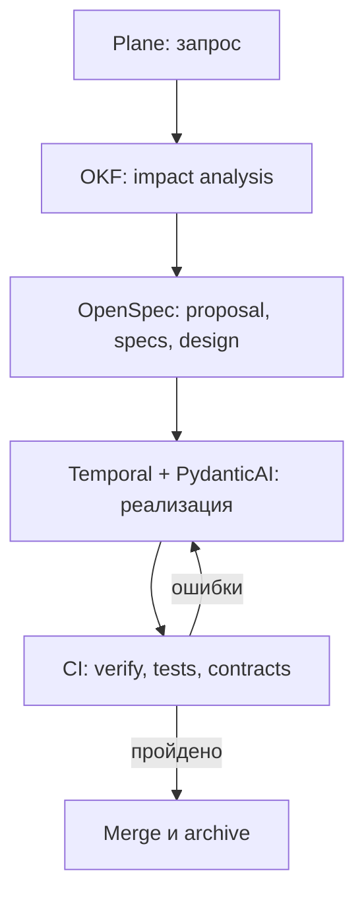

<!--
Источник: Notion — Spec-Driven Development
URL: https://app.notion.com/p/3d4db33037c8807eb434dccb1fea0e10
Выгружено: 2026-09-12
-->

# Spec-Driven Development

Да — для Dark Factory нужен слой Spec-Driven Development. Без него агенты будут реализовывать задачи по контексту чата и тикета, а результат станет нестабильным и плохо воспроизводимым.

Но использовать одновременно полный Spec Kit и полный OpenSpec не стоит. Для вашей архитектуры я бы выбрал:

> **OpenSpec как основной формат жизненного цикла изменений + наиболее полезные quality gates из Spec Kit, встроенные в оркестратор.**

## Почему OpenSpec лучше подходит вашей Dark Factory

Dark Factory в основном будет не создавать системы с нуля, а непрерывно вносить изменения в существующие репозитории. OpenSpec как раз строится вокруг изменения:

```plain text
proposal → requirements → design → tasks → implementation → verification → archive
```

Каждое изменение получает отдельный каталог с `proposal.md`, спецификациями, дизайном и задачами. После реализации оно архивируется, а актуальные спецификации обновляются. Это хорошо сочетается с trunk-based development и короткоживущими worktree. [Официальный workflow OpenSpec](https://github.com/Fission-AI/OpenSpec)

Spec Kit предлагает более полный и строгий конвейер:

```plain text
constitution → specify → clarify → plan → tasks
             → analyze → implement → converge
```

Он особенно силён в первоначальной проработке нового продукта: формирует проектные принципы, уточняет неоднозначности, проверяет согласованность артефактов и сравнивает реализацию со спецификацией. [Официальный workflow Spec Kit](https://github.com/github/spec-kit)

<table header-row="true">
<tr>
<td>Критерий</td>
<td>OpenSpec</td>
<td>Spec Kit</td>
</tr>
<tr>
<td>Основной сценарий</td>
<td>Непрерывные изменения</td>
<td>Полная проработка фичи или нового продукта</td>
</tr>
<tr>
<td>Процесс</td>
<td>Лёгкий, change-oriented</td>
<td>Более строгий и пошаговый</td>
</tr>
<tr>
<td>Brownfield-разработка</td>
<td>Отлично</td>
<td>Хорошо, но тяжелее</td>
</tr>
<tr>
<td>Greenfield</td>
<td>Хорошо</td>
<td>Отлично</td>
</tr>
<tr>
<td>Управление изменениями</td>
<td>Proposal и архив изменений</td>
<td>Спецификация, план и задачи</td>
</tr>
<tr>
<td>Quality gates</td>
<td>Базовые, есть `verify`</td>
<td>Сильные `clarify`, `analyze`, `checklist`, `converge`</td>
</tr>
<tr>
<td>Соответствие вашей фабрике</td>
<td>Основной вариант</td>
<td>Источник усиленных проверок</td>
</tr>
</table>

Spec Kit официально поддерживает проверки неоднозначностей, межартефактной согласованности и полноты требований через `clarify`, `analyze` и `checklist`; `converge` сопоставляет код со спецификацией, планом и задачами. [Команды Spec Kit](https://github.com/github/spec-kit/blob/main/README.md?plain=1)

## Что конкретно это даст фабрике

### 1. Стабильный контракт между человеком и агентами

Спецификация переживает:
- смену модели;
- очистку контекста;
- перезапуск Temporal workflow;
- передачу задачи другому агенту;
- параллельную работу в нескольких worktree.

Агент получает не переписку, а зафиксированный контракт: что меняется, почему, какие сценарии должны работать и как проверить результат.

### 2. Контроль до начала генерации кода

Фабрика сначала создаёт proposal, requirements и design, и только затем получает разрешение на реализацию.

Это позволяет человеку контролировать именно важные решения:
- изменение бизнес-правил;
- публичные API и события Kafka;
- модель данных;
- безопасность;
- межсистемные зависимости;
- инфраструктурные изменения.

### 3. Проверяемые quality gates

Перед реализацией оркестратор может автоматически проверять:
- отсутствующие acceptance criteria;
- противоречия между требованиями и design;
- нарушение архитектурных инвариантов;
- неописанные миграции;
- несовместимые API/AsyncAPI-контракты;
- отсутствие тестовых сценариев;
- расхождение реализации и спецификации.

Именно здесь стоит использовать подходы Spec Kit `clarify`, `analyze`, `checklist` и `converge`, не обязательно устанавливая второй параллельный workflow.

### 4. Координация нескольких агентов

Спецификация разбивает работу по стабильным идентификаторам требований и задач. Тогда:
- аналитик формирует требования;
- архитектор проверяет design;
- coding agents реализуют независимые задачи;
- test agent строит проверки из сценариев;
- review agent ищет расхождения;
- Temporal управляет состоянием и повторными запусками.

### 5. Аудит и наблюдаемость

По каждому изменению можно восстановить цепочку:

```plain text
Plane issue
  → OpenSpec change
  → требования
  → архитектурное решение
  → задачи агентов
  → коммиты и MR
  → тесты
  → обновлённая спецификация
```

Plane показывает состояние работ, но не заменяет спецификацию. Plane отвечает на вопрос «где находится работа», OpenSpec — «что именно должно измениться».

## Как это соотносится с OKF

OKF и OpenSpec не дублируют друг друга.

<table header-row="true">
<tr>
<td>Слой</td>
<td>Источник истины</td>
</tr>
<tr>
<td>Бизнес-контекст, capabilities, системы, команды</td>
<td>OKF</td>
</tr>
<tr>
<td>Межсистемные зависимости и impact analysis</td>
<td>OKF</td>
</tr>
<tr>
<td>Архитектурные принципы, стандарты, tech radar</td>
<td>OKF / architecture repository</td>
</tr>
<tr>
<td>Текущее поведение конкретного компонента</td>
<td>OpenSpec `specs/`</td>
</tr>
<tr>
<td>Предлагаемое изменение</td>
<td>OpenSpec `changes/<change-id>/`</td>
</tr>
<tr>
<td>Исполнение и прогресс</td>
<td>Plane</td>
</tr>
<tr>
<td>Долгоживущий workflow</td>
<td>Temporal</td>
</tr>
<tr>
<td>Работа LLM и инструментов</td>
<td>PydanticAI</td>
</tr>
<tr>
<td>Код, MR и CI</td>
<td>GitLab</td>
</tr>
</table>

Связь должна осуществляться через идентификаторы:

```yaml
change_id: CHG-2026-0142
plane_issue: DF-381
component_id: inventory-service
capability_id: store.document-management
affected_components:
  - integration-service
  - astor-adapter
adrs:
  - ADR-0047
```

## Рекомендуемый flow



Для разных изменений нужна разная строгость:
- **Мелкий безопасный fix:** issue → тест воспроизведения → исправление → проверка.
- **Обычная feature:** полный OpenSpec change.
- **Cross-system/high-risk:** OpenSpec + OKF impact analysis + ADR + ручное одобрение design.
- **Новый продукт:** усиленный процесс Spec Kit либо OpenSpec с добавленными этапами constitution, clarification и architecture checklist.

## Итог

Для вашей Dark Factory:
1. **OpenSpec — основной стандарт изменений в каждой продуктовой репе.**
2. **Не устанавливать два параллельных SDD-процесса.**
3. Из Spec Kit перенести в фабричный workflow:
    - constitution/invariants;
    - clarification;
    - requirements checklist;
    - cross-artifact analysis;
    - implementation convergence.
4. OKF оставить источником ландшафтного и архитектурного контекста.
5. Plane использовать для прозрачности и управления работой.
6. Temporal и PydanticAI должны исполнять процесс, но не хранить требования вместо спецификаций.

То есть OpenSpec станет для фабрики **протоколом изменения продукта**, а проверки Spec Kit — **системой контроля качества этого протокола**.
