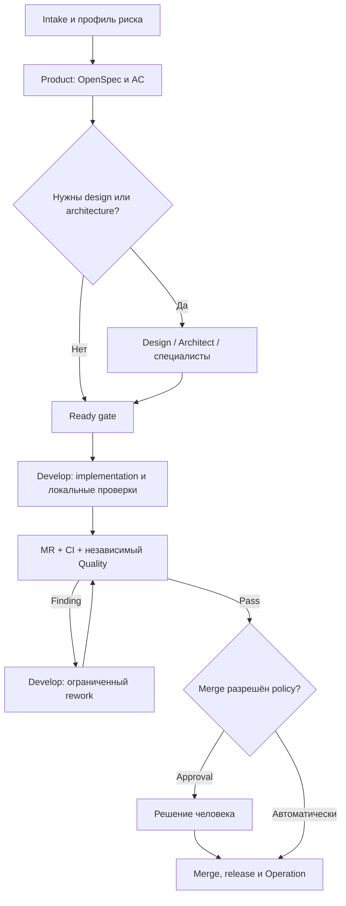

<!--
Источник: Notion — Целевая структура агентов и скиллов
URL: https://app.notion.com/p/3d3db33037c880c6aee2d49370893763
Выгружено: 2026-09-12
-->

# Целевая структура агентов и скиллов

Версия 0.2 · 12 сентября 2026 · Статус: целевая модель для MVP.

> **🎯 Решение:** Dark Factory использует девять ролевых профилей, адаптированных из AI-DLC, но не запускает их все для каждой задачи. Factory Flow выбирает только необходимые роли и skills по профилю изменения и риску. Оркестратор остаётся программным компонентом; PydanticAI — первым harness, Pydantic Graph — исполнителем TaskGraph внутри отдельной стадии.

Связанные документы: [HLD MVP](hld-mvp.md), [Агенты](agents.md), [Автономная разработка с использованием AIDLC и dmtools](autonomous-development-aidlc-dmtools.md), [Графы и PydenticAI](graphs-and-pydantic-ai.md).

## 1. Базовые понятия и границы

<table fit-page-width="true" header-row="true">
<tr>
<td>Сущность</td>
<td>Ответственность</td>
<td>Не должна делать</td>
</tr>
<tr>
<td>**Flow / Stage**</td>
<td>Определяет фазы, допустимые переходы, gates и режим автономности</td>
<td>Не скрывает переходы в prompt</td>
</tr>
<tr>
<td>**Agent Profile**</td>
<td>Задаёт роль, цель, доступный контекст, tools и ограничения</td>
<td>Не управляет полным жизненным циклом инициативы</td>
</tr>
<tr>
<td>**Skill**</td>
<td>Описывает повторяемый способ выполнить ограниченную работу</td>
<td>Не выдаёт полномочия и не принимает решение о merge</td>
</tr>
<tr>
<td>**Rule / Gate**</td>
<td>Фиксирует обязательный инвариант и проверяемое условие допуска</td>
<td>Не заменяется самооценкой LLM</td>
</tr>
<tr>
<td>**Reference**</td>
<td>Содержит стандарты, шаблоны и эталонные реализации</td>
<td>Не хранит состояние запуска</td>
</tr>
<tr>
<td>**Adapter / Tool**</td>
<td>Выполняет внешнее действие в GitLab, трекере, Notion или окружении</td>
<td>Не определяет бизнес-семантику процесса</td>
</tr>
<tr>
<td>**Harness**</td>
<td>Запускает агента с моделью, tools, контекстом и structured output</td>
<td>Не владеет Factory Flow</td>
</tr>
</table>

Создание branch/worktree, push, MR, комментария, merge и изменение статуса задачи — детерминированные операции адаптеров. Агент подготавливает решение или структурированный результат, но действие разрешает policy и выполняет код.

## 2. Целевые профили агентов

Выбранные роли основаны на AI-DLC и адаптируются под Dark Factory. Это **каталог профилей**, а не девять постоянно работающих процессов.

<table fit-page-width="true" header-row="true">
<tr>
<td>Профиль</td>
<td>Имя</td>
<td>Ответственность</td>
<td>Основные результаты</td>
<td>Условие подключения</td>
</tr>
<tr>
<td>**Product**</td>
<td>Kevin</td>
<td>Проблема, пользователи, scope, бизнес-сценарии и критерии приёмки</td>
<td>Product brief, OpenSpec proposal/delta, AC, открытые вопросы</td>
<td>Новая функция, неясные требования или изменение поведения</td>
</tr>
<tr>
<td>**Design**</td>
<td>Bob</td>
<td>UX-flow, состояния интерфейса, Small UIKit, адаптивность и accessibility</td>
<td>UI specification, состояния, visual references, критерии визуальной проверки</td>
<td>Новый/изменённый пользовательский сценарий; для простого UI может быть skill Develop</td>
</tr>
<tr>
<td>**Architect**</td>
<td>Stuart</td>
<td>Impact analysis, границы компонентов, контракты, данные, NFR и ADR</td>
<td>Solution outline, затронутые компоненты, contract changes, ADR при необходимости</td>
<td>Несколько систем, публичные контракты, новый pattern/technology или высокий риск</td>
</tr>
<tr>
<td>**Infrastructure**</td>
<td>Dave</td>
<td>Helm, Kubernetes/VM profile, ресурсы, конфигурация, наблюдаемость и rollback</td>
<td>Infrastructure change, deploy plan, environment evidence</td>
<td>Изменение инфраструктуры или требований к runtime</td>
</tr>
<tr>
<td>**Security**</td>
<td>Mel</td>
<td>Threat analysis, IAM, secrets, dependencies, trust boundaries и security gates</td>
<td>Security findings, controls, подтверждение или блокер</td>
<td>IAM, чувствительные данные, новые внешние интеграции или повышенный риск</td>
</tr>
<tr>
<td>**Develop**</td>
<td>Carl</td>
<td>Целостное изменение кода, тестов, миграций и технической документации</td>
<td>Changeset, локальные проверки, commit и готовность MR</td>
<td>Основной исполнитель Construction</td>
</tr>
<tr>
<td>**Quality**</td>
<td>Phil</td>
<td>Независимая проверка спецификации, diff, тестов и фактического поведения</td>
<td>Findings с severity/evidence, GateResult, acceptance result</td>
<td>Перед допуском; отдельный контекст от Develop</td>
</tr>
<tr>
<td>**CI/CD**</td>
<td>Tim</td>
<td>Pipeline, packaging, immutable image, GitOps MR и технические release gates</td>
<td>Pipeline change, artifact digest, release evidence</td>
<td>Изменение поставки или выпуск версии</td>
</tr>
<tr>
<td>**Operation**</td>
<td>Jerry</td>
<td>Smoke, наблюдаемость, анализ деградации, rollback/forward-fix и обратная связь</td>
<td>Release verdict, incident/finding, improvement proposal</td>
<td>После deploy и по эксплуатационным сигналам</td>
</tr>
</table>

Профили не равны моделям. Модель выбирается для конкретного задания; один профиль может выполняться разными моделями и harness. Для независимой проверки контекст Quality формируется заново из закреплённой спецификации, актуального diff и evidence.

## 3. Маршрутизация ролей

<table fit-page-width="true" header-row="true">
<tr>
<td>Профиль изменения</td>
<td>Обязательные роли</td>
<td>Условные роли</td>
</tr>
<tr>
<td>**quick** — локальный понятный дефект</td>
<td>Develop, Quality</td>
<td>Product при неоднозначности; CI/CD при изменении поставки</td>
</tr>
<tr>
<td>**standard** — функция внутри существующей архитектуры</td>
<td>Product, Develop, Quality</td>
<td>Design для UI; Architect для контрактов; CI/CD и Operation для deploy</td>
</tr>
<tr>
<td>**architecture** — межсервисное или платформенное изменение</td>
<td>Product, Architect, Develop, Quality</td>
<td>Design, Infrastructure, Security, CI/CD, Operation по impact/risk</td>
</tr>
<tr>
<td>**foundation** — изменение Factory, pack, rule или golden path</td>
<td>Product, Architect, Develop, Quality</td>
<td>Security, Infrastructure, CI/CD, Operation; обязательное независимое approval защищённых частей</td>
</tr>
</table>

Маленький объём не означает низкий риск: изменение IAM может идти по короткому flow, но всё равно требовать Security и человеческого approval. LLM может повысить класс риска; понижение допускается только формальной политикой.

## 4. Каталог skills для MVP

<table fit-page-width="true" header-row="true">
<tr>
<td>Группа</td>
<td>Минимальные skills</td>
<td>Основные профили</td>
</tr>
<tr>
<td>**Product и спецификация**</td>
<td>`intake`, `context-research`, `requirements-refinement`, `acceptance-design`, `openspec-change`</td>
<td>Product, Architect, Quality</td>
</tr>
<tr>
<td>**UX/UI**</td>
<td>`ux-flow`, `small-ui-design`, `responsive-design`, `accessibility-design`, `visual-review`</td>
<td>Design, Develop, Quality</td>
</tr>
<tr>
<td>**Архитектура**</td>
<td>`impact-analysis`, `solution-design`, `api-contract-design`, `event-contract-design`, `data-change-design`, `adr-authoring`</td>
<td>Architect, Develop, Quality</td>
</tr>
<tr>
<td>**Разработка**</td>
<td>`fastapi-service`, `react-small-ui`, `postgres-change`, `kafka-integration`, `iam-integration`, `implementation-rework`</td>
<td>Develop</td>
</tr>
<tr>
<td>**Проверка**</td>
<td>`spec-review`, `code-review`, `contract-testing`, `migration-validation`, `playwright-ui`, `security-review`, `acceptance-verification`</td>
<td>Quality, Security</td>
</tr>
<tr>
<td>**Поставка и эксплуатация**</td>
<td>`gitlab-mr`, `pipeline-design`, `helm-change`, `gitops-release`, `smoke-verification`, `rollback-analysis`, `incident-analysis`</td>
<td>CI/CD, Infrastructure, Operation</td>
</tr>
<tr>
<td>**Знания и улучшение**</td>
<td>`okf-context`, `okf-proposal`, `run-retrospective`, `rule-proposal`, `skill-evaluation`</td>
<td>Все профили по задаче</td>
</tr>
</table>

Для первого vertical slice реализуется не весь каталог, а минимальный набор: `intake`, `requirements-refinement`, `openspec-change`, `implementation`, `test`, `code-review`, `implementation-rework`, `gitlab-mr`, `acceptance-verification`, `gitops-release`. Технологические детали подключаются через engineering pack React + выбранный UI Kit + FastAPI + PostgreSQL.

### Контракт skill

Каждый skill обязан содержать:
- `id`, версию и владельца;
- назначение, применимость и противопоказания;
- требуемые capabilities и разрешённые tools;
- типизированные входы и выходы;
- алгоритм и точки принятия решений;
- критерии завершения и способы проверки;
- stop/escalation conditions;
- ссылки на канонические rules, templates, references и evals;
- changelog и совместимость с pack.

Один инвариант хранится в одном каноническом rule. Skills разработки и проверки ссылаются на него, а не копируют текст. Полномочия задаются runtime/policy, а не содержимым `SKILL.md`.

## 5. Слои skills и версионирование

<table fit-page-width="true" header-row="true">
<tr>
<td>Слой</td>
<td>Содержание</td>
<td>Модель распространения</td>
</tr>
<tr>
<td>**Factory / methodology**</td>
<td>AI-DLC phases, OpenSpec, review/rework, evidence, learning loop</td>
<td>Версия methodology pack</td>
</tr>
<tr>
<td>**Корпоративный Small**</td>
<td>IAM, API/Kafka, observability, security, Small UIKit, архитектурные инварианты</td>
<td>Версионируемый corporate pack</td>
</tr>
<tr>
<td>**Технологический**</td>
<td>FastAPI/Python, React, PostgreSQL, Helm/Kubernetes; позднее Go и другие stacks</td>
<td>Engineering packs с manifest совместимости</td>
</tr>
<tr>
<td>**Проектный**</td>
<td>Доменная модель, локальные ограничения и принятые решения продукта</td>
<td>В репозитории продукта</td>
</tr>
</table>

Run фиксирует версии Core, flow, agent profiles, skills/rules, engineering packs, provider/model, исходные SHA и ContextBundle. Обновление общего skill не должно менять уже начатый run.

## 6. Артефакты взаимодействия

Агенты не передают друг другу только пересказ. Оркестратор формирует типизированные envelopes и ссылки на версионированные артефакты.

<table fit-page-width="true" header-row="true">
<tr>
<td>Артефакт</td>
<td>Назначение</td>
</tr>
<tr>
<td>`ChangePackage`</td>
<td>`change_id`, scope, risk, repositories, component IDs, budget и разрешённые операции</td>
</tr>
<tr>
<td>`ContextBundle`</td>
<td>Источники из repo, OpenSpec, OKF и Notion с revision/hash/provenance</td>
</tr>
<tr>
<td>`TaskEnvelope`</td>
<td>Ограниченное задание для одного профиля, контракт результата и лимиты</td>
</tr>
<tr>
<td>`AgentResult`</td>
<td>Structured output, produced artifacts, assumptions, usage и status</td>
</tr>
<tr>
<td>`Finding`</td>
<td>Severity, evidence, affected requirement/location и требуемое действие</td>
</tr>
<tr>
<td>`GateResult`</td>
<td>Машинно проверяемое решение pass/fail/blocked для конкретного SHA</td>
</tr>
<tr>
<td>`StageResult / NextAction`</td>
<td>Checkpoint стадии и разрешённый следующий переход между GitLab jobs/pipelines</td>
</tr>
<tr>
<td>`RunSnapshot`</td>
<td>Полная воспроизводимая конфигурация запуска и совокупный бюджет</td>
</tr>
</table>

## 7. Основной автономный flow

Автономный цикл `задача → branch/worktree → implementation → MR → CI/review → rework → merge → deploy → smoke → tracker` заимствует проверенные паттерны dmtools-agents, но реализуется через собственные типизированные порты и GitLab-адаптеры. AI-DLC поставляет методологию, роли, стадии и артефакты; его runtime не становится вторым workflow engine.

Каждый цикл имеет общий лимит попыток, времени и стоимости. Новый SHA аннулирует предыдущий допуск. При исчерпании лимита, конфликте требований, недоступном источнике истины или запрете policy результат — `Blocked` с evidence, а не бесконечный повтор.

## 8. Human Off The Loop и защищённые решения

Человек в штатном потоке наблюдает спецификацию, preview, значимые изменения и evidence. Он создаёт новую задачу или корректирует scope, если замечает ошибку; читать полный диалог агентов не требуется.

Обязательное участие человека сохраняется для:
- неразрешённой бизнес-неоднозначности;
- изменения прав доступа, финансовой логики, чувствительных данных или несовместимого публичного контракта;
- сложной необратимой миграции;
- production release до появления доказанной политики автономного допуска;
- изменения runtime, обязательных gates, eval-набора, полномочий, budget policy и auto-merge policy самой Factory;
- принятия исключения из корпоративного правила.

Низкорисковые и повторяемые изменения могут выполняться и сливаться автоматически только после формальных gates и накопления измеренной статистики качества.

## 9. Learning loop

Рабочий агент может **предложить** изменение skill, prompt, route, rule или engineering pack, но не может незаметно применить его к действующему процессу.

1. Finding, инцидент, дорогой run или повторяющаяся ошибка становится eval-case.
2. Формируется `RuleProposal` или OpenSpec change с evidence и ожидаемым эффектом.
3. Кандидат сравнивается с закреплённой версией на фиксированном eval-наборе.
4. Измеряются success rate, escaped defects, rework, стоимость, latency и regressions.
5. Изменение проходит MR, независимый review и требуемое approval.
6. Новая версия pack вводится постепенно и фиксируется в новых RunSnapshot.

Защищённые eval и gates недоступны для изменения тем же агентом и тем же MR, результат которого они проверяют.

## 10. Решение для MVP

- Реализовать каталог всех девяти профилей, но начать сквозной сценарий с **Product → Develop → Quality**.
- Подключать Design, Architect, Infrastructure, Security, CI/CD и Operation по route/risk, а не постоянно.
- Использовать один Python Core; профили, skills и packs — версионируемые декларативные расширения, доверенные adapters — код того же релиза.
- Использовать PydanticAI как первый HarnessPort adapter и Pydantic Graph только для TaskGraph внутри стадии.
- Долгоживущий процесс сохранять через Git, MR, GitLab pipelines, StageResult/NextAction и ограниченный reconcile job; Temporal в MVP не нужен.
- В первом релизе сделать два маршрута: `quick` и `standard`; `architecture` и `foundation` оформить как расширения после vertical slice.
- Не создавать отдельных постоянных агентов для frontend/backend, DTO, repository, Kafka producer или unit tests: это skills и подзадачи Develop, пока измерения не докажут пользу отдельного контекста.

## 11. Критерии готовности этой модели

- Каждый профиль имеет versioned manifest, входы, выходы, tools, ограничения и evals.
- Каждая стадия имеет entry/exit criteria и возвращает `StageResult/NextAction`.
- AgentResult не может сам разрешить merge/deploy.
- Quality работает независимо и проверяет актуальный SHA.
- Skills не дублируют canonical rules.
- ContextBundle сохраняет provenance и версии OpenSpec/OKF/Notion.
- Rework и бюджет не обнуляются между pipelines.
- Изменение Factory проходит тем же OpenSpec/MR/CI flow, но через отдельные защищённые gates.
- Для каждого автоматического решения Console показывает основание, evidence и способ вмешательства человека.

## 12. Источники адаптации

- [AI-DLC — Introduction](https://github.com/awslabs/aidlc-workflows/blob/main/docs/guide/00-introduction.md)
- [AI-DLC — Agent Guide](https://github.com/awslabs/aidlc-workflows/tree/main/docs/guide/agents)
- [dmtools-agents](https://github.com/IstiN/dmtools-agents)
- [PydanticAI — Agents](https://ai.pydantic.dev/agents/)
- [Pydantic Graph](https://ai.pydantic.dev/graph/)
- [OpenSpec](https://github.com/Fission-AI/OpenSpec)

Названия ролей и состав ответственности здесь являются адаптацией для Dark Factory, а не буквальным копированием upstream. Перед переносом материалов необходимо закрепить commit, проверить лицензию и зафиксировать mapping исходных файлов на profiles/skills/rules Factory.
